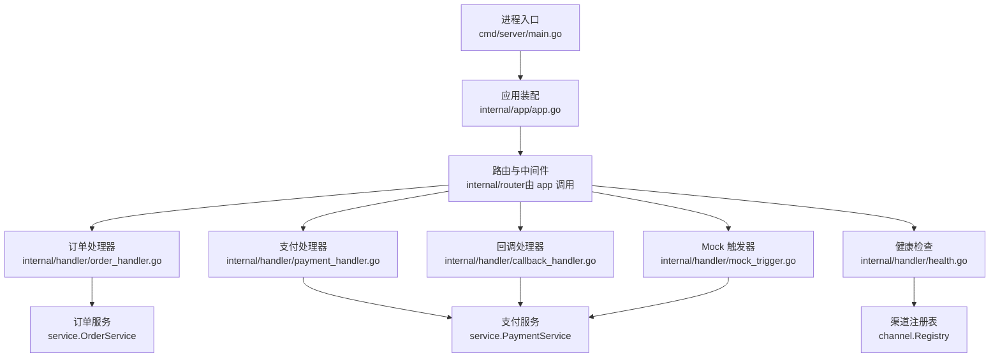
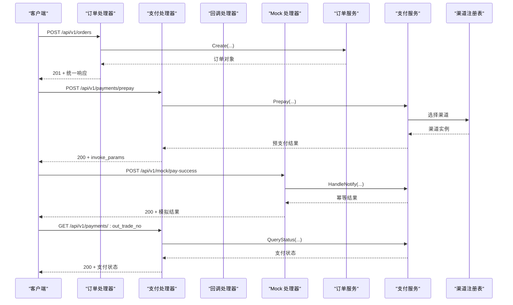
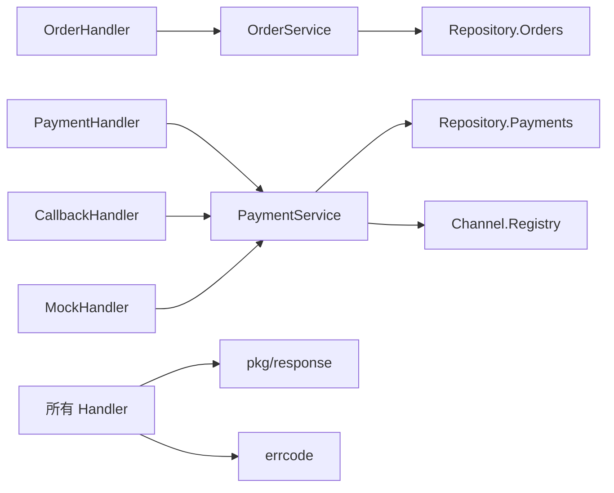

# API 接口文档

<cite>
**本文引用的文件**   
- [README.md](file://README.md)
- [main.go](file://cmd/server/main.go)
- [app.go](file://internal/app/app.go)
- [order_handler.go](file://internal/handler/order_handler.go)
- [payment_handler.go](file://internal/handler/payment_handler.go)
- [callback_handler.go](file://internal/handler/callback_handler.go)
- [health.go](file://internal/handler/health.go)
- [mock_trigger.go](file://internal/handler/mock_trigger.go)
- [response.go](file://internal/pkg/response/response.go)
- [errcode.go](file://internal/errcode/errcode.go)
- [payment.go](file://internal/dto/payment.go)
</cite>

## 目录
1. [简介](#简介)
2. [项目结构](#项目结构)
3. [核心组件](#核心组件)
4. [架构总览](#架构总览)
5. [接口规范](#接口规范)
6. [详细接口说明](#详细接口说明)
7. [依赖关系分析](#依赖关系分析)
8. [性能与稳定性建议](#性能与稳定性建议)
9. [故障排查指南](#故障排查指南)
10. [结论](#结论)

## 简介
本服务是一个基于 Go 与 Gin 的支付接入骨架，当前以内存仓储和 mock 渠道跑通「下单 → 发起支付 → 渠道回调 → 查单」全链路。对外暴露统一的 RESTful API，涵盖订单管理、支付处理、渠道回调、健康检查与调试 Mock 能力。统一响应体使用业务码 `code` 与 HTTP 状态码共同表达结果；渠道异步回调接口则遵循渠道自身规范，不采用统一响应体。

## 项目结构
服务入口负责解析参数、加载配置、装配依赖、启动 HTTP 服务并优雅关闭；HTTP 路由由装配层组装 handler 后注册；业务逻辑下沉到 service 层，数据访问通过 repository 抽象；渠道差异收敛在 channel 抽象层。



**图表来源**
- [main.go:31-124](file://cmd/server/main.go#L31-L124)
- [app.go:45-105](file://internal/app/app.go#L45-L105)
- [order_handler.go:13-78](file://internal/handler/order_handler.go#L13-L78)
- [payment_handler.go:16-118](file://internal/handler/payment_handler.go#L16-L118)
- [callback_handler.go:34-86](file://internal/handler/callback_handler.go#L34-L86)
- [health.go:24-78](file://internal/handler/health.go#L24-L78)
- [mock_trigger.go:29-117](file://internal/handler/mock_trigger.go#L29-L117)

**章节来源**
- [main.go:1-124](file://cmd/server/main.go#L1-L124)
- [app.go:1-200](file://internal/app/app.go#L1-L200)

## 核心组件
- 统一响应体：所有业务接口返回包含 `code`、`message`、`data`、`request_id` 的结构，成功时 `code=0`。
- 错误码体系：按通用错误、订单错误、支付错误、渠道错误分段定义，每个错误绑定 HTTP 状态码。
- 渠道回调特殊响应：微信等渠道要求返回 `{"code":"SUCCESS"}` 或 `{"code":"FAIL"}`，不走统一响应体。
- 鉴权与限流：当前版本未实现鉴权与限流，生产环境需自行补充网关或中间件。

**章节来源**
- [response.go:1-133](file://internal/pkg/response/response.go#L1-L133)
- [errcode.go:1-158](file://internal/errcode/errcode.go#L1-L158)
- [callback_handler.go:14-26](file://internal/handler/callback_handler.go#L14-L26)
- [README.md:292-293](file://README.md#L292-L293)

## 架构总览
下图展示一次典型「创建订单 → 发起支付 → 模拟回调 → 查询支付状态」的请求链路与组件交互。



**图表来源**
- [order_handler.go:23-59](file://internal/handler/order_handler.go#L23-L59)
- [payment_handler.go:26-84](file://internal/handler/payment_handler.go#L26-L84)
- [callback_handler.go:44-86](file://internal/handler/callback_handler.go#L44-L86)
- [mock_trigger.go:43-117](file://internal/handler/mock_trigger.go#L43-L117)
- [app.go:85-95](file://internal/app/app.go#L85-L95)

## 接口规范
### 统一响应体
所有业务接口默认返回如下结构：

| 字段 | 类型 | 含义 |
|---|---|---|
| `code` | int | 业务码，`0` 表示成功 |
| `message` | string | 人类可读消息 |
| `data` | any | 业务数据，可能为对象或数组 |
| `request_id` | string | 请求追踪 ID，贯穿日志与响应头 |

成功响应示例：
```json
{
  "code": 0,
  "message": "ok",
  "data": {},
  "request_id": "a1b2c3d4"
}
```

失败响应示例：
```json
{
  "code": 10001,
  "message": "请求参数不合法",
  "request_id": "a1b2c3d4"
}
```

注意：
- HTTP 状态码与业务码同时存在：网关与监控看 HTTP 状态码，客户端做业务分支看 `code`。
- 渠道回调接口不使用统一响应体，详见「渠道回调接口」。

**章节来源**
- [response.go:1-41](file://internal/pkg/response/response.go#L1-L41)
- [README.md:77-83](file://README.md#L77-L83)

### 鉴权要求
当前版本未实现鉴权。生产环境应通过网关或中间件增加签名校验、Token 校验、来源白名单等机制。

**章节来源**
- [README.md:292-293](file://README.md#L292-L293)

### 限流策略
当前版本未实现限流。生产环境建议在网关层对高频接口（如轮询支付状态）设置速率限制，避免触发渠道侧限流。

**章节来源**
- [README.md:292-293]

### 最佳实践建议
- 前端轮询支付状态时不要每次强制同步渠道，优先读取本地状态；仅在回调延迟时使用 `sync=true`。
- 金额字段对外使用字符串「元」，内部统一用「分」存储，避免浮点精度问题。
- 回调接口必须验签与解密，失败时返回渠道规范的失败响应，不要让渠道持续重试。
- 不要在日志中打印密钥、证书内容与完整回调报文。

**章节来源**
- [payment_handler.go:53-84](file://internal/handler/payment_handler.go#L53-L84)
- [README.md:203-213](file://README.md#L203-L213)
- [README.md:240-246](file://README.md#L240-L246)

## 详细接口说明

### 订单管理接口

#### 创建订单
- **方法**: `POST`
- **URL**: `/api/v1/orders`
- **鉴权**: 当前无鉴权
- **请求体**: JSON

| 字段 | 类型 | 必填 | 说明 |
|---|---|---:|---|
| `subject` | string | 是 | 商品标题 |
| `amount` | string | 是 | 金额，单位「元」，最多两位小数 |
| `channel` | string | 否 | 支付渠道，留空使用默认渠道 |
| `openid` | string | 否 | 支付者 openid |
| `attach` | string | 否 | 附加信息 |

- **成功响应**: HTTP `201 Created`，`data` 为订单对象。
- **失败响应**: HTTP `400` 或业务错误码，`data` 可能为空。

请求示例：
```json
{
  "subject": "测试商品",
  "amount": "19.99",
  "openid": "oTest123456"
}
```

响应示例：
```json
{
  "code": 0,
  "message": "ok",
  "data": {
    "out_trade_no": "M202501010001",
    "status": "CREATED",
    "amount": "19.99",
    "amount_fen": 1999
  },
  "request_id": "a1b2c3d4"
}
```

常见错误：
- `10001`：请求参数不合法
- `20003`：订单金额不合法
- `40001`：支付渠道未注册

**章节来源**
- [order_handler.go:23-59](file://internal/handler/order_handler.go#L23-L59)
- [payment.go:1-25](file://internal/dto/payment.go#L1-L25)
- [errcode.go:78-110](file://internal/errcode/errcode.go#L78-L110)

#### 查询订单
- **方法**: `GET`
- **URL**: `/api/v1/orders/:out_trade_no`
- **路径参数**:
  - `out_trade_no`: 商户订单号
- **成功响应**: HTTP `200 OK`，`data` 为订单对象。
- **失败响应**: HTTP `404` 或业务错误码。

请求示例：
```
GET /api/v1/orders/M202501010001
```

响应示例：
```json
{
  "code": 0,
  "message": "ok",
  "data": {
    "out_trade_no": "M202501010001",
    "status": "PAYING",
    "amount": "19.99",
    "amount_fen": 1999
  },
  "request_id": "a1b2c3d4"
}
```

常见错误：
- `20001`：订单不存在

**章节来源**
- [order_handler.go:62-78](file://internal/handler/order_handler.go#L62-L78)
- [errcode.go:98-110](file://internal/errcode/errcode.go#L98-L110)

### 支付处理接口

#### 发起支付
- **方法**: `POST`
- **URL**: `/api/v1/payments/prepay`
- **鉴权**: 当前无鉴权
- **请求体**: JSON

| 字段 | 类型 | 必填 | 说明 |
|---|---|---:|---|
| `out_trade_no` | string | 是 | 商户订单号 |
| `channel` | string | 否 | 支付渠道，留空使用订单创建时的渠道 |
| `trade_type` | string | 否 | 交易类型，JSAPI/NATIVE/H5/APP |
| `openid` | string | 否 | 支付者 openid，JSAPI 交易至少需要一个 |

- **成功响应**: HTTP `200 OK`，`data` 包含前端调起支付所需参数。
- **失败响应**: HTTP `400` 或业务错误码。

请求示例：
```json
{
  "out_trade_no": "M202501010001",
  "trade_type": "JSAPI"
}
```

响应示例：
```json
{
  "code": 0,
  "message": "ok",
  "data": {
    "out_trade_no": "M202501010001",
    "payment_no": "P202501010001",
    "channel": "mock",
    "trade_type": "JSAPI",
    "invoke_params": {
      "paySign": "MOCK_PAY_SIGN_NOT_FOR_PRODUCTION"
    }
  },
  "request_id": "a1b2c3d4"
}
```

常见错误：
- `30003`：缺少支付者 openid
- `30004`：支付渠道未启用
- `40002`：支付渠道调用失败

**章节来源**
- [payment_handler.go:26-50](file://internal/handler/payment_handler.go#L26-L50)
- [payment.go:9-58](file://internal/dto/payment.go#L9-L58)
- [errcode.go:112-134](file://internal/errcode/errcode.go#L112-L134)

#### 查询支付状态
- **方法**: `GET`
- **URL**: `/api/v1/payments/:out_trade_no`
- **查询参数**:
  - `sync`: 布尔值，支持 `true`/`1`/`yes`/`on`，强制向渠道查单后返回
- **成功响应**: HTTP `200 OK`，`data` 为支付状态对象。
- **失败响应**: HTTP `404` 或业务错误码。

请求示例：
```
GET /api/v1/payments/M202501010001?sync=true
```

响应示例：
```json
{
  "code": 0,
  "message": "ok",
  "data": {
    "out_trade_no": "M202501010001",
    "order_status": "PAID",
    "paid": true,
    "amount": "19.99",
    "amount_fen": 1999,
    "payments": [
      {
        "payment_no": "P202501010001",
        "channel": "mock",
        "trade_type": "JSAPI",
        "status": "SUCCESS",
        "amount": "19.99",
        "amount_fen": 1999
      }
    ]
  },
  "request_id": "a1b2c3d4"
}
```

常见错误：
- `30001`：支付记录不存在

**章节来源**
- [payment_handler.go:53-118](file://internal/handler/payment_handler.go#L53-L118)
- [payment.go:60-112](file://internal/dto/payment.go#L60-L112)
- [errcode.go:112-122](file://internal/errcode/errcode.go#L112-L122)

### 渠道回调接口

#### 微信支付回调
- **方法**: `POST`
- **URL**: `/api/v1/callbacks/wechatpay`
- **鉴权**: 渠道侧验签与加密，服务端需验签解密
- **请求体**: 渠道通知报文（JSON 或 XML，取决于渠道实现）
- **响应体**: 渠道规范响应，非统一响应体

成功响应：
```json
{
  "code": "SUCCESS",
  "message": "成功"
}
```

失败响应：
```json
{
  "code": "FAIL",
  "message": "失败原因"
}
```

注意：
- 若返回统一响应体 `{"code":0,"message":"ok"}`，渠道会判定通知失败并按固定间隔重试。
- 金额不一致与验签失败属于资金与安全事件，需人工介入。
- 幂等命中也返回 `SUCCESS`，因为本地状态已正确，无需渠道继续重试。

**章节来源**
- [callback_handler.go:14-86](file://internal/handler/callback_handler.go#L14-L86)
- [README.md:83-83](file://README.md#L83-L83)

### 健康检查接口

#### 存活探针
- **方法**: `GET`
- **URL**: `/healthz`
- **成功响应**: HTTP `200 OK`，`data.status = "ok"`
- **失败响应**: 通常不会失败，除非进程异常

响应示例：
```json
{
  "code": 0,
  "message": "ok",
  "data": {
    "status": "ok"
  },
  "request_id": "a1b2c3d4"
}
```

**章节来源**
- [health.go:36-47](file://internal/handler/health.go#L36-L47)

#### 就绪探针
- **方法**: `GET`
- **URL**: `/readyz`
- **成功响应**: HTTP `200 OK`，`data.status = "ready"`，包含可用渠道列表、运行时长与订单数。
- **失败响应**: HTTP `503 Service Unavailable`，当没有可用支付渠道时返回。

成功响应示例：
```json
{
  "code": 0,
  "message": "ok",
  "data": {
    "status": "ready",
    "channels": ["mock"],
    "uptime_seconds": 120,
    "order_count": 5
  },
  "request_id": "a1b2c3d4"
}
```

失败响应示例：
```json
{
  "code": 40001,
  "message": "没有可用的支付渠道，服务未就绪",
  "request_id": "a1b2c3d4"
}
```

**章节来源**
- [health.go:49-78](file://internal/handler/health.go#L49-L78)
- [errcode.go:124-134](file://internal/errcode/errcode.go#L124-L134)

### Mock 接口

#### 模拟支付成功回调
- **方法**: `POST`
- **URL**: `/api/v1/mock/pay-success`
- **鉴权**: 当前无鉴权
- **请求体**: JSON

| 字段 | 类型 | 必填 | 说明 |
|---|---|---:|---|
| `out_trade_no` | string | 是 | 商户订单号 |
| `transaction_id` | string | 否 | 模拟渠道交易号，留空自动生成 |
| `amount_fen` | int64 | 否 | 模拟回调金额（分），留 0 表示与订单金额一致 |
| `openid` | string | 否 | 模拟付款用户 openid，留空回退到订单 openid |

- **成功响应**: HTTP `200 OK`，`data` 为模拟回调结果。
- **失败响应**: HTTP `400` 或业务错误码。

请求示例：
```json
{
  "out_trade_no": "M202501010001",
  "amount_fen": 1999
}
```

响应示例：
```json
{
  "code": 0,
  "message": "ok",
  "data": {
    "out_trade_no": "M202501010001",
    "order_status": "PAID",
    "paid": true,
    "transaction_id": "MOCKTXN1234567890",
    "idempotent": false
  },
  "request_id": "a1b2c3d4"
}
```

常见错误：
- `30002`：回调金额与订单金额不一致
- `20001`：订单不存在

安全注意：
- 该接口仅在非 release 模式注册，生产环境暴露等同于允许任意订单被标记为已支付。

**章节来源**
- [mock_trigger.go:29-117](file://internal/handler/mock_trigger.go#L29-L117)
- [payment.go:114-141](file://internal/dto/payment.go#L114-L141)
- [errcode.go:112-122](file://internal/errcode/errcode.go#L112-L122)
- [README.md:240-243](file://README.md#L240-L243)

## 依赖关系分析
各 handler 依赖 service 层，service 层依赖 repository 与 channel 抽象层；统一响应体与错误码贯穿整个调用链。



**图表来源**
- [order_handler.go:13-78](file://internal/handler/order_handler.go#L13-L78)
- [payment_handler.go:16-118](file://internal/handler/payment_handler.go#L16-L118)
- [callback_handler.go:34-86](file://internal/handler/callback_handler.go#L34-L86)
- [mock_trigger.go:29-117](file://internal/handler/mock_trigger.go#L29-L117)
- [response.go:1-133](file://internal/pkg/response/response.go#L1-L133)
- [errcode.go:1-158](file://internal/errcode/errcode.go#L1-L158)

**章节来源**
- [app.go:69-95](file://internal/app/app.go#L69-L95)

## 性能与稳定性建议
- 轮询支付状态时优先读本地数据，避免频繁调用渠道导致限流。
- 回调接口具备幂等保护，但高并发下仍需注意数据库与渠道侧压力。
- 金额计算全程使用「分」整数，避免浮点误差。
- request_id 贯穿日志与响应，便于定位慢请求与异常链路。
- 优雅关闭确保存量回调请求处理完成，避免掉单。

**章节来源**
- [payment_handler.go:53-84](file://internal/handler/payment_handler.go#L53-L84)
- [README.md:193-213](file://README.md#L193-L213)
- [main.go:69-117](file://cmd/server/main.go#L69-L117)

## 故障排查指南
- 参数错误：检查 `code=10001` 或 `10002`，确认 JSON 结构与字段类型。
- 订单不存在：检查 `code=20001`，确认 `out_trade_no` 是否正确。
- 订单状态不允许操作：检查 `code=20002`，确认订单是否已支付或已关闭。
- 金额不一致：检查 `code=30002`，核对回调金额与订单金额。
- 渠道未注册：检查 `code=40001`，确认渠道是否启用且实现。
- 渠道调用失败：检查 `code=40002`，查看网络、超时与渠道返回。
- 回调验签失败：检查 `code=40003`，确认证书、公钥与 APIv3 密钥配置。

**章节来源**
- [errcode.go:78-134](file://internal/errcode/errcode.go#L78-L134)
- [callback_handler.go:55-86](file://internal/handler/callback_handler.go#L55-L86)

## 结论
本服务提供了完整的 RESTful API 骨架，覆盖订单、支付、回调、健康检查与 Mock 调试。统一响应体与错误码体系清晰，渠道回调接口遵循渠道规范。当前版本未实现鉴权与限流，生产环境需自行补充。建议在生产部署前完成真实渠道接入、持久化、测试与安全防护。