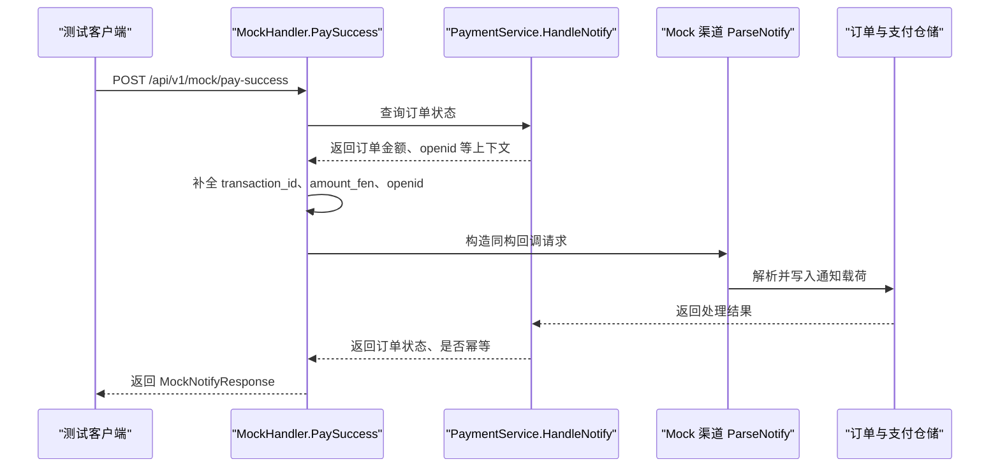

# Mock 测试接口

<cite>
**本文引用的文件**   
- [README.md](file://README.md)
- [mock_trigger.go](file://internal/handler/mock_trigger.go)
- [payment.go](file://internal/dto/payment.go)
- [app.go](file://internal/app/app.go)
- [config.yaml](file://configs/config.yaml)
</cite>

## 目录
1. [简介](#简介)
2. [接口概览](#接口概览)
3. [请求参数说明](#请求参数说明)
4. [响应结果说明](#响应结果说明)
5. [触发机制与内部流程](#触发机制与内部流程)
6. [端到端测试用例](#端到端测试用例)
7. [常见测试场景](#常见测试场景)
8. [生产环境禁用与安全注意事项](#生产环境禁用与安全注意事项)
9. [自动化测试集成方案](#自动化测试集成方案)
10. [故障排查](#故障排查)
11. [结论](#结论)

## 简介
本文件面向开发、测试与运维人员，详细说明 `POST /api/v1/mock/pay-success` 这个 Mock 测试接口的用途、参数、行为、安全边界以及如何在测试环境中进行端到端验证。该接口用于模拟第三方支付渠道的异步支付成功回调，帮助在不接入真实支付渠道的情况下，跑通「下单 → 发起支付 → 模拟回调 → 查单」的全链路逻辑。

该接口属于调试能力，仅在非 release 模式下注册；在生产环境暴露该接口等同于允许任意订单被标记为已支付，因此必须严格禁止。

**章节来源**
- [README.md:64-83](file://README.md#L64-L83)
- [README.md:240-246](file://README.md#L240-L246)

## 接口概览
| 项目 | 内容 |
|---|---|
| 方法 | `POST` |
| 路径 | `/api/v1/mock/pay-success` |
| 用途 | 模拟一次支付成功回调，驱动订单从待支付状态推进到已支付状态 |
| 适用环境 | 开发、测试等非 release 模式；release 模式不注册该路由 |
| 典型前置步骤 | 先创建订单并发起支付，使订单处于可被回调推进的状态 |
| 幂等行为 | 重复调用会命中幂等分支，不会重复推进订单状态 |
| 金额校验 | 若传入金额与订单金额不一致，会返回业务错误，阻止异常回调生效 |

该接口在 README 的接口清单中被明确列为“仅非 release 模式注册”的调试接口。

**章节来源**
- [README.md:75](file://README.md#L75)
- [mock_trigger.go:29-33](file://internal/handler/mock_trigger.go#L29-L33)

## 请求参数说明
Mock 接口的请求体使用 JSON，对应结构为 `MockPaySuccessRequest`。字段含义如下：

| 字段 | 类型 | 必填 | 默认行为 | 说明 |
|---|---|---:|---|---|
| `out_trade_no` | 字符串 | 是 | 无 | 目标商户订单号，最大长度 32 |
| `transaction_id` | 字符串 | 否 | 自动生成 | 模拟的渠道交易号；留空时服务会生成以固定前缀开头的值 |
| `amount_fen` | 整数 | 否 | 使用订单金额 | 模拟回调中的金额（单位：分）；留 0 表示与订单金额一致 |
| `openid` | 字符串 | 否 | 使用订单中的 openid | 模拟付款用户的 openid，最大长度 128 |

关键规则：
- 如果未传 `amount_fen`，服务端会从订单中读取订单金额作为回调金额。
- 如果未传 `transaction_id`，服务端会生成一个便于识别的模拟交易号。
- 如果未传 `openid`，服务端会从订单记录中补齐。
- 如果显式传入的 `amount_fen` 与订单金额不一致，后续金额校验会拒绝该回调。

**章节来源**
- [payment.go:114-131](file://internal/dto/payment.go#L114-L131)
- [mock_trigger.go:60-78](file://internal/handler/mock_trigger.go#L60-L78)

## 响应结果说明
接口成功时返回统一业务响应体，其中 `data` 为 `MockNotifyResponse`：

| 字段 | 类型 | 含义 |
|---|---|---|
| `out_trade_no` | 字符串 | 本次处理的商户订单号 |
| `order_status` | 字符串 | 处理后的订单状态，例如 `CREATED`、`PAYING`、`PAID`、`CLOSED` |
| `paid` | 布尔值 | 订单是否已进入已支付状态 |
| `transaction_id` | 字符串 | 最终落库或回显的交易号；可能来自请求，也可能由服务生成 |
| `idempotent` | 布尔值 | 是否为幂等命中；`true` 表示本次回调没有重复推进订单状态 |

注意：
- 即使幂等命中，只要本地状态正确，接口仍应视为成功，不应让调用方误判为失败。
- `idempotent=false` 表示本次回调真正触发了状态推进。
- 如果订单不存在、金额不一致或缺少必要信息，会返回业务错误码，而不是普通成功响应。

**章节来源**
- [payment.go:133-141](file://internal/dto/payment.go#L133-L141)
- [mock_trigger.go:110-116](file://internal/handler/mock_trigger.go#L110-L116)

## 触发机制与内部流程
`/api/v1/mock/pay-success` 并不是直接修改数据库，而是构造一份与真实渠道回调同构的 HTTP 请求，再走统一的 `HandleNotify` 流程。这样做的好处是：
- mock 渠道的报文解析逻辑会被执行；
- 真实渠道接入时，这部分解析逻辑需要被替换或覆盖，提前走一遍能减少接入风险；
- 回调幂等、金额校验、状态机推进等核心逻辑与真实回调保持一致。

**图表来源**
- [mock_trigger.go:43-116](file://internal/handler/mock_trigger.go#L43-L116)

**章节来源**
- [mock_trigger.go:20-50](file://internal/handler/mock_trigger.go#L20-L50)
- [mock_trigger.go:51-116](file://internal/handler/mock_trigger.go#L51-L116)

## 端到端测试用例
以下用例基于仓库 README 中的演示流程整理，适合在本地 debug 模式下运行。

### 基础成功用例
1. 创建订单，金额为字符串元，例如 `19.99`。
2. 发起支付，拿到前端调起参数。
3. 调用 Mock 接口，传入上一步的 `out_trade_no`。
4. 查询支付状态，确认订单状态变为已支付，支付流水状态为成功。
5. 再次调用 Mock 接口，确认 `idempotent=true`，订单不会被重复推进。

该流程在 README 中给出了完整的 curl 示例，包括下单、预支付、模拟回调和查单。

**章节来源**
- [README.md:85-116](file://README.md#L85-L116)

### 金额不一致用例
1. 创建一个正常订单。
2. 调用 Mock 接口，但传入很小的 `amount_fen`，例如 `1`。
3. 预期返回业务错误，HTTP 状态码为 400，业务码与金额不一致相关。
4. 订单状态应保持为支付中，而不是被错误地标记为已支付。

该用例用于验证“回调金额与订单金额不一致”这条资金防线。

**章节来源**
- [README.md:118-134](file://README.md#L118-L134)

### 并发幂等用例
1. 创建一个订单并发起支付。
2. 同时发起多次 Mock 回调请求。
3. 只应有一次回调真正推进订单状态，其余请求应命中幂等分支。
4. 可通过日志或查询接口验证最终状态只推进一次。

该用例用于验证并发场景下的回调幂等性。

**章节来源**
- [README.md:131-134](file://README.md#L131-L134)

## 常见测试场景
| 场景 | 输入要点 | 期望结果 |
|---|---|---|
| 正常支付成功 | 传入有效 `out_trade_no`，不传 `amount_fen` | 订单从 `PAYING` 推进到 `PAID`，`paid=true` |
| 指定交易号 | 传入自定义 `transaction_id` | 响应中返回该交易号 |
| 指定 openid | 传入自定义 `openid` | 回调中使用该 openid |
| 金额一致 | `amount_fen` 等于订单金额 | 回调通过 |
| 金额不一致 | `amount_fen` 不等于订单金额 | 返回金额不一致错误 |
| 重复回调 | 对同一订单多次调用 | 第二次及以后 `idempotent=true` |
| 订单不存在 | 传入无效 `out_trade_no` | 返回资源不存在或订单不存在错误 |
| 订单已关闭 | 订单状态不允许回调推进 | 返回状态不允许操作错误 |
| 订单已支付 | 对已支付订单再次回调 | 幂等命中，不重复推进 |

这些场景覆盖了 Mock 接口的主要验证目标：状态机、幂等、金额校验、交易号与用户标识填充。

**章节来源**
- [payment.go:114-141](file://internal/dto/payment.go#L114-L141)
- [mock_trigger.go:60-116](file://internal/handler/mock_trigger.go#L60-L116)

## 生产环境禁用与安全注意事项
### 为什么不能在生产启用
`/api/v1/mock/pay-success` 能把任意订单改成已支付。如果暴露在生产环境，攻击者可以伪造支付成功，绕过真实支付渠道，造成资金损失。因此该接口的开关不是“最佳实践”，而是“硬性要求”。

### 如何确保禁用
- 配置 `server.mode=release` 时，服务不会注册 mock 路由。
- 装配层在构建路由时根据 `!cfg.IsRelease()` 决定是否启用 mock 路由。
- 渠道注册表在非 release 模式下才注册 mock 渠道；release 模式下 mock 渠道不可用。
- README 明确指出：release 下不注册 `/api/v1/mock/*` 调试接口。

### 其他安全约束
- 回调必须验签：mock 渠道跳过验签，真实实现必须在 `ParseNotify` 中完成验签与解密。
- 报文优先于内部记录：不能直接用内部订单金额覆盖回调报文中的金额，否则会绕过金额校验。
- 日志不得打印密钥、证书内容与完整回调报文。
- 证书目录 `certs/` 被多层排除，严禁提交进仓库或镜像层。

**章节来源**
- [README.md:240-246](file://README.md#L240-L246)
- [app.go:90-94](file://internal/app/app.go#L90-L94)
- [app.go:112-121](file://internal/app/app.go#L112-L121)
- [config.yaml:9-13](file://configs/config.yaml#L9-L13)

## 自动化测试集成方案
### 单元测试建议
- 针对 `MockHandler.PaySuccess` 的请求绑定、参数校验、订单查询失败、内部请求构造、通知处理结果映射等分支编写用例。
- 使用内存仓储或可替换的仓储实现，避免依赖外部进程。
- 重点断言：
  - 订单不存在时返回业务错误；
  - 金额不一致时返回业务错误；
  - 首次回调 `idempotent=false`；
  - 重复回调 `idempotent=true`；
  - 未传 `transaction_id` 时生成可识别的交易号；
  - 未传 `amount_fen` 时使用订单金额；
  - 未传 `openid` 时使用订单中的 openid。

### 集成测试建议
- 启动服务后，按 README 的全链路演示顺序执行：
  1. 创建订单；
  2. 发起支付；
  3. 调用 Mock 接口；
  4. 查询支付状态；
  5. 再次调用 Mock 接口验证幂等。
- 使用独立的测试数据库或内存仓储实例，避免污染真实数据。
- 将 Mock 接口调用封装为测试工具函数，方便不同测试套件复用。

### CI 流水线建议
- 在测试阶段编译并启动服务。
- 等待健康检查就绪后再执行接口测试。
- 分别执行正常回调、金额不一致、重复回调、并发回调等用例。
- 收集日志与覆盖率，失败时保留 request_id 对应的日志片段。

**章节来源**
- [README.md:85-134](file://README.md#L85-L134)
- [mock_trigger.go:51-116](file://internal/handler/mock_trigger.go#L51-L116)

## 故障排查
### 常见问题
| 现象 | 可能原因 | 排查建议 |
|---|---|---|
| 请求 404 | 当前模式为 release，mock 路由未注册 | 检查 `server.mode`，确认不是 release |
| 订单不存在 | `out_trade_no` 错误或订单尚未创建 | 先调用下单接口，再使用返回的订单号 |
| 金额不一致错误 | `amount_fen` 与订单金额不同 | 不传 `amount_fen` 或使用订单金额 |
| 订单状态未变化 | 订单已关闭、已支付或状态不允许回调 | 查询订单状态，确认处于可回调状态 |
| 重复回调未报错 | 幂等命中 | 检查响应中 `idempotent=true` |
| 并发回调状态只推进一次 | 幂等保护生效 | 查看日志中 request_id 与回调处理记录 |

### 错误码参考
部分与 Mock 接口相关的错误码包括：
- `10001`：请求参数不合法；
- `10002`：请求无法解析；
- `20001`：订单不存在；
- `20002`：订单状态不允许该操作；
- `20004`：订单已关闭；
- `20005`：订单已支付；
- `30002`：支付金额与订单金额不一致；
- `40001`：支付渠道未注册；
- `40002`：支付渠道调用失败；
- `40003`：支付回调验签或解密失败。

客户端应根据 `code` 做分支，不要对 `message` 做字符串匹配。

**章节来源**
- [README.md:136-160](file://README.md#L136-L160)
- [mock_trigger.go:51-116](file://internal/handler/mock_trigger.go#L51-L116)

## 结论
`POST /api/v1/mock/pay-success` 是一个面向开发与测试环境的调试接口，用于模拟第三方支付成功回调，帮助快速验证订单状态机、回调幂等、金额校验与端到端流程。它的设计目标是让 mock 渠道的解析与处理路径尽可能贴近真实渠道，从而降低接入真实支付渠道时的风险。

使用时必须严格遵守以下原则：
- 仅在非 release 模式使用；
- 不在生产环境暴露该接口；
- 结合下单、预支付、查单接口进行完整链路验证；
- 覆盖金额不一致、重复回调、并发回调等关键场景；
- 在自动化测试中稳定复用该接口，提高回归效率。