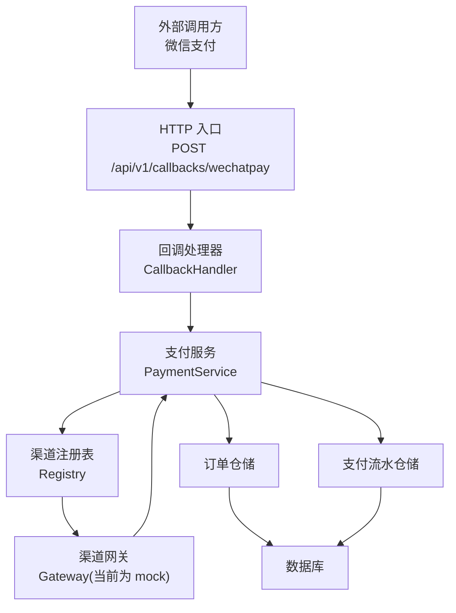
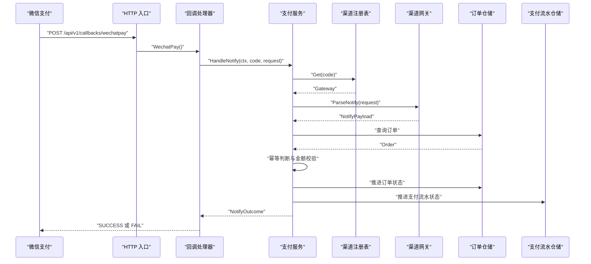
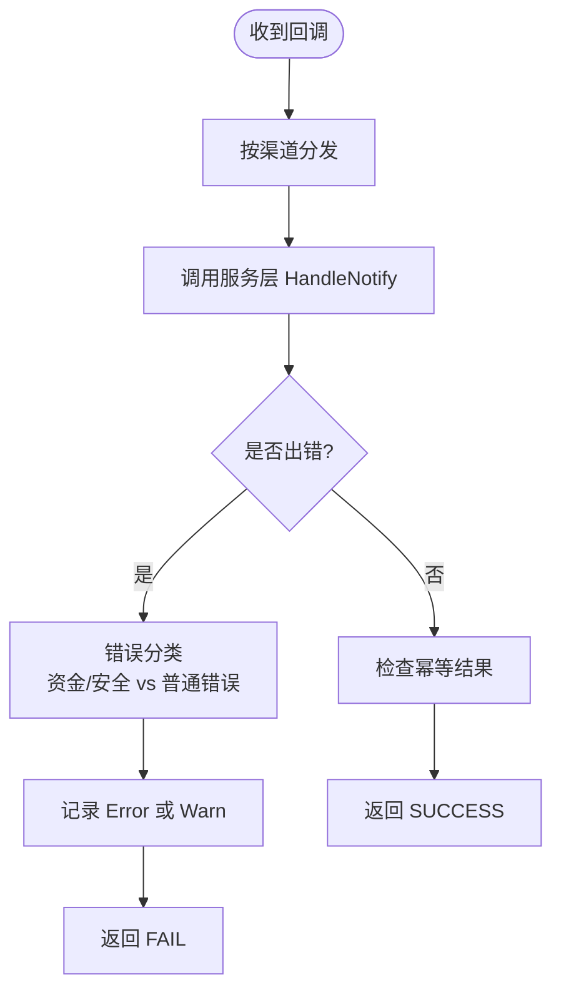
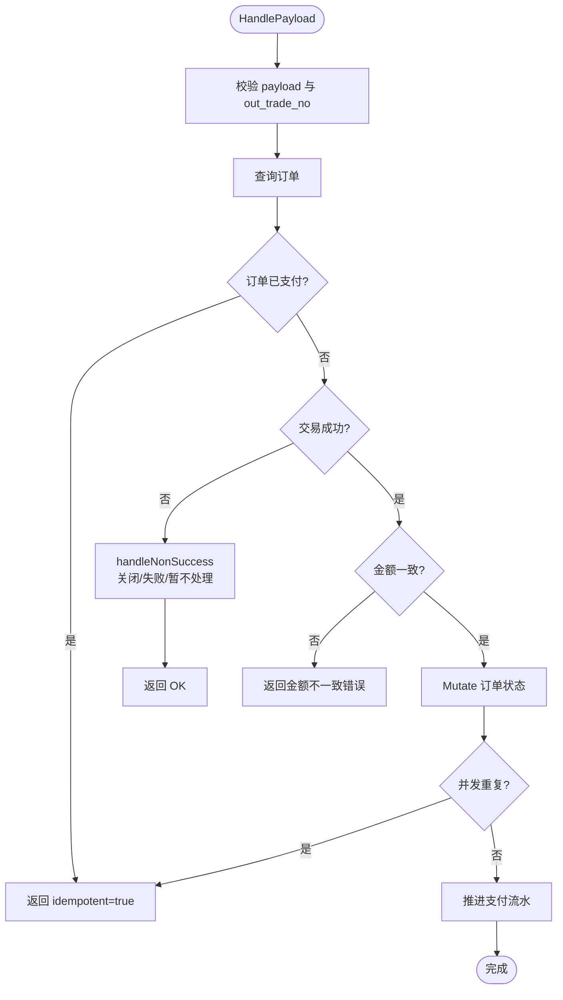
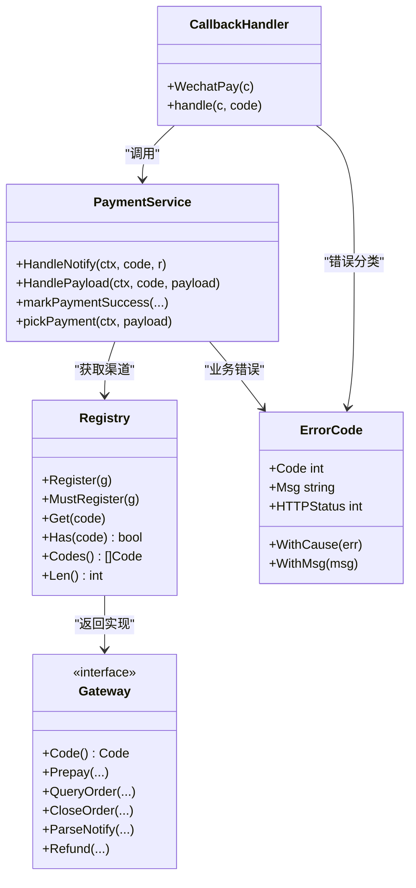

# 回调处理接口

<cite>
**本文引用的文件**   
- [callback_handler.go](file://internal/handler/callback_handler.go)
- [payment_service.go](file://internal/service/payment_service.go)
- [doc.go](file://internal/channel/wechatpay/doc.go)
- [registry.go](file://internal/channel/registry.go)
- [errcode.go](file://internal/errcode/errcode.go)
- [payment.go](file://internal/model/payment.go)
- [payment.go](file://internal/dto/payment.go)
- [config.yaml](file://configs/config.yaml)
</cite>

## 目录
1. [引言](#引言)
2. [项目结构](#项目结构)
3. [核心组件](#核心组件)
4. [架构总览](#架构总览)
5. [详细组件分析](#详细组件分析)
6. [依赖关系分析](#依赖关系分析)
7. [性能与可靠性](#性能与可靠性)
8. [故障排查指南](#故障排查指南)
9. [结论](#结论)
10. [附录：回调数据格式与示例](#附录回调数据格式与示例)

## 引言
本文聚焦微信支付异步回调接口的实现与安全机制，重点说明以下要点：
- POST /api/v1/callbacks/wechatpay 的入口、验签与解密边界
- 回调参数校验、金额一致性校验与幂等性保证
- 成功响应与失败重试策略
- 验签失败的错误分类、告警与调试方法
- 安全最佳实践与常见问题排查清单

本项目当前处于“骨架阶段”：微信支付渠道尚未提供真实实现，默认使用 mock 渠道完成端到端联调。但服务层对回调的处理逻辑、错误分类、幂等与金额校验已经完整实现，可直接作为接入微信支付的基线。

## 项目结构
围绕回调处理的关键路径如下：
- HTTP 入口：`CallbackHandler.WechatPay` 接收请求并委托给 `PaymentService.HandleNotify`
- 渠道抽象：通过 `channel.Registry` 获取具体网关（当前为 mock），由网关负责验签与解密
- 业务处理：`PaymentService.HandlePayload` 统一处理已解析的交易状态，包含幂等、金额校验与订单推进
- 领域模型：`Order` 与 `Payment` 的状态机确保非法流转被拒绝
- 错误体系：统一的业务错误码映射到 HTTP 状态码，便于渠道重试与人工告警

图表来源
- [callback_handler.go:44-86](file://internal/handler/callback_handler.go#L44-L86)
- [payment_service.go:258-379](file://internal/service/payment_service.go#L258-L379)
- [registry.go:11-74](file://internal/channel/registry.go#L11-L74)

章节来源
- [callback_handler.go:14-86](file://internal/handler/callback_handler.go#L14-L86)
- [payment_service.go:258-379](file://internal/service/payment_service.go#L258-L379)
- [registry.go:11-74](file://internal/channel/registry.go#L11-L74)

## 核心组件
- 回调处理器：负责按渠道分发、日志记录、统一返回渠道要求的应答体
- 支付服务：负责验签/解密后的业务处理，包括幂等、金额校验、订单与流水状态推进
- 渠道注册表：并发安全的渠道查找与注册管理
- 错误码体系：将业务错误映射为 HTTP 状态码，区分资金安全类错误与普通错误
- 领域模型：订单与支付流水的状态机，防止非法状态流转

章节来源
- [callback_handler.go:34-86](file://internal/handler/callback_handler.go#L34-L86)
- [payment_service.go:34-73](file://internal/service/payment_service.go#L34-L73)
- [registry.go:11-74](file://internal/channel/registry.go#L11-L74)
- [errcode.go:20-149](file://internal/errcode/errcode.go#L20-L149)
- [payment.go:10-149](file://internal/model/payment.go#L10-L149)

## 架构总览
微信支付回调的整体流程分为三层：
1. 接入层：HTTP 入口与渠道应答规范
2. 渠道适配层：验签与解密，输出统一的结构化通知负载
3. 业务层：幂等判断、金额校验、订单与流水状态推进，以及非成功状态分支处理

图表来源
- [callback_handler.go:44-86](file://internal/handler/callback_handler.go#L44-L86)
- [payment_service.go:258-379](file://internal/service/payment_service.go#L258-L379)
- [registry.go:63-74](file://internal/channel/registry.go#L63-L74)

## 详细组件分析

### 回调处理器：POST /api/v1/callbacks/wechatpay
- 路由职责：仅做渠道分发与日志记录，不直接处理业务
- 应答规范：严格遵循微信支付 APIv3 回调应答约定，成功返回 `{"code":"SUCCESS","message":"成功"}`，失败返回 `{"code":"FAIL","message":"失败原因"}`
- 错误分级：金额不一致与验签失败属于资金/安全事件，必须触发告警；其他错误记 warn，避免渠道重试期间刷满 error 日志
- 幂等命中：即使本地状态已正确，也返回 SUCCESS，避免渠道无限重试

图表来源
- [callback_handler.go:44-86](file://internal/handler/callback_handler.go#L44-L86)

章节来源
- [callback_handler.go:14-86](file://internal/handler/callback_handler.go#L14-L86)

### 支付服务：HandleNotify 与 HandlePayload
- HandleNotify：
  - 通过 `Registry.Get` 获取渠道网关
  - 调用 `Gateway.ParseNotify` 完成验签与解密，得到结构化 `NotifyPayload`
  - 将验签/解密错误原样返回，不降级为内部错误，保留安全告警信号
- HandlePayload：
  - 空负载或缺少 `out_trade_no` 直接报错
  - 快速幂等：若订单已支付，立即返回 `idempotent=true`
  - 非成功状态分支：关闭订单或标记支付失败，不同状态有不同处理
  - 金额校验：在推进状态前比较回调金额与订单金额，不一致则拒绝并返回错误
  - 并发保护：在 `orders.Mutate` 回调内再次判重，防止并发重复回调导致重复支付
  - 流水推进：成功后尝试推进对应支付流水；若找不到匹配流水只记警告，不阻断回调应答

图表来源
- [payment_service.go:277-379](file://internal/service/payment_service.go#L277-L379)

章节来源
- [payment_service.go:258-379](file://internal/service/payment_service.go#L258-L379)

### 渠道网关与验签解密边界
- 当前微信支付渠道包仅为文档占位，未引入官方 SDK，默认走 mock 渠道
- 接入时需在 `wechatpay` 包中实现 `channel.Gateway` 接口的六个方法，并在应用装配中启用
- 验签与解密是安全边界，必须使用官方 SDK 提供的能力，不能自行拼字符串计算签名
- 回调验签需要读取四个关键请求头：`Wechatpay-Signature`、`Wechatpay-Timestamp`、`Wechatpay-Nonce`、`Wechatpay-Serial`
- 两种认证模式：
  - 证书模式：适用于老商户号，需定期下载并轮换平台证书
  - 公钥模式：新申请商户号的默认方式，使用固定不变的微信支付公钥

章节来源
- [doc.go:1-105](file://internal/channel/wechatpay/doc.go#L1-L105)

### 错误分类与告警策略
- 资金/安全类错误：
  - 金额不一致：`ErrAmountMismatch`
  - 验签失败：`ErrChannelVerifyFailed`
  - 这两类错误会记录 Error 级别日志并触发人工介入
- 普通错误：
  - 如订单不存在、参数不合法等，记录 Warn 级别日志，避免渠道重试刷屏
- 错误码与 HTTP 状态码映射：
  - 业务错误统一封装为 `errcode.Error`，携带 `Code`、`Msg`、`HTTPStatus`
  - 非业务错误会被归一为内部错误，原始原因挂在 cause 上

章节来源
- [errcode.go:78-149](file://internal/errcode/errcode.go#L78-L149)
- [callback_handler.go:55-86](file://internal/handler/callback_handler.go#L55-L86)

### 领域模型与状态机
- 订单状态：CREATED → PAYING → PAID/CLOSED/REFUNDED
- 支付流水状态：INIT → PREPAID → SUCCESS/FAILED/CLOSED
- 状态流转受限于私有 `transit()` 方法，非法流转直接返回错误
- 流水与订单是一对多关系，保留全部流水用于对账与排障

章节来源
- [payment.go:10-149](file://internal/model/payment.go#L10-L149)

## 依赖关系分析
- 回调处理器依赖支付服务与错误码体系
- 支付服务依赖渠道注册表、订单与支付流水仓储
- 渠道注册表提供并发安全的渠道查找
- 错误码体系贯穿 handler 与 service 层，统一对外暴露

图表来源
- [callback_handler.go:34-86](file://internal/handler/callback_handler.go#L34-L86)
- [payment_service.go:34-73](file://internal/service/payment_service.go#L34-L73)
- [registry.go:11-74](file://internal/channel/registry.go#L11-L74)
- [errcode.go:20-149](file://internal/errcode/errcode.go#L20-L149)

章节来源
- [callback_handler.go:34-86](file://internal/handler/callback_handler.go#L34-L86)
- [payment_service.go:34-73](file://internal/service/payment_service.go#L34-L73)
- [registry.go:11-74](file://internal/channel/registry.go#L11-L74)
- [errcode.go:20-149](file://internal/errcode/errcode.go#L20-L149)

## 性能与可靠性
- 回调应答体很小，写超时配置为 15s，足够覆盖渠道重试窗口
- 幂等快速返回减少数据库压力，避免重复状态推进
- 金额校验在状态推进前执行，尽早拦截异常，降低后续修复成本
- 非成功状态分支对不同交易状态采取差异化处理，避免误关单或误失败
- 流水推进失败只记日志，不阻断回调应答，防止渠道持续重试放大问题

[本节为通用指导，不直接分析具体文件]

## 故障排查指南
- 验签失败
  - 现象：回调反复重试，日志中出现验签失败错误
  - 排查要点：
    - 确认使用的是官方 SDK 的验签能力
    - 确认四个关键请求头存在且未被网关或代理篡改
    - 确认商户私钥、APIv3 密钥、证书序列号或公钥 ID 配置正确
    - 确认生产环境强制 HTTPS 且回调地址公网可达
- 金额不一致
  - 现象：回调被拒绝，日志记录金额差异
  - 排查要点：
    - 核对订单创建时的金额与前端展示金额是否一致
    - 检查是否存在串单或篡改订单金额的攻击行为
    - 确认回调中的金额单位是否为分
- 重复回调
  - 现象：同一笔订单多次回调
  - 排查要点：
    - 确认幂等逻辑生效，订单已支付时返回 SUCCESS
    - 检查并发场景下是否在 Mutate 回调内再次判重
- 流水缺失
  - 现象：订单已支付但缺少对应支付流水
  - 排查要点：
    - 检查流水创建时机与渠道下单成功后的状态推进
    - 确认流水匹配优先级：渠道交易号精确匹配 > 最新未终结流水 > 最后一条流水

章节来源
- [callback_handler.go:55-86](file://internal/handler/callback_handler.go#L55-L86)
- [payment_service.go:277-379](file://internal/service/payment_service.go#L277-L379)
- [doc.go:63-74](file://internal/channel/wechatpay/doc.go#L63-L74)

## 结论
本项目的回调处理接口以清晰的层次划分与严格的错误分类为基础，实现了：
- 明确的验签与解密边界，依赖官方 SDK 保障安全
- 完善的幂等性与并发保护，防止重复处理导致的业务异常
- 严格的金额校验与状态机约束，确保资金安全
- 统一的错误码与 HTTP 状态码映射，便于渠道重试与人工告警

接入微信支付时，应在 `wechatpay` 包中实现渠道网关，并按文档要求准备商户凭据与配置项，同时遵循安全红线与最佳实践。

[本节为总结性内容，不直接分析具体文件]

## 附录：回调数据格式与示例

### 回调请求
- 路径：`POST /api/v1/callbacks/wechatpay`
- 请求头：
  - `Wechatpay-Signature`：回调签名
  - `Wechatpay-Timestamp`：时间戳
  - `Wechatpay-Nonce`：随机字符串
  - `Wechatpay-Serial`：平台证书序列号
- 请求体：加密的通知报文，需使用 APIv3 密钥进行 AES-256-GCM 解密

### 回调响应
- 成功：
  - HTTP 状态码：200 或 204
  - 响应体：`{"code":"SUCCESS","message":"成功"}`
- 失败：
  - HTTP 状态码：4xx 或 5xx
  - 响应体：`{"code":"FAIL","message":"失败原因"}`

### 解密后业务字段（示例）
- `out_trade_no`：商户订单号
- `transaction_id`：渠道交易号
- `amount.total`：总金额（分）
- `amount.payer_total`：用户实付金额（分）
- `trade_state`：交易状态，如 SUCCESS、NOTPAY、USERPAYING、CLOSED、PAY_ERROR
- `trade_state_desc`：交易状态描述
- `success_time`：支付成功时间
- `openid`：付款用户标识（JSAPI 场景）

### 常见状态处理
- SUCCESS：校验金额后推进订单与流水状态
- NOTPAY / USERPAYING / REFUND：暂不变更状态，等待最终结果
- CLOSED：关闭订单与非终态流水
- PAY_ERROR：标记支付失败，不动订单状态

章节来源
- [callback_handler.go:14-32](file://internal/handler/callback_handler.go#L14-L32)
- [payment_service.go:381-415](file://internal/service/payment_service.go#L381-L415)
- [doc.go:63-74](file://internal/channel/wechatpay/doc.go#L63-L74)