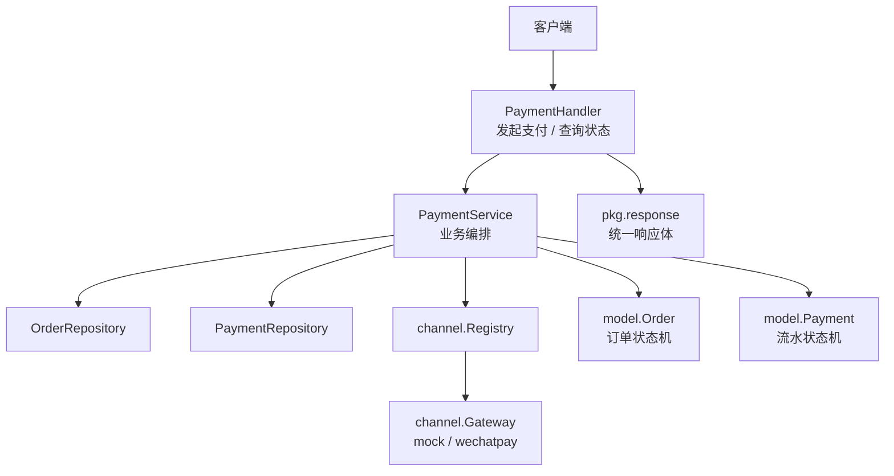
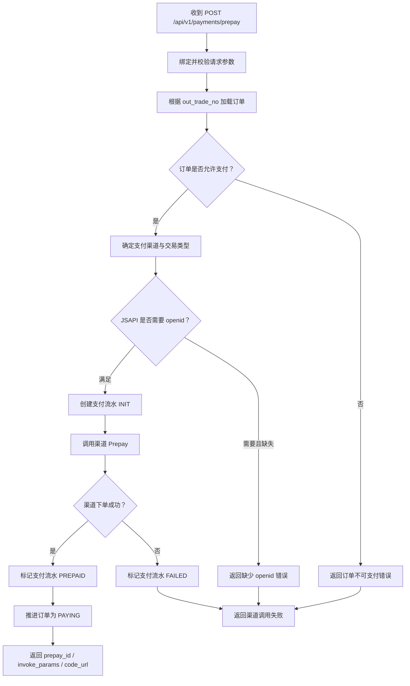
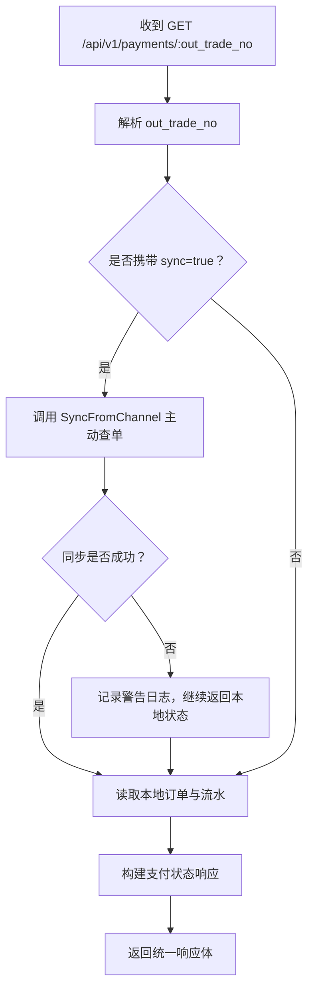
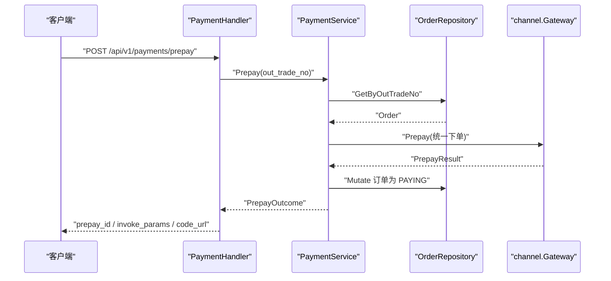
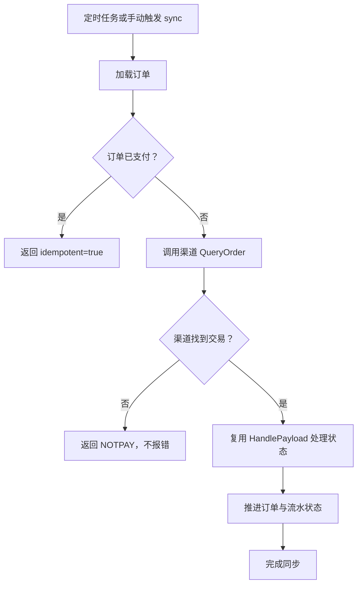
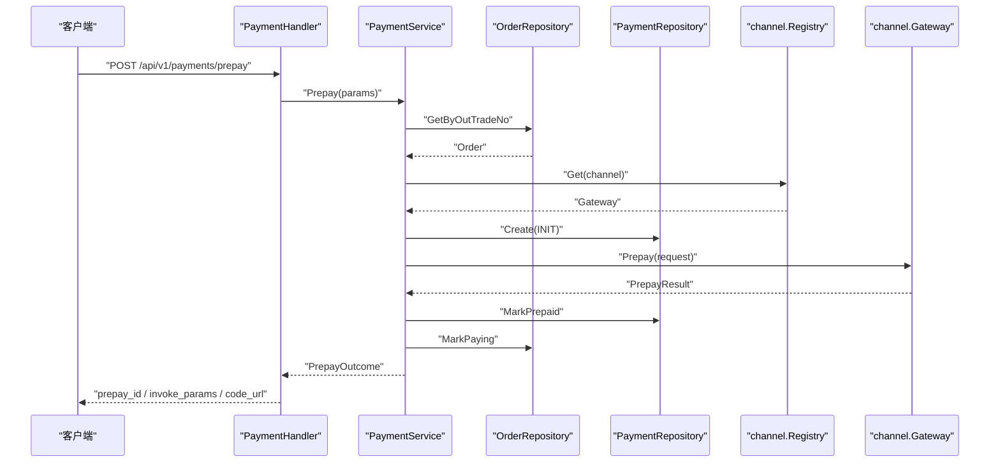
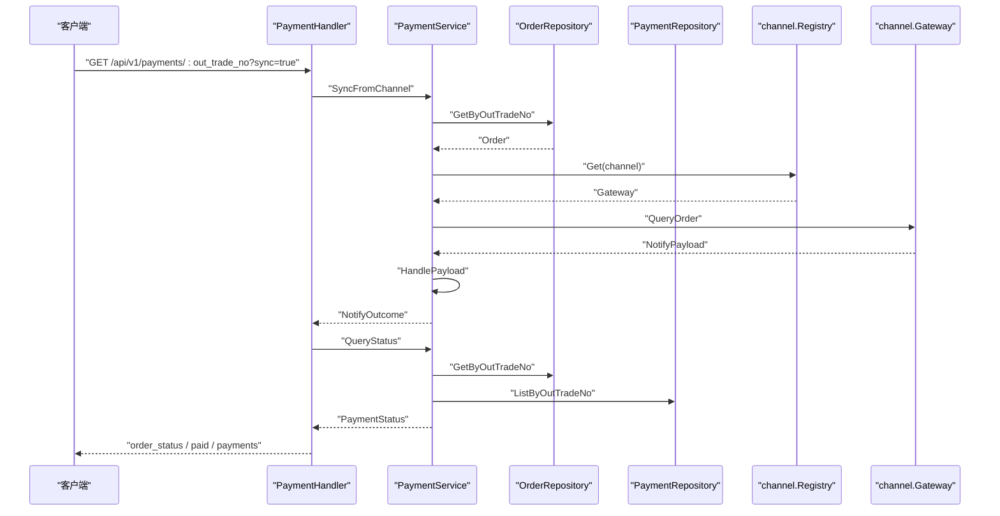

# 支付处理接口

<cite>
**本文引用的文件**   
- [README.md](file://README.md)
- [payment_handler.go](file://internal/handler/payment_handler.go)
- [payment_service.go](file://internal/service/payment_service.go)
- [payment.go](file://internal/dto/payment.go)
- [gateway.go](file://internal/channel/gateway.go)
- [order.go](file://internal/model/order.go)
- [payment_model.go](file://internal/model/payment.go)
- [errcode.go](file://internal/errcode/errcode.go)
- [memory_payment.go](file://internal/repository/memory_payment.go)
- [response.go](file://internal/pkg/response/response.go)
</cite>

## 目录
1. [引言](#引言)
2. [项目结构与接口定位](#项目结构与接口定位)
3. [核心接口总览](#核心接口总览)
4. [发起支付接口：POST /api/v1/payments/prepay](#发起支付接口post-apiv1paymentsprepay)
5. [查询支付状态接口：GET /api/v1/payments/:out_trade_no](#查询支付状态接口get-apiv1paymentsout_tradeno)
6. [支付状态与状态流转规则](#支付状态与状态流转规则)
7. [幂等性保证机制](#幂等性保证机制)
8. [重试策略与掉单兜底](#重试策略与掉单兜底)
9. [请求响应示例与渠道差异](#请求响应示例与渠道差异)
10. [错误码与异常处理](#错误码与异常处理)
11. [架构与调用时序图](#架构与调用时序图)
12. [故障排查指南](#故障排查指南)
13. [结论](#结论)

## 引言
本文件聚焦支付服务的两个对外核心接口：**发起支付**和**查询支付状态**。文档从接口契约、参数说明、响应结构、状态枚举、幂等性与重试策略，到不同支付渠道的差异化响应进行系统化说明，并给出可操作的排查建议。

该服务采用分层架构：HTTP 接入层负责解析请求与封装响应；业务层负责订单校验、流水创建、渠道调用与状态推进；领域模型固化订单与支付流水的状态机；渠道抽象层把微信支付、Mock 等不同实现收敛在统一接口之后。

**章节来源**
- [README.md:3-11](file://README.md#L3-L11)
- [README.md:38-62](file://README.md#L38-L62)

## 项目结构与接口定位
支付相关代码主要分布在以下层次：

- **接入层**：`internal/handler/payment_handler.go` 暴露 `Prepay` 与 `QueryStatus`。
- **业务层**：`internal/service/payment_service.go` 实现预支付、回调处理、状态查询与主动查单。
- **对外契约**：`internal/dto/payment.go` 定义预支付请求、预支付响应、支付流水项与支付状态响应。
- **渠道抽象**：`internal/channel/gateway.go` 定义 `Gateway` 接口、交易类型、统一回调结构、前端调起参数等。
- **领域模型**：`internal/model/order.go` 与 `internal/model/payment.go` 定义订单与支付流水状态机。
- **错误体系**：`internal/errcode/errcode.go` 定义业务错误码与 HTTP 状态映射。
- **存储实现**：`internal/repository/memory_payment.go` 提供内存版支付流水仓储。
- **统一响应**：`internal/pkg/response/response.go` 提供成功与失败响应封装。



**图表来源**
- [payment_handler.go:16-85](file://internal/handler/payment_handler.go#L16-L85)
- [payment_service.go:34-73](file://internal/service/payment_service.go#L34-L73)
- [gateway.go:189-218](file://internal/channel/gateway.go#L189-L218)
- [order.go:20-50](file://internal/model/order.go#L20-L50)
- [payment_model.go:10-33](file://internal/model/payment.go#L10-L33)
- [response.go:35-41](file://internal/pkg/response/response.go#L35-L41)

**章节来源**
- [payment_handler.go:16-85](file://internal/handler/payment_handler.go#L16-L85)
- [payment_service.go:34-73](file://internal/service/payment_service.go#L34-L73)
- [payment.go:9-42](file://internal/dto/payment.go#L9-L42)
- [gateway.go:20-129](file://internal/channel/gateway.go#L20-L129)
- [order.go:20-102](file://internal/model/order.go#L20-L102)
- [payment_model.go:10-89](file://internal/model/payment.go#L10-L89)
- [errcode.go:78-134](file://internal/errcode/errcode.go#L78-L134)
- [memory_payment.go:13-22](file://internal/repository/memory_payment.go#L13-L22)
- [response.go:35-41](file://internal/pkg/response/response.go#L35-L41)

## 核心接口总览
| 方法 | 路径 | 用途 | 关键行为 |
|---|---|---|---|
| `POST` | `/api/v1/payments/prepay` | 发起支付 | 校验订单可支付、创建支付流水、调用渠道统一下单、返回前端调起参数或扫码链接 |
| `GET` | `/api/v1/payments/:out_trade_no` | 查询支付状态 | 默认只读本地数据；可选 `?sync=true` 强制向渠道查单并同步本地状态 |

统一响应体格式为：
```json
{
  "code": 0,
  "message": "ok",
  "data": {},
  "request_id": "..."
}
```
其中 `code=0` 表示成功；非零值对应业务错误码。HTTP 状态码与业务码同时存在：前者供网关与监控判断，后者供客户端做业务分支。

**章节来源**
- [README.md:64-83](file://README.md#L64-L83)
- [response.go:35-41](file://internal/pkg/response/response.go#L35-L41)

## 发起支付接口：POST /api/v1/payments/prepay

### 接口说明
该接口用于根据商户订单号发起支付。服务端会：
1. 校验订单是否存在且允许支付。
2. 确定实际使用的支付渠道与交易类型。
3. 创建一条初始状态的支付流水。
4. 调用渠道 `Prepay` 获取预支付参数。
5. 将支付流水标记为已预支付，并将订单推进为支付中。
6. 返回前端可直接用于调起支付的参数。

### 请求参数
| 字段 | 类型 | 必填 | 说明 |
|---|---|---:|---|
| `out_trade_no` | 字符串 | 是 | 商户订单号，最长 32 字符 |
| `channel` | 字符串 | 否 | 支付渠道编码，留空则使用订单创建时确定的渠道 |
| `trade_type` | 字符串 | 否 | 交易类型，留空按 JSAPI 处理 |
| `openid` | 字符串 | 条件必填 | 支付者 openid；JSAPI 交易必须提供，优先取请求值，否则回退到订单上保存的值 |

交易类型取值包括：
- `JSAPI`：公众号或小程序支付，需要 `openid`。
- `NATIVE`：扫码支付，响应中包含 `code_url`。
- `H5`：手机浏览器支付。
- `APP`：原生应用支付。

当前骨架默认支持 JSAPI 场景，其他交易类型作为扩展预留。

**章节来源**
- [payment.go:9-25](file://internal/dto/payment.go#L9-L25)
- [gateway.go:43-58](file://internal/channel/gateway.go#L43-L58)
- [payment_service.go:75-85](file://internal/service/payment_service.go#L75-L85)

### 响应字段
| 字段 | 类型 | 说明 |
|---|---|---|
| `out_trade_no` | 字符串 | 商户订单号 |
| `payment_no` | 字符串 | 本次支付流水号 |
| `channel` | 字符串 | 实际使用的支付渠道 |
| `trade_type` | 字符串 | 实际使用的交易类型 |
| `prepay_id` | 字符串 | 渠道返回的预支付会话标识 |
| `code_url` | 字符串 | 扫码支付二维码内容，仅 NATIVE 交易返回 |
| `invoke_params` | 对象 | 前端调起支付所需参数，JSAPI 与小程序交易返回 |

`invoke_params` 的结构与微信前端调起参数一致，包含 `appId`、`timeStamp`、`nonceStr`、`package`、`signType`、`paySign`。

**章节来源**
- [payment.go:27-58](file://internal/dto/payment.go#L27-L58)
- [gateway.go:104-129](file://internal/channel/gateway.go#L104-L129)

### 业务流程


**图表来源**
- [payment_handler.go:32-51](file://internal/handler/payment_handler.go#L32-L51)
- [payment_service.go:108-226](file://internal/service/payment_service.go#L108-L226)

### 关键约束
- 同一订单在不同渠道间跳变不被允许，渠道以订单创建时确定的渠道为准，避免对账混乱。
- JSAPI 交易必须提供 `openid`，否则直接拦截，避免无意义的渠道调用。
- 渠道下单失败时，支付流水会被标记为 `FAILED`，但订单状态不会回退，用户可重新发起。
- 若渠道下单成功但本地订单状态推进失败，服务仍会返回调起参数，由后续回调与查单兜底，防止因本地状态未更新而拒绝收款。

**章节来源**
- [payment_service.go:121-145](file://internal/service/payment_service.go#L121-L145)
- [payment_service.go:153-226](file://internal/service/payment_service.go#L153-L226)

## 查询支付状态接口：GET /api/v1/payments/:out_trade_no

### 接口说明
该接口用于查询订单的支付状态与全部支付流水。默认只读取本地数据，适合高频轮询；当回调可能丢失时，可通过 `?sync=true` 强制向渠道查单并同步本地状态。

### 路径参数
| 字段 | 类型 | 必填 | 说明 |
|---|---|---:|---|
| `out_trade_no` | 字符串 | 是 | 商户订单号 |

### 查询参数
| 字段 | 类型 | 必填 | 说明 |
|---|---|---:|---|
| `sync` | 布尔值 | 否 | 是否主动向渠道查单；接受 `true`、`1`、`yes`、`on`（大小写不敏感） |

### 响应字段
| 字段 | 类型 | 说明 |
|---|---|---|
| `out_trade_no` | 字符串 | 商户订单号 |
| `order_status` | 字符串 | 订单状态，如 `CREATED`、`PAYING`、`PAID`、`CLOSED`、`REFUNDED` |
| `paid` | 布尔值 | 是否已支付成功 |
| `amount` | 字符串 | 订单金额，单位为元，保留两位小数 |
| `amount_fen` | 整数 | 订单金额，单位为分 |
| `payments` | 数组 | 该订单下的全部支付流水明细 |

`payments` 中的每条记录包含：
- `payment_no`：支付流水号。
- `channel`：支付渠道。
- `trade_type`：交易类型。
- `status`：支付流水状态，如 `INIT`、`PREPAID`、`SUCCESS`、`FAILED`、`CLOSED`。
- `prepay_id`：预支付会话标识。
- `transaction_id`：渠道侧交易号。
- `trade_state`：渠道原始交易状态。
- `trade_state_desc`：渠道交易状态描述。
- `amount`：金额，单位元。
- `amount_fen`：金额，单位分。
- `success_time`：支付成功时间。
- `created_at`：流水创建时间。

**章节来源**
- [payment_handler.go:53-108](file://internal/handler/payment_handler.go#L53-L108)
- [payment.go:60-112](file://internal/dto/payment.go#L60-L112)

### 查询流程


**图表来源**
- [payment_handler.go:60-85](file://internal/handler/payment_handler.go#L60-L85)
- [payment_service.go:532-582](file://internal/service/payment_service.go#L532-L582)

### 设计要点
- 高频轮询不应每次都调用渠道，否则会触发限流。
- `sync=true` 适用于「回调迟迟未到」的场景，生产环境建议由定时任务批量执行，而不是让前端频繁强制同步。
- 主动查单失败时，接口仍返回本地已知状态，避免收银台长期停留在加载中。

**章节来源**
- [payment_handler.go:68-77](file://internal/handler/payment_handler.go#L68-L77)
- [payment_service.go:548-582](file://internal/service/payment_service.go#L548-L582)

## 支付状态与状态流转规则

### 订单状态
订单状态用于表达整笔交易的生命周期：

| 状态 | 含义 | 是否终态 |
|---|---|---:|
| `CREATED` | 订单已创建，尚未调起支付 | 否 |
| `PAYING` | 已调起支付，等待用户完成付款 | 否 |
| `PAID` | 支付成功 | 是 |
| `CLOSED` | 订单已关闭 | 是 |
| `REFUNDED` | 已退款 | 是 |

合法流转如下：
- `CREATED` → `PAYING` 或 `CLOSED`
- `PAYING` → `PAYING`、`PAID` 或 `CLOSED`
- `PAID` → `REFUNDED`
- `CLOSED` 与 `REFUNDED` 不再流转

**章节来源**
- [order.go:20-50](file://internal/model/order.go#L20-L50)
- [order.go:122-153](file://internal/model/order.go#L122-L153)

### 支付流水状态
支付流水用于记录一次具体的支付尝试，一个订单可能产生多条流水：

| 状态 | 含义 | 是否终态 |
|---|---|---:|
| `INIT` | 流水已创建，尚未调起渠道下单 | 否 |
| `PREPAID` | 渠道下单成功，已拿到 `prepay_id`，等待用户付款 | 否 |
| `SUCCESS` | 支付成功 | 是 |
| `FAILED` | 支付失败 | 是 |
| `CLOSED` | 流水已关闭 | 是 |

合法流转如下：
- `INIT` → `PREPAID`、`FAILED` 或 `CLOSED`
- `PREPAID` → `SUCCESS`、`FAILED` 或 `CLOSED`
- `SUCCESS`、`FAILED`、`CLOSED` 不再流转

**章节来源**
- [payment_model.go:10-33](file://internal/model/payment.go#L10-L33)
- [payment_model.go:106-137](file://internal/model/payment.go#L106-L137)

### 支付状态枚举与文档目标对齐
文档目标中提到的支付状态枚举 `PENDING`、`SUCCESS`、`FAILED`、`CLOSED` 在本项目中对应如下语义：

| 文档目标枚举 | 本项目支付流水状态 | 含义 |
|---|---|---|
| `PENDING` | `INIT` 或 `PREPAID` | 支付尚未有最终结果 |
| `SUCCESS` | `SUCCESS` | 支付成功 |
| `FAILED` | `FAILED` | 支付失败 |
| `CLOSED` | `CLOSED` | 流水关闭 |

注意：`PENDING` 并非单一状态，而是涵盖“已创建但未出结果”的阶段。前端轮询时应以 `paid=false` 且 `order_status` 不是终态作为继续轮询的依据，而不是仅依赖某个固定字符串。

**章节来源**
- [payment_model.go:10-33](file://internal/model/payment.go#L10-L33)
- [payment.go:60-112](file://internal/dto/payment.go#L60-L112)

## 幂等性保证机制
支付系统必须应对渠道重复通知与并发请求。本项目的幂等性体现在多个层面：

1. **订单级幂等**：如果订单已经处于已支付状态，回调快速返回 `idempotent=true`，不重复推进订单。
2. **锁内二次检查**：即使外层快速判断通过，进入仓储修改回调后仍会再次检查订单是否已被其他并发请求推进为已支付。
3. **流水级幂等**：支付流水一旦进入终态，不会被重复覆盖；重复回调命中终态时会返回已有流水。
4. **并发安全存储**：内存仓储使用读写锁与副本替换策略，对外返回的是快照，避免外部修改绕过状态机。



**图表来源**
- [payment_handler.go:32-51](file://internal/handler/payment_handler.go#L32-L51)
- [payment_service.go:108-226](file://internal/service/payment_service.go#L108-L226)

**章节来源**
- [payment_service.go:282-379](file://internal/service/payment_service.go#L282-L379)
- [payment_service.go:417-486](file://internal/service/payment_service.go#L417-L486)
- [memory_payment.go:13-22](file://internal/repository/memory_payment.go#L13-L22)
- [memory_payment.go:92-113](file://internal/repository/memory_payment.go#L92-L113)

## 重试策略与掉单兜底
### 渠道重试
微信支付在未收到成功应答时会按固定间隔重复投递通知。因此：
- 已支付订单必须原样返回成功，使渠道停止重试。
- 验签失败或解密失败不能降级为内部错误，应保留安全告警信号。
- 金额不一致属于资金风险，必须拒绝并提示人工介入。

### 主动查单兜底
回调可能因网络抖动、防火墙拦截或服务重启丢失。本项目通过 `SyncFromChannel` 实现主动查单：
1. 若订单已支付，直接返回幂等结果。
2. 调用渠道 `QueryOrder` 获取当前交易状态。
3. 复用回调处理逻辑，确保查单与回调结论一致。
4. 若渠道侧找不到交易，视为正常情况，不抛错给调用方。



**图表来源**
- [payment_service.go:548-582](file://internal/service/payment_service.go#L548-L582)

**章节来源**
- [README.md:193-201](file://README.md#L193-L201)
- [payment_service.go:301-318](file://internal/service/payment_service.go#L301-L318)
- [payment_service.go:548-582](file://internal/service/payment_service.go#L548-L582)

## 请求响应示例与渠道差异

### 发起支付请求示例
```json
{
  "out_trade_no": "YOUR_MERCHANT_ORDER_NO",
  "trade_type": "JSAPI",
  "openid": "USER_OPENID"
}
```

### 发起支付成功响应示例
```json
{
  "code": 0,
  "message": "ok",
  "data": {
    "out_trade_no": "YOUR_MERCHANT_ORDER_NO",
    "payment_no": "PAYMENT_NO",
    "channel": "wechatpay",
    "trade_type": "JSAPI",
    "prepay_id": "WX_PREPAY_ID",
    "invoke_params": {
      "appId": "YOUR_APP_ID",
      "timeStamp": "TIMESTAMP",
      "nonceStr": "NONCE",
      "package": "prepay_id=...",
      "signType": "RSA",
      "paySign": "SIGNATURE"
    }
  },
  "request_id": "REQUEST_ID"
}
```

### 扫码支付响应差异
当 `trade_type=NATIVE` 时，响应中不包含 `invoke_params`，而是返回 `code_url`：
```json
{
  "code": 0,
  "message": "ok",
  "data": {
    "out_trade_no": "YOUR_MERCHANT_ORDER_NO",
    "payment_no": "PAYMENT_NO",
    "channel": "wechatpay",
    "trade_type": "NATIVE",
    "prepay_id": "WX_PREPAY_ID",
    "code_url": "weixin://wxpay/bizpayurl?pr=..."
  },
  "request_id": "REQUEST_ID"
}
```

### Mock 渠道差异
当前骨架默认以 `mock` 渠道运行，`invoke_params.paySign` 是模拟签名，明确标注不可用于生产。真实微信支付接入后，`channel` 改为 `wechatpay`，并由具体 `Gateway` 实现生成真实签名。

**章节来源**
- [payment.go:27-58](file://internal/dto/payment.go#L27-L58)
- [gateway.go:104-129](file://internal/channel/gateway.go#L104-L129)
- [README.md:98-103](file://README.md#L98-L103)

## 错误码与异常处理
统一响应体中的 `code` 与 HTTP 状态码共同表达错误原因。常见相关错误码如下：

| 错误码 | HTTP 状态 | 含义 | 典型触发场景 |
|---|---:|---|---|
| `10001` | 400 | 请求参数不合法 | `out_trade_no` 为空或长度超限 |
| `10002` | 400 | 请求无法解析 | JSON 非法或类型不匹配 |
| `20001` | 404 | 订单不存在 | 传入的 `out_trade_no` 不存在 |
| `20002` | 409 | 订单状态不允许该操作 | 对已关闭或已退款订单发起支付 |
| `20004` | 409 | 订单已关闭 | 重复支付被关闭订单 |
| `20005` | 409 | 订单已支付 | 重复支付 |
| `30002` | 400 | 支付金额与订单金额不一致 | 回调金额与订单金额不符 |
| `30003` | 400 | 缺少支付者 openid | JSAPI 交易未提供 `openid` |
| `40001` | 500 | 支付渠道未注册 | 渠道编码未配置或未启用 |
| `40002` | 502 | 支付渠道调用失败 | 渠道超时、网络错误或渠道返回错误 |
| `40003` | 400 | 支付回调校验失败 | 验签或解密失败 |

客户端应依据 `code` 做分支，不要对 `message` 做字符串匹配。部分错误在抛出时会带上上下文信息，便于排查，但对外文案应保持通用。

**章节来源**
- [errcode.go:78-134](file://internal/errcode/errcode.go#L78-L134)
- [README.md:136-160](file://README.md#L136-L160)

## 架构与调用时序图

### 发起支付时序图


**图表来源**
- [payment_handler.go:32-51](file://internal/handler/payment_handler.go#L32-L51)
- [payment_service.go:108-226](file://internal/service/payment_service.go#L108-L226)
- [registry.go:63-74](file://internal/channel/registry.go#L63-L74)

### 查询支付状态时序图


**图表来源**
- [payment_handler.go:60-85](file://internal/handler/payment_handler.go#L60-L85)
- [payment_service.go:532-582](file://internal/service/payment_service.go#L532-L582)

## 故障排查指南

### 常见问题
1. **JSAPI 交易报缺少 openid**  
   检查请求是否传入 `openid`，或订单创建时是否保存了 `openid`。
2. **渠道下单失败但订单仍可被支付**  
   这是预期行为：渠道失败时流水标记为 `FAILED`，订单状态不动，用户可重试；若渠道成功但本地状态推进失败，仍返回调起参数，由回调与查单兜底。
3. **支付成功但本地未更新**  
   可能是回调丢失，应使用 `?sync=true` 或定时任务主动查单。
4. **回调金额与订单金额不一致**  
   属于资金风险，必须拒绝并人工核查，不能自动放行。
5. **重复回调导致订单重复支付**  
   项目已通过订单与流水双重幂等保护；若仍出现异常，需检查仓储实现与并发控制。

### 排查建议
- 使用 `request_id` 串联一次请求的所有日志。
- 区分 HTTP 状态码与业务错误码：网关看 HTTP，业务逻辑看 `code`。
- 对账时优先查看 `payments` 明细，还原每次支付尝试的真实状态。
- 生产环境不要依赖 mock 路由；release 模式下 mock 路由不会注册。

**章节来源**
- [README.md:211-213](file://README.md#L211-L213)
- [README.md:240-246](file://README.md#L240-L246)
- [payment_service.go:164-178](file://internal/service/payment_service.go#L164-L178)
- [payment_service.go:320-333](file://internal/service/payment_service.go#L320-L333)

## 结论
支付处理接口的核心在于三点：
1. **接口契约清晰**：预支付返回前端可调起的参数，查询接口返回订单状态与流水明细。
2. **状态机严格**：订单与支付流水的状态流转集中在领域模型，避免业务层散落判断。
3. **幂等与兜底完备**：通过快速判断、锁内二次检查、流水终态保护与主动查单，应对渠道重试与回调丢失。

对于不同支付渠道，差异被收敛在 `channel.Gateway` 层；对外接口保持不变。接入微信支付时，只需实现渠道网关并在注册表中启用，无需改动 handler 与 service 层。