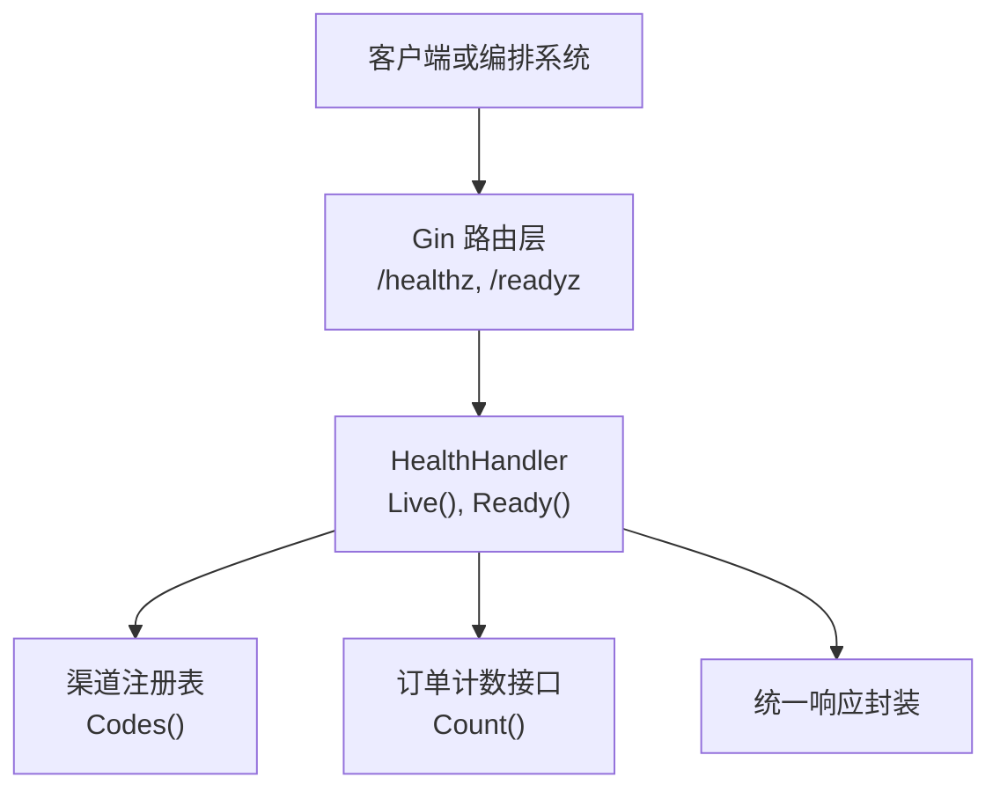
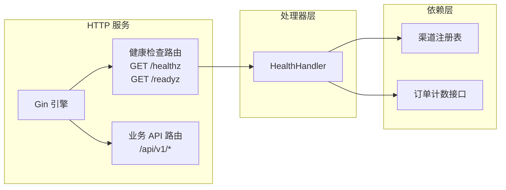
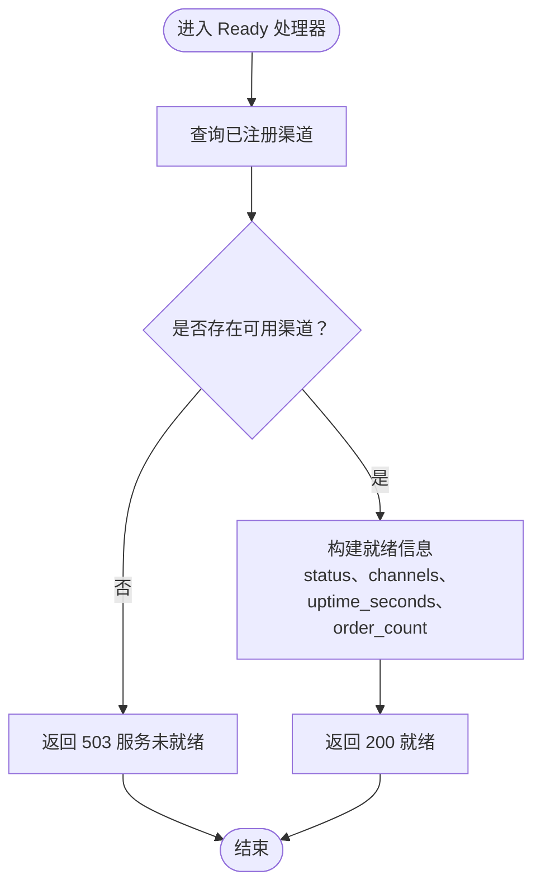
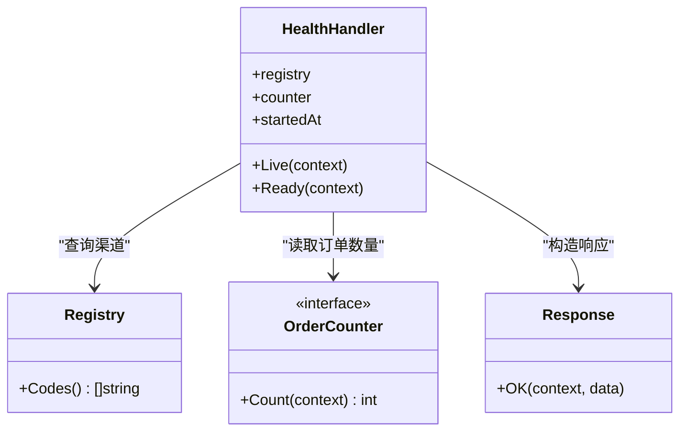
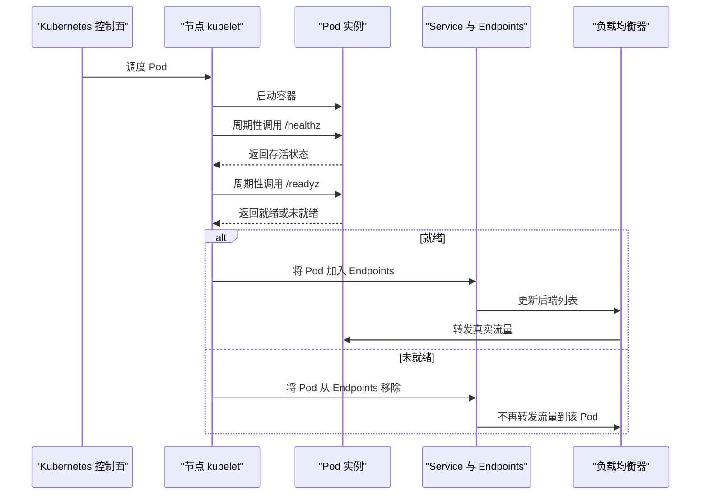

# 系统健康检查接口

<cite>
**本文引用的文件**   
- [internal/handler/health.go](file://internal/handler/health.go)
- [internal/router/router.go](file://internal/router/router.go)
- [cmd/server/main.go](file://cmd/server/main.go)
- [Dockerfile](file://Dockerfile)
</cite>

## 目录
1. [简介](#简介)
2. [项目结构与健康检查位置](#项目结构与健康检查位置)
3. [核心组件](#核心组件)
4. [架构总览](#架构总览)
5. [详细组件分析](#详细组件分析)
6. [依赖关系分析](#依赖关系分析)
7. [性能与可用性考虑](#性能与可用性考虑)
8. [Kubernetes 与 Docker 使用示例](#kubernetes-与-docker-使用示例)
9. [负载均衡与服务发现中的作用](#负载均衡与服务发现中的作用)
10. [故障排查指南](#故障排查指南)
11. [结论](#结论)

## 简介
本文件面向支付服务的运维、开发与平台工程师，系统化说明两个健康检查接口：

- GET /healthz：存活探针。用于检测服务进程是否仍在运行并能够处理请求。
- GET /readyz：就绪探针。用于检测服务是否已完全启动，并具备完成业务的能力。

这两个接口的职责边界清晰：存活探针只关心“进程还活着”，就绪探针关心“服务是否可用”。在 Kubernetes 或 Docker 环境中，它们分别对应 livenessProbe 和 readinessProbe，对容器的生命周期管理、流量调度和服务发现具有关键作用。

## 项目结构与健康检查位置
健康检查功能由以下代码共同实现：

- 路由注册：将 /healthz 与 /readyz 暴露为 HTTP GET 接口。
- 处理器实现：定义 HealthHandler，提供 Live 与 Ready 两个方法。
- 应用入口：负责启动 HTTP 服务，承载 Gin 引擎与所有路由。
- 容器镜像：通过 HEALTHCHECK 指令集成 Docker 原生健康检查。

**图表来源**
- [internal/router/router.go:22-27](file://internal/router/router.go#L22-L27)
- [internal/router/router.go:86-89](file://internal/router/router.go#L86-L89)
- [internal/handler/health.go:24-34](file://internal/handler/health.go#L24-L34)
- [internal/handler/health.go:45-78](file://internal/handler/health.go#L45-L78)

**章节来源**
- [internal/router/router.go:22-27](file://internal/router/router.go#L22-L27)
- [internal/router/router.go:86-89](file://internal/router/router.go#L86-L89)
- [internal/handler/health.go:24-34](file://internal/handler/health.go#L24-L34)

## 核心组件
- HealthHandler：健康检查处理器，封装存活与就绪逻辑。
- OrderCounter：就绪探针中用于获取当前订单数量的最小接口。
- channel.Registry：渠道注册表，用于判断是否有可用的支付渠道。
- response：统一响应封装，用于构造标准返回体。

HealthHandler 的字段包括：

| 字段 | 类型 | 作用 |
| --- | --- | --- |
| registry | *channel.Registry | 查询已注册的支付渠道 |
| counter | OrderCounter | 读取当前订单数量 |
| startedAt | time.Time | 记录服务启动时间，用于计算运行时长 |

**章节来源**
- [internal/handler/health.go:15-34](file://internal/handler/health.go#L15-L34)

## 架构总览
健康检查接口位于业务 API 前缀之外，属于基础设施契约，不随业务版本演进变化。

**图表来源**
- [internal/router/router.go:15-27](file://internal/router/router.go#L15-L27)
- [internal/router/router.go:80-89](file://internal/router/router.go#L80-L89)
- [internal/handler/health.go:24-34](file://internal/handler/health.go#L24-L34)

## 详细组件分析

### 存活探针 GET /healthz
- 触发方式：livenessProbe 调用。
- 目的：确认服务进程仍然存活且能响应 HTTP 请求。
- 行为：直接返回成功状态，不检查数据库、外部渠道或其他依赖。
- 设计原因：如果存活探针检查外部依赖，一次外部抖动可能触发大量副本同时重启，导致正在处理的支付回调中断，把“部分功能不可用”放大成“全站不可用”。

响应格式要点：

| 字段 | 类型 | 含义 |
| --- | --- | --- |
| status | string | 健康状态，通常为 ok |

典型状态码：

| 场景 | 状态码 | 说明 |
| --- | --- | --- |
| 进程正常 | 200 | 表示存活 |
| 进程异常 | 非 2xx | 表示存活失败，编排系统可能重启容器 |

**章节来源**
- [internal/handler/health.go:36-47](file://internal/handler/health.go#L36-L47)

### 就绪探针 GET /readyz
- 触发方式：readinessProbe 调用。
- 目的：确认服务已完全启动，并具备完成支付业务的能力。
- 行为：检查是否至少有一个可用的支付渠道；若没有可用渠道，则返回服务未就绪。
- 额外信息：返回已注册渠道列表、服务运行时长、当前订单数量等诊断信息。

响应字段说明：

| 字段 | 类型 | 含义 |
| --- | --- | --- |
| status | string | 就绪状态，通常为 ready |
| channels | string[] | 已注册并可用的支付渠道名称列表 |
| uptime_seconds | number | 服务自启动以来的运行秒数 |
| order_count | number | 当前订单数量 |

典型状态码：

| 场景 | 状态码 | 说明 |
| --- | --- | --- |
| 有可用渠道 | 200 | 表示就绪 |
| 无可用渠道 | 503 | 表示服务未就绪，会被从负载均衡后端摘除 |

**图表来源**
- [internal/handler/health.go:49-78](file://internal/handler/health.go#L49-L78)

**章节来源**
- [internal/handler/health.go:49-78](file://internal/handler/health.go#L49-L78)

### 路由注册
健康检查路径定义为常量，并注册到 Gin 引擎：

- /healthz：映射到 HealthHandler.Live
- /readyz：映射到 HealthHandler.Ready

该注册逻辑独立于业务 API 路由，避免业务版本变更影响基础设施探针。

**章节来源**
- [internal/router/router.go:22-27](file://internal/router/router.go#L22-L27)
- [internal/router/router.go:86-89](file://internal/router/router.go#L86-L89)

### 应用入口与优雅关闭
应用入口负责加载配置、初始化应用、启动 HTTP 服务、监听退出信号并执行优雅关闭。健康检查接口由 Gin 引擎承载，因此其可用性受 HTTP 服务生命周期影响。

关键点：

- 服务启动后才会对外暴露 /healthz 与 /readyz。
- 收到 SIGINT 或 SIGTERM 时，先停止接收新连接，再等待存量请求处理完成。
- 优雅关闭超时后会强制断开连接，避免支付回调中断造成掉单。

**章节来源**
- [cmd/server/main.go:39-67](file://cmd/server/main.go#L39-L67)
- [cmd/server/main.go:69-124](file://cmd/server/main.go#L69-L124)

## 依赖关系分析
健康检查接口的依赖如下：

**图表来源**
- [internal/handler/health.go:15-34](file://internal/handler/health.go#L15-L34)
- [internal/handler/health.go:45-78](file://internal/handler/health.go#L45-L78)

耦合与内聚分析：

- HealthHandler 通过最小接口 OrderCounter 解耦存储层，避免接入层直接依赖 repository。
- 就绪探针依赖渠道注册表，但不直接访问具体渠道实现，保持关注点分离。
- 健康检查与业务路由共享 Gin 引擎，但路由注册相互独立，降低耦合。

潜在风险：

- 就绪探针会读取订单数量，若 Count 实现较慢，会影响就绪检查延迟。
- 渠道注册表为空时，服务会被摘除，这是预期行为，但需要配合渠道注册机制确保上线流程正确。

**章节来源**
- [internal/handler/health.go:15-34](file://internal/handler/health.go#L15-L34)
- [internal/handler/health.go:49-78](file://internal/handler/health.go#L49-L78)

## 性能与可用性考虑
- 存活探针应尽可能轻量：仅验证进程可响应，避免 I/O 或外部依赖。
- 就绪探针可包含必要依赖检查，但应避免昂贵操作；必要时可做缓存或限流。
- 就绪探针返回 503 时，编排系统会将副本从 Service endpoints 中摘除，避免流量进入不可用实例。
- 存活探针失败时，编排系统可能重启容器，因此不应把易抖动的依赖放入存活检查。
- 服务启动期间，就绪探针可暂时返回未就绪，直到渠道注册完成、依赖初始化完成。

[本节为通用指导，不直接分析具体文件]

## Kubernetes 与 Docker 使用示例

### Docker 健康检查
镜像中已定义 HEALTHCHECK，默认每 30 秒检查一次，超时 3 秒，启动宽限期 5 秒，重试 3 次。

建议理解要点：

- 使用 wget 访问本地 8080 端口的 /healthz。
- 返回非 0 状态码表示健康检查失败。
- 证书等敏感文件不应打入镜像层，应通过挂载或 Secret 注入。

**章节来源**
- [Dockerfile:47-54](file://Dockerfile#L47-L54)

### Kubernetes livenessProbe 与 readinessProbe
以下为概念性配置说明，实际 YAML 需结合部署清单调整：

- livenessProbe：
  - httpGet.path: /healthz
  - httpGet.port: 8080
  - initialDelaySeconds: 根据启动耗时设置
  - periodSeconds: 例如 10 到 30 秒
  - timeoutSeconds: 例如 3 秒
  - failureThreshold: 连续失败次数

- readinessProbe：
  - httpGet.path: /readyz
  - httpGet.port: 8080
  - initialDelaySeconds: 应大于等于依赖初始化时间
  - periodSeconds: 例如 10 到 30 秒
  - timeoutSeconds: 例如 3 秒
  - failureThreshold: 连续失败次数

注意：

- livenessProbe 失败可能导致 Pod 重启。
- readinessProbe 失败只会让 Pod 从 Service endpoints 中摘除，不会重启。
- 初始延迟要覆盖配置加载、日志初始化、渠道注册、依赖连接等过程。

[本节为通用配置说明，不直接分析具体文件]

## 负载均衡与服务发现中的作用
健康检查在云原生环境中的核心作用：

- 存活探针：
  - 检测进程是否崩溃、死锁或无法响应。
  - 失败时触发容器或 Pod 重启，恢复服务。
- 就绪探针：
  - 检测服务是否准备好接收真实流量。
  - 失败时将实例从负载均衡后端或服务发现列表中摘除。
  - 成功后再将实例加入后端，开始接收流量。

对于支付服务，这种区分尤为重要：

- 外部渠道短暂不可用时，不应重启所有副本。
- 若无可用渠道，应尽快摘除实例，避免用户支付请求全部失败。
- 服务启动过程中，应先标记为未就绪，待依赖就绪后再接受流量。

[本图为概念流程图，不直接映射具体源码文件]

## 故障排查指南

常见问题与定位思路：

| 现象 | 可能原因 | 排查步骤 |
| --- | --- | --- |
| /healthz 持续失败 | 进程崩溃、端口未监听、HTTP 服务未启动 | 检查容器日志、端口占用、服务启动顺序 |
| /readyz 持续返回 503 | 无可用支付渠道 | 检查渠道注册、配置、密钥挂载 |
| 服务启动慢导致频繁重启 | livenessProbe initialDelaySeconds 过小 | 调大初始延迟，观察启动耗时 |
| 就绪探针延迟高 | 订单计数或渠道查询较慢 | 优化 Count 实现，增加缓存或限制频率 |
| 优雅关闭期间流量中断 | 关闭超时过短或仍有长连接 | 调整 shutdownTimeout，检查长连接处理 |

相关实现参考：

- 健康检查处理器：
  - [internal/handler/health.go:36-47](file://internal/handler/health.go#L36-L47)
  - [internal/handler/health.go:49-78](file://internal/handler/health.go#L49-L78)
- 路由注册：
  - [internal/router/router.go:86-89](file://internal/router/router.go#L86-L89)
- 服务启动与优雅关闭：
  - [cmd/server/main.go:61-67](file://cmd/server/main.go#L61-L67)
  - [cmd/server/main.go:98-124](file://cmd/server/main.go#L98-L124)
- Docker 健康检查：
  - [Dockerfile:49-52](file://Dockerfile#L49-L52)

**章节来源**
- [internal/handler/health.go:36-78](file://internal/handler/health.go#L36-L78)
- [internal/router/router.go:86-89](file://internal/router/router.go#L86-L89)
- [cmd/server/main.go:61-124](file://cmd/server/main.go#L61-L124)
- [Dockerfile:49-52](file://Dockerfile#L49-L52)

## 结论
- /healthz 是存活探针，只验证进程可响应，不检查依赖。
- /readyz 是就绪探针，验证服务是否具备完成支付业务的能力，并返回渠道、运行时长、订单数量等信息。
- 在 Kubernetes 与 Docker 中，两者分别承担重启保护与流量摘除的职责。
- 健康检查的设计直接影响支付服务的稳定性与可用性，应严格区分“进程存活”与“服务就绪”，避免将易抖动的外部依赖放入存活检查。
- 部署时应合理设置探针参数，确保服务启动完成后才接受流量，并在优雅关闭期间尽量保证支付回调不被中断。