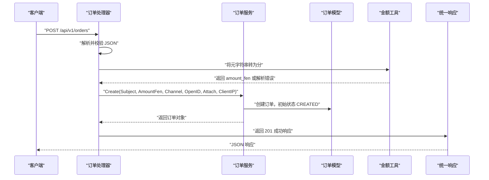
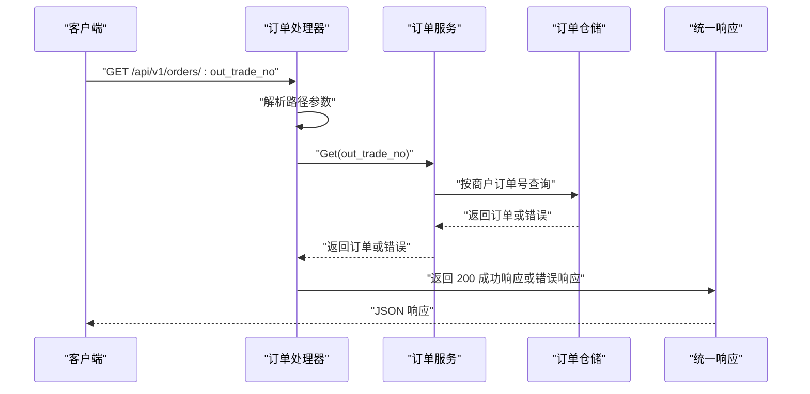
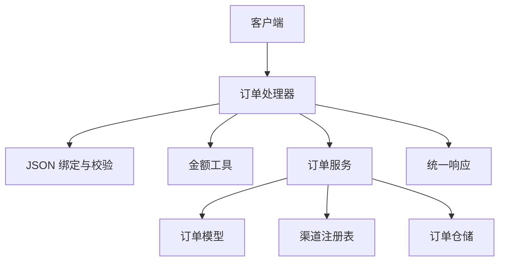

# 订单管理接口

<cite>
**本文引用的文件**   
- [order_handler.go](file://internal/handler/order_handler.go)
- [handler.go](file://internal/handler/handler.go)
- [order_service.go](file://internal/service/order_service.go)
- [order.go](file://internal/model/order.go)
- [payment.go](file://internal/dto/payment.go)
- [money.go](file://internal/pkg/money/money.go)
- [errcode.go](file://internal/errcode/errcode.go)
- [response.go](file://internal/pkg/response/response.go)
</cite>

## 目录
1. [简介](#简介)
2. [接口总览](#接口总览)
3. [创建订单接口](#创建订单接口)
4. [查询订单接口](#查询订单接口)
5. [金额处理机制](#金额处理机制)
6. [客户端 IP 与风控安全说明](#客户端-ip-与风控安全说明)
7. [统一响应格式](#统一响应格式)
8. [错误码与处理建议](#错误码与处理建议)
9. [调用流程与架构关系](#调用流程与架构关系)
10. [常见问题排查](#常见问题排查)
11. [最佳实践](#最佳实践)

## 简介
本文档面向接入方，详细说明订单管理相关的两个核心接口：
- POST /api/v1/orders：创建订单。
- GET /api/v1/orders/:out_trade_no：按商户订单号查询订单。

系统采用分层设计：HTTP 接入层负责参数解析、校验和响应封装；服务层负责业务规则；模型层定义订单领域语义；金额处理由专用工具包完成，保证精度与安全。

## 接口总览
| 接口 | 方法 | 路径 | 用途 | 成功状态码 | 典型返回数据 |
|---|---:|---|---|---:|---|
| 创建订单 | POST | /api/v1/orders | 根据商品描述、金额、支付渠道和用户标识创建待支付订单 | 201 | 订单基本信息，包含商户订单号、金额、渠道、状态等 |
| 查询订单 | GET | /api/v1/orders/:out_trade_no | 根据商户订单号查询订单当前状态与基础信息 | 200 | 订单基本信息，包含商户订单号、金额、渠道、状态等 |

注意：
- 所有金额在内部以「分」为单位存储，对外请求支持「元」字符串自动转换。
- 商户订单号由服务端生成，不应由客户端传入。
- 客户端 IP 由服务端自动获取，不接收客户端传入的 ClientIP。

**章节来源**
- [order_handler.go:23-60](file://internal/handler/order_handler.go#L23-L60)
- [order_handler.go:62-78](file://internal/handler/order_handler.go#L62-L78)

## 创建订单接口

### 接口定义
- 方法：POST
- 路径：/api/v1/orders
- 内容类型：application/json
- 成功响应：HTTP 201，业务码为 0
- 失败响应：HTTP 4xx 或 5xx，业务码见错误码章节

### 请求体字段
| 字段名 | 类型 | 必填 | 默认值 | 业务规则与说明 |
|---|---|---:|---|---|
| subject | string | 是 | 无 | 商品描述，会作为标题传给支付渠道 |
| amount | string | 是 | 无 | 金额，单位为「元」，最多两位小数，必须大于零且不超过单笔上限 |
| channel | string | 否 | 使用配置中的默认渠道 | 支付渠道代码，例如 mock、wechatpay；未启用或未注册时会被拒绝 |
| openID | string | 否 | 空 | 用户标识，JSAPI 场景通常必填；具体必填规则由后续支付流程决定 |
| attach | string | 否 | 空 | 附加数据，渠道回调时原样返回，可用于携带业务上下文 |

补充约束：
- amount 仅接受数字和小数点，不接受千分位分隔符、货币符号或多余空格。
- amount 最多保留两位小数；超过两位小数会被拒绝，不会四舍五入。
- amount 必须为正数，不能为零或负数。
- amount 有单笔上限，超出范围会被拒绝。
- channel 留空时使用默认渠道；若默认渠道为空，则回退到测试用的 mock 渠道。
- openID 和 attach 长度限制由上层 DTO 校验控制；openID 最大长度通常为 128。

### 请求示例
```json
{
  "subject": "会员月卡",
  "amount": "19.99",
  "channel": "mock",
  "openID": "wx_user_123",
  "attach": "order_ref=VIP_MONTHLY"
}
```

### 成功响应示例
```json
{
  "code": 0,
  "message": "ok",
  "data": {
    "out_trade_no": "M20260101XXXXXX",
    "subject": "会员月卡",
    "amount": "19.99",
    "amount_fen": 1999,
    "currency": "CNY",
    "channel": "mock",
    "status": "CREATED",
    "open_id": "wx_user_123",
    "attach": "order_ref=VIP_MONTHLY",
    "client_ip": "127.0.0.1",
    "created_at": "2026-01-01T12:00:00Z",
    "updated_at": "2026-01-01T12:00:00Z"
  },
  "request_id": "req-xxxx"
}
```

字段说明：
- out_trade_no：服务端生成的商户订单号，用于后续查询、支付、退款和对账。
- amount：对外展示的「元」字符串，始终保留两位小数。
- amount_fen：内部金额「分」，便于对账和精确计算。
- currency：币种，默认 CNY。
- status：初始状态为 CREATED，表示已创建但尚未调起支付。
- client_ip：服务端从连接中获取的真实客户端 IP，用于风控与渠道要求。

### 常见失败响应示例
```json
{
  "code": 20003,
  "message": "金额最多保留两位小数",
  "request_id": "req-xxxx"
}
```

**章节来源**
- [order_handler.go:23-60](file://internal/handler/order_handler.go#L23-L60)
- [handler.go:29-55](file://internal/handler/handler.go#L29-L55)
- [handler.go:140-155](file://internal/handler/handler.go#L140-L155)
- [order_service.go:53-65](file://internal/service/order_service.go#L53-L65)
- [order_service.go:67-110](file://internal/service/order_service.go#L67-L110)
- [order.go:73-120](file://internal/model/order.go#L73-L120)
- [payment.go:60-98](file://internal/dto/payment.go#L60-L98)

## 查询订单接口

### 接口定义
- 方法：GET
- 路径：/api/v1/orders/:out_trade_no
- 成功响应：HTTP 200，业务码为 0
- 失败响应：HTTP 4xx 或 5xx，业务码见错误码章节

### 路径参数
| 参数名 | 类型 | 必填 | 说明 |
|---|---|---:|---|
| out_trade_no | string | 是 | 商户订单号，非空且由服务端生成 |

### 请求示例
```http
GET /api/v1/orders/M20260101XXXXXX HTTP/1.1
Host: api.example.com
```

### 成功响应示例
```json
{
  "code": 0,
  "message": "ok",
  "data": {
    "out_trade_no": "M20260101XXXXXX",
    "subject": "会员月卡",
    "amount": "19.99",
    "amount_fen": 1999,
    "currency": "CNY",
    "channel": "mock",
    "status": "CREATED",
    "open_id": "wx_user_123",
    "attach": "order_ref=VIP_MONTHLY",
    "client_ip": "127.0.0.1",
    "created_at": "2026-01-01T12:00:00Z",
    "updated_at": "2026-01-01T12:00:00Z"
  },
  "request_id": "req-xxxx"
}
```

### 常见失败响应示例
```json
{
  "code": 20001,
  "message": "订单不存在",
  "request_id": "req-xxxx"
}
```

**章节来源**
- [order_handler.go:62-78](file://internal/handler/order_handler.go#L62-L78)
- [handler.go:131-138](file://internal/handler/handler.go#L131-L138)
- [order_service.go:112-124](file://internal/service/order_service.go#L112-L124)

## 金额处理机制

### 设计原则
- 内部金额一律使用 int64 表示「分」。
- 严禁让 float64 参与金额运算，避免二进制浮点精度问题。
- 元转分和分转元全程基于字符串与整数运算，不经过浮点类型。
- 对外暴露 amount 为「元」字符串，同时返回 amount_fen 便于对账。

### 元转分规则
- 输入：amount 为字符串，例如 "19.99"、"19.9"、"20"。
- 输出：amount_fen 为 int64，例如 1999。
- 校验：
  - 不允许空字符串。
  - 不允许多个小数点。
  - 不允许非数字字符。
  - 小数位最多两位，超过两位直接拒绝，不做四舍五入。
  - 金额必须为正数，不能为零或负数。
  - 金额不能超过单笔上限。

### 分转元规则
- 输入：amount_fen 为 int64。
- 输出：amount 为固定两位小数的「元」字符串。
- 使用大整数运算避免边界溢出和精度丢失。

### 金额相关错误
| 错误场景 | 业务含义 | 建议处理方式 |
|---|---|---|
| 金额格式非法 | 输入不是合法数字字符串 | 提示客户端检查 amount 格式 |
| 小数位超过两位 | 精度可能丢失 | 提示客户端最多保留两位小数 |
| 金额超出允许范围 | 超过单笔上限或数值异常 | 提示客户端调整金额 |
| 金额为负数 | 不支持负金额 | 提示客户端金额必须为正 |
| 金额为零 | 不支持零元订单 | 提示客户端金额必须大于零 |

**章节来源**
- [money.go:1-37](file://internal/pkg/money/money.go#L1-L37)
- [money.go:39-106](file://internal/pkg/money/money.go#L39-L106)
- [money.go:108-152](file://internal/pkg/money/money.go#L108-L152)
- [handler.go:140-155](file://internal/handler/handler.go#L140-L155)

## 客户端 IP 与风控安全说明

### 为什么不由客户端传入 ClientIP
- ClientIP 用于风控和渠道侧要求，如果允许客户端自由填写，等于放弃风控能力。
- 服务端直接从连接上下文获取真实客户端 IP，避免伪造。
- 创建订单时，handler 显式设置 ClientIP 为 c.ClientIP()。

### 安全建议
- 不要尝试通过 header 或 body 传入 client_ip。
- 如果客户端位于反向代理或负载均衡后，应确保网关正确传递真实 IP。
- 对异常 IP（如内网地址、空地址）进行监控和告警。

**章节来源**
- [order_handler.go:44-53](file://internal/handler/order_handler.go#L44-L53)
- [order.go:73-102](file://internal/model/order.go#L73-L102)

## 统一响应格式

### 成功响应结构
| 字段 | 类型 | 说明 |
|---|---|---|
| code | int | 业务码，0 表示成功 |
| message | string | 业务消息，成功时为 ok |
| data | object | 业务数据，创建或查询订单时返回订单对象 |
| request_id | string | 请求追踪 ID，便于日志定位 |

### 失败响应结构
| 字段 | 类型 | 说明 |
|---|---|---|
| code | int | 业务错误码，非 0 |
| message | string | 面向客户端的错误消息 |
| request_id | string | 请求追踪 ID |

注意：
- HTTP 状态码和业务码同时存在：前者供网关、监控和重试策略判断，后者供客户端做精细化分支。
- 失败响应不包含内部实现细节，底层原因只记录在服务端日志中。

**章节来源**
- [response.go:1-13](file://internal/pkg/response/response.go#L1-L13)
- [response.go:35-41](file://internal/pkg/response/response.go#L35-L41)
- [response.go:65-83](file://internal/pkg/response/response.go#L65-L83)
- [response.go:85-106](file://internal/pkg/response/response.go#L85-L106)

## 错误码与处理建议

### 通用错误码
| 错误码 | HTTP 状态码 | 含义 | 处理建议 |
|---:|---:|---|---|
| 10001 | 400 | 请求参数不合法 | 检查 JSON 字段、类型、长度、枚举值 |
| 10002 | 400 | 请求无法解析 | 检查 Content-Type 和 JSON 语法 |
| 10003 | 404 | 资源不存在 | 检查路径和资源是否存在 |
| 10004 | 500 | 服务内部错误 | 查看服务端日志，联系后端排查 |
| 10005 | 403 | 当前环境不支持该操作 | 检查运行环境和权限 |
| 10006 | 405 | 请求方法不被允许 | 检查 HTTP 方法是否正确 |

### 订单相关错误码
| 错误码 | HTTP 状态码 | 含义 | 处理建议 |
|---:|---:|---|---|
| 20001 | 404 | 订单不存在 | 检查 out_trade_no 是否正确 |
| 20002 | 409 | 订单状态不允许该操作 | 检查订单当前状态是否允许执行操作 |
| 20003 | 400 | 订单金额不合法 | 检查 amount 格式、精度、正数和上限 |
| 20004 | 409 | 订单已关闭 | 重新创建订单 |
| 20005 | 409 | 订单已支付 | 避免重复发起支付 |

### 支付相关错误码
| 错误码 | HTTP 状态码 | 含义 | 处理建议 |
|---:|---:|---|---|
| 30001 | 404 | 支付记录不存在 | 检查 payment_no 或关联订单 |
| 30002 | 400 | 支付金额与订单金额不一致 | 检查回调金额和订单金额，属于严重异常 |
| 30003 | 400 | 缺少支付者 openid | JSAPI 交易需补充 openid |
| 30004 | 400 | 支付渠道未启用 | 检查 channel 配置 |

### 支付渠道相关错误码
| 错误码 | HTTP 状态码 | 含义 | 处理建议 |
|---:|---:|---|---|
| 40001 | 500 | 支付渠道未注册 | 检查渠道实现是否注册 |
| 40002 | 502 | 支付渠道调用失败 | 检查网络、超时、渠道返回 |
| 40003 | 400 | 支付回调校验失败 | 检查验签、解密和签名参数 |
| 40004 | 501 | 支付渠道功能未实现 | 检查渠道 SDK 实现 |

**章节来源**
- [errcode.go:1-12](file://internal/errcode/errcode.go#L1-L12)
- [errcode.go:78-96](file://internal/errcode/errcode.go#L78-L96)
- [errcode.go:98-134](file://internal/errcode/errcode.go#L98-L134)
- [errcode.go:136-158](file://internal/errcode/errcode.go#L136-L158)

## 调用流程与架构关系

### 创建订单调用序列


**图表来源**
- [order_handler.go:23-60](file://internal/handler/order_handler.go#L23-L60)
- [order_service.go:67-110](file://internal/service/order_service.go#L67-L110)
- [order.go:104-120](file://internal/model/order.go#L104-L120)
- [money.go:39-106](file://internal/pkg/money/money.go#L39-L106)
- [response.go:75-83](file://internal/pkg/response/response.go#L75-L83)

### 查询订单调用序列


**图表来源**
- [order_handler.go:62-78](file://internal/handler/order_handler.go#L62-L78)
- [order_service.go:112-124](file://internal/service/order_service.go#L112-L124)
- [response.go:65-73](file://internal/pkg/response/response.go#L65-L73)

### 组件关系图


**图表来源**
- [order_handler.go:13-21](file://internal/handler/order_handler.go#L13-L21)
- [handler.go:29-55](file://internal/handler/handler.go#L29-L55)
- [order_service.go:21-51](file://internal/service/order_service.go#L21-L51)
- [order.go:73-120](file://internal/model/order.go#L73-L120)
- [response.go:35-41](file://internal/pkg/response/response.go#L35-L41)

## 常见问题排查

### 金额报错
- 现象：创建订单返回金额不合法。
- 可能原因：
  - amount 为空或不是字符串。
  - amount 包含非数字字符或千分位分隔符。
  - amount 小数位超过两位。
  - amount 为零或负数。
  - amount 超过单笔上限。
- 排查步骤：
  - 打印 amount 原始值。
  - 确认前端没有把金额转成浮点数再序列化。
  - 确认金额单位是「元」且最多两位小数。

### 渠道未启用或未注册
- 现象：创建订单时报渠道相关错误。
- 可能原因：
  - channel 未配置或未启用。
  - channel 未注册到渠道注册表。
- 排查步骤：
  - 检查 channel 值是否在允许范围内。
  - 检查默认渠道配置。
  - 检查渠道实现是否已注册。

### 订单不存在
- 现象：查询订单返回订单不存在。
- 可能原因：
  - out_trade_no 传错。
  - 订单尚未创建。
  - 订单已被删除或仓储查询失败。
- 排查步骤：
  - 核对 out_trade_no。
  - 先调用创建订单接口，再查询。
  - 检查仓储实现和数据库状态。

### 客户端 IP 为空或异常
- 现象：订单中 client_ip 为空或不符合预期。
- 可能原因：
  - 客户端位于反向代理后，未正确传递真实 IP。
  - 网关或中间件未设置 X-Forwarded-For。
- 排查步骤：
  - 检查网关配置。
  - 检查中间件是否覆盖或清空 IP。
  - 在服务端日志中打印完整请求头。

**章节来源**
- [handler.go:29-55](file://internal/handler/handler.go#L29-L55)
- [handler.go:140-155](file://internal/handler/handler.go#L140-L155)
- [order_service.go:72-110](file://internal/service/order_service.go#L72-L110)
- [order_service.go:112-124](file://internal/service/order_service.go#L112-L124)

## 最佳实践

### 接入方建议
- 始终使用服务端生成的 out_trade_no 作为唯一业务主键。
- 前端不要把金额存为浮点数，避免精度丢失。
- 创建订单成功后再发起支付，不要合并下单和支付为一个接口。
- 对 4xx 错误进行可恢复重试，对 5xx 错误结合 request_id 上报监控。
- 对金额、渠道、openid 等关键字段做前端二次校验，减少无效请求。

### 服务端设计要点
- 金额转换放在接入层，使参数错误归类为 400，而不是业务错误。
- 不信任客户端传入的 ClientIP，由服务端获取。
- 订单状态变更必须通过模型提供的状态机方法，防止非法流转。
- 错误码区分 HTTP 状态码和业务码，便于网关、监控和客户端分别处理。

**章节来源**
- [order_handler.go:33-53](file://internal/handler/order_handler.go#L33-L53)
- [order.go:1-7](file://internal/model/order.go#L1-L7)
- [order.go:155-170](file://internal/model/order.go#L155-L170)
- [response.go:1-13](file://internal/pkg/response/response.go#L1-L13)