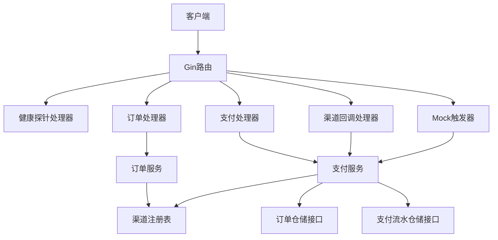
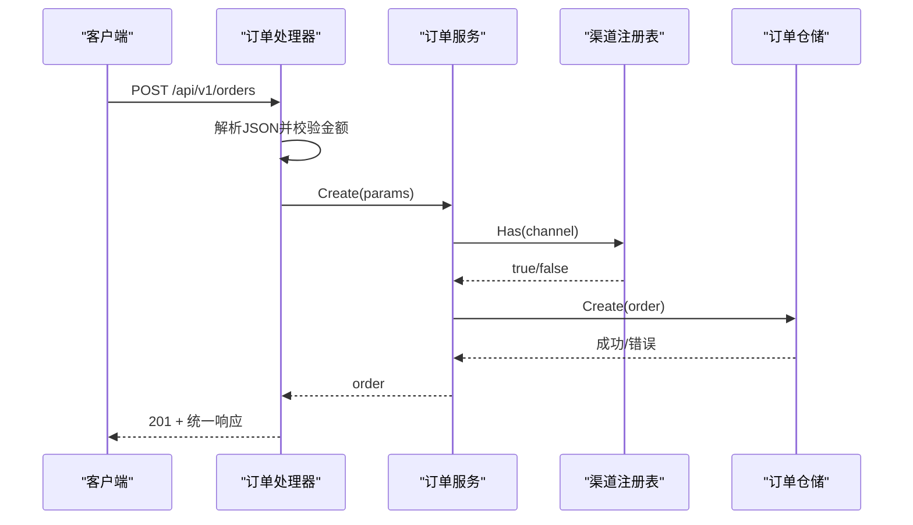
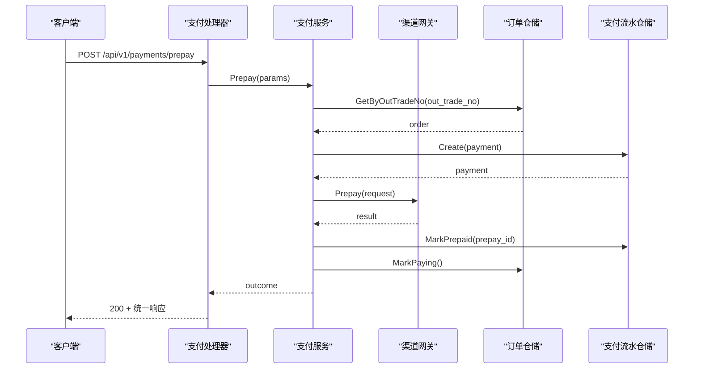
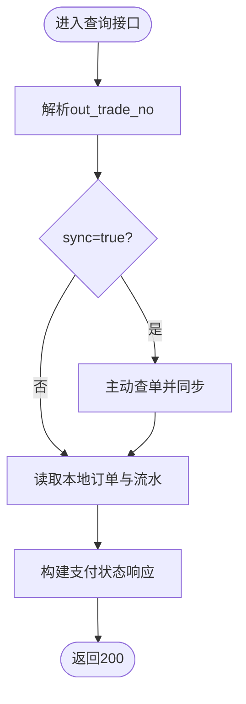
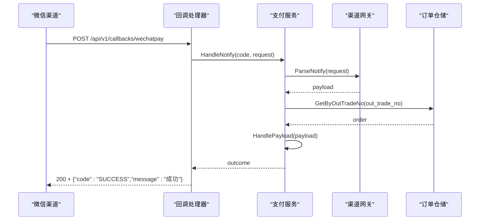
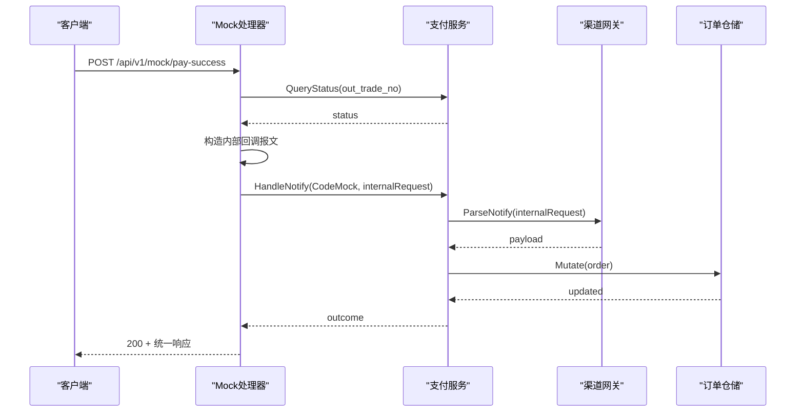

# HTTP API参考

<cite>
**本文引用的文件**   
- [README.md](file://README.md)
- [main.go](file://cmd/server/main.go)
- [config.yaml](file://configs/config.yaml)
- [order_handler.go](file://internal/handler/order_handler.go)
- [payment_handler.go](file://internal/handler/payment_handler.go)
- [callback_handler.go](file://internal/handler/callback_handler.go)
- [health.go](file://internal/handler/health.go)
- [mock_trigger.go](file://internal/handler/mock_trigger.go)
- [response.go](file://internal/pkg/response/response.go)
- [errcode.go](file://internal/errcode/errcode.go)
- [payment.go](file://internal/dto/payment.go)
- [order_service.go](file://internal/service/order_service.go)
- [payment_service.go](file://internal/service/payment_service.go)
- [registry.go](file://internal/channel/registry.go)
</cite>

## 目录
1. [引言](#引言)
2. [项目结构与接口总览](#项目结构与接口总览)
3. [统一响应体与错误码体系](#统一响应体与错误码体系)
4. [接口规范](#接口规范)
5. [认证、限流与安全说明](#认证限流与安全说明)
6. [API版本管理与向后兼容](#api版本管理与向后兼容)
7. [客户端集成示例](#客户端集成示例)
8. [调试与排错指南](#调试与排错指南)
9. [性能与可靠性建议](#性能与可靠性建议)
10. [结论](#结论)

## 引言
本文件是支付服务的对外HTTP API参考，覆盖订单管理、支付处理、渠道回调、Mock测试与健康检查等全部RESTful接口。文档同时说明统一响应体格式、错误码分类、请求/响应结构、安全约束、版本策略以及客户端集成与调试方法。服务当前默认以 `debug` 模式运行并使用 `mock` 渠道，便于端到端验证下单、发起支付、模拟回调与查单全流程；生产接入微信支付时，需按仓库说明完成配置与渠道实现注册。

## 项目结构与接口总览
服务采用分层架构：入口进程负责启动与优雅关闭；handler层解析HTTP请求并调用service业务逻辑；service层封装领域状态机、仓储与渠道抽象；channel层提供渠道无关的Gateway接口；repository层定义存储接口并提供内存实现；pkg层提供日志、金额、ID生成与统一响应等通用能力。

**图表来源**
- [main.go:31-124](file://cmd/server/main.go#L31-L124)
- [order_handler.go:13-78](file://internal/handler/order_handler.go#L13-L78)
- [payment_handler.go:16-118](file://internal/handler/payment_handler.go#L16-L118)
- [callback_handler.go:34-86](file://internal/handler/callback_handler.go#L34-L86)
- [mock_trigger.go:29-117](file://internal/handler/mock_trigger.go#L29-L117)
- [health.go:24-78](file://internal/handler/health.go#L24-L78)
- [order_service.go:21-124](file://internal/service/order_service.go#L21-L124)
- [payment_service.go:34-582](file://internal/service/payment_service.go#L34-L582)
- [registry.go:11-106](file://internal/channel/registry.go#L11-L106)

**章节来源**
- [README.md:38-75](file://README.md#L38-L75)
- [main.go:31-124](file://cmd/server/main.go#L31-L124)

## 统一响应体与错误码体系

### 统一响应体
所有业务接口返回统一JSON结构：
- code：业务码，0表示成功
- message：人类可读消息
- data：业务数据对象
- request_id：贯穿请求链路的追踪ID

该结构由统一响应包构造，并在失败时自动附加request_id。渠道异步回调接口不使用此结构，而是使用渠道约定的应答格式。

**章节来源**
- [response.go:1-41](file://internal/pkg/response/response.go#L1-L41)
- [response.go:65-132](file://internal/pkg/response/response.go#L65-L132)
- [README.md:77-83](file://README.md#L77-L83)

### 错误码分类
错误码按领域分段：
- 10xxx：通用错误（参数不合法、请求无法解析、资源不存在、内部错误、不支持操作、方法不允许）
- 20xxx：订单相关（订单不存在、状态不允许、金额不合法、已关闭、已支付）
- 30xxx：支付相关（支付记录不存在、金额不一致、缺少openid、渠道未启用）
- 40xxx：渠道相关（渠道未注册、渠道调用失败、验签或解密失败、功能未实现）

每个错误码绑定HTTP状态码，由统一响应包转换为标准失败响应。客户端应依据code做分支，不要对message做字符串匹配。

| 类别 | 典型错误码 | HTTP状态码 | 含义与处理建议 |
|---|---:|---:|---|
| 通用错误 | 10001 | 400 | 请求参数不合法，修正参数后重试 |
| 通用错误 | 10002 | 400 | 请求体无法解析，检查Content-Type与JSON语法 |
| 通用错误 | 10003 | 404 | 路径或资源不存在，检查URL与路径参数 |
| 通用错误 | 10004 | 500 | 服务内部错误，记录request_id并联系运维 |
| 通用错误 | 10005 | 403 | 当前环境不支持该操作，例如release模式访问Mock接口 |
| 通用错误 | 10006 | 405 | 请求方法不被允许，查看Allow头 |
| 订单错误 | 20001 | 404 | 订单不存在，确认out_trade_no |
| 订单错误 | 20002 | 409 | 订单状态不允许该操作，根据状态引导用户重新下单或等待 |
| 订单错误 | 20003 | 400 | 订单金额不合法，检查精度与正数约束 |
| 订单错误 | 20004 | 409 | 订单已关闭，引导重新下单 |
| 订单错误 | 20005 | 409 | 订单已支付，直接展示支付成功结果 |
| 支付错误 | 30001 | 404 | 支付记录不存在，检查是否先创建订单再发起支付 |
| 支付错误 | 30002 | 400 | 回调金额与订单金额不一致，属于资金异常，需人工介入 |
| 支付错误 | 30003 | 400 | JSAPI交易缺少openid，通过授权流程获取 |
| 支付错误 | 30004 | 400 | 支付渠道未启用，检查配置与默认渠道 |
| 渠道错误 | 40001 | 500 | 渠道未注册，检查装配与配置 |
| 渠道错误 | 40002 | 502 | 渠道调用失败，可重试并监控渠道可用性 |
| 渠道错误 | 40003 | 400 | 回调验签或解密失败，检查证书、密钥与报文完整性 |
| 渠道错误 | 40004 | 501 | 渠道功能未实现，骨架阶段退款走此分支 |

**章节来源**
- [errcode.go:1-158](file://internal/errcode/errcode.go#L1-L158)
- [README.md:136-160](file://README.md#L136-L160)

## 接口规范

### 健康检查接口

#### 存活探针
- 方法：GET
- URL：/healthz
- 请求参数：无
- 成功响应：
  - HTTP状态码：200
  - 响应体：包含status字段为ok的统一响应
- 行为说明：只要进程能处理请求即返回成功，不检查任何外部依赖

**章节来源**
- [health.go:36-47](file://internal/handler/health.go#L36-L47)
- [README.md:66-68](file://README.md#L66-L68)

#### 就绪探针
- 方法：GET
- URL：/readyz
- 请求参数：无
- 成功响应：
  - HTTP状态码：200
  - 响应体：包含status、channels、uptime_seconds、order_count的统一响应
- 失败响应：
  - HTTP状态码：503
  - 响应体：包含错误码与消息的统一响应，提示没有可用支付渠道
- 行为说明：若没有任何可用渠道，服务拒绝接收流量，避免支付请求全部失败

**章节来源**
- [health.go:49-78](file://internal/handler/health.go#L49-L78)
- [README.md:69-70](file://README.md#L69-L70)

### 订单管理接口

#### 创建订单
- 方法：POST
- URL：/api/v1/orders
- Content-Type：application/json
- 请求体字段：
  - subject：商品标题
  - amount：金额，字符串「元」，最多两位小数
  - channel：支付渠道编码，可选，留空则使用默认渠道
  - openid：支付者openid，可选
  - attach：附加数据，可选
- 成功响应：
  - HTTP状态码：201
  - 响应体data：订单对象，包含out_trade_no、subject、amount、amount_fen、channel、status、created_at等
- 常见错误：
  - 10001：参数校验失败
  - 20003：金额不合法
  - 40001：渠道未注册
  - 10004：服务内部错误

**图表来源**
- [order_handler.go:23-60](file://internal/handler/order_handler.go#L23-L60)
- [order_service.go:67-109](file://internal/service/order_service.go#L67-L109)
- [registry.go:76-83](file://internal/channel/registry.go#L76-L83)

**章节来源**
- [order_handler.go:23-60](file://internal/handler/order_handler.go#L23-L60)
- [order_service.go:67-109](file://internal/service/order_service.go#L67-L109)
- [README.md:90-94](file://README.md#L90-L94)

#### 查询订单
- 方法：GET
- URL：/api/v1/orders/:out_trade_no
- 路径参数：
  - out_trade_no：商户订单号
- 成功响应：
  - HTTP状态码：200
  - 响应体data：订单对象
- 常见错误：
  - 10001：路径参数缺失或非法
  - 20001：订单不存在
  - 10004：服务内部错误

**章节来源**
- [order_handler.go:62-78](file://internal/handler/order_handler.go#L62-L78)
- [order_service.go:112-124](file://internal/service/order_service.go#L112-L124)

### 支付处理接口

#### 发起支付
- 方法：POST
- URL：/api/v1/payments/prepay
- Content-Type：application/json
- 请求体字段：
  - out_trade_no：商户订单号
  - trade_type：交易类型，JSAPI/NATIVE/H5/APP，留空按JSAPI处理
  - channel：支付渠道编码，可选，优先使用订单创建时的渠道
  - openid：支付者openid，JSAPI交易必填
- 成功响应：
  - HTTP状态码：200
  - 响应体data：预支付结果，包含out_trade_no、payment_no、channel、trade_type、prepay_id、code_url（NATIVE）、invoke_params（JSAPI/小程序）
- 常见错误：
  - 10001：参数校验失败
  - 20001：订单不存在
  - 20002：订单状态不允许该操作
  - 20004：订单已关闭
  - 20005：订单已支付
  - 30003：JSAPI交易缺少openid
  - 40001：渠道未注册
  - 40002：渠道调用失败

**图表来源**
- [payment_handler.go:26-51](file://internal/handler/payment_handler.go#L26-L51)
- [payment_service.go:99-226](file://internal/service/payment_service.go#L99-L226)

**章节来源**
- [payment_handler.go:26-51](file://internal/handler/payment_handler.go#L26-L51)
- [payment_service.go:99-226](file://internal/service/payment_service.go#L99-L226)
- [payment.go:9-58](file://internal/dto/payment.go#L9-L58)
- [README.md:98-103](file://README.md#L98-L103)

#### 查询支付状态
- 方法：GET
- URL：/api/v1/payments/:out_trade_no
- 查询参数：
  - sync：布尔值，true时主动向渠道查单并同步本地状态
- 成功响应：
  - HTTP状态码：200
  - 响应体data：支付状态对象，包含out_trade_no、order_status、paid、amount、amount_fen、payments数组
- 常见错误：
  - 10001：路径参数缺失或非法
  - 20001：订单不存在
  - 40002：主动查单失败（仅warn日志，仍返回本地状态）

**图表来源**
- [payment_handler.go:53-85](file://internal/handler/payment_handler.go#L53-L85)
- [payment_service.go:528-546](file://internal/service/payment_service.go#L528-L546)
- [payment_service.go:548-582](file://internal/service/payment_service.go#L548-L582)

**章节来源**
- [payment_handler.go:53-118](file://internal/handler/payment_handler.go#L53-L118)
- [payment_service.go:528-582](file://internal/service/payment_service.go#L528-L582)
- [payment.go:60-112](file://internal/dto/payment.go#L60-L112)
- [README.md:111-116](file://README.md#L111-L116)

### 回调处理接口

#### 渠道异步回调
- 方法：POST
- URL：/api/v1/callbacks/wechatpay
- Content-Type：application/json
- 请求体：渠道通知报文（由渠道SDK解析）
- 成功响应：
  - HTTP状态码：200或204
  - 响应体：渠道约定格式，code为SUCCESS，message为成功文案
- 失败响应：
  - HTTP状态码：4xx或5xx
  - 响应体：渠道约定格式，code为FAIL，message为失败原因
- 幂等说明：重复回调会返回SUCCESS，不会重复推进订单状态

**图表来源**
- [callback_handler.go:44-86](file://internal/handler/callback_handler.go#L44-L86)
- [payment_service.go:258-379](file://internal/service/payment_service.go#L258-L379)

**章节来源**
- [callback_handler.go:14-86](file://internal/handler/callback_handler.go#L14-L86)
- [payment_service.go:258-379](file://internal/service/payment_service.go#L258-L379)
- [README.md:77-83](file://README.md#L77-L83)

### Mock测试接口

#### 模拟支付成功回调
- 方法：POST
- URL：/api/v1/mock/pay-success
- Content-Type：application/json
- 请求体字段：
  - out_trade_no：商户订单号
  - transaction_id：模拟渠道交易号，可选
  - amount_fen：模拟回调金额（分），留0表示与订单金额一致
  - openid：模拟付款用户openid，可选
- 成功响应：
  - HTTP状态码：200
  - 响应体data：模拟通知结果，包含out_trade_no、order_status、paid、transaction_id、idempotent
- 安全说明：仅在非release模式下注册，生产环境暴露等同于资金漏洞

**图表来源**
- [mock_trigger.go:43-117](file://internal/handler/mock_trigger.go#L43-L117)
- [payment_service.go:258-379](file://internal/service/payment_service.go#L258-L379)

**章节来源**
- [mock_trigger.go:29-117](file://internal/handler/mock_trigger.go#L29-L117)
- [payment_service.go:258-379](file://internal/service/payment_service.go#L258-L379)
- [README.md:105-116](file://README.md#L105-L116)

## 认证、限流与安全说明
- 认证机制：当前骨架未实现鉴权，生产接入时应增加身份认证与权限控制。
- 限流策略：当前骨架未实现限流，生产接入时应针对高频轮询与回调接口实施限流与熔断。
- 安全约束：
  - 证书目录被多层排除，严禁提交到代码库或镜像层
  - Mock路由不在release模式注册
  - 回调必须验签与解密，失败不应交给业务层
  - 日志不打印密钥、证书内容与完整回调报文
  - 金额全程使用int64「分」存储，避免浮点精度问题

**章节来源**
- [README.md:240-247](file://README.md#L240-L247)
- [README.md:286-293](file://README.md#L286-L293)

## API版本管理与向后兼容
- 当前所有业务接口均位于/api/v1前缀下，便于后续演进至v2而不影响现有调用方。
- 新增字段应保持向后兼容：旧客户端忽略未知字段。
- 废弃字段应保留一段时间并给出弃用提示，逐步迁移。
- 变更HTTP语义或错误码时需评估客户端兼容性，必要时提供过渡期双版本路由。

**章节来源**
- [README.md:64-75](file://README.md#L64-L75)

## 客户端集成示例
以下示例基于仓库提供的快速演示脚本，展示从下单到查单的完整链路。实际调用时请替换BASE地址与out_trade_no。

- 创建订单
  - 请求体包含subject、amount、openid
  - 成功后data.status为CREATED，记录out_trade_no
- 发起支付
  - 请求体包含out_trade_no
  - 成功后data.invoke_params可直接传给前端调起支付
- 模拟支付成功
  - 请求体包含out_trade_no
  - 成功后data.paid为true，data.idempotent用于判断是否命中幂等
- 查询支付状态
  - GET /api/v1/payments/:out_trade_no
  - 成功后data.order_status为PAID，data.payments[0].status为SUCCESS

**章节来源**
- [README.md:85-116](file://README.md#L85-L116)

## 调试与排错指南
- 使用request_id：中间件生成或沿用客户端传入的X-Request-Id，响应体与响应头回显，便于串联日志。
- 健康检查：
  - /healthz用于存活探测
  - /readyz用于就绪探测，无可用渠道时返回503
- 常见错误定位：
  - 10001/10002：检查请求体与Content-Type
  - 20001：确认out_trade_no是否存在
  - 20003：检查金额精度与单位
  - 30002：核对回调金额与订单金额，必要时人工介入
  - 40003：检查验签与解密配置
- 并发幂等：同一笔回调可能并发到达，服务保证只推进一次订单状态，重复回调返回idempotent=true。

**章节来源**
- [response.go:24-60](file://internal/pkg/response/response.go#L24-L60)
- [health.go:36-78](file://internal/handler/health.go#L36-L78)
- [errcode.go:78-134](file://internal/errcode/errcode.go#L78-L134)
- [README.md:118-160](file://README.md#L118-L160)

## 性能与可靠性建议
- 查询支付状态默认只读本地数据，避免频繁调用渠道触发限流；需要强制对齐时使用sync=true。
- 主动查单应由定时任务批量执行，作为掉单兜底；骨架中通过查询接口的sync参数手动触发。
- 回调处理具备幂等保护，重复投递不会重复推进订单状态。
- 金额计算使用整数「分」，避免浮点误差导致对账问题。
- 内存仓储使用读写锁与副本拷贝，保证并发安全；生产应替换为数据库实现并保持接口不变。

**章节来源**
- [payment_handler.go:53-85](file://internal/handler/payment_handler.go#L53-L85)
- [payment_service.go:528-582](file://internal/service/payment_service.go#L528-L582)
- [README.md:193-213](file://README.md#L193-L213)

## 结论
本API参考覆盖了支付服务的全部对外接口，包括订单管理、支付处理、渠道回调、Mock测试与健康检查。统一响应体与错误码体系为客户端提供了稳定的契约；渠道抽象层将差异收敛在Gateway之后，便于扩展真实渠道。生产接入时应补充鉴权、限流、持久化与调度能力，并严格遵循安全约束与金额精度要求。