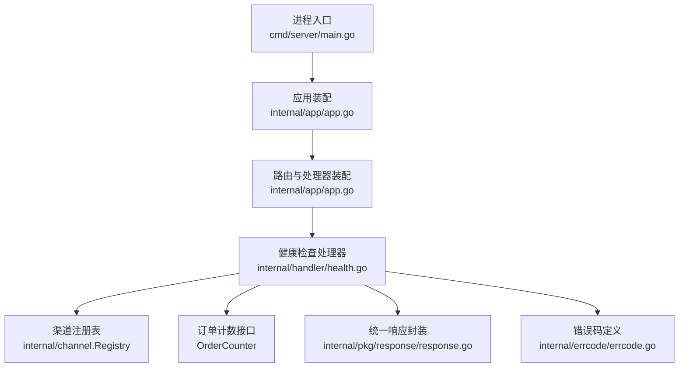
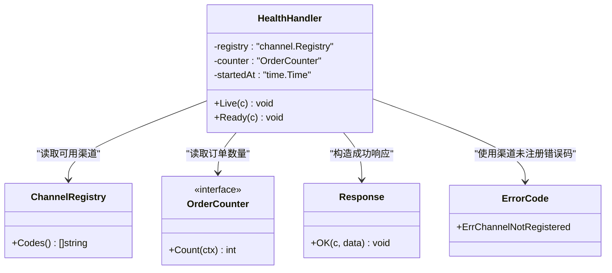
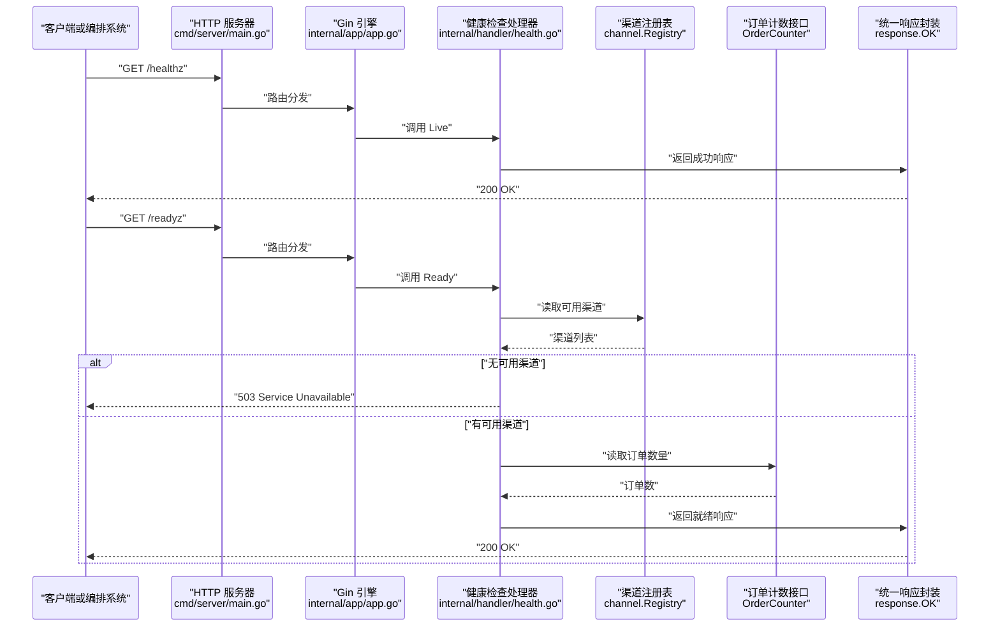
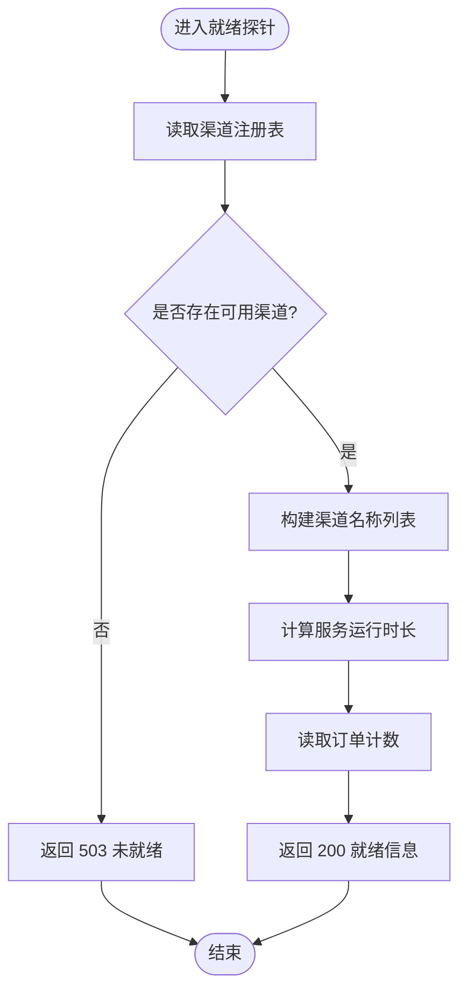
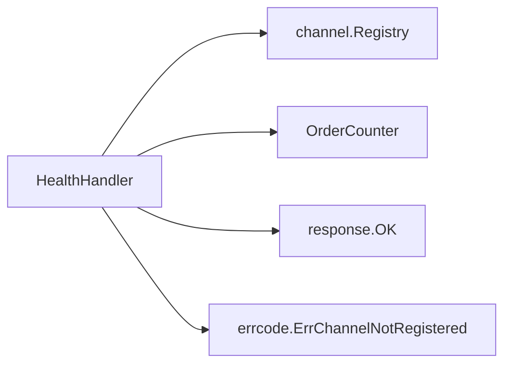

# 健康检查接口

<cite>
**本文引用的文件**   
- [internal/handler/health.go](file://internal/handler/health.go)
- [internal/app/app.go](file://internal/app/app.go)
- [cmd/server/main.go](file://cmd/server/main.go)
- [Dockerfile](file://Dockerfile)
- [internal/pkg/response/response.go](file://internal/pkg/response/response.go)
- [internal/errcode/errcode.go](file://internal/errcode/errcode.go)
</cite>

## 目录
1. [简介](#简介)
2. [项目结构与健康检查入口](#项目结构与健康检查入口)
3. [核心组件](#核心组件)
4. [架构总览](#架构总览)
5. [接口详细定义](#接口详细定义)
6. [实现原理与依赖检测](#实现原理与依赖检测)
7. [Kubernetes 与容器编排集成](#kubernetes-与容器编排集成)
8. [负载均衡与健康检查集成示例](#负载均衡与健康检查集成示例)
9. [依赖关系分析](#依赖关系分析)
10. [性能与稳定性考虑](#性能与稳定性考虑)
11. [故障排查指南](#故障排查指南)
12. [结论](#结论)

## 简介
本文件面向支付服务的健康检查能力，重点说明两个 HTTP 接口：
- GET /healthz：存活探针。用于判断服务进程是否仍在运行并能够处理请求。
- GET /readyz：就绪探针。用于判断服务是否已完全启动、依赖可用，并可以安全接收业务流量。

在 Kubernetes 等容器编排系统中：
- 存活探针失败会触发容器重启。
- 就绪探针失败不会重启容器，但会把 Pod 从 Service 的 endpoints 中摘除，从而停止向其转发流量。

因此，存活探针应保持轻量且稳定；就绪探针可包含更严格的可用性判断，例如渠道注册状态、订单计数等。

## 项目结构与健康检查入口
健康检查由应用装配层统一注册到路由系统，并由 Gin 引擎对外暴露。进程入口负责加载配置、组装依赖、启动 HTTP 服务，并监听退出信号进行优雅关闭。

**图表来源**
- [cmd/server/main.go:31-67](file://cmd/server/main.go#L31-L67)
- [internal/app/app.go:85-95](file://internal/app/app.go#L85-L95)
- [internal/handler/health.go:24-34](file://internal/handler/health.go#L24-L34)
- [internal/pkg/response/response.go:65-73](file://internal/pkg/response/response.go#L65-L73)
- [internal/errcode/errcode.go:124-134](file://internal/errcode/errcode.go#L124-L134)

**章节来源**
- [cmd/server/main.go:31-67](file://cmd/server/main.go#L31-L67)
- [internal/app/app.go:85-95](file://internal/app/app.go#L85-L95)

## 核心组件
健康检查的核心是 `HealthHandler`，它同时提供存活探针和就绪探针：
- 存活探针不检查任何外部依赖，只要进程能响应请求就返回成功。
- 就绪探针检查渠道注册情况，并在没有可用渠道时返回未就绪状态。

**图表来源**
- [internal/handler/health.go:15-34](file://internal/handler/health.go#L15-L34)
- [internal/handler/health.go:45-78](file://internal/handler/health.go#L45-L78)
- [internal/pkg/response/response.go:65-73](file://internal/pkg/response/response.go#L65-L73)
- [internal/errcode/errcode.go:124-134](file://internal/errcode/errcode.go#L124-L134)

**章节来源**
- [internal/handler/health.go:15-78](file://internal/handler/health.go#L15-L78)

## 架构总览
健康检查接口的调用路径如下：
1. 客户端或编排系统发起 HTTP 请求。
2. Gin 路由将请求分发到健康检查处理器。
3. 存活探针直接返回成功。
4. 就绪探针读取渠道注册表和订单计数，返回就绪信息或未就绪状态。

**图表来源**
- [cmd/server/main.go:61-67](file://cmd/server/main.go#L61-L67)
- [internal/app/app.go:85-95](file://internal/app/app.go#L85-L95)
- [internal/handler/health.go:45-78](file://internal/handler/health.go#L45-L78)
- [internal/pkg/response/response.go:65-73](file://internal/pkg/response/response.go#L65-L73)

## 接口详细定义

### GET /healthz（存活探针）
- 用途：判断服务进程是否正常运行并可响应请求。
- 行为：不检查数据库、支付渠道或其他外部依赖。
- 成功响应：
  - HTTP 状态码：200
  - 响应体字段：status
  - 语义：进程存活且 HTTP 层正常。

**章节来源**
- [internal/handler/health.go:36-47](file://internal/handler/health.go#L36-L47)
- [internal/pkg/response/response.go:65-73](file://internal/pkg/response/response.go#L65-L73)

### GET /readyz（就绪探针）
- 用途：判断服务是否已完全启动并准备好接收业务请求。
- 行为：
  - 读取渠道注册表中的可用渠道。
  - 如果没有可用渠道，返回未就绪。
  - 如果存在可用渠道，返回就绪信息，包括渠道名称、运行时长和订单计数。
- 成功响应：
  - HTTP 状态码：200
  - 响应体字段：
    - status：表示就绪状态
    - channels：当前可用的支付渠道列表
    - uptime_seconds：服务运行时长
    - order_count：当前订单数量
- 失败响应：
  - HTTP 状态码：503
  - 响应体字段：
    - code：渠道未注册相关错误码
    - message：描述服务未就绪的原因

**章节来源**
- [internal/handler/health.go:49-78](file://internal/handler/health.go#L49-L78)
- [internal/pkg/response/response.go:65-73](file://internal/pkg/response/response.go#L65-L73)
- [internal/errcode/errcode.go:124-134](file://internal/errcode/errcode.go#L124-L134)

## 实现原理与依赖检测
健康检查的实现遵循“分层清晰、依赖可控”的原则：
- 存活探针保持极简，避免把外部依赖抖动放大为容器重启风暴。
- 就绪探针聚焦于“能否完成支付”，通过渠道注册表判断是否有可用支付通道。
- 就绪探针还暴露运行时长和订单计数，便于运维观察服务状态和业务负载。

**图表来源**
- [internal/handler/health.go:55-78](file://internal/handler/health.go#L55-L78)

**章节来源**
- [internal/handler/health.go:15-78](file://internal/handler/health.go#L15-L78)

## Kubernetes 与容器编排集成

### 存活探针建议
- 使用 /healthz。
- 只检查进程是否存活，不检查数据库、缓存、支付渠道等外部依赖。
- 原因：外部依赖短暂不可用不应导致所有副本被同时重启，否则正在处理的支付回调会被中断，造成掉单风险。

### 就绪探针建议
- 使用 /readyz。
- 检查渠道是否至少有一个可用。
- 原因：若没有任何可用支付渠道，继续接收流量只会让支付请求全部失败；此时应把 Pod 从 Service endpoints 中摘除，而不是重启容器。

### Docker HEALTHCHECK 参考
镜像中已内置对 /healthz 的健康检查命令，可作为容器运行时健康检查的基础参考。

**章节来源**
- [Dockerfile:49-52](file://Dockerfile#L49-L52)
- [internal/handler/health.go:36-47](file://internal/handler/health.go#L36-L47)
- [internal/handler/health.go:49-78](file://internal/handler/health.go#L49-L78)

## 负载均衡与健康检查集成示例

### Kubernetes Service 与探针配置思路
- Deployment 中配置 livenessProbe 指向 /healthz。
- Deployment 中配置 readinessProbe 指向 /readyz。
- Service 根据 readinessProbe 结果自动管理 endpoints。
- Ingress 或网关可根据上游健康状态做流量调度。

### 负载均衡器健康检查思路
- 四层负载均衡：可对端口连通性做基础检查。
- 七层负载均衡：优先对接 /healthz 作为快速存活检查。
- 业务网关：可结合 /readyz 判断是否具备支付能力，再决定是否转发支付类请求。

### 灰度发布与滚动更新
- 滚动更新时，新 Pod 先通过 /readyz 才加入流量池。
- 旧 Pod 在 /readyz 失败后被摘除，避免流量打到尚未就绪实例。
- 对于支付服务，应避免因外部依赖抖动引发大规模重启，优先依赖就绪探针控制流量。

[本节为通用集成建议，不直接分析具体源码文件]

## 依赖关系分析
健康检查处理器依赖以下组件：
- 渠道注册表：用于判断是否有可用支付渠道。
- 订单计数接口：用于上报当前订单数量。
- 统一响应封装：用于输出标准 JSON 响应。
- 错误码定义：用于在未就绪场景返回结构化错误码。

**图表来源**
- [internal/handler/health.go:24-34](file://internal/handler/health.go#L24-L34)
- [internal/handler/health.go:55-78](file://internal/handler/health.go#L55-L78)
- [internal/pkg/response/response.go:65-73](file://internal/pkg/response/response.go#L65-L73)
- [internal/errcode/errcode.go:124-134](file://internal/errcode/errcode.go#L124-L134)

**章节来源**
- [internal/handler/health.go:24-78](file://internal/handler/health.go#L24-L78)
- [internal/pkg/response/response.go:65-73](file://internal/pkg/response/response.go#L65-L73)
- [internal/errcode/errcode.go:124-134](file://internal/errcode/errcode.go#L124-L134)

## 性能与稳定性考虑
- 存活探针必须极轻：不访问数据库、不调用外部支付渠道、不做复杂计算。
- 就绪探针应避免昂贵 I/O：当前实现主要读取内存中的渠道注册表和订单计数，开销较低。
- 避免级联故障：外部依赖抖动不应触发容器重启，应通过就绪探针摘流而非重启。
- 优雅关闭：进程入口支持优雅关闭，避免硬切断正在处理的支付回调。

**章节来源**
- [internal/handler/health.go:36-47](file://internal/handler/health.go#L36-L47)
- [internal/handler/health.go:49-78](file://internal/handler/health.go#L49-L78)
- [cmd/server/main.go:69-123](file://cmd/server/main.go#L69-L123)

## 故障排查指南

### /healthz 一直失败
可能原因：
- HTTP 服务未启动。
- 端口被占用或权限不足。
- 网络策略或防火墙阻止访问。

排查步骤：
1. 确认服务进程是否启动。
2. 检查端口监听是否正常。
3. 检查容器或主机网络策略。
4. 查看进程日志中的启动和异常信息。

**章节来源**
- [cmd/server/main.go:61-67](file://cmd/server/main.go#L61-L67)
- [cmd/server/main.go:90-96](file://cmd/server/main.go#L90-L96)

### /readyz 返回 503
可能原因：
- 没有可用的支付渠道。
- 默认渠道未注册。
- 渠道实现未接入或配置未启用。

排查步骤：
1. 查看就绪响应中的错误码和消息。
2. 检查渠道注册逻辑和配置。
3. 确认 release 模式下 mock 渠道被禁用。
4. 确认微信支付等真实渠道是否已实现并启用。

**章节来源**
- [internal/handler/health.go:55-78](file://internal/handler/health.go#L55-L78)
- [internal/app/app.go:108-151](file://internal/app/app.go#L108-L151)
- [internal/errcode/errcode.go:124-134](file://internal/errcode/errcode.go#L124-L134)

### 就绪探针频繁摘流
可能原因：
- 渠道注册不稳定。
- 部署过程中渠道尚未初始化完成。
- 配置变更导致渠道不可用。

优化建议：
- 调整就绪探针间隔和超时时间。
- 确保启动阶段完成渠道注册后再暴露流量。
- 在生产环境避免把易抖动的依赖放入就绪检查。

**章节来源**
- [internal/handler/health.go:49-78](file://internal/handler/health.go#L49-L78)
- [internal/app/app.go:108-151](file://internal/app/app.go#L108-L151)

## 结论
健康检查接口是支付服务高可用的关键入口：
- /healthz 保证进程存活，适合做存活探针。
- /readyz 保证服务具备支付能力，适合做就绪探针。
- 在 Kubernetes 中，应分别配置 livenessProbe 和 readinessProbe，并通过 Service 自动管理 endpoints。
- 健康检查应避免把外部依赖抖动放大为全局故障，优先通过就绪探针摘流，而不是重启容器。