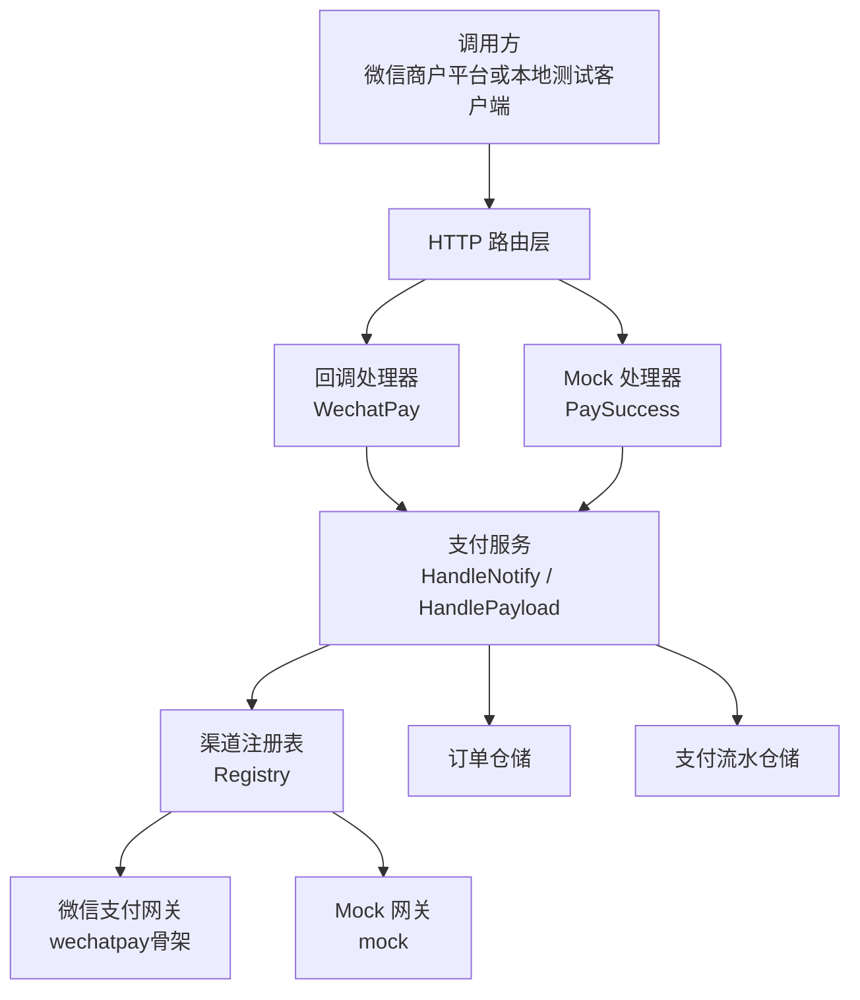
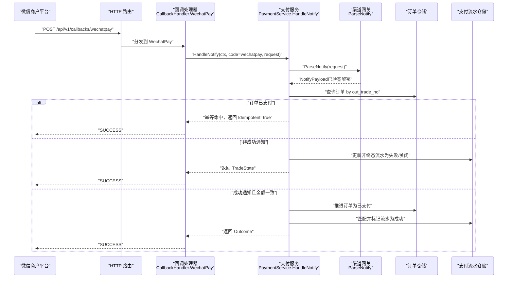
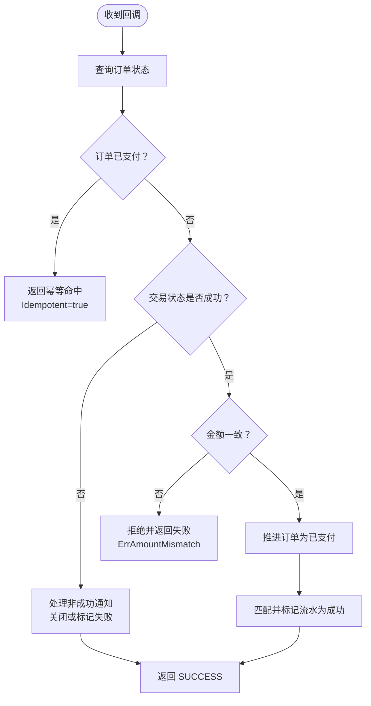
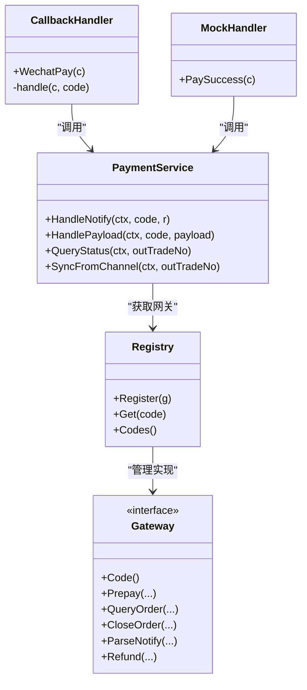

# 回调处理接口

<cite>
**本文引用的文件**   
- [callback_handler.go](file://internal/handler/callback_handler.go)
- [mock_trigger.go](file://internal/handler/mock_trigger.go)
- [payment_service.go](file://internal/service/payment_service.go)
- [payment.go](file://internal/model/payment.go)
- [payment.go](file://internal/dto/payment.go)
- [errcode.go](file://internal/errcode/errcode.go)
- [response.go](file://internal/pkg/response/response.go)
- [registry.go](file://internal/channel/registry.go)
- [doc.go](file://internal/channel/wechatpay/doc.go)
- [app.go](file://internal/app/app.go)
</cite>

## 目录
1. [简介](#简介)
2. [项目结构](#项目结构)
3. [核心组件](#核心组件)
4. [架构总览](#架构总览)
5. [详细组件分析](#详细组件分析)
6. [依赖关系分析](#依赖关系分析)
7. [性能与可靠性](#性能与可靠性)
8. [故障排查指南](#故障排查指南)
9. [结论](#结论)

## 简介
本文档面向接入方与内部维护者，详细说明本服务的两个回调处理接口：
- POST /api/v1/callbacks/wechatpay：微信支付异步结果通知入口。
- POST /api/v1/mock/pay-success：本地 Mock 测试入口，用于在不依赖真实商户号的情况下端到端验证支付状态机、回调幂等与金额校验逻辑。

文档重点覆盖：
- 微信支付回调的请求格式、签名验证机制、通知参数结构与响应要求。
- Mock 回调接口的功能、请求参数、使用场景与注意事项。
- 回调处理的幂等性保证机制，防止重复投递导致的状态不一致。
- 回调安全验证流程，包括签名校验、金额一致性检查等安全措施。
- 回调响应的正确格式与错误处理策略。
- 回调失败的重试机制与监控告警建议。

## 项目结构
本项目的回调处理由“路由层 → Handler → Service → 渠道网关”分层实现：
- Handler 负责解析 HTTP 请求、统一日志与错误码映射。
- Service 负责业务主流程：验签、解密、订单与流水状态推进、幂等控制、金额校验。
- 渠道网关（Channel Gateway）抽象了不同支付渠道的入参、下单、查单、关单、回调解析与退款能力；当前微信支付为占位实现，Mock 渠道可端到端运行。

**图表来源**
- [callback_handler.go:44-86](file://internal/handler/callback_handler.go#L44-L86)
- [mock_trigger.go:43-117](file://internal/handler/mock_trigger.go#L43-L117)
- [payment_service.go:258-379](file://internal/service/payment_service.go#L258-L379)
- [registry.go:11-74](file://internal/channel/registry.go#L11-L74)

**章节来源**
- [callback_handler.go:1-86](file://internal/handler/callback_handler.go#L1-L86)
- [mock_trigger.go:1-118](file://internal/handler/mock_trigger.go#L1-L118)
- [payment_service.go:258-379](file://internal/service/payment_service.go#L258-L379)
- [registry.go:11-107](file://internal/channel/registry.go#L11-L107)

## 核心组件
- 回调处理器：统一处理各渠道异步通知，按渠道编码分发到具体网关解析，再交由 Service 完成业务处理。
- Mock 处理器：构造与真实回调同构的 HTTP 请求，走完整 HandleNotify 路径，便于提前验证 ParseNotify 与后续状态机。
- 支付服务：承担验签、解密、订单与流水状态推进、并发幂等保护、金额一致性校验、非成功通知处理、主动查单兜底等职责。
- 渠道注册表：以运行时配置方式管理可用渠道，避免编译期硬编码，支持扩展新渠道。
- 错误码与响应：统一错误码体系与 HTTP 状态码映射；注意渠道回调必须按渠道规范应答，不走统一响应体。

**章节来源**
- [callback_handler.go:14-86](file://internal/handler/callback_handler.go#L14-L86)
- [mock_trigger.go:29-117](file://internal/handler/mock_trigger.go#L29-L117)
- [payment_service.go:34-73](file://internal/service/payment_service.go#L34-L73)
- [errcode.go:1-158](file://internal/errcode/errcode.go#L1-L158)
- [response.go:1-133](file://internal/pkg/response/response.go#L1-L133)

## 架构总览
下图展示从外部回调进入，到订单与流水状态推进的完整时序。

**图表来源**
- [callback_handler.go:44-86](file://internal/handler/callback_handler.go#L44-L86)
- [payment_service.go:258-379](file://internal/service/payment_service.go#L258-L379)

## 详细组件分析

### 微信支付回调接口 POST /api/v1/callbacks/wechatpay
该接口是微信支付异步通知的统一入口。Handler 不直接处理业务，而是将请求交给 Service，再由 Service 通过渠道注册表找到对应网关进行验签与解密，最终统一处理订单与流水状态。

- 请求方法：POST
- 路径：/api/v1/callbacks/wechatpay
- 认证与签名：由渠道网关在 ParseNotify 中完成；需要保留原始 *http.Request，以便读取 Wechatpay-Signature、Wechatpay-Timestamp、Wechatpay-Nonce、Wechatpay-Serial 等头部。
- 业务处理：Service 层对同一笔交易进行幂等判断、金额一致性校验、状态推进与流水记录。

#### 请求格式与签名验证
- 请求体：微信支付 APIv3 的通知报文，包含加密后的交易信息。
- 关键请求头：Wechatpay-Signature、Wechatpay-Timestamp、Wechatpay-Nonce、Wechatpay-Serial。
- 验签与解密：由渠道网关实现；若失败，Service 会向上抛出渠道校验失败错误，Handler 将其转为失败响应并让渠道重试。

#### 通知参数结构
Service 层对渠道通知进行统一抽象，关键字段包括：
- out_trade_no：商户订单号
- transaction_id：渠道侧交易号
- trade_state：交易状态（如 SUCCESS、NOTPAY、USERPAYING、CLOSED、PAYERROR）
- trade_state_desc：渠道描述
- amount_total：回调金额（分）
- amount_payer_total：付款人金额（分）
- currency：币种
- success_time：成功时间
- openid：付款人标识（JSAPI 场景）

#### 响应要求
微信支付回调只认以下约定：
- 成功：HTTP 200/204 + {"code":"SUCCESS","message":"成功"}
- 失败：HTTP 4xx/5xx + {"code":"FAIL","message":"失败原因"}

注意：不能使用本服务的统一响应体 {"code":0,"message":"ok"}，否则微信会判定通知失败并按固定间隔持续重试。

#### 错误处理策略
- 金额不一致与验签失败属于资金与安全事件，Handler 会记录 Error 级别日志并触发人工介入告警。
- 其他错误（如订单不存在）记 Warn，避免渠道重试期间刷满 Error 日志掩盖真正告警。
- 对于网络抖动、数据库瞬时不可用等临时故障，返回失败状态码让渠道按策略重试是唯一自动恢复手段。

**章节来源**
- [callback_handler.go:14-86](file://internal/handler/callback_handler.go#L14-L86)
- [payment_service.go:258-379](file://internal/service/payment_service.go#L258-L379)
- [doc.go:63-74](file://internal/channel/wechatpay/doc.go#L63-L74)

### Mock 测试回调接口 POST /api/v1/mock/pay-success
该接口用于本地测试，无需真实微信支付商户号即可端到端验证状态机、回调幂等与金额校验逻辑。

- 请求方法：POST
- 路径：/api/v1/mock/pay-success
- 环境限制：仅在非 release 模式下注册；生产环境暴露该接口等同于允许任何人把任意订单改成已支付，因此必须严格禁用。

#### 请求参数
- out_trade_no：必填，商户订单号
- transaction_id：可选，模拟渠道交易号；留空自动生成
- amount_fen：可选，模拟回调中的金额（分）；留 0 表示与订单金额一致；显式传入不同值可用于验证金额校验是否生效
- openid：可选，模拟付款用户 openid；留空回退到订单上保存的值

#### 响应结构
- out_trade_no：订单号
- order_status：订单状态字符串
- paid：是否已支付
- transaction_id：本次模拟的交易号
- idempotent：是否为幂等命中（true 表示订单在本次调用前就已支付）

#### 使用方式
- 先创建订单并发起支付（或使用已有订单）。
- 调用 Mock 接口传入 out_trade_no；若未传 amount_fen，则默认使用订单金额。
- 接口内部会构造与真实回调同构的 HTTP 请求，走 service.HandleNotify，从而覆盖 mock 渠道的 ParseNotify 执行路径。

**章节来源**
- [mock_trigger.go:29-117](file://internal/handler/mock_trigger.go#L29-L117)
- [payment.go:114-141](file://internal/dto/payment.go#L114-L141)
- [app.go:85-105](file://internal/app/app.go#L85-L105)

### 幂等性保证机制
回调处理的核心难点在于渠道可能重复投递通知。系统通过多层幂等保护确保订单与流水状态不会因重复回调而异常推进：

- 订单级快速返回：若订单已是已支付状态，直接返回幂等命中结果，避免重复落库。
- 并发保护：在推进订单状态时使用锁内二次判断，防止两个回调同时通过。
- 流水级保护：流水状态机定义合法后继状态，禁止非法流转；重复成功标记会被识别为终态。
- 幂等命中仍返回 SUCCESS：重复投递是渠道正常行为，本地状态已经正确时不应让渠道继续重试。

**图表来源**
- [payment_service.go:301-379](file://internal/service/payment_service.go#L301-L379)
- [payment.go:10-50](file://internal/model/payment.go#L10-L50)

**章节来源**
- [payment_service.go:301-379](file://internal/service/payment_service.go#L301-L379)
- [payment.go:10-50](file://internal/model/payment.go#L10-L50)

### 安全验证流程
- 签名校验：由渠道网关在 ParseNotify 中完成；必须原样接收 *http.Request，以便读取必要头部。
- 金额一致性检查：在推进订单状态之前比较回调金额与订单金额；不一致坚决拒绝，防止篡改金额或串单。
- 凭据安全：微信支付私钥与 APIv3 密钥一旦泄漏等同于资金账户失守；私钥文件仅放在 certs/ 下，APIv3 密钥仅从环境变量读取，日志严禁打印敏感信息。

**章节来源**
- [payment_service.go:320-333](file://internal/service/payment_service.go#L320-L333)
- [doc.go:88-104](file://internal/channel/wechatpay/doc.go#L88-L104)

### 回调失败的错误处理与重试
- Handler 层根据错误码区分日志级别：金额不一致与验签失败记录 Error 并触发人工介入；其余错误记录 Warn。
- 对于临时故障（网络抖动、数据库瞬时不可用），返回失败状态码让渠道按策略重试。
- 渠道重试策略：微信在未收到成功应答时会按 15s/15s/30s/3m/... 的间隔重复投递，因此幂等命中也必须返回 SUCCESS。

**章节来源**
- [callback_handler.go:55-86](file://internal/handler/callback_handler.go#L55-L86)
- [payment_service.go:301-313](file://internal/service/payment_service.go#L301-L313)

## 依赖关系分析
- Handler 依赖 Service 完成业务处理，Service 依赖渠道注册表获取具体网关实现。
- 渠道注册表提供并发安全的渠道查找与注册能力，避免编译期硬编码。
- 错误码体系统一业务错误与 HTTP 状态码映射，Handler 与 Service 均基于此进行错误处理。
- 响应包提供统一响应体，但渠道回调必须按渠道规范应答，不走统一响应体。

**图表来源**
- [callback_handler.go:34-86](file://internal/handler/callback_handler.go#L34-L86)
- [mock_trigger.go:29-117](file://internal/handler/mock_trigger.go#L29-L117)
- [payment_service.go:34-73](file://internal/service/payment_service.go#L34-L73)
- [registry.go:11-74](file://internal/channel/registry.go#L11-L74)

**章节来源**
- [callback_handler.go:34-86](file://internal/handler/callback_handler.go#L34-L86)
- [mock_trigger.go:29-117](file://internal/handler/mock_trigger.go#L29-L117)
- [payment_service.go:34-73](file://internal/service/payment_service.go#L34-L73)
- [registry.go:11-107](file://internal/channel/registry.go#L11-L107)

## 性能与可靠性
- 幂等快速返回：已支付订单直接返回，避免重复落库与状态机计算。
- 非成功通知最小化变更：仅更新非终态流水，不动订单状态，减少写放大。
- 流水匹配优先级：优先按渠道交易号精确匹配，其次取最新未终结流水，最后取最后一条流水，提高匹配效率与准确性。
- 主动查单兜底：通过 SyncFromChannel 复用 HandlePayload 逻辑，保证回调与查单对同一笔交易的结论一致，作为掉单兜底核心手段。

**章节来源**
- [payment_service.go:301-379](file://internal/service/payment_service.go#L301-L379)
- [payment_service.go:455-520](file://internal/service/payment_service.go#L455-L520)
- [payment_service.go:548-582](file://internal/service/payment_service.go#L548-L582)

## 故障排查指南
- 回调重复投递：检查是否返回了渠道要求的 SUCCESS；若返回统一响应体，微信会持续重试。
- 金额不一致：核对订单金额与回调金额是否一致；若不一致，拒绝置为已支付并记录 Error 日志。
- 验签失败：确认渠道网关是否正确读取请求头并完成验签；检查证书与 APIv3 密钥配置。
- 订单状态异常：检查状态机流转是否合法；查看流水状态是否处于终态。
- Mock 接口误用：确认是否在非 release 模式启用；生产环境严禁暴露。

**章节来源**
- [callback_handler.go:55-86](file://internal/handler/callback_handler.go#L55-L86)
- [payment_service.go:320-333](file://internal/service/payment_service.go#L320-L333)
- [errcode.go:112-134](file://internal/errcode/errcode.go#L112-L134)
- [mock_trigger.go:29-34](file://internal/handler/mock_trigger.go#L29-L34)

## 结论
本项目的回调处理接口通过清晰的层次划分与严格的幂等保护，确保了微信支付回调的安全性与可靠性。Mock 接口为本地测试提供了端到端的验证能力，帮助团队在接入真实渠道前充分验证状态机与金额校验逻辑。生产环境中应严格禁用 Mock 接口，并确保渠道回调按规范应答，避免因响应格式问题导致渠道持续重试。