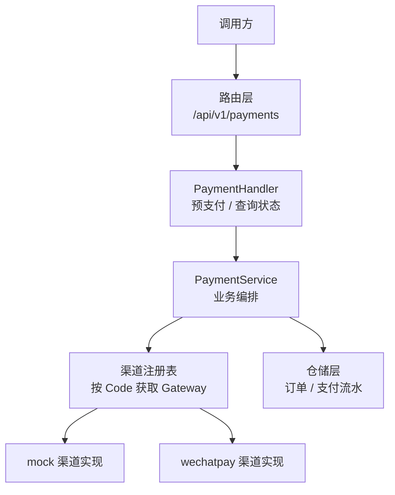
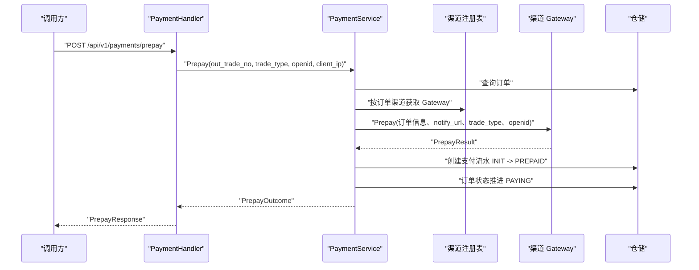
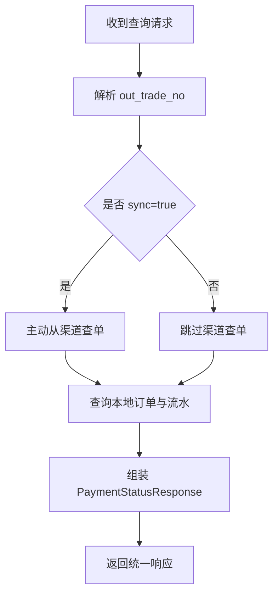
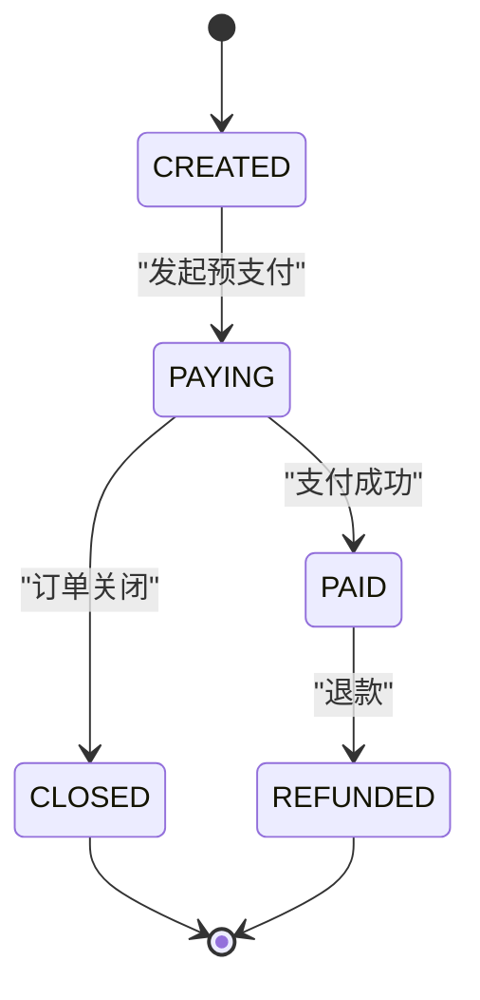
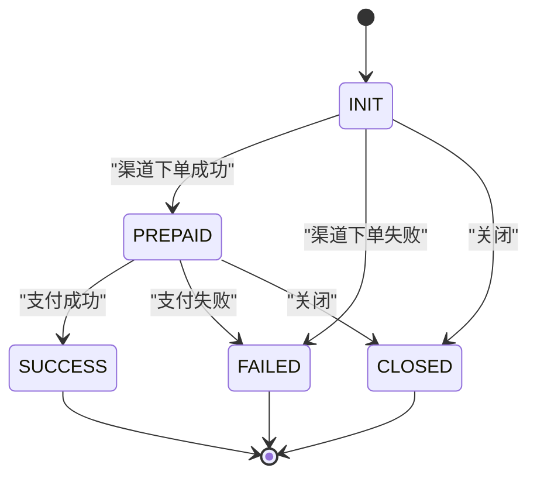
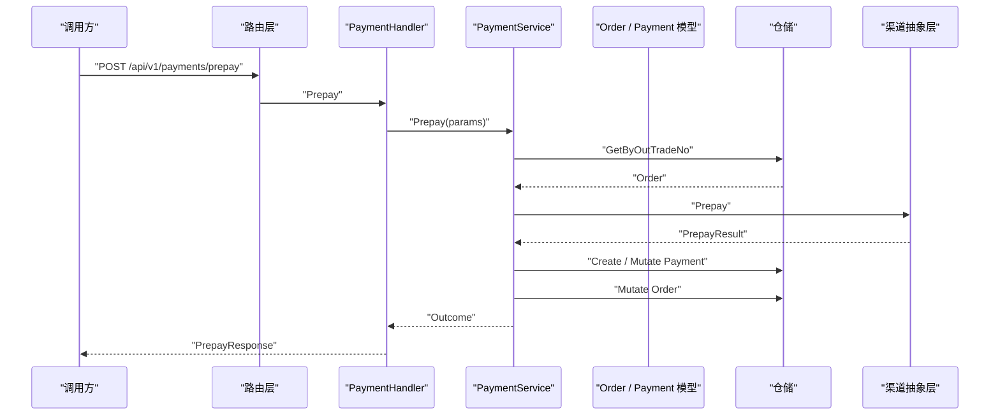
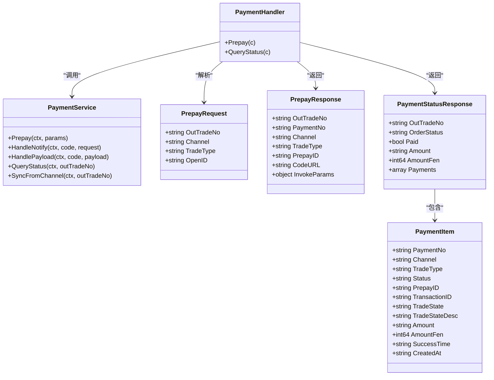

# 支付处理接口

<cite>
**本文引用的文件**   
- [README.md](file://README.md)
- [router.go](file://internal/router/router.go)
- [payment_handler.go](file://internal/handler/payment_handler.go)
- [payment_service.go](file://internal/service/payment_service.go)
- [payment.go](file://internal/dto/payment.go)
- [payment_model.go](file://internal/model/payment.go)
- [registry.go](file://internal/channel/registry.go)
</cite>

## 目录
1. [简介](#简介)
2. [项目结构与入口](#项目结构与入口)
3. [核心接口总览](#核心接口总览)
4. [发起预支付接口 POST /api/v1/payments/prepay](#发起预支付接口-post-apiv1paymentsprepay)
5. [查询支付状态接口 GET /api/v1/payments/:out_trade_no](#查询支付状态接口-get-apiv1paymentsout_trade_no)
6. [支付渠道与预支付参数示例](#支付渠道与预支付参数示例)
7. [支付状态流转与查询时机](#支付状态流转与查询时机)
8. [轮询最佳实践与错误处理](#轮询最佳实践与错误处理)
9. [依赖关系与架构视图](#依赖关系与架构视图)
10. [常见问题排查](#常见问题排查)
11. [结论](#结论)

## 简介
本文面向调用方，说明本支付服务的两个核心对外接口：
- 发起预支付：`POST /api/v1/payments/prepay`
- 查询支付状态：`GET /api/v1/payments/:out_trade_no`

文档重点覆盖以下方面：
- 预支付接口的请求参数，包括商户订单号 `out_trade_no`、支付渠道 `channel`、交易类型 `trade_type`、支付者标识 `openid`。
- 预支付返回结构，包括支付流水号、渠道、交易类型、预支付标识、前端调起参数等。
- 支付状态查询的响应格式，包括订单状态、是否已支付、金额、支付流水明细等。
- 不同支付渠道的预支付参数差异与示例说明。
- 支付状态流转规则与查询时机建议。
- 支付结果轮询的最佳实践和错误处理方案。

## 项目结构与入口
本服务采用分层设计：路由层负责暴露 HTTP 接口，Handler 层负责解析请求并调用 Service 层，Service 层封装业务逻辑，Model 层定义领域模型与状态机，Channel 抽象层屏蔽具体支付渠道差异。



**图表来源**
- [router.go:91-104](file://internal/router/router.go#L91-L104)
- [payment_handler.go:16-50](file://internal/handler/payment_handler.go#L16-L50)
- [payment_service.go:34-46](file://internal/service/payment_service.go#L34-L46)
- [registry.go:11-24](file://internal/channel/registry.go#L11-L24)

**章节来源**
- [README.md:38-62](file://README.md#L38-L62)
- [router.go:15-20](file://internal/router/router.go#L15-L20)

## 核心接口总览
本项目对外支付相关接口如下：
- `POST /api/v1/payments/prepay`：发起支付，返回前端调起支付所需参数。
- `GET /api/v1/payments/:out_trade_no`：查询支付状态；可选参数 `sync=true` 时主动从渠道查单后返回本地状态。

统一响应体结构为：
```json
{
  "code": 0,
  "message": "ok",
  "data": {},
  "request_id": "..."
}
```
其中 `code=0` 表示成功，HTTP 状态码用于网关与监控判断，业务码用于客户端分支处理。

**章节来源**
- [README.md:64-83](file://README.md#L64-L83)
- [router.go:100-104](file://internal/router/router.go#L100-L104)

## 发起预支付接口 POST /api/v1/payments/prepay

### 接口说明
该接口用于根据商户订单号发起支付，返回前端可直接用于调起支付的参数。默认交易类型为 JSAPI，适用于小程序或微信内 H5 场景。

### 请求路径与方法
- 方法：`POST`
- 路径：`/api/v1/payments/prepay`
- Content-Type：`application/json`

### 请求参数
| 字段 | 类型 | 必填 | 说明 |
|---|---|---:|---|
| `out_trade_no` | string | 是 | 商户订单号，最大长度 32 |
| `channel` | string | 否 | 支付渠道，留空时使用订单创建时确定的渠道；当前支持 `mock`、`wechatpay` |
| `trade_type` | string | 否 | 交易类型，留空按 JSAPI 处理；支持 `JSAPI`、`NATIVE`、`H5`、`APP` |
| `openid` | string | 否 | 支付者 openid，留空回退到订单上保存的值；JSAPI 交易必须至少有一个来源 |

注意：
- 若未显式传入 `channel`，服务会从订单记录中读取渠道，而不是接受发起支付时的临时改渠道。这是为了避免同一订单在不同渠道间跳变导致对账困难。
- 若未显式传入 `trade_type`，默认使用 JSAPI。
- JSAPI 交易必须有 `openid`；如果请求中没有，且订单上也没有，会直接返回错误，避免无谓地调用渠道。

### 响应数据
成功时 `data` 的结构如下：
| 字段 | 类型 | 说明 |
|---|---|---|
| `out_trade_no` | string | 商户订单号 |
| `payment_no` | string | 本次支付流水号 |
| `channel` | string | 实际使用的支付渠道 |
| `trade_type` | string | 实际使用的交易类型 |
| `prepay_id` | string | 渠道返回的预支付标识，部分渠道需要 |
| `code_url` | string | 扫码支付二维码内容，仅 NATIVE 交易返回 |
| `invoke_params` | object | 前端调起支付所需参数，JSAPI / 小程序交易返回 |

### 典型调用流程


**图表来源**
- [payment_handler.go:26-50](file://internal/handler/payment_handler.go#L26-L50)
- [payment_service.go:99-225](file://internal/service/payment_service.go#L99-L225)
- [registry.go:63-73](file://internal/channel/registry.go#L63-L73)

### 关键行为说明
- 如果订单不可支付（例如已支付、已关闭、已退款），接口会返回明确的业务错误码，而不是统一失败。
- 如果渠道下单失败，服务会把支付流水标记为失败，但不会把订单拉回可支付状态以外的非法状态；用户可重新发起。
- 如果渠道下单成功，但本地订单状态推进失败，服务仍会返回调起参数，让回调与查单兜底机制继续工作。
- JSAPI 交易缺少 `openid` 时，会在调用渠道前拦截，减少无效网络请求。

**章节来源**
- [payment_handler.go:26-50](file://internal/handler/payment_handler.go#L26-L50)
- [payment_service.go:108-225](file://internal/service/payment_service.go#L108-L225)
- [payment.go:9-58](file://internal/dto/payment.go#L9-L58)

## 查询支付状态接口 GET /api/v1/payments/:out_trade_no

### 接口说明
该接口用于查询订单的支付状态与全部支付流水，适合前端轮询。默认只读本地数据；当携带 `sync=true` 时，会先主动向渠道查单，再返回本地已知状态。

### 请求路径与方法
- 方法：`GET`
- 路径：`/api/v1/payments/:out_trade_no`
- 可选查询参数：`sync`，值为 `true`、`1`、`yes`、`on` 时触发主动查单。

### 路径参数
| 字段 | 类型 | 必填 | 说明 |
|---|---|---:|---|
| `out_trade_no` | string | 是 | 商户订单号 |

### 查询参数
| 字段 | 类型 | 说明 |
|---|---|---|
| `sync` | boolean-like | 是否强制向渠道查单；默认不查，仅返回本地状态 |

### 响应数据
成功时 `data` 的结构如下：
| 字段 | 类型 | 说明 |
|---|---|---|
| `out_trade_no` | string | 商户订单号 |
| `order_status` | string | 订单状态，如 `CREATED`、`PAYING`、`PAID`、`CLOSED` 等 |
| `paid` | boolean | 订单是否已支付，前端可用该字段决定是否停止轮询 |
| `amount` | string | 订单金额，单位元，字符串形式 |
| `amount_fen` | int64 | 订单金额，单位分，整数形式 |
| `payments` | array | 支付流水列表，包含每次支付尝试的详细信息 |

支付流水项包含：
| 字段 | 类型 | 说明 |
|---|---|---|
| `payment_no` | string | 支付流水号 |
| `channel` | string | 支付渠道 |
| `trade_type` | string | 交易类型 |
| `status` | string | 支付流水状态，如 `INIT`、`PREPAID`、`SUCCESS`、`FAILED`、`CLOSED` |
| `prepay_id` | string | 预支付标识 |
| `transaction_id` | string | 渠道侧交易号 |
| `trade_state` | string | 渠道原始交易状态 |
| `trade_state_desc` | string | 渠道对交易状态的描述 |
| `amount` | string | 流水金额，单位元 |
| `amount_fen` | int64 | 流水金额，单位分 |
| `success_time` | string | 支付成功时间 |
| `created_at` | string | 创建时间 |

### 查询流程


**图表来源**
- [payment_handler.go:53-84](file://internal/handler/payment_handler.go#L53-L84)
- [payment_service.go:528-545](file://internal/service/payment_service.go#L528-L545)
- [payment_service.go:548-582](file://internal/service/payment_service.go#L548-L582)

### 关键行为说明
- 默认查询不调用渠道，避免高频轮询触发渠道限流。
- 当 `sync=true` 时，如果渠道查单失败，服务不会阻断查询；它会记录警告日志并返回本地已知状态，保证前端不会因为渠道抖动一直停留在加载中。
- 如果本地没有对应订单，会返回资源不存在类错误。
- 如果本地有订单但没有支付流水，查询仍可返回订单状态；这符合“一个订单可能多次支付尝试”的设计。

**章节来源**
- [payment_handler.go:53-118](file://internal/handler/payment_handler.go#L53-L118)
- [payment_service.go:522-582](file://internal/service/payment_service.go#L522-L582)
- [payment.go:60-112](file://internal/dto/payment.go#L60-L112)

## 支付渠道与预支付参数示例

### 支持的渠道
当前代码中明确支持的渠道值包括：
- `mock`：用于联调与端到端验证。
- `wechatpay`：微信支付，骨架阶段为预留接入点。

渠道选择优先级：
- 如果预支付请求显式传入 `channel`，且该渠道已注册，则使用该渠道。
- 如果未传入 `channel`，服务会使用订单创建时记录的渠道。
- 如果渠道未注册，会返回渠道未注册错误。

### 不同交易类型的预支付返回差异
| 交易类型 | 主要用途 | 预支付返回重点 |
|---|---|---|
| `JSAPI` | 小程序、公众号网页 | 返回 `invoke_params`，前端可直接传给 `wx.requestPayment` 或微信内 H5 调起方式 |
| `NATIVE` | 扫码支付 | 返回 `code_url`，即二维码链接或二维码内容 |
| `H5` | 移动端 H5 支付 | 返回渠道要求的调起参数 |
| `APP` | APP 内支付 | 返回渠道要求的调起参数 |

### 微信支付预支付参数示例说明
由于当前仓库中微信支付渠道尚未实现真实对接，预支付返回的具体字段以渠道抽象层定义的 `InvokeParams` 为准。对于 JSAPI 场景，调用方拿到 `invoke_params` 后应直接交给前端调起支付，而不是自行拼接签名。

参考文档中的全链路演示：
- 发起预支付后，返回的 `invoke_params.paySign` 在 mock 模式下为占位值。
- 前端拿到 `invoke_params` 后调用小程序或微信内 H5 的支付能力。

**章节来源**
- [payment.go:9-58](file://internal/dto/payment.go#L9-L58)
- [payment_service.go:18-21](file://internal/service/payment_service.go#L18-L21)
- [README.md:85-116](file://README.md#L85-L116)
- [registry.go:63-73](file://internal/channel/registry.go#L63-L73)

## 支付状态流转与查询时机

### 订单状态流转
订单状态主要经历：
- `CREATED`：订单已创建，等待支付。
- `PAYING`：已发起支付，等待渠道结果。
- `PAID`：支付成功。
- `CLOSED`：订单关闭。
- `REFUNDED`：订单退款。

### 支付流水状态流转
支付流水状态主要经历：
- `INIT`：流水已创建，尚未完成渠道下单。
- `PREPAID`：渠道下单成功，已拿到预支付标识，等待用户付款。
- `SUCCESS`：支付成功，终态。
- `FAILED`：支付失败，终态。
- `CLOSED`：流水关闭，终态。





**图表来源**
- [README.md:181-189](file://README.md#L181-L189)
- [payment_model.go:10-33](file://internal/model/payment.go#L10-L33)

### 查询时机建议
- **首次发起支付后立即查询一次**：确认订单已进入 `PAYING`，支付流水进入 `PREPAID`。
- **用户点击支付按钮后开始轮询**：轮询频率不宜过高，避免频繁调用渠道。
- **优先使用本地状态**：默认查询只读本地数据，性能更好。
- **仅在长时间无回调时主动同步**：通过 `sync=true` 或后台定时任务批量查单，对齐渠道状态。
- **支付成功后停止轮询**：前端应以 `paid=true` 作为终止条件。

**章节来源**
- [payment_handler.go:53-84](file://internal/handler/payment_handler.go#L53-L84)
- [payment_service.go:528-582](file://internal/service/payment_service.go#L528-L582)
- [README.md:181-191](file://README.md#L181-L191)

## 轮询最佳实践与错误处理

### 轮询策略
推荐做法：
1. 发起预支付成功后，前端延迟一段时间开始轮询。
2. 初始轮询间隔较短，例如 1~2 秒。
3. 如果仍未得到最终状态，逐步增大间隔，例如 3~5 秒。
4. 设置最大轮询次数或超时时间，避免无限轮询。
5. 当 `paid=true` 时立即停止轮询。
6. 当订单状态为 `CLOSED` 或 `REFUNDED` 时，引导用户重新下单或查看退款结果。
7. 不要每次轮询都带 `sync=true`；只在回调迟迟未到、或用户主动刷新时由服务端定时任务执行主动查单。

### 错误处理建议
| 场景 | 建议处理方式 |
|---|---|
| 请求参数不合法 | 检查 `out_trade_no` 是否为空、长度是否超限、`channel` 与 `trade_type` 是否在允许范围内 |
| 订单不存在 | 提示用户订单无效，引导回到订单列表或重新下单 |
| 订单已支付 | 前端直接跳转到支付成功页，不再轮询 |
| 订单已关闭 | 提示订单已过期，引导重新下单 |
| 渠道下单失败 | 提示支付暂时不可用，允许用户重试或更换支付方式 |
| 渠道查单失败 | 默认查询返回本地状态；主动查单失败不应阻断查询，前端应继续使用本地状态 |
| 金额不一致 | 属于资金安全事件，应拒绝置为已支付并告警，不能降级为普通内部错误 |

### 幂等与并发
- 渠道回调可能重复到达，甚至并发到达。
- 服务层对已支付订单做快速幂等判断，并在锁内再次校验，避免重复推进状态。
- 重复回调命中幂等时，仍应答成功，让渠道停止重试。

**章节来源**
- [payment_handler.go:53-84](file://internal/handler/payment_handler.go#L53-L84)
- [payment_service.go:258-379](file://internal/service/payment_service.go#L258-L379)
- [README.md:193-201](file://README.md#L193-L201)

## 依赖关系与架构视图

### 接口调用链


**图表来源**
- [router.go:100-104](file://internal/router/router.go#L100-L104)
- [payment_handler.go:26-50](file://internal/handler/payment_handler.go#L26-L50)
- [payment_service.go:99-225](file://internal/service/payment_service.go#L99-L225)

### 组件关系图


**图表来源**
- [payment_handler.go:16-118](file://internal/handler/payment_handler.go#L16-L118)
- [payment_service.go:34-97](file://internal/service/payment_service.go#L34-L97)
- [payment.go:9-112](file://internal/dto/payment.go#L9-L112)

**章节来源**
- [router.go:91-104](file://internal/router/router.go#L91-L104)
- [payment_handler.go:16-118](file://internal/handler/payment_handler.go#L16-L118)
- [payment_service.go:34-97](file://internal/service/payment_service.go#L34-L97)
- [payment.go:9-112](file://internal/dto/payment.go#L9-L112)

## 常见问题排查

### 预支付返回了 `invoke_params`，但前端无法调起支付
可能原因：
- 交易类型不是 JSAPI，却期望返回 `invoke_params`。
- `openid` 缺失，JSAPI 交易要求必须有支付者标识。
- 渠道配置不正确，例如 release 模式未注册 mock 路由，也未接入真实微信支付。

排查建议：
- 检查 `trade_type` 是否为 `JSAPI`。
- 检查 `openid` 是否存在。
- 检查 `channel` 是否已注册。
- 检查服务启动日志中的默认渠道与可用渠道。

### 查询状态一直显示 `PAYING`
可能原因：
- 渠道回调未到达。
- 回调地址配置错误。
- 回调验签失败。
- 回调被防火墙或服务重启丢失。

排查建议：
- 使用 `sync=true` 手动对齐一次。
- 检查回调地址是否与商户平台配置一致。
- 检查渠道回调验签与解密逻辑。
- 生产环境应部署定时任务扫描超时订单并主动查单。

### 查询接口返回本地状态，但渠道实际已支付
可能原因：
- 回调丢失。
- 本地状态未更新。
- 主动查单未执行。

处理建议：
- 前端短暂轮询后停止。
- 服务端定时任务执行 `SyncFromChannel`。
- 对账系统发现差异时人工介入。

**章节来源**
- [payment_service.go:548-582](file://internal/service/payment_service.go#L548-L582)
- [README.md:274-294](file://README.md#L274-L294)

## 结论
本支付处理接口围绕两个核心能力构建：
- 发起预支付：通过 `out_trade_no`、`channel`、`trade_type`、`openid` 等参数，完成订单校验、流水创建、渠道下单与状态推进，并返回前端调起支付所需的参数。
- 查询支付状态：默认只读本地数据，支持可选的主动渠道查单，返回订单状态、是否已支付、金额与支付流水明细。

在生产环境中，建议：
- 前端以 `paid` 字段作为轮询终止条件。
- 默认轮询只读本地状态。
- 通过定时任务或管理操作触发主动查单。
- 严格处理金额不一致、渠道未注册、回调验签失败等异常。
- 保持订单与流水状态机一致，避免回调与查单走不同逻辑。