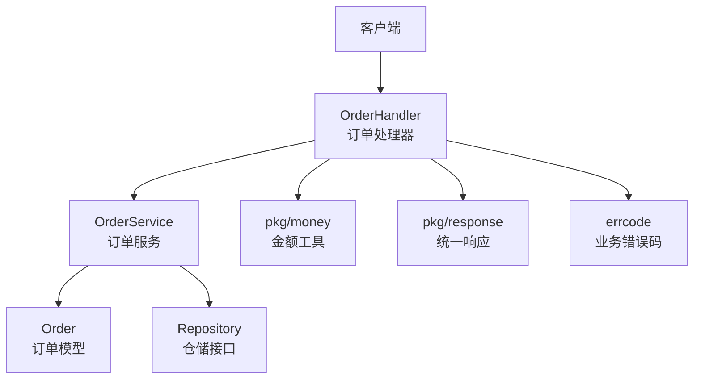
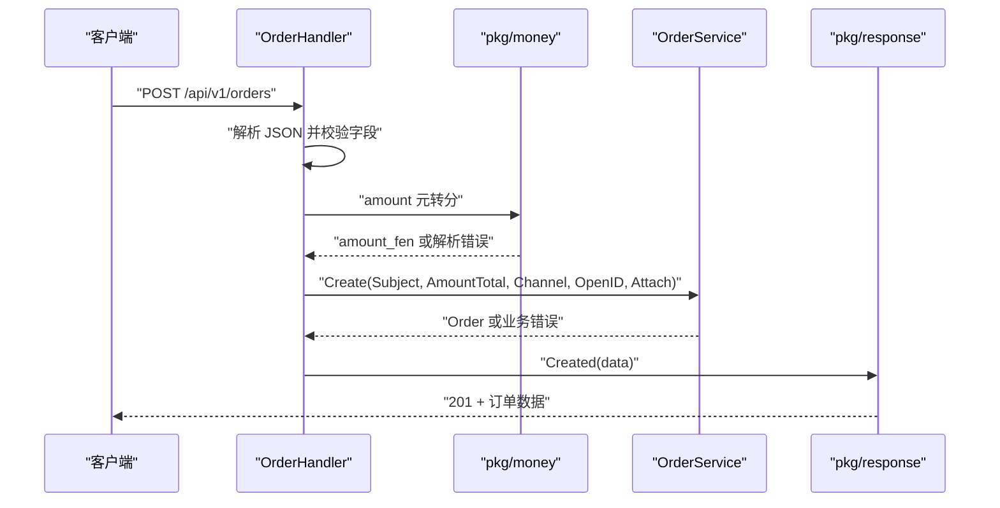
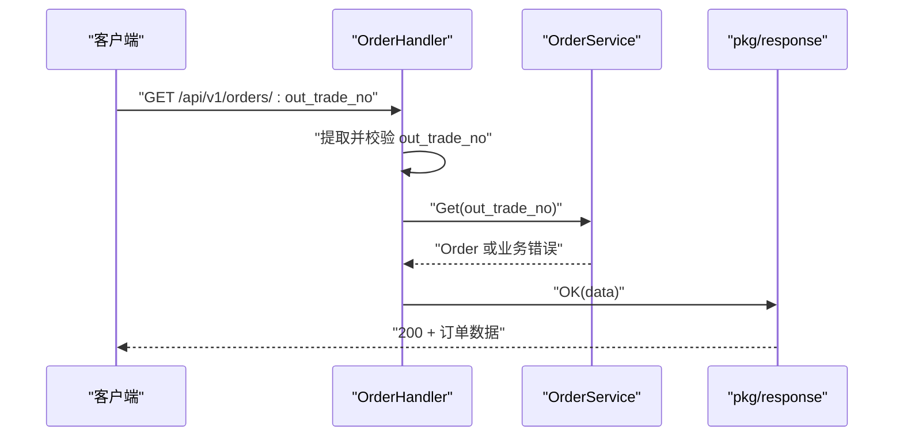
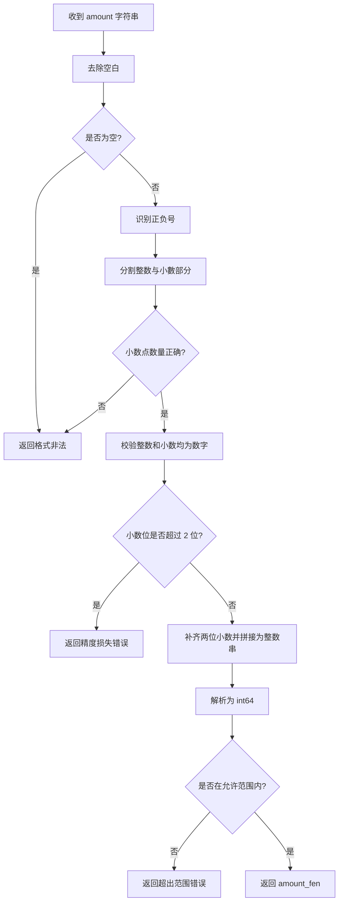
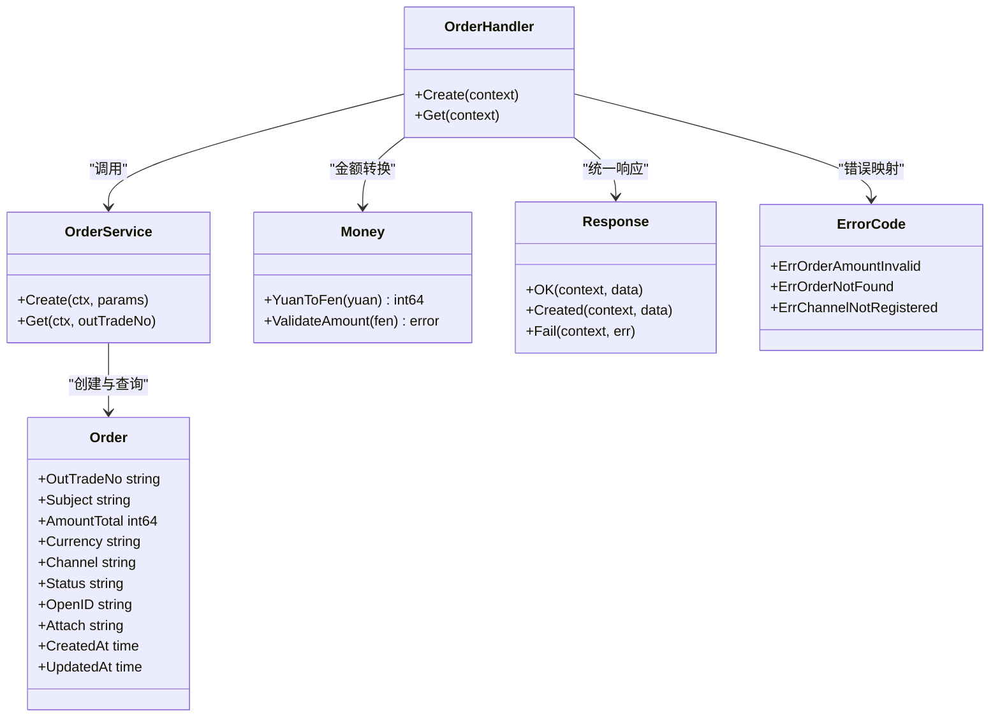

# 订单管理接口

<cite>
**本文引用的文件**   
- [order_handler.go](file://internal/handler/order_handler.go)
- [handler.go](file://internal/handler/handler.go)
- [order_service.go](file://internal/service/order_service.go)
- [order.go](file://internal/model/order.go)
- [payment.go](file://internal/dto/payment.go)
- [money.go](file://internal/pkg/money/money.go)
- [errcode.go](file://internal/errcode/errcode.go)
- [response.go](file://internal/pkg/response/response.go)
</cite>

## 目录
1. [简介](#简介)
2. [项目结构](#项目结构)
3. [核心接口总览](#核心接口总览)
4. [创建订单接口 POST /api/v1/orders](#创建订单接口-post-apiv1orders)
5. [查询订单接口 GET /api/v1/orders/:out_trade_no](#查询订单接口-get-apiv1ordersout_trade_no)
6. [金额处理机制](#金额处理机制)
7. [错误处理与状态码](#错误处理与状态码)
8. [客户端集成示例](#客户端集成示例)
9. [常见错误场景处理](#常见错误场景处理)
10. [依赖关系分析](#依赖关系分析)
11. [性能与稳定性建议](#性能与稳定性建议)
12. [结论](#结论)

## 简介
本文面向接入方，说明「订单管理」两个核心接口的契约：  
- `POST /api/v1/orders`：创建订单。  
- `GET /api/v1/orders/:out_trade_no`：按商户订单号查询订单。

文档重点包括：
- 请求参数格式、必填项、长度限制、取值范围与校验规则。
- 响应体中的订单数据结构，尤其是金额字段以「分」为单位的设计。
- 金额从「元」到「分」的转换策略与精度控制。
- 统一错误响应格式、业务错误码与 HTTP 状态码。
- 客户端调用示例与常见问题排查思路。

本项目的整体设计遵循分层架构：HTTP 接入层负责解析请求、参数校验和统一响应；服务层承载订单业务规则；模型层定义领域对象与状态机；工具包提供金额、日志、ID 生成等通用能力。

**章节来源**
- [order_handler.go:13-78](file://internal/handler/order_handler.go#L13-L78)
- [order_service.go:21-124](file://internal/service/order_service.go#L21-L124)
- [order.go:73-120](file://internal/model/order.go#L73-L120)

## 项目结构
订单相关代码主要分布在以下模块：
- `internal/handler`：HTTP 处理器，暴露 `/api/v1/orders` 路由。
- `internal/service`：订单业务逻辑，负责金额校验、渠道选择、订单持久化。
- `internal/model`：订单领域模型与状态机。
- `internal/dto`：对外 DTO 转换函数。
- `internal/pkg/money`：金额单位转换与校验。
- `internal/errcode`：业务错误码与 HTTP 状态映射。
- `internal/pkg/response`：统一响应体封装。



**图表来源**
- [order_handler.go:13-78](file://internal/handler/order_handler.go#L13-L78)
- [order_service.go:21-124](file://internal/service/order_service.go#L21-L124)
- [order.go:73-120](file://internal/model/order.go#L73-L120)
- [money.go:39-136](file://internal/pkg/money/money.go#L39-L136)
- [response.go:35-83](file://internal/pkg/response/response.go#L35-L83)
- [errcode.go:78-134](file://internal/errcode/errcode.go#L78-L134)

**章节来源**
- [order_handler.go:1-79](file://internal/handler/order_handler.go#L1-L79)
- [order_service.go:1-125](file://internal/service/order_service.go#L1-L125)
- [order.go:1-184](file://internal/model/order.go#L1-L184)

## 核心接口总览
| 接口 | 方法 | 路径 | 用途 | 成功状态码 | 典型返回数据 |
|---|---|---|---|---|---|
| 创建订单 | `POST` | `/api/v1/orders` | 创建支付订单，初始状态为已创建 | `201 Created` | 订单信息，包含商户订单号、金额（分）、渠道、状态等 |
| 查询订单 | `GET` | `/api/v1/orders/:out_trade_no` | 根据商户订单号查询订单 | `200 OK` | 订单信息，包含商户订单号、金额（分）、状态等 |

统一响应体结构如下：
- `code`：业务码，`0` 表示成功。
- `message`：人类可读消息。
- `data`：业务数据，订单接口中为订单对象。
- `request_id`：请求追踪 ID，便于排查。

**章节来源**
- [response.go:35-83](file://internal/pkg/response/response.go#L35-L83)
- [order_handler.go:23-78](file://internal/handler/order_handler.go#L23-L78)

## 创建订单接口 POST /api/v1/orders
### 功能说明
该接口用于创建支付订单。创建成功后，订单初始状态为「已创建」，尚未调起任何支付渠道。后续再调用发起支付接口完成下单与支付流程。

### 请求头
- `Content-Type: application/json`

### 请求体字段
| 字段 | 类型 | 是否必填 | 说明 | 校验规则 |
|---|---|---:|---|---|
| `subject` | 字符串 | 是 | 商品标题，会作为描述传给支付渠道 | 必填，长度由服务端校验 |
| `amount` | 字符串 | 是 | 订单金额，单位为「元」 | 必填，合法数字字符串，最多两位小数，正数且不超过单笔上限 |
| `channel` | 字符串 | 否 | 支付渠道代码 | 留空时使用默认渠道；有效值见渠道注册表 |
| `open_id` | 字符串 | 否 | 支付者标识，JSAPI 交易通常必填 | 可选，最大长度受服务端约束 |
| `attach` | 字符串 | 否 | 附加数据，回调时原样返回 | 可选，可用于携带业务上下文 |

注意：
- `amount` 必须以「元」为单位传入，例如 `19.99`。
- 服务端会在接入层将「元」转换为「分」，服务层只接受「分」。
- `client_ip` 不接受客户端传入，由服务端自动获取，用于风控。

### 请求示例
```json
{
  "subject": "会员月卡",
  "amount": "19.99",
  "channel": "mock",
  "open_id": "wx_user_123",
  "attach": "order_ref=20250101"
}
```

### 响应体
成功时返回订单对象，关键字段如下：
| 字段 | 类型 | 说明 |
|---|---|---|
| `out_trade_no` | 字符串 | 商户订单号，服务端生成 |
| `subject` | 字符串 | 商品标题 |
| `amount_total` | 整数 | 订单总金额，单位为「分」 |
| `currency` | 字符串 | 币种，默认 `CNY` |
| `channel` | 字符串 | 支付渠道代码 |
| `status` | 字符串 | 订单状态，创建后为 `CREATED` |
| `open_id` | 字符串 | 支付者标识 |
| `attach` | 字符串 | 附加数据 |
| `created_at` | 字符串 | 创建时间 |
| `updated_at` | 字符串 | 更新时间 |

### 响应示例
```json
{
  "code": 0,
  "message": "ok",
  "data": {
    "out_trade_no": "M20250101000001",
    "subject": "会员月卡",
    "amount_total": 1999,
    "currency": "CNY",
    "channel": "mock",
    "status": "CREATED",
    "open_id": "wx_user_123",
    "attach": "order_ref=20250101",
    "created_at": "2025-01-01T12:00:00Z",
    "updated_at": "2025-01-01T12:00:00Z"
  },
  "request_id": "req-abc-123"
}
```

### 处理流程


**图表来源**
- [order_handler.go:23-60](file://internal/handler/order_handler.go#L23-L60)
- [money.go:39-106](file://internal/pkg/money/money.go#L39-L106)
- [order_service.go:72-109](file://internal/service/order_service.go#L72-L109)
- [response.go:75-83](file://internal/pkg/response/response.go#L75-L83)

**章节来源**
- [order_handler.go:23-60](file://internal/handler/order_handler.go#L23-L60)
- [order_service.go:72-109](file://internal/service/order_service.go#L72-L109)
- [order.go:73-120](file://internal/model/order.go#L73-L120)

## 查询订单接口 GET /api/v1/orders/:out_trade_no
### 功能说明
根据商户订单号查询订单详情。适用于前端轮询、对账、客服查询等场景。

### 路径参数
| 参数 | 类型 | 是否必填 | 说明 |
|---|---|---:|---|
| `out_trade_no` | 字符串 | 是 | 商户订单号，服务端创建订单时生成 |

### 请求示例
```
GET /api/v1/orders/M20250101000001
```

### 响应体
成功时返回订单对象，结构与创建订单响应一致。

### 响应示例
```json
{
  "code": 0,
  "message": "ok",
  "data": {
    "out_trade_no": "M20250101000001",
    "subject": "会员月卡",
    "amount_total": 1999,
    "currency": "CNY",
    "channel": "mock",
    "status": "CREATED",
    "open_id": "wx_user_123",
    "attach": "order_ref=20250101",
    "created_at": "2025-01-01T12:00:00Z",
    "updated_at": "2025-01-01T12:00:00Z"
  },
  "request_id": "req-def-456"
}
```

### 处理流程


**图表来源**
- [order_handler.go:62-78](file://internal/handler/order_handler.go#L62-L78)
- [order_service.go:112-124](file://internal/service/order_service.go#L112-L124)
- [response.go:65-73](file://internal/pkg/response/response.go#L65-L73)

**章节来源**
- [order_handler.go:62-78](file://internal/handler/order_handler.go#L62-L78)
- [order_service.go:112-124](file://internal/service/order_service.go#L112-L124)

## 金额处理机制
### 设计原则
- 系统内部所有金额一律使用 `int64` 表示「分」。
- 严禁让 `float64` 参与金额运算，避免二进制浮点精度丢失。
- 元分转换全程基于字符串与整数运算，不经过任何浮点类型。

### 输入输出约定
- 客户端传入 `amount` 为「元」字符串，例如 `19.99`。
- 服务端在接入层调用金额工具进行转换，得到 `amount_fen`。
- 服务层与模型层只处理「分」，对外响应也同时提供 `amount_total`（分）与格式化后的元字符串（部分 DTO）。

### 转换与校验规则
- 支持正负号前缀。
- 小数位最多两位，超过两位直接拒绝，不做四舍五入。
- 不允许千分位分隔符、货币符号等非数字字符。
- 有单笔金额上限，防止溢出与异常负数金额。
- 零金额不允许支付。



**图表来源**
- [money.go:39-106](file://internal/pkg/money/money.go#L39-L106)
- [money.go:124-136](file://internal/pkg/money/money.go#L124-L136)

**章节来源**
- [money.go:1-152](file://internal/pkg/money/money.go#L1-L152)
- [order_handler.go:33-42](file://internal/handler/order_handler.go#L33-L42)
- [order_service.go:72-75](file://internal/service/order_service.go#L72-L75)

## 错误处理与状态码
### 统一响应格式
失败时返回：
```json
{
  "code": 非零业务码,
  "message": "面向用户的错误消息",
  "request_id": "请求追踪ID"
}
```

### 常见业务错误码
| 错误码 | HTTP 状态码 | 含义 | 触发场景 |
|---|---:|---|---|
| `10001` | `400` | 请求参数不合法 | 字段缺失、类型错误、校验失败 |
| `10002` | `400` | 请求无法解析 | JSON 语法错误、请求体为空 |
| `10003` | `404` | 资源不存在 | 订单号不存在 |
| `10004` | `500` | 服务内部错误 | 数据库异常、未预期异常 |
| `20001` | `404` | 订单不存在 | 查询订单时找不到 |
| `20003` | `400` | 订单金额不合法 | 金额为负、为零、超上限、精度超限 |
| `40001` | `500` | 支付渠道未注册 | 渠道代码未启用或未实现 |

### 金额解析错误分类
- 金额格式非法：例如包含字母、多个小数点。
- 小数位超过两位：拒绝静默截断。
- 金额超出允许范围：超过单笔上限或溢出。
- 金额为负或为零：不允许支付。

**章节来源**
- [errcode.go:78-134](file://internal/errcode/errcode.go#L78-L134)
- [handler.go:29-55](file://internal/handler/handler.go#L29-L55)
- [handler.go:140-155](file://internal/handler/handler.go#L140-L155)
- [response.go:85-106](file://internal/pkg/response/response.go#L85-L106)

## 客户端集成示例
### 创建订单
```json
POST /api/v1/orders
Content-Type: application/json

{
  "subject": "课程订阅",
  "amount": "99.00",
  "channel": "mock",
  "open_id": "wx_openid_example",
  "attach": "business_key=course_123"
}
```

成功响应：
```json
{
  "code": 0,
  "message": "ok",
  "data": {
    "out_trade_no": "M20250101000002",
    "subject": "课程订阅",
    "amount_total": 9900,
    "currency": "CNY",
    "channel": "mock",
    "status": "CREATED",
    "open_id": "wx_openid_example",
    "attach": "business_key=course_123",
    "created_at": "2025-01-01T12:05:00Z",
    "updated_at": "2025-01-01T12:05:00Z"
  },
  "request_id": "req-course-001"
}
```

### 查询订单
```
GET /api/v1/orders/M20250101000002
```

成功响应：
```json
{
  "code": 0,
  "message": "ok",
  "data": {
    "out_trade_no": "M20250101000002",
    "subject": "课程订阅",
    "amount_total": 9900,
    "currency": "CNY",
    "channel": "mock",
    "status": "CREATED",
    "open_id": "wx_openid_example",
    "attach": "business_key=course_123",
    "created_at": "2025-01-01T12:05:00Z",
    "updated_at": "2025-01-01T12:05:00Z"
  },
  "request_id": "req-course-002"
}
```

### 客户端注意事项
- 始终使用 `amount_total`（分）做金额展示与对账。
- 如果前端需要显示「元」，可参考服务端提供的元字符串字段（在部分 DTO 中存在），但建议客户端自行格式化以避免二次误差。
- 遇到 `code` 非零时，优先根据 `code` 做分支处理，而不是仅依赖 HTTP 状态码。
- 记录 `request_id`，便于与服务端日志联动排查。

**章节来源**
- [order_handler.go:23-78](file://internal/handler/order_handler.go#L23-L78)
- [payment.go:60-98](file://internal/dto/payment.go#L60-L98)
- [response.go:35-83](file://internal/pkg/response/response.go#L35-L83)

## 常见错误场景处理
### 1. 金额格式错误
- 现象：`amount` 包含字母、千分位逗号、货币符号，或多个小数点。
- 原因：金额字符串不符合「纯数字 + 最多两位小数」规则。
- 处理：返回 `20003` 或 `10001`，提示金额格式非法。
- 建议：客户端在发送前做基础校验，确保只传数字与一个小数点。

### 2. 金额小数位过多
- 现象：`amount` 为 `19.999`。
- 原因：小数位超过两位，系统拒绝静默截断。
- 处理：返回 `20003`，提示最多保留两位小数。
- 建议：客户端先四舍五入或向上取整，再传入。

### 3. 金额为零或负数
- 现象：`amount` 为 `0` 或 `-10.00`。
- 原因：支付金额必须为正数。
- 处理：返回 `20003`，提示金额不合法。
- 建议：客户端禁止用户输入零或负数。

### 4. 金额超出单笔上限
- 现象：`amount` 过大，换算成分后超过系统上限。
- 原因：防止 `int64` 溢出与异常大额支付。
- 处理：返回 `20003`，提示超出允许范围。
- 建议：客户端设置合理金额上限，并与运营配置保持一致。

### 5. 订单不存在
- 现象：查询订单返回 `20001`。
- 原因：`out_trade_no` 不存在或已被删除。
- 处理：返回 `404`，提示订单不存在。
- 建议：客户端检查订单号是否正确，必要时引导用户重新下单。

### 6. 渠道未启用
- 现象：创建订单时报渠道未注册。
- 原因：`channel` 未在渠道注册表中启用。
- 处理：返回 `40001`，提示渠道未启用。
- 建议：客户端使用服务端允许的渠道代码，或留空使用默认渠道。

**章节来源**
- [handler.go:140-155](file://internal/handler/handler.go#L140-L155)
- [errcode.go:98-134](file://internal/errcode/errcode.go#L98-L134)
- [order_service.go:72-85](file://internal/service/order_service.go#L72-L85)

## 依赖关系分析
订单接口的关键依赖如下：
- `OrderHandler` 依赖 `OrderService` 完成业务逻辑。
- `OrderService` 依赖 `model.Order` 与 `repository` 接口，以及 `channel.Registry`。
- `OrderHandler` 依赖 `pkg/money` 完成元分转换。
- 所有错误通过 `errcode` 归一化，并由 `pkg/response` 统一输出。



**图表来源**
- [order_handler.go:13-78](file://internal/handler/order_handler.go#L13-L78)
- [order_service.go:21-124](file://internal/service/order_service.go#L21-L124)
- [order.go:73-120](file://internal/model/order.go#L73-L120)
- [money.go:39-136](file://internal/pkg/money/money.go#L39-L136)
- [response.go:65-106](file://internal/pkg/response/response.go#L65-L106)
- [errcode.go:98-134](file://internal/errcode/errcode.go#L98-L134)

**章节来源**
- [order_handler.go:1-79](file://internal/handler/order_handler.go#L1-L79)
- [order_service.go:1-125](file://internal/service/order_service.go#L1-L125)
- [order.go:1-184](file://internal/model/order.go#L1-L184)

## 性能与稳定性建议
- 金额计算全部使用整数与字符串，避免浮点误差，提升准确性与可测试性。
- 订单状态变更通过状态机约束，防止非法流转导致对账事故。
- 错误分类清晰：参数错误、业务错误、内部错误分别对应不同 HTTP 状态码，便于网关重试与监控告警。
- 建议在客户端侧增加幂等键与重试退避，避免因网络抖动重复创建订单。
- 对于高频查询订单的场景，可在客户端缓存短期结果，减少重复请求。

[本节为通用建议，不直接分析具体文件]

## 结论
订单管理接口通过清晰的请求/响应契约、严格的金额处理机制与统一的错误体系，为接入方提供了稳定、可观测、易集成的支付下单能力。接入方应重点关注：
- 金额字段始终以「元」传入，以「分」接收。
- 使用 `out_trade_no` 作为业务主键进行查询与对账。
- 根据 `code` 与 `message` 做精细化错误处理。
- 结合 `request_id` 与服务端日志定位问题。

[本节为总结性内容，不直接分析具体文件]