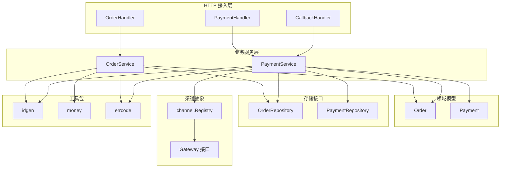
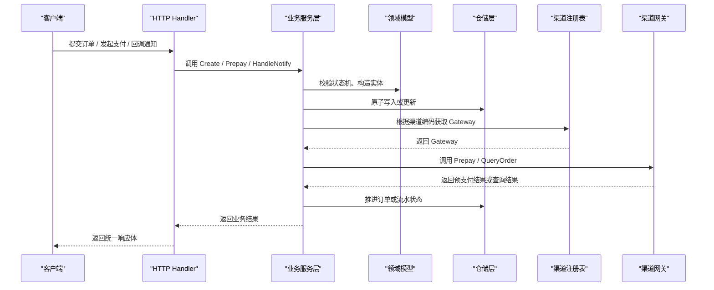
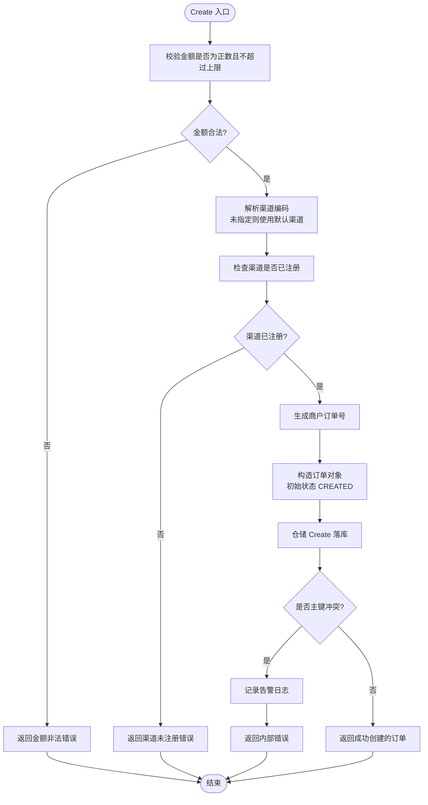
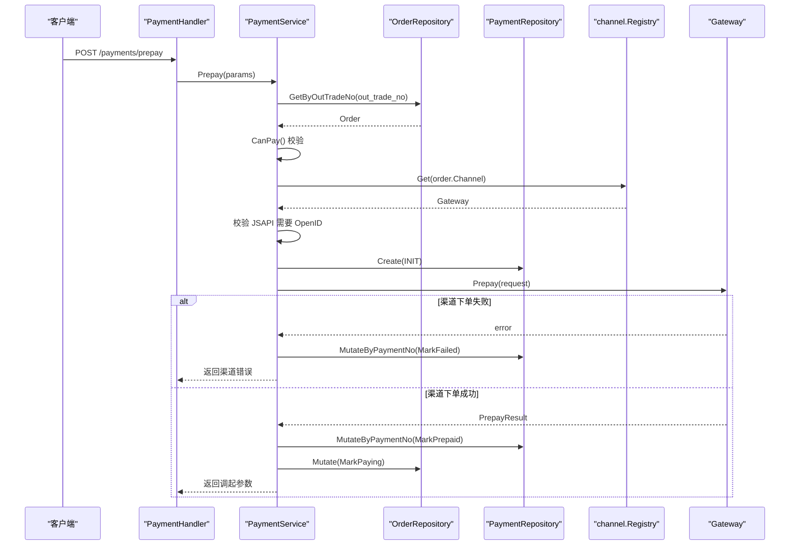
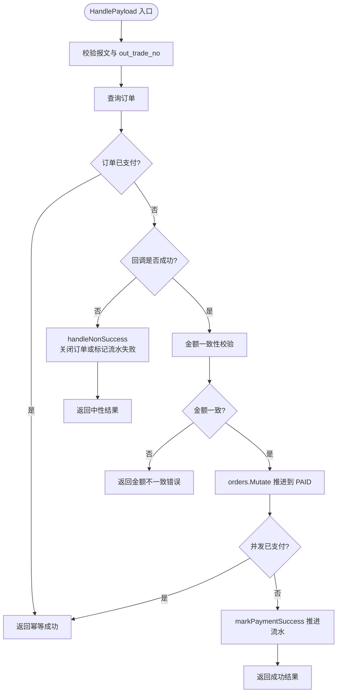
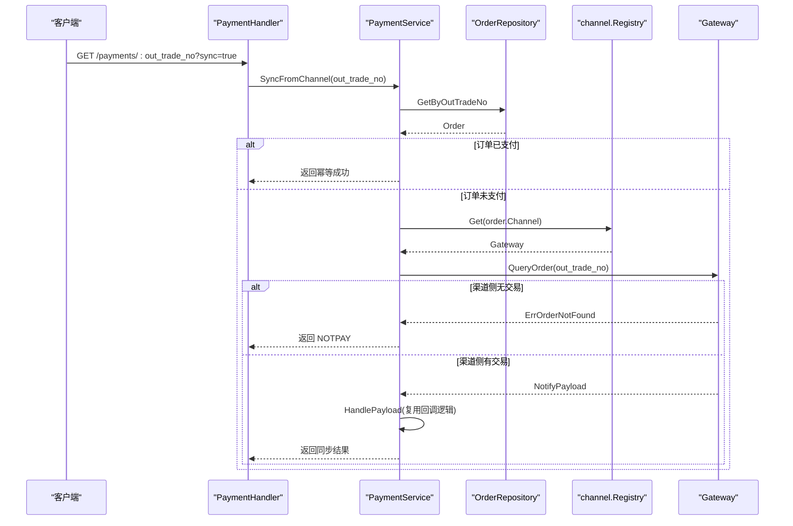
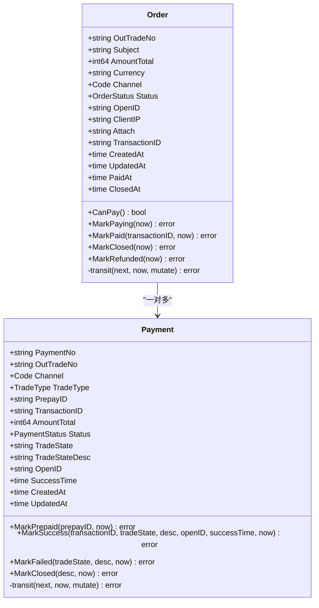
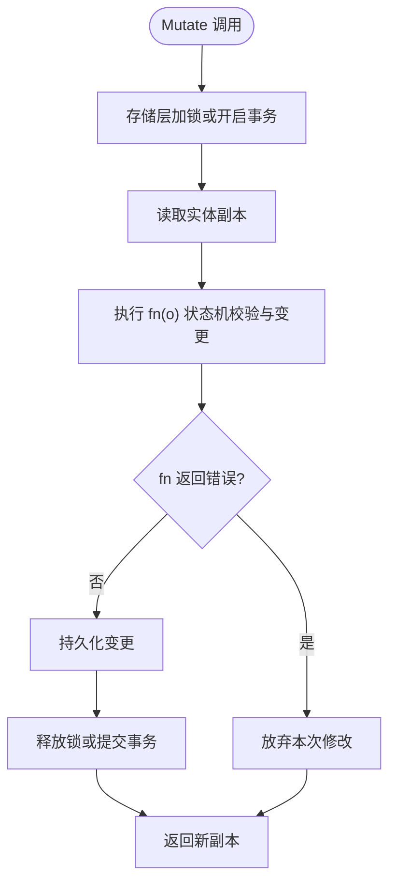
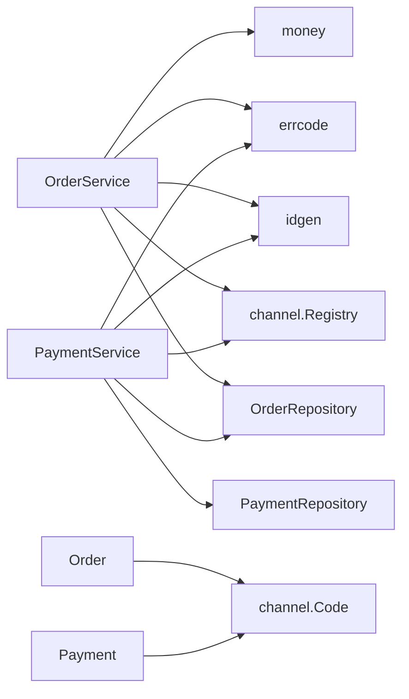

# 业务服务层

<cite>
**本文引用的文件**   
- [order_service.go](file://internal/service/order_service.go)
- [payment_service.go](file://internal/service/payment_service.go)
- [order.go](file://internal/model/order.go)
- [payment.go](file://internal/model/payment.go)
- [errcode.go](file://internal/errcode/errcode.go)
- [callback_handler.go](file://internal/handler/callback_handler.go)
- [order_handler.go](file://internal/handler/order_handler.go)
- [payment_handler.go](file://internal/handler/payment_handler.go)
- [repository.go](file://internal/repository/repository.go)
- [idgen.go](file://internal/pkg/idgen/idgen.go)
- [money.go](file://internal/pkg/money/money.go)
- [registry.go](file://internal/channel/registry.go)
</cite>

## 目录
1. [引言](#引言)
2. [项目结构](#项目结构)
3. [核心组件](#核心组件)
4. [架构总览](#架构总览)
5. [详细组件分析](#详细组件分析)
6. [依赖关系分析](#依赖关系分析)
7. [性能与并发特性](#性能与并发特性)
8. [故障排查指南](#故障排查指南)
9. [结论](#结论)

## 引言
本文聚焦业务服务层的两个核心类：订单服务 OrderService 与支付服务 PaymentService。文档围绕以下目标展开：
- 订单创建流程的参数校验、金额校验、订单号生成与状态初始化。
- 支付发起流程如何调用渠道 Gateway 完成预支付，以及预支付结果与状态更新策略。
- 回调处理逻辑的幂等性保证、金额一致性校验、状态同步与并发安全。
- 主动查单机制 SyncFromChannel 如何与渠道对齐状态。
- 统一错误码体系 errcode 的使用方式。
- 服务层与领域模型、仓储层的交互契约。
- 关键业务流程时序图与异常处理流程图。

## 项目结构
服务层位于 internal/service，向上对接 HTTP handler，向下依赖 model、repository 与 channel 抽象；不直接感知 HTTP 框架或具体渠道 SDK。

**图表来源**
- [order_service.go:21-50](file://internal/service/order_service.go#L21-L50)
- [payment_service.go:34-73](file://internal/service/payment_service.go#L34-L73)
- [order.go:73-120](file://internal/model/order.go#L73-L120)
- [payment.go:54-104](file://internal/model/payment.go#L54-L104)
- [repository.go:27-64](file://internal/repository/repository.go#L27-L64)
- [registry.go:11-29](file://internal/channel/registry.go#L11-L29)
- [idgen.go:29-46](file://internal/pkg/idgen/idgen.go#L29-L46)
- [money.go:39-106](file://internal/pkg/money/money.go#L39-L106)
- [errcode.go:20-76](file://internal/errcode/errcode.go#L20-L76)

**章节来源**
- [order_service.go:1-125](file://internal/service/order_service.go#L1-L125)
- [payment_service.go:1-583](file://internal/service/payment_service.go#L1-L583)
- [repository.go:1-90](file://internal/repository/repository.go#L1-L90)

## 核心组件
- OrderService：负责订单创建、查询，包含参数校验、金额校验、渠道注册检查、商户订单号生成与持久化。
- PaymentService：负责发起支付、处理渠道回调、查询支付状态、主动查单兜底，并维护订单与流水的状态机。
- 领域模型 Order 与 Payment：封装状态机、合法流转规则与时间戳字段，禁止外部直接赋值状态。
- 仓储接口 OrderRepository 与 PaymentRepository：提供原子 Mutate 能力，保证并发下的幂等与一致性。
- 渠道 Registry：运行时渠道注册表，按编码获取 Gateway，并发安全。
- 工具包 idgen、money、errcode：分别负责唯一标识生成、金额元分转换与校验、统一错误码。

**章节来源**
- [order_service.go:21-65](file://internal/service/order_service.go#L21-L65)
- [payment_service.go:34-97](file://internal/service/payment_service.go#L34-L97)
- [order.go:20-120](file://internal/model/order.go#L20-L120)
- [payment.go:10-104](file://internal/model/payment.go#L10-L104)
- [repository.go:27-64](file://internal/repository/repository.go#L27-L64)
- [registry.go:11-83](file://internal/channel/registry.go#L11-L83)
- [idgen.go:29-46](file://internal/pkg/idgen/idgen.go#L29-L46)
- [money.go:39-106](file://internal/pkg/money/money.go#L39-L106)
- [errcode.go:78-134](file://internal/errcode/errcode.go#L78-L134)

## 架构总览
服务层采用分层设计：
- HTTP 层只负责请求绑定、参数解析与响应格式化。
- Service 层承载业务规则，调用领域模型与仓储接口，并通过 channel.Registry 访问渠道网关。
- Model 层定义领域实体与状态机，所有状态变更必须通过 Mark* 方法。
- Repository 层对外暴露原子 Mutate 接口，由实现层保证锁或事务语义。
- Channel 层抽象渠道差异，Registry 管理可用渠道。

**图表来源**
- [order_handler.go:23-60](file://internal/handler/order_handler.go#L23-L60)
- [payment_handler.go:26-51](file://internal/handler/payment_handler.go#L26-L51)
- [callback_handler.go:44-86](file://internal/handler/callback_handler.go#L44-L86)
- [order_service.go:72-110](file://internal/service/order_service.go#L72-L110)
- [payment_service.go:108-226](file://internal/service/payment_service.go#L108-L226)
- [payment_service.go:258-379](file://internal/service/payment_service.go#L258-L379)
- [payment_service.go:548-582](file://internal/service/payment_service.go#L548-L582)

## 详细组件分析

### 订单服务 OrderService
职责边界：
- 创建订单时进行金额合法性校验、渠道有效性校验、商户订单号生成与落库。
- 按商户订单号查询订单，透传仓储层错误码，避免被包装为内部错误。

关键流程要点：
- 金额校验使用 money.ValidateAmount，确保为正数且不超过单笔上限。
- 未指定渠道时使用默认渠道，但必须在创建时确定并落库，避免后续对账歧义。
- 渠道通过 registry.Has 校验是否启用，未启用则返回渠道未注册错误。
- 订单号通过 idgen.OutTradeNo 生成，格式受渠道约束，长度不超过 32。
- 订单初始状态为 CREATED，OpenID、Attach、ClientIP 在创建时回填。
- 仓储 Create 若返回重复键错误，记录告警日志并返回内部错误，因为重复订单号属于随机源或时钟异常。

**图表来源**
- [order_service.go:72-110](file://internal/service/order_service.go#L72-L110)
- [money.go:124-136](file://internal/pkg/money/money.go#L124-L136)
- [idgen.go:29-46](file://internal/pkg/idgen/idgen.go#L29-L46)
- [registry.go:76-83](file://internal/channel/registry.go#L76-L83)

**章节来源**
- [order_service.go:21-125](file://internal/service/order_service.go#L21-L125)
- [money.go:124-136](file://internal/pkg/money/money.go#L124-L136)
- [idgen.go:29-46](file://internal/pkg/idgen/idgen.go#L29-L46)
- [registry.go:76-83](file://internal/channel/registry.go#L76-L83)

### 支付服务 PaymentService
职责边界：
- 发起支付：校验订单可支付、创建支付流水、调用渠道预支付、更新流水与订单状态。
- 处理回调：验签解密、幂等快速返回、金额一致性校验、订单与流水状态推进。
- 查询状态：本地读取订单与流水，供前端轮询。
- 主动查单：从渠道拉取交易状态，复用回调处理路径保证一致性。

#### 发起支付 Prepay
核心步骤：
- 校验 out_trade_no 非空。
- 查询订单，判断 CanPay，不可支付时返回对应业务错误。
- 以订单上记录的渠道为准，不接受发起支付时临时改渠道。
- JSAPI 交易必须提供 OpenID，否则提前拦截。
- 生成 payment_no，创建支付流水 INIT。
- 调用 gateway.Prepay，失败时将流水标记 FAILED 并记录日志。
- 成功后将流水置 PREPAID，订单置 PAYING；若并发导致订单已支付，返回“订单已支付”错误。
- 即使订单状态推进失败，仍返回调起参数，让回调与查单兜底。

**图表来源**
- [payment_service.go:108-226](file://internal/service/payment_service.go#L108-L226)
- [payment_handler.go:26-51](file://internal/handler/payment_handler.go#L26-L51)
- [repository.go:27-64](file://internal/repository/repository.go#L27-L64)
- [registry.go:63-73](file://internal/channel/registry.go#L63-L73)

**章节来源**
- [payment_service.go:75-226](file://internal/service/payment_service.go#L75-L226)
- [payment_handler.go:26-51](file://internal/handler/payment_handler.go#L26-L51)

#### 回调处理 HandleNotify 与 HandlePayload
核心策略：
- HandleNotify 接收原始 http.Request，交由 Gateway.ParseNotify 完成验签与解密，再进入 HandlePayload。
- HandlePayload 先做参数校验，再查询订单。
- 幂等快速返回：若订单已是 PAID，原样返回成功，避免渠道无限重试。
- 非成功状态走 handleNonSuccess：关闭订单或标记流水失败，NOTPAY/USERPAYING/REFUND 等不做变更。
- 成功回调必须先校验金额一致性，不一致则拒绝并返回金额不一致错误。
- 使用 orders.Mutate 原子推进订单状态，并发重复回调通过哨兵错误识别并按幂等返回。
- 成功后调用 markPaymentSuccess 推进流水到 SUCCESS，找不到流水只记警告，不阻断回调应答。

**图表来源**
- [payment_service.go:258-379](file://internal/service/payment_service.go#L258-L379)
- [payment_service.go:381-415](file://internal/service/payment_service.go#L381-L415)
- [payment_service.go:417-453](file://internal/service/payment_service.go#L417-L453)
- [callback_handler.go:55-86](file://internal/handler/callback_handler.go#L55-L86)

**章节来源**
- [payment_service.go:246-453](file://internal/service/payment_service.go#L246-L453)
- [callback_handler.go:44-86](file://internal/handler/callback_handler.go#L44-L86)

#### 主动查单 SyncFromChannel
核心机制：
- 查询订单，若已支付直接返回幂等结果。
- 通过 registry.Get 获取渠道 Gateway，调用 QueryOrder。
- 若渠道侧不存在该交易，视为正常情况，返回 NOTPAY。
- 其他错误透传给上层。
- 最终复用 HandlePayload，保证查单与回调对同一笔交易的结论完全一致。

**图表来源**
- [payment_service.go:548-582](file://internal/service/payment_service.go#L548-L582)
- [payment_handler.go:53-85](file://internal/handler/payment_handler.go#L53-L85)
- [registry.go:63-73](file://internal/channel/registry.go#L63-L73)

**章节来源**
- [payment_service.go:522-582](file://internal/service/payment_service.go#L522-L582)
- [payment_handler.go:53-85](file://internal/handler/payment_handler.go#L53-L85)

### 领域模型与状态机
Order 与 Payment 均通过显式状态转移表定义合法后继，并提供 transit 作为唯一变更入口，防止非法流转。

**图表来源**
- [order.go:20-120](file://internal/model/order.go#L20-L120)
- [payment.go:10-104](file://internal/model/payment.go#L10-L104)
- [order.go:122-170](file://internal/model/order.go#L122-L170)
- [payment.go:106-150](file://internal/model/payment.go#L106-L150)

**章节来源**
- [order.go:20-184](file://internal/model/order.go#L20-L184)
- [payment.go:10-160](file://internal/model/payment.go#L10-L160)

### 统一错误码体系 errcode
设计要点：
- 分段规则：通用错误 10xxx、订单相关 20xxx、支付相关 30xxx、渠道相关 40xxx。
- Error 类型包含 Code、Msg、HTTPStatus 与私有 cause，支持 WithCause 与 WithMsg 复制实例，避免共享变量并发污染。
- From 把任意 error 归一为 *Error，非业务错误映射为内部错误并挂 cause。
- Code 提取错误码，nil 错误返回 0。

常见错误码：
- 10001 请求参数不合法
- 10004 服务内部错误
- 20001 订单不存在
- 20002 订单状态不允许该操作
- 20003 订单金额不合法
- 20004 订单已关闭
- 20005 订单已支付
- 30001 支付记录不存在
- 30002 支付金额与订单金额不一致
- 30003 缺少支付者 openid
- 40001 支付渠道未注册
- 40002 支付渠道调用失败
- 40003 支付回调校验失败

**章节来源**
- [errcode.go:1-158](file://internal/errcode/errcode.go#L1-L158)

### 仓储层与并发安全
仓储接口设计强调两点：
- 提供 Mutate 而非裸 Update，把「读取-判断-写回」临界区交给存储层保证，内存实现用互斥锁，数据库实现对应 SELECT ... FOR UPDATE 事务。
- 对外一律返回副本，防止调用方绕过领域模型状态机直接修改字段。

**图表来源**
- [repository.go:27-44](file://internal/repository/repository.go#L27-L44)

**章节来源**
- [repository.go:1-90](file://internal/repository/repository.go#L1-L90)

## 依赖关系分析
服务层依赖关系清晰：
- OrderService 依赖 OrderRepository、channel.Registry、idgen、money、errcode。
- PaymentService 依赖 OrderRepository、PaymentRepository、channel.Registry、idgen、errcode。
- 领域模型独立于 HTTP 与存储实现，仅依赖 channel.Code 与 channel.TradeType。
- 渠道 Registry 并发安全，读多写少场景下 RWMutex 开销低。

**图表来源**
- [order_service.go:21-50](file://internal/service/order_service.go#L21-L50)
- [payment_service.go:34-73](file://internal/service/payment_service.go#L34-L73)
- [order.go:73-120](file://internal/model/order.go#L73-L120)
- [payment.go:54-104](file://internal/model/payment.go#L54-L104)
- [registry.go:11-29](file://internal/channel/registry.go#L11-L29)

**章节来源**
- [order_service.go:21-125](file://internal/service/order_service.go#L21-L125)
- [payment_service.go:34-583](file://internal/service/payment_service.go#L34-L583)
- [order.go:20-184](file://internal/model/order.go#L20-L184)
- [payment.go:10-160](file://internal/model/payment.go#L10-L160)
- [registry.go:11-107](file://internal/channel/registry.go#L11-L107)

## 性能与并发特性
- 金额计算全程使用 int64 与字符串运算，避免浮点精度问题；ValidateAmount 限制单笔上限，防止溢出与负数。
- 订单号与流水号使用 crypto/rand 生成，具备高熵与抗预测性；长度受渠道约束，必要时存储层加唯一索引兜底。
- 回调与查单共用 HandlePayload，避免两套逻辑差异导致的掉单。
- 仓储 Mutate 在锁或事务中执行，避免并发重复回调导致状态错乱。
- 主动查单仅在 sync=true 或定时任务触发，避免高频轮询触发渠道限流。

[本节为通用指导，不直接分析具体文件]

## 故障排查指南
常见问题与定位建议：
- 金额不一致：回调金额与订单金额不一致会返回 30002，需人工介入核对串单或篡改风险。
- 验签失败：回调验签失败返回 40003，需检查签名头与密钥配置。
- 渠道未注册：创建订单或发起支付时渠道未启用，返回 40001，需检查装配与配置。
- 订单已支付：重复支付或重复回调命中幂等分支，应返回 20005，避免用户重复扣款。
- 订单不存在：仓储层返回 20001，handler 层透传，避免被包装为内部错误。
- 渠道调用失败：网络超时或渠道返回错误，返回 40002，需结合日志与渠道侧对账单排查。

**章节来源**
- [payment_service.go:320-333](file://internal/service/payment_service.go#L320-L333)
- [callback_handler.go:55-86](file://internal/handler/callback_handler.go#L55-L86)
- [errcode.go:78-134](file://internal/errcode/errcode.go#L78-L134)

## 结论
业务服务层通过清晰的职责划分与严格的领域模型状态机，保证了订单与支付流程的正确性与可追溯性。OrderService 与 PaymentService 分别承担订单创建与支付生命周期管理，借助仓储层的原子 Mutate 与渠道抽象的 Registry，实现了高内聚、低耦合与良好的并发安全性。统一错误码体系使错误分类明确、对外文案可控，便于运维监控与客户端处理。回调与查单共用处理路径，有效降低掉单风险；金额校验与幂等控制保障资金安全。整体架构适合扩展更多渠道与支付方式，同时保持业务规则的稳定性与可测试性。