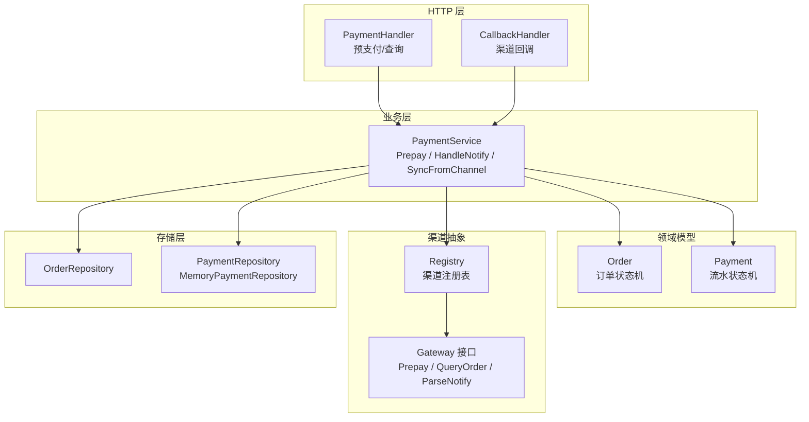
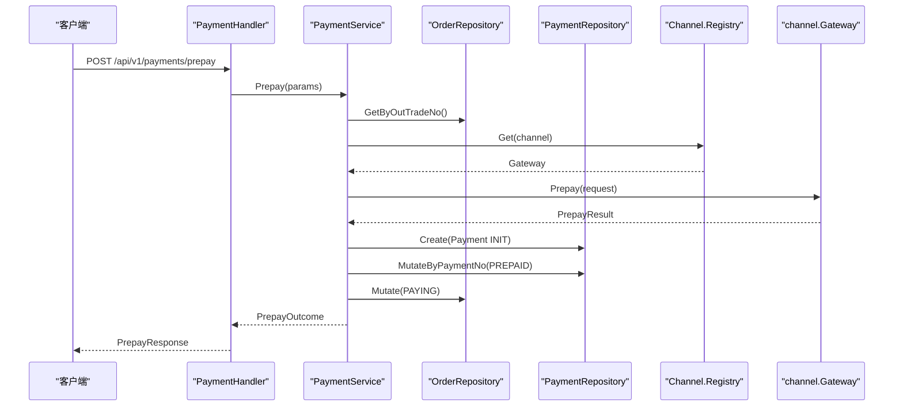
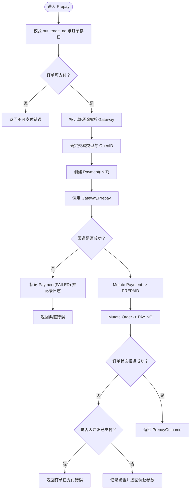
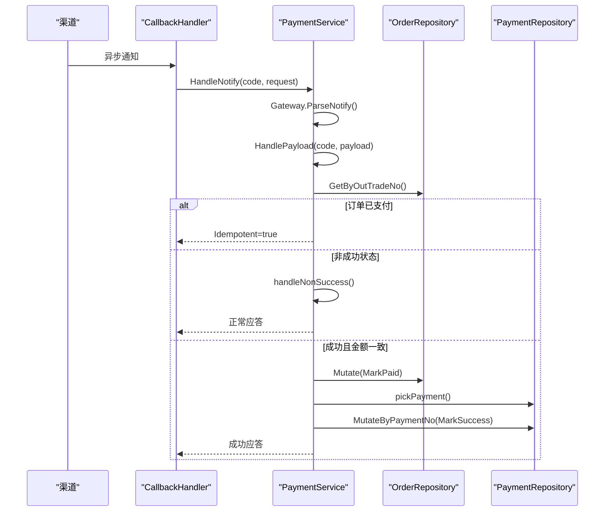
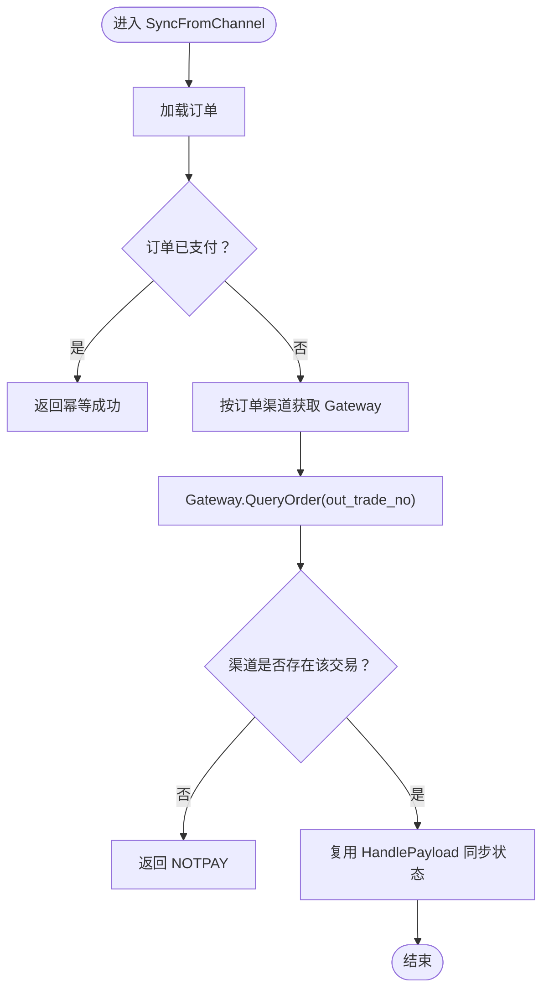
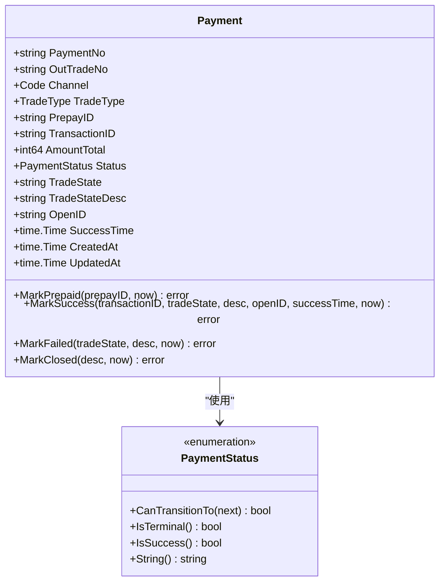
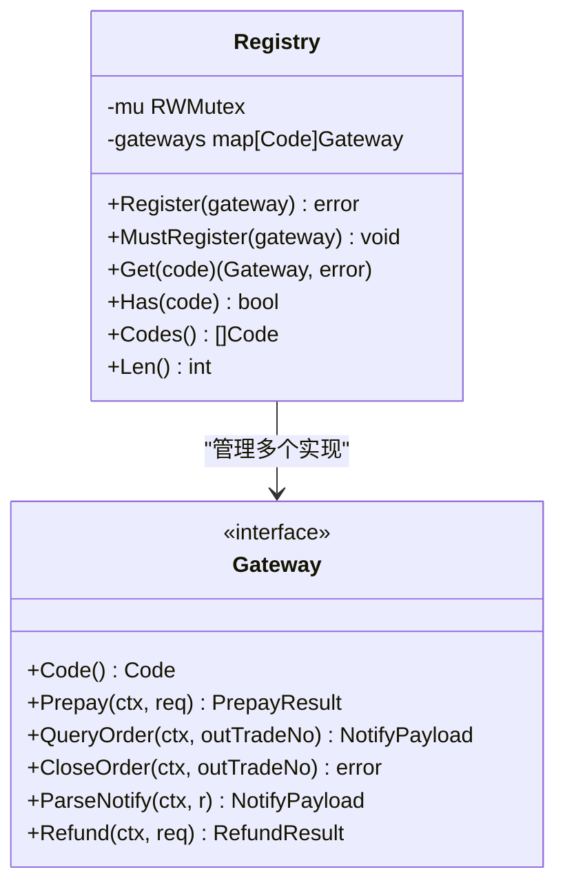
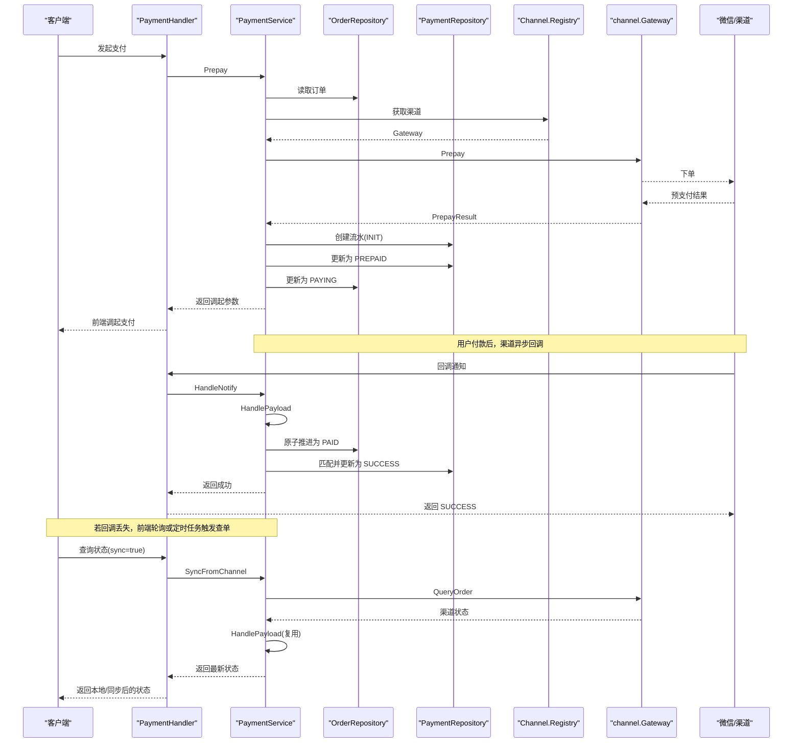
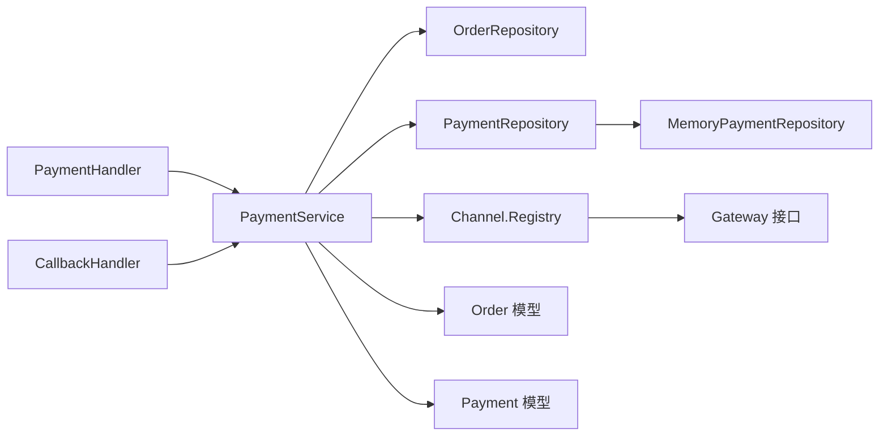

# 支付服务

<cite>
**本文引用的文件**   
- [internal/service/payment_service.go](file://internal/service/payment_service.go)
- [internal/handler/callback_handler.go](file://internal/handler/callback_handler.go)
- [internal/handler/payment_handler.go](file://internal/handler/payment_handler.go)
- [internal/model/order.go](file://internal/model/order.go)
- [internal/model/payment.go](file://internal/model/payment.go)
- [internal/channel/registry.go](file://internal/channel/registry.go)
- [internal/channel/wechatpay/doc.go](file://internal/channel/wechatpay/doc.go)
- [internal/repository/memory_payment.go](file://internal/repository/memory_payment.go)
- [internal/repository/repository.go](file://internal/repository/repository.go)
- [internal/dto/payment.go](file://internal/dto/payment.go)
</cite>

## 目录
1. [引言](#引言)
2. [项目结构](#项目结构)
3. [核心组件](#核心组件)
4. [架构总览](#架构总览)
5. [详细组件分析](#详细组件分析)
6. [依赖关系分析](#依赖关系分析)
7. [性能与可靠性考虑](#性能与可靠性考虑)
8. [故障排查指南](#故障排查指南)
9. [结论](#结论)

## 引言
本文面向支付服务的业务与实现，重点围绕 PaymentService 的核心流程展开：发起预支付、处理渠道回调、主动查单同步、支付流水建模与状态机、与渠道抽象层的交互方式，以及异常与并发安全策略。文档同时给出关键流程图和类图，帮助读者从“业务语义”到“代码实现”建立完整认知。

## 项目结构
本项目采用分层与领域驱动相结合的组织方式：
- handler 层负责 HTTP 请求解析、参数校验与响应封装；
- service 层承载支付核心业务逻辑（预支付、回调、查单）；
- model 层定义订单与支付流水的领域模型及状态机；
- channel 层通过 Gateway 接口统一对接不同支付服务商；
- repository 层抽象存储访问，当前提供内存实现；
- dto 层负责对外数据结构转换。

**图示来源**
- [internal/handler/payment_handler.go:26-50](file://internal/handler/payment_handler.go#L26-L50)
- [internal/handler/callback_handler.go:44-86](file://internal/handler/callback_handler.go#L44-L86)
- [internal/service/payment_service.go:34-73](file://internal/service/payment_service.go#L34-L73)
- [internal/channel/registry.go:11-24](file://internal/channel/registry.go#L11-L24)
- [internal/repository/repository.go:27-64](file://internal/repository/repository.go#L27-L64)

**章节来源**
- [internal/handler/payment_handler.go:26-85](file://internal/handler/payment_handler.go#L26-L85)
- [internal/handler/callback_handler.go:44-86](file://internal/handler/callback_handler.go#L44-L86)
- [internal/service/payment_service.go:34-73](file://internal/service/payment_service.go#L34-L73)
- [internal/repository/repository.go:1-19](file://internal/repository/repository.go#L1-L19)

## 核心组件
- PaymentService：支付业务编排中心，负责 Prepay、HandleNotify、HandlePayload、SyncFromChannel、QueryStatus 等能力。
- Order/Payment 领域模型：分别维护订单与支付流水的状态机，所有状态变更必须通过 Mark* 方法。
- Channel Registry/Gateway：以统一接口屏蔽不同支付服务商差异，支持运行时注册与并发安全访问。
- Repository 接口与内存实现：提供原子 Mutate/MutateByPaymentNo 能力，保证并发幂等。
- Handler 层：将 HTTP 请求映射到 Service 调用，并遵循渠道约定的回调应答格式。

**章节来源**
- [internal/service/payment_service.go:34-73](file://internal/service/payment_service.go#L34-L73)
- [internal/model/order.go:20-50](file://internal/model/order.go#L20-L50)
- [internal/model/payment.go:10-33](file://internal/model/payment.go#L10-L33)
- [internal/channel/registry.go:11-24](file://internal/channel/registry.go#L11-L24)
- [internal/repository/repository.go:27-64](file://internal/repository/repository.go#L27-L64)

## 架构总览
PaymentService 是支付系统的“业务中枢”，它不直接依赖具体支付厂商，而是通过 channel.Gateway 接口进行调用；对外的订单与流水数据由 repository 层持久化；handler 层仅做协议适配与响应包装。

**图示来源**
- [internal/handler/payment_handler.go:32-50](file://internal/handler/payment_handler.go#L32-L50)
- [internal/service/payment_service.go:108-225](file://internal/service/payment_service.go#L108-L225)
- [internal/channel/registry.go:63-74](file://internal/channel/registry.go#L63-L74)

## 详细组件分析

### PaymentService 预支付流程（Prepay）
Prepay 的完整路径包括：
- 参数校验与订单读取；
- 订单可支付性校验；
- 根据订单固定渠道获取 Gateway；
- 生成支付流水号并创建 INIT 状态的 Payment；
- 调用渠道下单；
- 成功时更新 Payment 为 PREPAID；
- 尝试推进订单至 PAYING；
- 对并发与失败场景进行差异化处理。

关键点：
- 渠道选择以订单为准，不允许在发起支付时临时切换渠道，避免对账混乱。
- JSAPI 交易强制要求 OpenID，提前拦截以减少无效渠道调用。
- 渠道下单失败时，会尽力标记 Payment 为 FAILED，但不会回滚已创建的流水，便于审计。
- 若渠道成功但本地订单状态推进失败，仍返回调起参数，交由回调或查单兜底，避免拒收资金。

**图示来源**
- [internal/service/payment_service.go:108-225](file://internal/service/payment_service.go#L108-L225)

**章节来源**
- [internal/service/payment_service.go:108-225](file://internal/service/payment_service.go#L108-L225)
- [internal/model/order.go:122-148](file://internal/model/order.go#L122-L148)
- [internal/model/payment.go:91-109](file://internal/model/payment.go#L91-L109)

### 回调处理（HandleNotify / HandlePayload）
回调处理分为两层：
- HandleNotify：接收原始 HTTP 请求，委托对应渠道 Gateway 完成验签与解密，得到 NotifyPayload；
- HandlePayload：统一处理业务逻辑，确保回调与主动查单走同一套状态推进路径。

幂等性与并发安全：
- 若订单已是 PAID，直接返回 Idempotent=true，让渠道停止重试；
- 金额不一致立即拒绝，防止篡改或串单；
- 使用仓库的原子 Mutate 推进订单状态，并在锁内再次判断是否已被其他请求推进；
- 非成功状态按渠道语义处理：关闭订单、标记流水失败或忽略中间态。

**图示来源**
- [internal/handler/callback_handler.go:44-86](file://internal/handler/callback_handler.go#L44-L86)
- [internal/service/payment_service.go:258-379](file://internal/service/payment_service.go#L258-L379)
- [internal/service/payment_service.go:381-415](file://internal/service/payment_service.go#L381-L415)
- [internal/service/payment_service.go:417-486](file://internal/service/payment_service.go#L417-L486)

**章节来源**
- [internal/handler/callback_handler.go:44-86](file://internal/handler/callback_handler.go#L44-L86)
- [internal/service/payment_service.go:258-379](file://internal/service/payment_service.go#L258-L379)
- [internal/service/payment_service.go:381-415](file://internal/service/payment_service.go#L381-L415)
- [internal/service/payment_service.go:417-486](file://internal/service/payment_service.go#L417-L486)

### 主动查单同步（SyncFromChannel）
主动查单用于补偿回调丢失或延迟：
- 若本地订单已支付，直接返回幂等结果；
- 通过订单渠道获取 Gateway 并调用 QueryOrder；
- 若渠道侧未找到交易，视为正常未支付，返回 NOTPAY；
- 否则复用 HandlePayload，保证与回调完全一致的状态推进逻辑。

**图示来源**
- [internal/service/payment_service.go:548-582](file://internal/service/payment_service.go#L548-L582)

**章节来源**
- [internal/service/payment_service.go:548-582](file://internal/service/payment_service.go#L548-L582)

### 支付流水建模与管理（Payment）
Payment 表示一次支付尝试，与 Order 一对多：
- 初始状态 INIT；
- 渠道下单成功后置 PREPAID；
- 回调或查单成功置 SUCCESS；
- 失败或关单置 FAILED/CLOSED；
- 所有状态变更通过 transit 与 Mark* 方法，受状态机约束。

**图示来源**
- [internal/model/payment.go:10-33](file://internal/model/payment.go#L10-L33)
- [internal/model/payment.go:54-89](file://internal/model/payment.go#L54-L89)
- [internal/model/payment.go:91-149](file://internal/model/payment.go#L91-L149)

**章节来源**
- [internal/model/payment.go:10-33](file://internal/model/payment.go#L10-L33)
- [internal/model/payment.go:54-89](file://internal/model/payment.go#L54-L89)
- [internal/model/payment.go:91-149](file://internal/model/payment.go#L91-L149)

### 渠道抽象层交互（Registry 与 Gateway）
- Registry 提供并发安全的渠道注册与查找，避免硬编码耦合；
- Gateway 接口统一暴露 Prepay、QueryOrder、ParseNotify 等方法；
- 微信支付接入说明位于 wechatpay/doc.go，指导如何实现 Gateway 并处理签名、解密与前端调起参数。

**图示来源**
- [internal/channel/registry.go:11-24](file://internal/channel/registry.go#L11-L24)
- [internal/channel/registry.go:31-74](file://internal/channel/registry.go#L31-L74)
- [internal/channel/wechatpay/doc.go:1-14](file://internal/channel/wechatpay/doc.go#L1-L14)

**章节来源**
- [internal/channel/registry.go:11-24](file://internal/channel/registry.go#L11-L24)
- [internal/channel/registry.go:31-74](file://internal/channel/registry.go#L31-L74)
- [internal/channel/wechatpay/doc.go:1-14](file://internal/channel/wechatpay/doc.go#L1-L14)

### 异常处理策略
- 参数非法：返回明确的 ErrInvalidParam；
- 订单不可支付：区分已支付、已关闭、已退款等情形，返回不同错误码；
- 渠道调用失败：尽量标记 Payment 为 FAILED，并记录日志；
- 金额不一致：拒绝回调，触发告警；
- 验签失败：原样返回错误，不降级为内部错误；
- 网络抖动或数据库瞬时不可用：回调返回 FAIL，让渠道重试；
- 主动查单失败：查询接口不阻断返回本地状态，避免前端长时间等待。

**章节来源**
- [internal/service/payment_service.go:228-244](file://internal/service/payment_service.go#L228-L244)
- [internal/service/payment_service.go:258-379](file://internal/service/payment_service.go#L258-L379)
- [internal/handler/callback_handler.go:55-86](file://internal/handler/callback_handler.go#L55-L86)
- [internal/handler/payment_handler.go:60-85](file://internal/handler/payment_handler.go#L60-L85)

### 完整业务流程图
包含支付发起、回调处理和主动查单的端到端视图。

**图示来源**
- [internal/handler/payment_handler.go:32-85](file://internal/handler/payment_handler.go#L32-L85)
- [internal/service/payment_service.go:108-225](file://internal/service/payment_service.go#L108-L225)
- [internal/service/payment_service.go:258-379](file://internal/service/payment_service.go#L258-L379)
- [internal/service/payment_service.go:548-582](file://internal/service/payment_service.go#L548-L582)

## 依赖关系分析
- PaymentService 依赖 OrderRepository、PaymentRepository、channel.Registry；
- Registry 管理多个 Gateway 实现，Gateway 由具体渠道实现；
- Repository 接口解耦存储实现，当前 MemoryPaymentRepository 提供并发安全的读写；
- DTO 层负责将领域模型转换为对外响应结构。

**图示来源**
- [internal/service/payment_service.go:34-73](file://internal/service/payment_service.go#L34-L73)
- [internal/repository/repository.go:27-64](file://internal/repository/repository.go#L27-L64)
- [internal/repository/memory_payment.go:13-30](file://internal/repository/memory_payment.go#L13-L30)
- [internal/handler/payment_handler.go:16-24](file://internal/handler/payment_handler.go#L16-L24)
- [internal/handler/callback_handler.go:34-42](file://internal/handler/callback_handler.go#L34-L42)

**章节来源**
- [internal/service/payment_service.go:34-73](file://internal/service/payment_service.go#L34-L73)
- [internal/repository/repository.go:27-64](file://internal/repository/repository.go#L27-L64)
- [internal/repository/memory_payment.go:13-30](file://internal/repository/memory_payment.go#L13-L30)

## 性能与可靠性考虑
- 预支付默认只读本地状态，避免高频轮询触发渠道限流；
- 主动查单仅在 sync=true 或定时任务中执行，降低外部依赖压力；
- 回调处理优先快速幂等返回，减少重复计算；
- 金额校验前置，尽早拒绝非法请求；
- 使用原子 Mutate/MutateByPaymentNo 保证并发安全，避免竞态条件；
- 渠道验签失败不降级，保留安全告警信号；
- 流水保留历史，便于对账与客诉定位。

[本节为通用指导，不直接分析具体文件]

## 故障排查指南
- 渠道下单失败：检查 Gateway 实现与凭据配置，确认 Payment 是否被标记为 FAILED；
- 回调重复投递：确认是否返回渠道要求的 SUCCESS 应答，避免无限重试；
- 金额不一致：核对订单金额与回调金额，必要时人工介入；
- 订单状态未推进：查看是否发生并发冲突，确认仓库事务与锁机制；
- 主动查单失败：查询接口应返回本地状态，不应阻断前端；
- 验签失败：检查证书、公钥、APIv3 密钥与请求头完整性。

**章节来源**
- [internal/handler/callback_handler.go:55-86](file://internal/handler/callback_handler.go#L55-L86)
- [internal/service/payment_service.go:258-379](file://internal/service/payment_service.go#L258-L379)
- [internal/handler/payment_handler.go:60-85](file://internal/handler/payment_handler.go#L60-L85)

## 结论
PaymentService 通过清晰的职责划分与严格的领域模型，实现了支付发起、回调处理与主动查单的完整闭环。借助 channel.Gateway 抽象与 repository 原子操作，系统在扩展性与可靠性上具备良好基础。生产环境建议结合定时任务批量执行主动查单，并对金额不一致、验签失败等关键事件设置告警与人工复核流程。