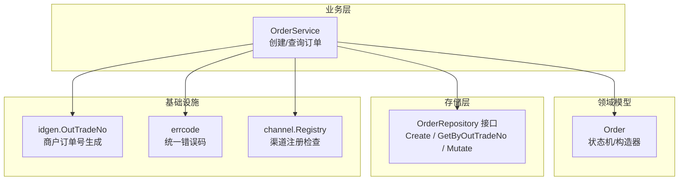
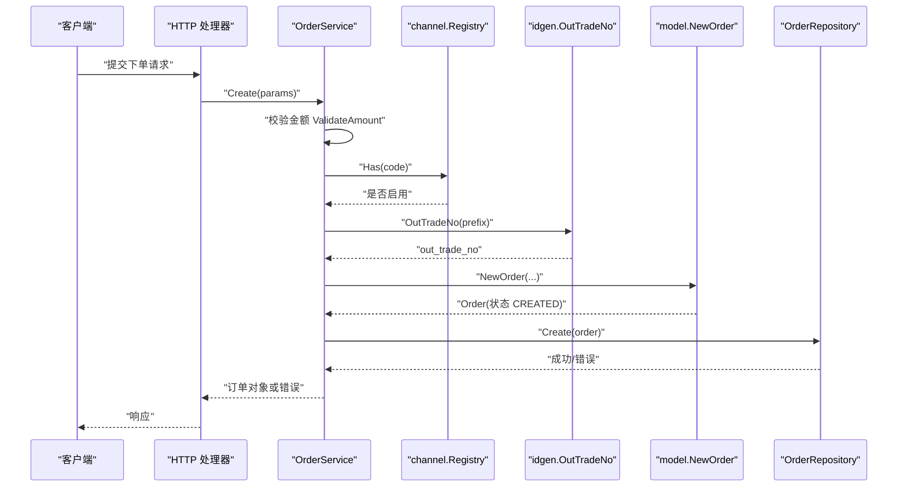
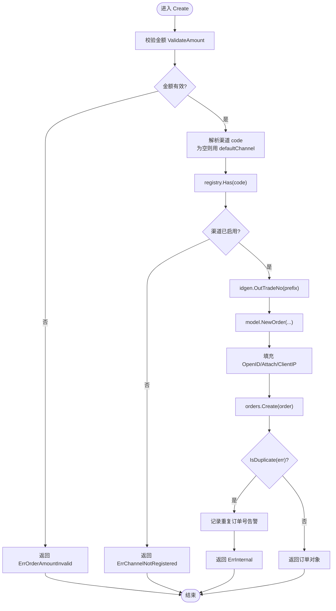
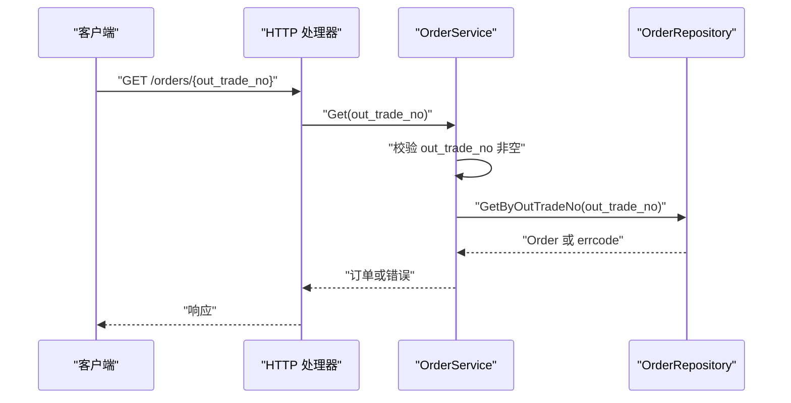
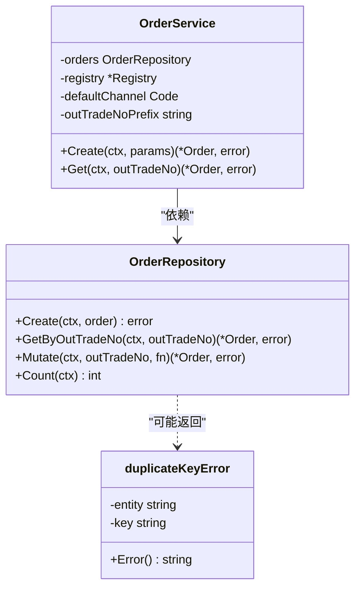
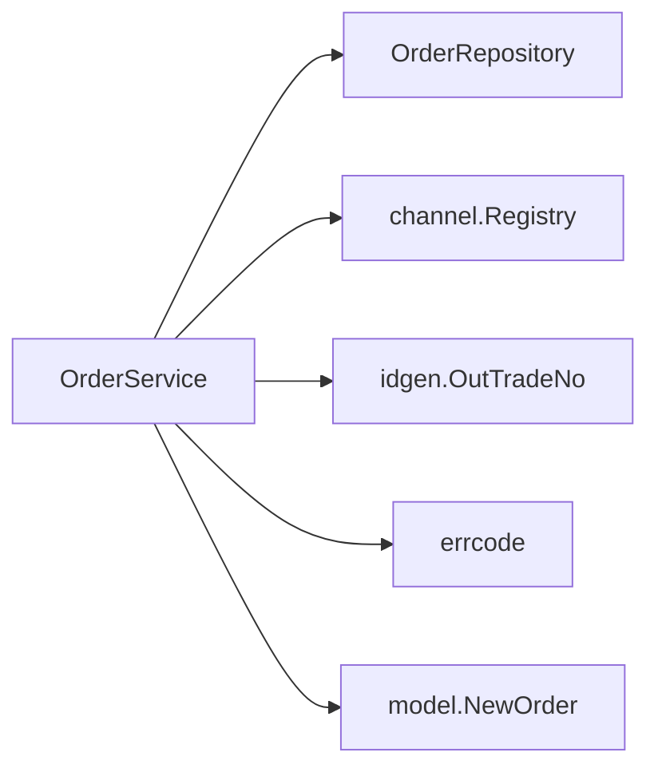

# 订单服务

<cite>
**本文引用的文件**   
- [order_service.go](file://internal/service/order_service.go)
- [order.go](file://internal/model/order.go)
- [repository.go](file://internal/repository/repository.go)
- [idgen.go](file://internal/pkg/idgen/idgen.go)
- [errcode.go](file://internal/errcode/errcode.go)
</cite>

## 目录
1. [简介](#简介)
2. [项目结构](#项目结构)
3. [核心组件](#核心组件)
4. [架构总览](#架构总览)
5. [详细组件分析](#详细组件分析)
6. [依赖关系分析](#依赖关系分析)
7. [性能与一致性考虑](#性能与一致性考虑)
8. [故障排查指南](#故障排查指南)
9. [结论](#结论)

## 简介
本文围绕订单服务的核心实现，重点说明 OrderService 的 Create 与 Get 方法：参数校验、渠道注册检查、商户订单号生成策略、订单对象初始化、持久化存储、查询流程，以及下单与发起支付分离的业务规则。文档同时给出错误处理策略、仓储层交互模式（含重复订单号 IsDuplicate 的处理），并提供时序图与关键代码路径引用，帮助读者从业务语义到代码实现建立完整认知。

## 项目结构
本仓库采用分层架构：HTTP 处理器位于 handler 层，业务逻辑集中在 service 层，领域模型在 model 层，存储抽象在 repository 层，通用工具与错误码分别放在 pkg 与 errcode 包中。OrderService 仅依赖 model、repository 接口与 channel 抽象，不感知 HTTP 与具体渠道 SDK，便于单元测试与替换存储实现。

**图表来源**
- [order_service.go:21-50](file://internal/service/order_service.go#L21-L50)
- [order.go:73-120](file://internal/model/order.go#L73-L120)
- [repository.go:27-44](file://internal/repository/repository.go#L27-L44)
- [idgen.go:29-38](file://internal/pkg/idgen/idgen.go#L29-L38)
- [errcode.go:20-76](file://internal/errcode/errcode.go#L20-L76)

**章节来源**
- [order_service.go:1-50](file://internal/service/order_service.go#L1-L50)
- [repository.go:1-44](file://internal/repository/repository.go#L1-L44)

## 核心组件
- OrderService：封装订单创建与查询的业务逻辑，负责参数校验、渠道选择、订单号生成、订单对象构建与持久化。
- model.Order：定义订单实体与状态机，提供 NewOrder 构造器与状态变更方法，保证金额单位、币种、时间戳等初始值正确，并禁止非法状态流转。
- repository.OrderRepository：定义订单存储接口，强调原子更新 Mutate 与对外返回副本的设计原则，避免并发重放导致幂等失效。
- idgen.OutTradeNo：按“前缀 + 秒级时间戳 + 随机串”的规则生成商户订单号，长度受微信支付约束，使用加密安全随机源。
- errcode：统一业务错误码与 HTTP 状态映射，支持 WithCause/WithMsg 扩展上下文，From 将任意 error 归一为业务错误类型。

**章节来源**
- [order_service.go:21-65](file://internal/service/order_service.go#L21-L65)
- [order.go:73-120](file://internal/model/order.go#L73-L120)
- [repository.go:27-44](file://internal/repository/repository.go#L27-L44)
- [idgen.go:29-38](file://internal/pkg/idgen/idgen.go#L29-L38)
- [errcode.go:20-76](file://internal/errcode/errcode.go#L20-L76)

## 架构总览
OrderService 处于业务层，向上被 handler 调用，向下通过 repository 接口访问存储；通过 channel.Registry 校验渠道可用性；通过 idgen 生成唯一商户订单号；通过 errcode 输出结构化错误。

**图表来源**
- [order_service.go:67-110](file://internal/service/order_service.go#L67-L110)
- [idgen.go:29-38](file://internal/pkg/idgen/idgen.go#L29-L38)
- [order.go:104-120](file://internal/model/order.go#L104-L120)
- [repository.go:27-44](file://internal/repository/repository.go#L27-L44)

## 详细组件分析

### OrderService.Create 完整流程
Create 方法完成以下关键步骤：
- 参数验证：调用 money.ValidateAmount 校验 AmountTotal，若无效则返回 ErrOrderAmountInvalid。
- 默认渠道处理：若未指定 Channel，则使用 defaultChannel（构造时注入，默认值为 mock）。
- 渠道注册检查：通过 registry.Has 确认渠道已启用，否则返回 ErrChannelNotRegistered。
- 商户订单号生成：调用 idgen.OutTradeNo 生成 out_trade_no，确保长度与字符集符合渠道要求。
- 订单对象初始化：调用 model.NewOrder 创建 Order，初始状态为 CREATED，并填充 OpenID、Attach、ClientIP。
- 持久化存储：调用 orders.Create 写入数据库；若发生重复主键冲突，记录告警日志并返回 ErrInternal。

**图表来源**
- [order_service.go:67-110](file://internal/service/order_service.go#L67-L110)
- [idgen.go:29-38](file://internal/pkg/idgen/idgen.go#L29-L38)
- [order.go:104-120](file://internal/model/order.go#L104-L120)
- [repository.go:85-89](file://internal/repository/repository.go#L85-L89)

**章节来源**
- [order_service.go:67-110](file://internal/service/order_service.go#L67-L110)
- [idgen.go:29-38](file://internal/pkg/idgen/idgen.go#L29-L38)
- [order.go:104-120](file://internal/model/order.go#L104-L120)
- [repository.go:85-89](file://internal/repository/repository.go#L85-L89)

### OrderService.Get 查询流程
Get 方法按商户订单号查询订单：
- 参数校验：out_trade_no 为空则返回 ErrInvalidParam。
- 仓储查询：调用 orders.GetByOutTradeNo 获取订单。
- 错误透传：仓储层已返回带错误码的错误（如 ErrOrderNotFound），直接透传，避免被 From 归一化为内部错误。

**图表来源**
- [order_service.go:112-124](file://internal/service/order_service.go#L112-L124)
- [repository.go:27-44](file://internal/repository/repository.go#L27-L44)

**章节来源**
- [order_service.go:112-124](file://internal/service/order_service.go#L112-L124)

### 订单创建的业务规则
- 为什么下单与发起支付分离：Create 不调用任何渠道接口，只创建订单并落库。这样可以在下单与支付之间插入风控、库存校验、优惠券核销等业务环节，避免单一接口耦合过多职责。
- 默认渠道处理机制：当未指定 Channel 时，使用构造时注入的 defaultChannel（默认 mock），保证测试与开发环境可快速跑通。
- 渠道必须在创建时确定：同一订单在不同请求下若解析出不同渠道，会导致对账无法解释。因此 Create 阶段即确定并落库 Channel。

**章节来源**
- [order_service.go:67-85](file://internal/service/order_service.go#L67-L85)

### 错误处理策略
- 金额无效：ValidateAmount 失败返回 ErrOrderAmountInvalid（HTTP 400）。
- 渠道未启用：registry.Has 失败返回 ErrChannelNotRegistered（HTTP 500，表示渠道未注册或未启用）。
- 重复订单号：orders.Create 返回重复主键错误时，IsDuplicate 判断为真，记录告警日志并返回 ErrInternal（HTTP 500），因为重复意味着随机源或时钟异常，属于必须告警的内部问题。
- 查询不存在：仓储层返回 ErrOrderNotFound，Get 直接透传，避免被 From 包装成内部错误。

**章节来源**
- [order_service.go:72-101](file://internal/service/order_service.go#L72-L101)
- [order_service.go:112-124](file://internal/service/order_service.go#L112-L124)
- [errcode.go:98-134](file://internal/errcode/errcode.go#L98-L134)

### 与仓储层的交互模式与 IsDuplicate 处理
- 接口设计：OrderRepository 提供 Create、GetByOutTradeNo、Mutate、Count。Mutate 用于在锁/事务中原子读取并修改订单，避免并发重放导致的幂等失效。
- 对外返回副本：仓储层返回 Order 副本而非内部指针，防止调用方绕过领域模型的状态机直接修改字段。
- IsDuplicate：repository.IsDuplicate 用于识别唯一键冲突错误。Create 中检测到重复后记录告警并返回 ErrInternal，体现“重复订单号属于系统异常”的策略。

**图表来源**
- [repository.go:27-44](file://internal/repository/repository.go#L27-L44)
- [repository.go:66-89](file://internal/repository/repository.go#L66-L89)
- [order_service.go:21-50](file://internal/service/order_service.go#L21-L50)

**章节来源**
- [repository.go:27-44](file://internal/repository/repository.go#L27-L44)
- [repository.go:66-89](file://internal/repository/repository.go#L66-L89)
- [order_service.go:93-101](file://internal/service/order_service.go#L93-L101)

### 关键代码示例（路径引用）
- 参数校验与渠道检查：[order_service.go:72-85](file://internal/service/order_service.go#L72-L85)
- 商户订单号生成：[idgen.go:29-38](file://internal/pkg/idgen/idgen.go#L29-L38)
- 订单对象初始化：[order.go:104-120](file://internal/model/order.go#L104-L120)
- 持久化与重复处理：[order_service.go:93-101](file://internal/service/order_service.go#L93-L101)
- 查询与错误透传：[order_service.go:112-124](file://internal/service/order_service.go#L112-L124)

## 依赖关系分析
OrderService 的依赖关系如下：
- 依赖 repository.OrderRepository：用于订单的创建与查询。
- 依赖 channel.Registry：用于校验渠道是否启用。
- 依赖 idgen.OutTradeNo：用于生成商户订单号。
- 依赖 errcode：用于输出结构化错误。
- 依赖 model.NewOrder：用于创建领域对象。

**图表来源**
- [order_service.go:21-50](file://internal/service/order_service.go#L21-L50)
- [repository.go:27-44](file://internal/repository/repository.go#L27-L44)
- [idgen.go:29-38](file://internal/pkg/idgen/idgen.go#L29-L38)
- [errcode.go:20-76](file://internal/errcode/errcode.go#L20-L76)
- [order.go:104-120](file://internal/model/order.go#L104-L120)

**章节来源**
- [order_service.go:21-50](file://internal/service/order_service.go#L21-L50)

## 性能与一致性考虑
- 金额计算：所有金额以“分”为单位，禁止使用 float64 参与运算，避免精度丢失。
- 并发与幂等：仓储层通过 Mutate 在锁/事务中原子读取并修改订单，避免回调重放导致状态机多次推进。
- 唯一性保障：out_trade_no 由 idgen 基于时间与高熵随机生成，但仍建议存储层加唯一索引兜底；出现重复需告警并视为内部错误。
- 对外返回副本：仓储层返回 Order 副本，防止调用方绕过状态机直接修改内存数据。

**章节来源**
- [order.go:73-120](file://internal/model/order.go#L73-L120)
- [repository.go:1-19](file://internal/repository/repository.go#L1-L19)
- [repository.go:27-44](file://internal/repository/repository.go#L27-L44)
- [idgen.go:29-38](file://internal/pkg/idgen/idgen.go#L29-L38)

## 故障排查指南
- 金额不合法：检查传入 AmountTotal 是否为正数且不超过上限；对应错误码为 ErrOrderAmountInvalid。
- 渠道未启用：确认 channel.Registry 已注册该渠道；对应错误码为 ErrChannelNotRegistered。
- 重复订单号：检查 idgen 的随机源与时钟是否正常；仓储层应存在 out_trade_no 唯一索引；对应处理为记录告警并返回 ErrInternal。
- 订单不存在：Get 查询时仓储层返回 ErrOrderNotFound，直接透传；避免被 From 包装为内部错误。

**章节来源**
- [order_service.go:72-101](file://internal/service/order_service.go#L72-L101)
- [order_service.go:112-124](file://internal/service/order_service.go#L112-L124)
- [errcode.go:98-134](file://internal/errcode/errcode.go#L98-L134)

## 结论
OrderService 将订单创建的核心业务规则收敛在服务层，通过严格的参数校验、渠道注册检查、唯一订单号生成与领域模型构造，确保订单数据的正确性与一致性。下单与支付分离的设计为后续风控、库存、优惠等业务留出了扩展空间。仓储层通过接口抽象与原子更新机制，保障了并发场景下的幂等与一致性。错误处理采用统一的 errcode 体系，既对外暴露清晰的 HTTP 语义，又在内部保留底层原因以便排查。整体架构清晰、职责分明，具备良好的可测试性与可扩展性。