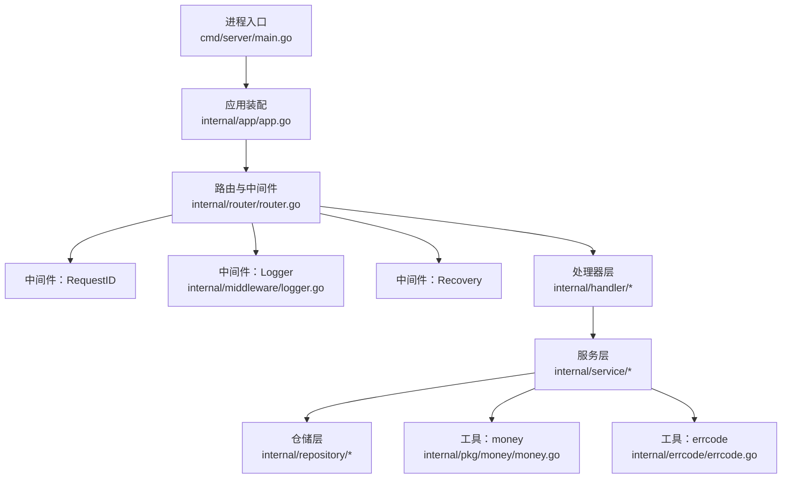
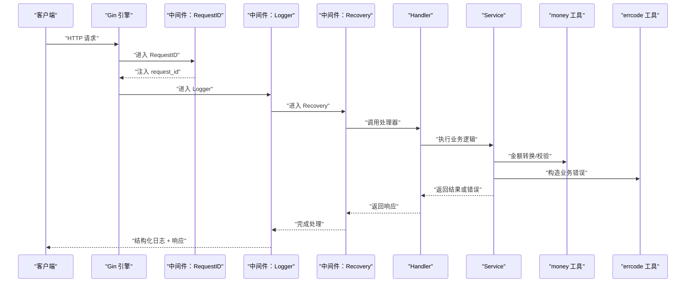
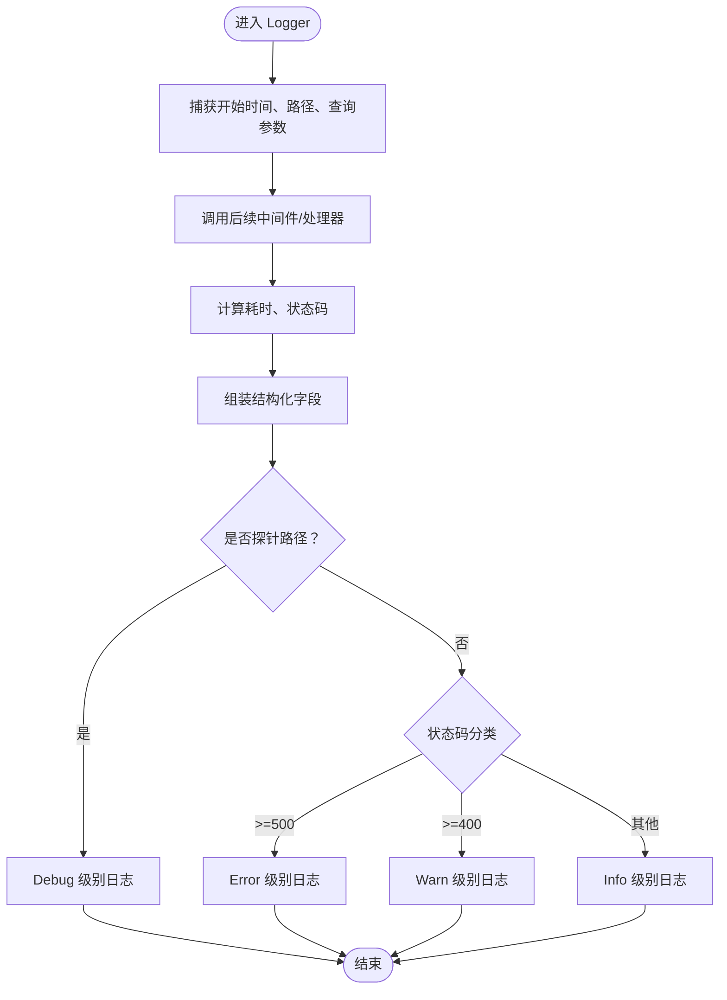
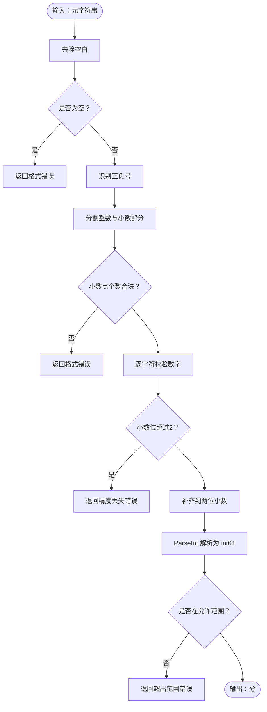
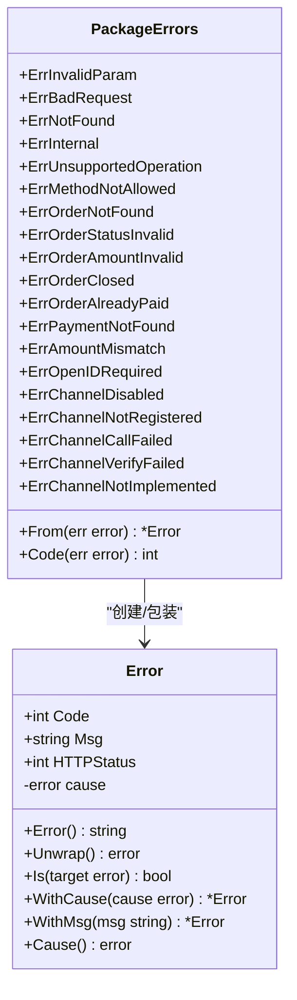
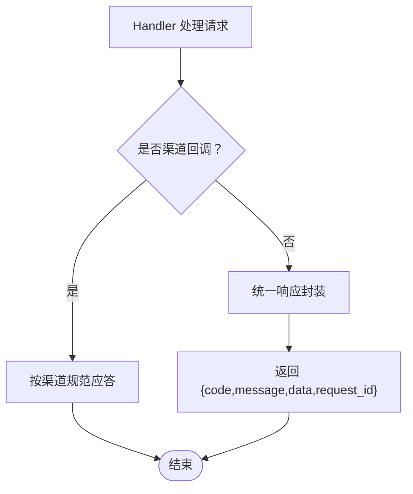
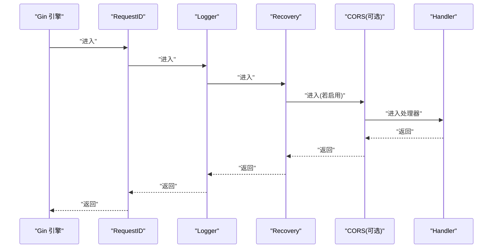
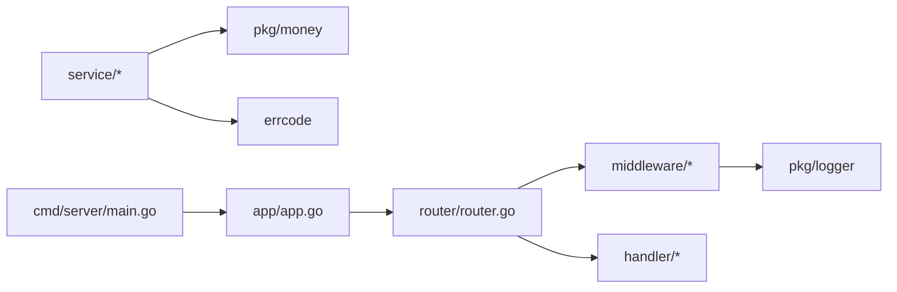

# 中间件与工具

<cite>
**本文引用的文件**   
- [internal/middleware/logger.go](file://internal/middleware/logger.go)
- [internal/pkg/money/money.go](file://internal/pkg/money/money.go)
- [internal/errcode/errcode.go](file://internal/errcode/errcode.go)
- [internal/router/router.go](file://internal/router/router.go)
- [cmd/server/main.go](file://cmd/server/main.go)
- [internal/app/app.go](file://internal/app/app.go)
- [README.md](file://README.md)
</cite>

## 目录
1. [引言](#引言)
2. [项目结构](#项目结构)
3. [核心组件](#核心组件)
4. [架构总览](#架构总览)
5. [详细组件分析](#详细组件分析)
6. [依赖关系分析](#依赖关系分析)
7. [性能与可观测性](#性能与可观测性)
8. [故障排查指南](#故障排查指南)
9. [结论](#结论)
10. [附录：使用示例与最佳实践](#附录使用示例与最佳实践)

## 引言
本文聚焦项目中用于横切关注点的中间件与通用工具，包括：
- 日志中间件的请求链路追踪、结构化日志记录与探针路径处理。
- money 包的金额安全处理：元分转换、精度校验与大数运算保护。
- errcode 包的业务错误码体系与 HTTP 状态码映射。
- response 统一响应封装机制（以约定形式说明）。
- 中间件链执行顺序与扩展自定义中间件的方法。
- 这些组件如何协同提升系统的可维护性与可观测性。

## 项目结构
本项目采用分层架构：进程入口负责生命周期，app 层装配依赖，router 注册路由并挂载中间件，handler 接入 HTTP，service 承载业务，repository 抽象存储，pkg 提供通用工具，middleware 提供横切能力。

**图表来源**
- [cmd/server/main.go:31-124](file://cmd/server/main.go#L31-L124)
- [internal/app/app.go:39-105](file://internal/app/app.go#L39-L105)
- [internal/router/router.go:50-84](file://internal/router/router.go#L50-L84)
- [internal/middleware/logger.go:34-76](file://internal/middleware/logger.go#L34-L76)
- [internal/pkg/money/money.go:1-152](file://internal/pkg/money/money.go#L1-L152)
- [internal/errcode/errcode.go:1-158](file://internal/errcode/errcode.go#L1-L158)

**章节来源**
- [cmd/server/main.go:1-124](file://cmd/server/main.go#L1-L124)
- [internal/app/app.go:1-200](file://internal/app/app.go#L1-L200)
- [internal/router/router.go:1-121](file://internal/router/router.go#L1-L121)

## 核心组件
- 日志中间件：提供结构化访问日志、探针路径降级、用户代理长度限制、基于上下文 logger 的字段输出。
- money 工具：以「分」为内部单位，提供安全的元分转换、精度校验、范围校验与大数乘法保护。
- errcode 工具：定义分段业务错误码，绑定 HTTP 状态码，支持 cause 包装、消息替换与错误归一化。
- response 统一响应：对外 API 返回统一 JSON 结构，包含 code、message、data 与 request_id；渠道回调接口除外。
- 中间件链：RequestID → Logger → Recovery，必要时附加 CORS。

**章节来源**
- [internal/middleware/logger.go:25-76](file://internal/middleware/logger.go#L25-L76)
- [internal/pkg/money/money.go:1-152](file://internal/pkg/money/money.go#L1-L152)
- [internal/errcode/errcode.go:1-158](file://internal/errcode/errcode.go#L1-L158)
- [README.md:77-83](file://README.md#L77-L83)
- [internal/router/router.go:62-73](file://internal/router/router.go#L62-L73)

## 架构总览
下图展示一次典型 HTTP 请求在中间件与工具之间的流转：

**图表来源**
- [internal/router/router.go:62-73](file://internal/router/router.go#L62-L73)
- [internal/middleware/logger.go:34-76](file://internal/middleware/logger.go#L34-L76)
- [internal/pkg/money/money.go:39-152](file://internal/pkg/money/money.go#L39-L152)
- [internal/errcode/errcode.go:20-158](file://internal/errcode/errcode.go#L20-L158)

## 详细组件分析

### 日志中间件：结构化日志与链路追踪
- 设计目标：替代 Gin 默认日志，输出结构化字段，便于按 request_id、out_trade_no 等关键字检索；避免记录敏感请求体与响应体。
- 关键行为：
  - 健康探针路径 /healthz、/readyz 降级为 Debug 级别，避免淹没真实业务日志。
  - 记录 status、method、path、latency、client_ip、user_agent、query、route、errors 等字段。
  - 使用 context 获取 logger 实例，确保链路追踪字段贯穿整个请求。
  - 对 user_agent 做长度截断，防止超长 UA 撑爆日志行。
- 与链路追踪的关系：
  - README 指出 RequestID 中间件最先执行，传入 X-Request-Id 则沿用，否则生成；所有日志带该字段，响应体与响应头回显。
  - Logger 中间件通过 logger.L(ctx) 获取带上下文的 logger，从而把 request_id 写入每条日志。

**图表来源**
- [internal/middleware/logger.go:34-76](file://internal/middleware/logger.go#L34-L76)
- [internal/middleware/logger.go:79-89](file://internal/middleware/logger.go#L79-L89)

**章节来源**
- [internal/middleware/logger.go:13-33](file://internal/middleware/logger.go#L13-L33)
- [internal/middleware/logger.go:34-76](file://internal/middleware/logger.go#L34-L76)
- [internal/middleware/logger.go:79-89](file://internal/middleware/logger.go#L79-L89)
- [README.md:211-213](file://README.md#L211-L213)

### money 包：金额处理与安全实现
- 内部单位：所有金额以 int64 表示「分」，严禁 float64 参与金额运算。
- 元分转换：
  - YuanToFen：解析字符串形式的「元」，严格校验小数位不超过两位，拒绝千分位分隔符与货币符号，全程无浮点运算。
  - FenToYuan：将「分」格式化为保留两位小数的「元」字符串，使用 big.Int 避免边界溢出。
- 校验与保护：
  - ValidateAmount：校验金额为正数且不超过单笔上限。
  - Mul：数量×单价场景的安全乘法，使用 big.Int 检测溢出与上限。
- 常量与错误：
  - DecimalScale=2，MaxAmountFen=1亿元（分），并提供 ErrInvalidFormat、ErrPrecisionLoss、ErrOutOfRange、ErrNegative、ErrZero 等错误类型。

**图表来源**
- [internal/pkg/money/money.go:39-106](file://internal/pkg/money/money.go#L39-L106)

**章节来源**
- [internal/pkg/money/money.go:1-37](file://internal/pkg/money/money.go#L1-L37)
- [internal/pkg/money/money.go:39-106](file://internal/pkg/money/money.go#L39-L106)
- [internal/pkg/money/money.go:108-152](file://internal/pkg/money/money.go#L108-L152)

### errcode 包：错误码管理体系
- 分段规则：
  - 0：成功
  - 10xxx：通用错误（参数、未找到、内部错误）
  - 20xxx：订单相关
  - 30xxx：支付相关
  - 40xxx：支付渠道相关
- 错误类型：
  - Error 结构体包含 Code、Msg、HTTPStatus 与私有 cause。
  - WithCause：复制错误并挂上底层原因，避免并发共享变量被修改。
  - WithMsg：复制错误并替换对外文案。
  - Is：同一错误码实例相互相等，支持 errors.Is 穿透。
  - Unwrap：让 errors.Is/As 能穿透本类型找到底层原因。
- 归一化：
  - From：任意 error 归一为 *Error；非业务错误映射为 ErrInternal 并携带 cause。
  - Code：取出错误码，nil 错误返回 0。

**图表来源**
- [internal/errcode/errcode.go:20-76](file://internal/errcode/errcode.go#L20-L76)
- [internal/errcode/errcode.go:78-158](file://internal/errcode/errcode.go#L78-L158)

**章节来源**
- [internal/errcode/errcode.go:1-18](file://internal/errcode/errcode.go#L1-L18)
- [internal/errcode/errcode.go:20-76](file://internal/errcode/errcode.go#L20-L76)
- [internal/errcode/errcode.go:78-158](file://internal/errcode/errcode.go#L78-L158)

### response 包：统一响应封装机制
- 统一响应体约定：
  - 标准 JSON 结构包含 code、message、data、request_id。
  - code=0 表示成功；HTTP 状态码与业务码同时给出，供网关监控与客户端分支判断。
- 例外：
  - 渠道回调接口不走统一响应体，必须按渠道规范应答（例如微信支付要求 SUCCESS/FAIL）。
- 与 errcode 的关系：
  - errcode 每个错误码绑定 HTTP 状态码，由上层统一转换为响应体。

**图表来源**
- [README.md:77-83](file://README.md#L77-L83)
- [internal/handler/callback_handler.go:14-32](file://internal/handler/callback_handler.go#L14-L32)

**章节来源**
- [README.md:77-83](file://README.md#L77-L83)
- [internal/handler/callback_handler.go:14-32](file://internal/handler/callback_handler.go#L14-L32)

### 中间件链执行顺序与扩展方法
- 执行顺序：
  - RequestID 最先执行，确保后续日志与响应携带 request_id。
  - Logger 在 Recovery 之前，以便记录 panic 请求的耗时与状态码。
  - Recovery 在最内层，捕获后续处理中的异常。
  - 可选 CORS 中间件根据配置启用。
- 扩展自定义中间件：
  - 在 router.New 中 engine.Use(...) 追加自定义中间件，注意顺序影响。
  - 若需访问 request_id，应放在 RequestID 之后。
  - 若需记录 panic 信息，应放在 Recovery 之前。

**图表来源**
- [internal/router/router.go:62-73](file://internal/router/router.go#L62-L73)

**章节来源**
- [internal/router/router.go:50-84](file://internal/router/router.go#L50-L84)

## 依赖关系分析
- 中间件依赖：
  - Logger 依赖 zap 与 internal/pkg/logger，通过 context 获取 logger 实例。
  - Router 依赖 middleware 与 handler，集中注册路由与健康检查。
- 工具依赖：
  - money 依赖 math/big 进行大数运算，避免浮点精度问题。
  - errcode 依赖 net/http 绑定状态码，errors 支持 Is/As/Unwrap。
- 应用装配：
  - app.New 装配 logger、channel registry、repository、service、handler、router。
  - main 负责进程生命周期与优雅关闭。

**图表来源**
- [internal/router/router.go:1-121](file://internal/router/router.go#L1-L121)
- [internal/middleware/logger.go:1-90](file://internal/middleware/logger.go#L1-L90)
- [internal/pkg/money/money.go:1-152](file://internal/pkg/money/money.go#L1-L152)
- [internal/errcode/errcode.go:1-158](file://internal/errcode/errcode.go#L1-L158)
- [internal/app/app.go:39-105](file://internal/app/app.go#L39-L105)
- [cmd/server/main.go:31-124](file://cmd/server/main.go#L31-L124)

**章节来源**
- [internal/router/router.go:1-121](file://internal/router/router.go#L1-L121)
- [internal/middleware/logger.go:1-90](file://internal/middleware/logger.go#L1-L90)
- [internal/pkg/money/money.go:1-152](file://internal/pkg/money/money.go#L1-L152)
- [internal/errcode/errcode.go:1-158](file://internal/errcode/errcode.go#L1-L158)
- [internal/app/app.go:39-105](file://internal/app/app.go#L39-L105)
- [cmd/server/main.go:31-124](file://cmd/server/main.go#L31-L124)

## 性能与可观测性
- 性能：
  - Logger 不记录请求体与响应体，避免日志体积随业务量线性膨胀。
  - user_agent 截断防止超长字段影响日志聚合。
  - money 使用 big.Int 进行大数运算，避免浮点误差与溢出。
- 可观测性：
  - request_id 贯穿链路，便于日志聚合与问题定位。
  - 结构化日志字段便于按关键字检索。
  - errcode 绑定 HTTP 状态码，便于网关与监控系统分类统计。

[本节为通用指导，不直接分析具体文件]

## 故障排查指南
- 日志问题：
  - 确认 Logger 中间件已挂载，且位于 Recovery 之前。
  - 检查探针路径是否被误判为业务请求。
- 金额问题：
  - 使用 money.YuanToFen 与 money.FenToYuan 进行转换，避免 float64。
  - 使用 money.ValidateAmount 与 money.Mul 进行校验与乘法保护。
- 错误码问题：
  - 使用 errcode.From 归一化错误，使用 errcode.Code 提取错误码。
  - 使用 WithCause 与 WithMsg 补充上下文与对外文案。
- 响应问题：
  - 渠道回调接口不走统一响应体，需按渠道规范应答。
  - 其他接口使用统一响应体，包含 request_id。

**章节来源**
- [internal/middleware/logger.go:34-76](file://internal/middleware/logger.go#L34-L76)
- [internal/pkg/money/money.go:39-152](file://internal/pkg/money/money.go#L39-L152)
- [internal/errcode/errcode.go:20-158](file://internal/errcode/errcode.go#L20-L158)
- [README.md:77-83](file://README.md#L77-L83)

## 结论
通过中间件与通用工具的协同，系统实现了：
- 统一的链路追踪与结构化日志，提升可观测性。
- 安全的金额处理，避免资金事故。
- 清晰的错误码体系，便于前端与网关处理。
- 标准化的响应格式，降低集成成本。
- 明确的中间件执行顺序，便于扩展与维护。

[本节为总结，不直接分析具体文件]

## 附录：使用示例与最佳实践
- 日志中间件：
  - 在 router.New 中挂载 Logger，确保位于 Recovery 之前。
  - 使用 logger.L(ctx) 获取带上下文的 logger，记录结构化字段。
- money 工具：
  - 使用 YuanToFen 解析外部输入的「元」字符串。
  - 使用 FenToYuan 格式化输出「元」字符串。
  - 使用 ValidateAmount 与 Mul 进行校验与乘法保护。
- errcode 工具：
  - 使用 newError 或预定义错误码构造业务错误。
  - 使用 WithCause 与 WithMsg 补充上下文与对外文案。
  - 使用 From 归一化错误，使用 Code 提取错误码。
- response 统一响应：
  - 非渠道回调接口返回统一响应体，包含 request_id。
  - 渠道回调接口按渠道规范应答。
- 中间件扩展：
  - 在 router.New 中 engine.Use(...) 追加自定义中间件。
  - 注意中间件顺序，确保 request_id 先注入，panic 后记录。

**章节来源**
- [internal/router/router.go:62-73](file://internal/router/router.go#L62-L73)
- [internal/middleware/logger.go:34-76](file://internal/middleware/logger.go#L34-L76)
- [internal/pkg/money/money.go:39-152](file://internal/pkg/money/money.go#L39-L152)
- [internal/errcode/errcode.go:20-158](file://internal/errcode/errcode.go#L20-L158)
- [README.md:77-83](file://README.md#L77-L83)