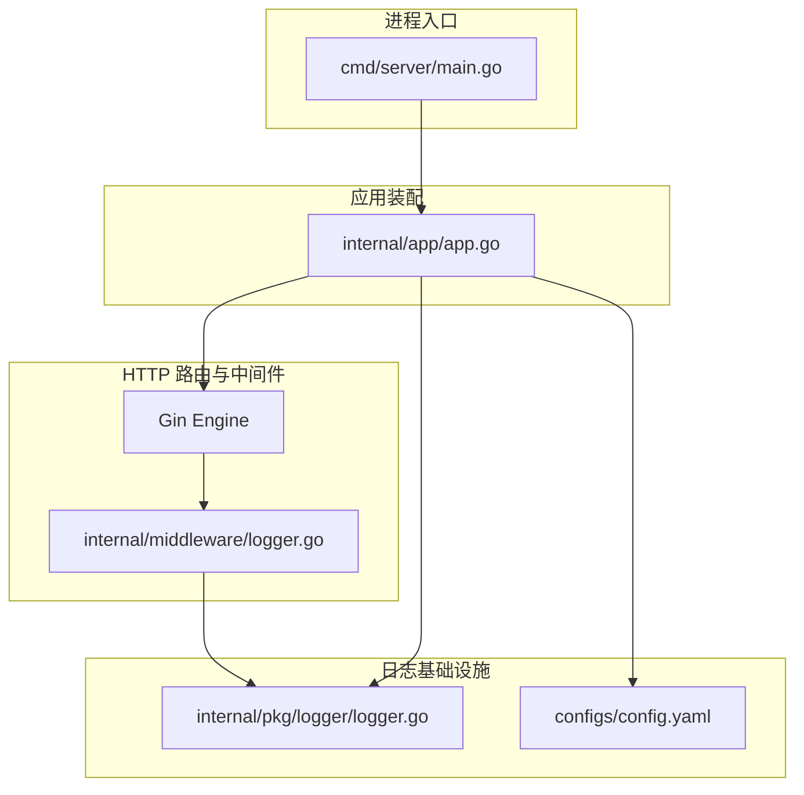
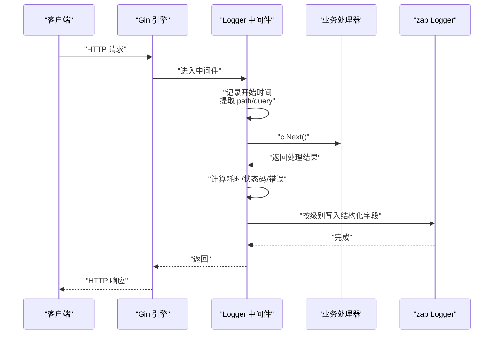
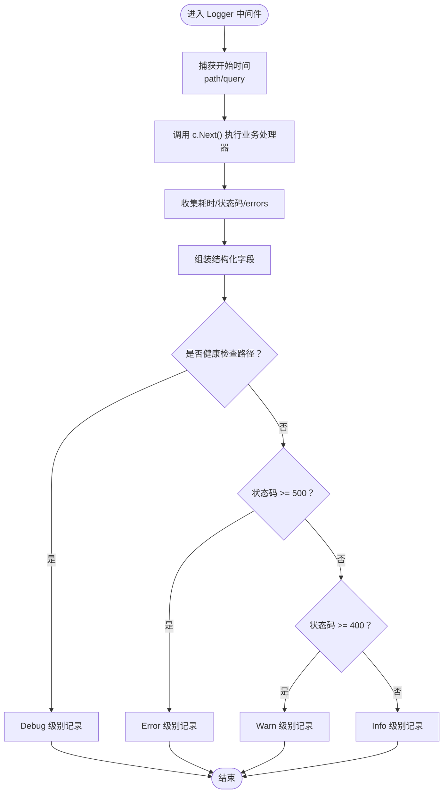
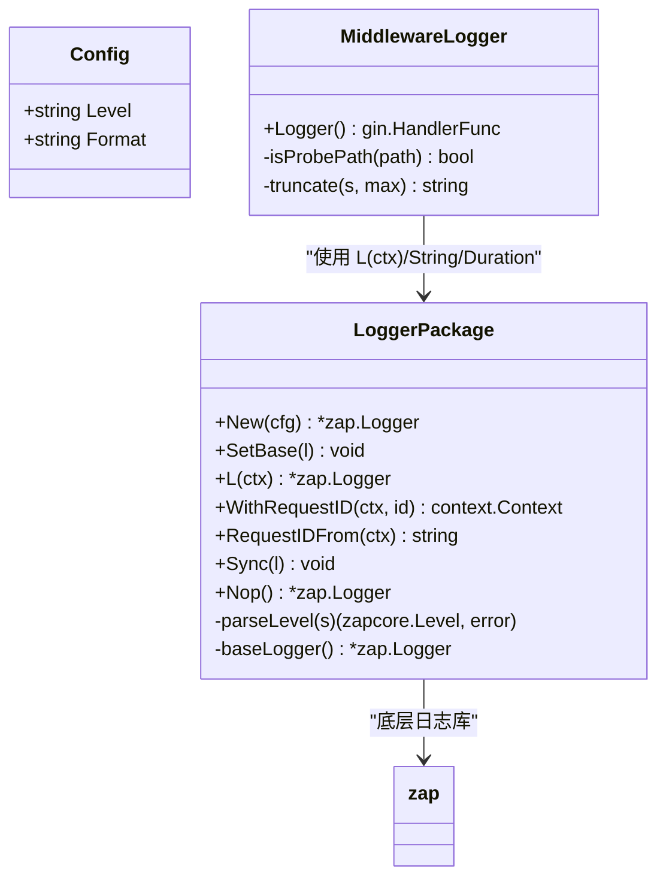
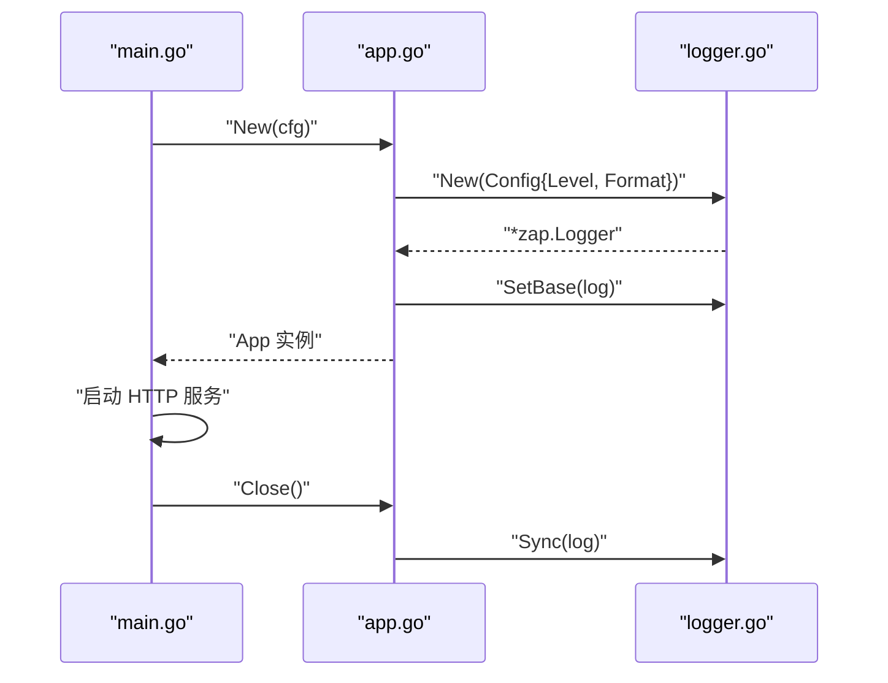
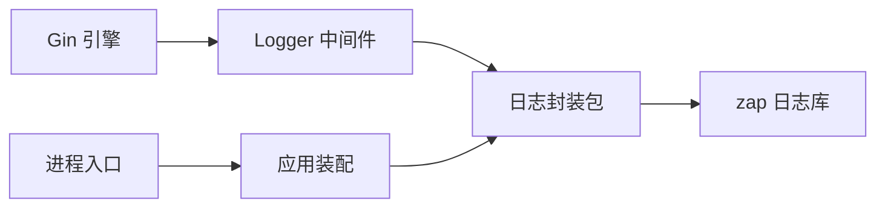

# 日志中间件

<cite>
**本文引用的文件**   
- [internal/middleware/logger.go](file://internal/middleware/logger.go)
- [internal/pkg/logger/logger.go](file://internal/pkg/logger/logger.go)
- [internal/app/app.go](file://internal/app/app.go)
- [cmd/server/main.go](file://cmd/server/main.go)
- [configs/config.yaml](file://configs/config.yaml)
</cite>

## 目录
1. [引言](#引言)
2. [项目结构](#项目结构)
3. [核心组件](#核心组件)
4. [架构总览](#架构总览)
5. [详细组件分析](#详细组件分析)
6. [依赖关系分析](#依赖关系分析)
7. [性能与优化](#性能与优化)
8. [配置说明](#配置说明)
9. [使用示例](#使用示例)
10. [故障排查指南](#故障排查指南)
11. [结论](#结论)

## 引言
本文面向支付服务的日志中间件，系统性解释其设计目标、实现原理与扩展方式。该中间件用于替代 Gin 默认的 `gin.Logger()`，将访问日志从“给人看的彩色文本”升级为“可被日志系统检索的结构化字段”，并围绕支付场景强调：
- 结构化字段优先：便于按 `request_id`、`out_trade_no`、状态码等维度检索。
- 最小化敏感信息：不记录请求体/响应体，限制用户代理长度。
- 健康检查探针过滤：避免 K8s 探针日志淹没业务日志。
- 链路追踪：通过上下文传递 `request_id`，串联一次请求的所有日志。
- 安全与健壮性：非法日志级别直接报错；进程退出前 flush 日志缓冲。

## 项目结构
日志相关代码分布在以下位置：
- 中间件层：`internal/middleware/logger.go`
- 日志封装层：`internal/pkg/logger/logger.go`
- 应用装配层：`internal/app/app.go`
- 进程入口：`cmd/server/main.go`
- 配置文件：`configs/config.yaml`

**图表来源**
- [cmd/server/main.go:31-124](file://cmd/server/main.go#L31-L124)
- [internal/app/app.go:45-105](file://internal/app/app.go#L45-L105)
- [internal/middleware/logger.go:34-77](file://internal/middleware/logger.go#L34-L77)
- [internal/pkg/logger/logger.go:57-93](file://internal/pkg/logger/logger.go#L57-L93)
- [configs/config.yaml:24-28](file://configs/config.yaml#L24-L28)

**章节来源**
- [cmd/server/main.go:31-124](file://cmd/server/main.go#L31-L124)
- [internal/app/app.go:45-105](file://internal/app/app.go#L45-L105)
- [internal/middleware/logger.go:34-77](file://internal/middleware/logger.go#L34-L77)
- [internal/pkg/logger/logger.go:57-93](file://internal/pkg/logger/logger.go#L57-L93)
- [configs/config.yaml:24-28](file://configs/config.yaml#L24-L28)

## 核心组件
- **Logger 中间件**：拦截 HTTP 请求，记录结构化访问日志，替代 `gin.Logger()`。
- **日志封装包**：基于 zap 提供全局 Logger、上下文携带 `request_id`、字段构造器、级别解析、flush 能力。
- **应用装配**：根据配置初始化日志，设置全局兜底 Logger，并暴露给上层使用。
- **进程入口**：负责优雅关闭，确保最后日志被 flush。

**章节来源**
- [internal/middleware/logger.go:25-77](file://internal/middleware/logger.go#L25-L77)
- [internal/pkg/logger/logger.go:21-34](file://internal/pkg/logger/logger.go#L21-L34)
- [internal/pkg/logger/logger.go:57-93](file://internal/pkg/logger/logger.go#L57-L93)
- [internal/pkg/logger/logger.go:121-154](file://internal/pkg/logger/logger.go#L121-L154)
- [internal/app/app.go:50-55](file://internal/app/app.go#L50-L55)
- [cmd/server/main.go:102-123](file://cmd/server/main.go#L102-L123)

## 架构总览
日志中间件在 Gin 请求生命周期中工作：进入时记录起点，调用下一个处理器后收集耗时、状态码、客户端 IP、UA、查询参数、路由模板、错误信息等，再按策略写入结构化日志。

**图表来源**
- [internal/middleware/logger.go:34-77](file://internal/middleware/logger.go#L34-L77)
- [internal/pkg/logger/logger.go:140-154](file://internal/pkg/logger/logger.go#L140-L154)

## 详细组件分析

### Logger 中间件（internal/middleware/logger.go）
- **设计目标**
  - 替代 `gin.Logger()`，输出结构化字段，便于日志系统检索。
  - 不记录请求体/响应体，遵循最小化原则，避免泄露敏感数据与日志膨胀。
  - 健康检查路径降级为 Debug，防止 K8s 探针日志淹没业务日志。
  - 限制 UA 长度，避免超长 UA 撑爆日志行。
  - 记录路由模板而非真实 URL，避免路径参数污染聚合键。

- **关键逻辑**
  - 健康检查探针路径集合：`/healthz`、`/readyz`。
  - UA 截断上限：256 字符。
  - 结构化字段包括：状态码、方法、路径、耗时、客户端 IP、UA、可选 query、可选 route、可选 errors。
  - 日志级别选择：
    - 探针路径：Debug
    - 状态码 >= 500：Error
    - 状态码 >= 400：Warn
    - 其他：Info

**图表来源**
- [internal/middleware/logger.go:13-23](file://internal/middleware/logger.go#L13-L23)
- [internal/middleware/logger.go:45-75](file://internal/middleware/logger.go#L45-L75)

**章节来源**
- [internal/middleware/logger.go:13-23](file://internal/middleware/logger.go#L13-L23)
- [internal/middleware/logger.go:34-77](file://internal/middleware/logger.go#L34-L77)

### 日志封装包（internal/pkg/logger/logger.go）
- **能力概述**
  - 基于 zap 提供全局 Logger，支持 console/json 两种编码。
  - 通过 context 传递 `request_id`，使一次请求的所有日志可串联。
  - 提供常用字段构造器别名，避免业务层直接依赖 zap。
  - 严格校验日志级别，非法值直接报错。
  - 进程退出前必须 flush 日志缓冲。

- **数据结构与复杂度**
  - `Config`：包含 Level、Format，O(1)。
  - `ctxKey`：私有类型，作为 context key，O(1)。
  - `base`：原子指针保存全局 Logger，并发安全，O(1)。
  - `parseLevel`：字符串解析，O(n)（n 为输入长度）。
  - `WithRequestID` / `RequestIDFrom`：context 存取，O(1)。
  - `L(ctx)`：每次调用 With 附加 request_id，O(1)，语义清晰但多一次对象分配。

- **依赖链**
  - 中间件通过 `logger.L(c.Request.Context())` 获取带 request_id 的 Logger。
  - 应用装配通过 `logger.New(...)` 创建全局 Logger，并通过 `logger.SetBase(log)` 注入。
  - 进程入口在优雅关闭时调用 `logger.Sync(log)` flush 日志。

**图表来源**
- [internal/pkg/logger/logger.go:36-42](file://internal/pkg/logger/logger.go#L36-L42)
- [internal/pkg/logger/logger.go:57-93](file://internal/pkg/logger/logger.go#L57-L93)
- [internal/pkg/logger/logger.go:121-154](file://internal/pkg/logger/logger.go#L121-L154)
- [internal/pkg/logger/logger.go:172-182](file://internal/pkg/logger/logger.go#L172-L182)
- [internal/middleware/logger.go:34-77](file://internal/middleware/logger.go#L34-L77)

**章节来源**
- [internal/pkg/logger/logger.go:21-34](file://internal/pkg/logger/logger.go#L21-L34)
- [internal/pkg/logger/logger.go:57-93](file://internal/pkg/logger/logger.go#L57-L93)
- [internal/pkg/logger/logger.go:101-119](file://internal/pkg/logger/logger.go#L101-L119)
- [internal/pkg/logger/logger.go:121-154](file://internal/pkg/logger/logger.go#L121-L154)
- [internal/pkg/logger/logger.go:172-182](file://internal/pkg/logger/logger.go#L172-L182)

### 应用装配与进程入口
- **应用装配**
  - 根据配置初始化日志，设置全局兜底 Logger。
  - 暴露 Logger、Engine、Config、Registry 等能力。
  - Close 方法确保 flush 日志缓冲。

- **进程入口**
  - 启动服务、监听信号、优雅关闭。
  - 优雅关闭超时则强制断开连接，并记录关键诊断信息。

**图表来源**
- [internal/app/app.go:50-55](file://internal/app/app.go#L50-L55)
- [internal/app/app.go:194-199](file://internal/app/app.go#L194-L199)
- [cmd/server/main.go:102-123](file://cmd/server/main.go#L102-L123)

**章节来源**
- [internal/app/app.go:45-105](file://internal/app/app.go#L45-L105)
- [internal/app/app.go:194-199](file://internal/app/app.go#L194-L199)
- [cmd/server/main.go:102-123](file://cmd/server/main.go#L102-L123)

## 依赖关系分析
- **耦合度**
  - 中间件仅依赖日志封装包与 Gin 上下文，低耦合。
  - 日志封装包依赖 zap，向上暴露简洁 API，降低业务层耦合。
  - 应用装配集中管理依赖，单向依赖链，无循环依赖。

- **外部依赖**
  - Gin：HTTP 框架。
  - zap：高性能结构化日志库。
  - K8s：健康检查探针路径 `/healthz`、`/readyz`。

**图表来源**
- [internal/middleware/logger.go:3-11](file://internal/middleware/logger.go#L3-L11)
- [internal/pkg/logger/logger.go:11-19](file://internal/pkg/logger/logger.go#L11-L19)
- [internal/app/app.go:14-29](file://internal/app/app.go#L14-L29)
- [cmd/server/main.go:8-23](file://cmd/server/main.go#L8-L23)

**章节来源**
- [internal/middleware/logger.go:3-11](file://internal/middleware/logger.go#L3-L11)
- [internal/pkg/logger/logger.go:11-19](file://internal/pkg/logger/logger.go#L11-L19)
- [internal/app/app.go:14-29](file://internal/app/app.go#L14-L29)
- [cmd/server/main.go:8-23](file://cmd/server/main.go#L8-L23)

## 性能与优化
- **日志格式**
  - 生产环境建议使用 json 格式，便于日志采集系统解析结构化字段。
  - console 格式适合本地调试，但不利于聚合检索。

- **字段裁剪**
  - 不记录请求体/响应体，避免日志体积线性膨胀。
  - 限制 UA 长度为 256 字符，防止超长 UA 撑爆日志行。
  - 记录路由模板而非真实 URL，避免路径参数污染聚合键。

- **并发安全**
  - 全局 Logger 使用原子指针存储，避免数据竞争。
  - 每次 `L(ctx)` 调用附加 request_id，虽多一次对象分配，但语义清晰且避免漏掉非中间件路径。

- **优雅关闭**
  - 进程退出前必须 flush 日志缓冲，确保最后几条关键日志不丢失。

**章节来源**
- [internal/pkg/logger/logger.go:57-93](file://internal/pkg/logger/logger.go#L57-L93)
- [internal/middleware/logger.go:22-23](file://internal/middleware/logger.go#L22-L23)
- [internal/middleware/logger.go:56-60](file://internal/middleware/logger.go#L56-L60)
- [internal/pkg/logger/logger.go:140-154](file://internal/pkg/logger/logger.go#L140-L154)
- [internal/pkg/logger/logger.go:172-182](file://internal/pkg/logger/logger.go#L172-L182)

## 配置说明
- **日志配置项**
  - `log.level`：取值 debug/info/warn/error，非法值直接报错。
  - `log.format`：取值 console/json，生产环境推荐 json。

- **服务器配置项**
  - `server.mode`：debug/release/test，影响路由注册与安全策略。
  - `server.read_timeout`、`server.write_timeout`、`server.shutdown_timeout`：控制请求处理与优雅关闭行为。

- **环境变量覆盖**
  - 所有配置项均可被环境变量覆盖，映射关系见配置加载逻辑。

**章节来源**
- [configs/config.yaml:24-28](file://configs/config.yaml#L24-L28)
- [configs/config.yaml:9-22](file://configs/config.yaml#L9-L22)
- [internal/pkg/logger/logger.go:101-119](file://internal/pkg/logger/logger.go#L101-L119)

## 使用示例
- **替换 Gin 默认日志**
  - 在路由组或全局注册 `middleware.Logger()`，替代 `gin.Logger()`。
  - 示例路径参考：[internal/middleware/logger.go:34-77](file://internal/middleware/logger.go#L34-L77)

- **上下文携带 request_id**
  - 在中间件或入口处生成 request_id，并通过 `logger.WithRequestID(ctx, id)` 注入上下文。
  - 业务层通过 `logger.L(ctx).Info(...)` 自动携带 request_id。
  - 示例路径参考：[internal/pkg/logger/logger.go:121-154](file://internal/pkg/logger/logger.go#L121-L154)

- **健康检查探针过滤**
  - 对 `/healthz`、`/readyz` 路径降级为 Debug 级别，避免日志淹没。
  - 示例路径参考：[internal/middleware/logger.go:13-23](file://internal/middleware/logger.go#L13-L23)

- **进程退出 flush 日志**
  - 在优雅关闭阶段调用 `logger.Sync(log)` 确保日志落盘。
  - 示例路径参考：[internal/app/app.go:194-199](file://internal/app/app.go#L194-L199)

**章节来源**
- [internal/middleware/logger.go:34-77](file://internal/middleware/logger.go#L34-L77)
- [internal/pkg/logger/logger.go:121-154](file://internal/pkg/logger/logger.go#L121-L154)
- [internal/middleware/logger.go:13-23](file://internal/middleware/logger.go#L13-L23)
- [internal/app/app.go:194-199](file://internal/app/app.go#L194-L199)

## 故障排查指南
- **看不到 Debug 日志**
  - 检查 `log.level` 是否为 debug。
  - 确认健康检查路径已降级为 Debug，避免误判。
  - 参考：[configs/config.yaml:24-28](file://configs/config.yaml#L24-L28)、[internal/middleware/logger.go:67-68](file://internal/middleware/logger.go#L67-L68)

- **日志未结构化**
  - 确认 `log.format` 为 json，生产环境必须使用 json。
  - 参考：[internal/pkg/logger/logger.go:77-82](file://internal/pkg/logger/logger.go#L77-L82)

- **日志缺失最后几条**
  - 确认进程退出前调用了 `logger.Sync(log)`。
  - 参考：[internal/pkg/logger/logger.go:172-182](file://internal/pkg/logger/logger.go#L172-L182)、[internal/app/app.go:194-199](file://internal/app/app.go#L194-L199)

- **无法按 request_id 检索**
  - 确认在入口处注入了 request_id，并使用 `logger.L(ctx)` 打点。
  - 参考：[internal/pkg/logger/logger.go:121-154](file://internal/pkg/logger/logger.go#L121-L154)

- **UA 过长导致日志异常**
  - 确认 UA 已被截断至 256 字符。
  - 参考：[internal/middleware/logger.go:22-23](file://internal/middleware/logger.go#L22-L23)、[internal/middleware/logger.go:51](file://internal/middleware/logger.go#L51)

- **健康检查日志过多**
  - 确认 `/healthz`、`/readyz` 已降级为 Debug。
  - 参考：[internal/middleware/logger.go:13-23](file://internal/middleware/logger.go#L13-L23)、[internal/middleware/logger.go:67-68](file://internal/middleware/logger.go#L67-L68)

**章节来源**
- [configs/config.yaml:24-28](file://configs/config.yaml#L24-L28)
- [internal/middleware/logger.go:22-23](file://internal/middleware/logger.go#L22-L23)
- [internal/middleware/logger.go:51](file://internal/middleware/logger.go#L51)
- [internal/middleware/logger.go:67-68](file://internal/middleware/logger.go#L67-L68)
- [internal/pkg/logger/logger.go:77-82](file://internal/pkg/logger/logger.go#L77-L82)
- [internal/pkg/logger/logger.go:121-154](file://internal/pkg/logger/logger.go#L121-L154)
- [internal/pkg/logger/logger.go:172-182](file://internal/pkg/logger/logger.go#L172-L182)
- [internal/app/app.go:194-199](file://internal/app/app.go#L194-L199)

## 结论
该日志中间件以结构化日志为核心，结合上下文传递 request_id，实现了支付场景下的高可观测性与安全性。通过健康检查探针过滤、UA 长度限制、路由模板记录、严格级别校验与优雅关闭 flush，兼顾了性能、可维护性与运维友好性。建议在生产环境中统一使用 json 格式，并在入口处规范注入 request_id，以确保日志可检索、可关联、可追溯。