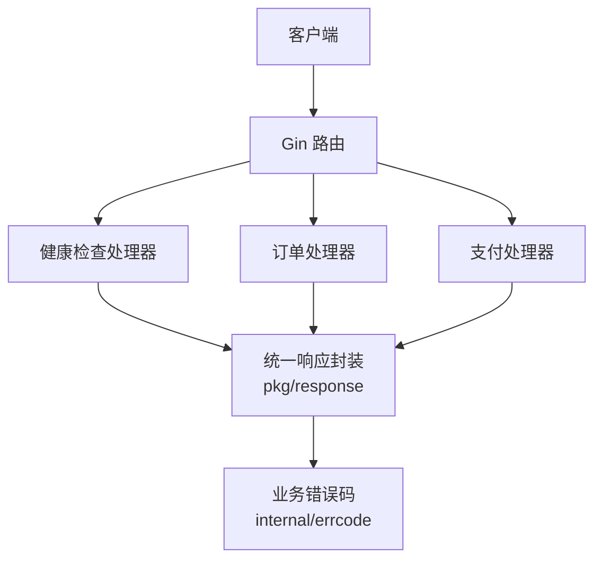
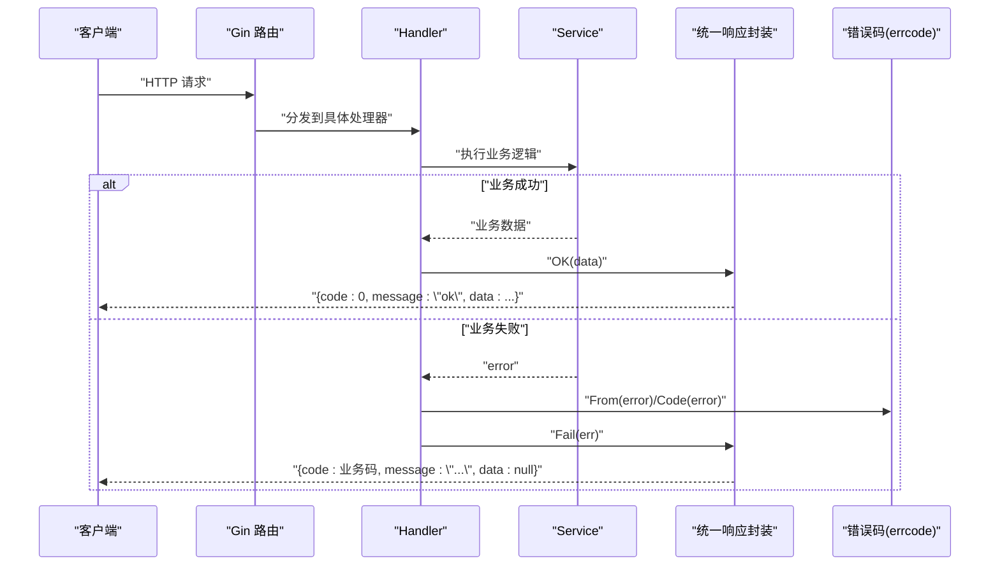
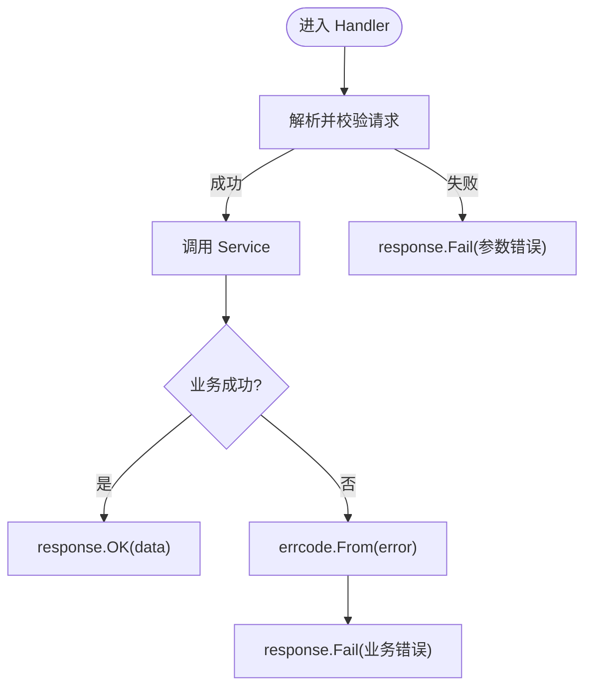
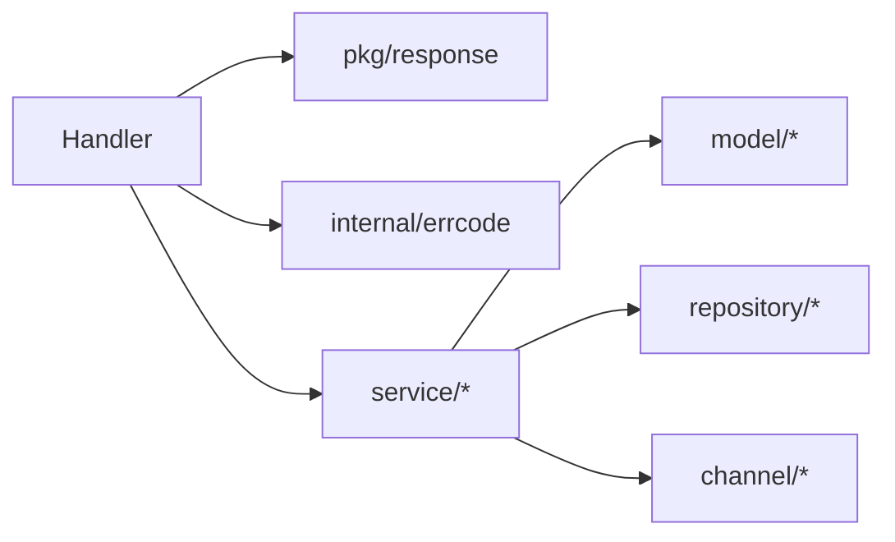

# 统一响应封装

<cite>
**本文引用的文件**
- [README.md](file://README.md)
- [internal/errcode/errcode.go](file://internal/errcode/errcode.go)
- [internal/handler/handler.go](file://internal/handler/handler.go)
- [internal/handler/health.go](file://internal/handler/health.go)
- [internal/handler/order_handler.go](file://internal/handler/order_handler.go)
- [internal/handler/payment_handler.go](file://internal/handler/payment_handler.go)
</cite>

## 目录
1. [引言](#引言)
2. [项目结构](#项目结构)
3. [核心组件](#核心组件)
4. [架构总览](#架构总览)
5. [详细组件分析](#详细组件分析)
6. [依赖关系分析](#依赖关系分析)
7. [性能与一致性考虑](#性能与一致性考虑)
8. [故障排查指南](#故障排查指南)
9. [结论](#结论)
10. [附录：API 响应示例与最佳实践](#附录api-响应示例与最佳实践)

## 引言
本文件聚焦于项目的“统一响应封装”设计，目标是帮助开发者在 Handler 层快速、一致地返回标准化 API 响应。文档将解释 Response 结构体的字段约定（code、message、data）、成功与错误响应的差异、构建器使用方式、与 Gin 的集成、分页响应的特殊处理，以及与全局错误处理和拦截器的配合机制。同时提供完整的 API 响应示例和最佳实践建议。

## 项目结构
本项目采用分层架构：HTTP 接入层（handler）负责请求解析、参数校验、调用 service 并统一封装响应；业务逻辑集中在 service 层；领域模型与状态机位于 model 层；通用工具与契约定义在 pkg 与 dto 中。统一响应封装由 pkg/response 提供，Handler 通过 response.OK / response.Fail / response.Created 等方法返回标准体。

图示来源
- [internal/handler/health.go:45-77](file://internal/handler/health.go#L45-L77)
- [internal/handler/order_handler.go:26-78](file://internal/handler/order_handler.go#L26-L78)
- [internal/handler/payment_handler.go:32-84](file://internal/handler/payment_handler.go#L32-L84)
- [internal/errcode/errcode.go:1-158](file://internal/errcode/errcode.go#L1-L158)

章节来源
- [README.md:38-62](file://README.md#L38-L62)

## 核心组件
- 统一响应体 Body：包含 code、message、data 三个标准字段，以及 request_id 等上下文信息。成功时 code=0，错误时 code 为 errcode 中的业务码。
- 错误码体系 errcode：集中定义业务错误码、HTTP 状态映射、错误包装方法（WithCause、WithMsg），并提供 From/Code 归一化能力。
- Handler 辅助函数：bindJSON、pathParam、amountParseError 等，用于参数绑定、路径参数校验与金额解析错误的对外提示转换。
- 响应构建器：response.OK、response.Fail、response.Created 等，供 Handler 直接调用以输出标准响应。

章节来源
- [internal/errcode/errcode.go:1-158](file://internal/errcode/errcode.go#L1-L158)
- [internal/handler/handler.go:29-155](file://internal/handler/handler.go#L29-L155)
- [internal/handler/health.go:45-77](file://internal/handler/health.go#L45-L77)
- [internal/handler/order_handler.go:26-78](file://internal/handler/order_handler.go#L26-L78)
- [internal/handler/payment_handler.go:32-84](file://internal/handler/payment_handler.go#L32-L84)

## 架构总览
统一响应封装贯穿 HTTP 接入层与错误码体系。Handler 层不直接拼接 JSON，而是通过 response 构建器输出标准体；错误路径通过 errcode 统一编码，并由响应封装决定 HTTP 状态码与 message。渠道回调接口是例外，不走统一响应体，遵循渠道规范应答。

图示来源
- [internal/handler/order_handler.go:26-78](file://internal/handler/order_handler.go#L26-L78)
- [internal/handler/payment_handler.go:32-84](file://internal/handler/payment_handler.go#L32-L84)
- [internal/errcode/errcode.go:136-158](file://internal/errcode/errcode.go#L136-L158)

## 详细组件分析

### Response 结构与字段约定
- code：整数型业务码。0 表示成功；非 0 表示失败，值来自 errcode 定义的错误码。
- message：人类可读的提示信息。成功时为简短文案；失败时为面向用户的错误说明，不应被客户端做字符串匹配。
- data：任意业务数据对象或数组。成功时承载业务结果；失败时通常为 null 或空对象。
- request_id：链路追踪标识，由中间件注入并在响应头与响应体回显，便于全链路日志关联。

注意：渠道回调接口不按统一响应体返回，而是按渠道规范返回 {"code":"SUCCESS"} 或 {"code":"FAIL"}，以避免渠道持续重试。

章节来源
- [README.md:77-83](file://README.md#L77-L83)

### 成功响应与错误响应
- 成功响应：使用 response.OK 或 response.Created（创建场景）。data 携带业务对象或 DTO。
- 错误响应：使用 response.Fail，传入 errcode 定义的 *Error。响应体包含 code、message，HTTP 状态码由 errcode 的 HTTPStatus 决定。
- 健康检查就绪失败：当无可用渠道时，直接返回 503 并附带统一响应体，code 取自 errcode.ErrChannelNotRegistered。

图示来源
- [internal/handler/handler.go:37-55](file://internal/handler/handler.go#L37-L55)
- [internal/handler/order_handler.go:26-78](file://internal/handler/order_handler.go#L26-L78)
- [internal/handler/payment_handler.go:32-84](file://internal/handler/payment_handler.go#L32-L84)
- [internal/errcode/errcode.go:136-158](file://internal/errcode/errcode.go#L136-L158)

章节来源
- [internal/handler/health.go:55-64](file://internal/handler/health.go#L55-L64)

### 响应构建器使用方法
- OK(c, data)：返回 200 与标准成功体。
- Created(c, data)：返回 201 与标准成功体，常用于资源创建。
- Fail(c, err)：根据 errcode 的 HTTPStatus 设置状态码，并返回标准错误体。
- 链式调用：Handler 中通常先 bindJSON，再 amountParseError 转换金额错误，最后 Fail/OK 返回，形成清晰的“解析 → 转换 → 返回”流程。

章节来源
- [internal/handler/order_handler.go:26-78](file://internal/handler/order_handler.go#L26-L78)
- [internal/handler/payment_handler.go:32-84](file://internal/handler/payment_handler.go#L32-L84)
- [internal/handler/handler.go:140-155](file://internal/handler/handler.go#L140-L155)

### 与 Gin 框架的集成
- Handler 接收 *gin.Context，并通过 response 包的方法直接写响应体。
- 中间件负责注入 request_id，Handler 无需关心其生成与回显。
- 路由注册与装配在 app 层完成，Handler 仅关注输入输出契约。

章节来源
- [internal/handler/health.go:45-77](file://internal/handler/health.go#L45-L77)
- [internal/handler/order_handler.go:26-78](file://internal/handler/order_handler.go#L26-L78)
- [internal/handler/payment_handler.go:32-84](file://internal/handler/payment_handler.go#L32-L84)

### 分页响应的特殊处理
当前代码库未实现分页查询接口，因此没有内置的分页响应结构（如 total、page、pageSize）。若未来扩展分页：
- 建议在 DTO 层新增分页响应结构，包含 total、page、pageSize 与 items 列表。
- 在 Service 层返回分页数据，Handler 将其转换为 DTO 后通过 response.OK 返回。
- 保持 code/message/data 的统一语义，data.items 为分页条目集合。

[本节为概念性说明，不涉及具体源码文件]

### 响应拦截器与全局错误处理的配合
- 错误归一化：errcode.From 将任意 error 归一为 *Error，非业务错误统一映射为内部错误码，并保留 cause 以便日志记录。
- Handler 层只处理 *Error，简化分支判断。
- 中间层（如 recovery、logger）可捕获 panic 与未预期异常，结合 errcode 输出统一错误体。
- 渠道回调例外：callback_handler.go 不走统一响应体，遵循渠道规范应答。

章节来源
- [internal/errcode/errcode.go:136-158](file://internal/errcode/errcode.go#L136-L158)
- [internal/handler/handler.go:1-10](file://internal/handler/handler.go#L1-L10)

## 依赖关系分析
- Handler 依赖 response 与 errcode：前者负责输出，后者负责错误码与 HTTP 状态映射。
- Service 不感知 HTTP 协议，仅返回业务数据或 error。
- 内存仓储与渠道抽象层对响应封装透明，不影响上层契约。

图示来源
- [internal/handler/order_handler.go:1-79](file://internal/handler/order_handler.go#L1-L79)
- [internal/handler/payment_handler.go:1-119](file://internal/handler/payment_handler.go#L1-L119)
- [internal/errcode/errcode.go:1-158](file://internal/errcode/errcode.go#L1-L158)

章节来源
- [internal/handler/order_handler.go:1-79](file://internal/handler/order_handler.go#L1-L79)
- [internal/handler/payment_handler.go:1-119](file://internal/handler/payment_handler.go#L1-L119)

## 性能与一致性考虑
- 避免在 Handler 中拼接 JSON，减少重复代码与不一致风险。
- 使用 errcode 统一错误码与 HTTP 状态映射，确保网关与监控能正确识别。
- 金额单位全程使用「分」存储，对外暴露元（字符串）与分（整数）双字段，避免精度问题。
- 内存仓储使用并发安全结构，返回副本，保证调用方快照语义。

章节来源
- [README.md:203-213](file://README.md#L203-L213)

## 故障排查指南
- 参数错误：bindJSON 区分空体、非法 JSON、类型不匹配与校验失败，分别映射到不同错误码，前端可给出更精确提示。
- 金额解析错误：amountParseError 将内部 money 包的错误翻译为面向用户的中文提示，避免泄露内部细节。
- 渠道不可用：就绪探针在无可用渠道时返回 503，并附带统一错误体，便于编排系统摘除流量。
- 回调幂等与金额校验：mock 回调会进行金额一致性校验，不一致则返回明确业务错误码，便于定位资金风险。

章节来源
- [internal/handler/handler.go:37-55](file://internal/handler/handler.go#L37-L55)
- [internal/handler/handler.go:140-155](file://internal/handler/handler.go#L140-L155)
- [internal/handler/health.go:55-64](file://internal/handler/health.go#L55-L64)
- [README.md:120-134](file://README.md#L120-L134)

## 结论
统一响应封装通过 response 构建器与 errcode 错误码体系，实现了 Handler 层的标准化输出与错误归一化。Handler 只需关注输入输出契约，无需关心 JSON 拼接与状态码映射细节。渠道回调作为唯一例外，遵循渠道规范应答。未来可扩展分页响应结构并保持现有语义一致。

## 附录：API 响应示例与最佳实践

### 标准响应体
- 成功：
  - code: 0
  - message: "ok"
  - data: 业务对象或数组
  - request_id: 链路追踪 ID（由中间件注入）
- 失败：
  - code: 业务错误码（来自 errcode）
  - message: 面向用户的错误说明
  - data: null 或空对象
  - request_id: 链路追踪 ID

章节来源
- [README.md:77-83](file://README.md#L77-L83)

### 常见接口示例
- 创建订单：POST /api/v1/orders
  - 成功：data 包含订单信息，status 为 CREATED
  - 失败：code 为 10001/10002/20003 等，message 描述原因
- 发起支付：POST /api/v1/payments/prepay
  - 成功：data 包含 trade_type 与 invoke_params（含 paySign）
- 模拟回调：POST /api/v1/mock/pay-success
  - 成功：data.paid=true，idempotent=false（首次）或 true（重复）
- 查单：GET /api/v1/payments/:out_trade_no
  - 成功：data.order_status=PAID，payments[0].status=SUCCESS

章节来源
- [README.md:85-116](file://README.md#L85-L116)

### 最佳实践
- 始终使用 response.OK / response.Fail / response.Created，不要手动构造 JSON。
- 错误一律通过 errcode 定义的错误码抛出，避免硬编码字符串。
- 客户端依据 code 做分支，不对 message 做字符串匹配。
- 金额对外提供元（字符串）与分（整数）双字段，避免客户端自行转换。
- 渠道回调接口不走统一响应体，严格遵循渠道规范应答。

章节来源
- [internal/errcode/errcode.go:1-158](file://internal/errcode/errcode.go#L1-L158)
- [README.md:136-160](file://README.md#L136-L160)