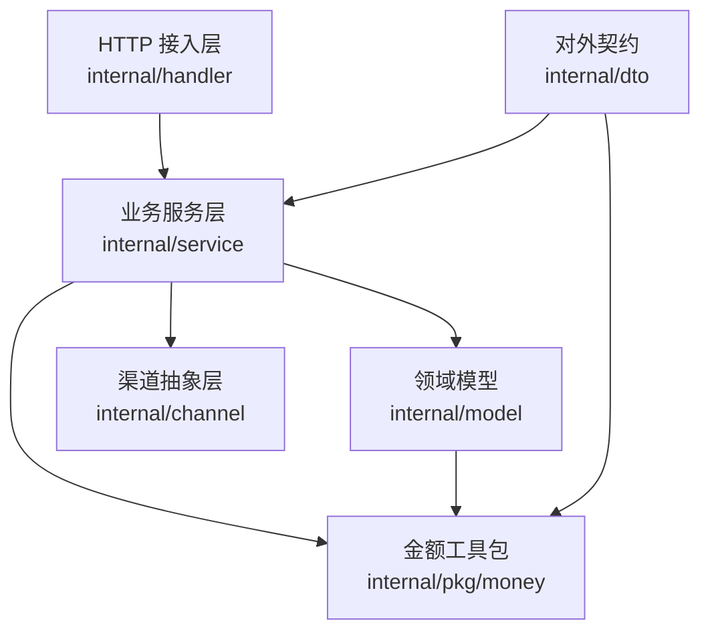
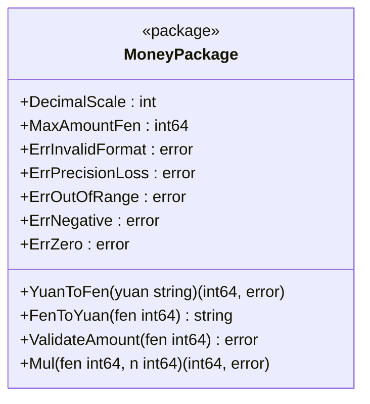
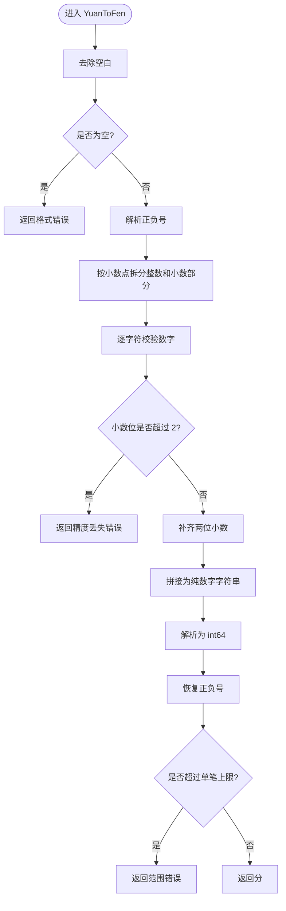
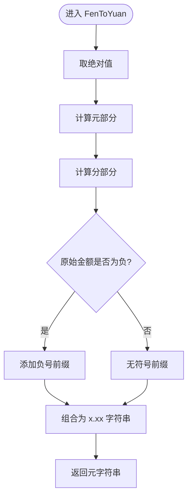
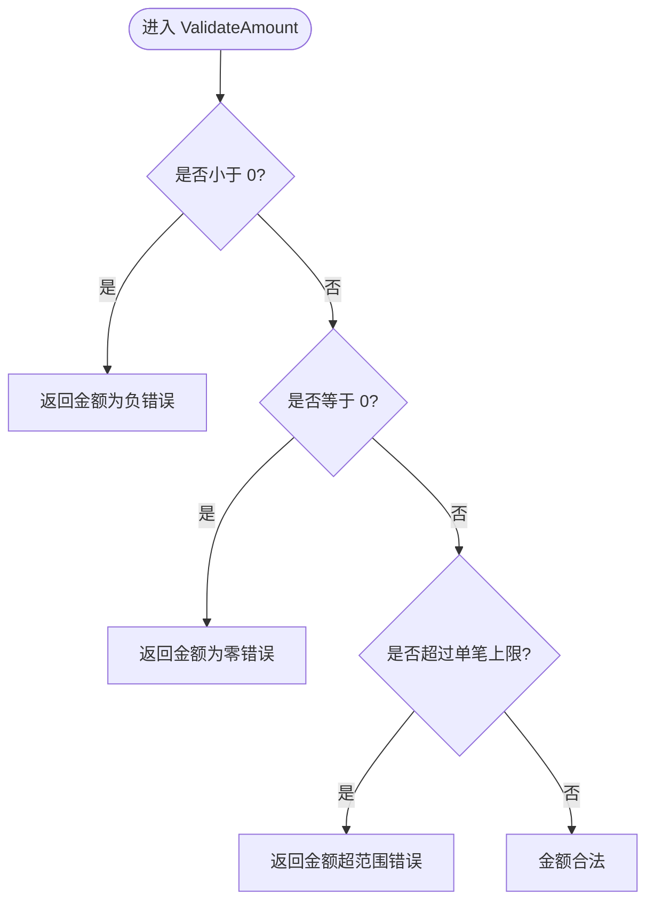
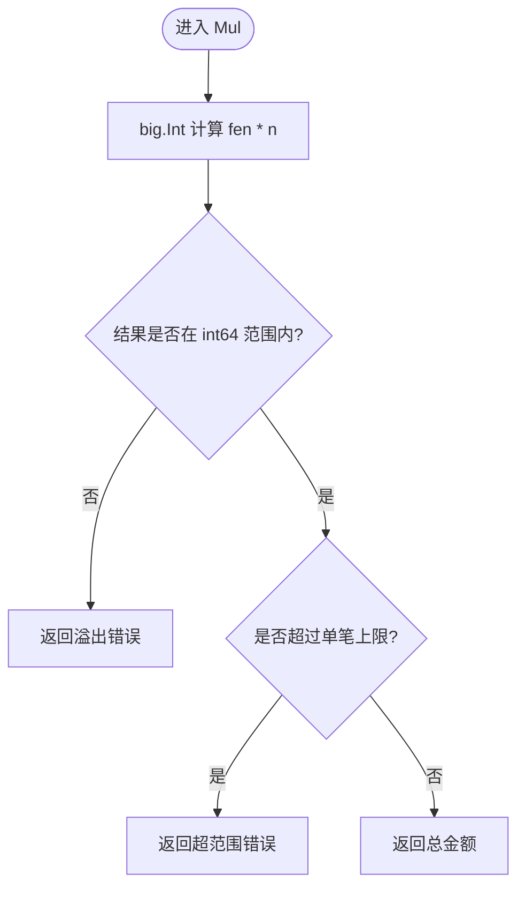
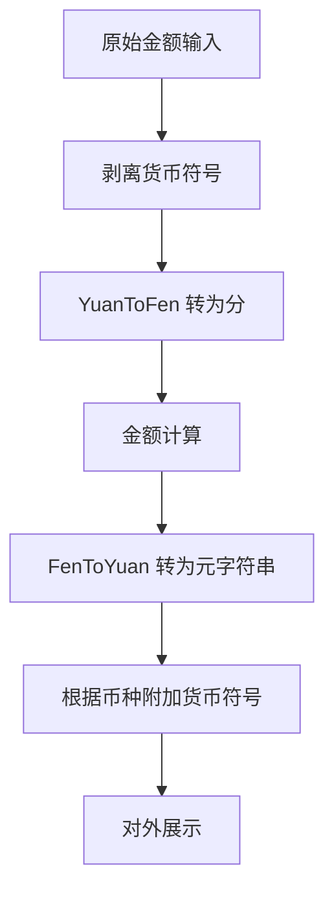
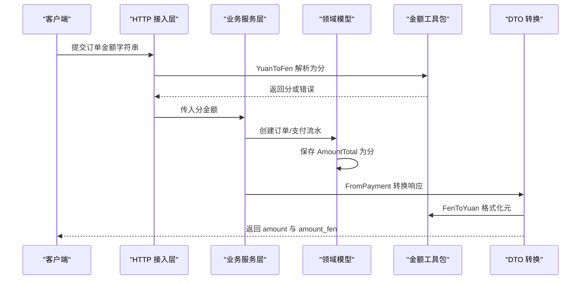
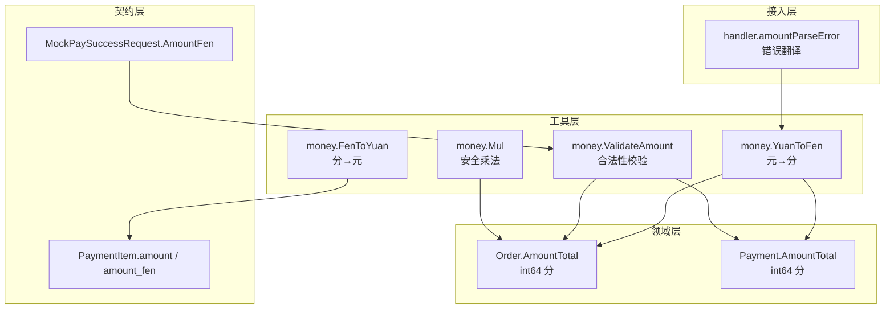

# 金额处理工具

<cite>
**本文引用的文件**   
- [internal/pkg/money/money.go](file://internal/pkg/money/money.go)
- [internal/dto/payment.go](file://internal/dto/payment.go)
- [internal/model/order.go](file://internal/model/order.go)
- [internal/model/payment.go](file://internal/model/payment.go)
- [internal/handler/handler.go](file://internal/handler/handler.go)
- [README.md](file://README.md)
</cite>

## 目录
1. [引言](#引言)
2. [项目结构与定位](#项目结构与定位)
3. [为什么必须用整数分而不是浮点元](#为什么必须用整数分而不是浮点元)
4. [Money 包核心设计](#money-包核心设计)
5. [元分转换与精度控制](#元分转换与精度控制)
6. [金额运算与安全边界](#金额运算与安全边界)
7. [货币符号与多币种支持](#货币符号与多币种支持)
8. [在支付链路中的使用方式](#在支付链路中的使用方式)
9. [常见陷阱与最佳实践](#常见陷阱与最佳实践)
10. [架构总览图](#架构总览图)
11. [故障排查指南](#故障排查指南)
12. [结论](#结论)

## 引言
本文围绕支付系统中的金额处理工具展开，目标是帮助开发者理解：
- 为什么支付系统必须使用「整数分」而非「浮点元」进行金额计算；
- `money` 包如何保证金额解析、格式化、比较和运算的确定性；
- 如何在订单、支付流水、DTO 与 HTTP 层之间安全传递金额；
- 如何处理负数、零值、超大金额、精度超限等边界情况；
- 当前实现中货币符号和多币种支持的现状与扩展建议。

## 项目结构与定位
本项目是一个 Go + Gin 的支付服务骨架，采用分层结构：HTTP 接入层、业务服务层、领域模型层、渠道抽象层、仓储层以及通用工具包。金额处理工具位于通用工具包 `internal/pkg/money`，被 DTO、模型、处理器等多个层引用，是资金相关逻辑的公共基础设施。

**图表来源**
- [internal/handler/handler.go:1-24](file://internal/handler/handler.go#L1-L24)
- [internal/dto/payment.go:1-7](file://internal/dto/payment.go#L1-L7)
- [internal/model/order.go:1-15](file://internal/model/order.go#L1-L15)
- [internal/pkg/money/money.go:1-15](file://internal/pkg/money/money.go#L1-L15)

**章节来源**
- [README.md:38-62](file://README.md#L38-L62)
- [internal/pkg/money/money.go:1-15](file://internal/pkg/money/money.go#L1-L15)

## 为什么必须用整数分而不是浮点元
二进制浮点数无法精确表示大多数十进制小数。例如，常见的价格 `19.99` 在浮点运算中可能变成类似 `19.989999999999998` 的值，再乘以 `100` 后截断或取整时就会少收一分钱。支付系统中「差一分钱」不是展示误差，而是真实的资金差异，因此不能依赖 `float64` 做金额计算。

`money` 包的注释明确强调：项目内所有金额一律使用 `int64` 表示「分」，严禁让 `float64` 参与金额运算；元分转换全程基于字符串与整数运算，不经过任何浮点类型。

**章节来源**
- [internal/pkg/money/money.go:1-7](file://internal/pkg/money/money.go#L1-L7)
- [README.md:203-205](file://README.md#L203-L205)

## Money 包核心设计
`money` 包提供的是面向支付的金额基础能力，核心包括：
- 以 `int64` 存储最小货币单位「分」；
- 定义人民币默认小数位数；
- 定义单笔金额上限；
- 提供元到分的解析、分到元的格式化；
- 提供金额合法性校验；
- 提供安全的乘法运算；
- 暴露明确的错误类型，便于上层统一翻译为业务错误。

**图表来源**
- [internal/pkg/money/money.go:17-37](file://internal/pkg/money/money.go#L17-L37)
- [internal/pkg/money/money.go:39-151](file://internal/pkg/money/money.go#L39-L151)

### 内部存储为什么是 int64
- **确定性**：`int64` 是精确整数类型，不会像浮点数那样出现二进制近似误差。
- **最小单位**：以「分」为单位可以避免小数位带来的舍入歧义。
- **范围足够**：单笔金额上限设为 1 亿元（即 100 亿分），远大于日常交易，同时避免 `int64` 溢出后金额变成负数。
- **可序列化**：JSON 中可以直接输出整数，数据库中也适合用整型字段存储。

**章节来源**
- [internal/pkg/money/money.go:17-24](file://internal/pkg/money/money.go#L17-L24)
- [internal/model/order.go:73-84](file://internal/model/order.go#L73-L84)
- [internal/model/payment.go:70-75](file://internal/model/payment.go#L70-L75)

## 元分转换与精度控制
### YuanToFen：从元字符串解析成分
`YuanToFen` 接受形如 `"19.99"`、`"19.9"`、`"20"`、`"-3.5"` 的字符串，返回对应的「分」。它的关键行为如下：
1. 去除首尾空白；
2. 处理可选的正负号；
3. 按小数点拆分整数部分和小数部分；
4. 逐字符校验数字，不接受千分位分隔符、货币符号或其他非法字符；
5. 小数位超过两位时直接拒绝，不做四舍五入；
6. 补齐两位小数后拼接成纯数字字符串；
7. 使用 `strconv.ParseInt` 解析为 `int64`；
8. 恢复符号；
9. 检查是否超出单笔金额上限。

**图表来源**
- [internal/pkg/money/money.go:39-105](file://internal/pkg/money/money.go#L39-L105)

### FenToYuan：从分格式化为元字符串
`FenToYuan` 把 `int64` 分转换为保留两位小数的元字符串。它不使用浮点除法，而是通过 `math/big.Int` 完成绝对值、商和余数计算，从而避免中间步骤重新引入浮点精度问题。

关键点：
- 使用 `big.Int.Abs` 处理负数边界，避免对 `math.MinInt64` 直接取负导致溢出；
- 使用 `big.Int.Quo` 得到元部分；
- 使用 `big.Int.Rem` 得到分部分；
- 最终用字符串格式化输出，始终保留两位小数；
- 返回值是字符串，而不是 `float64`。

**图表来源**
- [internal/pkg/money/money.go:108-122](file://internal/pkg/money/money.go#L108-L122)

### 精度校验策略
当前实现采取「严格拒绝」策略：
- 小数位超过两位直接返回 `ErrPrecisionLoss`；
- 不静默截断，也不四舍五入；
- 原因是支付场景下任何静默的金额修正都是事故源头。

这与 README 中「最多两位小数」的约束一致，也与业务侧对金额精度的高要求匹配。

**章节来源**
- [internal/pkg/money/money.go:26-37](file://internal/pkg/money/money.go#L26-L37)
- [internal/pkg/money/money.go:44-105](file://internal/pkg/money/money.go#L44-L105)
- [internal/pkg/money/money.go:108-122](file://internal/pkg/money/money.go#L108-L122)
- [README.md:126-129](file://README.md#L126-L129)

## 金额运算与安全边界
### ValidateAmount：支付金额合法性校验
`ValidateAmount` 用于判断一个「分」金额是否可以作为可支付金额：
- 不允许负数；
- 不允许零；
- 不允许超过单笔上限。

这个函数适合用在创建订单、发起支付、回调金额校验等关键路径上。

**图表来源**
- [internal/pkg/money/money.go:124-136](file://internal/pkg/money/money.go#L124-L136)

### Mul：安全的数量乘单价
`Mul` 专门用于「数量 × 单价」这类场景。直接使用 `fen * n` 在极端值下可能静默溢出，因此该函数使用 `math/big.Int.Mul` 计算结果，并检查：
- 结果是否能放入 `int64`；
- 结果是否超过单笔金额上限。

这保证了即使输入来自外部或用户可控参数，也不会产生不可预期的负金额或溢出金额。

**图表来源**
- [internal/pkg/money/money.go:138-151](file://internal/pkg/money/money.go#L138-L151)

### 四舍五入与精度控制
当前 `money` 包没有提供通用的四舍五入函数。这是因为：
- 支付系统不应随意改变金额；
- 如果确实需要四舍五入，应在明确业务规则的前提下单独实现，并记录审计日志；
- 当前设计更倾向于「拒绝不合法精度」，而不是「自动修正金额」。

**章节来源**
- [internal/pkg/money/money.go:124-151](file://internal/pkg/money/money.go#L124-L151)

## 货币符号与多币种支持
### 当前实现现状
- `DefaultCurrency` 定义为 `CNY`，对应微信支付境内商户常用币种；
- `Order.Currency` 字段存在，但当前构造订单时固定使用默认币种；
- `money` 包目前没有货币符号处理逻辑，也没有多币种换算逻辑；
- `FenToYuan` 只负责数值格式化，不附加货币符号；
- `YuanToFen` 不接受货币符号，也不接受千分位分隔符。

这意味着当前实现是「单币种、无符号、纯数值」的设计。

### 货币符号处理建议
如果需要支持货币符号，应遵循以下原则：
1. 货币符号只出现在展示层或协议层，不参与金额计算；
2. 解析货币符号时应先剥离符号，再交给 `YuanToFen`；
3. 格式化货币符号时应先调用 `FenToYuan`，再根据币种追加符号；
4. 不同币种的符号位置不同，例如 `¥19.99` 与 `$19.99`；
5. 货币符号不能影响金额大小比较和加减乘除。

### 多币种支持建议
如果要扩展多币种，建议：
1. 将币种信息放在领域模型或 DTO 中，而不是混入金额数值；
2. 不同币种的最小单位可能不同，例如日元通常没有分；
3. 汇率换算必须在明确舍入规则后进行，并记录汇率来源和时间；
4. 不要直接用浮点汇率乘以金额，应使用整数运算或高精度库；
5. 对账时必须区分「下单币种」和「结算币种」。

[本图为概念性流程，不对应具体源码实现]

**章节来源**
- [internal/model/order.go:17-18](file://internal/model/order.go#L17-L18)
- [internal/model/order.go:73-84](file://internal/model/order.go#L73-L84)
- [internal/pkg/money/money.go:39-44](file://internal/pkg/money/money.go#L39-L44)
- [internal/pkg/money/money.go:108-122](file://internal/pkg/money/money.go#L108-L122)

## 在支付链路中的使用方式
### DTO 层同时暴露元和分
DTO 中的支付项同时包含：
- `amount`：元字符串，供前端展示；
- `amount_fen`：分整数，供后端计算和校验。

这样做的好处是：
- 前端展示用人类可读的元；
- 后端比较、对账、传给渠道时用精确的分；
- 避免调用方自行做元分转换，减少精度风险。

**图表来源**
- [internal/dto/payment.go:60-98](file://internal/dto/payment.go#L60-L98)
- [internal/model/order.go:73-84](file://internal/model/order.go#L73-L84)
- [internal/model/payment.go:70-75](file://internal/model/payment.go#L70-L75)
- [internal/pkg/money/money.go:39-122](file://internal/pkg/money/money.go#L39-L122)

### 处理器层的金额错误翻译
`handler` 层会把 `money` 包的底层错误翻译成面向客户端的错误码和提示：
- 精度超限 → 金额最多保留两位小数；
- 格式非法 → 金额格式非法；
- 范围超限 → 金额超出允许范围；
- 其他错误 → 携带原始错误的业务错误。

这样既保留了开发调试信息，又避免了向客户端暴露内部包名。

**章节来源**
- [internal/dto/payment.go:60-98](file://internal/dto/payment.go#L60-L98)
- [internal/handler/handler.go:140-155](file://internal/handler/handler.go#L140-L155)

## 常见陷阱与最佳实践
### 必须避免的陷阱
1. **不要用 float64 存金额**  
   二进制浮点无法精确表示十进制小数，容易导致少收或多收。
2. **不要直接比较浮点金额**  
   即使两个浮点看起来相等，也可能因为精度误差导致比较失败。
3. **不要静默截断或四舍五入金额**  
   支付场景中静默修正金额是资金事故的主要来源。
4. **不要把货币符号混入金额数值**  
   符号属于展示或协议层，不应参与计算。
5. **不要忽略负数和零值**  
   负数金额传给渠道会产生不可预期行为；零金额通常不是有效支付。
6. **不要假设 int64 乘法不会溢出**  
   数量乘以单价可能超出 `int64` 或单笔上限。
7. **不要对 message 做字符串匹配**  
   README 明确指出客户端应依据业务码分支，而不是匹配消息文本。

### 推荐的最佳实践
1. **统一使用 int64 分**  
   所有内部金额、数据库金额、渠道金额都使用分。
2. **只在边界做元分转换**  
   解析入口用 `YuanToFen`，展示出口用 `FenToYuan`。
3. **显式校验金额合法性**  
   使用 `ValidateAmount` 校验支付金额。
4. **使用 Mul 做数量乘单价**  
   避免直接相乘导致的溢出风险。
5. **DTO 同时返回元和分**  
   前端展示用元，后端计算用分。
6. **币种与金额分离**  
   币种放在领域模型或 DTO，不参与金额数值。
7. **错误分类清晰**  
   格式错误、精度错误、范围错误、负数错误、零值错误分别处理。

**章节来源**
- [internal/pkg/money/money.go:1-7](file://internal/pkg/money/money.go#L1-L7)
- [internal/pkg/money/money.go:26-37](file://internal/pkg/money/money.go#L26-L37)
- [internal/pkg/money/money.go:124-151](file://internal/pkg/money/money.go#L124-L151)
- [README.md:136-160](file://README.md#L136-L160)

## 架构总览图
下图展示金额在支付链路中的流转关系，重点体现 `money` 包如何连接 DTO、模型和处理器。

**图表来源**
- [internal/handler/handler.go:140-155](file://internal/handler/handler.go#L140-L155)
- [internal/pkg/money/money.go:39-151](file://internal/pkg/money/money.go#L39-L151)
- [internal/model/order.go:73-84](file://internal/model/order.go#L73-L84)
- [internal/model/payment.go:70-75](file://internal/model/payment.go#L70-L75)
- [internal/dto/payment.go:60-98](file://internal/dto/payment.go#L60-L98)
- [internal/dto/payment.go:114-131](file://internal/dto/payment.go#L114-L131)

## 故障排查指南
### 金额格式非法
常见原因：
- 传入了空字符串；
- 传入了货币符号；
- 传入了千分位分隔符；
- 传入了多个小数点；
- 传入了非数字字符。

排查建议：
- 检查上游是否直接把显示用的金额字符串传给服务端；
- 确认是否误传了带 `¥`、`$`、`,` 的金额；
- 查看 `handler.amountParseError` 返回的错误信息。

**章节来源**
- [internal/pkg/money/money.go:44-86](file://internal/pkg/money/money.go#L44-L86)
- [internal/handler/handler.go:140-155](file://internal/handler/handler.go#L140-L155)

### 金额小数位超过两位
常见原因：
- 前端或上游系统传入了三位及以上小数；
- 汇率换算后未做明确舍入；
- 折扣计算产生了多余小数位。

排查建议：
- 确认业务是否允许四舍五入；
- 如果不允许，应拒绝请求并提示用户调整金额；
- 如果允许，应在业务层显式实现舍入规则并记录审计日志。

**章节来源**
- [internal/pkg/money/money.go:84-86](file://internal/pkg/money/money.go#L84-L86)
- [README.md:126-129](file://README.md#L126-L129)

### 金额超出允许范围
常见原因：
- 单笔金额超过 1 亿元；
- 数量乘以单价后溢出或超限；
- 上游传入了异常大的金额。

排查建议：
- 检查订单金额是否合理；
- 检查商品数量和单价是否被篡改；
- 使用 `Mul` 替代直接乘法；
- 使用 `ValidateAmount` 校验支付金额。

**章节来源**
- [internal/pkg/money/money.go:20-24](file://internal/pkg/money/money.go#L20-L24)
- [internal/pkg/money/money.go:102-105](file://internal/pkg/money/money.go#L102-L105)
- [internal/pkg/money/money.go:141-151](file://internal/pkg/money/money.go#L141-L151)

### 金额为负数或零
常见原因：
- 退款场景误用了普通支付金额校验；
- 优惠券抵扣后金额变为零；
- 上游传入了负数金额。

排查建议：
- 支付成功回调和普通支付金额应使用 `ValidateAmount`；
- 退款金额应有独立校验逻辑；
- 零金额订单需明确业务含义，不能当作正常支付。

**章节来源**
- [internal/pkg/money/money.go:124-136](file://internal/pkg/money/money.go#L124-L136)

## 结论
`money` 包的核心价值在于：把金额从「容易出错的浮点元」收敛为「确定性的整数分」，并通过严格的解析、格式化、校验和安全运算，降低支付系统的资金风险。当前实现聚焦于人民币场景下的元分转换与基础校验，尚未内置货币符号和多币种换算。未来扩展时应坚持「符号与币种不参与计算」「精度不静默修正」「错误显式表达」三大原则，确保金额处理在任何业务分支中都保持可预测、可审计、可追溯。