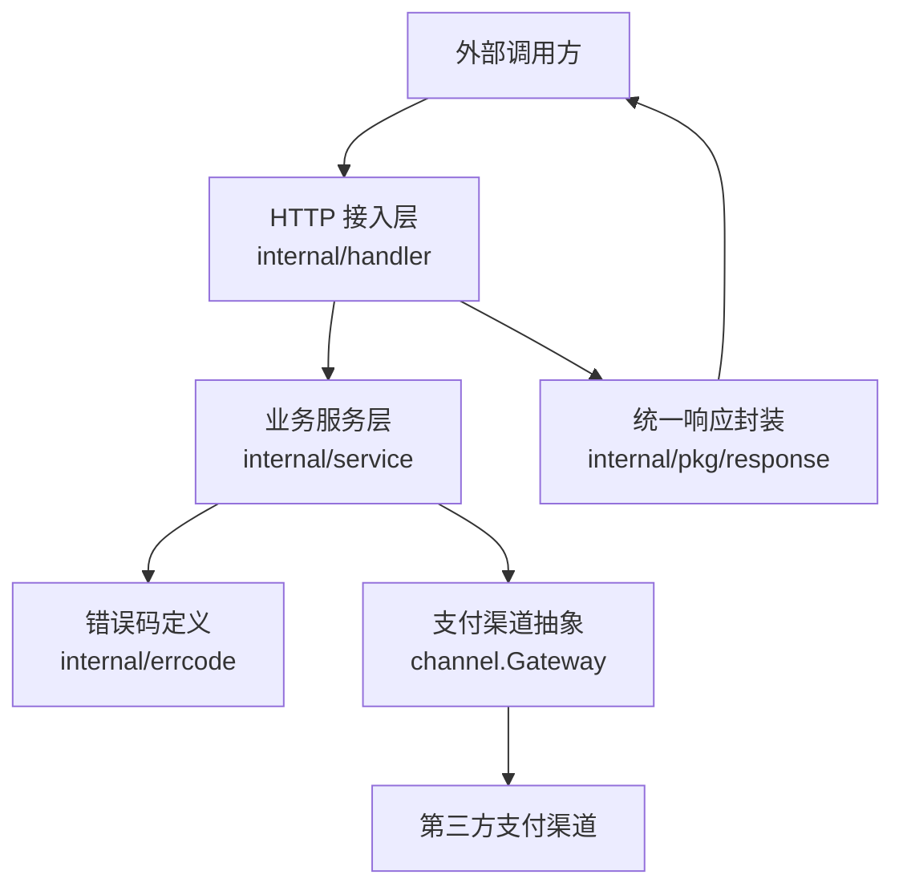
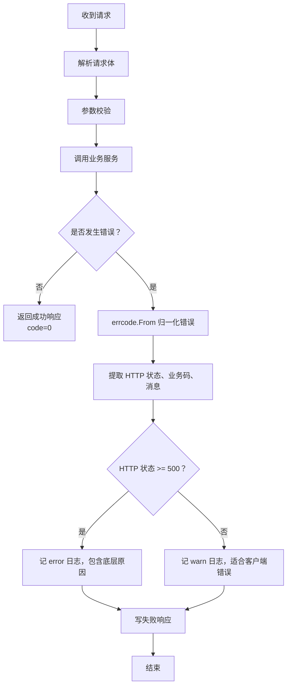
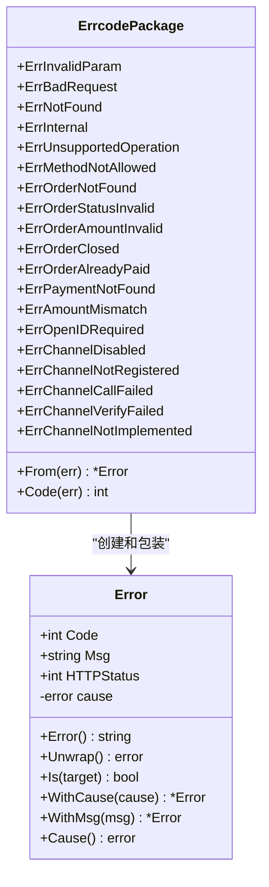
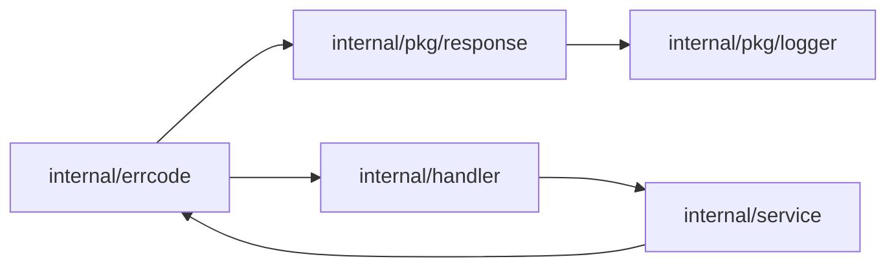

# 错误码管理

<cite>
**本文引用的文件**   
- [errcode.go](file://internal/errcode/errcode.go)
- [response.go](file://internal/pkg/response/response.go)
- [handler.go](file://internal/handler/handler.go)
- [callback_handler.go](file://internal/handler/callback_handler.go)
- [payment_service.go](file://internal/service/payment_service.go)
- [README.md](file://README.md)
</cite>

## 目录
1. [引言](#引言)
2. [项目结构与错误码定位](#项目结构与错误码定位)
3. [错误码分层设计](#错误码分层设计)
4. [命名规范与数字范围分配规则](#命名规范与数字范围分配规则)
5. [HTTP 状态码与业务错误码映射](#http-状态码与业务错误码映射)
6. [错误类型判断与响应选择流程](#错误类型判断与响应选择流程)
7. [错误信息、国际化与多语言支持现状](#错误信息国际化与多语言支持现状)
8. [错误码注册、查询与动态加载机制](#错误码注册查询与动态加载机制)
9. [版本管理与向后兼容性](#版本管理与向后兼容性)
10. [定义示例、使用方式与调试技巧](#定义示例使用方式与调试技巧)
11. [扩展新错误类别与迁移现有错误码](#扩展新错误类别与迁移现有错误码)
12. [依赖关系分析](#依赖关系分析)
13. [性能与可观测性考虑](#性能与可观测性考虑)
14. [故障排查指南](#故障排查指南)
15. [结论](#结论)

## 引言
本文件围绕支付服务的错误码管理体系展开，重点解释：
- 错误码的分层分类：系统级通用错误、订单相关错误、支付相关错误、第三方渠道相关错误。
- 错误码的命名规范、数字范围划分以及 HTTP 状态码映射原则。
- 统一响应封装如何把业务错误转换为对外 JSON 和 HTTP 状态。
- 当前错误信息的本地化能力边界，以及如何在不破坏客户端的前提下演进。
- 错误码的注册、查询、包装、降级与调试实践。
- 新增错误类别、迁移旧错误码时的兼容策略。

该体系的核心目标是：**让调用方通过稳定的 `code` 做分支，而不是匹配人类可读的 `message`；同时让运维和研发通过日志中的底层原因快速定位问题。**

## 项目结构与错误码定位
错误码相关代码集中在以下位置：
- `internal/errcode/errcode.go`：定义业务错误类型、错误码常量、HTTP 状态绑定、错误归一化工具。
- `internal/pkg/response/response.go`：统一 HTTP 响应体结构，负责把业务错误转换为标准 JSON 并写入对应 HTTP 状态。
- `internal/handler/*`：接入层在解析请求、校验参数、调用服务后，统一通过 `response.Fail` / `response.OK` 返回结果。
- `internal/service/payment_service.go`：业务层抛出领域错误，并通过 `WithMsg` 补充上下文。
- `README.md`：公开的错误码清单与契约说明。

**图表来源**
- [errcode.go:1-12](file://internal/errcode/errcode.go#L1-L12)
- [response.go:1-13](file://internal/pkg/response/response.go#L1-L13)
- [handler.go:1-10](file://internal/handler/handler.go#L1-L10)

**章节来源**
- [errcode.go:1-12](file://internal/errcode/errcode.go#L1-L12)
- [response.go:1-13](file://internal/pkg/response/response.go#L1-L13)
- [handler.go:1-10](file://internal/handler/handler.go#L1-L10)

## 错误码分层设计
当前项目的错误码采用“按业务域分段”的分层方式，而不是按“系统/业务/第三方”三类严格隔离。其核心思想是：**用前缀区分领域，用 HTTP 状态区分严重级别，用 `cause` 保留底层实现细节。**

| 层级 | 数字范围 | 含义 | 典型场景 |
|---|---|---|---|
| 成功 | `0` | 业务成功 | 接口正常返回 |
| 通用错误 | `10xxx` | 参数、协议、资源、权限、方法等通用问题 | 参数非法、JSON 无法解析、资源不存在、内部错误 |
| 订单相关 | `20xxx` | 订单生命周期与金额校验 | 订单不存在、订单已关闭、重复支付、金额不合法 |
| 支付相关 | `30xxx` | 支付流水、回调一致性、渠道配置 | 支付记录不存在、金额不一致、缺少 openid、渠道未启用 |
| 支付渠道相关 | `40xxx` | 第三方渠道集成问题 | 渠道未注册、渠道调用失败、验签失败、功能未实现 |

这种设计便于：
- 客户端按前缀做粗粒度分支（例如 `10xxx` 直接提示用户或重试）。
- 服务端按具体错误码做细粒度处理（例如 `30002` 触发资金安全告警）。
- 网关和监控系统按 HTTP 状态码做重试、熔断、限流决策。

**章节来源**
- [errcode.go:3-11](file://internal/errcode/errcode.go#L3-L11)
- [errcode.go:78-134](file://internal/errcode/errcode.go#L78-L134)
- [README.md:136-158](file://README.md#L136-L158)

## 命名规范与数字范围分配规则
### 变量命名规范
- 错误变量以 `Err` 开头，语义清晰，如 `ErrInvalidParam`、`ErrOrderNotFound`、`ErrPaymentNotFound`、`ErrChannelCallFailed`。
- 每个错误变量都是包级共享常量，避免每次报错都新建对象导致内存抖动。
- 错误变量注释说明业务含义，并在 README 中维护对外契约。

### 数字范围规则
- `0`：成功。
- `10001-10006`：通用错误。
- `20001-20005`：订单相关。
- `30001-30004`：支付相关。
- `40001-40004`：支付渠道相关。

### 新增错误码约束
- 不得复用已有错误码。
- 必须明确绑定一个合理的 HTTP 状态码。
- 必须提供面向用户的稳定文案，但允许运行时用 `WithMsg` 补充上下文。
- 若属于第三方渠道异常，应优先放在 `40xxx`，除非语义更接近业务层。

**章节来源**
- [errcode.go:78-134](file://internal/errcode/errcode.go#L78-L134)
- [README.md:136-158](file://README.md#L136-L158)

## HTTP 状态码与业务错误码映射
项目要求：**HTTP 状态码和业务 `code` 同时存在，二者不可互相替代。**

| 业务错误码 | HTTP 状态 | 语义 | 客户端建议 |
|---|---:|---|---|
| `10001` | 400 | 请求参数不合法 | 提示用户修正输入 |
| `10002` | 400 | 请求无法解析 | 检查序列化、字段类型 |
| `10003` | 404 | 资源不存在 | 检查路径或资源 ID |
| `10004` | 500 | 服务内部错误 | 客户端不应重试，记录 request_id |
| `10005` | 403 | 当前环境不支持 | 检查部署模式或权限 |
| `10006` | 405 | 请求方法不被允许 | 检查 HTTP 方法 |
| `20001` | 404 | 订单不存在 | 检查订单号 |
| `20002` | 409 | 订单状态不允许操作 | 提示订单状态冲突 |
| `20003` | 400 | 订单金额不合法 | 提示金额格式或精度 |
| `20004` | 409 | 订单已关闭 | 引导重新下单 |
| `20005` | 409 | 订单已支付 | 幂等处理，不重复扣款 |
| `30001` | 404 | 支付记录不存在 | 检查支付单号 |
| `30002` | 400 | 支付金额与订单金额不一致 | 人工介入，资金安全事件 |
| `30003` | 400 | 缺少 openid | 补充支付者身份 |
| `30004` | 400 | 支付渠道未启用 | 检查配置 |
| `40001` | 500 | 支付渠道未注册 | 检查渠道装配 |
| `40002` | 502 | 支付渠道调用失败 | 可短暂重试，关注下游健康 |
| `40003` | 400 | 支付回调验签或解密失败 | 安全事件，人工核查 |
| `40004` | 501 | 渠道功能未实现 | 开发阶段占位错误 |

### 映射原则
- **4xx**：通常表示客户端或上游输入有问题，不建议自动重试。
- **5xx**：通常表示服务端或第三方依赖异常，可按策略重试或进入熔断。
- **业务 `code`**：用于客户端精细化分支，例如“订单已支付”“金额不一致”“渠道未启用”。

**章节来源**
- [errcode.go:78-134](file://internal/errcode/errcode.go#L78-L134)
- [README.md:136-158](file://README.md#L136-L158)

## 错误类型判断与响应选择流程
### 统一响应封装
`pkg/response` 提供统一的响应体结构：
- `code`：业务错误码，成功为 `0`。
- `message`：人类可读消息。
- `data`：可选数据。
- `request_id`：全链路追踪 ID。

**图表来源**
- [response.go:85-106](file://internal/pkg/response/response.go#L85-L106)
- [errcode.go:136-149](file://internal/errcode/errcode.go#L136-L149)

### 关键行为
- `response.Fail` 会调用 `errcode.From`，把任意 `error` 归一化为 `*errcode.Error`。
- 非业务错误会被包装成 `ErrInternal`，并把原始错误挂到 `cause` 上。
- 5xx 错误记 error 日志，4xx 错误记 warn 日志，避免客户端错误淹没真实故障。
- 渠道回调接口不走统一响应体，而是按渠道规范返回 `SUCCESS` / `FAIL`。

**章节来源**
- [response.go:35-41](file://internal/pkg/response/response.go#L35-L41)
- [response.go:85-106](file://internal/pkg/response/response.go#L85-L106)
- [callback_handler.go:51-86](file://internal/handler/callback_handler.go#L51-L86)

## 错误信息、国际化与多语言支持现状
### 当前实现
- 所有错误消息以中文硬编码在 `internal/errcode/errcode.go` 中。
- 部分错误会通过 `WithMsg` 替换为带上下文的中文消息，例如金额不一致时带上两边金额。
- 没有引入 i18n 库、语言包文件或运行时语言切换逻辑。

### 对客户端的影响
- 文档明确要求：**客户端只根据 `code` 做分支，不要对 `message` 做字符串匹配**。
- 这意味着即使未来增加多语言支持，只要 `code` 不变，客户端就不需要因消息文案变化而升级。

### 推荐的多语言演进方案
- 将预设消息迁移到独立的消息字典，键名使用错误码或稳定英文 key。
- 在 `errcode.Error` 中保留默认英文或中性描述，由上层根据请求头或租户配置注入本地化消息。
- 对敏感错误（如内部错误）仍保持对外隐藏细节，仅日志输出底层原因。
- 对渠道回调错误，优先保证渠道要求的固定响应格式，再在业务日志中记录本地化信息。

**章节来源**
- [errcode.go:20-30](file://internal/errcode/errcode.go#L20-L30)
- [errcode.go:68-73](file://internal/errcode/errcode.go#L68-L73)
- [README.md:160](file://README.md#L160)

## 错误码注册、查询与动态加载机制
### 错误码注册
当前错误码采用**包级变量 + 编译期初始化**的方式注册，不是运行时注册表。优点是实现简单、性能高；缺点是新增错误码必须修改源码并重新编译。

**图表来源**
- [errcode.go:20-76](file://internal/errcode/errcode.go#L20-L76)
- [errcode.go:78-157](file://internal/errcode/errcode.go#L78-L157)

### 查询与归一化
- `errcode.From(err)`：把任意错误归一化为 `*errcode.Error`。
- `errcode.Code(err)`：从任意错误中提取业务码，无业务码时返回 `0`。
- `errors.Is` 与 `errors.As` 可通过自定义 `Is` 和 `Unwrap` 穿透包装后的错误。

### 动态加载
当前错误码不支持运行时动态加载。若未来需要：
- 可从配置中心或数据库加载错误码元数据。
- 在启动时构建错误码映射表。
- 保留编译期默认值作为兜底。
- 对已发布 API 禁止删除或重编号已有错误码。

**章节来源**
- [errcode.go:136-157](file://internal/errcode/errcode.go#L136-L157)

## 版本管理与向后兼容性
### 当前版本策略
- 错误码以数字形式暴露，且 README 中维护对外契约。
- 文档强调客户端不应匹配 `message`，这为后续本地化、文案优化提供了兼容空间。
- 当前没有显式的错误码版本号字段，但可以通过 API 路由版本（如 `/api/v1/...`）间接控制变更节奏。

### 向后兼容性保证
- 已发布的错误码不得改变含义。
- 不得复用其他错误码。
- 新增错误码应放在未使用的数字区间。
- 若必须废弃某个错误码，应保留旧码并在新码下同时返回，逐步过渡。
- 若必须改变 HTTP 状态映射，应评估网关、监控、重试策略影响，并提前公告。

### 建议的版本化增强
- 在统一响应体中增加可选的 `version` 字段，标识错误码契约版本。
- 对重大错误码变更提供迁移期双写。
- 在网关层对未知错误码进行拦截和告警。

**章节来源**
- [README.md:77-83](file://README.md#L77-L83)
- [README.md:136-160](file://README.md#L136-L160)

## 定义示例、使用方式与调试技巧
### 定义错误
- 使用 `newError(code, httpStatus, msg)` 创建错误实例。
- 将常用错误定义为包级变量，便于全局复用。
- 对需要携带底层错误的场景，使用 `WithCause`。
- 对需要补充上下文的场景，使用 `WithMsg`。

### 抛出错误
- 领域层或服务层直接返回 `errcode.*` 错误。
- 第三方 SDK 或数据库错误通过 `errcode.From` 转为 `ErrInternal`。
- 对资金安全类错误（如金额不一致、验签失败），在 handler 层单独记录 error 日志。

### 返回响应
- 成功路径使用 `response.OK` 或 `response.Created`。
- 失败路径使用 `response.Fail`，由它决定 HTTP 状态和日志级别。
- 中间件或前置校验可使用 `response.Abort` 中断后续 handler。

### 调试技巧
- 通过 `request_id` 关联一次请求的所有日志。
- 查看 `errcode.Error()` 输出，它会包含业务码、消息和底层原因。
- 对 5xx 错误重点关注 error 日志；对 4xx 错误重点关注 warn 日志。
- 对渠道回调错误，注意渠道要求的是固定响应格式，不能套用统一响应体。

**章节来源**
- [errcode.go:32-76](file://internal/errcode/errcode.go#L32-L76)
- [errcode.go:136-157](file://internal/errcode/errcode.go#L136-L157)
- [response.go:65-124](file://internal/pkg/response/response.go#L65-L124)
- [callback_handler.go:51-86](file://internal/handler/callback_handler.go#L51-L86)

## 扩展新错误类别与迁移现有错误码
### 新增错误类别步骤
1. 确定错误所属领域，选择合适的前缀段。
2. 在 `internal/errcode/errcode.go` 中新增错误变量，绑定合理 HTTP 状态。
3. 在业务层抛出该错误，必要时用 `WithMsg` 补充上下文。
4. 在 `README.md` 中更新错误码清单。
5. 验证客户端是否能通过 `code` 正确分支。
6. 验证日志中是否包含足够诊断信息。

### 迁移现有错误码
- 如果语义变化：优先新增错误码，旧码保留过渡期。
- 如果只是文案变化：不改 `code`，只改 `Msg`，并确保客户端不匹配文案。
- 如果 HTTP 状态需要调整：评估网关、监控、重试策略，并提前通知调用方。
- 如果底层原因需要更精细分类：优先使用 `WithCause`，而不是拆分大量相似错误码。

**章节来源**
- [errcode.go:78-134](file://internal/errcode/errcode.go#L78-L134)
- [README.md:136-160](file://README.md#L136-L160)

## 依赖关系分析
错误码体系的关键依赖如下：
- `internal/errcode` 被 `internal/pkg/response` 和多个 handler 依赖。
- `internal/pkg/response` 依赖 `internal/errcode` 和 `internal/pkg/logger`。
- handler 层通过 `errcode.From` 和 `response.Fail` 完成错误到响应的转换。
- service 层通过 `errcode.WithMsg` 补充业务上下文。

**图表来源**
- [errcode.go:14-18](file://internal/errcode/errcode.go#L14-L18)
- [response.go:15-22](file://internal/pkg/response/response.go#L15-L22)
- [handler.go:12-24](file://internal/handler/handler.go#L12-L24)

**章节来源**
- [errcode.go:14-18](file://internal/errcode/errcode.go#L14-L18)
- [response.go:15-22](file://internal/pkg/response/response.go#L15-L22)
- [handler.go:12-24](file://internal/handler/handler.go#L12-L24)

## 性能与可观测性考虑
### 性能
- 错误码为包级常量，避免频繁分配。
- `WithCause` 和 `WithMsg` 复制错误对象，仅在需要时调用，避免无意义开销。
- `errcode.From` 使用 `errors.As`，只在出错路径执行，正常路径零额外成本。

### 可观测性
- 5xx 错误记 error 日志，包含 path、errcode、完整错误链。
- 4xx 错误记 warn 日志，包含 reason，但不淹没真实故障。
- 渠道回调中对金额不一致和验签失败单独提升为 error，便于安全告警。
- `request_id` 贯穿请求链路，便于串联一次请求的所有日志。

**章节来源**
- [response.go:85-106](file://internal/pkg/response/response.go#L85-L106)
- [callback_handler.go:51-86](file://internal/handler/callback_handler.go#L51-L86)
- [README.md:211-213](file://README.md#L211-L213)

## 故障排查指南
### 常见问题
| 现象 | 可能原因 | 排查步骤 |
|---|---|---|
| 客户端收到 400 但不知道具体原因 | 参数校验失败或 JSON 解析失败 | 查看 warn 日志中的 reason，确认请求体结构 |
| 订单状态冲突 | 并发回调或重复操作 | 检查幂等逻辑和订单状态机 |
| 支付金额不一致 | 回调金额与订单金额不同 | 查看 30002 错误日志，确认金额来源 |
| 渠道回调验签失败 | 证书、密钥、签名算法或报文篡改 | 检查渠道配置和安全红线 |
| 渠道调用失败 | 网络超时、渠道不可用、SDK 报错 | 查看 502 日志和下游健康状态 |
| 内部错误 | 数据库、缓存、第三方 SDK 异常 | 查看 error 日志中的底层原因 |

### 排查建议
- 先根据 HTTP 状态判断重试策略。
- 再根据 `code` 判断业务分支。
- 最后根据日志中的 `request_id` 和底层原因定位根因。
- 对资金安全类错误，立即人工介入，不要仅依赖自动重试。

**章节来源**
- [README.md:136-160](file://README.md#L136-L160)
- [callback_handler.go:51-86](file://internal/handler/callback_handler.go#L51-L86)

## 结论
该项目的错误码管理以“稳定业务码 + 明确 HTTP 状态 + 可追溯底层原因”为核心：
- 错误码按业务域分段，便于客户端和服务端共同理解。
- HTTP 状态用于网关、监控和重试策略；业务码用于客户端精细化分支。
- 统一响应封装屏蔽了 handler 层的差异，使错误处理一致化。
- 当前错误信息为中文硬编码，但契约层面鼓励客户端只看 `code`，为后续国际化留出空间。
- 错误码目前通过编译期常量注册，未来可扩展为配置驱动，但必须保证向后兼容。

在实际使用中，请始终遵循：**客户端看 code，运维看日志，研发看 cause，网关看 HTTP 状态。**