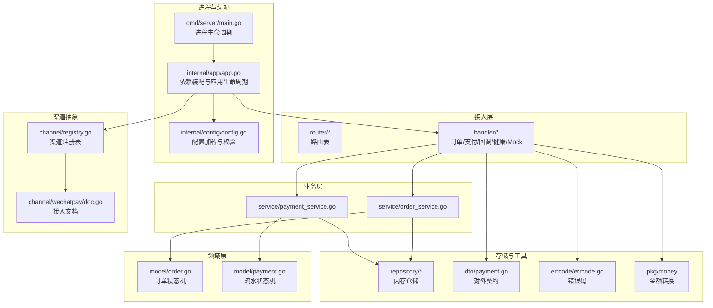
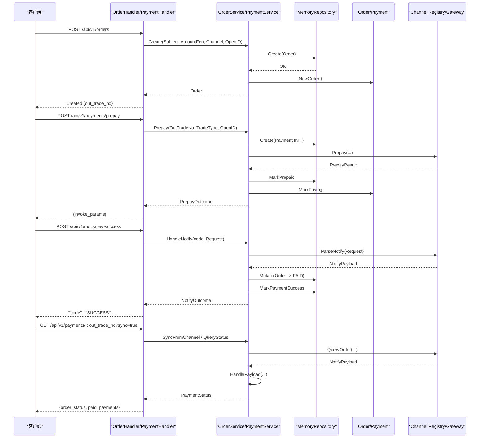
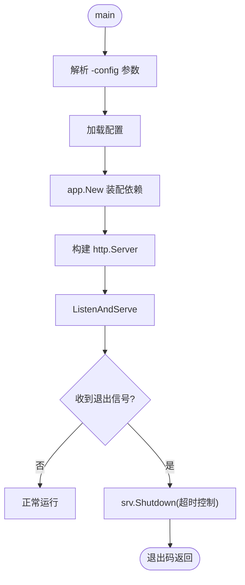
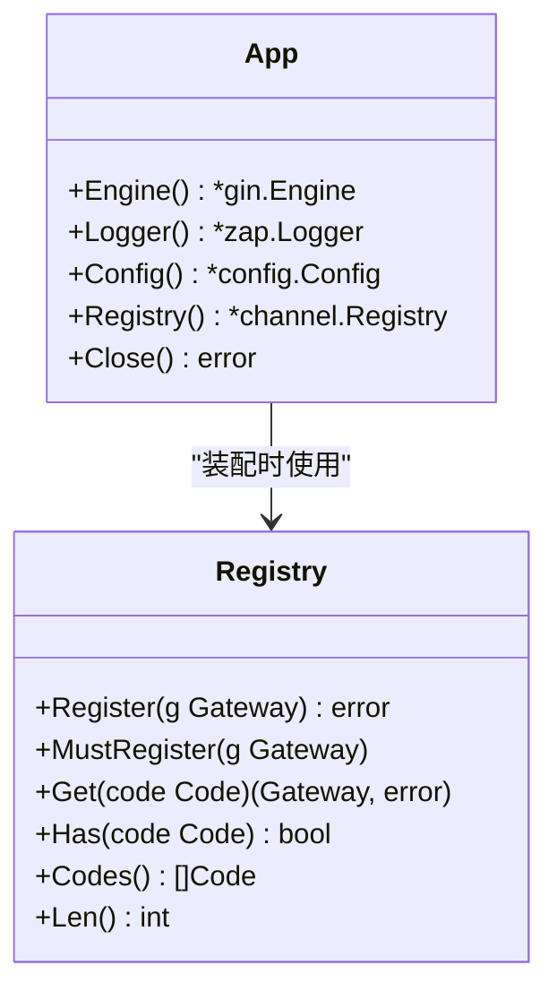
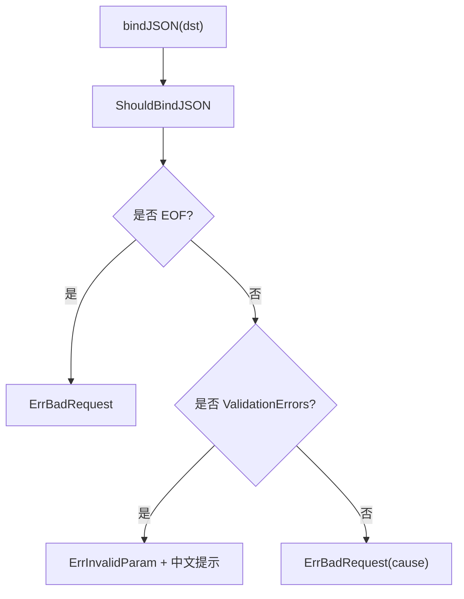
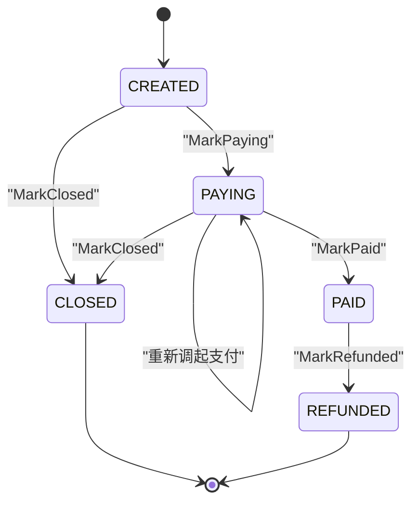
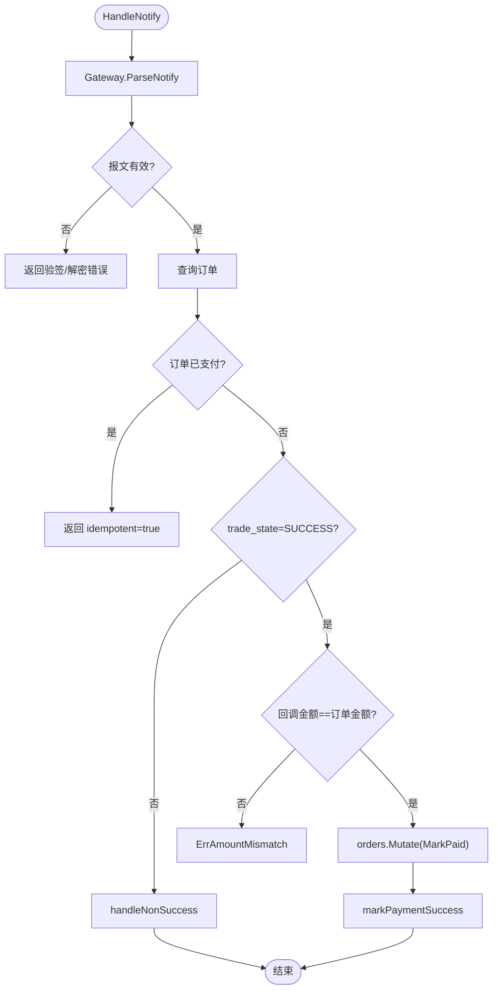
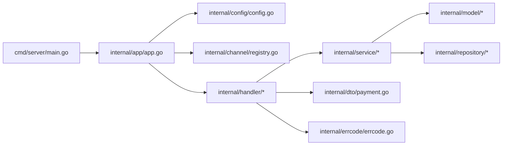
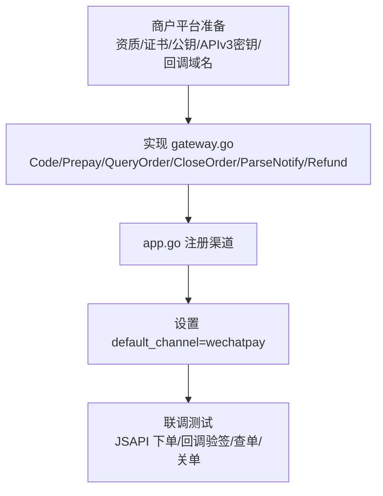

# 开发指南

<cite>
**本文引用的文件**   
- [README.md](file://README.md)
- [go.mod](file://go.mod)
- [Makefile](file://Makefile)
- [Dockerfile](file://Dockerfile)
- [configs/config.yaml](file://configs/config.yaml)
- [cmd/server/main.go](file://cmd/server/main.go)
- [internal/app/app.go](file://internal/app/app.go)
- [internal/channel/registry.go](file://internal/channel/registry.go)
- [internal/channel/wechatpay/doc.go](file://internal/channel/wechatpay/doc.go)
- [internal/handler/handler.go](file://internal/handler/handler.go)
- [internal/handler/order_handler.go](file://internal/handler/order_handler.go)
- [internal/handler/payment_handler.go](file://internal/handler/payment_handler.go)
- [internal/handler/callback_handler.go](file://internal/handler/callback_handler.go)
- [internal/service/order_service.go](file://internal/service/order_service.go)
- [internal/service/payment_service.go](file://internal/service/payment_service.go)
- [internal/model/order.go](file://internal/model/order.go)
- [internal/model/payment.go](file://internal/model/payment.go)
- [internal/dto/payment.go](file://internal/dto/payment.go)
- [internal/errcode/errcode.go](file://internal/errcode/errcode.go)
- [internal/config/config.go](file://internal/config/config.go)
</cite>

## 目录
1. [引言](#引言)
2. [项目结构](#项目结构)
3. [核心组件](#核心组件)
4. [架构总览](#架构总览)
5. [详细组件分析](#详细组件分析)
6. [依赖关系分析](#依赖关系分析)
7. [性能与可靠性](#性能与可靠性)
8. [测试策略与实践](#测试策略与实践)
9. [微信支付接入指南](#微信支付接入指南)
10. [功能扩展指南](#功能扩展指南)
11. [代码规范与最佳实践](#代码规范与最佳实践)
12. [代码审查与提交规范](#代码审查与提交规范)
13. [故障排查与常见问题](#故障排查与常见问题)
14. [开发工具与调试技巧](#开发工具与调试技巧)
15. [结论](#结论)

## 引言
本指南面向贡献者，目标是帮助你在本地快速搭建支付服务开发环境，理解分层架构、领域状态机、渠道抽象层与回调幂等机制，掌握单元测试与集成测试的编写方法，并给出微信支付接入、扩展现有功能、代码审查、性能优化与排障的完整建议。

本项目是一个 Go + Gin 的分层支付服务骨架：内存仓储可跑通「下单 → 发起支付 → 渠道回调 → 查单」全流程；渠道差异收敛在 `channel.Gateway` 抽象层之后，为接入微信支付预留接缝；当前默认使用 mock 渠道，release 模式下不注册 mock 路由，因此本地联调需保持 debug 模式。

**章节来源**
- [README.md:1-12](file://README.md#L1-L12)

## 项目结构
仓库采用经典分层组织：进程入口、装配层、HTTP 接入层、业务服务层、领域模型层、渠道抽象层、仓储接口与实现、配置加载、错误码与通用工具。对外接口集中在 router 与 handler，业务规则集中在 service 与 model，渠道差异通过 channel 抽象隔离。

**图表来源**
- [cmd/server/main.go:31-124](file://cmd/server/main.go#L31-L124)
- [internal/app/app.go:39-106](file://internal/app/app.go#L39-L106)
- [internal/config/config.go:113-154](file://internal/config/config.go#L113-L154)
- [internal/handler/order_handler.go:23-60](file://internal/handler/order_handler.go#L23-L60)
- [internal/handler/payment_handler.go:26-51](file://internal/handler/payment_handler.go#L26-L51)
- [internal/handler/callback_handler.go:44-86](file://internal/handler/callback_handler.go#L44-L86)
- [internal/service/order_service.go:67-110](file://internal/service/order_service.go#L67-L110)
- [internal/service/payment_service.go:99-226](file://internal/service/payment_service.go#L99-L226)
- [internal/model/order.go:20-50](file://internal/model/order.go#L20-L50)
- [internal/model/payment.go:10-33](file://internal/model/payment.go#L10-L33)
- [internal/channel/registry.go:11-24](file://internal/channel/registry.go#L11-L24)
- [internal/channel/wechatpay/doc.go:1-15](file://internal/channel/wechatpay/doc.go#L1-L15)

**章节来源**
- [README.md:38-62](file://README.md#L38-L62)

## 核心组件
- 进程入口：负责参数解析、配置加载、应用装配、HTTP 启动与优雅关闭。
- 装配层：按配置构造日志、渠道注册表、仓储、服务、Handler 与路由，是唯一的组装点。
- HTTP 接入层：统一解析请求、校验参数、调用 Service、封装响应；回调接口遵循渠道规范应答。
- 业务服务层：OrderService 负责下单与订单查询；PaymentService 负责发起支付、处理回调、查询与主动查单兜底。
- 领域模型层：Order 与 Payment 各自维护状态机，所有状态变更必须通过 Mark* 方法。
- 渠道抽象层：Gateway 接口屏蔽具体 SDK 差异；Registry 并发安全地管理可用渠道。
- 配置系统：Viper 加载 yaml + 环境变量覆盖，启动期强校验；APIv3 密钥仅从环境变量注入。
- 错误码体系：分段编码绑定 HTTP 状态码，From 统一归一化，WithCause/WithMsg 提供上下文。

**章节来源**
- [cmd/server/main.go:1-6](file://cmd/server/main.go#L1-L6)
- [internal/app/app.go:1-12](file://internal/app/app.go#L1-L12)
- [internal/handler/handler.go:1-10](file://internal/handler/handler.go#L1-L10)
- [internal/service/order_service.go:1-7](file://internal/service/order_service.go#L1-L7)
- [internal/model/order.go:1-7](file://internal/model/order.go#L1-L7)
- [internal/channel/registry.go:11-24](file://internal/channel/registry.go#L11-L24)
- [internal/config/config.go:1-7](file://internal/config/config.go#L1-L7)
- [internal/errcode/errcode.go:1-12](file://internal/errcode/errcode.go#L1-L12)

## 架构总览
下图展示一次「创建订单 → 发起支付 → 模拟回调 → 查询支付状态」的请求链路，体现 handler → service → repository/model → channel 的调用顺序与数据流向。

**图表来源**
- [internal/handler/order_handler.go:23-60](file://internal/handler/order_handler.go#L23-L60)
- [internal/handler/payment_handler.go:26-51](file://internal/handler/payment_handler.go#L26-L51)
- [internal/handler/callback_handler.go:44-86](file://internal/handler/callback_handler.go#L44-L86)
- [internal/service/order_service.go:67-110](file://internal/service/order_service.go#L67-L110)
- [internal/service/payment_service.go:99-226](file://internal/service/payment_service.go#L99-L226)
- [internal/service/payment_service.go:258-379](file://internal/service/payment_service.go#L258-L379)
- [internal/service/payment_service.go:548-582](file://internal/service/payment_service.go#L548-L582)

## 详细组件分析

### 进程入口与服务启动
- 解析 `-config` 参数，优先使用环境变量指定的配置文件路径，再回退到默认路径。
- 加载配置后装配应用，构造 http.Server，设置 ReadHeaderTimeout 抵御慢速攻击。
- 监听 SIGINT/SIGTERM，优雅关闭时等待存量请求完成，避免支付回调中断导致掉单。

**图表来源**
- [cmd/server/main.go:31-124](file://cmd/server/main.go#L31-L124)

**章节来源**
- [cmd/server/main.go:25-29](file://cmd/server/main.go#L25-L29)
- [cmd/server/main.go:31-124](file://cmd/server/main.go#L31-L124)

### 装配层与渠道注册
- 装配层集中构造日志、渠道注册表、仓储、服务、Handler 与路由。
- buildRegistry 根据配置决定是否注册 mock 渠道；若启用微信支付但未实现则直接报错，防止“带病运行”。
- release 模式下禁用 mock 路由，避免调试能力暴露。

**图表来源**
- [internal/app/app.go:31-37](file://internal/app/app.go#L31-L37)
- [internal/app/app.go:108-152](file://internal/app/app.go#L108-L152)
- [internal/channel/registry.go:21-24](file://internal/channel/registry.go#L21-L24)

**章节来源**
- [internal/app/app.go:39-106](file://internal/app/app.go#L39-L106)
- [internal/app/app.go:108-152](file://internal/app/app.go#L108-L152)

### HTTP 接入层与参数校验
- bindJSON 区分空体、JSON 语法错误、字段类型不匹配与校验失败，分别映射不同错误码，便于前端提示。
- pathParam 校验路径参数非空；amountParseError 将金额解析错误翻译为面向用户的提示。
- 回调接口不走统一响应体，而是按微信规范返回 SUCCESS/FAIL。

**图表来源**
- [internal/handler/handler.go:29-55](file://internal/handler/handler.go#L29-L55)
- [internal/handler/handler.go:57-98](file://internal/handler/handler.go#L57-L98)
- [internal/handler/handler.go:140-155](file://internal/handler/handler.go#L140-L155)
- [internal/handler/callback_handler.go:14-26](file://internal/handler/callback_handler.go#L14-L26)

**章节来源**
- [internal/handler/handler.go:1-10](file://internal/handler/handler.go#L1-L10)
- [internal/handler/handler.go:29-55](file://internal/handler/handler.go#L29-L55)
- [internal/handler/handler.go:57-98](file://internal/handler/handler.go#L57-L98)
- [internal/handler/handler.go:131-155](file://internal/handler/handler.go#L131-L155)
- [internal/handler/callback_handler.go:14-26](file://internal/handler/callback_handler.go#L14-L26)

### 订单服务与领域状态机
- OrderService.Create 校验金额、确定渠道、生成商户订单号、落库并记录日志。
- Order 状态机固化在 model 层，所有状态变更通过 transit 与 Mark* 方法，非法流转直接报错。

**图表来源**
- [internal/model/order.go:20-50](file://internal/model/order.go#L20-L50)
- [internal/model/order.go:122-153](file://internal/model/order.go#L122-L153)
- [internal/service/order_service.go:67-110](file://internal/service/order_service.go#L67-L110)

**章节来源**
- [internal/service/order_service.go:67-110](file://internal/service/order_service.go#L67-L110)
- [internal/model/order.go:20-50](file://internal/model/order.go#L20-L50)
- [internal/model/order.go:122-153](file://internal/model/order.go#L122-L153)

### 支付服务、回调幂等与金额校验
- Prepay 流程：校验订单可支付 → 创建流水(INIT) → 调用渠道 → 流水置 PREPAID → 订单置 PAYING。
- HandleNotify 先验签解密，再做金额校验与状态推进；并发重复回调通过哨兵错误与锁内二次判断保证幂等。
- handleNonSuccess 对 CLOSED/PAY_ERROR 等状态做差异化处理，USERPAYING 等非终态不做变更。
- SyncFromChannel 复用 HandlePayload，确保主动查单与回调结论一致。

**图表来源**
- [internal/service/payment_service.go:99-226](file://internal/service/payment_service.go#L99-L226)
- [internal/service/payment_service.go:258-379](file://internal/service/payment_service.go#L258-L379)
- [internal/service/payment_service.go:381-415](file://internal/service/payment_service.go#L381-L415)
- [internal/service/payment_service.go:417-486](file://internal/service/payment_service.go#L417-L486)

**章节来源**
- [internal/service/payment_service.go:99-226](file://internal/service/payment_service.go#L99-L226)
- [internal/service/payment_service.go:258-379](file://internal/service/payment_service.go#L258-L379)
- [internal/service/payment_service.go:381-415](file://internal/service/payment_service.go#L381-L415)
- [internal/service/payment_service.go:417-486](file://internal/service/payment_service.go#L417-L486)

### 错误码与响应封装
- 错误码分段：10xxx 通用、20xxx 订单、30xxx 支付、40xxx 渠道。
- From 把任意 error 归一化为 *Error，WithCause/WithMsg 提供底层原因与对外文案。
- handler 层统一用 response.Fail/OK/Created 封装响应，回调接口例外。

**章节来源**
- [internal/errcode/errcode.go:1-12](file://internal/errcode/errcode.go#L1-L12)
- [internal/errcode/errcode.go:78-134](file://internal/errcode/errcode.go#L78-L134)
- [internal/errcode/errcode.go:136-158](file://internal/errcode/errcode.go#L136-L158)
- [internal/handler/handler.go:29-55](file://internal/handler/handler.go#L29-L55)

## 依赖关系分析
- 外部依赖：Gin、validator、Viper、Zap。
- 模块依赖：cmd → internal/app → internal/{config,channel,handler,repository,router,service,model,pkg}。
- 渠道解耦：service 只依赖 channel.Gateway 接口，不感知 SDK；新增渠道只需实现接口并在 app 装配层注册。

**图表来源**
- [cmd/server/main.go:21-23](file://cmd/server/main.go#L21-L23)
- [internal/app/app.go:21-29](file://internal/app/app.go#L21-L29)
- [internal/handler/order_handler.go:3-11](file://internal/handler/order_handler.go#L3-L11)
- [internal/service/order_service.go:9-19](file://internal/service/order_service.go#L9-L19)

**章节来源**
- [go.mod:1-10](file://go.mod#L1-L10)
- [internal/app/app.go:21-29](file://internal/app/app.go#L21-L29)

## 性能与可靠性
- 金额全程以 int64 存「分」，避免浮点精度问题；对外同时返回元（字符串）与分（整数）。
- 内存仓储使用 RWMutex + draft-copy-then-swap，读多写少场景开销低，对外返回 Clone 快照。
- HTTP 层收紧 ReadHeaderTimeout 抵御慢速攻击；WriteTimeout 针对回调小响应体设为 15s。
- 回调幂等：快速 IsPaid 判断 + Mutate 内二次检查 + 幂等命中仍返回 SUCCESS，避免渠道无限重试。
- 主动查单兜底：SyncFromChannel 复用 HandlePayload，避免回调丢失导致掉单。

**章节来源**
- [README.md:203-213](file://README.md#L203-L213)
- [internal/service/payment_service.go:301-313](file://internal/service/payment_service.go#L301-L313)
- [internal/service/payment_service.go:548-582](file://internal/service/payment_service.go#L548-L582)
- [cmd/server/main.go:25-29](file://cmd/server/main.go#L25-L29)

## 测试策略与实践
当前项目未包含测试文件，但提供了清晰的测试切入点与策略建议：

- 单元测试
  - 领域模型：穷举 Order/Payment 状态机合法流转与非法流转，断言 CanTransitionTo 与 Mark* 行为。
  - 业务服务：Mock repository 与 channel.Gateway，验证 Prepay 各分支（渠道失败、订单不可支付、并发幂等）、HandleNotify 金额校验与状态推进、SyncFromChannel 复用逻辑。
  - 接入层：使用 gin test 包构造请求，断言 bindJSON 的错误分类、pathParam 校验、amountParseError 提示。
- 集成测试
  - 使用内存仓储端到端验证「下单 → 发起支付 → 模拟回调 → 查单」全链路。
  - 并发回调压测：同一 out_trade_no 多路并发回调，验证 idempotent 与最终一致性。
- 推荐工具
  - 使用 testify 进行断言与 mock；使用 go test -race 检测竞态。
  - 覆盖率统计：make cover。

**章节来源**
- [README.md:286-294](file://README.md#L286-L294)
- [internal/model/order.go:20-50](file://internal/model/order.go#L20-L50)
- [internal/model/payment.go:10-33](file://internal/model/payment.go#L10-L33)
- [internal/service/payment_service.go:99-226](file://internal/service/payment_service.go#L99-L226)
- [internal/handler/handler.go:29-55](file://internal/handler/handler.go#L29-L55)

## 微信支付接入指南
接入前需在商户平台准备资质与凭据，并完成 JSAPI 产品开通、授权目录、证书或公钥模式选择、APIv3 密钥配置、公网 HTTPS 回调域名与 openid 获取链路。

代码改动仅涉及三处：
1. 新增 `internal/channel/wechatpay/gateway.go`，实现 Gateway 接口的六个方法。
2. 在 `internal/app/app.go` 的 buildRegistry 中按 channels.wechatpay.enabled 注册该实现。
3. 安装官方 SDK 并将 payment.default_channel 改为 wechatpay。

SDK 要点：
- 证书模式与公钥模式二选一；回调验签分别使用证书访问者或公钥访问者。
- JSAPI 下单返回 prepay_id；前端调起参数必须由 SDK 签名，timeStamp 必须是字符串。
- ParseNotify 必须接收 *http.Request，以便读取签名相关请求头。

**图表来源**
- [internal/channel/wechatpay/doc.go:1-15](file://internal/channel/wechatpay/doc.go#L1-L15)
- [internal/channel/wechatpay/doc.go:16-87](file://internal/channel/wechatpay/doc.go#L16-L87)
- [internal/channel/wechatpay/doc.go:88-104](file://internal/channel/wechatpay/doc.go#L88-L104)
- [internal/app/app.go:123-132](file://internal/app/app.go#L123-L132)
- [configs/config.yaml:42-61](file://configs/config.yaml#L42-L61)

**章节来源**
- [README.md:274-284](file://README.md#L274-L284)
- [internal/channel/wechatpay/doc.go:1-104](file://internal/channel/wechatpay/doc.go#L1-L104)
- [internal/app/app.go:123-132](file://internal/app/app.go#L123-L132)
- [configs/config.yaml:42-61](file://configs/config.yaml#L42-L61)

## 功能扩展指南
- 添加新支付渠道
  - 在 channel 下新增子包实现 Gateway 接口。
  - 在 app.buildRegistry 中按配置注册。
  - 更新 configs/config.yaml 与 README 接口清单。
- 扩展订单状态
  - 在 model/order.go 中添加状态常量与 transitions 映射。
  - 在 Mark* 方法中补充状态推进逻辑。
  - 在 service 与 handler 中补充对应分支与错误码。
- 增加新的 API 接口
  - 在 router 中注册路由。
  - 在 handler 中实现处理器，参数校验与业务调用下沉到 service。
  - 在 dto 中定义对外契约，保持与 model 分离。

**章节来源**
- [internal/channel/wechatpay/doc.go:9-14](file://internal/channel/wechatpay/doc.go#L9-L14)
- [internal/app/app.go:108-152](file://internal/app/app.go#L108-L152)
- [internal/model/order.go:20-50](file://internal/model/order.go#L20-L50)
- [internal/dto/payment.go:9-25](file://internal/dto/payment.go#L9-L25)

## 代码规范与最佳实践
- 命名约定
  - 包名与文件名小写，函数与结构体首字母大写；对外导出遵循 Go 惯例。
  - 错误码变量以 Err 前缀，如 ErrOrderNotFound。
- 文件组织
  - cmd 仅放进程入口；internal 下按 layer 划分：app、channel、config、dto、errcode、handler、middleware、model、pkg、repository、router、service。
- 注释标准
  - 包级注释说明职责与边界；关键函数注释说明入参、出参、副作用与异常分支。
  - 安全红线与资金防线必须在注释中明确标注。
- 错误处理模式
  - 使用 errcode 统一错误码与 HTTP 状态码；From 归一化；WithCause/WithMsg 携带上下文。
  - handler 层区分 JSON 解析错误、参数校验错误与业务错误，便于前端提示。
- 金额与时间
  - 金额一律以 int64 存「分」；对外响应同时提供元（字符串）与分（整数）。
  - 时间戳使用 time.Time，成功时间优先使用渠道下发值，缺失时用本地时间兜底。

**章节来源**
- [internal/errcode/errcode.go:1-12](file://internal/errcode/errcode.go#L1-L12)
- [internal/handler/handler.go:29-55](file://internal/handler/handler.go#L29-L55)
- [internal/service/payment_service.go:335-340](file://internal/service/payment_service.go#L335-L340)
- [README.md:203-213](file://README.md#L203-L213)

## 代码审查与提交规范
- 提交前自检
  - make check：gofmt + go vet + go build。
  - 建议安装 golangci-lint 并执行 make lint。
- 提交信息
  - 使用语义化提交信息：feat/fix/docs/style/refactor/test/chore。
  - 描述影响范围与风险点，尤其是涉及资金与安全的改动。
- 审查重点
  - 渠道接入是否实现全部 Gateway 方法；回调验签与解密是否严格实现。
  - 状态机流转是否完整；是否存在非法状态赋值。
  - 错误码是否合理；是否泄露内部细节给客户端。
  - 敏感配置是否仅从环境变量注入；certs/ 是否被排除。

**章节来源**
- [README.md:248-266](file://README.md#L248-L266)
- [internal/channel/wechatpay/doc.go:97-104](file://internal/channel/wechatpay/doc.go#L97-L104)

## 故障排查与常见问题
- 启动失败
  - release 模式无可用渠道：mock 被禁用且微信支付未实现，需切换 debug 或完成微信支付接入。
  - 配置项非法：mode/port/log.format 校验失败；release 下 notify_base_url 必须 HTTPS。
- 回调反复重试
  - 确认回调接口返回微信规范的 SUCCESS/FAIL；不要返回统一响应体。
  - 检查验签与解密是否成功；金额是否与订单一致。
- 掉单
  - 使用 sync=true 主动查单；生产环境应定时任务批量扫描 PAYING 超时订单。
- 金额不一致
  - 回调金额与订单金额不一致属于资金事件，需人工介入；不要绕过校验。

**章节来源**
- [internal/app/app.go:134-149](file://internal/app/app.go#L134-L149)
- [internal/config/config.go:226-268](file://internal/config/config.go#L226-L268)
- [internal/handler/callback_handler.go:14-26](file://internal/handler/callback_handler.go#L14-L26)
- [internal/service/payment_service.go:320-333](file://internal/service/payment_service.go#L320-L333)
- [internal/service/payment_service.go:548-582](file://internal/service/payment_service.go#L548-L582)

## 开发工具与调试技巧
- 本地运行
  - make run：前台运行，Ctrl-C 触发优雅关闭。
  - make build：编译到 bin/payment-server。
- Docker
  - make docker-build：构建镜像；运行时挂载 certs/ 为只读卷，并通过 .env 注入环境变量。
- 日志与追踪
  - request_id 贯穿链路，响应体与响应头回显；按 request_id 串联一次请求的所有日志。
  - 生产环境建议使用 json 格式日志，便于采集解析。
- 调试接口
  - 非 release 模式注册 /api/v1/mock/pay-success，用于端到端验证状态机与幂等。

**章节来源**
- [README.md:13-36](file://README.md#L13-L36)
- [README.md:268-272](file://README.md#L268-L272)
- [README.md:211-213](file://README.md#L211-L213)
- [cmd/server/main.go:69-100](file://cmd/server/main.go#L69-L100)

## 结论
本指南覆盖了本地开发环境搭建、分层架构理解、渠道抽象与回调幂等机制、微信支付接入步骤、功能扩展方式、代码规范与审查流程、性能与可靠性建议以及常见问题的排查方法。贡献者在实现微信支付或其他渠道时，应严格遵守安全红线与资金防线，确保验签解密、金额校验与状态机流转的正确性；在生产环境中，务必启用 HTTPS 回调、限制调试接口、完善定时查单与监控告警，保障支付服务的稳定与安全。