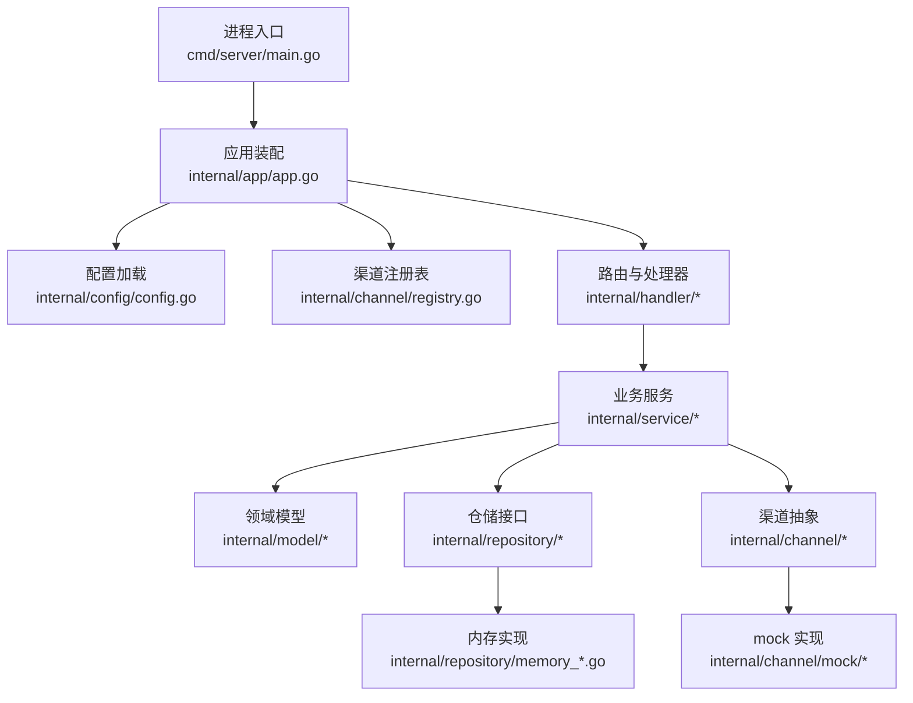
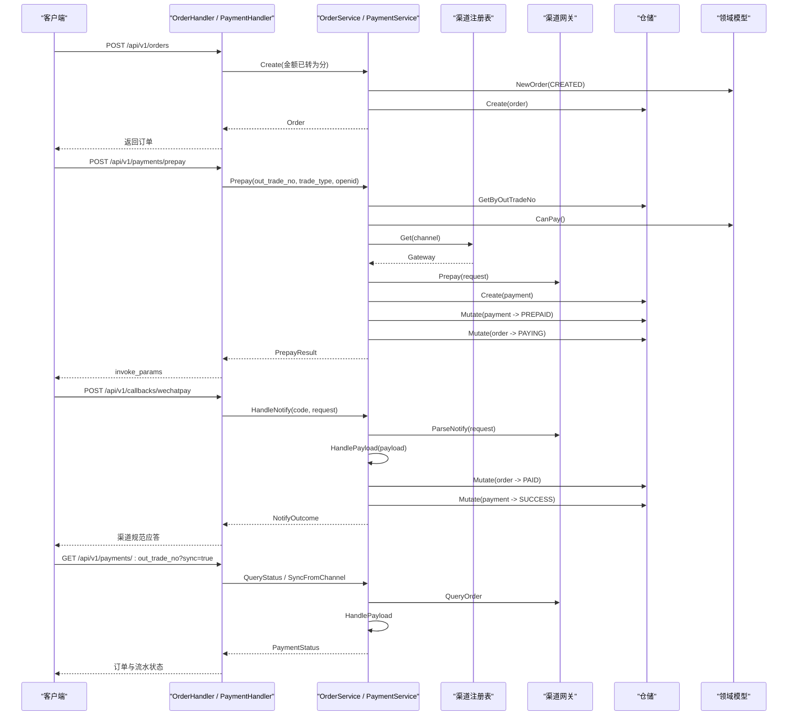
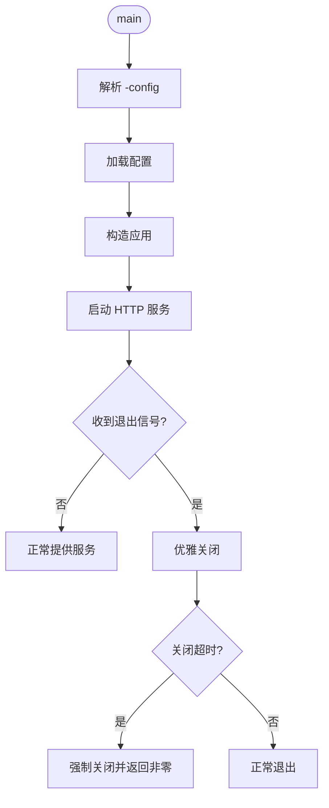
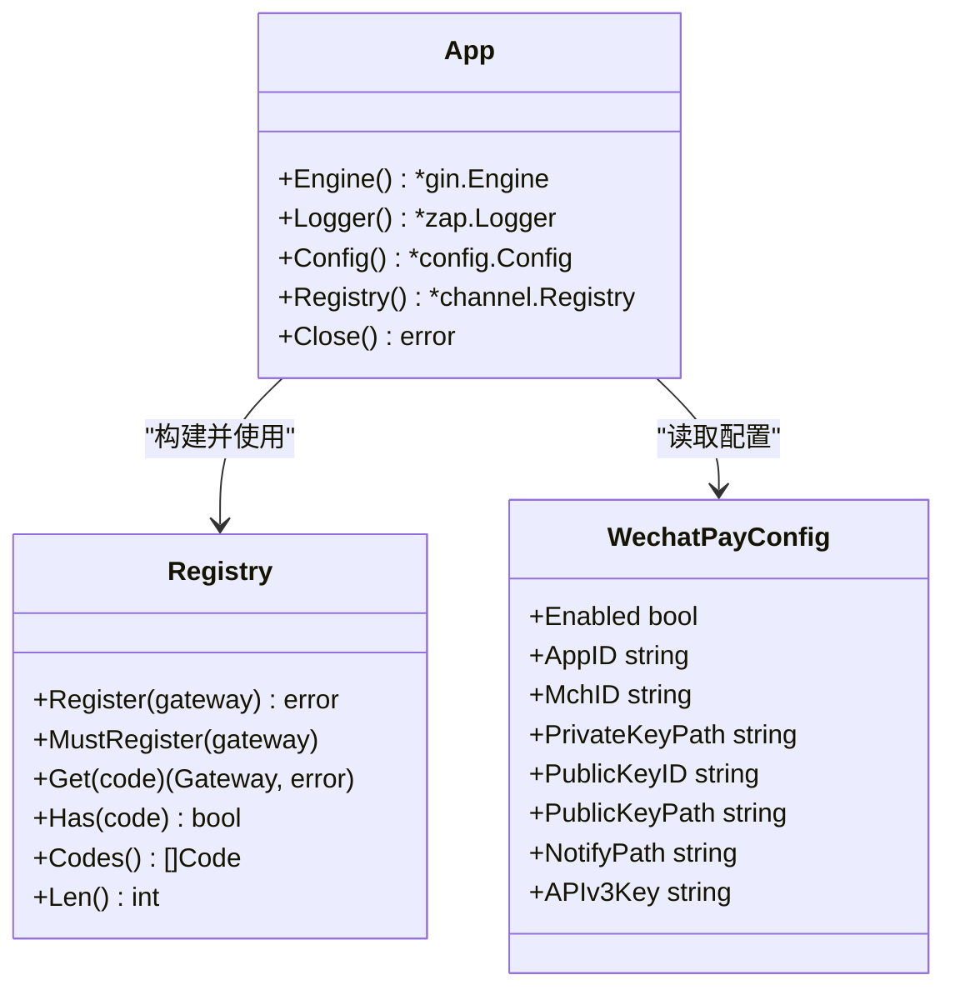
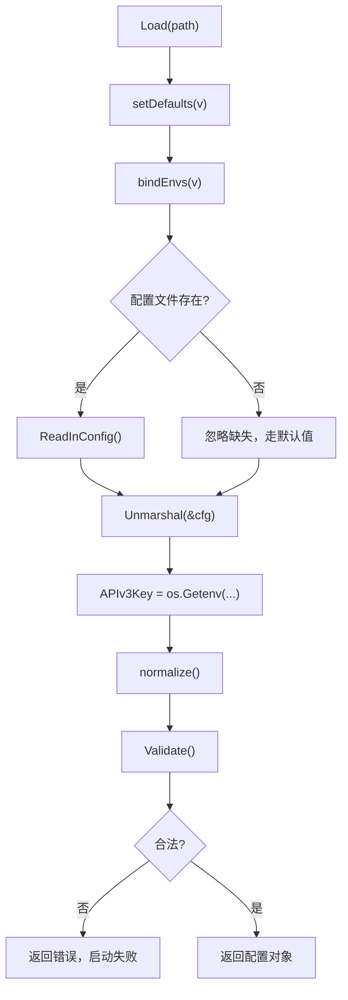
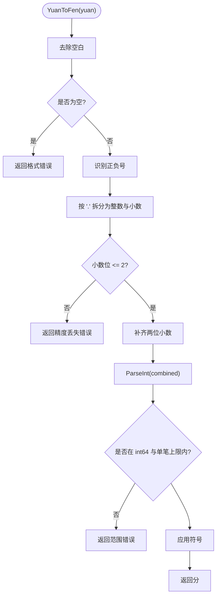
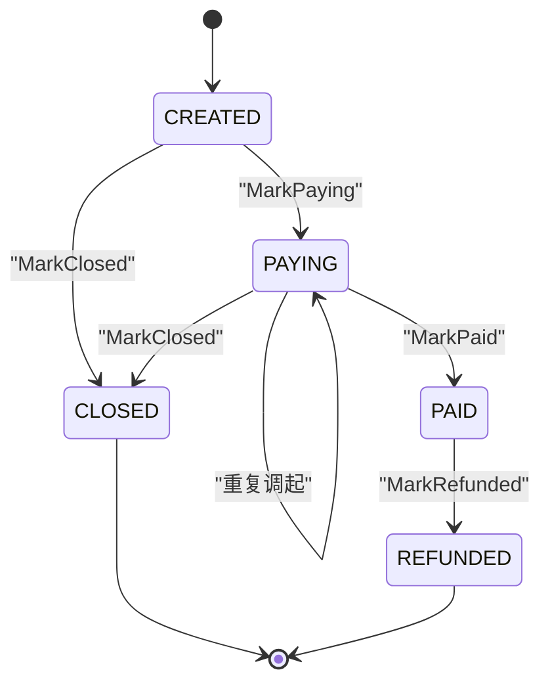
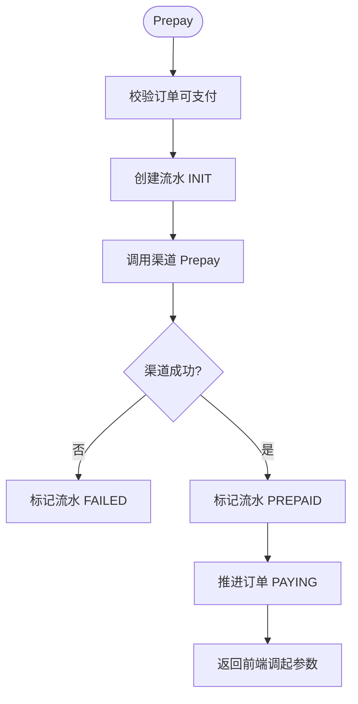
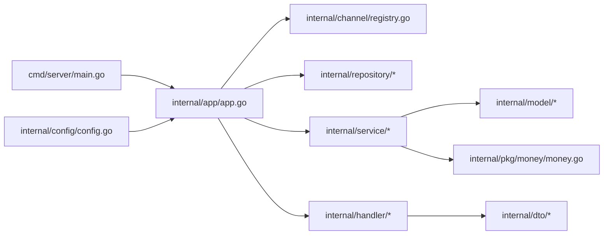

# 开发指南

<cite>
**本文引用的文件**   
- [README.md](file://README.md)
- [go.mod](file://go.mod)
- [cmd/server/main.go](file://cmd/server/main.go)
- [internal/app/app.go](file://internal/app/app.go)
- [internal/channel/registry.go](file://internal/channel/registry.go)
- [internal/config/config.go](file://internal/config/config.go)
- [configs/config.yaml](file://configs/config.yaml)
- [internal/pkg/money/money.go](file://internal/pkg/money/money.go)
- [internal/handler/order_handler.go](file://internal/handler/order_handler.go)
- [internal/handler/payment_handler.go](file://internal/handler/payment_handler.go)
- [internal/service/order_service.go](file://internal/service/order_service.go)
- [internal/service/payment_service.go](file://internal/service/payment_service.go)
- [internal/model/order.go](file://internal/model/order.go)
- [internal/model/payment.go](file://internal/model/payment.go)
</cite>

## 目录
1. [引言](#引言)
2. [项目结构](#项目结构)
3. [核心组件](#核心组件)
4. [架构总览](#架构总览)
5. [详细组件分析](#详细组件分析)
6. [依赖关系分析](#依赖关系分析)
7. [性能与并发特性](#性能与并发特性)
8. [测试策略与引入方式](#测试策略与引入方式)
9. [代码审查清单](#代码审查清单)
10. [新功能开发流程](#新功能开发流程)
11. [常见问题排查](#常见问题排查)
12. [结论](#结论)

## 引言
本开发指南面向在本支付服务仓库中进行本地开发与功能扩展的工程师。文档覆盖环境搭建、代码规范、金额处理红线、测试策略、代码审查要点，以及从需求到提交的完整流程。该服务采用 Go + Gin 的分层架构，通过 `channel.Gateway` 抽象隔离支付渠道差异，当前以内存仓储和 mock 渠道跑通「下单 → 发起支付 → 回调 → 查单」主链路。

## 项目结构
仓库采用按职责分层组织：
- `cmd/server`：进程入口，负责参数解析、配置加载、HTTP 启动与优雅关闭。
- `internal/app`：装配层，把配置、日志、渠道注册表、仓储、服务、处理器、路由串起来。
- `internal/channel`：渠道抽象层与注册表，mock 实现占位，wechatpay 为接入预留。
- `internal/config`：Viper 加载 yaml 与环境变量，含启动期强校验。
- `internal/dto`：对外契约，金额用字符串「元」。
- `internal/errcode`：业务错误码与 HTTP 状态映射。
- `internal/handler`：HTTP 接入层，解析请求、调用 service、统一响应。
- `internal/middleware`：request_id、日志、恢复、跨域等中间件。
- `internal/model`：领域模型与状态机，所有金额存「分」。
- `internal/pkg`：通用工具，包括 money、idgen、logger、response。
- `internal/repository`：仓储接口与内存实现。
- `internal/router`：路由表。
- `internal/service`：OrderService 与 PaymentService。
- `configs/config.yaml`：不含密钥的配置模板。
- `certs/`：商户证书目录，被 gitignore/dockerignore/Dockerfile 排除。

**图表来源**
- [cmd/server/main.go:31-124](file://cmd/server/main.go#L31-L124)
- [internal/app/app.go:39-106](file://internal/app/app.go#L39-L106)
- [internal/channel/registry.go:11-24](file://internal/channel/registry.go#L11-L24)
- [internal/config/config.go:39-45](file://internal/config/config.go#L39-L45)

**章节来源**
- [README.md:38-62](file://README.md#L38-L62)
- [configs/config.yaml:1-61](file://configs/config.yaml#L1-L61)

## 核心组件
- 进程入口：解析 `-config`，加载配置，构造应用，启动 HTTP，监听 SIGINT/SIGTERM，执行优雅关闭。
- 装配层：按模式决定是否注册 mock 路由，创建日志、渠道注册表、内存仓储、OrderService/PaymentService、Gin 引擎。
- 渠道抽象层：`Gateway` 接口定义 Prepay/QueryOrder/CloseOrder/ParseNotify/Refund，Registry 提供并发安全的注册与查找。
- 配置层：环境变量优先级高于 yaml，APIv3 密钥只允许环境变量注入，启动期做严格校验。
- 金额工具：`money` 包使用 int64「分」，基于字符串与 big.Int 转换，避免 float64 精度问题。
- 领域模型：Order 与 Payment 各自维护状态机，禁止外部直接赋值状态。
- 服务层：OrderService 负责下单与订单查询；PaymentService 负责预支付、回调幂等、金额校验、同步兜底。
- 接入层：handler 负责绑定 JSON、路径参数、布尔查询参数，并把元转分放在接入层完成，使解析失败归类为客户端参数错误。

**章节来源**
- [cmd/server/main.go:31-124](file://cmd/server/main.go#L31-L124)
- [internal/app/app.go:39-106](file://internal/app/app.go#L39-L106)
- [internal/channel/registry.go:11-24](file://internal/channel/registry.go#L11-L24)
- [internal/config/config.go:113-155](file://internal/config/config.go#L113-L155)
- [internal/pkg/money/money.go:1-7](file://internal/pkg/money/money.go#L1-L7)
- [internal/model/order.go:73-102](file://internal/model/order.go#L73-L102)
- [internal/model/payment.go:54-89](file://internal/model/payment.go#L54-L89)
- [internal/service/order_service.go:21-65](file://internal/service/order_service.go#L21-L65)
- [internal/service/payment_service.go:34-57](file://internal/service/payment_service.go#L34-L57)
- [internal/handler/order_handler.go:23-60](file://internal/handler/order_handler.go#L23-L60)
- [internal/handler/payment_handler.go:26-51](file://internal/handler/payment_handler.go#L26-L51)

## 架构总览
下图展示一次「创建订单 → 发起支付 → 模拟回调 → 查询支付状态」的典型调用链。

**图表来源**
- [internal/handler/order_handler.go:23-60](file://internal/handler/order_handler.go#L23-L60)
- [internal/handler/payment_handler.go:26-85](file://internal/handler/payment_handler.go#L26-L85)
- [internal/service/order_service.go:67-110](file://internal/service/order_service.go#L67-L110)
- [internal/service/payment_service.go:99-226](file://internal/service/payment_service.go#L99-L226)
- [internal/service/payment_service.go:258-379](file://internal/service/payment_service.go#L258-L379)
- [internal/service/payment_service.go:548-582](file://internal/service/payment_service.go#L548-L582)

## 详细组件分析

### 进程入口与服务生命周期
- 解析 `-config`，默认尝试环境变量与配置文件路径。
- 加载配置后构造应用，设置全局日志。
- 启动 HTTP Server，单独限制请求头读取超时，抵御慢连接攻击。
- 在启动前注册信号监听，收到退出信号后按配置的优雅关闭时长等待存量请求完成。
- 若优雅关闭超时，强制断开并记录错误。

**图表来源**
- [cmd/server/main.go:31-124](file://cmd/server/main.go#L31-L124)

**章节来源**
- [cmd/server/main.go:31-124](file://cmd/server/main.go#L31-L124)

### 装配层与渠道注册
- 装配层是唯一的组装点，手工装配而非依赖注入框架，降低跳转成本。
- 根据 `server.mode` 决定 mock 路由是否注册。
- 若配置启用微信支付但尚未实现，直接让进程启动失败，避免「配置可用但实际不可用」的静默故障。
- 默认渠道必须已在注册表中存在，否则启动失败并给出可用渠道列表。

**图表来源**
- [internal/app/app.go:31-37](file://internal/app/app.go#L31-L37)
- [internal/channel/registry.go:21-24](file://internal/channel/registry.go#L21-L24)
- [internal/config/config.go:86-111](file://internal/config/config.go#L86-L111)

**章节来源**
- [internal/app/app.go:39-152](file://internal/app/app.go#L39-L152)
- [internal/channel/registry.go:11-24](file://internal/channel/registry.go#L11-L24)

### 配置加载与安全约束
- 优先级：环境变量 > yaml > 默认值。
- APIv3 密钥只从环境变量读取，yaml 中无对应字段，防止误提交。
- 生产模式下回调地址必须是 HTTPS。
- 微信支付启用时必须配齐 AppID、MchID、私钥路径或公钥模式凭据，且 APIv3 密钥长度固定。
- 生产模式会检查证书文件可读性，本地与 CI 可跳过。

**图表来源**
- [internal/config/config.go:113-155](file://internal/config/config.go#L113-L155)
- [internal/config/config.go:226-268](file://internal/config/config.go#L226-L268)
- [internal/config/config.go:270-321](file://internal/config/config.go#L270-L321)

**章节来源**
- [internal/config/config.go:113-155](file://internal/config/config.go#L113-L155)
- [internal/config/config.go:226-321](file://internal/config/config.go#L226-L321)
- [configs/config.yaml:1-61](file://configs/config.yaml#L1-L61)

### 金额处理：为什么必须使用 int64「分」
- 所有金额一律以 int64 表示「分」，严禁 float64 参与金额运算。
- YuanToFen 基于字符串拆分整数与小数部分，补齐两位小数后解析为 int64，不经过浮点。
- FenToYuan 使用 big.Int 计算元与分，返回字符串，避免二次转浮点。
- ValidateAmount 拒绝负数、零与超过单笔上限的金额。
- Mul 提供 fen × n 的安全乘法，检测溢出与超上限。

**图表来源**
- [internal/pkg/money/money.go:39-106](file://internal/pkg/money/money.go#L39-L106)
- [internal/pkg/money/money.go:108-152](file://internal/pkg/money/money.go#L108-L152)

**章节来源**
- [internal/pkg/money/money.go:1-7](file://internal/pkg/money/money.go#L1-L7)
- [internal/pkg/money/money.go:39-152](file://internal/pkg/money/money.go#L39-L152)

### 领域模型与状态机
- Order 状态：CREATED → PAYING → PAID，PAYING/CLOSED/REFUNDED 等终态受控。
- Payment 状态：INIT → PREPAID → SUCCESS/FAILED/CLOSED。
- 所有状态变更通过 Mark* 方法进入 transit，非法流转直接报错。
- AmountTotal 单位为分，禁止外部直接赋值状态，保证语义一致性。

**图表来源**
- [internal/model/order.go:20-50](file://internal/model/order.go#L20-L50)
- [internal/model/order.go:122-170](file://internal/model/order.go#L122-L170)

**章节来源**
- [internal/model/order.go:73-184](file://internal/model/order.go#L73-L184)
- [internal/model/payment.go:10-33](file://internal/model/payment.go#L10-L33)
- [internal/model/payment.go:91-150](file://internal/model/payment.go#L91-L150)

### 订单与支付服务
- OrderService.Create：校验金额、确定渠道、生成订单号、落库、记录日志。
- PaymentService.Prepay：校验订单可支付、创建流水、调用渠道、标记流水 PREPAID、推进订单 PAYING。
- PaymentService.HandleNotify：验签后复用 HandlePayload，先快速幂等判断，再金额校验，最后推进订单与流水。
- PaymentService.SyncFromChannel：主动查单并复用回调处理路径，保证一致性与掉单兜底。

**图表来源**
- [internal/service/payment_service.go:99-226](file://internal/service/payment_service.go#L99-L226)

**章节来源**
- [internal/service/order_service.go:67-125](file://internal/service/order_service.go#L67-L125)
- [internal/service/payment_service.go:99-226](file://internal/service/payment_service.go#L99-L226)
- [internal/service/payment_service.go:258-379](file://internal/service/payment_service.go#L258-L379)
- [internal/service/payment_service.go:548-582](file://internal/service/payment_service.go#L548-L582)

### 接入层与响应封装
- OrderHandler.Create：绑定 JSON，调用 req.AmountFen() 将元转分，失败归类为客户端参数错误。
- PaymentHandler.Prepay：调用 PaymentService，返回前端可直接使用的 invoke_params。
- PaymentHandler.QueryStatus：默认读本地数据，可选 sync 强制同步渠道状态。
- toPaymentStatusResponse：同时返回 amount（元字符串）与 amount_fen（分整数）。

**章节来源**
- [internal/handler/order_handler.go:23-79](file://internal/handler/order_handler.go#L23-L79)
- [internal/handler/payment_handler.go:26-119](file://internal/handler/payment_handler.go#L26-L119)

## 依赖关系分析
- cmd/server 依赖 internal/app 与 internal/config。
- internal/app 依赖 channel、repository、service、handler、router、logger。
- service 依赖 model、repository、channel、errcode、pkg/idgen、pkg/logger、pkg/money。
- handler 依赖 dto、service、channel、pkg/response、pkg/logger。
- config 依赖 viper，但不依赖业务模块，保持纯配置能力。

**图表来源**
- [cmd/server/main.go:8-23](file://cmd/server/main.go#L8-L23)
- [internal/app/app.go:14-29](file://internal/app/app.go#L14-L29)
- [internal/service/order_service.go:9-19](file://internal/service/order_service.go#L9-L19)
- [internal/handler/order_handler.go:3-11](file://internal/handler/order_handler.go#L3-L11)
- [internal/config/config.go:9-17](file://internal/config/config.go#L9-L17)

**章节来源**
- [go.mod:1-10](file://go.mod#L1-L10)
- [internal/app/app.go:14-29](file://internal/app/app.go#L14-L29)

## 性能与并发特性
- 内存仓储使用 RWMutex + map，写操作采用 draft-copy-then-swap，对外返回 Clone 副本，避免外部修改破坏内部数据。
- 渠道注册表使用 RWMutex，读多写少场景开销低，且支持未来可能的热加载扩展。
- HTTP Server 单独限制请求头读取超时，配合 read_timeout/write_timeout/shutdown_timeout 控制整体吞吐与优雅关闭。
- 回调处理包含锁外快速幂等判断与锁内再次判断，减少并发重复推进风险。
- 查询支付状态默认只读本地数据，避免高频轮询触发渠道限流；sync 参数用于手动对齐。

**章节来源**
- [README.md:203-213](file://README.md#L203-L213)
- [internal/channel/registry.go:11-24](file://internal/channel/registry.go#L11-L24)
- [internal/service/payment_service.go:301-313](file://internal/service/payment_service.go#L301-L313)
- [internal/handler/payment_handler.go:53-85](file://internal/handler/payment_handler.go#L53-L85)

## 测试策略与引入方式
当前仓库明确未实现测试，这是本轮刻意设计。引入测试时建议遵循以下策略：

- 单元测试
  - 针对 `model.Order` 与 `model.Payment` 的状态机进行穷举校验，确保每个状态只能流向允许的后继状态。
  - 针对 `money.YuanToFen`、`money.FenToYuan`、`money.ValidateAmount`、`money.Mul` 编写边界用例：空字符串、多余小数点、三位小数、负数、零、超大金额、乘法溢出。
  - 针对 `OrderService.Create` 与 `PaymentService.Prepay` 使用内存仓储与 mock 渠道，验证金额校验、渠道注册检查、状态推进顺序。
  - 针对 `PaymentService.HandleNotify` 与 `HandlePayload` 编写并发幂等用例，验证重复回调、金额不一致、非终态通知的处理。

- 集成测试
  - 启动 Gin 引擎，调用 `/healthz`、`/readyz`、`/api/v1/orders`、`/api/v1/payments/prepay`、`/api/v1/callbacks/wechatpay`、`/api/v1/payments/:out_trade_no`。
  - 验证 release 模式下 mock 路由未注册，release 下回调地址非 HTTPS 启动失败。
  - 验证并发回调场景下只有首次 idempotent=false，后续返回 idempotent=true。

- 引入方式
  - 当前 README 指出需先 `go get github.com/stretchr/testify`，然后 `go mod tidy`。
  - 建议在 `*_test.go` 文件中分别覆盖 unit 与 integration 两类用例，并通过 `make test` 与 `make cover` 运行。

**章节来源**
- [README.md:286-288](file://README.md#L286-L288)
- [README.md:248-260](file://README.md#L248-L260)

## 代码审查清单
- 安全检查点
  - 金额是否全程使用 int64「分」，是否存在 float64 参与计算。
  - 回调是否完成验签与解密，失败是否返回错误而不是交给业务层。
  - 敏感配置是否只从环境变量注入，yaml 中是否出现密钥。
  - certs/ 目录是否被 gitignore/dockerignore/Dockerfile 排除。
  - release 模式下 mock 路由是否未注册。
  - 日志是否避免打印密钥、证书内容与完整回调报文。

- 性能考量
  - 是否避免对高频查询接口调用渠道 SDK。
  - 是否正确使用 RWMutex 保护共享数据结构。
  - 是否避免在回调路径中执行耗时阻塞逻辑。
  - 是否合理设置 read_timeout/write_timeout/shutdown_timeout。

- 可维护性评估
  - 是否遵循分层约束：handler 不感知存储与渠道 SDK，service 不感知 HTTP。
  - 是否通过 repository 接口替换存储实现而不改动 service/handler。
  - 是否通过 channel.Gateway 新增渠道而不改动 service/handler。
  - 错误码是否清晰，客户端是否仅依据 code 分支。
  - 状态机是否集中在 model，是否禁止外部直接赋值状态。

**章节来源**
- [README.md:240-247](file://README.md#L240-L247)
- [internal/pkg/money/money.go:1-7](file://internal/pkg/money/money.go#L1-L7)
- [internal/config/config.go:146-149](file://internal/config/config.go#L146-L149)
- [internal/app/app.go:91-94](file://internal/app/app.go#L91-L94)

## 新功能开发流程
以「新增退款接口」为例，推荐步骤如下：

1. 需求分析
   - 明确输入输出：订单号、退款原因、退款金额（分）、渠道交易号。
   - 明确状态约束：仅 PAID 订单可退款，退款后进入 REFUNDED。
   - 明确安全要求：回调与查单必须验签，金额必须与订单一致。

2. 领域建模
   - 在 `internal/model/order.go` 补充退款相关状态与 MarkRefunded 调用路径。
   - 在 `internal/model/payment.go` 补充退款流水状态与字段。

3. 渠道抽象
   - 在 `internal/channel/gateway.go` 确认 Refund 接口定义。
   - 在 `internal/channel/mock` 实现 mock.Refund，返回未实现或模拟结果。
   - 在 `internal/channel/wechatpay` 实现真实渠道 Refund。

4. 服务层
   - 在 `internal/service` 新增 RefundService 或在 PaymentService 增加 Refund 方法。
   - 校验订单状态、金额、渠道可用性，调用 gateway.Refund。
   - 更新订单与流水状态，记录日志。

5. 接入层
   - 新增 handler.Refund，绑定 JSON、路径参数，调用 service.Refund。
   - 统一响应体，错误码映射到 errcode。

6. 路由装配
   - 在 `internal/router` 注册 `/api/v1/refunds` 或类似路径。
   - 在 `internal/app/app.go` 装配 handler 与 service。

7. 配置与部署
   - 如需新配置项，在 `internal/config/config.go` 添加字段、BindEnv、Validate。
   - 在 `configs/config.yaml` 添加模板字段。
   - 确保 release 模式下的安全约束生效。

8. 测试
   - 编写单元测试：状态机、金额校验、渠道调用失败、并发幂等。
   - 编写集成测试：HTTP 接口、回调、查单、sync 同步。
   - 运行 `make test` 与 `make cover`。

9. 代码审查
   - 检查金额处理、验签、敏感配置、日志脱敏、错误码、并发安全。
   - 确认未引入 float64 金额运算，未暴露 mock 路由到生产。

10. 提交
    - 运行 `make check`，确保 gofmt/go vet/build 通过。
    - 提交 PR，附带变更说明与测试覆盖情况。

**章节来源**
- [README.md:274-284](file://README.md#L274-L284)
- [internal/channel/registry.go:31-52](file://internal/channel/registry.go#L31-L52)
- [internal/config/config.go:178-207](file://internal/config/config.go#L178-L207)
- [configs/config.yaml:42-61](file://configs/config.yaml#L42-L61)

## 常见问题排查
- 启动失败：release 模式没有可用渠道。原因是 mock 被禁用而微信支付未实现，应改为 debug 模式或先完成 wechatpay 接入。
- 回调金额不一致：回调金额与订单金额不同，拒绝置为已支付，需人工介入核对。
- 金额精度错误：传入三位小数或 float64 导致精度丢失，应使用 money 包进行元分转换。
- 回调验签失败：真实渠道必须在 ParseNotify 中完成验签与解密，失败不应降级为内部错误。
- 回调重试：同一笔通知可能多次到达，已支付订单应返回 idempotent=true，避免渠道无限重试。
- 查询卡顿：频繁 sync 会触发渠道限流，应优先读本地状态，仅在必要时开启 sync。

**章节来源**
- [README.md:118-134](file://README.md#L118-L134)
- [internal/service/payment_service.go:320-333](file://internal/service/payment_service.go#L320-L333)
- [internal/service/payment_service.go:301-313](file://internal/service/payment_service.go#L301-L313)
- [internal/handler/payment_handler.go:53-85](file://internal/handler/payment_handler.go#L53-L85)

## 结论
本支付服务以清晰的层次划分、严格的金额处理规则、稳健的状态机与回调幂等机制，为接入微信支付提供了可扩展骨架。开发时应始终遵循 int64「分」的金额红线、环境变量注入密钥的安全约束、以及分层与接口抽象的可维护性原则。新增功能应优先在 model 与 channel 抽象层扩展，再通过 service/handler/router 装配，最后通过测试与代码审查保障质量。