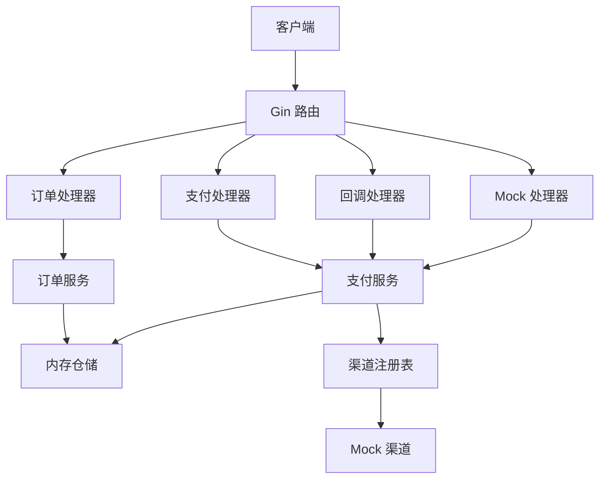
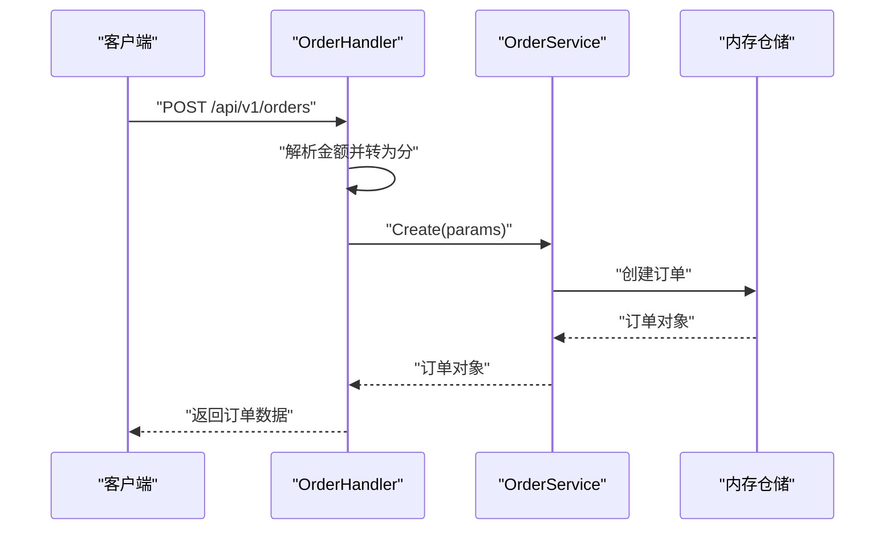
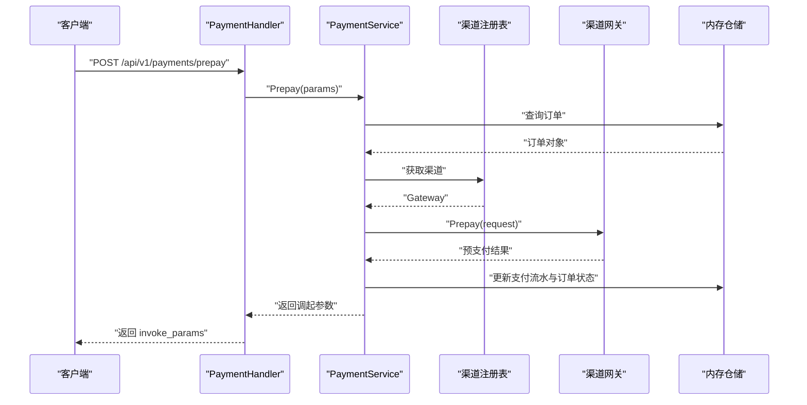
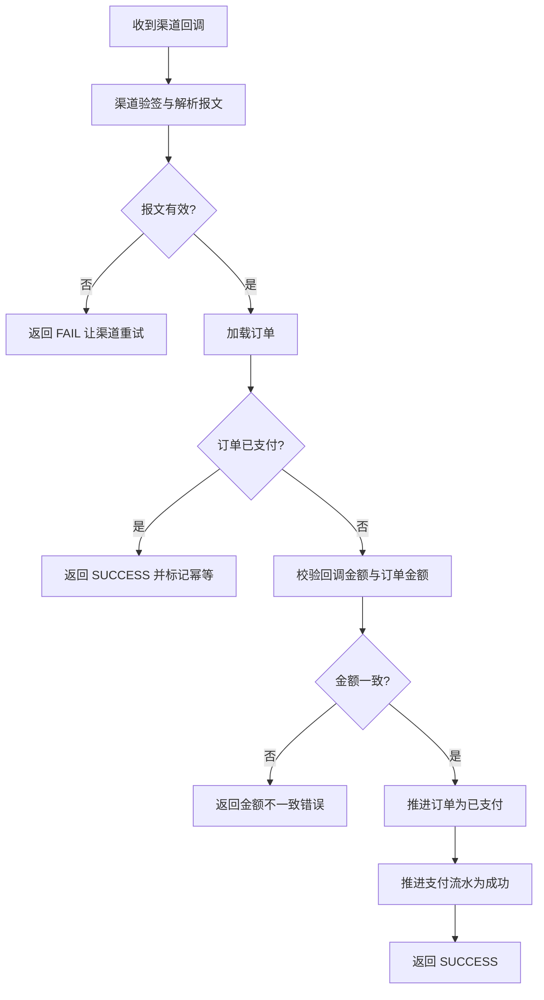

# 快速开始

<cite>
**本文引用的文件**   
- [README.md](file://README.md)
- [Makefile](file://Makefile)
- [Dockerfile](file://Dockerfile)
- [configs/config.yaml](file://configs/config.yaml)
- [cmd/server/main.go](file://cmd/server/main.go)
- [internal/app/app.go](file://internal/app/app.go)
- [internal/router/router.go](file://internal/router/router.go)
- [internal/handler/order_handler.go](file://internal/handler/order_handler.go)
- [internal/handler/payment_handler.go](file://internal/handler/payment_handler.go)
- [internal/handler/callback_handler.go](file://internal/handler/callback_handler.go)
- [internal/handler/mock_trigger.go](file://internal/handler/mock_trigger.go)
- [internal/service/order_service.go](file://internal/service/order_service.go)
- [internal/service/payment_service.go](file://internal/service/payment_service.go)
</cite>

## 目录
1. [简介](#简介)
2. [环境准备](#环境准备)
3. [配置文件说明](#配置文件说明)
4. [Makefile 命令速查](#makefile-命令速查)
5. [本地运行与 Docker 运行](#本地运行与-docker-运行)
6. [全链路业务流程演示](#全链路业务流程演示)
7. [debug 模式与 release 模式](#debug-模式与-release-模式)
8. [为什么当前只能以 mock 渠道运行](#为什么当前只能以-mock-渠道运行)
9. [接口清单与响应约定](#接口清单与响应约定)
10. [常见问题排查](#常见问题排查)
11. [架构总览](#架构总览)
12. [结论与建议](#结论与建议)

## 简介
本项目是一个 Go + Gin 的支付服务骨架，目标是让开发者在几分钟内跑通「创建订单 → 发起支付 → 模拟回调 → 查询结果」的全链路流程。它用内存仓储承载订单和支付流水，通过 `channel.Gateway` 抽象层把支付渠道差异收敛到统一接口之后，并预留了微信支付接入位置。

当前版本已完成分层结构、领域状态机、内存仓储、渠道抽象层与 mock 实现、业务幂等与金额校验、HTTP 接入层、依赖装配、工程化脚本与文档；尚未完成真实微信支付对接、数据库持久化、测试、鉴权与限流。因此，**本地联调请使用默认的 debug 模式并以 mock 渠道运行**。

**章节来源**
- [README.md:1-12](file://README.md#L1-L12)

## 环境准备
### 安装 Go
项目使用 Go 工具链进行编译与运行。若本机未安装 Go，请先安装 Go 并确保可执行路径可用。项目中 Makefile 会优先使用 PATH 中的 `go`，否则回退到 `/usr/local/go/bin/go`，因此推荐把 Go 加入 PATH。

常见情况：
- 已安装但未加入 PATH：需要导出 PATH，例如 `export PATH=$PATH:/usr/local/go/bin`。
- CI 或容器环境：通常已有 PATH，直接调用 `make` 即可。

### 安装 Docker（可选）
如果希望以镜像方式运行，请确保系统已安装 Docker 并能正常执行 `docker build` 与 `docker run`。

### 检查端口占用
默认监听 `0.0.0.0:8080`。启动前建议确认本机没有其它进程占用该端口，避免 HTTP 服务启动失败。

**章节来源**
- [Makefile:7-8](file://Makefile#L7-L8)
- [configs/config.yaml:9-22](file://configs/config.yaml#L9-L22)
- [cmd/server/main.go:61-87](file://cmd/server/main.go#L61-L87)

## 配置文件说明
配置文件模板位于 `configs/config.yaml`，不包含任何真实密钥，可直接提交进仓库。敏感项如 APIv3 密钥应通过环境变量注入。

关键配置项含义如下：

| 配置路径 | 环境变量 | 默认值 | 说明 |
|---|---|---|---|
| `server.mode` | `PAYMENT_SERVER_MODE` | `debug` | 支持 `debug`、`release`、`test`。release 下不注册 mock 路由，且对回调地址与安全做更强校验。 |
| `server.host` | `PAYMENT_SERVER_HOST` | `0.0.0.0` | 服务监听地址。 |
| `server.port` | `PAYMENT_SERVER_PORT` | `8080` | 服务监听端口。 |
| `server.read_timeout` | — | `15s` | 读取整个请求的超时时间。 |
| `server.write_timeout` | — | `15s` | 写响应的超时时间。 |
| `server.shutdown_timeout` | — | `10s` | 优雅关闭等待存量请求处理完成的时长，必须小于编排系统的终止宽限期。 |
| `log.level` | `PAYMENT_LOG_LEVEL` | `info` | 日志级别。 |
| `log.format` | `PAYMENT_LOG_FORMAT` | `console` | 生产建议使用 `json`。 |
| `payment.default_channel` | `PAYMENT_DEFAULT_CHANNEL` | `mock` | 创建订单时未指定渠道使用的默认值。 |
| `payment.notify_base_url` | `PAYMENT_NOTIFY_BASE_URL` | `https://pay.example.com` | 回调地址域名前缀，需公网可达。 |
| `payment.out_trade_no_prefix` | — | `ORD` | 商户订单号前缀。 |
| `payment.payment_no_prefix` | — | `PAY` | 支付流水号前缀。 |
| `channels.wechatpay.enabled` | — | `false` | 微信支付渠道开关，骨架阶段保持关闭。 |

注意：
- 配置优先级为：**环境变量 > yaml 文件 > 代码默认值**。
- `WECHATPAY_API_V3_KEY` 是刻意设计为只能通过环境变量注入的配置项，yaml 中不会暴露对应字段，防止误提交密钥。
- release 模式下，若 `payment.notify_base_url` 不是 HTTPS 开头，启动会失败。

**章节来源**
- [configs/config.yaml:1-61](file://configs/config.yaml#L1-L61)
- [README.md:215-238](file://README.md#L215-L238)

## Makefile 命令速查
项目提供统一的 Makefile 目标，所有构建与运行命令都通过 `$(GO)` 调用工具链，避免裸写 `go` 导致的环境差异。

| 命令 | 作用 | 说明 |
|---|---|---|
| `make help` | 列出全部可用目标 | 适合首次使用时查看有哪些命令。 |
| `make check` | 提交前自检 | 执行格式检查、静态检查与编译。 |
| `make tidy` | 整理依赖 | 同步 `go.mod` 与 `go.sum`。 |
| `make build` | 编译二进制 | 输出到 `bin/payment-server`，启用静态链接。 |
| `make run` | 本地前台运行 | 直接启动服务，Ctrl-C 触发优雅关闭。 |
| `make test` | 运行测试 | 带竞态检测。当前仓库没有 `_test.go`，会提示无测试包。 |
| `make cover` | 生成覆盖率 | 输出 `coverage.out` 并打印函数级覆盖率摘要。 |
| `make clean` | 清理构建产物 | 删除 `bin/` 与 `coverage.out`。 |
| `make docker-build` | 构建镜像 | 使用 `Dockerfile` 构建 `payment-server:latest`。 |

构建产物特点：
- 使用 `CGO_ENABLED=0` 静态编译，便于放入 alpine 或更小的基础镜像。
- 使用 `-trimpath -ldflags "-s -w"` 去掉调试信息和本地路径，减少产物体积与泄露风险。

**章节来源**
- [Makefile:1-70](file://Makefile#L1-L70)

## 本地运行与 Docker 运行
### 本地运行
最简步骤：
1. 确保 Go 可用。
2. 执行 `make build` 或 `make run`。
3. 看到类似日志后确认服务就绪：`服务启动 addr=0.0.0.0:8080 mode=debug default_channel=mock`。
4. 访问健康探针：`curl localhost:8080/readyz`。

完整示例：
```bash
export PATH=$PATH:/usr/local/go/bin
make build
./bin/payment-server -config configs/config.yaml
```

或直接前台运行：
```bash
make run
```

### Docker 运行
构建镜像：
```bash
make docker-build
```

运行镜像：
```bash
docker run -p 8080:8080 payment-server:latest
```

如果需要挂载证书目录（生产场景），可使用只读挂载：
```bash
docker run -v "$PWD/certs:/app/certs:ro" --env-file .env payment-server:latest
```

镜像特点：
- 多阶段构建：先使用 `golang:1.26-alpine` 编译，再拷贝到 `alpine:3.20` 运行。
- 非 root 用户运行。
- 包含 `/healthz` 的 HEALTHCHECK。
- 刻意不拷贝 `certs/`，证书通过部署时挂载注入。

**章节来源**
- [README.md:13-36](file://README.md#L13-L36)
- [Dockerfile:1-56](file://Dockerfile#L1-L56)

## 全链路业务流程演示
以下演示基于默认本地地址 `http://localhost:8080`。你可以把 `BASE` 替换成实际地址。

### 第一步：创建订单
```bash
BASE=http://localhost:8080

curl -s -X POST $BASE/api/v1/orders \
  -H 'Content-Type: application/json' \
  -d '{"subject":"测试商品","amount":"19.99","openid":"oTest123456"}'
```

预期行为：
- 返回成功响应。
- 订单状态为 `CREATED`。
- 记录 `out_trade_no`，后续步骤都需要用到这个值。

### 第二步：发起支付
```bash
NO=<上一步返回的 out_trade_no>

curl -s -X POST $BASE/api/v1/payments/prepay \
  -H 'Content-Type: application/json' \
  -d "{\"out_trade_no\":\"$NO\"}"
```

预期行为：
- 返回前端调起支付所需的参数。
- 订单状态从 `CREATED` 推进到 `PAYING`。
- 支付流水进入预支付状态。

### 第三步：模拟支付成功回调
```bash
curl -s -X POST $BASE/api/v1/mock/pay-success \
  -H 'Content-Type: application/json' \
  -d "{\"out_trade_no\":\"$NO\"}"
```

预期行为：
- 模拟一次支付成功通知。
- 订单状态变为已支付。
- 如果是重复调用，会返回幂等标记，表示本次没有重复推进状态。

### 第四步：查询支付结果
```bash
curl -s $BASE/api/v1/payments/$NO
```

预期行为：
- 返回订单状态与支付流水。
- 订单状态为 `PAID`。
- 支付流水状态为 `SUCCESS`。

### 验证幂等
再次调用模拟回调：
```bash
curl -s -X POST $BASE/api/v1/mock/pay-success \
  -H 'Content-Type: application/json' \
  -d "{\"out_trade_no\":\"$NO\"}"
```

预期行为：
- 返回幂等标记为 true。
- 订单不会被重复推进。

### 验证金额不一致被拒绝
```bash
curl -s -X POST $BASE/api/v1/mock/pay-success \
  -H 'Content-Type: application/json' \
  -d "{\"out_trade_no\":\"$NO\",\"amount_fen\":1}"
```

预期行为：
- 返回错误。
- 订单保持 `PAYING`。
- 错误码表示回调金额与订单金额不一致。

**章节来源**
- [README.md:85-134](file://README.md#L85-L134)
- [internal/handler/order_handler.go:23-60](file://internal/handler/order_handler.go#L23-L60)
- [internal/handler/payment_handler.go:26-51](file://internal/handler/payment_handler.go#L26-L51)
- [internal/handler/mock_trigger.go:43-117](file://internal/handler/mock_trigger.go#L43-L117)
- [internal/service/payment_service.go:258-379](file://internal/service/payment_service.go#L258-L379)

## debug 模式与 release 模式
### debug 模式
- 适合本地开发与联调。
- 注册 mock 渠道。
- 注册 `/api/v1/mock/pay-success` 调试接口。
- 允许跨域，方便前端本地开发。
- 日志格式默认为 console，便于终端阅读。

### release 模式
- 适合生产环境。
- **不注册 mock 渠道**。
- **不注册 `/api/v1/mock/pay-success`**。
- 强制校验回调地址为 HTTPS。
- 默认不开放跨域。
- 日志格式建议改为 json，便于采集系统解析。

### 为什么当前 release 模式无法启动
当前仓库只有 mock 渠道实现，微信支付渠道尚未实现。release 模式下 mock 渠道被刻意禁用，而微信支付又不可用，因此没有任何可用渠道。启动时会明确报错，提示本地联调使用 debug 模式，上线前需要先实现微信支付渠道。

**章节来源**
- [configs/config.yaml:9-13](file://configs/config.yaml#L9-L13)
- [internal/app/app.go:108-151](file://internal/app/app.go#L108-L151)
- [README.md:5-12](file://README.md#L5-L12)

## 为什么当前只能以 mock 渠道运行
原因很直接：
1. 项目当前只实现了 mock 渠道。
2. 微信支付渠道目录只有占位文档，没有真实 Gateway 实现。
3. 如果配置 `channels.wechatpay.enabled=true`，启动会直接失败，而不是静默跳过。
4. 如果配置 `payment.default_channel=wechatpay`，但渠道未注册，也会启动失败。
5. 如果配置 `server.mode=release`，mock 渠道会被禁用，而微信支付又不可用，最终没有可用渠道。

因此，新手第一次运行应保持：
- `server.mode=debug`
- `payment.default_channel=mock`
- `channels.wechatpay.enabled=false`

**章节来源**
- [README.md:5-12](file://README.md#L5-L12)
- [internal/app/app.go:108-151](file://internal/app/app.go#L108-L151)

## 接口清单与响应约定
### 对外接口
| 方法 | 路径 | 说明 |
|---|---|---|
| `GET` | `/healthz` | 存活探针，不检查依赖。 |
| `GET` | `/readyz` | 就绪探针，无可用渠道时返回 503。 |
| `POST` | `/api/v1/orders` | 创建订单。 |
| `GET` | `/api/v1/orders/:out_trade_no` | 查询订单。 |
| `POST` | `/api/v1/payments/prepay` | 发起支付，返回前端调起参数。 |
| `GET` | `/api/v1/payments/:out_trade_no` | 查询支付状态，`?sync=true` 时主动查渠道。 |
| `POST` | `/api/v1/callbacks/wechatpay` | 渠道异步回调入口。 |
| `POST` | `/api/v1/mock/pay-success` | 模拟支付成功回调，仅非 release 模式注册。 |

### 统一响应体
业务接口统一返回：
```json
{"code": 0, "message": "ok", "data": {}, "request_id": "..."}
```

其中：
- `code=0` 表示成功。
- HTTP 状态码用于网关与监控判断。
- 业务码用于客户端分支逻辑。
- `request_id` 贯穿请求链路，便于排查。

### 渠道回调例外
渠道回调接口不按统一响应体应答，而是按微信支付规范返回：
- 成功：`{"code":"SUCCESS","message":"成功"}`
- 失败：`{"code":"FAIL","message":"失败原因"}`

这是为了避免微信判定通知失败后持续重试。

**章节来源**
- [README.md:64-84](file://README.md#L64-L84)
- [internal/router/router.go:15-121](file://internal/router/router.go#L15-L121)
- [internal/handler/callback_handler.go:14-86](file://internal/handler/callback_handler.go#L14-L86)

## 常见问题排查
### 端口冲突
现象：
- 启动时报 HTTP 服务异常退出。
- 日志中出现端口绑定失败。

排查方法：
1. 检查本机是否已有进程占用 8080。
2. 修改 `server.port` 或通过环境变量 `PAYMENT_SERVER_PORT` 覆盖。
3. 如果使用 Docker，确认宿主端口未被占用。

根因参考：
- HTTP Server 启动失败会直接返回错误。
- 日志中会记录异常。

**章节来源**
- [cmd/server/main.go:74-96](file://cmd/server/main.go#L74-L96)
- [configs/config.yaml:14-22](file://configs/config.yaml#L14-L22)

### 权限问题
现象：
- 低权限用户无法绑定 8080 以外的特权端口。
- 容器中以非 root 用户运行时无法写入某些目录。

排查方法：
1. 普通端口直接使用。
2. 特权端口需要提升权限或使用反向代理。
3. 容器内不要写入敏感文件或证书，证书应通过只读挂载。

**章节来源**
- [Dockerfile:27-45](file://Dockerfile#L27-L45)

### 回调地址不可达
现象：
- 用户已扣款，但订单一直停留在 `PAYING`。
- 日志中出现回调失败或找不到路径。

排查方法：
1. 确认 `payment.notify_base_url` 是公网可达的 HTTPS 地址。
2. 确认回调路径与商户平台配置一致。
3. 本地联调可使用内网穿透工具暴露公网地址。
4. release 模式下必须以 HTTPS 开头。

**章节来源**
- [configs/config.yaml:30-36](file://configs/config.yaml#L30-L36)
- [internal/router/router.go:106-112](file://internal/router/router.go#L106-L112)

### 金额精度错误
现象：
- 创建订单时报金额不合法。
- 回调金额与订单金额不一致。

排查方法：
1. 金额最多保留两位小数。
2. 服务端内部使用 int64「分」存储，对外展示用字符串「元」。
3. 不要在前端用 float64 做金额计算。

**章节来源**
- [README.md:118-134](file://README.md#L118-L134)
- [internal/handler/order_handler.go:33-42](file://internal/handler/order_handler.go#L33-L42)
- [internal/service/payment_service.go:320-333](file://internal/service/payment_service.go#L320-L333)

### 重复回调导致状态异常
现象：
- 同一笔订单收到多次回调。
- 订单状态被重复推进。

排查方法：
1. 确认回调接口返回的是渠道规范的成功响应。
2. 确认幂等逻辑生效。
3. 检查并发回调是否命中幂等分支。

**章节来源**
- [internal/handler/callback_handler.go:55-86](file://internal/handler/callback_handler.go#L55-L86)
- [internal/service/payment_service.go:301-379](file://internal/service/payment_service.go#L301-L379)

### release 模式启动失败
现象：
- 设置 `server.mode=release` 后启动失败。
- 报错提到没有可用支付渠道。

排查方法：
1. 本地联调改回 `debug`。
2. 上线前实现微信支付渠道。
3. 将 `payment.default_channel` 改为 `wechatpay`。
4. 完成微信支付接入前的准备工作。

**章节来源**
- [internal/app/app.go:134-151](file://internal/app/app.go#L134-L151)
- [README.md:274-284](file://README.md#L274-L284)

## 架构总览
下图展示从 HTTP 请求到业务处理的整体流程。



**图表来源**
- [internal/router/router.go:50-121](file://internal/router/router.go#L50-L121)
- [internal/handler/order_handler.go:13-60](file://internal/handler/order_handler.go#L13-L60)
- [internal/handler/payment_handler.go:16-51](file://internal/handler/payment_handler.go#L16-L51)
- [internal/handler/callback_handler.go:34-49](file://internal/handler/callback_handler.go#L34-L49)
- [internal/handler/mock_trigger.go:29-51](file://internal/handler/mock_trigger.go#L29-L51)
- [internal/service/order_service.go:21-72](file://internal/service/order_service.go#L21-L72)
- [internal/service/payment_service.go:34-108](file://internal/service/payment_service.go#L34-L108)
- [internal/app/app.go:57-105](file://internal/app/app.go#L57-L105)

### 创建订单流程


**图表来源**
- [internal/handler/order_handler.go:23-60](file://internal/handler/order_handler.go#L23-L60)
- [internal/service/order_service.go:67-109](file://internal/service/order_service.go#L67-L109)

### 发起支付流程


**图表来源**
- [internal/handler/payment_handler.go:26-51](file://internal/handler/payment_handler.go#L26-L51)
- [internal/service/payment_service.go:99-226](file://internal/service/payment_service.go#L99-L226)

### 回调处理流程


**图表来源**
- [internal/handler/callback_handler.go:44-86](file://internal/handler/callback_handler.go#L44-L86)
- [internal/service/payment_service.go:258-379](file://internal/service/payment_service.go#L258-L379)

## 结论与建议
对于新手来说，完成第一次运行的关键是：
1. 安装 Go 并确保 PATH 正确。
2. 使用 `make run` 或 `make build` 启动服务。
3. 保持 `server.mode=debug` 与 `payment.default_channel=mock`。
4. 按照「创建订单 → 发起支付 → 模拟回调 → 查询结果」的顺序调用接口。
5. 遇到问题先看日志中的 `request_id`，再对照错误码定位。

后续演进建议：
- 实现微信支付渠道后，再把 `payment.default_channel` 改为 `wechatpay`。
- 将 `server.mode` 改为 `release`。
- 接入数据库持久化。
- 补充单元测试与集成测试。
- 增加鉴权、限流与链路追踪。
- 使用定时任务扫描超时订单，作为回调丢失的兜底机制。

**章节来源**
- [README.md:286-294](file://README.md#L286-L294)
- [internal/app/app.go:1-12](file://internal/app/app.go#L1-L12)