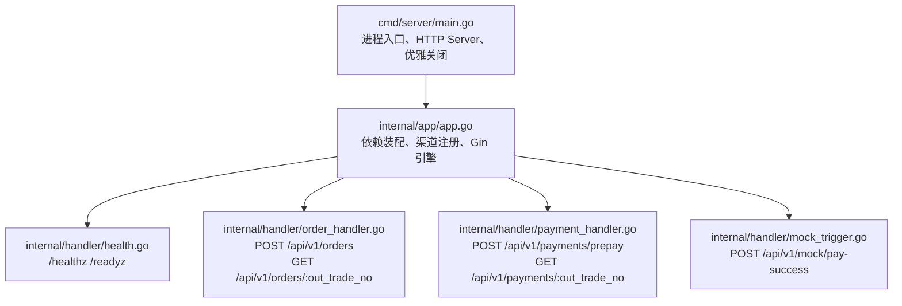
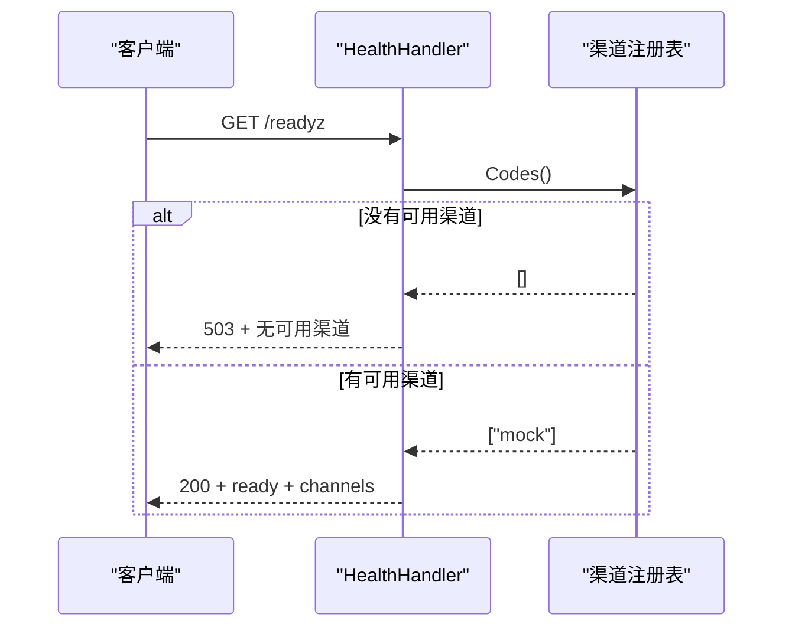
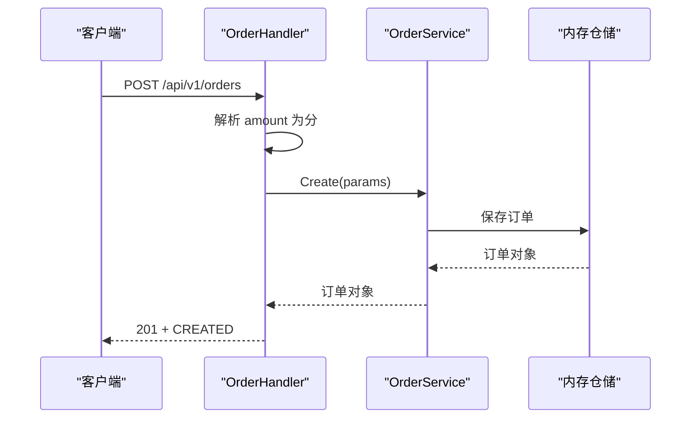
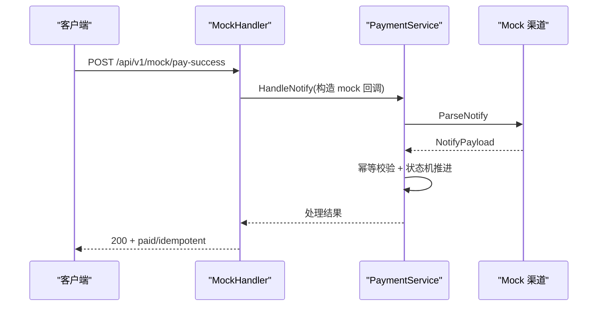

# 快速开始

<cite>
**本文引用的文件**   
- [README.md](file://README.md)
- [Makefile](file://Makefile)
- [Dockerfile](file://Dockerfile)
- [cmd/server/main.go](file://cmd/server/main.go)
- [configs/config.yaml](file://configs/config.yaml)
- [internal/app/app.go](file://internal/app/app.go)
- [internal/handler/health.go](file://internal/handler/health.go)
- [internal/handler/order_handler.go](file://internal/handler/order_handler.go)
- [internal/handler/payment_handler.go](file://internal/handler/payment_handler.go)
- [internal/handler/mock_trigger.go](file://internal/handler/mock_trigger.go)
</cite>

## 目录
1. [简介](#简介)
2. [环境准备](#环境准备)
3. [编译与运行](#编译与运行)
4. [验证服务就绪](#验证服务就绪)
5. [端到端 API 调用示例](#端到端-api-调用示例)
6. [关键概念说明](#关键概念说明)
7. [Docker 部署](#docker-部署)
8. [常见错误排查](#常见错误排查)
9. [架构总览](#架构总览)
10. [结论](#结论)

## 简介
本指南面向首次接触该支付服务的开发者，目标是在 **5 分钟内** 完成本地环境准备、编译构建、前台运行、健康检查验证，并跑通「创建订单 → 发起支付 → 模拟支付成功 → 查询结果」的完整链路。服务当前以内存仓储和 `mock` 渠道运行，适合联调与演示；真实微信支付接入点已在代码中预留。

## 环境准备
### 必需条件
- Go 工具链（建议版本不低于仓库声明）
- Make 命令
- Docker（可选，用于镜像构建与容器运行）

### PATH 配置
如果本机 Go 安装在 `/usr/local/go/bin` 且未加入 PATH，请先执行：
```bash
export PATH=$PATH:/usr/local/go/bin
```
确认安装可用：
```bash
go version
make help
```
预期输出应包含 `help`、`build`、`run`、`docker-build` 等目标列表。若提示 `command not found: go`，说明 PATH 未正确配置。

**章节来源**
- [README.md:15-27](file://README.md#L15-L27)
- [Makefile:7-25](file://Makefile#L7-L25)

## 编译与运行
### 方式一：前台运行（推荐新手）
```bash
make run
```
成功标志：
- 控制台出现类似日志：`服务启动 addr=0.0.0.0:8080 mode=debug default_channel=mock`
- 进程保持前台运行，按 `Ctrl-C` 触发优雅关闭

### 方式二：先编译再运行
```bash
make build
./bin/payment-server -config configs/config.yaml
```
成功标志：
- 终端打印：`已生成 bin/payment-server`
- 随后出现服务启动日志，端口为 `8080`

注意：
- 默认使用 `configs/config.yaml`
- 二进制通过静态链接构建，不依赖 glibc
- 启动参数 `-config` 可指定自定义配置文件路径

**章节来源**
- [README.md:15-27](file://README.md#L15-L27)
- [Makefile:50-56](file://Makefile#L50-L56)
- [cmd/server/main.go:41-43](file://cmd/server/main.go#L41-L43)

## 验证服务就绪
服务提供两个探针：
- `/healthz`：存活探针，只要进程能处理请求就返回成功
- `/readyz`：就绪探针，没有可用支付渠道时返回 503

快速验证：
```bash
curl localhost:8080/readyz
```
成功标志：
- HTTP 状态码为 `200`
- 响应中包含 `status=ready` 以及可用渠道列表，例如 `channels=["mock"]`

若返回 503，通常表示：
- 当前模式为 `release`，但 mock 渠道未注册
- 或配置了 `wechatpay` 但未实现对应渠道

**章节来源**
- [README.md:29-36](file://README.md#L29-L36)
- [internal/handler/health.go:49-77](file://internal/handler/health.go#L49-L77)

## 端到端 API 调用示例
以下流程基于 `mock` 渠道，无需真实商户号即可跑通。

### 步骤 1：创建订单
```bash
BASE=http://localhost:8080

curl -s -X POST $BASE/api/v1/orders \
  -H 'Content-Type: application/json' \
  -d '{"subject":"测试商品","amount":"19.99","openid":"oTest123456"}'
```
预期结果：
- HTTP 状态码 `201`
- 响应体中的 `data.status` 为 `CREATED`
- 记录返回的 `out_trade_no`，后续步骤需要它

### 步骤 2：发起支付
```bash
NO=<上一步返回的 out_trade_no>

curl -s -X POST $BASE/api/v1/payments/prepay \
  -H 'Content-Type: application/json' \
  -d "{\"out_trade_no\":\"$NO\"}"
```
预期结果：
- HTTP 状态码 `200`
- 响应体中的 `data.trade_type` 为 `JSAPI`
- `data.invoke_params.paySign` 为模拟签名，不可用于生产

此时订单状态会推进到 `PAYING`，支付流水进入预支付阶段。

### 步骤 3：模拟支付成功回调
```bash
curl -s -X POST $BASE/api/v1/mock/pay-success \
  -H 'Content-Type: application/json' \
  -d "{\"out_trade_no\":\"$NO\"}"
```
预期结果：
- HTTP 状态码 `200`
- 响应体中的 `data.paid` 为 `true`
- 首次调用时 `data.idempotent=false`，重复调用时 `idempotent=true`

### 步骤 4：查询支付状态
```bash
curl -s $BASE/api/v1/payments/$NO
```
预期结果：
- HTTP 状态码 `200`
- 订单状态为 `PAID`
- 支付流水状态为 `SUCCESS`

### 幂等性验证
再次调用模拟支付成功接口：
```bash
curl -s -X POST $BASE/api/v1/mock/pay-success \
  -H 'Content-Type: application/json' \
  -d "{\"out_trade_no\":\"$NO\"}"
```
预期结果：
- `data.idempotent=true`
- 订单不会被重复推进，避免重复入账

**章节来源**
- [README.md:87-134](file://README.md#L87-L134)
- [internal/handler/order_handler.go:23-59](file://internal/handler/order_handler.go#L23-L59)
- [internal/handler/payment_handler.go:26-50](file://internal/handler/payment_handler.go#L26-L50)
- [internal/handler/mock_trigger.go:43-116](file://internal/handler/mock_trigger.go#L43-L116)

## 关键概念说明
### 金额单位转换：元 → 分
- 对外请求使用字符串形式的「元」，例如 `"19.99"`
- 服务端在接入层将元转换为 `int64` 类型的「分」存储
- 这样做是为了避免浮点数精度问题，防止「差一分钱」类资金事故
- 响应中同时暴露 `amount`（元，字符串）和 `amount_fen`（分，整数），减少调用方自行转换出错的风险

**章节来源**
- [README.md:90-94](file://README.md#L90-L94)
- [README.md:203-205](file://README.md#L203-L205)
- [internal/handler/order_handler.go:33-46](file://internal/handler/order_handler.go#L33-L46)

### 订单号生成
- 订单号由服务端生成，调用方不应传入
- 默认前缀为 `ORD`，最终长度受限制
- 生成逻辑与服务内部 ID 生成器配合，保证唯一性与可读性

**章节来源**
- [configs/config.yaml:37-40](file://configs/config.yaml#L37-L40)
- [internal/app/app.go:69-74](file://internal/app/app.go#L69-L74)

### Mock 渠道的作用
- `mock` 渠道用于本地联调，不需要真实商户号、证书或公网回调域名
- 它能模拟预支付、回调、查单等核心路径
- 仅在非 `release` 模式下注册，生产环境必须禁用
- 暴露的 `/api/v1/mock/pay-success` 是调试接口，允许把任意订单标记为已支付，因此安全风险很高

**章节来源**
- [README.md:11-12](file://README.md#L11-L12)
- [README.md:75](file://README.md#L75)
- [internal/app/app.go:112-121](file://internal/app/app.go#L112-L121)
- [internal/handler/mock_trigger.go:29-33](file://internal/handler/mock_trigger.go#L29-L33)

## Docker 部署
### 构建镜像
```bash
make docker-build
```
成功标志：
- 终端输出镜像构建过程
- 最终生成名为 `payment-server:latest` 的镜像

### 运行容器
```bash
docker run -p 8080:8080 payment-server:latest
```
成功标志：
- 容器正常启动
- 日志中出现服务启动信息
- 可通过 `curl localhost:8080/readyz` 验证

### 挂载证书（生产场景）
```bash
docker run -v "$PWD/certs:/app/certs:ro" --env-file .env payment-server:latest
```
注意事项：
- `certs/` 目录被刻意排除进镜像层，私钥只能通过只读挂载注入
- 敏感配置优先从环境变量注入，不要写死在镜像或配置文件中

**章节来源**
- [README.md:31-36](file://README.md#L31-L36)
- [README.md:268-272](file://README.md#L268-L272)
- [Dockerfile:21-55](file://Dockerfile#L21-L55)
- [Makefile:68-69](file://Makefile#L68-L69)

## 常见错误排查
### 端口占用
现象：
- 启动后立即退出
- 日志中出现 HTTP 服务异常退出

原因：
- 本机已有进程监听 `8080`
- 或权限不足导致无法绑定地址

解决：
- 修改 `configs/config.yaml` 中的 `server.port`
- 或使用其他空闲端口运行
- 查看日志中的 `addr` 字段确认实际监听地址

**章节来源**
- [cmd/server/main.go:75-86](file://cmd/server/main.go#L75-L86)
- [configs/config.yaml:14-15](file://configs/config.yaml#L14-L15)

### 配置错误
现象：
- 启动失败，直接报错
- 日志显示加载配置失败或初始化应用失败

常见原因：
- `server.mode` 设置为 `release`，但没有可用的真实支付渠道
- `payment.default_channel` 指向未注册的渠道
- 启用了微信支付但凭据不完整

解决：
- 本地联调保持 `server.mode=debug`
- 确保 `payment.default_channel=mock`
- 接入微信支付后，按文档补齐凭据并启用对应渠道

**章节来源**
- [README.md:11-12](file://README.md#L11-L12)
- [internal/app/app.go:123-149](file://internal/app/app.go#L123-L149)
- [configs/config.yaml:10-13](file://configs/config.yaml#L10-L13)

### 模式设置问题
现象：
- `/readyz` 返回 503
- 日志提示没有可用支付渠道

原因：
- `release` 模式不会注册 mock 路由和 mock 渠道
- 当前仓库尚未实现微信支付渠道

解决：
- 开发环境使用 `debug`
- 上线前必须先实现微信支付渠道并完成接入清单

**章节来源**
- [README.md:11-12](file://README.md#L11-L12)
- [internal/app/app.go:137-149](file://internal/app/app.go#L137-L149)
- [internal/handler/health.go:55-64](file://internal/handler/health.go#L55-L64)

### 金额校验失败
现象：
- 创建订单时报错
- 模拟回调时报错

常见原因：
- 金额小数位超过两位
- 回调金额与订单金额不一致

解决：
- 确保传入金额为最多两位小数的字符串
- 核对回调金额是否与下单金额一致

**章节来源**
- [README.md:120-129](file://README.md#L120-L129)
- [internal/handler/order_handler.go:36-41](file://internal/handler/order_handler.go#L36-L41)

### 回调验签与安全
现象：
- 真实渠道回调被拒绝
- 业务逻辑未按预期推进

原则：
- 真实渠道回调必须验签与解密
- 回调报文金额优先于内部记录金额
- 日志不得打印密钥、证书内容或完整回调报文

**章节来源**
- [README.md:240-246](file://README.md#L240-L246)

## 架构总览
下图展示从进程入口到健康检查、订单与支付接口的整体关系。



**图表来源**
- [cmd/server/main.go:31-87](file://cmd/server/main.go#L31-L87)
- [internal/app/app.go:45-105](file://internal/app/app.go#L45-L105)
- [internal/handler/health.go:24-77](file://internal/handler/health.go#L24-L77)
- [internal/handler/order_handler.go:13-78](file://internal/handler/order_handler.go#L13-L78)
- [internal/handler/payment_handler.go:16-85](file://internal/handler/payment_handler.go#L16-L85)
- [internal/handler/mock_trigger.go:29-116](file://internal/handler/mock_trigger.go#L29-L116)

### 健康检查流程


**图表来源**
- [internal/handler/health.go:49-77](file://internal/handler/health.go#L49-L77)
- [internal/app/app.go:108-151](file://internal/app/app.go#L108-L151)

### 创建订单流程


**图表来源**
- [internal/handler/order_handler.go:23-59](file://internal/handler/order_handler.go#L23-L59)

### 模拟支付成功流程


**图表来源**
- [internal/handler/mock_trigger.go:43-116](file://internal/handler/mock_trigger.go#L43-L116)

## 结论
通过以上步骤，你可以在 5 分钟内完成支付服务的本地运行与端到端验证。对于初学者，建议始终使用 `debug` 模式和 `mock` 渠道；对于生产环境，则必须先完成微信支付渠道实现、安全配置与回调域名准备，并确保 `/api/v1/mock/*` 不会暴露。服务的设计强调「带病不上线」：配置错误、渠道缺失、安全问题应在启动期或接入期直接暴露，而不是等到线上才被发现。