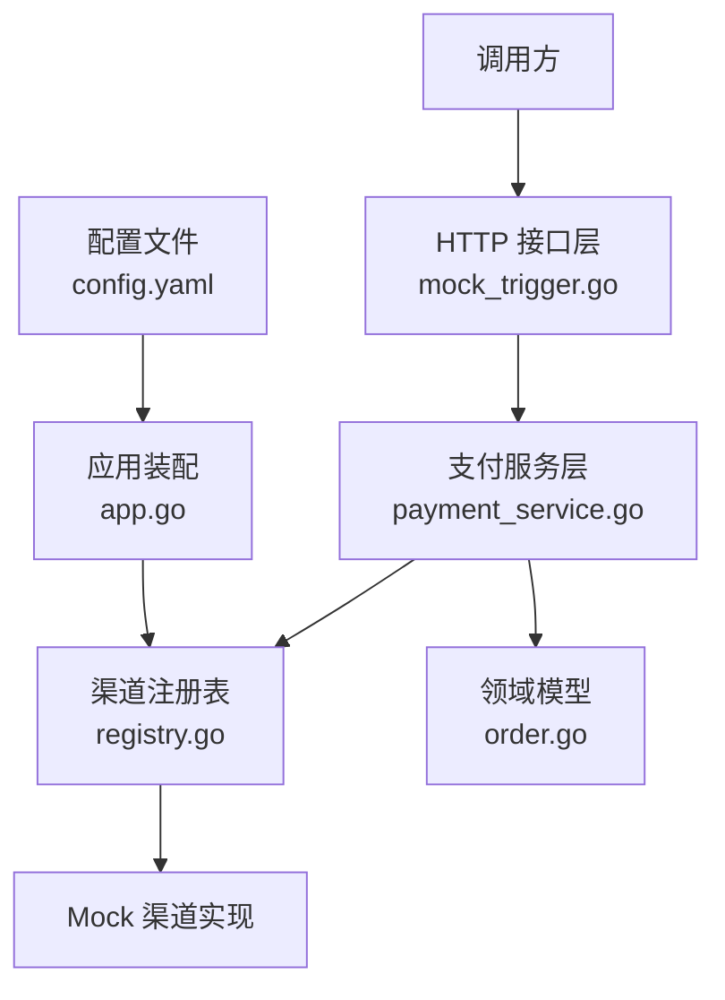
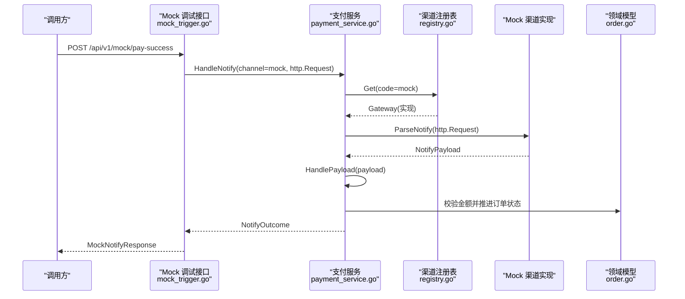
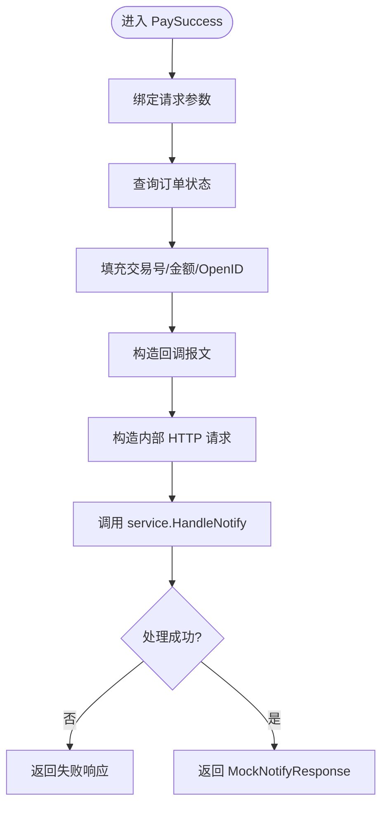
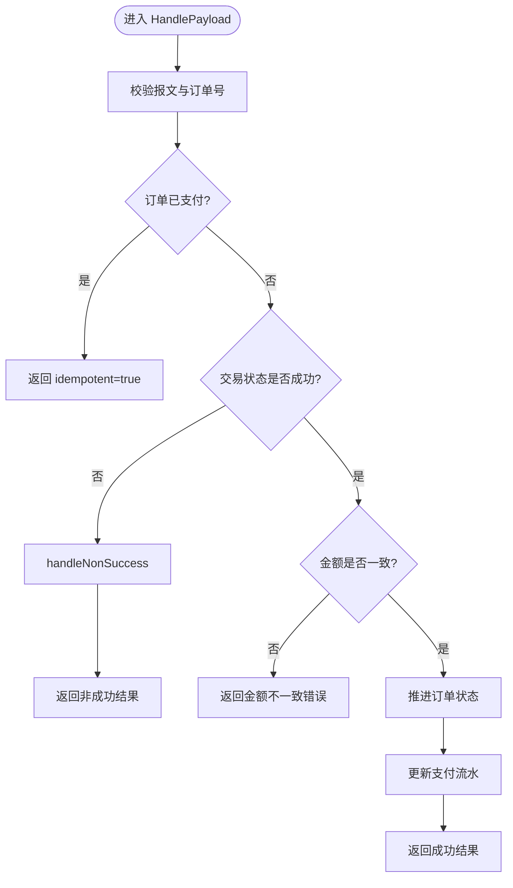
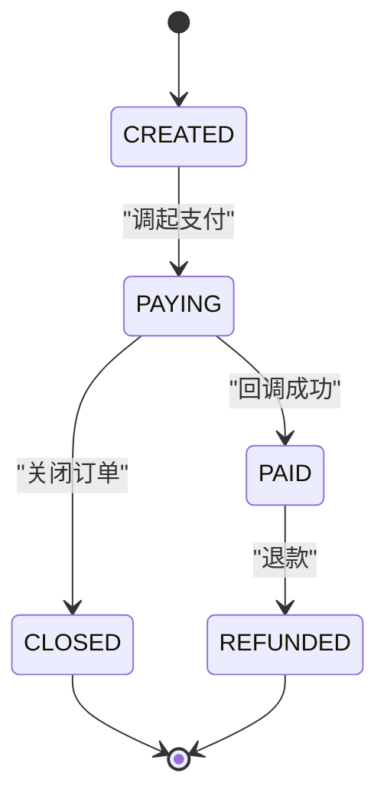
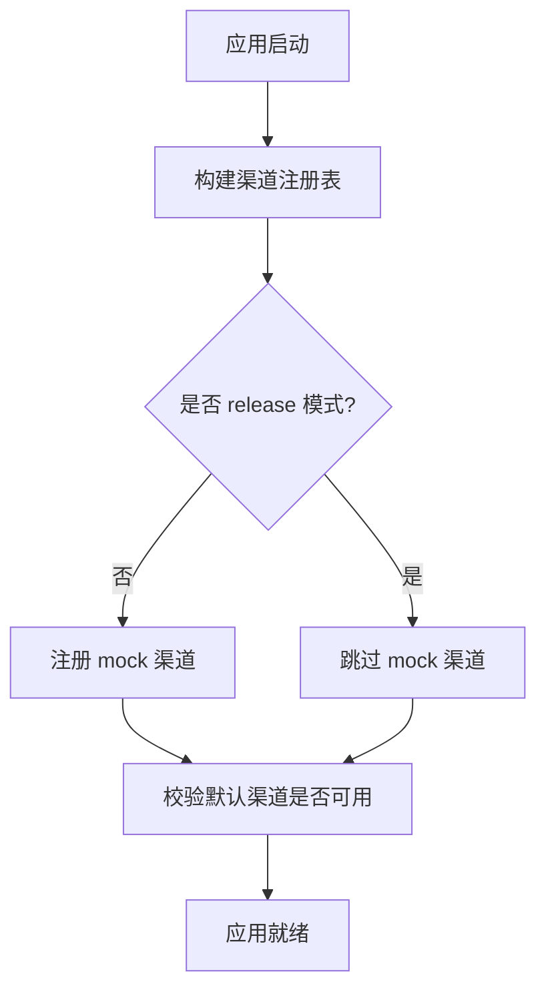
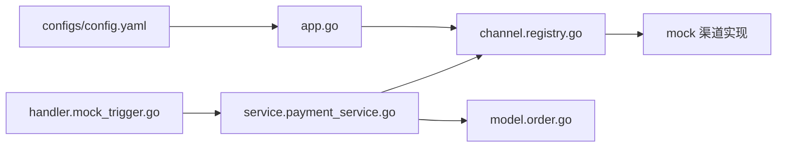

# Mock 渠道实现

<cite>
**本文引用的文件**   
- [internal/handler/mock_trigger.go](file://internal/handler/mock_trigger.go)
- [internal/app/app.go](file://internal/app/app.go)
- [configs/config.yaml](file://configs/config.yaml)
- [internal/dto/payment.go](file://internal/dto/payment.go)
- [internal/service/payment_service.go](file://internal/service/payment_service.go)
- [internal/model/order.go](file://internal/model/order.go)
- [internal/channel/registry.go](file://internal/channel/registry.go)
- [README.md](file://README.md)
</cite>

## 目录
1. [引言](#引言)
2. [项目结构定位](#项目结构定位)
3. [核心组件](#核心组件)
4. [架构总览](#架构总览)
5. [详细组件分析](#详细组件分析)
6. [依赖关系分析](#依赖关系分析)
7. [性能与可靠性特征](#性能与可靠性特征)
8. [配置方法](#配置方法)
9. [测试用例编写指南](#测试用例编写指南)
10. [使用示例与调试技巧](#使用示例与调试技巧)
11. [故障排查](#故障排查)
12. [结论](#结论)

## 引言
本文聚焦于支付服务中的 Mock 渠道实现，解释它如何在不依赖真实支付网关的前提下，模拟完整的支付流程：预支付、订单状态查询、回调通知触发与幂等处理。重点说明 `internal/handler/mock_trigger.go` 提供的测试辅助接口如何构造与真实渠道同构的回调请求，驱动业务层走完整执行路径；同时给出开发环境下的使用方法、配置方式、测试编写建议以及常见问题的排错思路。

## 项目结构定位
Mock 相关能力分布在以下位置：
- 调试入口：`internal/handler/mock_trigger.go`
- 应用装配与路由开关：`internal/app/app.go`
- 默认渠道与渠道注册：`configs/config.yaml`、`internal/channel/registry.go`
- 业务处理主流程：`internal/service/payment_service.go`
- 领域模型与状态机：`internal/model/order.go`
- DTO 定义：`internal/dto/payment.go`
- 使用说明与全链路演示：`README.md`



**图示来源**
- [internal/handler/mock_trigger.go:34-117](file://internal/handler/mock_trigger.go#L34-L117)
- [internal/service/payment_service.go:258-379](file://internal/service/payment_service.go#L258-L379)
- [internal/channel/registry.go:11-52](file://internal/channel/registry.go#L11-L52)
- [internal/model/order.go:20-50](file://internal/model/order.go#L20-L50)
- [configs/config.yaml:30-40](file://configs/config.yaml#L30-L40)
- [internal/app/app.go:108-151](file://internal/app/app.go#L108-L151)

**章节来源**
- [internal/handler/mock_trigger.go:1-118](file://internal/handler/mock_trigger.go#L1-L118)
- [internal/app/app.go:108-151](file://internal/app/app.go#L108-L151)
- [configs/config.yaml:30-40](file://configs/config.yaml#L30-L40)

## 核心组件
- Mock 调试处理器：提供 `/api/v1/mock/pay-success`，用于在本地或测试环境中模拟一次支付成功回调。
- 支付服务：负责解析渠道报文、校验金额、推进订单与支付流水状态、处理非成功通知、主动查单兜底。
- 渠道注册表：运行期管理可用渠道实现，Mock 渠道在非 release 模式下注册。
- 领域模型：封装订单状态机，确保非法流转无法发生。
- DTO：定义 Mock 回调请求与响应结构。

**章节来源**
- [internal/handler/mock_trigger.go:29-41](file://internal/handler/mock_trigger.go#L29-L41)
- [internal/service/payment_service.go:34-73](file://internal/service/payment_service.go#L34-L73)
- [internal/channel/registry.go:11-52](file://internal/channel/registry.go#L11-L52)
- [internal/model/order.go:20-50](file://internal/model/order.go#L20-L50)
- [internal/dto/payment.go:114-141](file://internal/dto/payment.go#L114-L141)

## 架构总览
Mock 渠道的核心价值是“让业务层在无需真实网关的情况下跑通完整流程”。其关键设计点包括：
- 不直接调用业务层的内部方法，而是构造一个与真实渠道回调同构的 HTTP 请求，再进入 `service.HandleNotify`，从而覆盖渠道报文的解析逻辑。
- 通过渠道注册表按编码选择具体渠道实现，Mock 渠道仅在非 release 模式启用。
- 业务层对回调进行幂等保护、金额校验、状态机推进和流水更新。



**图示来源**
- [internal/handler/mock_trigger.go:51-117](file://internal/handler/mock_trigger.go#L51-L117)
- [internal/service/payment_service.go:258-379](file://internal/service/payment_service.go#L258-L379)
- [internal/channel/registry.go:63-74](file://internal/channel/registry.go#L63-L74)
- [internal/model/order.go:132-143](file://internal/model/order.go#L132-L143)

## 详细组件分析

### Mock 调试处理器：`mock_trigger.go`
`MockHandler.PaySuccess` 是单元测试与端到端验证的关键入口。它的行为可以概括为：
1. 解析请求参数，包含商户订单号、可选的交易号、可选的金额、可选的 OpenID。
2. 先查询订单状态，用于校验订单存在并获取订单金额、OpenID 等上下文。
3. 构造一份与真实渠道回调同构的请求体，字段包括商户订单号、交易号、交易状态、金额、币种、成功时间、OpenID 等。
4. 通过 `http.NewRequestWithContext` 构造内部请求，设置 Content-Type。
5. 调用 `service.HandleNotify(channel.CodeMock, notifyReq)`，让渠道解析与业务处理都进入真实执行路径。
6. 返回 `MockNotifyResponse`，包含订单号、订单状态、是否已支付、交易号和幂等标志。

该接口的安全约束非常重要：它只能在非 release 模式下注册，因为暴露后等同于允许任何人把任意订单改成已支付。



**图示来源**
- [internal/handler/mock_trigger.go:51-117](file://internal/handler/mock_trigger.go#L51-L117)

**章节来源**
- [internal/handler/mock_trigger.go:20-27](file://internal/handler/mock_trigger.go#L20-L27)
- [internal/handler/mock_trigger.go:43-50](file://internal/handler/mock_trigger.go#L43-L50)
- [internal/handler/mock_trigger.go:51-117](file://internal/handler/mock_trigger.go#L51-L117)

### 支付服务：回调与状态推进
`PaymentService.HandleNotify` 接收渠道编码与原始 HTTP 请求，先从注册表取出对应渠道实现，再调用 `ParseNotify` 完成验签、解密与报文解析，最后交给 `HandlePayload` 统一处理。

`HandlePayload` 的核心逻辑包括：
- 校验报文是否为空、是否缺少商户订单号。
- 快速幂等判断：如果订单已是已支付，直接返回 `idempotent=true`。
- 非成功状态分支：关闭订单或标记支付流水失败，不同状态有不同处理策略。
- 金额校验：回调金额必须与订单金额一致，否则拒绝并返回错误。
- 推进订单状态：在并发场景下再次检查是否已被其他请求推进为已支付。
- 更新支付流水：根据交易号匹配流水，若找不到则记录告警但不阻断回调应答。



**图示来源**
- [internal/service/payment_service.go:277-379](file://internal/service/payment_service.go#L277-L379)
- [internal/service/payment_service.go:381-415](file://internal/service/payment_service.go#L381-L415)
- [internal/service/payment_service.go:417-453](file://internal/service/payment_service.go#L417-L453)

**章节来源**
- [internal/service/payment_service.go:258-275](file://internal/service/payment_service.go#L258-L275)
- [internal/service/payment_service.go:277-379](file://internal/service/payment_service.go#L277-L379)
- [internal/service/payment_service.go:381-453](file://internal/service/payment_service.go#L381-L453)

### 领域模型：订单状态机
订单状态机将合法流转显式列举，禁止非法跳转。Mock 渠道在支付成功后会调用 `MarkPaid`，由领域层保证状态从 PAYING 到 PAID 的合法性，并回填交易号与支付时间。



**图示来源**
- [internal/model/order.go:20-50](file://internal/model/order.go#L20-L50)
- [internal/model/order.go:122-143](file://internal/model/order.go#L122-L143)

**章节来源**
- [internal/model/order.go:20-50](file://internal/model/order.go#L20-L50)
- [internal/model/order.go:122-143](file://internal/model/order.go#L122-L143)

### 渠道注册表与 Mock 渠道启用
渠道注册表是运行期的渠道集合，支持并发安全的注册与查找。应用启动时，若非 release 模式，会注册 Mock 渠道；若 release 模式且没有真实渠道实现，则直接启动失败，避免“看起来正常但实际不可用”的危险状态。



**图示来源**
- [internal/app/app.go:108-151](file://internal/app/app.go#L108-L151)
- [internal/channel/registry.go:31-52](file://internal/channel/registry.go#L31-L52)

**章节来源**
- [internal/app/app.go:108-151](file://internal/app/app.go#L108-L151)
- [internal/channel/registry.go:11-52](file://internal/channel/registry.go#L11-L52)

## 依赖关系分析
Mock 渠道的使用涉及多层依赖：
- HTTP 层：`MockHandler` 接收外部请求，构造内部回调请求。
- 服务层：`PaymentService` 负责渠道解析、业务校验与状态推进。
- 渠道层：通过 `channel.Registry` 按编码选择具体实现。
- 领域层：`model.Order` 提供状态机，确保状态变更合法。
- 配置层：`config.yaml` 指定默认渠道为 mock，便于本地联调。



**图示来源**
- [internal/handler/mock_trigger.go:51-117](file://internal/handler/mock_trigger.go#L51-L117)
- [internal/service/payment_service.go:258-379](file://internal/service/payment_service.go#L258-L379)
- [internal/channel/registry.go:63-74](file://internal/channel/registry.go#L63-L74)
- [internal/model/order.go:132-143](file://internal/model/order.go#L132-L143)
- [configs/config.yaml:30-40](file://configs/config.yaml#L30-L40)
- [internal/app/app.go:108-151](file://internal/app/app.go#L108-L151)

**章节来源**
- [internal/handler/mock_trigger.go:51-117](file://internal/handler/mock_trigger.go#L51-L117)
- [internal/service/payment_service.go:258-379](file://internal/service/payment_service.go#L258-L379)
- [internal/channel/registry.go:63-74](file://internal/channel/registry.go#L63-L74)
- [internal/model/order.go:132-143](file://internal/model/order.go#L132-L143)
- [configs/config.yaml:30-40](file://configs/config.yaml#L30-L40)
- [internal/app/app.go:108-151](file://internal/app/app.go#L108-L151)

## 性能与可靠性特征
- 回调幂等：已支付订单直接返回成功，避免渠道无限重试。
- 并发安全：订单与流水的状态推进均在仓储层锁内二次校验，防止并发重复推进。
- 金额防线：回调金额必须与订单金额一致，否则拒绝置为已支付。
- 流水匹配：优先按渠道交易号精确匹配，其次取最新未终结流水，最后回退到最后一条流水。
- 非成功状态处理：关闭订单或标记支付流水失败，而非所有非成功都视为失败。

这些特性使 Mock 渠道不仅能模拟成功回调，还能帮助验证系统在异常与并发场景下的健壮性。

**章节来源**
- [internal/service/payment_service.go:301-318](file://internal/service/payment_service.go#L301-L318)
- [internal/service/payment_service.go:320-333](file://internal/service/payment_service.go#L320-L333)
- [internal/service/payment_service.go:342-365](file://internal/service/payment_service.go#L342-L365)
- [internal/service/payment_service.go:455-486](file://internal/service/payment_service.go#L455-L486)
- [internal/service/payment_service.go:381-415](file://internal/service/payment_service.go#L381-L415)

## 配置方法
- 默认渠道：`configs/config.yaml` 中 `payment.default_channel` 设置为 `mock`，便于本地联调。
- 回调地址：`payment.notify_base_url` 需要公网可达的 HTTPS 域名，本地联调可配合内网穿透。
- 前缀配置：`out_trade_no_prefix` 与 `payment_no_prefix` 控制商户订单号与支付流水号前缀。
- 渠道开关：微信支付渠道当前保持 `enabled=false`，服务只注册 mock 渠道。

```yaml
payment:
  default_channel: mock
  notify_base_url: "https://pay.example.com"
  out_trade_no_prefix: "ORD"
  payment_no_prefix: "PAY"

channels:
  wechatpay:
    enabled: false
```

**章节来源**
- [configs/config.yaml:30-40](file://configs/config.yaml#L30-L40)
- [configs/config.yaml:42-61](file://configs/config.yaml#L42-L61)

## 测试用例编写指南
使用 Mock 渠道编写测试时，建议覆盖以下场景：
- 正常支付成功：创建订单 → 发起支付 → 调用 `/api/v1/mock/pay-success` → 查询支付状态确认已支付。
- 幂等回调：重复调用 Mock 回调接口，断言第二次返回 `idempotent=true`，订单状态不再变化。
- 金额不一致：传入错误的 `amount_fen`，断言返回金额不一致错误，订单保持 PAYING。
- 并发回调：并发发起多次 Mock 回调，断言只有第一次真正推进状态，其余命中幂等。
- 非成功状态：扩展 Mock 渠道或回调报文以模拟关闭、失败等状态，验证非成功分支。

DTO 定义提供了清晰的请求与响应结构，便于在测试中构造数据与断言结果。

**章节来源**
- [internal/dto/payment.go:114-141](file://internal/dto/payment.go#L114-L141)
- [README.md:85-134](file://README.md#L85-L134)

## 使用示例与调试技巧
参考 README 中的全链路演示，典型步骤如下：
1. 创建订单，记录 `out_trade_no`。
2. 发起支付，拿到前端调起参数。
3. 调用 Mock 回调接口，模拟支付成功。
4. 查询支付状态，确认订单与流水均已成功。
5. 重复第 3 步，验证幂等。

调试技巧：
- 观察日志中的 `out_trade_no`、`channel`、`trade_state`、`transaction_id`、`amount_fen` 等关键字段。
- 使用不同的 `amount_fen` 验证金额校验是否生效。
- 使用并发请求验证幂等与并发安全。
- 注意 release 模式下 Mock 路由不会注册，避免在生产环境误用。

**章节来源**
- [README.md:85-134](file://README.md#L85-L134)
- [internal/handler/mock_trigger.go:29-34](file://internal/handler/mock_trigger.go#L29-L34)
- [internal/app/app.go:90-94](file://internal/app/app.go#L90-L94)

## 故障排查
常见问题与定位思路：
- 回调金额与订单金额不一致：检查 Mock 请求中的 `amount_fen` 是否与订单金额一致，或是否故意用于验证金额校验。
- 订单状态未推进：检查是否命中幂等分支，或是否存在并发竞争导致其他请求先推进。
- 支付流水未更新：检查渠道交易号是否正确，或是否存在多笔流水导致匹配不到。
- release 模式无法使用 Mock：这是预期行为，release 模式刻意不注册 Mock 渠道。
- 渠道未注册：检查默认渠道是否在注册表中可用，release 模式下若无真实渠道会直接启动失败。

**章节来源**
- [internal/service/payment_service.go:320-333](file://internal/service/payment_service.go#L320-L333)
- [internal/service/payment_service.go:342-365](file://internal/service/payment_service.go#L342-L365)
- [internal/service/payment_service.go:455-486](file://internal/service/payment_service.go#L455-L486)
- [internal/app/app.go:112-151](file://internal/app/app.go#L112-L151)

## 结论
Mock 渠道在本项目中承担了“无真实网关的全链路验证”职责。它通过构造与真实渠道同构的回调请求，驱动业务层完整执行解析、校验、状态推进与流水更新流程，从而帮助开发者在本地快速验证业务流程、幂等性与金额防线。配合内存仓储与清晰的状态机，Mock 渠道既能满足单元测试需求，也能支撑端到端集成测试。使用时务必注意 release 模式的安全约束，避免在生产环境暴露调试接口。