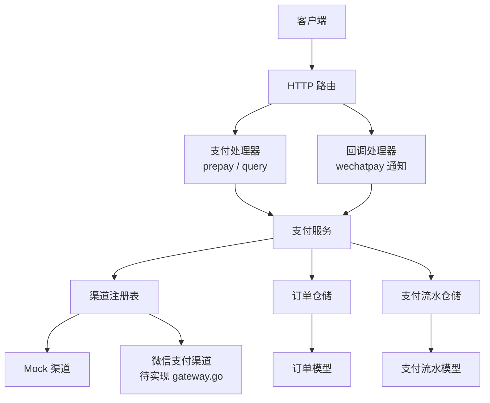
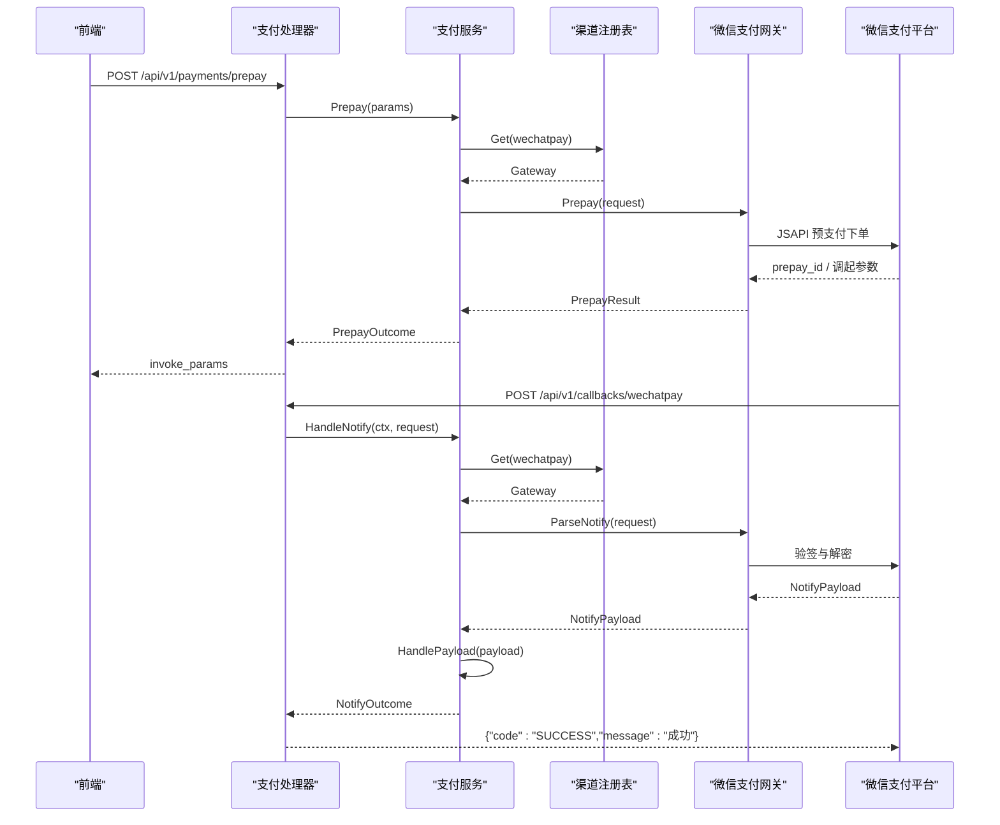
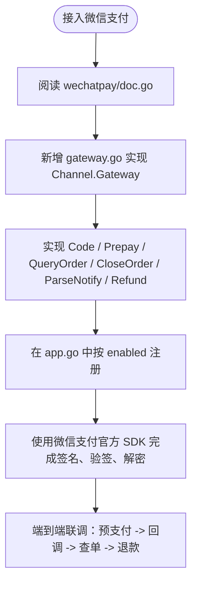
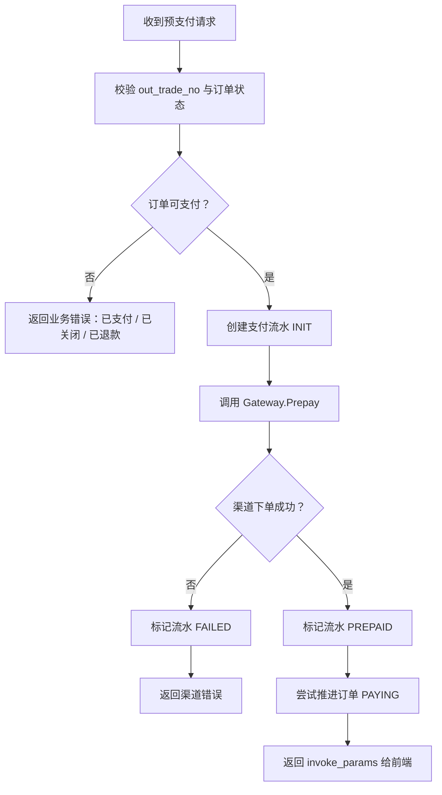
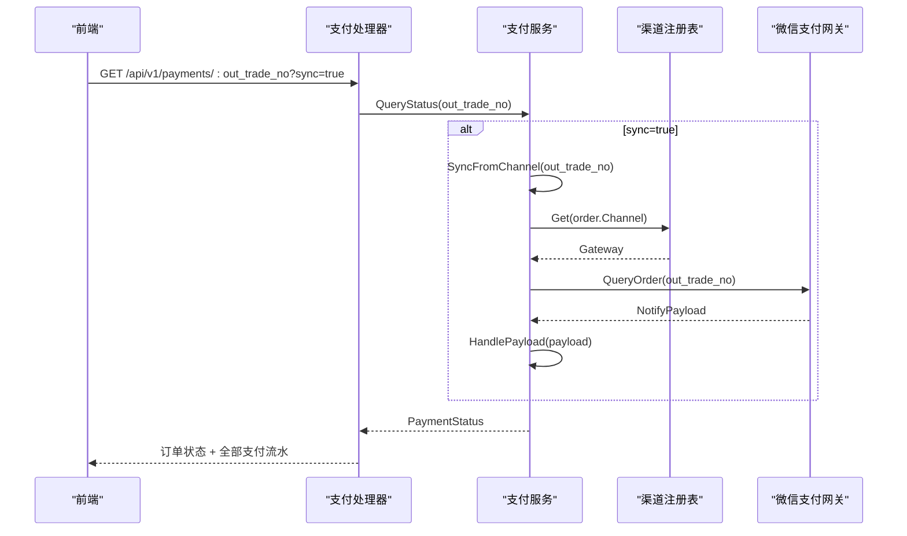
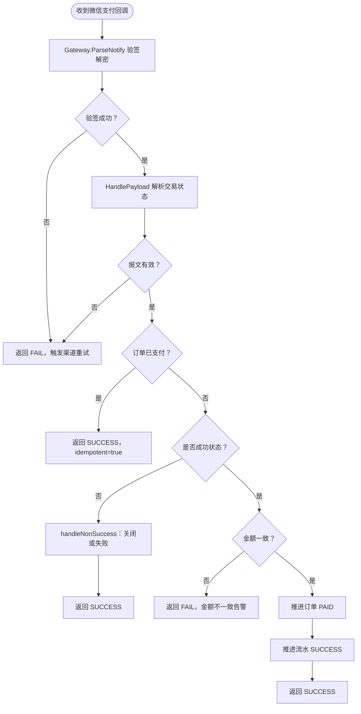
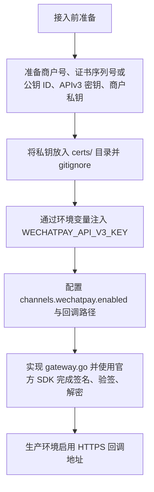
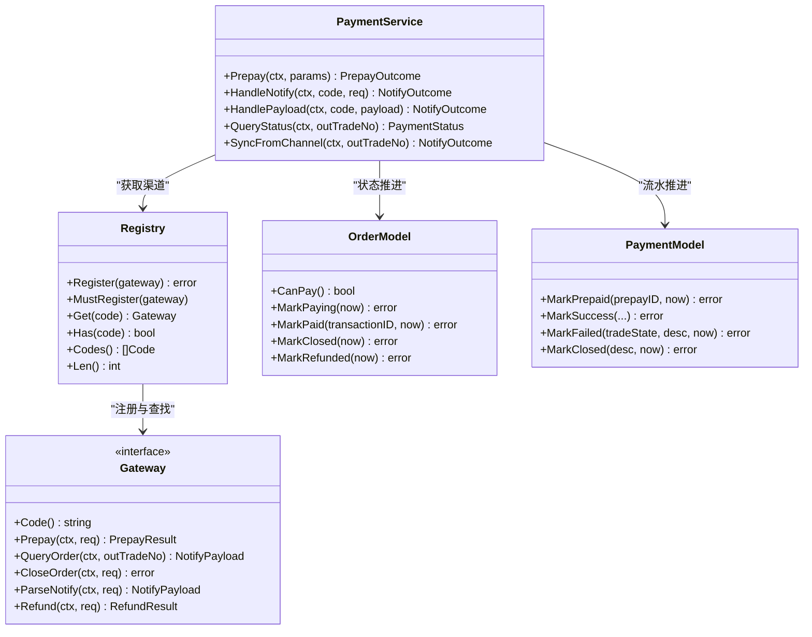

# 微信支付接入

<cite>
**本文引用的文件**   
- [internal/channel/wechatpay/doc.go](file://internal/channel/wechatpay/doc.go)
- [configs/config.yaml](file://configs/config.yaml)
- [internal/config/config.go](file://internal/config/config.go)
- [internal/app/app.go](file://internal/app/app.go)
- [internal/channel/registry.go](file://internal/channel/registry.go)
- [internal/dto/payment.go](file://internal/dto/payment.go)
- [internal/model/order.go](file://internal/model/order.go)
- [internal/model/payment.go](file://internal/model/payment.go)
- [internal/handler/payment_handler.go](file://internal/handler/payment_handler.go)
- [internal/handler/callback_handler.go](file://internal/handler/callback_handler.go)
- [internal/service/payment_service.go](file://internal/service/payment_service.go)
</cite>

## 目录
1. [引言](#引言)
2. [项目结构](#项目结构)
3. [核心组件](#核心组件)
4. [架构总览](#架构总览)
5. [详细组件分析](#详细组件分析)
6. [依赖关系分析](#依赖关系分析)
7. [性能与可靠性考虑](#性能与可靠性考虑)
8. [故障排查指南](#故障排查指南)
9. [结论](#结论)
10. [附录：微信支付接入清单](#附录微信支付接入清单)

## 引言
本文面向需要在当前支付服务中接入微信支付的工程师，基于 `internal/channel/wechatpay/doc.go` 中的占位文档，说明需要实现的微信支付 Gateway 接口方法，并解释商户号、API 密钥、证书配置、签名算法等核心概念。同时给出预支付下单、订单查询、回调通知验签、退款等接口的调用方式，以及 HTTPS、证书管理、敏感信息保护等安全注意事项。最后提供完整的集成步骤、配置示例、错误处理方案和生产环境部署最佳实践与监控告警建议。

## 项目结构
本项目采用分层架构：
- 配置层：`configs/config.yaml` 与 `internal/config/config.go` 负责加载、校验和注入配置；
- 应用装配层：`internal/app/app.go` 组装日志、渠道注册表、仓储、服务、处理器与路由；
- 渠道抽象层：`internal/channel/registry.go` 定义渠道注册表，`internal/channel/wechatpay/doc.go` 是微信支付实现占位文档；
- 领域模型层：`internal/model/order.go` 与 `internal/model/payment.go` 定义订单与支付流水的状态机；
- 服务层：`internal/service/payment_service.go` 编排下单、回调、查单、同步等业务流程；
- 控制器层：`internal/handler/payment_handler.go` 与 `internal/handler/callback_handler.go` 暴露 HTTP 接口；
- 数据传输层：`internal/dto/payment.go` 定义对外请求与响应结构。

**图示来源**
- [internal/app/app.go:85-103](file://internal/app/app.go#L85-L103)
- [internal/channel/registry.go:11-24](file://internal/channel/registry.go#L11-L24)
- [internal/handler/payment_handler.go:26-51](file://internal/handler/payment_handler.go#L26-L51)
- [internal/handler/callback_handler.go:44-49](file://internal/handler/callback_handler.go#L44-L49)
- [internal/service/payment_service.go:34-46](file://internal/service/payment_service.go#L34-L46)

**章节来源**
- [internal/app/app.go:1-106](file://internal/app/app.go#L1-L106)
- [configs/config.yaml:1-61](file://configs/config.yaml#L1-L61)
- [internal/config/config.go:1-45](file://internal/config/config.go#L1-L45)

## 核心组件
- 渠道抽象与注册：通过 `channel.Registry` 在启动时按配置注册可用渠道，运行时由 `PaymentService` 根据订单渠道编码获取具体网关实现。
- 支付服务：统一编排预支付下单、异步回调处理、状态查询与主动查单兜底。
- 领域模型：订单与支付流水各自维护严格的状态机，禁止外部直接赋值状态字段。
- 处理器：对外暴露预支付、状态查询与微信支付回调接口。
- 配置系统：支持环境变量覆盖配置文件，强制 APIv3 密钥只从环境变量读取。

**章节来源**
- [internal/channel/registry.go:11-24](file://internal/channel/registry.go#L11-L24)
- [internal/service/payment_service.go:34-46](file://internal/service/payment_service.go#L34-L46)
- [internal/model/order.go:20-50](file://internal/model/order.go#L20-L50)
- [internal/model/payment.go:10-33](file://internal/model/payment.go#L10-L33)
- [internal/handler/payment_handler.go:16-51](file://internal/handler/payment_handler.go#L16-L51)
- [internal/handler/callback_handler.go:34-49](file://internal/handler/callback_handler.go#L34-L49)
- [internal/config/config.go:39-45](file://internal/config/config.go#L39-L45)

## 架构总览
微信支付接入后，整体调用链如下：
- 前端调用后端 `/api/v1/payments/prepay`，服务创建支付流水并调用微信支付 JSAPI 预支付下单；
- 前端使用 SDK 生成的调起参数拉起微信支付；
- 微信支付异步回调到 `/api/v1/callbacks/wechatpay`，服务完成验签解密、金额校验、幂等处理与状态推进；
- 前端轮询 `/api/v1/payments/:out_trade_no`，必要时触发主动查单同步。

**图示来源**
- [internal/handler/payment_handler.go:26-51](file://internal/handler/payment_handler.go#L26-L51)
- [internal/handler/callback_handler.go:44-86](file://internal/handler/callback_handler.go#L44-L86)
- [internal/service/payment_service.go:99-225](file://internal/service/payment_service.go#L99-L225)
- [internal/service/payment_service.go:258-379](file://internal/service/payment_service.go#L258-L379)
- [internal/channel/registry.go:63-73](file://internal/channel/registry.go#L63-L73)

## 详细组件分析

### 微信支付渠道占位文档与 Gateway 接口要求
`internal/channel/wechatpay/doc.go` 明确指出：当前包只有文档，没有实现；接入时需要新增 `gateway.go`，实现 `channel.Gateway` 接口的六个方法：`Code`、`Prepay`、`QueryOrder`、`CloseOrder`、`ParseNotify`、`Refund`。然后在 `internal/app/app.go` 的装配逻辑中按 `channels.wechatpay.enabled` 注册该实现。service 层与 handler 层不需要改动，这正是 channel 抽象层存在的意义。

微信支付官方 SDK 用法要点包括：
- 创建客户端：支持证书模式与微信支付公钥模式两种认证方式；
- JSAPI 下单：使用 JSAPI 服务的 `Prepay` 方法，返回 `prepay_id`；
- 生成前端调起参数：必须使用 SDK 提供的签名能力，`SignType` 固定为 `RSA`；
- 回调验签与解密：必须原样使用 `*http.Request`，因为验签依赖四个请求头；
- 查单：通过 `QueryOrderByOutTradeNo` 查询交易状态；
- 关单：通过 `CloseOrder` 关闭订单；
- 退款：通过退款相关接口完成退款流程。

**图示来源**
- [internal/channel/wechatpay/doc.go:9-14](file://internal/channel/wechatpay/doc.go#L9-L14)
- [internal/channel/wechatpay/doc.go:16-86](file://internal/channel/wechatpay/doc.go#L16-L86)
- [internal/app/app.go:123-132](file://internal/app/app.go#L123-L132)

**章节来源**
- [internal/channel/wechatpay/doc.go:1-105](file://internal/channel/wechatpay/doc.go#L1-L105)
- [internal/app/app.go:108-151](file://internal/app/app.go#L108-L151)

### 预支付下单流程
预支付下单的核心路径是：
1. 处理器接收 `PrepayRequest`；
2. 服务校验订单可支付、确定渠道与交易类型、补齐 OpenID；
3. 创建支付流水并写入仓储；
4. 调用渠道网关的 `Prepay`；
5. 渠道失败时标记流水为失败，订单状态不变；
6. 渠道成功时标记流水为已预支付，尝试推进订单为支付中；
7. 即使订单状态推进失败，仍返回前端调起参数，由回调与查单兜底。

**图示来源**
- [internal/handler/payment_handler.go:26-51](file://internal/handler/payment_handler.go#L26-L51)
- [internal/service/payment_service.go:99-225](file://internal/service/payment_service.go#L99-L225)

**章节来源**
- [internal/dto/payment.go:9-58](file://internal/dto/payment.go#L9-L58)
- [internal/handler/payment_handler.go:26-51](file://internal/handler/payment_handler.go#L26-L51)
- [internal/service/payment_service.go:99-225](file://internal/service/payment_service.go#L99-L225)

### 订单查询与状态同步
查询接口默认只读本地数据，避免高频轮询触发渠道限流；当携带 `sync=true` 时，服务会主动调用渠道 `QueryOrder`，并将结果复用回调处理路径，保证查单与回调对同一笔交易的结论一致。若渠道侧查不到交易，视为正常情况，返回未支付状态而不是错误。

**图示来源**
- [internal/handler/payment_handler.go:53-85](file://internal/handler/payment_handler.go#L53-L85)
- [internal/service/payment_service.go:528-582](file://internal/service/payment_service.go#L528-L582)

**章节来源**
- [internal/handler/payment_handler.go:53-85](file://internal/handler/payment_handler.go#L53-L85)
- [internal/service/payment_service.go:528-582](file://internal/service/payment_service.go#L528-L582)

### 回调通知验签与处理
回调入口必须返回微信支付要求的应答格式：成功返回 `{"code":"SUCCESS","message":"成功"}`，失败返回 `{"code":"FAIL","message":"失败原因"}`。服务层先通过 `Gateway.ParseNotify` 完成验签与解密，再进入统一的 `HandlePayload` 流程：
- 空报文或缺少 `out_trade_no` 直接报错；
- 已支付订单命中幂等分支，返回成功；
- 非成功状态按渠道语义处理：关闭订单或标记流水失败；
- 成功状态必须先校验金额，再推进订单与流水；
- 并发重复回调通过锁内二次检查保证幂等。

**图示来源**
- [internal/handler/callback_handler.go:14-86](file://internal/handler/callback_handler.go#L14-L86)
- [internal/service/payment_service.go:258-415](file://internal/service/payment_service.go#L258-L415)

**章节来源**
- [internal/handler/callback_handler.go:14-86](file://internal/handler/callback_handler.go#L14-L86)
- [internal/service/payment_service.go:258-415](file://internal/service/payment_service.go#L258-L415)

### 退款接口
微信支付退款属于资金逆向操作，必须在 `gateway.go` 中实现 `Refund` 方法。接入时应遵循以下原则：
- 仅允许从已支付订单发起退款；
- 退款金额不能超过订单实付金额；
- 退款申请需记录退款流水，便于对账与审计；
- 退款回调或查询结果应复用 `HandlePayload` 或独立退款状态处理逻辑，确保状态机不出现非法流转；
- 退款失败应保留渠道返回的错误描述，便于客服定位。

由于当前仓库尚未实现微信支付渠道，退款的具体调用细节应以 `wechatpay/doc.go` 中提示的官方 SDK 退款接口为准，并在 `gateway.go` 中封装成 `Refund` 方法。

**章节来源**
- [internal/channel/wechatpay/doc.go:9-14](file://internal/channel/wechatpay/doc.go#L9-L14)
- [internal/model/order.go:150-153](file://internal/model/order.go#L150-L153)

### 安全注意事项
微信支付的安全红线非常明确：
- HTTPS 要求：生产模式下回调地址必须是公网可达的 HTTPS；
- 证书管理：商户私钥 `apiclient_key.pem` 只能下载一次，严禁提交进仓库；
- 敏感信息保护：APIv3 密钥只能通过环境变量 `WECHATPAY_API_V3_KEY` 注入，配置文件中无对应字段；
- 日志安全：严禁打印任何密钥、证书内容与完整回调报文；
- 验签不可省略：回调验签与解密是安全边界，必须使用官方 SDK 提供的验签能力。

**图示来源**
- [internal/channel/wechatpay/doc.go:88-104](file://internal/channel/wechatpay/doc.go#L88-L104)
- [configs/config.yaml:42-61](file://configs/config.yaml#L42-L61)
- [internal/config/config.go:25-27](file://internal/config/config.go#L25-L27)
- [internal/config/config.go:146-149](file://internal/config/config.go#L146-L149)
- [internal/config/config.go:260-268](file://internal/config/config.go#L260-L268)

**章节来源**
- [internal/channel/wechatpay/doc.go:88-104](file://internal/channel/wechatpay/doc.go#L88-L104)
- [configs/config.yaml:42-61](file://configs/config.yaml#L42-L61)
- [internal/config/config.go:146-149](file://internal/config/config.go#L146-L149)
- [internal/config/config.go:260-320](file://internal/config/config.go#L260-L320)

## 依赖关系分析
- `app.go` 在启动阶段构建 `Registry`，注册 mock 渠道；若 `channels.wechatpay.enabled=true` 但未实现微信支付渠道，则直接报错，防止“配置可用但实际不可用”的危险状态。
- `payment_service.go` 通过 `registry.Get(code)` 获取渠道网关，因此新增渠道只需实现 `Gateway` 接口并注册。
- `model/order.go` 与 `model/payment.go` 的状态机被 service 层调用，所有状态变更都经过领域方法，避免非法流转。
- `handler/payment_handler.go` 与 `handler/callback_handler.go` 只负责参数绑定、日志与统一响应，业务逻辑集中在 service 层。

**图示来源**
- [internal/channel/registry.go:11-106](file://internal/channel/registry.go#L11-L106)
- [internal/service/payment_service.go:34-46](file://internal/service/payment_service.go#L34-L46)
- [internal/model/order.go:73-183](file://internal/model/order.go#L73-L183)
- [internal/model/payment.go:54-159](file://internal/model/payment.go#L54-L159)

**章节来源**
- [internal/app/app.go:108-151](file://internal/app/app.go#L108-L151)
- [internal/channel/registry.go:11-106](file://internal/channel/registry.go#L11-L106)
- [internal/service/payment_service.go:99-225](file://internal/service/payment_service.go#L99-L225)
- [internal/model/order.go:73-183](file://internal/model/order.go#L73-L183)
- [internal/model/payment.go:54-159](file://internal/model/payment.go#L54-L159)

## 性能与可靠性考虑
- 查询接口默认只读本地数据，避免频繁调用渠道触发限流；仅在必要时通过 `sync=true` 或定时任务主动查单。
- 回调处理必须幂等：同一笔交易可能多次投递，已支付订单必须原样返回成功。
- 金额校验必须在推进状态之前执行，不一致时坚决拒绝，防止串单或篡改。
- 状态推进使用领域模型的 `transit` 方法，保证非法流转在编译期与运行期都被阻止。
- 日志级别区分：金额不一致与验签失败属于资金与安全事件，应触发人工告警；其余错误避免刷满 error 日志。

**章节来源**
- [internal/handler/payment_handler.go:53-85](file://internal/handler/payment_handler.go#L53-L85)
- [internal/handler/callback_handler.go:55-86](file://internal/handler/callback_handler.go#L55-L86)
- [internal/service/payment_service.go:301-379](file://internal/service/payment_service.go#L301-L379)
- [internal/model/order.go:155-170](file://internal/model/order.go#L155-L170)
- [internal/model/payment.go:139-150](file://internal/model/payment.go#L139-L150)

## 故障排查指南
常见故障与处理建议：
- 回调一直重试：检查是否返回了微信支付要求的 `{"code":"SUCCESS","message":"成功"}` 或 `{"code":"FAIL","message":"失败原因"}`；
- 验签失败：确认使用的是官方 SDK 的验签能力，且传入的是原始 `*http.Request`；
- 金额不一致：立即告警并人工介入，不要降级为内部错误；
- 订单已支付但仍收到回调：这是正常幂等情况，应返回成功；
- 渠道下单失败：流水标记为失败，订单状态不变，用户可重新发起；
- 回调丢失：通过定时任务扫描 `PAYING` 且超过阈值未终结的订单，调用 `SyncFromChannel` 兜底。

**章节来源**
- [internal/handler/callback_handler.go:14-26](file://internal/handler/callback_handler.go#L14-L26)
- [internal/service/payment_service.go:164-178](file://internal/service/payment_service.go#L164-L178)
- [internal/service/payment_service.go:301-379](file://internal/service/payment_service.go#L301-L379)
- [internal/service/payment_service.go:548-582](file://internal/service/payment_service.go#L548-L582)

## 结论
当前仓库已完成微信支付接入所需的抽象层、配置校验、领域状态机与服务编排，但微信支付渠道的具体实现仍停留在 `wechatpay/doc.go` 的占位文档阶段。接入时应优先实现 `gateway.go` 中的六个 Gateway 方法，使用官方 SDK 完成签名、验签与解密，并通过 `app.go` 的装配逻辑注册渠道。生产环境必须启用 HTTPS 回调、严格管理证书与 APIv3 密钥、避免敏感信息泄露，并通过主动查单与监控告警保障资金安全与系统可靠性。

## 附录：微信支付接入清单
- 必备凭据：
  - 商户号 `mchid`；
  - 商户 API 证书序列号或微信支付公钥 ID；
  - APIv3 密钥（32 位）；
  - 商户私钥 `apiclient_key.pem`。
- 配置项：
  - `channels.wechatpay.enabled`；
  - `channels.wechatpay.app_id`；
  - `channels.wechatpay.mch_id`；
  - `channels.wechatpay.mch_cert_serial_no` 或 `public_key_id` + `public_key_path`；
  - `channels.wechatpay.private_key_path`；
  - `channels.wechatpay.notify_path`；
  - `WECHATPAY_API_V3_KEY` 环境变量。
- 实现步骤：
  - 新增 `internal/channel/wechatpay/gateway.go`，实现 `Code`、`Prepay`、`QueryOrder`、`CloseOrder`、`ParseNotify`、`Refund`；
  - 使用官方 SDK 创建客户端并完成 JSAPI 下单、前端调起参数签名、回调验签解密、查单、关单、退款；
  - 在 `internal/app/app.go` 中按 `channels.wechatpay.enabled` 注册微信支付渠道；
  - 联调预支付、回调、查单、退款全流程；
  - 生产环境启用 HTTPS、配置监控告警、部署证书与密钥。

**章节来源**
- [internal/channel/wechatpay/doc.go:88-104](file://internal/channel/wechatpay/doc.go#L88-L104)
- [configs/config.yaml:42-61](file://configs/config.yaml#L42-L61)
- [internal/config/config.go:86-111](file://internal/config/config.go#L86-L111)
- [internal/config/config.go:270-320](file://internal/config/config.go#L270-L320)
- [internal/app/app.go:123-132](file://internal/app/app.go#L123-L132)