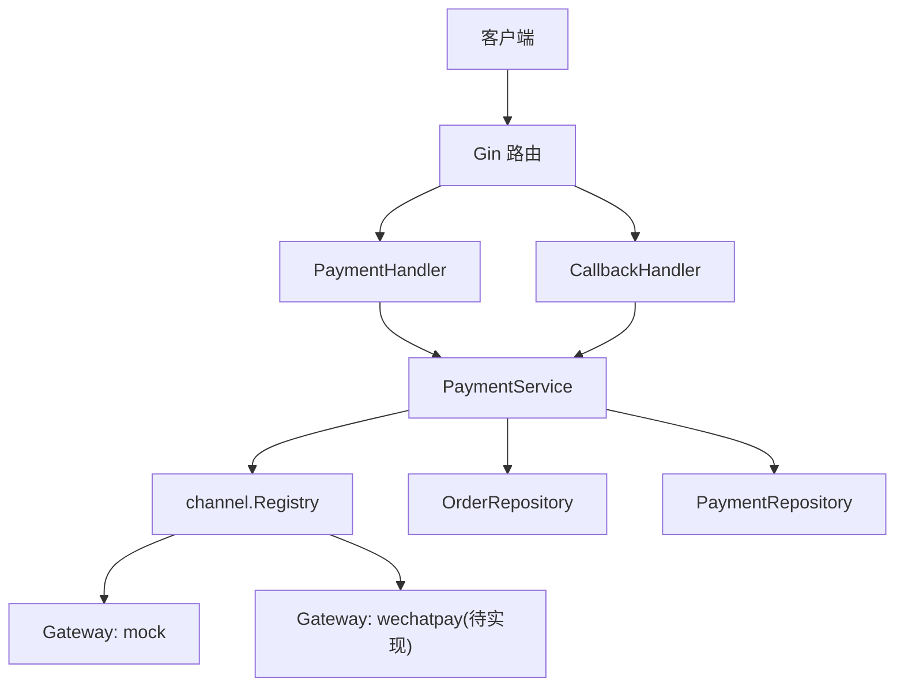
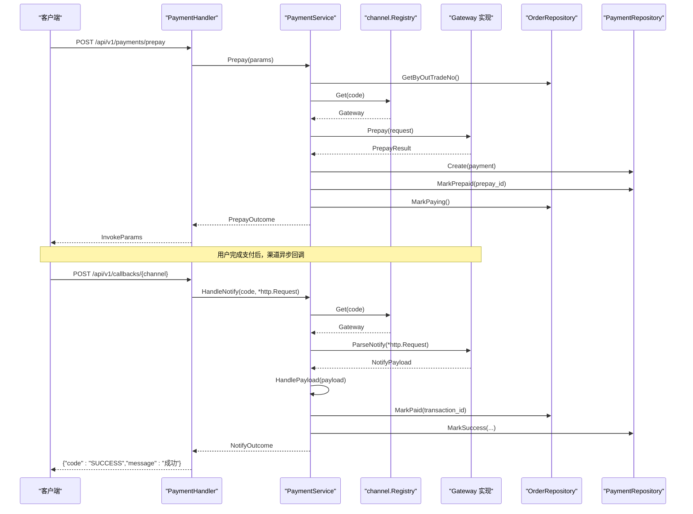
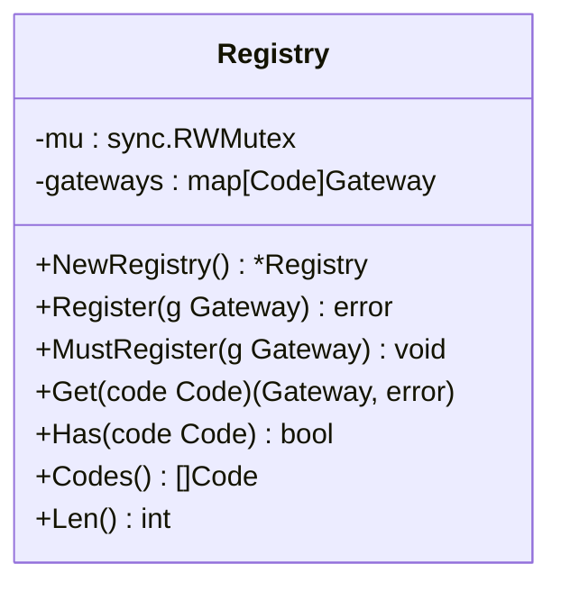
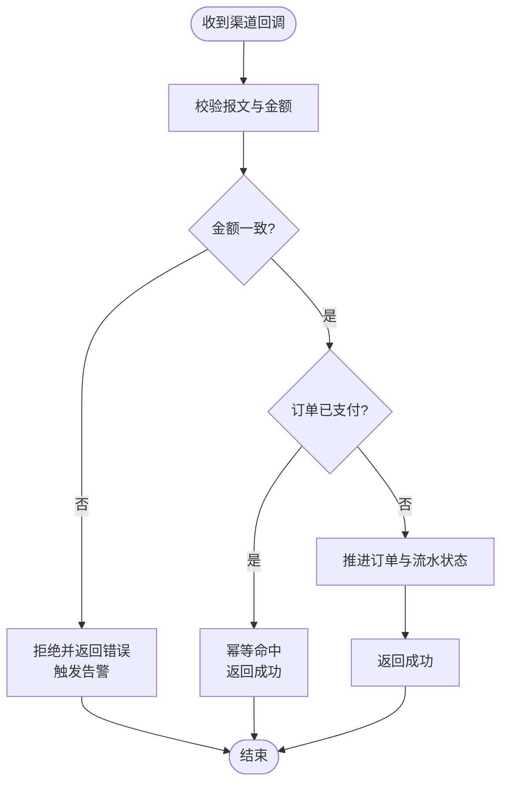
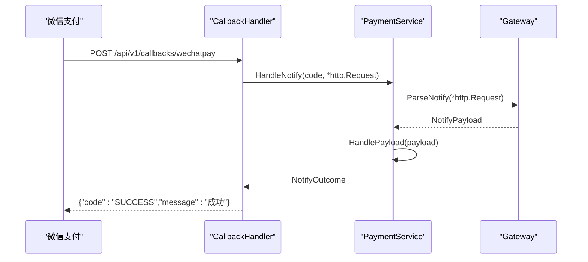
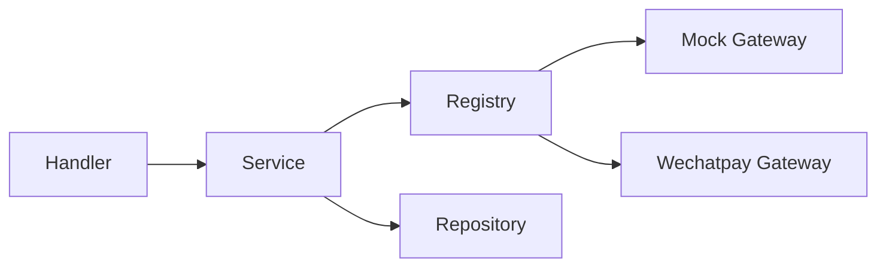

# 支付渠道集成

<cite>
**本文引用的文件**   
- [internal/channel/registry.go](file://internal/channel/registry.go)
- [internal/channel/wechatpay/doc.go](file://internal/channel/wechatpay/doc.go)
- [internal/app/app.go](file://internal/app/app.go)
- [internal/handler/payment_handler.go](file://internal/handler/payment_handler.go)
- [internal/handler/callback_handler.go](file://internal/handler/callback_handler.go)
- [internal/service/payment_service.go](file://internal/service/payment_service.go)
- [internal/model/order.go](file://internal/model/order.go)
- [internal/model/payment.go](file://internal/model/payment.go)
- [internal/dto/payment.go](file://internal/dto/payment.go)
- [internal/errcode/errcode.go](file://internal/errcode/errcode.go)
</cite>

## 目录
1. [引言](#引言)
2. [项目结构](#项目结构)
3. [核心组件](#核心组件)
4. [架构总览](#架构总览)
5. [详细组件分析](#详细组件分析)
6. [依赖关系分析](#依赖关系分析)
7. [性能与可靠性考虑](#性能与可靠性考虑)
8. [故障排查指南](#故障排查指南)
9. [结论](#结论)
10. [附录：微信支付接入与新增渠道步骤](#附录微信支付接入与新增渠道步骤)

## 引言
本文面向需要接入或扩展支付渠道的开发者，围绕 `channel.Gateway` 接口设计、渠道注册表机制、Mock 渠道行为、状态机与幂等性保障，以及微信支付接入注意事项进行系统化说明。文档同时给出新增自定义支付渠道的完整步骤和代码级参考路径，帮助你在不改动上层业务的前提下完成渠道替换与扩展。

## 项目结构
本项目采用分层架构：
- 表现层：HTTP Handler，负责请求解析、响应封装与错误码映射。
- 服务层：OrderService / PaymentService，编排订单、流水、渠道调用与状态机推进。
- 渠道抽象层：`channel.Gateway` 接口与 `Registry` 注册表，屏蔽具体支付通道差异。
- 领域模型：Order / Payment，定义金额单位、状态机与合法流转。
- 仓储层：内存实现（可替换为数据库）。
- 装配层：App 负责按配置组装日志、仓储、服务、Handler、路由与渠道注册。

**图表来源**
- [internal/handler/payment_handler.go:26-51](file://internal/handler/payment_handler.go#L26-L51)
- [internal/handler/callback_handler.go:44-86](file://internal/handler/callback_handler.go#L44-L86)
- [internal/service/payment_service.go:99-226](file://internal/service/payment_service.go#L99-L226)
- [internal/channel/registry.go:11-24](file://internal/channel/registry.go#L11-L24)

**章节来源**
- [internal/app/app.go:39-106](file://internal/app/app.go#L39-L106)
- [internal/handler/payment_handler.go:16-51](file://internal/handler/payment_handler.go#L16-L51)
- [internal/handler/callback_handler.go:34-86](file://internal/handler/callback_handler.go#L34-L86)

## 核心组件
本节聚焦支付渠道集成的关键抽象与运行时机制：
- `channel.Gateway` 接口：统一支付渠道能力边界。
- `channel.Registry`：并发安全的渠道注册与查找。
- `PaymentService`：发起支付、处理回调、查单兜底与状态机编排。
- `Order` / `Payment`：订单与流水的状态机。
- Mock 渠道：用于端到端验证与测试。

**章节来源**
- [internal/channel/registry.go:11-106](file://internal/channel/registry.go#L11-L106)
- [internal/service/payment_service.go:34-73](file://internal/service/payment_service.go#L34-L73)
- [internal/model/order.go:20-50](file://internal/model/order.go#L20-L50)
- [internal/model/payment.go:10-33](file://internal/model/payment.go#L10-L33)

## 架构总览
下图展示一次典型“发起支付 + 异步回调”的调用链，体现 Handler → Service → Channel 的分层职责与数据流向。

**图表来源**
- [internal/handler/payment_handler.go:26-51](file://internal/handler/payment_handler.go#L26-L51)
- [internal/service/payment_service.go:99-226](file://internal/service/payment_service.go#L99-L226)
- [internal/service/payment_service.go:258-379](file://internal/service/payment_service.go#L258-L379)
- [internal/handler/callback_handler.go:44-86](file://internal/handler/callback_handler.go#L44-L86)

## 详细组件分析

### channel.Gateway 接口设计与方法规范
`channel.Gateway` 是支付渠道的统一抽象，所有渠道必须实现以下六个方法。这些方法的职责与参数约定如下：

| 方法 | 职责 | 输入要点 | 输出要点 | 备注 |
|---|---|---|---|---|
| `Code()` | 返回渠道编码，作为注册键与路由分发依据 | 无 | 字符串编码 | 重复注册同一 Code 会报错 |
| `Prepay(ctx, req)` | 向渠道发起下单，生成前端调起参数 | 商户订单号、描述、金额、币种、附加信息、回调地址、交易类型、OpenID、客户端 IP | 预支付标识、二维码内容、前端调起参数 | 失败时服务层标记流水 FAILED，订单保持可重试 |
| `QueryOrder(ctx, outTradeNo)` | 主动查询渠道订单状态 | 商户订单号 | 交易状态载荷 | 未找到时通常返回“订单不存在”，服务层做掉单兜底 |
| `CloseOrder(ctx, outTradeNo)` | 关闭订单（超时或主动关单） | 商户订单号 | 渠道侧结果 | 非终态流水应同步关闭 |
| `ParseNotify(ctx, *http.Request)` | 验签并解密渠道异步通知 | 原始 HTTP 请求对象 | 标准化交易状态载荷 | 必须接收 `*http.Request`，因为验签依赖请求头 |
| `Refund(ctx, refundReq)` | 发起退款 | 原交易号、退款金额、原因等 | 退款结果 | Mock 中未实现时返回“未实现”错误 |

上述方法在 Service 层的调用位置：
- `Prepay`：[internal/service/payment_service.go:153-163](file://internal/service/payment_service.go#L153-L163)
- `ParseNotify`：[internal/service/payment_service.go:263-275](file://internal/service/payment_service.go#L263-L275)
- `QueryOrder`：[internal/service/payment_service.go:571-581](file://internal/service/payment_service.go#L571-L581)

**章节来源**
- [internal/channel/wechatpay/doc.go:11-14](file://internal/channel/wechatpay/doc.go#L11-L14)
- [internal/channel/wechatpay/doc.go:63-86](file://internal/channel/wechatpay/doc.go#L63-L86)
- [internal/service/payment_service.go:153-163](file://internal/service/payment_service.go#L153-L163)
- [internal/service/payment_service.go:258-275](file://internal/service/payment_service.go#L258-L275)
- [internal/service/payment_service.go:548-581](file://internal/service/payment_service.go#L548-L581)

### 渠道注册表的工作原理
`channel.Registry` 是一个并发安全的渠道注册表，核心特性包括：
- 使用 `sync.RWMutex` 保护内部 map，读多写少场景下开销可忽略。
- `Register(g)` 校验 nil 网关与空 Code，重复注册直接返回错误，避免覆盖导致的行为不确定。
- `MustRegister(g)` 在启动阶段使用，失败则 panic，保证“带残缺渠道集合对外服务”的情况不会发生。
- `Get(code)` 通过 Code 索引获取 Gateway，未注册返回 `ErrChannelNotRegistered`。
- `Has(code)` 判断是否已注册。
- `Codes()` 返回排序后的渠道编码列表，便于健康检查与日志稳定。
- `Len()` 返回已注册渠道数量。

**图表来源**
- [internal/channel/registry.go:11-106](file://internal/channel/registry.go#L11-L106)

**章节来源**
- [internal/channel/registry.go:11-106](file://internal/channel/registry.go#L11-L106)
- [internal/app/app.go:108-151](file://internal/app/app.go#L108-L151)

### Mock 渠道的实现原理与行为
当前仓库中 `internal/channel/mock` 目录为空，但应用装配逻辑在非 release 模式下会尝试注册 Mock 渠道；若未实现则会触发明确的启动期错误。结合现有代码，Mock 渠道的预期行为如下：
- 提供 `Code()` 返回固定编码（例如 `mock`），以便在调试模式启用。
- 提供 `Prepay()` 返回可用的前端调起参数，使整条链路端到端跑通。
- 提供 `ParseNotify()` 模拟微信回调验签流程，支持构造成功/失败等不同场景。
- 提供 `QueryOrder()` 与 `CloseOrder()` 以配合状态机闭环。
- 退款方法在未实现时应返回“未实现”错误，便于上层统一处理。

Mock 渠道的使用场景：
- 本地联调：无需真实商户号即可走通下单、回调、查单全流程。
- 状态机验证：通过 Mock 回调触发不同交易状态，验证幂等性与金额校验。
- 安全边界：release 模式默认禁用 Mock，防止生产环境被误用。

**章节来源**
- [internal/app/app.go:112-121](file://internal/app/app.go#L112-L121)
- [internal/app/app.go:134-149](file://internal/app/app.go#L134-L149)
- [internal/errcode/errcode.go:124-134](file://internal/errcode/errcode.go#L124-L134)

### 状态机与幂等性保障
订单与支付流水各自维护独立状态机，所有状态变更只能通过 `Mark*` 方法进入，非法流转会被拒绝。

- 订单状态：CREATED → PAYING → PAID → REFUNDED；CLOSED 为终态。
- 流水状态：INIT → PREPAID → SUCCESS/FAILED/CLOSED；终态不可再变。

幂等性关键点：
- 重复回调命中已支付订单时，直接返回成功，让渠道停止重试。
- 并发回调通过锁内二次判重，避免竞态导致重复推进。
- 金额不一致属于资金安全事件，拒绝置为已支付并记录告警。
- 非成功状态（如 CLOSED、PAY_ERROR）仅影响流水或订单关闭，不盲目置失败。

**图表来源**
- [internal/service/payment_service.go:282-379](file://internal/service/payment_service.go#L282-L379)
- [internal/model/order.go:43-50](file://internal/model/order.go#L43-L50)
- [internal/model/payment.go:26-33](file://internal/model/payment.go#L26-L33)

**章节来源**
- [internal/model/order.go:20-50](file://internal/model/order.go#L20-L50)
- [internal/model/payment.go:10-33](file://internal/model/payment.go#L10-L33)
- [internal/service/payment_service.go:282-379](file://internal/service/payment_service.go#L282-L379)

### 回调处理与应答规范
回调入口统一由 `CallbackHandler` 处理，按渠道编码分发到 `PaymentService.HandleNotify`。渠道只认其约定的应答格式：
- 成功：HTTP 200/204 + `{"code":"SUCCESS","message":"成功"}`
- 失败：HTTP 4xx/5xx + `{"code":"FAIL","message":"失败原因"}`

若未按此格式应答，渠道会按固定间隔持续重试，造成大量重复回调。因此：
- 验签失败、金额不一致等安全事件需告警人工介入。
- 其他错误（如订单不存在）记 warn，避免刷满 error 日志。
- 幂等命中同样返回 SUCCESS，避免渠道无限重试。

**图表来源**
- [internal/handler/callback_handler.go:44-86](file://internal/handler/callback_handler.go#L44-L86)
- [internal/service/payment_service.go:258-275](file://internal/service/payment_service.go#L258-L275)

**章节来源**
- [internal/handler/callback_handler.go:14-26](file://internal/handler/callback_handler.go#L14-L26)
- [internal/handler/callback_handler.go:44-86](file://internal/handler/callback_handler.go#L44-L86)
- [internal/service/payment_service.go:258-379](file://internal/service/payment_service.go#L258-L379)

## 依赖关系分析
- Handler 依赖 Service，Service 依赖 Repository 与 Channel Registry。
- Registry 解耦了 Service 与具体渠道实现，新增渠道无需改动上层。
- App 在启动时根据配置注册渠道，release 模式禁用 Mock，wechatpay 未实现时报错。

**图表来源**
- [internal/app/app.go:108-151](file://internal/app/app.go#L108-L151)
- [internal/channel/registry.go:11-106](file://internal/channel/registry.go#L11-L106)

**章节来源**
- [internal/app/app.go:108-151](file://internal/app/app.go#L108-L151)
- [internal/channel/registry.go:11-106](file://internal/channel/registry.go#L11-L106)

## 性能与可靠性考虑
- 查询接口默认只读本地数据，避免高频轮询触发渠道限流；可选 `sync=true` 强制对齐渠道。
- 回调处理对金额一致性进行严格校验，失败时拒绝并告警。
- 状态机通过显式转移表约束合法流转，避免非法状态导致对账事故。
- 注册表使用读写锁，读多写少场景下开销低，且支持未来热加载扩展。
- 流水与订单分离，保留历史流水便于对账与排障。

[本节为通用指导，不直接分析具体文件]

## 故障排查指南
常见错误与定位建议：
- 渠道未注册：检查 `app.buildRegistry` 中的注册逻辑与配置开关。
- 回调反复重试：确认回调应答是否符合渠道规范，避免返回统一响应体。
- 金额不一致：核对订单金额与回调金额，检查是否存在串单或篡改。
- 订单状态异常：查看状态机流转是否合法，关注并发回调与幂等分支。
- 退款未实现：Mock 渠道退款返回“未实现”，需实现对应 Gateway 方法。

**章节来源**
- [internal/app/app.go:108-151](file://internal/app/app.go#L108-L151)
- [internal/handler/callback_handler.go:44-86](file://internal/handler/callback_handler.go#L44-L86)
- [internal/errcode/errcode.go:124-134](file://internal/errcode/errcode.go#L124-L134)

## 结论
本项目的支付渠道集成通过 `channel.Gateway` 接口与 `Registry` 注册表实现了渠道抽象与动态装配，Service 层专注编排订单、流水与状态机，Handler 层负责请求与响应适配。Mock 渠道用于端到端验证，微信支付渠道占位文档明确了接入要点与安全红线。按照本文档的步骤与规范，可以安全地新增自定义支付渠道，并在不改动上层业务的前提下完成切换与扩展。

[本节为总结性内容，不直接分析具体文件]

## 附录：微信支付接入与新增渠道步骤

### 微信支付接入指南
基于 `internal/channel/wechatpay/doc.go` 的占位文档，接入微信支付需要：
- 新建 gateway 实现，实现 `channel.Gateway` 接口的六个方法。
- 在 `internal/app/app.go` 的装配逻辑中按 `channels.wechatpay.enabled` 注册。
- 使用官方 SDK 创建客户端（证书模式或公钥模式），并按商户实际情况选择。
- JSAPI 下单与前端调起参数生成必须使用 SDK 签名能力，注意 timeStamp 字段类型。
- 回调验签与解密必须原样使用 `*http.Request`，读取必要请求头。
- 必备凭据：商户号、证书序列号或公钥 ID、APIv3 密钥、商户私钥。
- 安全红线：私钥与 APIv3 密钥不得落盘于配置文件，严禁打印敏感信息与完整回调报文。

**章节来源**
- [internal/channel/wechatpay/doc.go:9-14](file://internal/channel/wechatpay/doc.go#L9-L14)
- [internal/channel/wechatpay/doc.go:16-36](file://internal/channel/wechatpay/doc.go#L16-L36)
- [internal/channel/wechatpay/doc.go:38-74](file://internal/channel/wechatpay/doc.go#L38-L74)
- [internal/channel/wechatpay/doc.go:88-104](file://internal/channel/wechatpay/doc.go#L88-L104)

### 新增自定义支付渠道的完整步骤
1. 在 `internal/channel/<your_channel>` 目录下新建 gateway 实现，实现 `Code()`、`Prepay()`、`QueryOrder()`、`CloseOrder()`、`ParseNotify()`、`Refund()`。
2. 在 `internal/app/app.go` 的 `buildRegistry` 中按配置注册你的渠道实现。
3. 确保 `payment.default_channel` 指向已注册的渠道编码。
4. 在 release 模式下禁用 Mock 渠道，避免生产环境被误用。
5. 编写单元测试，覆盖：
   - 正常下单与回调成功。
   - 重复回调幂等。
   - 金额不一致拒绝。
   - 非成功状态（CLOSED、PAY_ERROR）处理。
   - 主动查单兜齐本地状态。
6. 对接渠道 SDK 时遵循安全规范：
   - 使用 SDK 签名与验签能力。
   - 回调验签必须读取原始请求对象。
   - 密钥与证书仅从环境变量或受控目录读取，禁止日志打印。

**章节来源**
- [internal/app/app.go:108-151](file://internal/app/app.go#L108-L151)
- [internal/channel/wechatpay/doc.go:9-14](file://internal/channel/wechatpay/doc.go#L9-L14)
- [internal/channel/wechatpay/doc.go:63-86](file://internal/channel/wechatpay/doc.go#L63-L86)