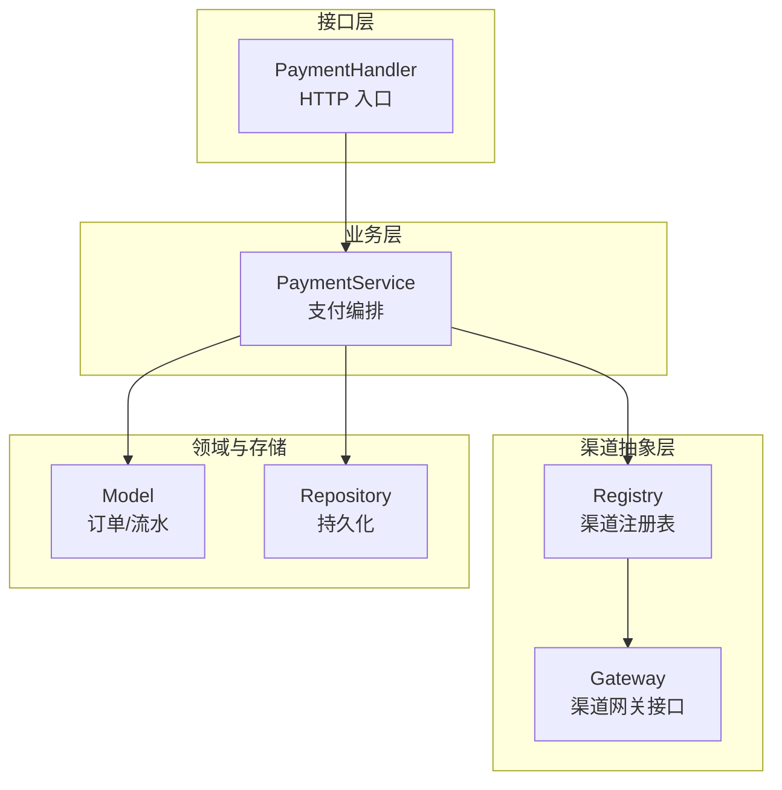
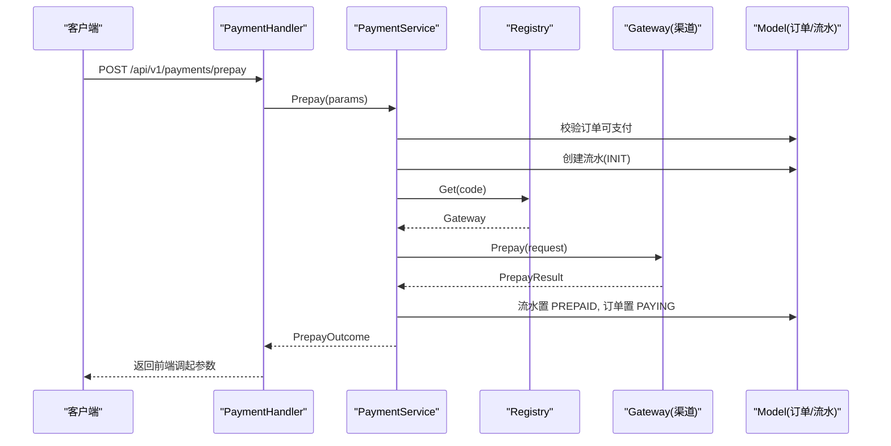
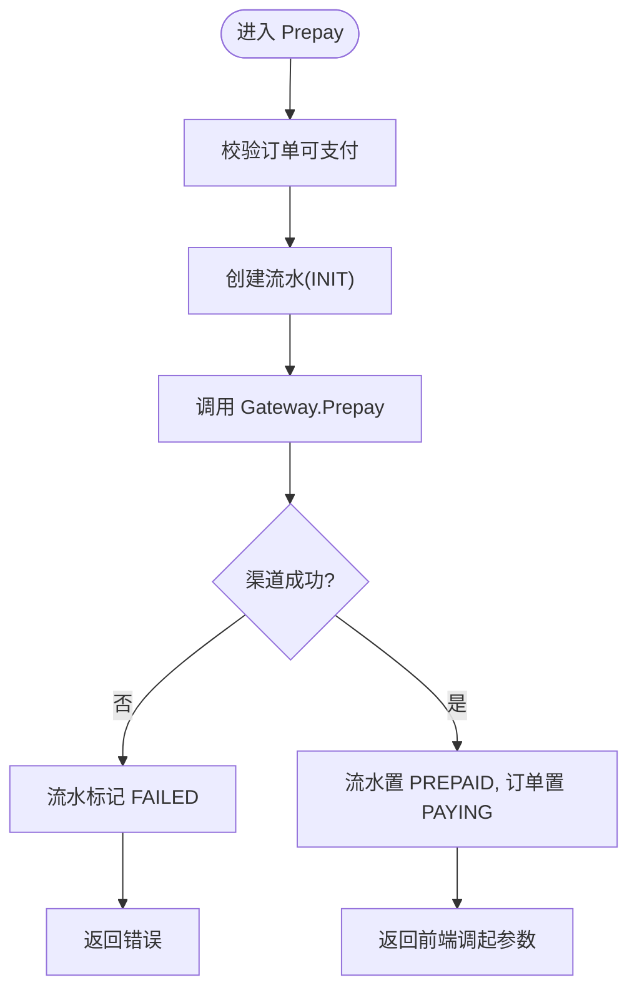
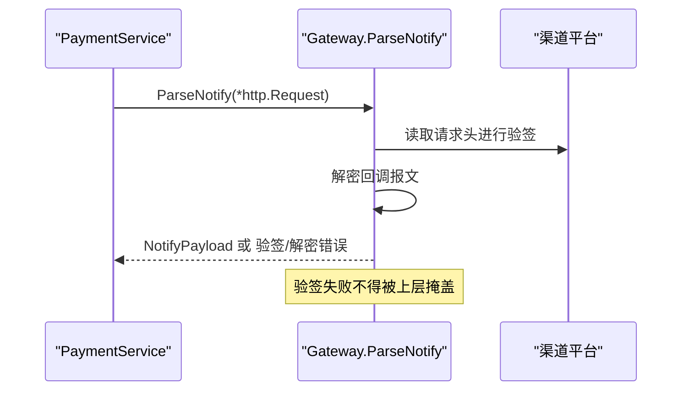
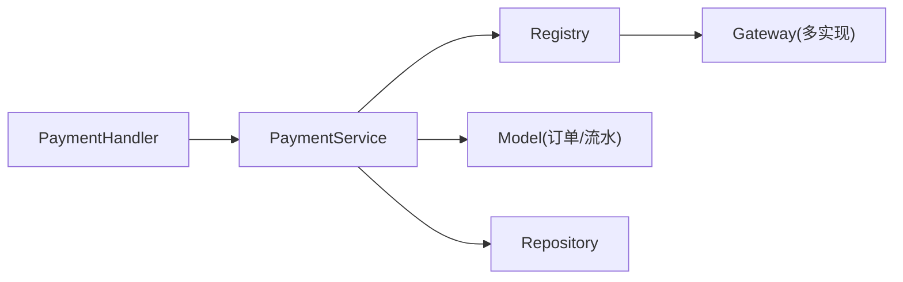

# 渠道接口设计

<cite>
**本文引用的文件**   
- [internal/channel/registry.go](file://internal/channel/registry.go)
- [internal/channel/wechatpay/doc.go](file://internal/channel/wechatpay/doc.go)
- [internal/service/payment_service.go](file://internal/service/payment_service.go)
- [internal/handler/payment_handler.go](file://internal/handler/payment_handler.go)
- [internal/dto/payment.go](file://internal/dto/payment.go)
- [internal/model/payment.go](file://internal/model/payment.go)
- [README.md](file://README.md)
</cite>

## 目录
1. [引言](#引言)
2. [项目结构](#项目结构)
3. [核心组件](#核心组件)
4. [架构总览](#架构总览)
5. [详细组件分析](#详细组件分析)
6. [依赖关系分析](#依赖关系分析)
7. [性能与可靠性考虑](#性能与可靠性考虑)
8. [故障排查指南](#故障排查指南)
9. [结论](#结论)
10. [附录：接口定义与使用示例](#附录接口定义与使用示例)

## 引言
本文围绕支付系统的“渠道抽象层”，系统化说明 channel.Gateway 接口的六个核心方法：Code、Prepay、QueryOrder、CloseOrder、ParseNotify、Refund。文档从系统架构、数据流、错误处理、并发安全、幂等性与可观测性等维度展开，帮助读者在实现新渠道或扩展现有能力时，遵循一致的设计约定与最佳实践。

## 项目结构
本仓库采用分层与按功能域组织相结合的结构：
- internal/channel：渠道抽象与注册表，定义 Gateway 接口与 Code 类型，提供并发安全的 Registry。
- internal/service：支付业务编排，负责订单与流水状态机、调用渠道、回调与查单统一处理。
- internal/handler：HTTP 接口层，将外部请求转换为 service 入参并返回 DTO。
- internal/dto：对外请求与响应结构。
- internal/model：领域模型（订单、支付流水）与状态机。
- internal/channel/wechatpay：微信支付渠道占位包，包含接入指引与安全红线。

图表来源
- [internal/handler/payment_handler.go:16-51](file://internal/handler/payment_handler.go#L16-L51)
- [internal/service/payment_service.go:34-73](file://internal/service/payment_service.go#L34-L73)
- [internal/channel/registry.go:11-29](file://internal/channel/registry.go#L11-L29)

章节来源
- [internal/handler/payment_handler.go:16-51](file://internal/handler/payment_handler.go#L16-L51)
- [internal/service/payment_service.go:34-73](file://internal/service/payment_service.go#L34-L73)
- [internal/channel/registry.go:11-29](file://internal/channel/registry.go#L11-L29)

## 核心组件
- Channel.Code：渠道唯一标识类型，用于注册、查找与日志输出。
- Channel.Gateway：渠道网关接口，封装各支付渠道的六项核心能力。
- Channel.Registry：并发安全的渠道注册表，管理 Code 到 Gateway 的映射。
- PaymentService：支付服务，编排订单、流水与渠道交互，统一回调与查单路径。
- Model.Payment：支付流水模型与状态机，保证 INIT→PREPAID→SUCCESS/FAILED/CLOSED 的合法流转。

章节来源
- [internal/channel/registry.go:11-29](file://internal/channel/registry.go#L11-L29)
- [internal/service/payment_service.go:34-73](file://internal/service/payment_service.go#L34-L73)
- [internal/model/payment.go:10-33](file://internal/model/payment.go#L10-L33)

## 架构总览
下图展示一次预支付的端到端流程：Handler 接收请求，Service 校验订单与流水，通过 Registry 获取具体 Gateway，调用 Prepay，再更新本地流水与订单状态。

图表来源
- [internal/handler/payment_handler.go:26-51](file://internal/handler/payment_handler.go#L26-L51)
- [internal/service/payment_service.go:99-186](file://internal/service/payment_service.go#L99-L186)
- [internal/channel/registry.go:63-74](file://internal/channel/registry.go#L63-L74)

## 详细组件分析

### Code 类型与命名规范
- 设计目的：作为渠道的唯一键，贯穿注册、查找、日志与健康检查；避免字符串魔法值散落各处。
- 命名建议：
  - 使用小写英文短横线或下划线风格，如 mock、wechatpay。
  - 保持语义清晰且稳定，避免频繁变更导致历史数据不一致。
  - 与配置中的渠道开关字段保持一致，便于装配阶段按配置注册。
- 行为约定：
  - Code 必须非空，否则 Registry.Register 会拒绝注册。
  - Codes() 返回已注册编码并按字典序排序，利于日志与监控对比。

章节来源
- [internal/channel/registry.go:31-52](file://internal/channel/registry.go#L31-L52)
- [internal/channel/registry.go:85-98](file://internal/channel/registry.go#L85-L98)

### Gateway 接口总览
Gateway 是渠道抽象的核心，六个方法分别承担：
- Code：返回渠道唯一标识。
- Prepay：发起预支付，返回前端调起所需参数。
- QueryOrder：查询订单状态，返回 NotifyPayload。
- CloseOrder：关闭订单。
- ParseNotify：解析渠道异步通知，需原样接收 *http.Request 以完成验签。
- Refund：处理退款。

注意：当前仓库未直接暴露 Gateway 的源码定义，但多处引用其方法与返回类型（如 channel.PrepayResult、channel.NotifyPayload、channel.InvokeParams），并在 wechatpay/doc.go 中明确实现要点。

章节来源
- [internal/channel/wechatpay/doc.go:9-14](file://internal/channel/wechatpay/doc.go#L9-L14)
- [internal/service/payment_service.go:153-163](file://internal/service/payment_service.go#L153-L163)
- [internal/service/payment_service.go:258-275](file://internal/service/payment_service.go#L258-L275)

### Code() 方法
- 职责：返回渠道唯一标识，供 Registry 管理与日志输出。
- 返回值：非空字符串。
- 错误处理：若为空，Registry.Register 会报错并拒绝注册。
- 最佳实践：
  - 与配置文件中的渠道键保持一致。
  - 不要动态生成，应固定为常量。

章节来源
- [internal/channel/registry.go:31-52](file://internal/channel/registry.go#L31-L52)

### Prepay() 方法
- 职责：向渠道发起预支付，返回前端调起所需的参数集合。
- 典型入参（由 Service 组装）：
  - OutTradeNo：商户订单号。
  - Description：商品描述。
  - AmountTotal/Currency：金额与币种。
  - Attach/NotifyURL/TradeType/PayerOpenID/ClientIP：附加信息、回调地址、交易类型、付款人标识与客户端 IP。
- 返回值：channel.PrepayResult，包含 prepay_id、code_url（扫码）、invoke_params（前端调起参数）等。
- 错误处理：
  - 渠道下单失败：Service 将对应流水标记为 FAILED，订单状态不变，允许用户重试。
  - 本地状态推进失败：仍返回调起参数，优先保障收款，后续由回调与查单兜底。
- 并发与幂等：
  - 同一笔订单多次预支付需由 Service 层结合领域状态机控制，避免重复下单。

图表来源
- [internal/service/payment_service.go:99-186](file://internal/service/payment_service.go#L99-L186)

章节来源
- [internal/service/payment_service.go:99-186](file://internal/service/payment_service.go#L99-L186)
- [internal/dto/payment.go:44-58](file://internal/dto/payment.go#L44-L58)

### QueryOrder() 方法
- 职责：主动查询渠道订单状态，返回与回调一致的 NotifyPayload。
- 设计动机：让「主动查单」与「回调通知」共用同一条处理路径，避免逻辑分歧导致状态不一致。
- 返回值：channel.NotifyPayload，包含 out_trade_no、trade_state、trade_state_desc 等。
- 错误处理：
  - 渠道侧查询失败：Service 层记录告警并返回错误，不吞掉安全问题。
  - 本地状态推进失败：同样走统一 HandlePayload 路径，确保一致性。

章节来源
- [README.md:179-180](file://README.md#L179-L180)
- [internal/service/payment_service.go:277-299](file://internal/service/payment_service.go#L277-L299)

### CloseOrder() 方法
- 职责：关闭尚未支付的订单，通常用于超时或用户取消场景。
- 返回值：渠道侧是否接受关单请求的业务结果。
- 错误处理：
  - 渠道拒绝或网络异常：Service 层记录错误并返回，不影响已成功的订单。
  - 本地状态推进失败：应回滚或补偿，避免订单处于中间态。

章节来源
- [internal/channel/wechatpay/doc.go:86-86](file://internal/channel/wechatpay/doc.go#L86-L86)

### ParseNotify() 方法
- 职责：解析渠道异步通知，完成签名验证与报文解密，返回 NotifyPayload。
- 关键约束：
  - 必须接收 *http.Request，而非 []byte，因为验签需要读取 Wechatpay-Signature、Wechatpay-Timestamp、Wechatpay-Nonce、Wechatpay-Serial 等请求头。
  - 验签与解密失败必须原样返回错误，不能降级为内部错误，以免丢失安全告警信号。
- 安全红线：
  - 严禁在日志中打印密钥、证书内容与完整回调报文。
  - 私钥与 APIv3 密钥仅从环境变量或受控位置读取。

图表来源
- [internal/channel/wechatpay/doc.go:63-74](file://internal/channel/wechatpay/doc.go#L63-L74)
- [internal/service/payment_service.go:258-275](file://internal/service/payment_service.go#L258-L275)

章节来源
- [internal/channel/wechatpay/doc.go:63-74](file://internal/channel/wechatpay/doc.go#L63-L74)
- [internal/service/payment_service.go:258-275](file://internal/service/payment_service.go#L258-L275)

### Refund() 方法
- 职责：发起退款，支持部分退款与全额退款。
- 典型入参：out_trade_no、refund_no、amount、reason 等。
- 返回值：渠道退款受理结果，可能包含渠道退款单号。
- 错误处理：
  - 渠道拒绝退款（如订单未支付、超出退款期限）：返回明确错误码与描述。
  - 网络或签名失败：Service 层重试策略与告警，但不改变订单最终状态。

章节来源
- [internal/channel/wechatpay/doc.go:9-14](file://internal/channel/wechatpay/doc.go#L9-L14)

## 依赖关系分析
- Handler 依赖 Service，Service 依赖 Registry 与 Model/Repository。
- Registry 持有 Code→Gateway 的映射，Get 不存在时返回 ErrChannelNotRegistered。
- Service 对渠道的调用完全通过 Gateway 接口，屏蔽具体渠道差异。

图表来源
- [internal/handler/payment_handler.go:16-51](file://internal/handler/payment_handler.go#L16-L51)
- [internal/service/payment_service.go:34-73](file://internal/service/payment_service.go#L34-L73)
- [internal/channel/registry.go:63-74](file://internal/channel/registry.go#L63-L74)

章节来源
- [internal/handler/payment_handler.go:16-51](file://internal/handler/payment_handler.go#L16-L51)
- [internal/service/payment_service.go:34-73](file://internal/service/payment_service.go#L34-L73)
- [internal/channel/registry.go:63-74](file://internal/channel/registry.go#L63-L74)

## 性能与可靠性考虑
- 并发安全：Registry 使用 RWMutex，读多写少场景开销可忽略，同时支持未来热加载配置。
- 幂等性：
  - 回调与查单共用 HandlePayload，避免两条路径产生分歧。
  - 并发支付场景下，通过领域状态机与哨兵错误保证只有一方生效。
- 金额精度：全程使用分（int64）表示金额，避免浮点误差。
- 可观测性：Codes() 排序输出，便于健康检查与日志 diff。

章节来源
- [internal/channel/registry.go:11-21](file://internal/channel/registry.go#L11-L21)
- [internal/channel/registry.go:85-98](file://internal/channel/registry.go#L85-L98)
- [README.md:193-205](file://README.md#L193-L205)

## 故障排查指南
- 渠道未注册：
  - 现象：Registry.Get 返回 ErrChannelNotRegistered。
  - 排查：确认启动期是否调用 Register/MustRegister，Code 是否与配置一致。
- 验签失败：
  - 现象：ParseNotify 返回验签错误。
  - 排查：检查请求头是否完整、APIv3 密钥是否正确、日志是否误打敏感信息。
- 重复注册：
  - 现象：Register 报重复注册错误。
  - 排查：检查多个渠道实现是否声明了相同 Code。
- 状态机非法流转：
  - 现象：领域层 transit 返回错误。
  - 排查：确认上游是否绕过领域方法直接修改状态。

章节来源
- [internal/channel/registry.go:31-52](file://internal/channel/registry.go#L31-L52)
- [internal/channel/registry.go:63-74](file://internal/channel/registry.go#L63-L74)
- [internal/channel/wechatpay/doc.go:97-104](file://internal/channel/wechatpay/doc.go#L97-L104)

## 结论
channel.Gateway 将不同支付渠道的能力收敛为统一的六个方法，配合 Registry 与 Service 的状态机与统一处理路径，实现了高内聚、低耦合与强一致性的支付系统。实现新渠道时，只需聚焦于这六个方法的正确实现与安全边界，无需改动上层业务与接口。

## 附录：接口定义与使用示例

### 接口定义（概念级）
- Code：渠道唯一标识类型。
- Gateway：
  - Code() string
  - Prepay(ctx, request) (*PrepayResult, error)
  - QueryOrder(ctx, outTradeNo) (*NotifyPayload, error)
  - CloseOrder(ctx, outTradeNo) (bool, error)
  - ParseNotify(ctx, req *http.Request) (*NotifyPayload, error)
  - Refund(ctx, refundRequest) (*RefundResult, error)

说明：以上为基于仓库上下文的接口契约归纳，实际代码定义位于 channel 包中。

章节来源
- [internal/channel/wechatpay/doc.go:9-14](file://internal/channel/wechatpay/doc.go#L9-L14)
- [internal/service/payment_service.go:153-163](file://internal/service/payment_service.go#L153-L163)
- [internal/service/payment_service.go:258-275](file://internal/service/payment_service.go#L258-L275)

### 使用示例（步骤式）
- 注册渠道：
  - 在应用装配阶段，实例化具体 Gateway 并通过 Registry.MustRegister 注册。
  - 若 Code 为空或重复注册，进程应启动失败。
- 发起预支付：
  - Handler 接收 DTO，构造 Service.PrepayParams。
  - Service 校验订单与流水，调用 Gateway.Prepay，返回前端调起参数。
- 处理回调：
  - Service.HandleNotify 直接透传 *http.Request 给 Gateway.ParseNotify。
  - 验签失败不得被掩盖，必须原样返回错误。
- 主动查单：
  - 使用 Gateway.QueryOrder 获取 NotifyPayload，复用 HandlePayload 统一处理。
- 退款：
  - 调用 Gateway.Refund，根据渠道返回结果更新本地流水与订单状态。

章节来源
- [internal/handler/payment_handler.go:26-51](file://internal/handler/payment_handler.go#L26-L51)
- [internal/service/payment_service.go:99-186](file://internal/service/payment_service.go#L99-L186)
- [internal/service/payment_service.go:258-299](file://internal/service/payment_service.go#L258-L299)
- [internal/channel/registry.go:54-61](file://internal/channel/registry.go#L54-L61)