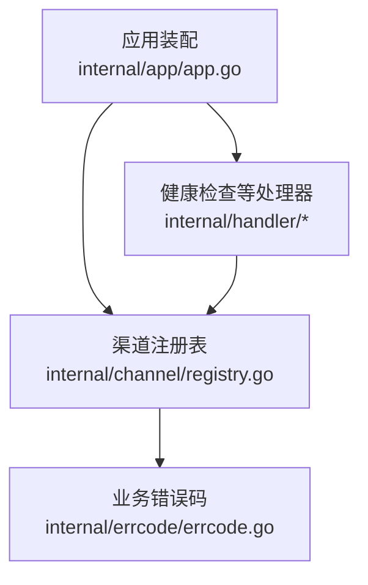
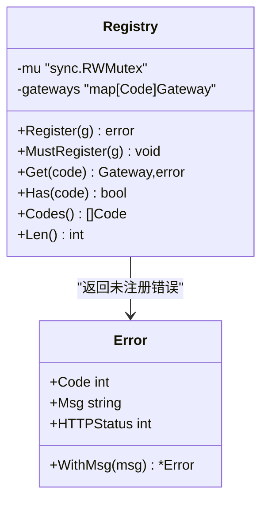
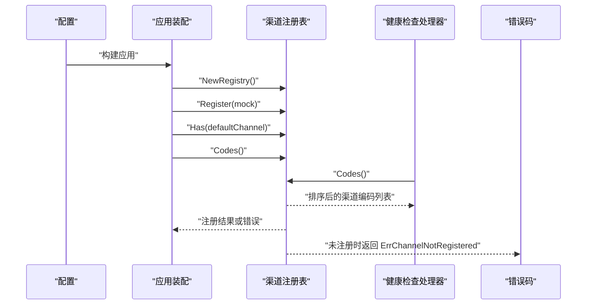
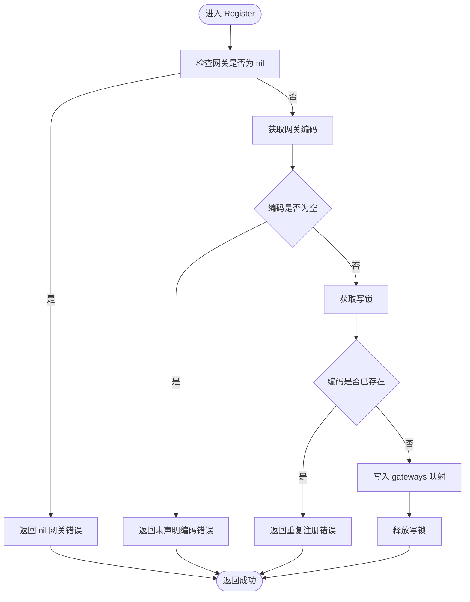
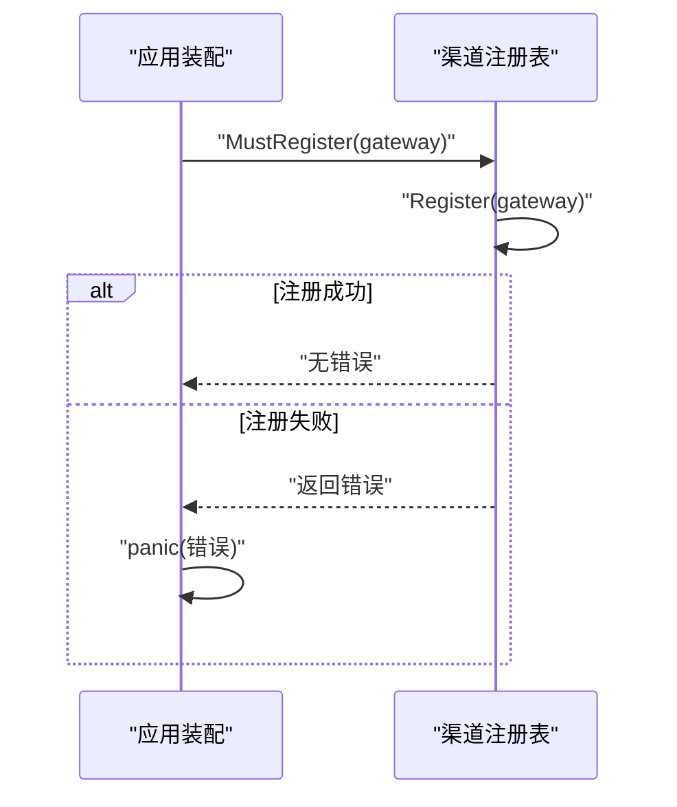
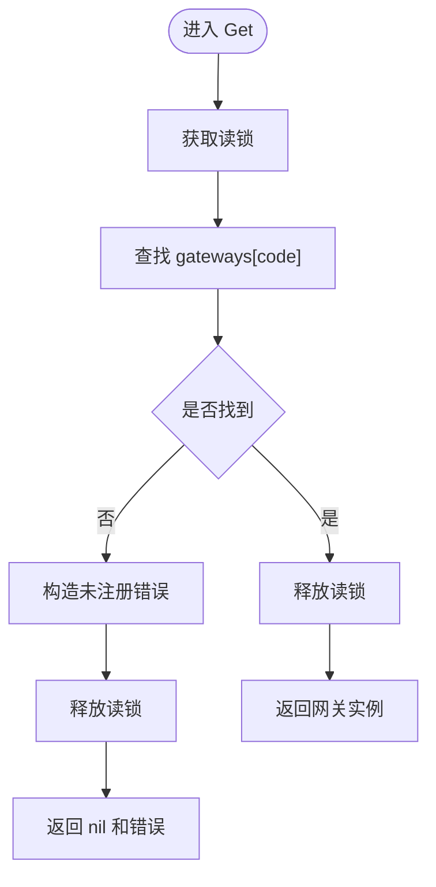
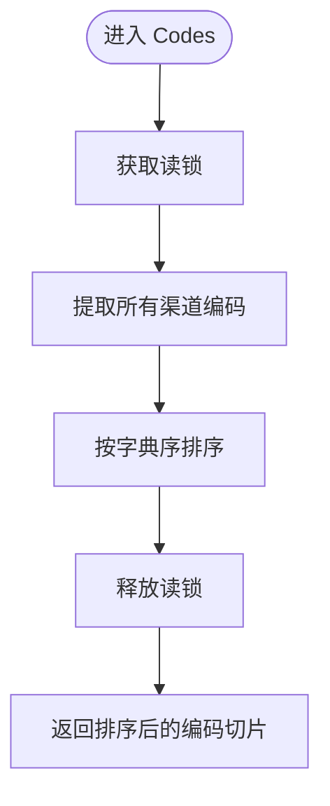
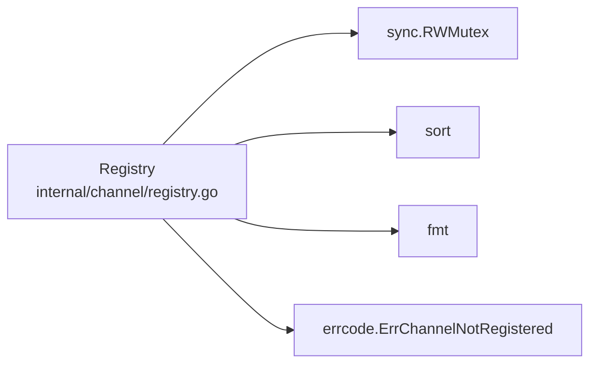
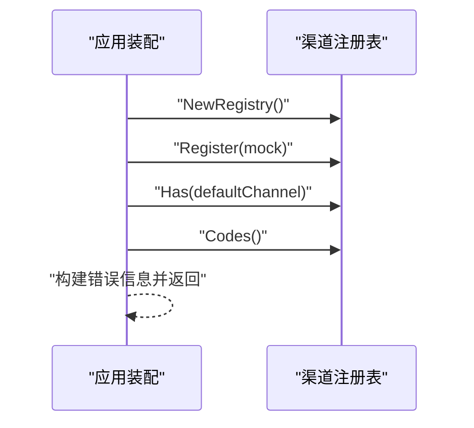

# 渠道注册表

<cite>
**本文引用的文件**   
- [internal/channel/registry.go](file://internal/channel/registry.go)
- [internal/app/app.go](file://internal/app/app.go)
- [internal/errcode/errcode.go](file://internal/errcode/errcode.go)
</cite>

## 目录
1. [引言](#引言)
2. [项目结构中的定位](#项目结构中的定位)
3. [核心组件：Registry 并发安全设计](#核心组件registry-并发安全设计)
4. [架构总览](#架构总览)
5. [关键方法详解](#关键方法详解)
6. [依赖关系分析](#依赖关系分析)
7. [性能与并发特性](#性能与并发特性)
8. [使用示例与最佳实践](#使用示例与最佳实践)
9. [故障排查指南](#故障排查指南)
10. [结论](#结论)

## 引言
本文件围绕支付系统中的“渠道注册表”进行深度文档化，重点解释 `channel.Registry` 的并发安全设计、接口行为、错误处理策略以及在实际应用装配中的使用方式。注册表的核心目标是让“有哪些支付渠道可用”成为运行期数据，而不是编译期硬编码；同时保证在并发访问下不会发生数据竞争，并提供稳定、可诊断的错误语义。

## 项目结构中的定位
渠道注册表位于 `internal/channel` 包中，由应用装配逻辑 `internal/app` 创建并注入到服务层和处理器层。它不直接依赖具体业务实现，而是通过编码（`Code`）查找已注册的网关实现（`Gateway`），从而解耦配置装配与运行时调用。

**图表来源**
- [internal/app/app.go:108-151](file://internal/app/app.go#L108-L151)
- [internal/channel/registry.go:11-24](file://internal/channel/registry.go#L11-L24)
- [internal/errcode/errcode.go:124-134](file://internal/errcode/errcode.go#L124-L134)

**章节来源**
- [internal/app/app.go:108-151](file://internal/app/app.go#L108-L151)
- [internal/channel/registry.go:11-24](file://internal/channel/registry.go#L11-L24)

## 核心组件：Registry 并发安全设计
`Registry` 是渠道注册表的核心结构体，其并发安全设计包含以下关键点：

- **读写锁保护**：内部使用 `sync.RWMutex` 保护 `map[Code]Gateway`。写操作（注册）使用互斥锁，读操作（查询、判断存在、列举编码、获取数量）使用读锁。
- **存储结构**：`gateways map[Code]Gateway` 以渠道编码为键、网关实现为值。
- **只读假设不是实现假设**：注释明确指出，虽然当前装配流程是启动时一次性注册，但不应把“启动后只读”作为实现假设。如果未来支持热加载配置或动态注册，破坏只读假设会导致难以排查的数据竞争；因此从一开始就使用 RWMutex。
- **读多写少场景**：注册通常发生在启动阶段，而 Get/Has/Codes/Len 会在请求路径中被频繁调用，属于典型的读多写少场景，RWMutex 能显著提升并发读取吞吐。

**图表来源**
- [internal/channel/registry.go:21-24](file://internal/channel/registry.go#L21-L24)
- [internal/channel/registry.go:35-52](file://internal/channel/registry.go#L35-L52)
- [internal/channel/registry.go:57-61](file://internal/channel/registry.go#L57-L61)
- [internal/channel/registry.go:64-74](file://internal/channel/registry.go#L64-L74)
- [internal/channel/registry.go:77-83](file://internal/channel/registry.go#L77-L83)
- [internal/channel/registry.go:88-98](file://internal/channel/registry.go#L88-L98)
- [internal/channel/registry.go:101-106](file://internal/channel/registry.go#L101-L106)
- [internal/errcode/errcode.go:20-34](file://internal/errcode/errcode.go#L20-L34)
- [internal/errcode/errcode.go:68-73](file://internal/errcode/errcode.go#L68-L73)

**章节来源**
- [internal/channel/registry.go:11-24](file://internal/channel/registry.go#L11-L24)
- [internal/channel/registry.go:21-24](file://internal/channel/registry.go#L21-L24)

## 架构总览
从系统角度看，渠道注册表处于“装配层”和“运行时调用层”之间：

- 装配阶段：`app.buildRegistry` 根据配置决定是否注册 mock 渠道、是否报错提示微信支付尚未实现、校验默认渠道是否存在。
- 运行时阶段：服务层和处理器层通过 `Registry.Get`、`Registry.Has`、`Registry.Codes` 获取渠道信息。
- 错误层：当渠道未注册时，返回统一的业务错误码 `ErrChannelNotRegistered`，便于上层统一处理并映射 HTTP 状态码。

**图表来源**
- [internal/app/app.go:108-151](file://internal/app/app.go#L108-L151)
- [internal/channel/registry.go:27-29](file://internal/channel/registry.go#L27-L29)
- [internal/channel/registry.go:35-52](file://internal/channel/registry.go#L35-L52)
- [internal/channel/registry.go:77-83](file://internal/channel/registry.go#L77-L83)
- [internal/channel/registry.go:88-98](file://internal/channel/registry.go#L88-L98)
- [internal/errcode/errcode.go:124-134](file://internal/errcode/errcode.go#L124-L134)

## 关键方法详解

### Register：重复注册检测与写入保护
`Register` 负责将一个网关实现注册到注册表中，其关键行为包括：

- **空网关检查**：传入 nil 网关直接返回错误，避免注册无效对象。
- **编码为空检查**：网关必须声明渠道编码，否则视为配置错误。
- **互斥锁保护**：使用 `mu.Lock()` 确保同一时刻只有一个写操作。
- **重复注册检测**：若同一编码已存在，返回错误而不是静默覆盖。支付场景中“哪个实现在生效”必须是确定的，静默覆盖会引入不可预测的状态。
- **写入成功**：将网关放入 `gateways` 映射并返回 nil。

**图表来源**
- [internal/channel/registry.go:35-52](file://internal/channel/registry.go#L35-L52)

**章节来源**
- [internal/channel/registry.go:31-52](file://internal/channel/registry.go#L31-L52)

### MustRegister：启动期失败即 panic
`MustRegister` 是对 `Register` 的包装，用于启动阶段的装配代码。其设计意图是：

- 启动期配置错误应当让进程直接起不来，而不是带着残缺的渠道集合对外服务。
- 如果 `Register` 返回错误，`MustRegister` 直接 `panic`，使问题在启动阶段暴露。
- 该方法仅适用于装配阶段，不适用于请求路径。

**图表来源**
- [internal/channel/registry.go:54-61](file://internal/channel/registry.go#L54-L61)
- [internal/channel/registry.go:35-52](file://internal/channel/registry.go#L35-L52)

**章节来源**
- [internal/channel/registry.go:54-61](file://internal/channel/registry.go#L54-L61)

### Get：按编码获取渠道与错误处理
`Get` 用于按渠道编码取出网关实现：

- 使用读锁保护并发读取。
- 如果编码不存在，返回 `nil` 和 `ErrChannelNotRegistered`，并通过 `WithMsg` 补充上下文信息。
- 如果存在，返回网关实例和 nil 错误。

**图表来源**
- [internal/channel/registry.go:64-74](file://internal/channel/registry.go#L64-L74)
- [internal/errcode/errcode.go:68-73](file://internal/errcode/errcode.go#L68-L73)
- [internal/errcode/errcode.go:124-134](file://internal/errcode/errcode.go#L124-L134)

**章节来源**
- [internal/channel/registry.go:63-74](file://internal/channel/registry.go#L63-L74)
- [internal/errcode/errcode.go:124-134](file://internal/errcode/errcode.go#L124-L134)

### Has：存在性检查
`Has` 用于判断某个渠道编码是否已注册：

- 使用读锁保护并发读取。
- 直接检查 `gateways` 映射是否存在该键。
- 返回布尔值，适合快速判断默认渠道是否可用。

**章节来源**
- [internal/channel/registry.go:76-83](file://internal/channel/registry.go#L76-L83)

### Codes：排序输出保证
`Codes` 返回所有已注册渠道的编码列表，并保证字典序排序：

- 使用读锁保护并发读取。
- 从 `gateways` 中提取所有键。
- 使用排序算法对编码列表排序，确保日志和健康检查输出稳定，便于 diff 排查配置漂移。
- 返回切片，调用方可以安全遍历。

**图表来源**
- [internal/channel/registry.go:85-98](file://internal/channel/registry.go#L85-L98)

**章节来源**
- [internal/channel/registry.go:85-98](file://internal/channel/registry.go#L85-L98)

### Len：已注册渠道数量
`Len` 返回已注册渠道的数量，同样使用读锁保护：

- 适合用于健康检查或监控指标。
- 在 release 模式下，如果数量为 0，说明没有可用支付渠道。

**章节来源**
- [internal/channel/registry.go:100-106](file://internal/channel/registry.go#L100-L106)

## 依赖关系分析
渠道注册表的依赖关系相对简单，主要依赖如下：

- **sync.RWMutex**：提供读写锁。
- **sort**：对编码列表进行排序。
- **fmt**：构造错误消息。
- **payment/internal/errcode**：返回统一业务错误码。

**图表来源**
- [internal/channel/registry.go:3-9](file://internal/channel/registry.go#L3-L9)
- [internal/channel/registry.go:64-74](file://internal/channel/registry.go#L64-L74)

**章节来源**
- [internal/channel/registry.go:3-9](file://internal/channel/registry.go#L3-L9)

## 性能与并发特性
- **读多写少模型**：注册通常在启动阶段完成，Get/Has/Codes/Len 在请求路径中被频繁调用。RWMutex 允许多个读操作并行执行，只在写操作时阻塞其他读写，符合该模型。
- **避免只读假设**：注释明确说明，即使当前是启动时一次性注册，也不应假设“之后只读”。因为未来可能支持热加载配置，此时若仍用普通 map 或简单锁，数据竞争排查成本极高。
- **错误早暴露**：Register 的重复注册检测和 MustRegister 的 panic 行为，使配置错误在启动阶段暴露，避免运行时出现隐蔽状态。
- **稳定输出**：Codes 的排序保证日志和健康检查输出稳定，便于运维对比不同环境或不同部署版本的配置差异。

**章节来源**
- [internal/channel/registry.go:11-24](file://internal/channel/registry.go#L11-L24)
- [internal/channel/registry.go:31-52](file://internal/channel/registry.go#L31-L52)
- [internal/channel/registry.go:54-61](file://internal/channel/registry.go#L54-L61)
- [internal/channel/registry.go:85-98](file://internal/channel/registry.go#L85-L98)

## 使用示例与最佳实践

### 启动期注册示例
应用装配逻辑在启动时创建注册表，并根据配置注册渠道：

- 非 release 模式注册 mock 渠道。
- 如果配置启用微信支付但未实现，直接返回错误。
- 校验默认渠道是否存在，不存在则返回详细错误信息。

**图表来源**
- [internal/app/app.go:108-151](file://internal/app/app.go#L108-L151)
- [internal/channel/registry.go:27-29](file://internal/channel/registry.go#L27-L29)
- [internal/channel/registry.go:77-83](file://internal/channel/registry.go#L77-L83)
- [internal/channel/registry.go:88-98](file://internal/channel/registry.go#L88-L98)

**章节来源**
- [internal/app/app.go:108-151](file://internal/app/app.go#L108-L151)

### 运行时查询示例
健康检查处理器通过 `Registry.Codes()` 获取已注册渠道列表，用于暴露服务状态：

- 调用方不应修改返回的切片。
- 如果渠道未注册，上层应返回明确的业务错误码。

**章节来源**
- [internal/app/app.go:166-173](file://internal/app/app.go#L166-L173)
- [internal/channel/registry.go:88-98](file://internal/channel/registry.go#L88-L98)

### 并发安全使用建议
- **不要在请求路径中注册渠道**：注册应在启动阶段完成。
- **优先使用 Has 做存在性判断**：如果只需要判断是否存在，使用 Has 比 Get 更直观。
- **使用 Codes 做健康检查或日志输出**：排序保证输出稳定。
- **处理 Get 的错误**：不要忽略未注册错误，应将其归一化为业务错误码并返回给调用方。

## 故障排查指南

### 常见错误与原因
- **重复注册**：同一渠道编码被多次注册，Register 会返回错误。这通常是配置错误或装配逻辑缺陷导致。
- **未声明编码**：网关未实现 Code 方法或返回空编码，Register 会返回错误。
- **渠道未注册**：Get 时找不到对应编码，返回 `ErrChannelNotRegistered`。
- **release 模式无可用渠道**：mock 渠道被禁用且微信支付未实现，导致默认渠道不存在。

### 排查步骤
1. 检查启动日志中注册的渠道列表。
2. 确认配置文件中启用的渠道是否在代码中有对应实现。
3. 检查默认渠道是否与已注册渠道一致。
4. 如果 Get 返回未注册错误，检查调用方传入的编码是否正确。
5. 如果是 release 模式无法启动，确认是否误用了本地联调配置。

**章节来源**
- [internal/channel/registry.go:35-52](file://internal/channel/registry.go#L35-L52)
- [internal/channel/registry.go:64-74](file://internal/channel/registry.go#L64-L74)
- [internal/app/app.go:117-149](file://internal/app/app.go#L117-L149)
- [internal/errcode/errcode.go:124-134](file://internal/errcode/errcode.go#L124-L134)

## 结论
渠道注册表通过 `sync.RWMutex` 实现了并发安全的渠道管理，避免了“启动后只读”的脆弱假设，并为支付系统提供了稳定、可诊断的渠道发现机制。Register 的重复注册检测、MustRegister 的 panic 行为、Get 的错误处理、Has 的存在性检查、Codes 的排序输出，共同构成了一个健壮的运行期配置抽象。在实际使用中，应将注册放在启动阶段，将查询放在请求路径，并正确处理未注册错误，以确保支付系统的可靠性和可维护性。