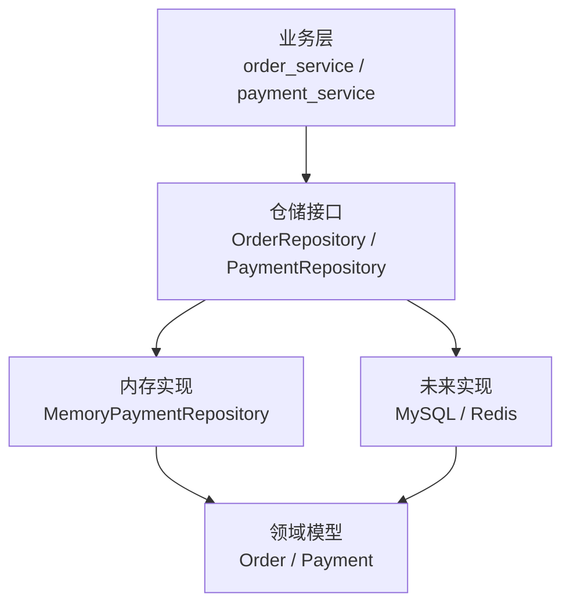
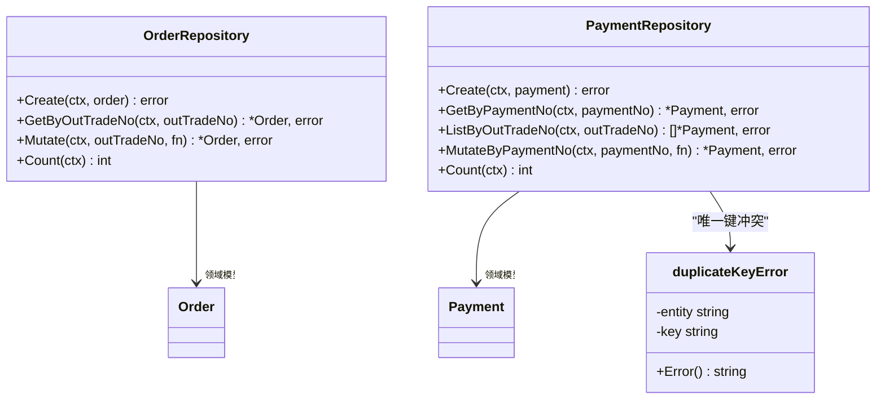
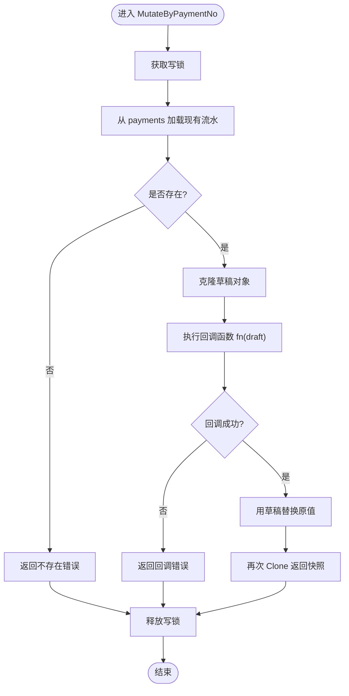
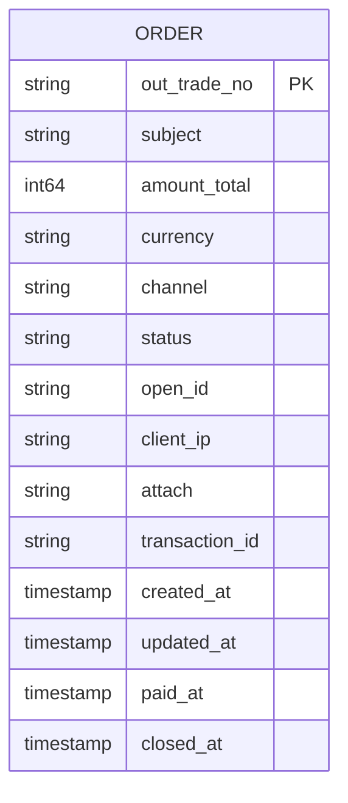
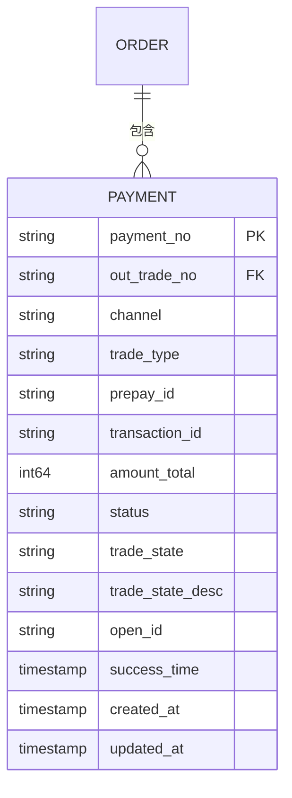
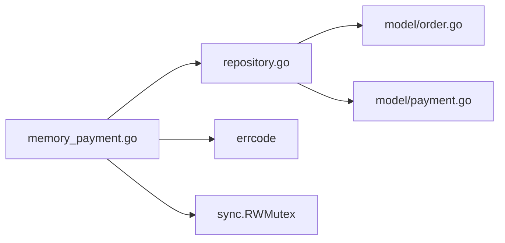

# 数据存储设计

<cite>
**本文引用的文件**   
- [internal/repository/repository.go](file://internal/repository/repository.go)
- [internal/repository/memory_payment.go](file://internal/repository/memory_payment.go)
- [internal/model/order.go](file://internal/model/order.go)
- [internal/model/payment.go](file://internal/model/payment.go)
- [README.md](file://README.md)
</cite>

## 目录
1. [引言](#引言)
2. [项目结构中的存储层定位](#项目结构中的存储层定位)
3. [仓储接口设计原则](#仓储接口设计原则)
4. [内存仓储实现详解](#内存仓储实现详解)
5. [数据模型与持久化策略](#数据模型与持久化策略)
6. [扩展新存储后端的方法](#扩展新存储后端的方法)
7. [依赖关系分析](#依赖关系分析)
8. [性能与并发特性](#性能与并发特性)
9. [故障排查与常见问题](#故障排查与常见问题)
10. [结论](#结论)

## 引言
本文聚焦支付服务的数据存储层，围绕仓储接口的设计动机、内存实现的并发安全策略、领域模型的持久化映射，以及后续接入 MySQL、Redis 等后端的扩展路径展开。目标是让读者既能理解当前内存仓储的实现细节，也能按统一接口平滑迁移到真实数据库或缓存系统。

## 项目结构中的存储层定位
存储层位于 `internal/repository`，对外暴露 `OrderRepository` 与 `PaymentRepository` 两个接口；当前仅提供基于内存的支付流水实现，订单仓储接口已定义但尚未提供具体实现。领域模型集中在 `internal/model`，负责金额单位、状态机与实体克隆；业务逻辑在 `internal/service`，通过仓储接口访问数据，不感知底层是内存还是数据库。

**图表来源**
- [internal/repository/repository.go:27-64](file://internal/repository/repository.go#L27-L64)
- [internal/repository/memory_payment.go:13-32](file://internal/repository/memory_payment.go#L13-L32)
- [internal/model/order.go:73-102](file://internal/model/order.go#L73-L102)
- [internal/model/payment.go:60-89](file://internal/model/payment.go#L60-L89)

**章节来源**
- [README.md:38-62](file://README.md#L38-L62)
- [internal/repository/repository.go:1-19](file://internal/repository/repository.go#L1-L19)

## 仓储接口设计原则
仓储接口承担以下职责：
- 抽象数据访问逻辑：上层只依赖接口，不关心内存、MySQL 或 Redis。
- 保证幂等与原子性：通过 `Mutate` 系列方法把「读取-判断-写回」封装成原子操作，避免支付回调重试导致的竞态。
- 返回副本而非内部指针：防止调用方绕过领域状态机直接修改仓储内对象。
- 明确错误语义：唯一键冲突使用专用错误类型，便于区分创建失败与重放命中。

关键设计点：
- `OrderRepository.Mutate` 与 `PaymentRepository.MutateByPaymentNo` 接收一个回调函数，在锁或事务中执行，回调失败时整体不回滚（内存）或回滚（数据库）。
- `ListByOutTradeNo` 返回空切片而非 nil，简化调用方遍历逻辑。
- `Count` 用于健康检查与测试，不暴露完整列表查询，降低存储层压力。

**图表来源**
- [internal/repository/repository.go:27-64](file://internal/repository/repository.go#L27-L64)
- [internal/repository/repository.go:66-89](file://internal/repository/repository.go#L66-L89)
- [internal/model/order.go:73-102](file://internal/model/order.go#L73-L102)
- [internal/model/payment.go:60-89](file://internal/model/payment.go#L60-L89)

**章节来源**
- [internal/repository/repository.go:1-19](file://internal/repository/repository.go#L1-L19)
- [internal/repository/repository.go:27-89](file://internal/repository/repository.go#L27-L89)

## 内存仓储实现详解
内存仓储 `MemoryPaymentRepository` 维护两份索引：
- `payment_no -> *model.Payment`：按流水号快速定位。
- `out_trade_no -> []string`：按商户订单号聚合流水号，避免全表扫描。

并发安全通过 `sync.RWMutex` 实现：
- 读多写少场景下，`RLock` 允许并发读取。
- 写操作使用独占锁，确保写入原子性。
- 所有对外返回的对象都经过 `Clone()`，调用方拿到的是快照。

写操作采用 draft-copy-then-swap 模式：
- 在锁内复制一份草稿。
- 对草稿执行回调函数。
- 回调成功才替换原值，失败则丢弃草稿。
- 最终再返回一次 `Clone()`，保证外部不可变。

**图表来源**
- [internal/repository/memory_payment.go:92-113](file://internal/repository/memory_payment.go#L92-L113)

**章节来源**
- [internal/repository/memory_payment.go:13-32](file://internal/repository/memory_payment.go#L13-L32)
- [internal/repository/memory_payment.go:34-53](file://internal/repository/memory_payment.go#L34-L53)
- [internal/repository/memory_payment.go:55-64](file://internal/repository/memory_payment.go#L55-L64)
- [internal/repository/memory_payment.go:66-90](file://internal/repository/memory_payment.go#L66-L90)
- [internal/repository/memory_payment.go:92-120](file://internal/repository/memory_payment.go#L92-L120)

## 数据模型与持久化策略
### Order 实体
- 主键：`OutTradeNo`，业务主键，最长 32 字符。
- 金额：`AmountTotal`，单位为分，禁止使用浮点数参与计算。
- 币种：`Currency`，默认 CNY。
- 渠道：`Channel`，支付渠道编码。
- 状态：`Status`，只能通过 `MarkPaying`、`MarkPaid`、`MarkClosed`、`MarkRefunded` 变更。
- 时间字段：`CreatedAt`、`UpdatedAt`、`PaidAt`、`ClosedAt`。
- 渠道侧信息：`TransactionID`、`OpenID`、`ClientIP`、`Attach`。

状态机约束：
- CREATED → PAYING / CLOSED
- PAYING → PAYING / PAID / CLOSED
- PAID → REFUNDED
- CLOSED、REFUNDED 为终态。

持久化建议：
- 状态字段以字符串枚举存储，例如 `CREATED`、`PAYING`、`PAID`、`CLOSED`、`REFUNDED`。
- 金额字段以整数分存储，避免精度丢失。
- 时间字段使用数据库原生时间类型，注意时区一致性。
- 唯一索引：`out_trade_no`。
- 可选索引：`status`、`updated_at`，用于超时关单与查询优化。

**图表来源**
- [internal/model/order.go:73-102](file://internal/model/order.go#L73-L102)
- [internal/model/order.go:20-50](file://internal/model/order.go#L20-L50)
- [internal/model/order.go:108-170](file://internal/model/order.go#L108-L170)

### Payment 实体
- 主键：`PaymentNo`，业务主键。
- 关联：`OutTradeNo`，一对多关系，一个订单对应多条支付尝试。
- 渠道信息：`Channel`、`TradeType`、`PrepayID`、`TransactionID`。
- 金额：`AmountTotal`，必须与订单金额一致。
- 状态：`Status`，仅限 INIT、PREPAID、SUCCESS、FAILED、CLOSED。
- 渠道原始状态：`TradeState`、`TradeStateDesc`。
- 付款人：`OpenID`。
- 时间字段：`SuccessTime`、`CreatedAt`、`UpdatedAt`。

状态机约束：
- INIT → PREPAID / FAILED / CLOSED
- PREPAID → SUCCESS / FAILED / CLOSED
- SUCCESS、FAILED、CLOSED 为终态。

持久化建议：
- 状态字段以字符串枚举存储。
- 渠道原始状态字段保留，便于对账与排障。
- 唯一索引：`payment_no`。
- 普通索引：`out_trade_no`，支撑高频「某订单全部流水」查询。
- 可选索引：`status`、`created_at`，用于统计与清理。

**图表来源**
- [internal/model/payment.go:60-89](file://internal/model/payment.go#L60-L89)
- [internal/model/payment.go:10-33](file://internal/model/payment.go#L10-L33)
- [internal/model/payment.go:91-150](file://internal/model/payment.go#L91-L150)

**章节来源**
- [internal/model/order.go:20-102](file://internal/model/order.go#L20-L102)
- [internal/model/order.go:108-184](file://internal/model/order.go#L108-L184)
- [internal/model/payment.go:10-89](file://internal/model/payment.go#L10-L89)
- [internal/model/payment.go:91-160](file://internal/model/payment.go#L91-L160)

## 扩展新存储后端的方法
### 通用步骤
1. 新增实现包，例如 `internal/repository/mysql_order.go`、`internal/repository/redis_payment.go`。
2. 实现 `OrderRepository` 或 `PaymentRepository` 接口中的所有方法。
3. 将 `Mutate` 类方法映射为数据库事务加行级锁，例如 `SELECT ... FOR UPDATE`。
4. 保持对外返回 `Clone()` 副本，避免调用方污染内部状态。
5. 在装配层注册新实现，替换内存实现。
6. 编写单元测试覆盖：
   - 唯一键冲突。
   - 不存在资源。
   - 并发回调幂等。
   - 状态机非法流转。
   - 列表排序稳定性。

### MySQL 适配要点
- 表结构与 ER 图保持一致，主键与业务键建立唯一索引。
- 写操作使用事务包裹回调函数，回调失败回滚。
- 并发控制使用 `SELECT ... FOR UPDATE`，保证同一笔订单或流水的回调串行化。
- 金额字段使用整型存储分，避免浮点误差。
- 状态字段使用字符串枚举，配合校验逻辑防止非法值。
- 时间字段使用数据库时间类型，注意时区与纳秒精度。

### Redis 适配要点
- 适合做热点缓存或幂等去重，不建议单独作为唯一事实源。
- 可使用 Hash 存储实体字段，String 存储状态与版本号。
- 并发控制使用 Lua 脚本或分布式锁，保证回调原子性。
- 与 MySQL 组合时，遵循 Cache-Aside 或 Write-Through 策略。
- 注意序列化开销与 TTL 管理，避免脏读与过期不一致。

### 装配层替换位置
根据 README 说明，仓储与渠道一样由装配层构造并注入服务层；替换内存实现时，只需在装配处更换具体类型，service 与 handler 无需改动。

**章节来源**
- [README.md:207-209](file://README.md#L207-L209)
- [README.md:274-284](file://README.md#L274-L284)
- [internal/repository/repository.go:1-19](file://internal/repository/repository.go#L1-L19)

## 依赖关系分析
仓储层依赖领域模型，并通过错误类型表达唯一键冲突；内存实现还依赖业务错误码与标准库并发原语。

**图表来源**
- [internal/repository/repository.go:21-25](file://internal/repository/repository.go#L21-L25)
- [internal/repository/memory_payment.go:3-11](file://internal/repository/memory_payment.go#L3-L11)
- [internal/model/order.go:9-15](file://internal/model/order.go#L9-L15)
- [internal/model/payment.go:3-8](file://internal/model/payment.go#L3-L8)

**章节来源**
- [internal/repository/repository.go:21-25](file://internal/repository/repository.go#L21-L25)
- [internal/repository/memory_payment.go:3-11](file://internal/repository/memory_payment.go#L3-L11)

## 性能与并发特性
### 读写分离
- 内存实现使用 `RWMutex`，读操作共享锁，写操作独占锁。
- 高频读路径如 `GetByPaymentNo`、`ListByOutTradeNo`、`Count` 可并发执行。
- 写路径如 `Create`、`MutateByPaymentNo` 会阻塞其他写操作，需尽量缩短临界区。

### 缓存策略
- 内存仓储本身可作为短期缓存，但进程重启会丢失数据。
- 生产环境建议以 MySQL 为主事实源，Redis 作为热点缓存。
- 缓存更新应遵循：先更新数据库，再失效或更新缓存，避免脏数据。
- 对于支付回调，优先走数据库事务幂等，缓存仅加速查询。

### 批量操作优化
- 当前接口未提供批量写入，若需要可通过应用层分批提交。
- 列表查询 `ListByOutTradeNo` 已按创建时间与流水号稳定排序，避免不确定性。
- 数据库层可对 `out_trade_no` 建普通索引，提升按订单查流水的性能。
- 健康检查使用的 `Count` 可直接取内存长度或数据库计数，视实现而定。

### 并发幂等
- 支付回调存在重试与并发投递，仓储层通过 `Mutate` 保证原子性。
- 内存实现用互斥锁，数据库实现用事务加行锁。
- 回调处理应先做快速判断，再进入仓储回调二次校验，命中幂等仍应答成功。

**章节来源**
- [internal/repository/memory_payment.go:18-22](file://internal/repository/memory_payment.go#L18-L22)
- [internal/repository/memory_payment.go:66-90](file://internal/repository/memory_payment.go#L66-L90)
- [internal/repository/repository.go:8-18](file://internal/repository/repository.go#L8-L18)
- [README.md:193-209](file://README.md#L193-L209)

## 故障排查与常见问题
- 唯一键冲突：创建时若主键重复，返回专用冲突错误，调用方可区分「新建失败」与「重放命中」。
- 资源不存在：查询不到订单或流水时返回业务错误码，附带上下文消息。
- 状态机非法流转：领域模型拒绝非法状态变更，错误中包含当前状态与目标状态。
- 并发回调异常：确认仓储层是否正确使用 `Mutate`，回调函数不应做 IO 或耗时操作。
- 列表顺序不稳定：内存实现显式排序，数据库实现应使用 `ORDER BY created_at, payment_no`。

**章节来源**
- [internal/repository/repository.go:66-89](file://internal/repository/repository.go#L66-L89)
- [internal/repository/memory_payment.go:34-53](file://internal/repository/memory_payment.go#L34-L53)
- [internal/repository/memory_payment.go:55-64](file://internal/repository/memory_payment.go#L55-L64)
- [internal/model/order.go:155-170](file://internal/model/order.go#L155-L170)
- [internal/model/payment.go:139-150](file://internal/model/payment.go#L139-L150)

## 结论
当前存储层以接口抽象为核心，内存实现提供并发安全与幂等保障，领域模型固化状态机与金额语义。未来接入 MySQL、Redis 等后端时，只需实现统一接口并在装配层替换，业务层无需改动。生产环境中应结合事务、索引、缓存与健康检查，构建高可靠、可扩展、可观测的数据存储方案。