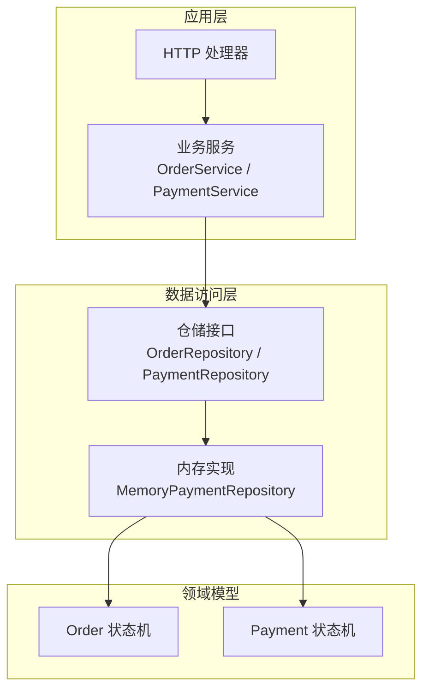
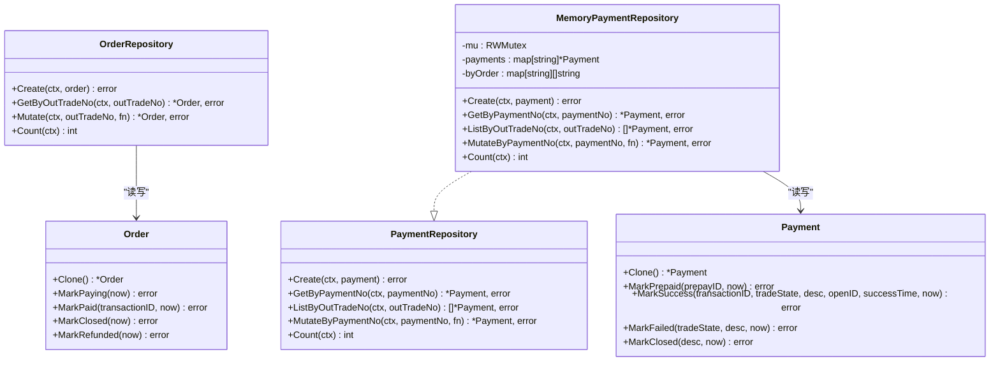
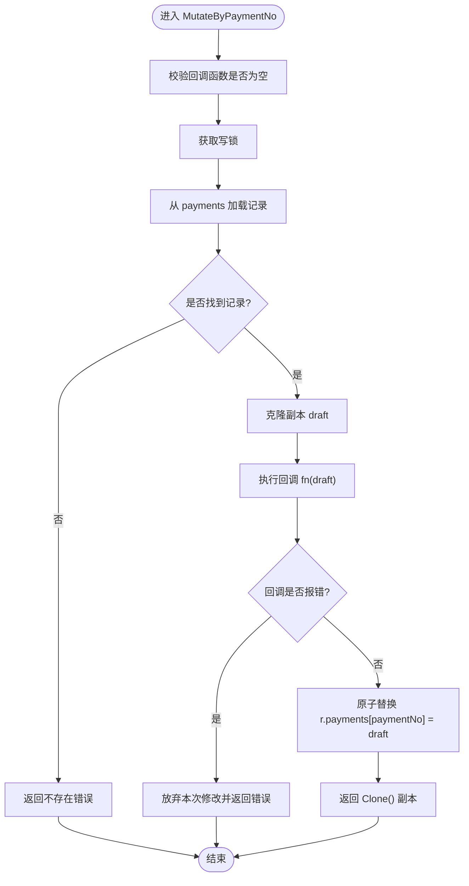
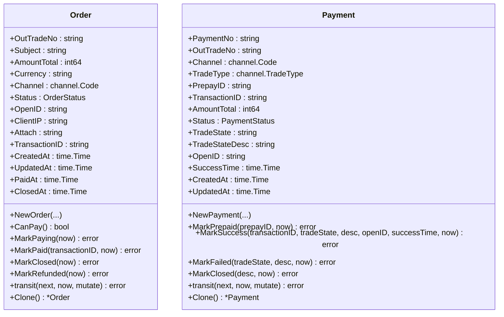
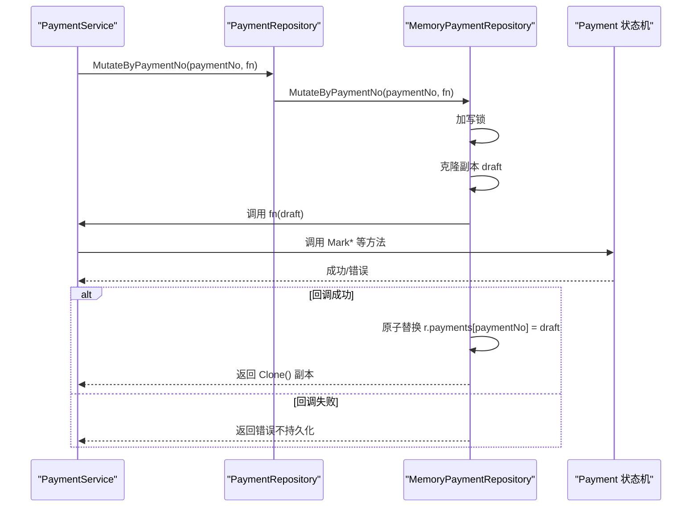
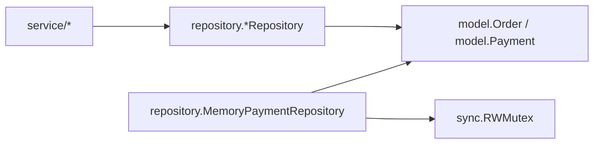

# 数据访问层

<cite>
**本文引用的文件**   
- [repository.go](file://internal/repository/repository.go)
- [memory_payment.go](file://internal/repository/memory_payment.go)
- [order.go](file://internal/model/order.go)
- [payment.go](file://internal/model/payment.go)
- [order_service.go](file://internal/service/order_service.go)
- [payment_service.go](file://internal/service/payment_service.go)
- [README.md](file://README.md)
</cite>

## 目录
1. [引言](#引言)
2. [项目结构](#项目结构)
3. [核心组件](#核心组件)
4. [架构总览](#架构总览)
5. [详细组件分析](#详细组件分析)
6. [依赖关系分析](#依赖关系分析)
7. [性能与并发特性](#性能与并发特性)
8. [扩展至数据库的适配方案](#扩展至数据库的适配方案)
9. [缓存、事务与优化建议](#缓存事务与优化建议)
10. [故障排查指南](#故障排查指南)
11. [结论](#结论)

## 引言
本文件聚焦数据访问层，围绕仓储接口设计与内存实现展开。重点说明：
- OrderRepository 与 PaymentRepository 的设计原则与职责边界
- 如何通过接口抽象解耦具体存储实现
- 内存实现的并发安全机制：读写锁、draft-copy-then-swap、Clone() 语义
- 读写分离策略与幂等保障
- 数据生命周期管理与错误处理
- 扩展到 MySQL、PostgreSQL 等主流数据库的适配思路
- 缓存策略、事务处理与性能优化建议
- 常见模式与问题解决方案

## 项目结构
数据访问层位于 internal/repository，对外暴露两个仓储接口；当前提供内存实现用于快速验证与测试。领域模型位于 internal/model，包含订单与支付流水的状态机与 Clone() 方法。服务层通过接口注入仓储，不感知具体存储实现。

图表来源
- [repository.go:27-64](file://internal/repository/repository.go#L27-L64)
- [memory_payment.go:13-32](file://internal/repository/memory_payment.go#L13-L32)
- [order_service.go:21-51](file://internal/service/order_service.go#L21-L51)
- [payment_service.go:34-46](file://internal/service/payment_service.go#L34-L46)

章节来源
- [repository.go:1-19](file://internal/repository/repository.go#L1-L19)
- [memory_payment.go:1-32](file://internal/repository/memory_payment.go#L1-L32)
- [order_service.go:1-51](file://internal/service/order_service.go#L1-L51)
- [payment_service.go:1-46](file://internal/service/payment_service.go#L1-L46)

## 核心组件
本节梳理仓储接口与内存实现的关键设计点。

- 接口契约
  - OrderRepository：创建订单、按商户单号查询、原子修改、统计总数。
  - PaymentRepository：创建流水、按流水号查询、按商户单号列出全部流水、原子修改、统计总数。
- Mutate 语义
  - 将“读取-判断-写回”封装为回调函数，由存储层保证原子性，避免并发重复回调导致幂等失效。
- 返回副本
  - 所有读操作返回 Clone() 副本，防止调用方绕过领域状态机直接修改内部对象。
- 唯一键冲突错误
  - 定义专用 duplicateKeyError 类型，便于调用方区分“已存在”在不同上下文中的含义（创建失败 vs 幂等命中）。

章节来源
- [repository.go:27-64](file://internal/repository/repository.go#L27-L64)
- [repository.go:66-89](file://internal/repository/repository.go#L66-L89)

## 架构总览
仓储接口作为稳定边界，屏蔽底层存储差异。服务层仅依赖接口，替换实现无需改动业务逻辑。

图表来源
- [repository.go:27-64](file://internal/repository/repository.go#L27-L64)
- [memory_payment.go:13-32](file://internal/repository/memory_payment.go#L13-L32)
- [order.go:73-183](file://internal/model/order.go#L73-L183)
- [payment.go:54-159](file://internal/model/payment.go#L54-L159)

## 详细组件分析

### 仓储接口设计原则
- 以 Mutate 替代裸 Update
  - 支付渠道会重试回调，若“读取-判断-写回”非原子，可能出现重复推进状态。
  - 存储层在内存中用互斥锁保护临界区，在数据库中可用 SELECT ... FOR UPDATE 事务实现。
- 统一返回副本
  - 避免外部直接修改内部指针，破坏领域状态机与内存仓储一致性。
- 明确错误语义
  - 唯一键冲突使用专用错误类型，便于上层区分“创建冲突”和“幂等命中”。

章节来源
- [repository.go:1-19](file://internal/repository/repository.go#L1-L19)
- [repository.go:27-64](file://internal/repository/repository.go#L27-L64)
- [repository.go:66-89](file://internal/repository/repository.go#L66-L89)

### 内存支付仓储并发安全
- 数据结构
  - payments：流水号到对象的映射
  - byOrder：商户单号到流水号列表的冗余索引，避免全表扫描
- 并发控制
  - 使用 sync.RWMutex：读操作使用读锁，写操作使用写锁
  - draft-copy-then-swap：在写锁内克隆副本，修改副本后原子替换原指针
  - 对外一律返回 Clone() 副本，确保调用方无法污染仓储内部数据
- 排序稳定性
  - ListByOutTradeNo 对结果进行稳定排序，时间相同则按流水号兜底，保证确定性

图表来源
- [memory_payment.go:92-113](file://internal/repository/memory_payment.go#L92-L113)

章节来源
- [memory_payment.go:13-32](file://internal/repository/memory_payment.go#L13-L32)
- [memory_payment.go:34-53](file://internal/repository/memory_payment.go#L34-L53)
- [memory_payment.go:55-64](file://internal/repository/memory_payment.go#L55-L64)
- [memory_payment.go:66-90](file://internal/repository/memory_payment.go#L66-L90)
- [memory_payment.go:92-113](file://internal/repository/memory_payment.go#L92-L113)
- [memory_payment.go:115-120](file://internal/repository/memory_payment.go#L115-L120)

### 领域模型与 Clone() 语义
- Order 与 Payment 均提供状态机方法（如 MarkPaying、MarkPaid、MarkPrepaid、MarkSuccess 等），禁止外部直接赋值 Status。
- Clone() 返回浅拷贝副本，仓储层对外返回该副本，避免外部绕过状态机修改内部对象。
- 状态流转通过 transit 统一入口，先校验再变更，保证非法流转不会产生副作用。

图表来源
- [order.go:73-183](file://internal/model/order.go#L73-L183)
- [payment.go:54-159](file://internal/model/payment.go#L54-L159)

章节来源
- [order.go:73-183](file://internal/model/order.go#L73-L183)
- [payment.go:54-159](file://internal/model/payment.go#L54-L159)

### 服务层与仓储接口的协作
- OrderService 与 PaymentService 通过构造函数注入仓储接口，不感知 HTTP 或具体渠道 SDK。
- 服务层在 Mutate 回调中表达幂等命中（例如订单已被其他请求标记为已支付），仓储回调返回错误即放弃本次修改。

图表来源
- [payment_service.go:34-46](file://internal/service/payment_service.go#L34-L46)
- [memory_payment.go:92-113](file://internal/repository/memory_payment.go#L92-L113)
- [payment.go:106-150](file://internal/model/payment.go#L106-L150)

章节来源
- [order_service.go:21-51](file://internal/service/order_service.go#L21-L51)
- [payment_service.go:34-46](file://internal/service/payment_service.go#L34-L46)

## 依赖关系分析
- repository 包仅依赖 model 与 errcode，不依赖 HTTP、渠道 SDK 或具体数据库驱动。
- service 层依赖 repository 接口与 model，保持纯业务逻辑可测性。
- memory_payment.go 依赖 sync.RWMutex 与 model，实现内存并发安全。

图表来源
- [order_service.go:21-51](file://internal/service/order_service.go#L21-L51)
- [payment_service.go:34-46](file://internal/service/payment_service.go#L34-L46)
- [memory_payment.go:13-32](file://internal/repository/memory_payment.go#L13-L32)

章节来源
- [repository.go:1-19](file://internal/repository/repository.go#L1-L19)
- [memory_payment.go:1-11](file://internal/repository/memory_payment.go#L1-L11)

## 性能与并发特性
- 读写分离
  - 读操作（GetByPaymentNo、ListByOutTradeNo、Count）使用读锁，提升并发读吞吐。
  - 写操作（Create、MutateByPaymentNo）使用写锁，保证原子性与一致性。
- 副本隔离
  - 所有对外返回均为 Clone() 副本，避免共享可变状态导致的竞态。
- 冗余索引
  - byOrder 索引避免按商户单号查询时的全表扫描，对应数据库侧普通索引。
- 排序稳定性
  - ListByOutTradeNo 使用稳定排序，时间相同时按流水号兜底，保证结果确定性。

章节来源
- [memory_payment.go:55-64](file://internal/repository/memory_payment.go#L55-L64)
- [memory_payment.go:66-90](file://internal/repository/memory_payment.go#L66-L90)
- [memory_payment.go:115-120](file://internal/repository/memory_payment.go#L115-L120)

## 扩展至数据库的适配方案
- 通用原则
  - 新增数据库实现时，仅需实现 OrderRepository 与 PaymentRepository 接口，并在装配层替换内存实现。
  - Mutate/MutateByPaymentNo 回调中使用数据库事务，结合 SELECT ... FOR UPDATE 保证原子性。
  - 对外仍返回 ORM 扫描后的实体副本，保持与内存实现一致的 Clone() 语义。
- MySQL 适配要点
  - 唯一键约束：out_trade_no、payment_no 建唯一索引，Create 时捕获唯一键冲突错误并转换为 NewDuplicateKeyError。
  - 事务与行级锁：在 Mutate 回调前后开启事务，读取时使用 SELECT ... FOR UPDATE，回调成功后提交，失败则回滚。
  - 索引优化：为 out_trade_no 建立普通索引，加速 ListByOutTradeNo。
- PostgreSQL 适配要点
  - 唯一约束与索引策略同 MySQL。
  - 可使用 FOR UPDATE SKIP LOCKED 在高并发下减少锁竞争（视业务场景选择）。
- 错误映射
  - 数据库唯一键冲突需映射为 repository.NewDuplicateKeyError，以便上层 IsDuplicate 判断。
- 迁移与版本
  - 建议在数据库层引入版本号或乐观锁字段，配合 Mutate 回调做二次校验，增强幂等与一致性。

[本节为概念性指导，不直接分析具体代码文件]

## 缓存、事务与优化建议
- 缓存策略
  - 热点订单可按 out_trade_no 加本地缓存（如 TTL 短时效），注意与仓储写入保持一致性。
  - 缓存失效策略：在 Mutate 成功后主动失效相关缓存条目。
- 事务处理
  - 数据库实现中，Mutate 回调应运行在事务内，回调内不应进行 IO 或耗时操作，避免放大锁持有时间。
- 性能优化
  - 批量写入：对于高吞吐场景，可将 Create 合并为批量插入，但需保证唯一键冲突的正确处理。
  - 分页与游标：当流水量增长时，ListByOutTradeNo 应考虑分页或基于时间的游标查询。
  - 连接池与超时：合理配置数据库连接池大小、读写超时与重试策略。
- 可观测性
  - 在仓储层增加慢查询日志与指标埋点，监控锁等待、事务时长与错误率。

[本节为通用优化建议，不直接分析具体代码文件]

## 故障排查指南
- 常见问题
  - 唯一键冲突：Create 返回 NewDuplicateKeyError，上层可通过 IsDuplicate 判断是否为幂等命中。
  - 回调重复投递：确保 Mutate 回调内幂等处理正确，避免重复推进状态。
  - 并发竞态：检查是否误返回内部指针而非 Clone() 副本。
  - 排序不稳定：确认 ListByOutTradeNo 的稳定排序逻辑未被绕过。
- 定位手段
  - 在服务层使用哨兵错误表达“已是目标状态”，避免掩盖真正的非法流转。
  - 借助 request_id 贯穿链路日志，串联一次请求的所有仓储调用。

章节来源
- [repository.go:66-89](file://internal/repository/repository.go#L66-L89)
- [payment_service.go:23-32](file://internal/service/payment_service.go#L23-L32)
- [README.md:207-213](file://README.md#L207-L213)

## 结论
数据访问层通过清晰的仓储接口与内存实现，实现了存储抽象与并发安全的平衡。Mutate 语义与 Clone() 策略共同保障了幂等与一致性；读写分离与副本隔离提升了并发性能。未来扩展到数据库实现时，只需遵循接口契约与事务语义，即可在不改动服务层的前提下完成平滑迁移。