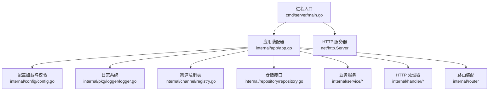
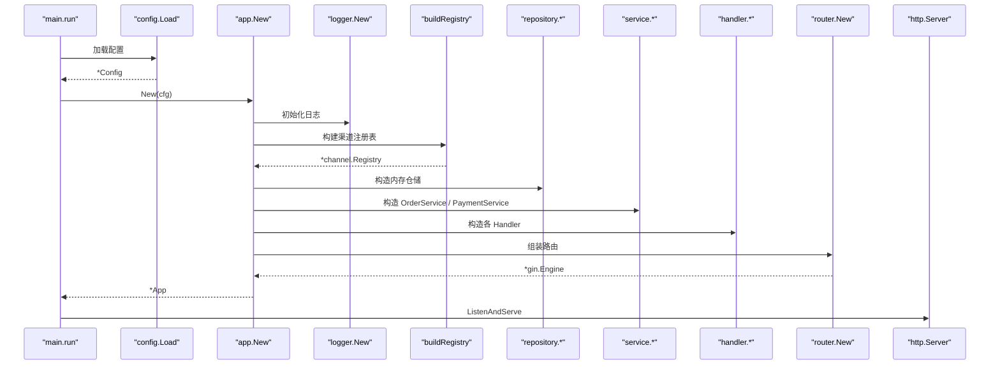
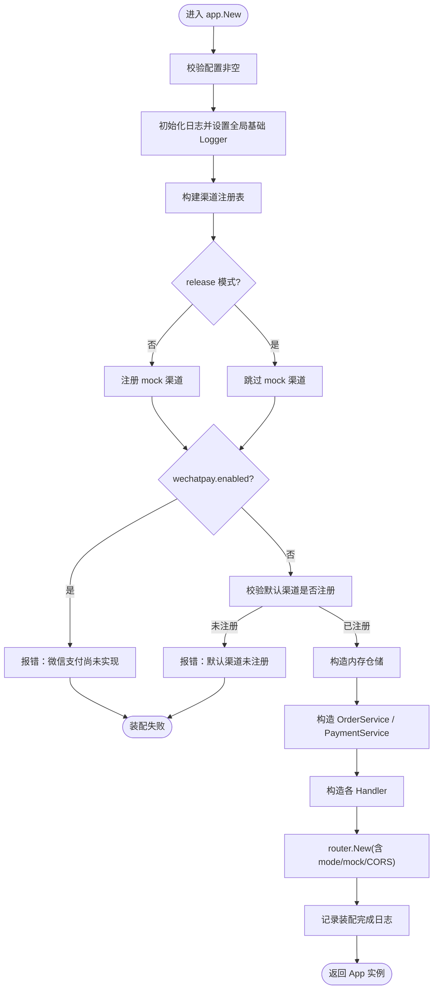
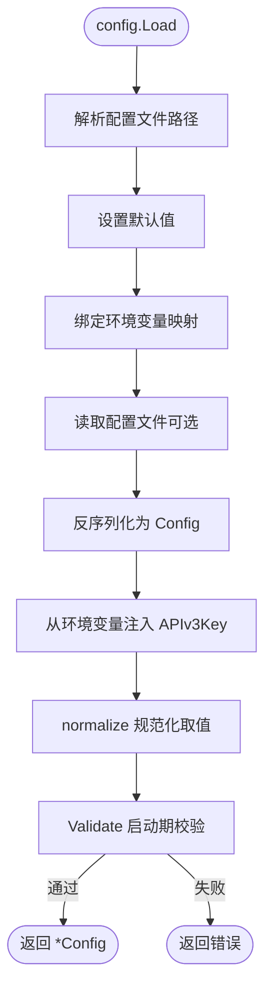
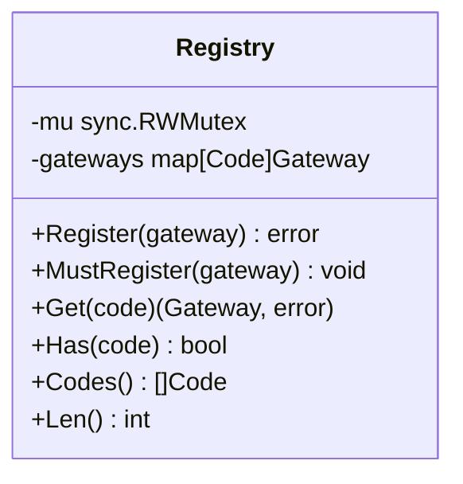
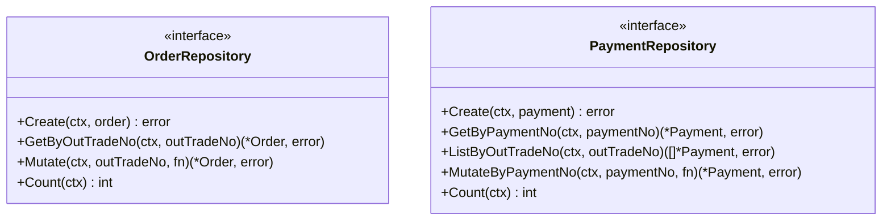
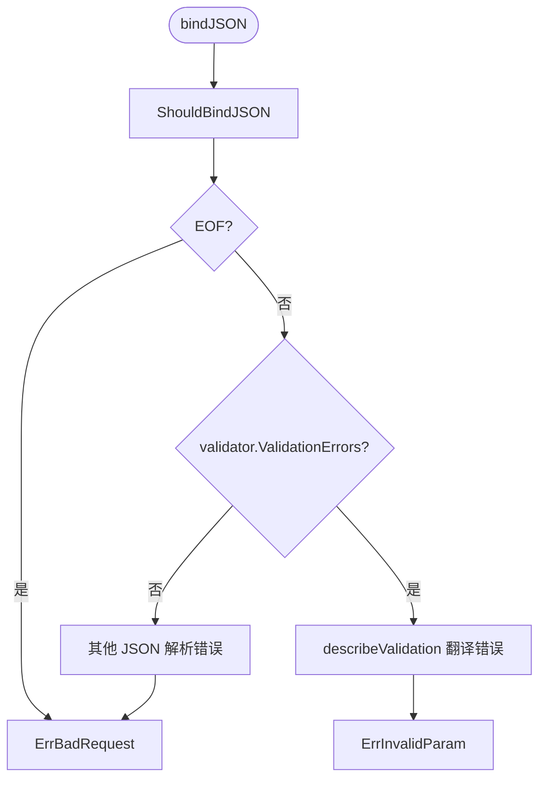
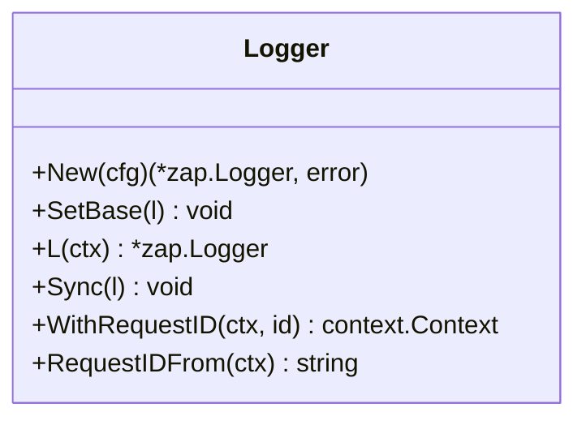
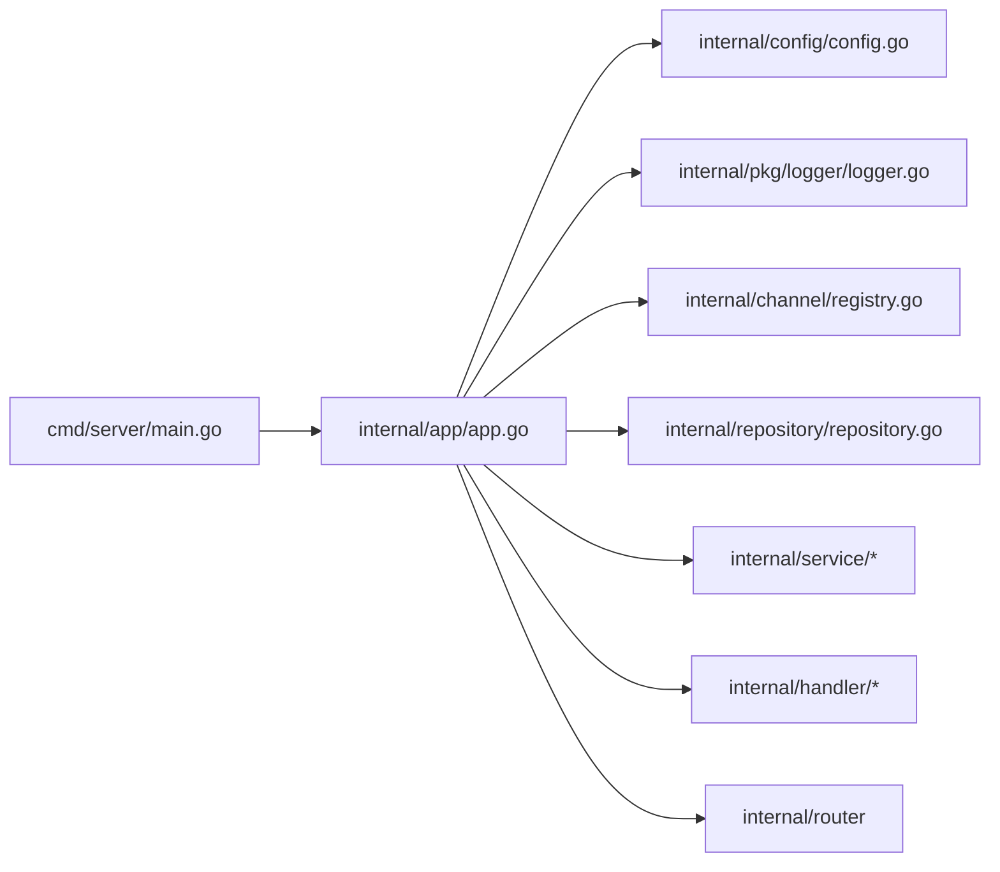

# 依赖注入与装配

<cite>
**本文引用的文件**   
- [cmd/server/main.go](file://cmd/server/main.go)
- [internal/app/app.go](file://internal/app/app.go)
- [configs/config.yaml](file://configs/config.yaml)
- [internal/config/config.go](file://internal/config/config.go)
- [internal/channel/registry.go](file://internal/channel/registry.go)
- [internal/repository/repository.go](file://internal/repository/repository.go)
- [internal/handler/handler.go](file://internal/handler/handler.go)
- [internal/service/order_service.go](file://internal/service/order_service.go)
- [internal/service/payment_service.go](file://internal/service/payment_service.go)
- [internal/pkg/logger/logger.go](file://internal/pkg/logger/logger.go)
</cite>

## 目录
1. [引言](#引言)
2. [项目结构](#项目结构)
3. [核心组件](#核心组件)
4. [架构总览](#架构总览)
5. [详细组件分析](#详细组件分析)
6. [依赖关系分析](#依赖关系分析)
7. [性能与生命周期特性](#性能与生命周期特性)
8. [故障排查指南](#故障排查指南)
9. [结论](#结论)

## 引言
本文聚焦支付服务的依赖注入与装配机制，重点解释为何采用手工装配而非 wire/fx 等框架，以及 App 结构体如何作为唯一的装配点，按配置顺序构建日志、渠道注册表、仓储、服务、处理器和路由。文档还说明配置驱动的对象生命周期管理、启动期校验与失败快速返回策略、环境差异处理（debug/release/test），并提供装配流程图与定位装配阶段问题的排障指南。

## 项目结构
本项目采用分层组织：
- cmd/server：进程入口，负责参数解析、配置加载、应用装配、HTTP 服务启动与优雅关闭。
- internal/app：唯一装配点，串联配置、日志、渠道、仓储、服务、处理器与路由。
- internal/config：配置加载、默认值、环境变量绑定与启动期校验。
- internal/channel：渠道抽象与并发安全的注册表。
- internal/repository：存储层接口定义；当前使用内存实现。
- internal/service：订单与支付业务逻辑。
- internal/handler：HTTP 接入层，负责请求解析、校验与响应封装。
- internal/router：路由组装（由 app 调用）。
- internal/pkg/logger：基于 zap 的日志封装与上下文传递。

**图表来源**
- [cmd/server/main.go:31-124](file://cmd/server/main.go#L31-L124)
- [internal/app/app.go:39-106](file://internal/app/app.go#L39-L106)
- [internal/config/config.go:113-155](file://internal/config/config.go#L113-L155)
- [internal/pkg/logger/logger.go:53-93](file://internal/pkg/logger/logger.go#L53-L93)
- [internal/channel/registry.go:11-29](file://internal/channel/registry.go#L11-L29)
- [internal/repository/repository.go:27-64](file://internal/repository/repository.go#L27-L64)

**章节来源**
- [cmd/server/main.go:1-124](file://cmd/server/main.go#L1-L124)
- [internal/app/app.go:1-12](file://internal/app/app.go#L1-L12)

## 核心组件
- App：已装配完成的应用实例，持有 Gin 引擎、全局日志、配置与渠道注册表，提供 Engine、Logger、Config、Registry 访问方法，并负责资源释放。
- Config：统一承载 server、log、payment、channels 配置，提供 Load、Validate、IsRelease、NotifyURL 等方法，保证启动前配置合法。
- channel.Registry：并发安全的渠道注册表，支持 Register、Get、Has、Codes、Len，防止重复注册与未注册渠道访问。
- repository.OrderRepository/PaymentRepository：存储层接口，强调原子 Mutate 与对外返回副本，避免并发回调导致的幂等失效与状态污染。
- service.OrderService/PaymentService：订单创建与支付发起、回调处理、状态查询与对账兜底的核心业务逻辑。
- handler：HTTP 接入层，负责 JSON 绑定、字段校验、错误分类与面向客户端的错误提示。
- logger：基于 zap 的日志封装，提供全局基础 Logger、上下文关联 request_id、格式化输出与 flush。

**章节来源**
- [internal/app/app.go:31-106](file://internal/app/app.go#L31-L106)
- [internal/config/config.go:39-155](file://internal/config/config.go#L39-L155)
- [internal/channel/registry.go:11-107](file://internal/channel/registry.go#L11-L107)
- [internal/repository/repository.go:27-64](file://internal/repository/repository.go#L27-L64)
- [internal/service/order_service.go:21-51](file://internal/service/order_service.go#L21-L51)
- [internal/service/payment_service.go:34-73](file://internal/service/payment_service.go#L34-L73)
- [internal/handler/handler.go:1-24](file://internal/handler/handler.go#L1-L24)
- [internal/pkg/logger/logger.go:1-18](file://internal/pkg/logger/logger.go#L1-L18)

## 架构总览
App 是唯一的装配点，遵循“配置 -> 日志 -> 渠道注册 -> 仓储 -> 服务 -> 处理器 -> 路由”的单向链式依赖图。选择手工装配的原因：
- 依赖图简单且无循环依赖，无需复杂 DI 框架。
- 代码量更少、跳转更直接，出错时不需要理解框架生成规则。
- 替换存储或新增渠道时改动集中在装配处，符合分层设计目标。

**图表来源**
- [cmd/server/main.go:39-87](file://cmd/server/main.go#L39-L87)
- [internal/app/app.go:45-106](file://internal/app/app.go#L45-L106)
- [internal/config/config.go:113-155](file://internal/config/config.go#L113-L155)
- [internal/pkg/logger/logger.go:53-93](file://internal/pkg/logger/logger.go#L53-L93)
- [internal/channel/registry.go:27-51](file://internal/channel/registry.go#L27-L51)
- [internal/repository/repository.go:27-64](file://internal/repository/repository.go#L27-L64)
- [internal/service/order_service.go:32-51](file://internal/service/order_service.go#L32-L51)
- [internal/service/payment_service.go:59-73](file://internal/service/payment_service.go#L59-L73)

**章节来源**
- [internal/app/app.go:1-12](file://internal/app/app.go#L1-L12)
- [internal/app/app.go:39-106](file://internal/app/app.go#L39-L106)

## 详细组件分析

### App 装配流程与环境差异
App.New 按以下顺序装配：
1. 校验配置非空。
2. 初始化日志并设为全局基础 Logger。
3. 构建渠道注册表：根据 IsRelease 决定是否注册 mock 渠道；若 wechatpay.enabled=true 但未实现则直接报错；校验默认渠道是否可用。
4. 构造内存仓储（可替换为 MySQL 等实现）。
5. 构造 OrderService 与 PaymentService，注入仓储、注册表与配置项。
6. 构造处理器并传入路由装配器，依据 IsRelease 控制调试路由开关与 CORS 白名单。
7. 记录装配完成日志并返回 App 实例。

**图表来源**
- [internal/app/app.go:45-106](file://internal/app/app.go#L45-L106)
- [internal/app/app.go:108-152](file://internal/app/app.go#L108-L152)
- [internal/app/app.go:154-164](file://internal/app/app.go#L154-L164)

**章节来源**
- [internal/app/app.go:45-106](file://internal/app/app.go#L45-L106)
- [internal/app/app.go:108-152](file://internal/app/app.go#L108-L152)
- [internal/app/app.go:154-164](file://internal/app/app.go#L154-L164)

### 配置驱动的生命周期与启动期校验
- 配置加载优先级：环境变量 > 配置文件 > 内置默认值。
- 密钥类配置仅通过环境变量注入，避免被写入配置文件。
- normalize 统一大小写与空白，确保模式、级别、格式等取值稳定。
- Validate 在启动阶段严格校验端口范围、超时时间、日志格式、默认渠道、release 模式下回调地址必须 HTTPS，以及微信支付凭据完整性与文件可读性。
- 任何一步失败都让进程启动失败，不降级运行，避免带病上线。

**图表来源**
- [internal/config/config.go:113-155](file://internal/config/config.go#L113-L155)
- [internal/config/config.go:157-207](file://internal/config/config.go#L157-L207)
- [internal/config/config.go:209-268](file://internal/config/config.go#L209-L268)
- [internal/config/config.go:270-321](file://internal/config/config.go#L270-L321)

**章节来源**
- [internal/config/config.go:113-155](file://internal/config/config.go#L113-L155)
- [internal/config/config.go:157-207](file://internal/config/config.go#L157-L207)
- [internal/config/config.go:209-268](file://internal/config/config.go#L209-L268)
- [internal/config/config.go:270-321](file://internal/config/config.go#L270-L321)

### 渠道注册表与并发安全
- Registry 使用 RWMutex 保护 map，读多写少场景开销低。
- Register 拒绝 nil 网关与重复注册，避免运行时行为不确定。
- Get 返回 ErrChannelNotRegistered，便于上层区分未注册与内部错误。
- Codes 排序输出，使健康检查与日志稳定，便于 diff 排查配置漂移。

**图表来源**
- [internal/channel/registry.go:11-107](file://internal/channel/registry.go#L11-L107)

**章节来源**
- [internal/channel/registry.go:11-107](file://internal/channel/registry.go#L11-L107)

### 仓储接口与幂等设计
- OrderRepository 与 PaymentRepository 提供 Create、GetBy*、Mutate/MutateBy*、ListByOutTradeNo、Count 等方法。
- Mutate 将临界区交给存储层：内存实现用互斥锁，数据库实现对应 SELECT ... FOR UPDATE 事务，避免并发回调导致的状态不一致。
- 对外一律返回副本，防止调用方绕过领域模型状态机直接修改内部数据。

**图表来源**
- [internal/repository/repository.go:27-64](file://internal/repository/repository.go#L27-L64)

**章节来源**
- [internal/repository/repository.go:1-19](file://internal/repository/repository.go#L1-L19)
- [internal/repository/repository.go:27-64](file://internal/repository/repository.go#L27-L64)

### 处理器与请求校验
- handler 包职责边界清晰：解析与校验请求参数、转换 DTO 与服务入参出参、按契约写响应。
- bindJSON 区分三类失败：请求体为空、JSON 语法错误、字段校验失败，分别返回不同错误码，便于前端给出有效提示。
- describeValidation 把 validator 的错误翻译成面向客户端的中文提示，字段名取自 JSON tag。

**图表来源**
- [internal/handler/handler.go:29-55](file://internal/handler/handler.go#L29-L55)
- [internal/handler/handler.go:57-78](file://internal/handler/handler.go#L57-L78)

**章节来源**
- [internal/handler/handler.go:1-24](file://internal/handler/handler.go#L1-L24)
- [internal/handler/handler.go:29-55](file://internal/handler/handler.go#L29-L55)
- [internal/handler/handler.go:57-78](file://internal/handler/handler.go#L57-L78)

### 日志系统与上下文传递
- logger.New 按配置构造 zap.Logger，支持 console/json 两种编码器，直接写 stderr。
- SetBase 由 app 装配时设置全局基础 Logger，L(ctx) 每次 With request_id，语义清晰。
- Sync 在进程退出前 flush 日志缓冲，避免丢失关键信息。

**图表来源**
- [internal/pkg/logger/logger.go:53-93](file://internal/pkg/logger/logger.go#L53-L93)
- [internal/pkg/logger/logger.go:121-183](file://internal/pkg/logger/logger.go#L121-L183)

**章节来源**
- [internal/pkg/logger/logger.go:1-18](file://internal/pkg/logger/logger.go#L1-L18)
- [internal/pkg/logger/logger.go:53-93](file://internal/pkg/logger/logger.go#L53-L93)
- [internal/pkg/logger/logger.go:121-183](file://internal/pkg/logger/logger.go#L121-L183)

## 依赖关系分析
- main.run 负责进程生命周期：解析参数、加载配置、装配应用、启动 HTTP 服务、监听信号并优雅关闭。
- app.New 是唯一装配点，依赖 config、logger、channel、repository、service、handler、router。
- service 依赖 repository 接口与 channel.Registry，不感知 HTTP 与具体渠道 SDK。
- handler 依赖 errcode、money 等工具包，不引入业务规则。

**图表来源**
- [cmd/server/main.go:31-124](file://cmd/server/main.go#L31-L124)
- [internal/app/app.go:39-106](file://internal/app/app.go#L39-L106)

**章节来源**
- [cmd/server/main.go:31-124](file://cmd/server/main.go#L31-L124)
- [internal/app/app.go:39-106](file://internal/app/app.go#L39-L106)

## 性能与生命周期特性
- 日志缓冲：zap core 带缓冲，必须在 Close 中 Sync，避免丢失最后几条关键日志。
- 注册表并发：RWMutex 在读多写少场景开销可忽略，避免未来热加载配置时的竞态风险。
- 存储层原子操作：Mutate 在锁/事务内执行，避免并发回调导致幂等失效。
- 优雅关闭：HTTP 服务收到 SIGTERM/SIGINT 后等待存量请求处理完成，防止掉单。

**章节来源**
- [internal/app/app.go:189-199](file://internal/app/app.go#L189-L199)
- [internal/channel/registry.go:17-20](file://internal/channel/registry.go#L17-L20)
- [internal/repository/repository.go:8-18](file://internal/repository/repository.go#L8-L18)
- [cmd/server/main.go:69-124](file://cmd/server/main.go#L69-L124)

## 故障排查指南
- 配置加载失败：检查配置文件路径、环境变量 PAYMENT_CONFIG、PAYMENT_SERVER_MODE、PAYMENT_LOG_LEVEL、WECHATPAY_* 等映射是否正确。
- 启动期校验失败：确认 server.port 在 1-65535，read/write/shutdown_timeout 大于 0，log.format 为 console/json，payment.default_channel 非空；release 模式下 notify_base_url 必须以 https:// 开头。
- 渠道未注册：检查 channels.wechatpay.enabled 与 default_channel；release 模式下 mock 渠道被禁用，需实现微信支付渠道。
- 默认渠道未注册：查看 registry.Codes() 输出，确认默认渠道是否在注册表中。
- 调试路由泄露：确认 cfg.IsRelease() 为 true 时 EnableMockRoutes=false，避免 /api/v1/mock/* 在生产暴露。
- CORS 跨域：release 模式默认不开放跨域，本地开发允许 "*" 以便联调。
- 日志缺失：确认 Close 被调用，确保 Sync 刷新日志缓冲。
- 回调金额不一致：HandlePayload 会拒绝金额不一致的回调，检查订单金额与回调报文是否匹配。
- 并发回调幂等：order.Status.IsPaid() 快速返回，避免重复推进状态；如出现并发冲突，参考 errAlreadyPaidConcurrently 分支。

**章节来源**
- [internal/config/config.go:226-268](file://internal/config/config.go#L226-L268)
- [internal/config/config.go:270-321](file://internal/config/config.go#L270-L321)
- [internal/app/app.go:108-152](file://internal/app/app.go#L108-L152)
- [internal/app/app.go:154-164](file://internal/app/app.go#L154-L164)
- [internal/service/payment_service.go:320-333](file://internal/service/payment_service.go#L320-L333)
- [internal/service/payment_service.go:301-313](file://internal/service/payment_service.go#L301-L313)

## 结论
本项目采用手工装配替代 wire/fx 等 DI 框架，原因在于依赖图为单向链且无循环依赖，手工装配更简洁、易维护、易排查。App 作为唯一装配点，按配置顺序构建日志、渠道注册表、仓储、服务、处理器与路由，并在启动期进行严格校验，失败快速返回，避免带病上线。环境差异通过 IsRelease 控制调试路由、CORS 与渠道可用性，保障生产安全。配合并发安全的注册表、原子仓储操作与优雅关闭机制，整体装配与生命周期管理兼顾安全性、可观测性与可运维性。