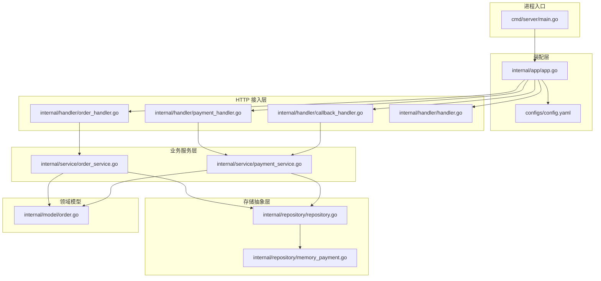
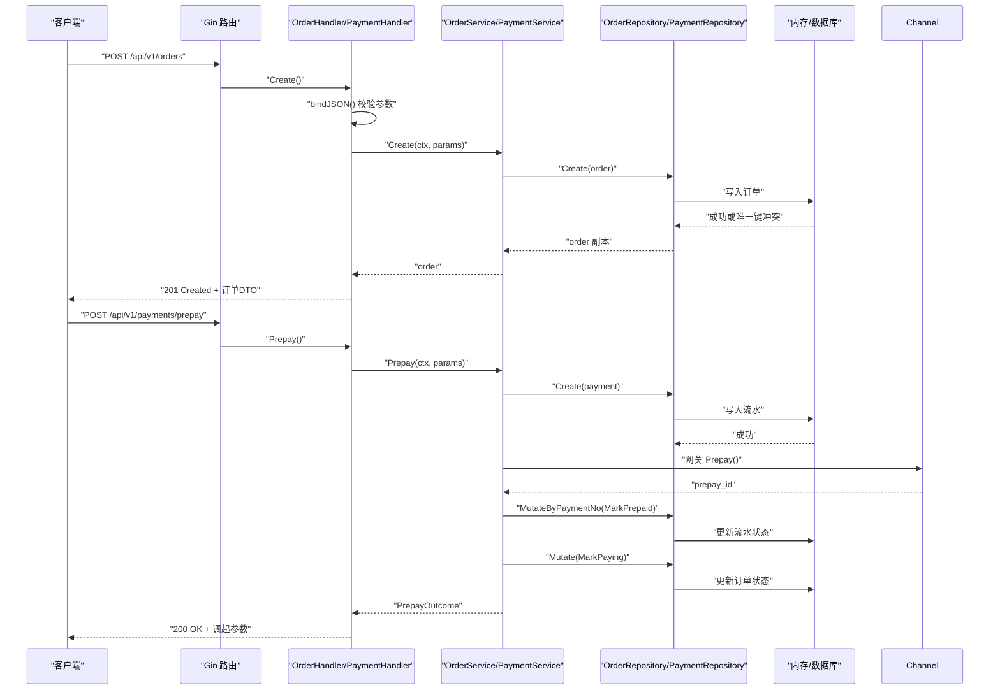
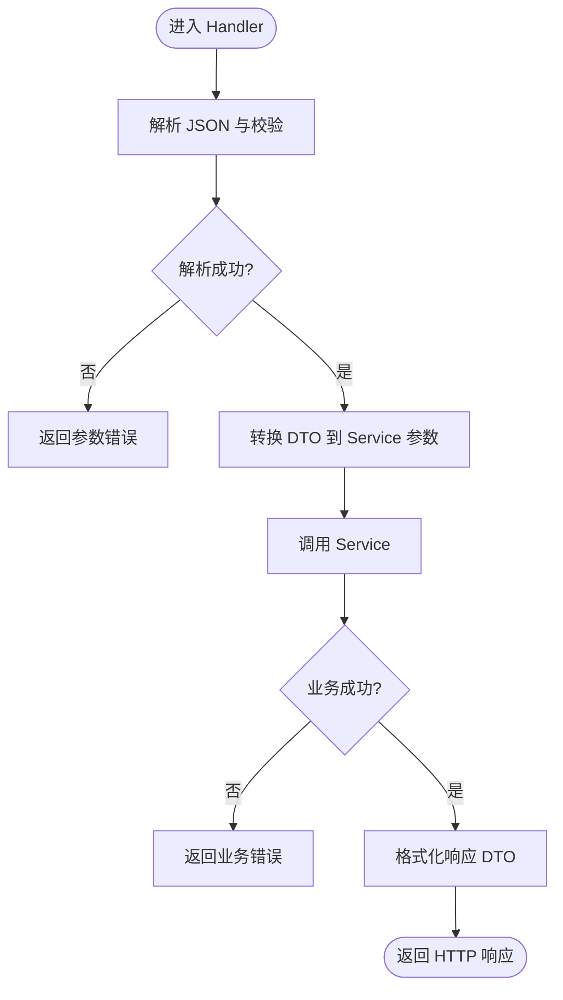
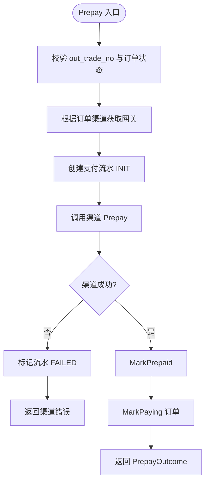
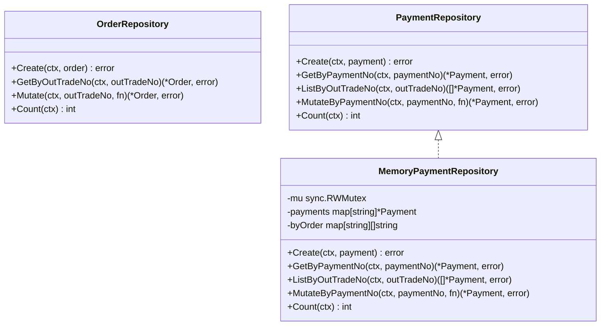
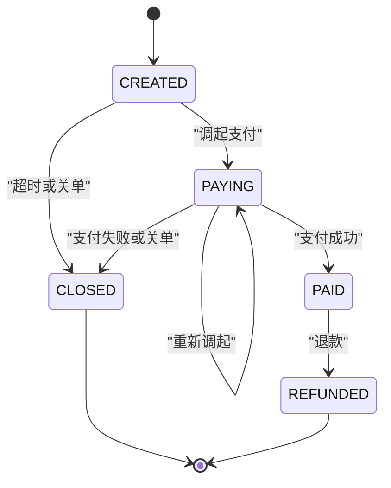
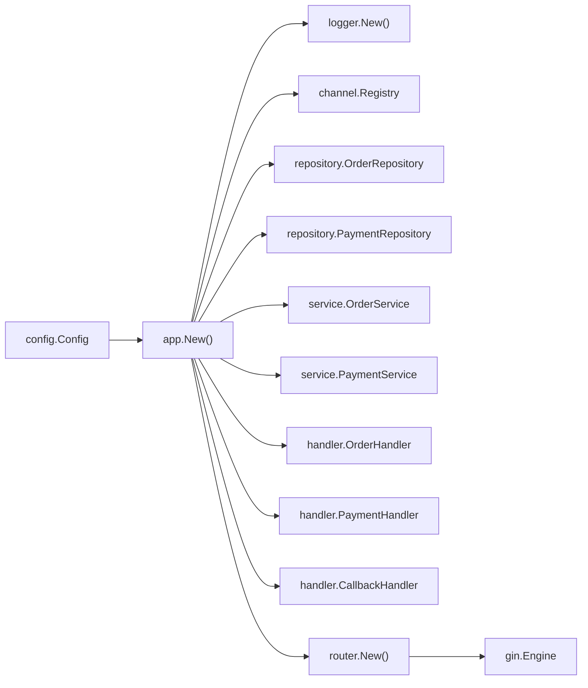

# 分层架构设计

<cite>
**本文引用的文件**   
- [cmd/server/main.go](file://cmd/server/main.go)
- [internal/app/app.go](file://internal/app/app.go)
- [configs/config.yaml](file://configs/config.yaml)
- [internal/handler/handler.go](file://internal/handler/handler.go)
- [internal/handler/order_handler.go](file://internal/handler/order_handler.go)
- [internal/handler/payment_handler.go](file://internal/handler/payment_handler.go)
- [internal/handler/callback_handler.go](file://internal/handler/callback_handler.go)
- [internal/service/order_service.go](file://internal/service/order_service.go)
- [internal/service/payment_service.go](file://internal/service/payment_service.go)
- [internal/repository/repository.go](file://internal/repository/repository.go)
- [internal/repository/memory_payment.go](file://internal/repository/memory_payment.go)
- [internal/model/order.go](file://internal/model/order.go)
</cite>

## 目录
1. [引言](#引言)
2. [项目结构](#项目结构)
3. [核心组件](#核心组件)
4. [架构总览](#架构总览)
5. [详细组件分析](#详细组件分析)
6. [依赖关系分析](#依赖关系分析)
7. [性能与可靠性考量](#性能与可靠性考量)
8. [故障排查指南](#故障排查指南)
9. [结论](#结论)

## 引言
本文面向支付服务的分层架构，目标是清晰说明 HTTP Handler → Business Service → Data Repository 的职责边界、依赖注入机制以及请求从进入 HTTP 层到最终落库的完整路径。该设计把“接入协议”“业务编排”“数据持久化”解耦，从而获得更好的可测试性、可扩展性与职责清晰度。

## 项目结构
仓库采用按领域与分层混合的组织方式：
- `cmd/server`：进程入口，负责启动参数、配置加载、应用装配、HTTP 服务生命周期与优雅关闭。
- `internal/app`：唯一装配点，按配置构造日志、渠道注册表、仓储、服务、处理器并组装 Gin 引擎。
- `internal/handler`：HTTP 接入层，负责解析请求、校验参数、转换 DTO、调用 Service、格式化响应。
- `internal/service`：业务编排层，封装订单创建、发起支付、回调处理、状态查询与主动查单等流程。
- `internal/repository`：存储抽象接口，当前提供内存实现，未来替换为 MySQL 时只需替换装配。
- `internal/model`：领域模型与状态机，集中定义金额单位、订单状态及合法流转。
- `configs/config.yaml`：服务器、日志、支付默认值、渠道开关等配置项。

**图表来源**
- [cmd/server/main.go:31-124](file://cmd/server/main.go#L31-L124)
- [internal/app/app.go:39-106](file://internal/app/app.go#L39-L106)
- [configs/config.yaml:9-61](file://configs/config.yaml#L9-L61)
- [internal/handler/order_handler.go:13-79](file://internal/handler/order_handler.go#L13-L79)
- [internal/handler/payment_handler.go:16-119](file://internal/handler/payment_handler.go#L16-L119)
- [internal/handler/callback_handler.go:34-87](file://internal/handler/callback_handler.go#L34-L87)
- [internal/service/order_service.go:21-125](file://internal/service/order_service.go#L21-L125)
- [internal/service/payment_service.go:34-583](file://internal/service/payment_service.go#L34-L583)
- [internal/repository/repository.go:27-64](file://internal/repository/repository.go#L27-L64)
- [internal/repository/memory_payment.go:13-121](file://internal/repository/memory_payment.go#L13-L121)
- [internal/model/order.go:20-184](file://internal/model/order.go#L20-L184)

**章节来源**
- [cmd/server/main.go:1-124](file://cmd/server/main.go#L1-L124)
- [internal/app/app.go:1-200](file://internal/app/app.go#L1-L200)
- [configs/config.yaml:1-61](file://configs/config.yaml#L1-L61)

## 核心组件
- HTTP Handler：统一解析 JSON、路径参数、布尔查询参数；区分空体、JSON 语法错误、字段校验失败三类错误；统一使用响应封装返回；回调通道例外，遵循渠道应答规范。
- Business Service：封装订单创建、支付发起、异步回调处理、状态查询与主动查单；维护幂等、并发安全与状态机约束；对外暴露纯函数式 API，不感知 HTTP。
- Repository：声明 OrderRepository 与 PaymentRepository 接口；通过 Mutate/MutateByPaymentNo 保证读改原子性，避免「读取-判断-写回」竞态；对外返回副本，防止绕过领域状态机。
- Model：金额以分存储；订单状态机显式定义合法后继；所有状态变更必须通过 Mark* 方法。

**章节来源**
- [internal/handler/handler.go:1-156](file://internal/handler/handler.go#L1-L156)
- [internal/service/order_service.go:1-125](file://internal/service/order_service.go#L1-L125)
- [internal/service/payment_service.go:1-583](file://internal/service/payment_service.go#L1-L583)
- [internal/repository/repository.go:1-90](file://internal/repository/repository.go#L1-L90)
- [internal/model/order.go:1-184](file://internal/model/order.go#L1-L184)

## 架构总览
下图展示一次典型支付发起请求从 HTTP 层进入，经过业务编排，最终落库的完整路径。

**图表来源**
- [internal/handler/order_handler.go:23-60](file://internal/handler/order_handler.go#L23-L60)
- [internal/handler/payment_handler.go:26-51](file://internal/handler/payment_handler.go#L26-L51)
- [internal/service/order_service.go:67-110](file://internal/service/order_service.go#L67-L110)
- [internal/service/payment_service.go:99-226](file://internal/service/payment_service.go#L99-L226)
- [internal/repository/repository.go:27-64](file://internal/repository/repository.go#L27-L64)
- [internal/repository/memory_payment.go:34-113](file://internal/repository/memory_payment.go#L34-L113)

## 详细组件分析

### HTTP Handler 层
Handler 的职责是“协议适配”，不包含业务规则。它负责：
- 解析 JSON 请求体，区分空体、语法错误、校验失败三类错误。
- 解析路径参数与布尔查询参数。
- 将 DTO 转换为 Service 入参，并将 Service 结果转换为响应 DTO。
- 对金额解析失败进行面向用户的错误翻译。
- 回调通道不走统一响应体，而是按渠道规范返回 SUCCESS/FAIL。

关键实现要点：
- `bindJSON` 把 validator 的错误映射为中文提示，并限制详情长度。
- `amountParseError` 把内部金额错误转成客户端可读错误码。
- `pathParam` 校验路径参数非空。
- CallbackHandler 对金额不一致与验签失败做告警级别区分，其余错误降级为 warn。

**图表来源**
- [internal/handler/handler.go:29-156](file://internal/handler/handler.go#L29-L156)
- [internal/handler/order_handler.go:23-79](file://internal/handler/order_handler.go#L23-L79)
- [internal/handler/payment_handler.go:26-119](file://internal/handler/payment_handler.go#L26-L119)
- [internal/handler/callback_handler.go:44-87](file://internal/handler/callback_handler.go#L44-L87)

**章节来源**
- [internal/handler/handler.go:1-156](file://internal/handler/handler.go#L1-L156)
- [internal/handler/order_handler.go:1-79](file://internal/handler/order_handler.go#L1-L79)
- [internal/handler/payment_handler.go:1-119](file://internal/handler/payment_handler.go#L1-L119)
- [internal/handler/callback_handler.go:1-87](file://internal/handler/callback_handler.go#L1-L87)

### Business Service 层
Service 是支付业务的编排中心，负责：
- 订单创建：校验金额、确定渠道、生成商户订单号、落库。
- 发起支付：校验订单可支付、创建流水、调用渠道下单、推进流水与订单状态。
- 回调处理：解析渠道报文、金额校验、幂等处理、订单与流水状态推进。
- 状态查询与主动查单：本地只读查询，必要时同步渠道状态。

关键实现要点：
- `Prepay` 在渠道下单失败时标记流水为 FAILED，但尽量保持用户可重新发起。
- `HandleNotify` 与 `HandlePayload` 分离，前者接收原始请求用于验签，后者复用同一状态推进逻辑，保证回调与主动查单一致性。
- 并发重复回调通过「已支付快速返回 + 锁内再判」实现幂等。
- 金额不一致直接拒绝，避免资金事故。
- `SyncFromChannel` 复用 `HandlePayload`，作为掉单兜底的核心手段。

**图表来源**
- [internal/service/payment_service.go:99-226](file://internal/service/payment_service.go#L99-L226)

**章节来源**
- [internal/service/order_service.go:1-125](file://internal/service/order_service.go#L1-L125)
- [internal/service/payment_service.go:1-583](file://internal/service/payment_service.go#L1-L583)

### Repository 层
Repository 层定义存储抽象，当前提供内存实现，未来替换为 MySQL 时只需在装配层替换。

接口设计重点：
- `Mutate` 与 `MutateByPaymentNo` 提供原子读改能力，避免并发重复回调导致的状态错乱。
- 对外一律返回对象副本，防止绕过领域状态机修改内存仓储数据。
- 定义唯一键冲突错误类型，便于调用方区分「创建冲突」与「重放命中」。

内存实现特点：
- 维护 `payment_no -> 流水` 与 `out_trade_no -> 流水号列表` 两份索引，避免全表扫描。
- 使用读写锁保护并发访问。
- `ListByOutTradeNo` 显式排序，保证取「最新未终结流水」的结果稳定。

**图表来源**
- [internal/repository/repository.go:27-64](file://internal/repository/repository.go#L27-L64)
- [internal/repository/memory_payment.go:13-121](file://internal/repository/memory_payment.go#L13-L121)

**章节来源**
- [internal/repository/repository.go:1-90](file://internal/repository/repository.go#L1-L90)
- [internal/repository/memory_payment.go:1-121](file://internal/repository/memory_payment.go#L1-L121)

### 领域模型与状态机
Model 层是语义中心：
- 金额统一以分存储，禁止 float64 运算。
- 订单状态机显式定义合法后继，非法流转会抛出错误。
- 所有状态变更通过 `transit` 与 `Mark*` 方法完成，确保先校验后落盘。

**图表来源**
- [internal/model/order.go:20-184](file://internal/model/order.go#L20-L184)

**章节来源**
- [internal/model/order.go:1-184](file://internal/model/order.go#L1-L184)

## 依赖关系分析
依赖注入由 `internal/app/app.go` 统一完成：
- 按配置初始化日志。
- 构建渠道注册表，按模式启用 mock 或真实渠道。
- 创建内存仓储（未来替换为 MySQL）。
- 构造 OrderService 与 PaymentService，注入仓储、渠道注册表与配置。
- 构造各 Handler，注入对应 Service。
- 组装 Gin 路由，暴露健康检查、Mock 调试路由与 CORS 白名单。

**图表来源**
- [internal/app/app.go:39-106](file://internal/app/app.go#L39-L106)
- [configs/config.yaml:9-61](file://configs/config.yaml#L9-L61)

**章节来源**
- [internal/app/app.go:1-200](file://internal/app/app.go#L1-L200)
- [configs/config.yaml:1-61](file://configs/config.yaml#L1-L61)

## 性能与可靠性考量
- 轮询查询默认只读本地数据，避免频繁调用渠道触发限流；需要强制对齐时使用 `sync=true` 或定时任务批量执行 `SyncFromChannel`。
- 回调处理中金额不一致与安全相关错误记录为 error，其他错误记录为 warn，避免误报淹没真正告警。
- 存储层通过 `Mutate` 系列接口保证并发安全，内存实现用互斥锁，数据库实现对应事务或行级锁。
- 进程启动失败优于带残缺依赖运行，避免生产环境出现「看似正常实则不可用」的静默故障。
- 优雅关闭等待存量请求处理完成，防止支付回调被硬切断导致掉单。

[本节为通用指导，不直接分析具体文件]

## 故障排查指南
常见定位思路：
- 参数错误：优先检查 Handler 层的 `bindJSON` 与金额解析错误分类。
- 渠道下单失败：查看 Service 层是否标记流水为 FAILED，并确认渠道网关返回。
- 回调重复投递：确认幂等分支是否命中，订单是否已是 PAID。
- 金额不一致：属于资金安全事件，需人工介入核对订单与回调金额。
- 唯一键冲突：检查订单号或流水号生成器是否异常，关注日志中的重复告警。
- 渠道未注册：检查配置中 default_channel 与 channels 开关，release 模式下 mock 被禁用。

**章节来源**
- [internal/handler/handler.go:29-156](file://internal/handler/handler.go#L29-L156)
- [internal/handler/callback_handler.go:55-87](file://internal/handler/callback_handler.go#L55-L87)
- [internal/service/payment_service.go:258-379](file://internal/service/payment_service.go#L258-L379)
- [internal/repository/repository.go:66-89](file://internal/repository/repository.go#L66-L89)

## 结论
本支付服务采用清晰的三层架构：
- Handler 专注 HTTP 协议适配与响应格式化。
- Service 专注业务编排、状态机与幂等控制。
- Repository 专注数据持久化抽象与并发安全。

这种分层带来的好处包括：
- 可测试性：Service 可脱离 HTTP 进行单元测试；Repository 可用内存实现替代数据库。
- 可扩展性：新增渠道只需扩展 channel 抽象并在装配层注册；替换存储只需新增 Repository 实现。
- 职责清晰：业务规则不会泄漏到接入层，状态变更集中在领域模型，降低资金风险。