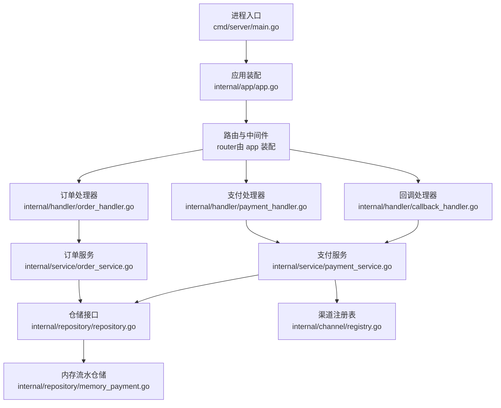
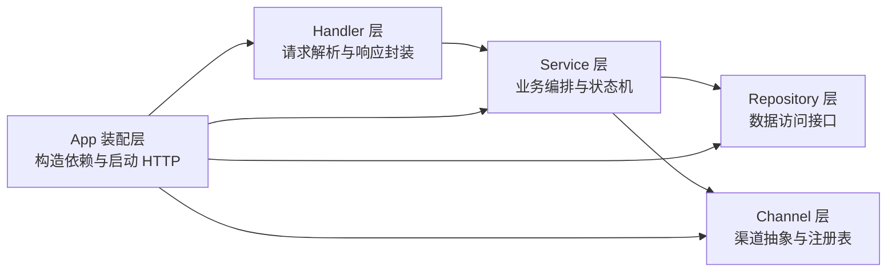
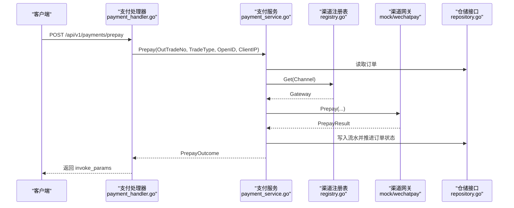
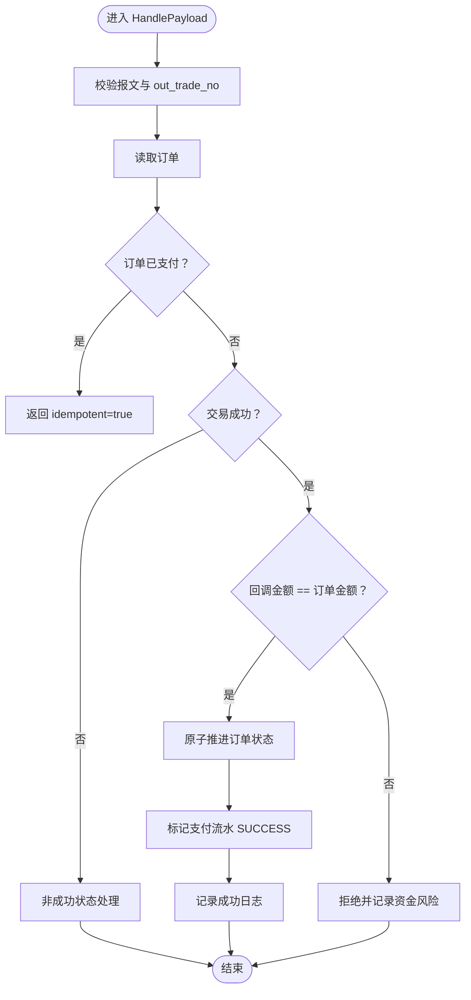
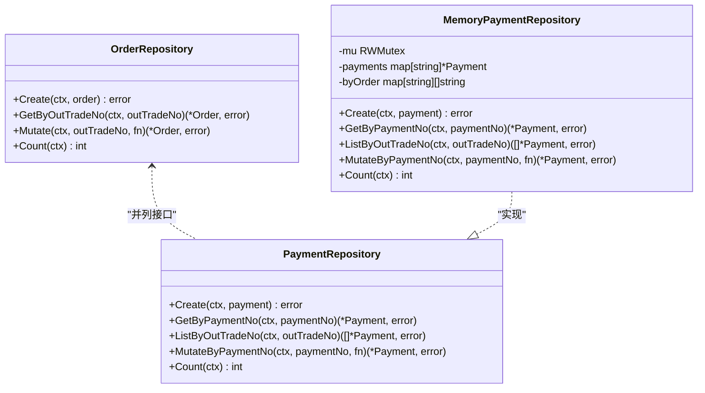
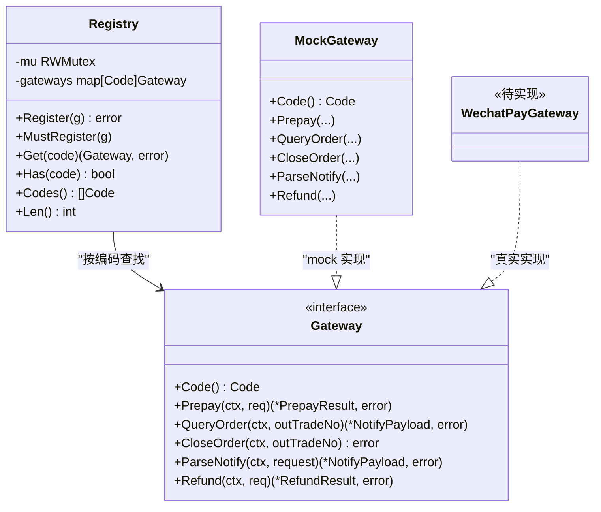
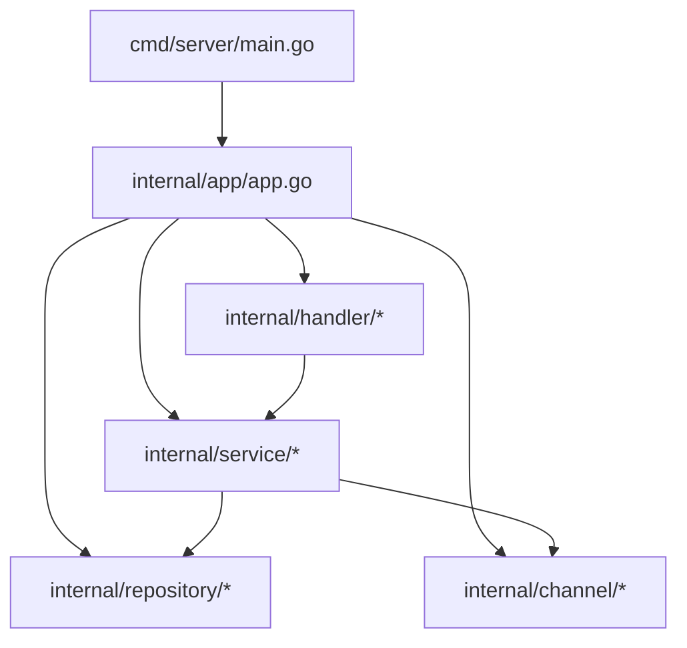

# 分层架构详解

<cite>
**本文引用的文件**   
- [README.md](file://README.md)
- [main.go](file://cmd/server/main.go)
- [app.go](file://internal/app/app.go)
- [handler.go](file://internal/handler/handler.go)
- [order_handler.go](file://internal/handler/order_handler.go)
- [payment_handler.go](file://internal/handler/payment_handler.go)
- [callback_handler.go](file://internal/handler/callback_handler.go)
- [order_service.go](file://internal/service/order_service.go)
- [payment_service.go](file://internal/service/payment_service.go)
- [repository.go](file://internal/repository/repository.go)
- [memory_payment.go](file://internal/repository/memory_payment.go)
- [registry.go](file://internal/channel/registry.go)
</cite>

## 目录
1. [引言](#引言)
2. [项目结构](#项目结构)
3. [核心组件](#核心组件)
4. [架构总览](#架构总览)
5. [详细组件分析](#详细组件分析)
6. [依赖关系分析](#依赖关系分析)
7. [性能与并发特性](#性能与并发特性)
8. [故障排查指南](#故障排查指南)
9. [结论](#结论)
10. [附录：扩展与替换实践](#附录扩展与替换实践)

## 引言
本文件面向支付服务的分层架构，重点解释 Handler 层、Service 层、Repository 层与 Channel 层的职责边界、依赖方向和数据流向。该设计让 HTTP 接入只负责请求解析与响应封装，业务编排集中在 Service，数据访问抽象在 Repository，渠道差异收敛在 Channel。通过接口隔离，替换存储实现或新增支付渠道时，可把改动范围控制在装配层与对应实现，Handler 与 Service 保持零改动。

## 项目结构
服务采用 Go + Gin 的经典分层：进程入口负责生命周期，`internal/app` 负责装配，`internal/handler` 暴露 HTTP 接口，`internal/service` 编排业务，`internal/repository` 抽象存储，`internal/channel` 抽象支付渠道。内存仓储用于快速跑通「下单 → 发起支付 → 渠道回调 → 查单」全流程；微信支付渠道当前为占位实现，生产需按文档补齐。

**图表来源**
- [main.go:31-124](file://cmd/server/main.go#L31-L124)
- [app.go:45-106](file://internal/app/app.go#L45-L106)
- [order_handler.go:26-60](file://internal/handler/order_handler.go#L26-L60)
- [payment_handler.go:32-85](file://internal/handler/payment_handler.go#L32-L85)
- [callback_handler.go:47-86](file://internal/handler/callback_handler.go#L47-L86)
- [order_service.go:72-110](file://internal/service/order_service.go#L72-L110)
- [payment_service.go:108-226](file://internal/service/payment_service.go#L108-L226)
- [repository.go:27-64](file://internal/repository/repository.go#L27-L64)
- [memory_payment.go:18-53](file://internal/repository/memory_payment.go#L18-L53)
- [registry.go:21-52](file://internal/channel/registry.go#L21-L52)

**章节来源**
- [README.md:38-62](file://README.md#L38-L62)
- [main.go:1-124](file://cmd/server/main.go#L1-L124)
- [app.go:1-106](file://internal/app/app.go#L1-L106)

## 核心组件
- Handler 层：解析 JSON、路径参数、查询参数，校验金额精度与必填字段，调用 Service 并统一封装响应。回调接口例外，必须按渠道规范返回 `SUCCESS` / `FAIL`。
- Service 层：订单创建、支付发起、回调处理、状态查询与主动查单兜底。集中处理幂等、金额校验、状态机流转与渠道协调。
- Repository 层：定义 Order 与 Payment 的读写接口，提供原子 Mutate 能力，对外返回副本，避免绕过领域模型直接修改。
- Channel 层：Gateway 接口与 Registry 注册表，屏蔽不同支付渠道的差异；当前 mock 可用，微信支付待实现。

**章节来源**
- [handler.go:1-10](file://internal/handler/handler.go#L1-L10)
- [order_service.go:1-19](file://internal/service/order_service.go#L1-L19)
- [repository.go:1-19](file://internal/repository/repository.go#L1-L19)
- [registry.go:11-24](file://internal/channel/registry.go#L11-L24)

## 架构总览
分层依赖方向严格单向：Handler → Service → Repository / Channel。Channel 与 Repository 是横向能力，被 Service 组合使用。App 是唯一装配点，按配置构建 Logger、Registry、仓储、Service、Handler 与路由。

**图表来源**
- [app.go:45-106](file://internal/app/app.go#L45-L106)
- [handler.go:1-10](file://internal/handler/handler.go#L1-L10)
- [order_service.go:1-19](file://internal/service/order_service.go#L1-L19)
- [repository.go:1-19](file://internal/repository/repository.go#L1-L19)
- [registry.go:11-24](file://internal/channel/registry.go#L11-L24)

## 详细组件分析

### Handler 层：请求解析与响应封装
Handler 的职责是把 HTTP 请求转换为 Service 入参，再把 Service 结果转为对外 DTO。它不判断订单状态、不做金额计算、不调用渠道 SDK。所有错误都映射到统一的业务错误码，便于客户端分支处理。

- 订单创建：解析 JSON，将元字符串转为分，调用 `OrderService.Create`，返回订单 DTO。
- 支付发起：解析预支付请求，调用 `PaymentService.Prepay`，返回前端调起参数。
- 支付查询：默认只读本地状态；可选同步模式强制拉取渠道状态后再返回。
- 渠道回调：按渠道规范应答，不套用统一响应体；对金额不一致与验签失败进行告警。

**图表来源**
- [payment_handler.go:32-51](file://internal/handler/payment_handler.go#L32-L51)
- [payment_service.go:108-226](file://internal/service/payment_service.go#L108-L226)
- [registry.go:63-74](file://internal/channel/registry.go#L63-L74)
- [repository.go:27-64](file://internal/repository/repository.go#L27-L64)

**章节来源**
- [handler.go:29-55](file://internal/handler/handler.go#L29-L55)
- [order_handler.go:26-60](file://internal/handler/order_handler.go#L26-L60)
- [payment_handler.go:32-85](file://internal/handler/payment_handler.go#L32-L85)
- [callback_handler.go:47-86](file://internal/handler/callback_handler.go#L47-L86)

### Service 层：业务编排与状态机
Service 是支付系统的核心：它决定何时创建订单、何时发起渠道下单、如何处理成功与非成功回调、如何保证幂等与金额一致，以及如何通过主动查单兜底掉单。

关键流程要点：
- 订单创建：校验金额、确定渠道、生成商户订单号、落库。
- 发起支付：校验订单可支付、创建流水 INIT、调用渠道 Prepay、流水置 PREPAID、订单置 PAYING。
- 回调处理：先做快速幂等判断，再校验金额，最后原子推进订单与流水状态。
- 查询与同步：查询优先读本地；同步模式复用回调处理路径，确保一致性。

**图表来源**
- [payment_service.go:282-379](file://internal/service/payment_service.go#L282-L379)
- [payment_service.go:382-415](file://internal/service/payment_service.go#L382-L415)
- [payment_service.go:422-453](file://internal/service/payment_service.go#L422-L453)

**章节来源**
- [order_service.go:72-110](file://internal/service/order_service.go#L72-L110)
- [payment_service.go:108-226](file://internal/service/payment_service.go#L108-L226)
- [payment_service.go:282-379](file://internal/service/payment_service.go#L282-L379)
- [payment_service.go:548-582](file://internal/service/payment_service.go#L548-L582)

### Repository 层：数据访问接口与并发安全
Repository 定义 Order 与 Payment 的读写契约，并提供原子 Mutate 能力，解决回调重复投递导致的竞态问题。内存实现用 RWMutex + map，写操作采用“草稿拷贝后替换”策略，对外返回 Clone 副本，防止调用方绕过领域模型修改内部状态。

- OrderRepository：Create、GetByOutTradeNo、Mutate、Count。
- PaymentRepository：Create、GetByPaymentNo、ListByOutTradeNo、MutateByPaymentNo、Count。
- 唯一键冲突：定义专用错误类型，区分「创建冲突」与「重放幂等命中」。

**图表来源**
- [repository.go:27-64](file://internal/repository/repository.go#L27-L64)
- [memory_payment.go:18-53](file://internal/repository/memory_payment.go#L18-L53)
- [memory_payment.go:92-113](file://internal/repository/memory_payment.go#L92-L113)

**章节来源**
- [repository.go:1-19](file://internal/repository/repository.go#L1-L19)
- [repository.go:27-64](file://internal/repository/repository.go#L27-L64)
- [memory_payment.go:18-53](file://internal/repository/memory_payment.go#L18-L53)
- [memory_payment.go:66-90](file://internal/repository/memory_payment.go#L66-L90)
- [memory_payment.go:92-113](file://internal/repository/memory_payment.go#L92-L113)

### Channel 层：渠道抽象与注册表
Channel 层通过 Gateway 接口屏蔽具体渠道差异，Registry 管理运行时可用的渠道实现。Service 只依赖接口与注册表，不感知任何 SDK 类型。当前 mock 渠道可用于全链路联调；微信支付需在 `wechatpay` 包实现 Gateway 并在装配层注册。

- Gateway：Code、Prepay、QueryOrder、CloseOrder、ParseNotify、Refund。
- Registry：Register、Get、Has、Codes、Len，线程安全。

**图表来源**
- [registry.go:21-52](file://internal/channel/registry.go#L21-L52)
- [registry.go:63-74](file://internal/channel/registry.go#L63-L74)
- [registry.go:76-106](file://internal/channel/registry.go#L76-L106)

**章节来源**
- [registry.go:11-24](file://internal/channel/registry.go#L11-L24)
- [registry.go:31-52](file://internal/channel/registry.go#L31-L52)
- [registry.go:63-74](file://internal/channel/registry.go#L63-L74)

## 依赖关系分析
依赖方向清晰且单向：
- Handler 依赖 Service 与 DTO，不依赖 Repository 与 Channel。
- Service 依赖 Repository 接口与 Channel 抽象，不依赖具体存储与 SDK。
- App 装配层串联配置、Logger、Registry、仓储、Service、Handler 与路由。
- Channel 与 Repository 是横切能力，彼此无耦合。

**图表来源**
- [main.go:31-124](file://cmd/server/main.go#L31-L124)
- [app.go:45-106](file://internal/app/app.go#L45-L106)

**章节来源**
- [app.go:1-12](file://internal/app/app.go#L1-L12)
- [app.go:45-106](file://internal/app/app.go#L45-L106)

## 性能与并发特性
- 回调幂等：快速判断 + 原子 Mutate 内再判，避免并发重复推进。
- 金额校验前置：在推进状态前比较回调金额与订单金额，发现不一致立即拒绝。
- 查询优先本地：轮询接口默认只读本地，避免频繁触发渠道限流；sync 模式复用回调处理路径保证一致性。
- 内存仓储并发安全：RWMutex + 草稿拷贝替换，读多写少场景开销低；排序稳定，避免不确定顺序导致的状态选择偏差。
- 优雅关闭：HTTP Server 设置 ReadHeaderTimeout 抵御慢速攻击，Shutdown 超时保护存量回调处理完成。

**章节来源**
- [payment_service.go:301-313](file://internal/service/payment_service.go#L301-L313)
- [payment_service.go:320-333](file://internal/service/payment_service.go#L320-L333)
- [payment_service.go:532-546](file://internal/service/payment_service.go#L532-L546)
- [memory_payment.go:66-90](file://internal/repository/memory_payment.go#L66-L90)
- [main.go:25-29](file://cmd/server/main.go#L25-L29)
- [main.go:102-117](file://cmd/server/main.go#L102-L117)

## 故障排查指南
- 回调金额不一致：属于资金风险事件，Handler 会记录 Error 级别日志并返回渠道 FAIL，需人工介入核对订单与回调金额。
- 验签失败：同样作为安全事件告警，不应降级为内部错误。
- 渠道未注册：装配阶段若启用但未实现，进程直接启动失败，避免带病运行。
- 订单不存在或支付记录不存在：仓储层返回明确错误码，Handler 透传，便于客户端定位。
- 主动查单失败：查询接口不会因渠道抖动而阻断返回本地已知状态，同时记录 Warn 日志。

**章节来源**
- [callback_handler.go:55-86](file://internal/handler/callback_handler.go#L55-L86)
- [payment_service.go:320-333](file://internal/service/payment_service.go#L320-L333)
- [app.go:123-149](file://internal/app/app.go#L123-L149)
- [payment_handler.go:68-77](file://internal/handler/payment_handler.go#L68-L77)

## 结论
该分层架构通过清晰的职责划分与接口隔离，使支付系统具备高内聚、低耦合、易测试与可扩展的特性：
- Handler 专注请求处理与响应封装，不掺杂业务规则。
- Service 专注业务编排、状态机与渠道协调，保证幂等与金额一致。
- Repository 专注数据持久化抽象，提供原子更新与并发安全。
- Channel 专注渠道适配，屏蔽 SDK 差异并通过注册表解耦。

这种设计使得替换存储实现或新增支付渠道时，改动范围最小化：仅需在装配层替换仓储实现或在注册表中注册新渠道，Handler 与 Service 无需改动。

## 附录：扩展与替换实践

### 替换存储实现（内存 → MySQL）
- 新增 MySQL 实现的 OrderRepository 与 PaymentRepository。
- 在 `internal/app/app.go` 中替换内存仓储构造。
- Service 与 Handler 零改动，因为依赖的是接口。

**章节来源**
- [app.go:62-68](file://internal/app/app.go#L62-L68)
- [repository.go:1-19](file://internal/repository/repository.go#L1-L19)

### 新增支付渠道（以微信支付为例）
- 在 `internal/channel/wechatpay/gateway.go` 实现 Gateway 接口的六个方法。
- 在 `internal/app/app.go` 的 `buildRegistry` 中按配置注册微信渠道。
- 将默认渠道改为 `wechatpay`，并确保证书与密钥通过环境变量注入。

**章节来源**
- [README.md:274-284](file://README.md#L274-L284)
- [app.go:108-152](file://internal/app/app.go#L108-L152)