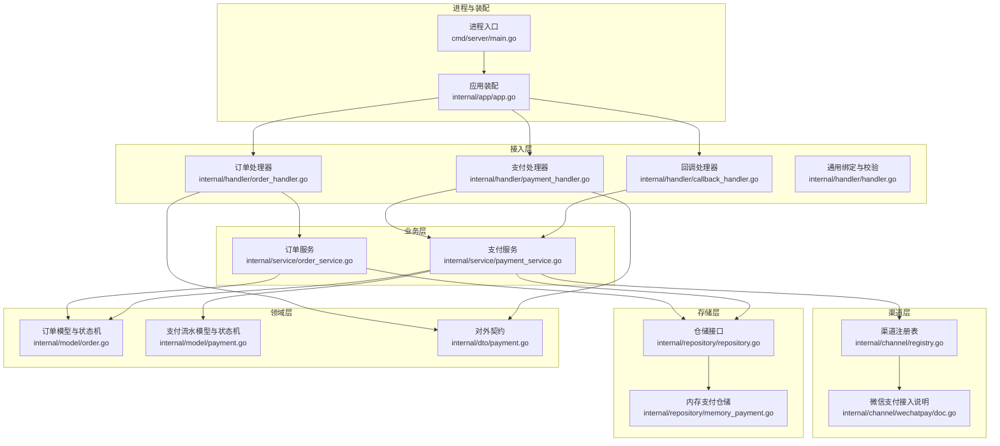
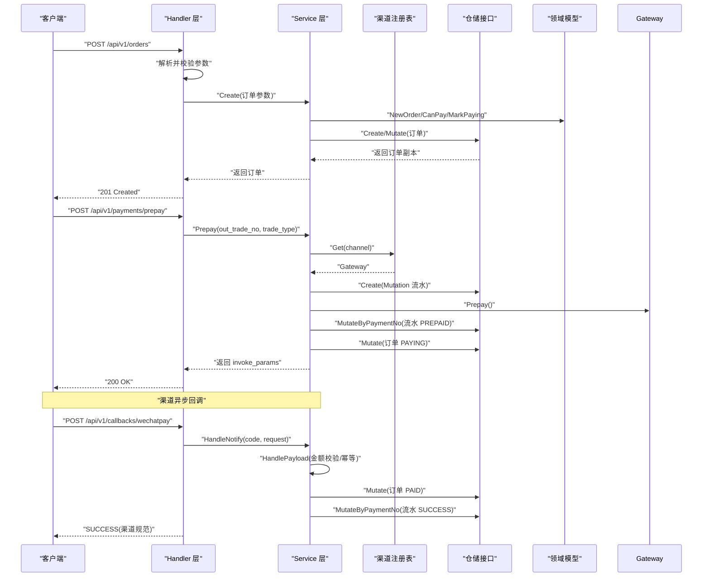
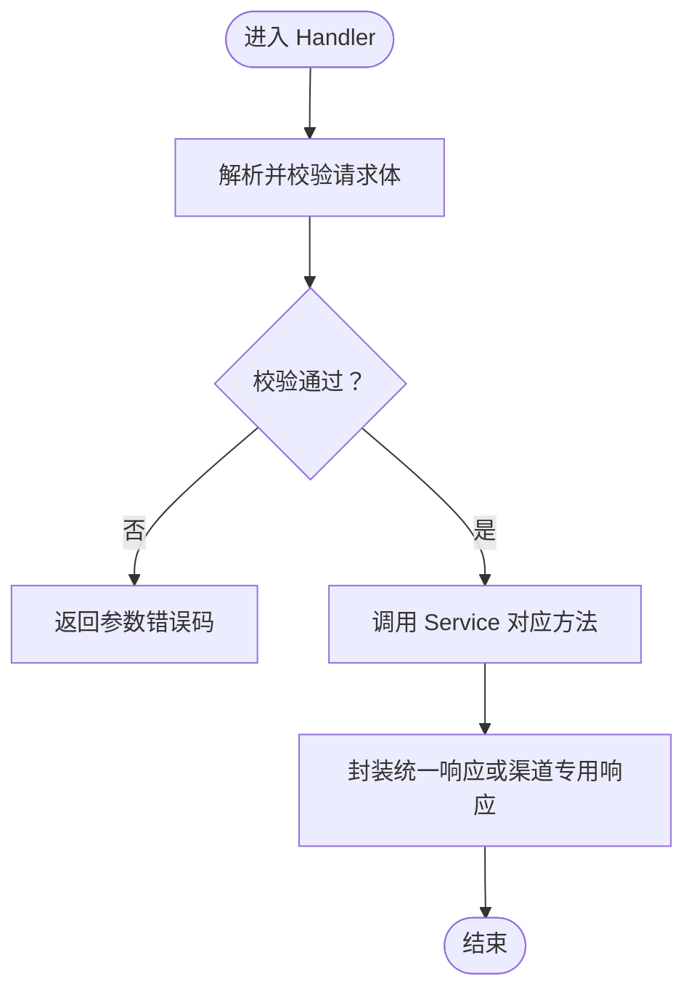
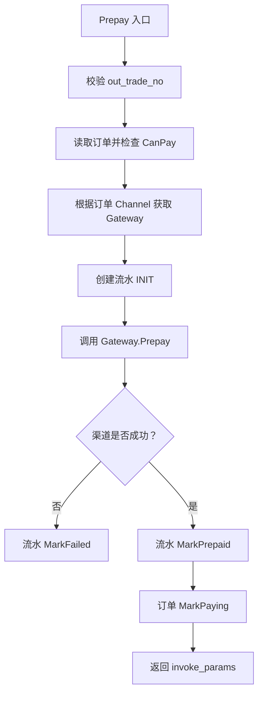
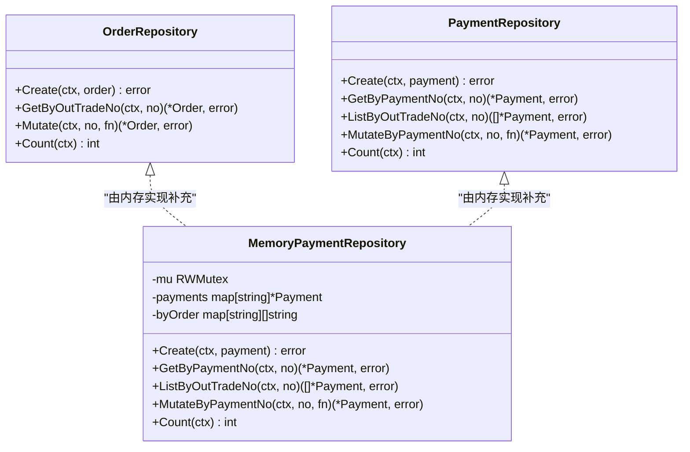
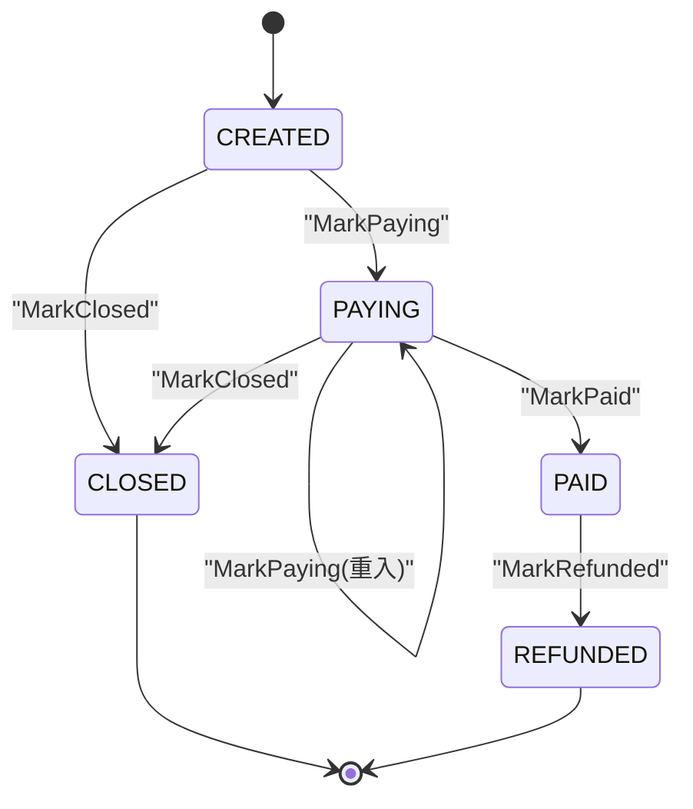
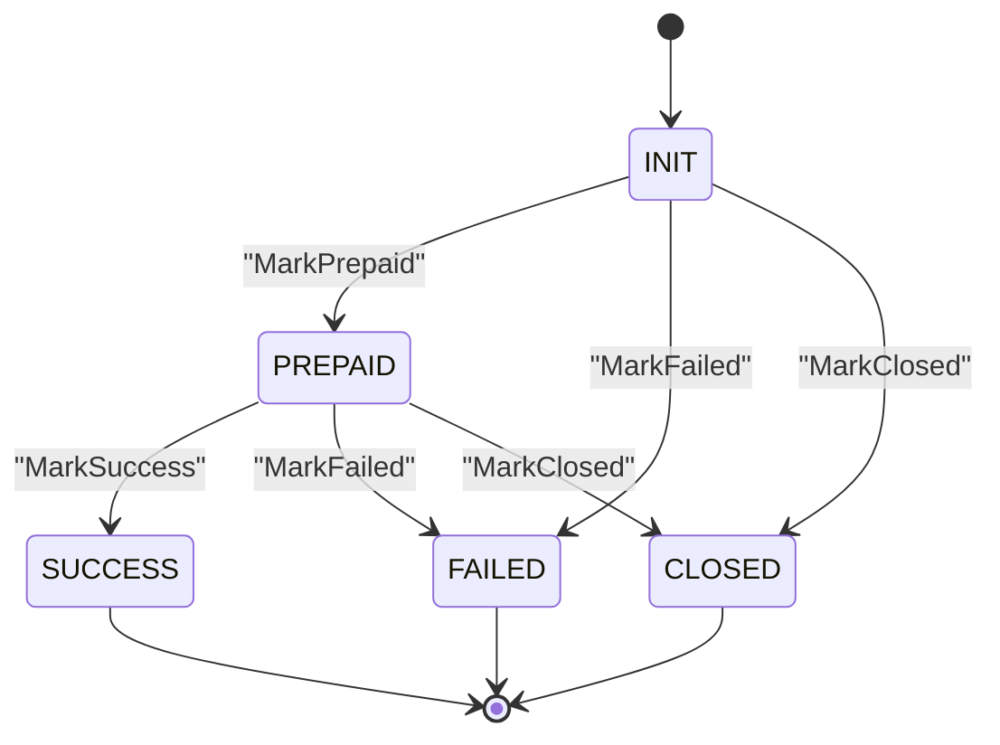
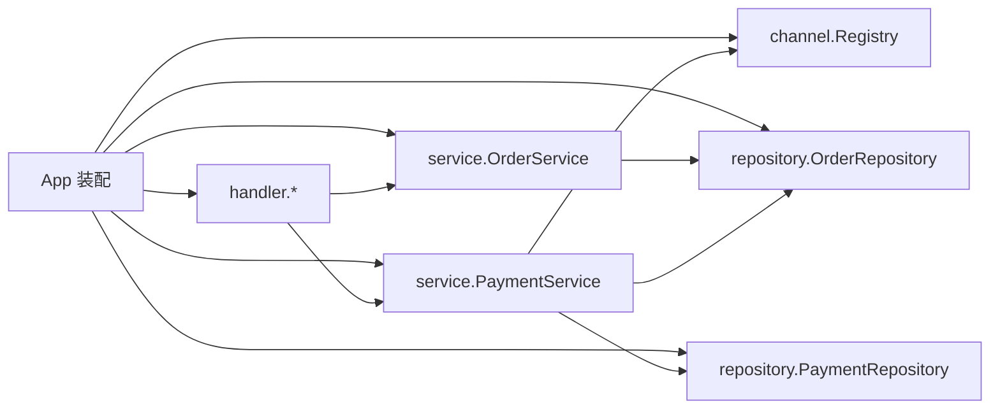

# 架构设计

<cite>
**本文引用的文件**   
- [cmd/server/main.go](file://cmd/server/main.go)
- [internal/app/app.go](file://internal/app/app.go)
- [internal/handler/handler.go](file://internal/handler/handler.go)
- [internal/handler/order_handler.go](file://internal/handler/order_handler.go)
- [internal/handler/payment_handler.go](file://internal/handler/payment_handler.go)
- [internal/handler/callback_handler.go](file://internal/handler/callback_handler.go)
- [internal/service/order_service.go](file://internal/service/order_service.go)
- [internal/service/payment_service.go](file://internal/service/payment_service.go)
- [internal/repository/repository.go](file://internal/repository/repository.go)
- [internal/repository/memory_payment.go](file://internal/repository/memory_payment.go)
- [internal/channel/registry.go](file://internal/channel/registry.go)
- [internal/model/order.go](file://internal/model/order.go)
- [internal/model/payment.go](file://internal/model/payment.go)
- [internal/dto/payment.go](file://internal/dto/payment.go)
- [internal/channel/wechatpay/doc.go](file://internal/channel/wechatpay/doc.go)
- [README.md](file://README.md)
</cite>

## 目录
1. [引言](#引言)
2. [项目结构](#项目结构)
3. [核心组件](#核心组件)
4. [架构总览](#架构总览)
5. [详细组件分析](#详细组件分析)
6. [依赖关系分析](#依赖关系分析)
7. [性能与可靠性考量](#性能与可靠性考量)
8. [故障排查指南](#故障排查指南)
9. [结论](#结论)
10. [附录：关键接口与数据模型](#附录关键接口与数据模型)

## 引言
本支付服务采用经典分层架构，围绕“订单 + 支付流水”两个领域对象构建。Handler 层负责 HTTP 接入、参数校验与响应封装；Service 层编排业务逻辑、处理幂等与状态机流转；Repository 层抽象数据访问，当前提供内存实现；Channel 层通过 Gateway 接口统一不同支付渠道差异，并通过注册表管理可用渠道。系统以领域模型中的状态机为核心约束，确保订单与支付流水的状态变更合法、可审计、可追溯。

## 项目结构
仓库按职责划分清晰：进程入口在 cmd/server，装配与生命周期在 internal/app，HTTP 接入在 internal/handler，业务逻辑在 internal/service，存储接口与内存实现在 internal/repository，渠道抽象与注册在 internal/channel，领域模型与状态机在 internal/model，对外契约在 internal/dto。



**图表来源**
- [cmd/server/main.go:31-124](file://cmd/server/main.go#L31-L124)
- [internal/app/app.go:39-106](file://internal/app/app.go#L39-L106)
- [internal/handler/order_handler.go:23-60](file://internal/handler/order_handler.go#L23-L60)
- [internal/handler/payment_handler.go:26-85](file://internal/handler/payment_handler.go#L26-L85)
- [internal/handler/callback_handler.go:44-86](file://internal/handler/callback_handler.go#L44-L86)
- [internal/service/order_service.go:21-124](file://internal/service/order_service.go#L21-L124)
- [internal/service/payment_service.go:34-226](file://internal/service/payment_service.go#L34-L226)
- [internal/repository/repository.go:27-64](file://internal/repository/repository.go#L27-L64)
- [internal/repository/memory_payment.go:13-121](file://internal/repository/memory_payment.go#L13-L121)
- [internal/channel/registry.go:11-107](file://internal/channel/registry.go#L11-L107)
- [internal/model/order.go:20-184](file://internal/model/order.go#L20-L184)
- [internal/model/payment.go:10-160](file://internal/model/payment.go#L10-L160)
- [internal/dto/payment.go:9-142](file://internal/dto/payment.go#L9-L142)

**章节来源**
- [README.md:38-62](file://README.md#L38-L62)

## 核心组件
- Handler 层：解析请求、校验参数、转换 DTO、调用 Service、返回统一或渠道专用响应。
- Service 层：订单创建、发起支付、处理渠道回调、查询状态、主动查单兜底；编排领域状态机与仓储操作。
- Repository 层：定义 OrderRepository 与 PaymentRepository 接口，提供 Mutate/MutateByPaymentNo 原子更新能力；当前使用内存实现。
- Channel 层：Gateway 接口统一渠道差异；Registry 管理渠道注册与查找；mock 用于联调，wechatpay 为占位接入文档。
- Model 层：Order 与 Payment 领域模型，内置状态机与合法流转规则，禁止外部直接赋值状态字段。
- DTO 层：对外 JSON 契约，金额以字符串元展示，内部以 int64 分计算。

**章节来源**
- [internal/handler/handler.go:1-156](file://internal/handler/handler.go#L1-L156)
- [internal/service/order_service.go:1-125](file://internal/service/order_service.go#L1-L125)
- [internal/service/payment_service.go:1-226](file://internal/service/payment_service.go#L1-L226)
- [internal/repository/repository.go:1-90](file://internal/repository/repository.go#L1-L90)
- [internal/channel/registry.go:1-107](file://internal/channel/registry.go#L1-L107)
- [internal/model/order.go:1-184](file://internal/model/order.go#L1-L184)
- [internal/model/payment.go:1-160](file://internal/model/payment.go#L1-L160)
- [internal/dto/payment.go:1-142](file://internal/dto/payment.go#L1-L142)

## 架构总览
从客户端请求到最终状态更新的完整路径如下：



**图表来源**
- [internal/handler/order_handler.go:23-60](file://internal/handler/order_handler.go#L23-L60)
- [internal/handler/payment_handler.go:26-85](file://internal/handler/payment_handler.go#L26-L85)
- [internal/handler/callback_handler.go:44-86](file://internal/handler/callback_handler.go#L44-L86)
- [internal/service/order_service.go:67-124](file://internal/service/order_service.go#L67-L124)
- [internal/service/payment_service.go:99-226](file://internal/service/payment_service.go#L99-L226)
- [internal/service/payment_service.go:258-379](file://internal/service/payment_service.go#L258-L379)
- [internal/channel/registry.go:63-74](file://internal/channel/registry.go#L63-L74)
- [internal/repository/repository.go:27-64](file://internal/repository/repository.go#L27-L64)
- [internal/model/order.go:122-170](file://internal/model/order.go#L122-L170)
- [internal/model/payment.go:106-150](file://internal/model/payment.go#L106-L150)

## 详细组件分析

### Handler 层：HTTP 接入与契约转换
- 通用绑定与校验：区分空体、JSON 语法错误、字段类型不匹配与校验规则失败，分别映射为不同业务错误码，便于前端给出有效提示。
- 订单处理器：创建订单时把「元」转「分」，服务端取 ClientIP 用于风控；查询订单返回领域模型转换后的 DTO。
- 支付处理器：发起支付返回前端可直接调起支付的参数；查询状态默认只读本地，支持 sync=true 强制同步渠道。
- 回调处理器：遵循渠道应答规范（非统一响应），对金额不一致与验签失败进行告警，其余错误允许渠道重试。



**图表来源**
- [internal/handler/handler.go:29-78](file://internal/handler/handler.go#L29-L78)
- [internal/handler/order_handler.go:23-60](file://internal/handler/order_handler.go#L23-L60)
- [internal/handler/payment_handler.go:26-85](file://internal/handler/payment_handler.go#L26-L85)
- [internal/handler/callback_handler.go:44-86](file://internal/handler/callback_handler.go#L44-L86)

**章节来源**
- [internal/handler/handler.go:1-156](file://internal/handler/handler.go#L1-L156)
- [internal/handler/order_handler.go:1-79](file://internal/handler/order_handler.go#L1-L79)
- [internal/handler/payment_handler.go:1-119](file://internal/handler/payment_handler.go#L1-L119)
- [internal/handler/callback_handler.go:1-87](file://internal/handler/callback_handler.go#L1-L87)

### Service 层：业务编排与状态机驱动
- 订单服务：创建订单时确定渠道并落库，避免后续在不同渠道间跳变导致对账困难；查询订单透传仓储错误码。
- 支付服务：
  - Prepay：校验订单可支付 -> 创建流水 INIT -> 调用渠道 Prepay -> 流水置 PREPAID -> 订单置 PAYING；渠道下单失败则流水置 FAILED，订单不动。
  - HandleNotify：解析渠道报文 -> 金额校验 -> 幂等判断 -> 推进订单 PAID -> 推进流水 SUCCESS；非成功状态按渠道语义关闭或标记失败。
  - QueryStatus/SyncFromChannel：轮询只读本地，sync 模式复用 HandlePayload 保证一致性。



**图表来源**
- [internal/service/payment_service.go:99-226](file://internal/service/payment_service.go#L99-L226)

**章节来源**
- [internal/service/order_service.go:1-125](file://internal/service/order_service.go#L1-L125)
- [internal/service/payment_service.go:1-583](file://internal/service/payment_service.go#L1-L583)

### Repository 层：接口抽象与内存实现
- 接口设计要点：
  - 提供 Mutate/MutateByPaymentNo 原子更新，避免并发重复回调导致的竞态条件。
  - 对外一律返回副本，防止绕过领域状态机直接修改字段。
- 内存实现：
  - 维护 payment_no 与 byOrder 双索引，高频查询无需全表扫描。
  - 写操作采用 draft-copy-then-swap，读锁内拷贝、写锁替换，保证并发安全。
  - ListByOutTradeNo 显式排序，确保“最新未终结流水”判定稳定。



**图表来源**
- [internal/repository/repository.go:27-64](file://internal/repository/repository.go#L27-L64)
- [internal/repository/memory_payment.go:13-121](file://internal/repository/memory_payment.go#L13-L121)

**章节来源**
- [internal/repository/repository.go:1-90](file://internal/repository/repository.go#L1-L90)
- [internal/repository/memory_payment.go:1-121](file://internal/repository/memory_payment.go#L1-L121)

### Channel 层：策略模式与工厂注册
- 策略模式：Gateway 接口统一各渠道的 Prepay、QueryOrder、CloseOrder、ParseNotify、Refund 等方法，Service 层仅依赖接口，屏蔽具体 SDK 差异。
- 工厂/注册表：Registry 以 Code 为键管理 Gateway 实例，启动期按配置注册，运行期按编码查找；并发安全使用 RWMutex，避免热加载场景下的竞争。
- 微信接入：wechatpay/doc.go 明确接入步骤与安全红线，预留证书模式与公钥模式两种认证方式，强调 ParseNotify 必须接收 *http.Request 以完成验签。

```mermaid
classDiagram
class Gateway {
<<interface>>
+Code() Code
+Prepay(ctx, req) (*PrepayResult, error)
+QueryOrder(ctx, outTradeNo) (*NotifyPayload, error)
+CloseOrder(ctx, outTradeNo) error
+ParseNotify(ctx, r) (*NotifyPayload, error)
+Refund(ctx, req) (*RefundResult, error)
}
class Registry {
-mu RWMutex
-gateways map[Code]Gateway
+Register(g) error
+MustRegister(g)
+Get(code) (Gateway, error)
+Has(code) bool
+Codes() []Code
+Len() int
}
class MockGateway {
+Code() Code
+Prepay(...)
+QueryOrder(...)
+CloseOrder(...)
+ParseNotify(...)
+Refund(...)
}
class WechatpayDoc {
<<documentation>>
"接入步骤与安全红线"
}
Registry --> Gateway : "管理实现"
MockGateway ..|> Gateway : "实现"
WechatpayDoc ..> Gateway : "指导实现"
```

**图表来源**
- [internal/channel/registry.go:11-107](file://internal/channel/registry.go#L11-L107)
- [internal/channel/wechatpay/doc.go:1-105](file://internal/channel/wechatpay/doc.go#L1-L105)

**章节来源**
- [internal/channel/registry.go:1-107](file://internal/channel/registry.go#L1-L107)
- [internal/channel/wechatpay/doc.go:1-105](file://internal/channel/wechatpay/doc.go#L1-L105)

### 领域层：状态机模式
- 订单状态机：CREATED → PAYING → PAID/CLOSED/REFUNDED；PAYING 允许重入（重新调起支付）。
- 支付流水状态机：INIT → PREPAID → SUCCESS/FAILED/CLOSED；终态不可再流转。
- 所有状态变更通过 Mark* 方法进入 transit 校验，非法流转直接报错，避免脏状态。



**图表来源**
- [internal/model/order.go:20-184](file://internal/model/order.go#L20-L184)



**图表来源**
- [internal/model/payment.go:10-160](file://internal/model/payment.go#L10-L160)

**章节来源**
- [internal/model/order.go:1-184](file://internal/model/order.go#L1-L184)
- [internal/model/payment.go:1-160](file://internal/model/payment.go#L1-L160)

## 依赖关系分析
- 装配层 app.New 串联配置、日志、渠道注册、仓储、服务、Handler 与路由，是唯一装配点。
- Service 依赖 repository 接口与 channel.Registry，不感知 HTTP 与具体 SDK。
- Handler 依赖 service 与 dto，不承载业务规则。
- Registry 并发安全，启动期注册 mock（非 release）与 wechatpay（若启用）。



**图表来源**
- [internal/app/app.go:39-106](file://internal/app/app.go#L39-L106)
- [internal/channel/registry.go:11-107](file://internal/channel/registry.go#L11-L107)
- [internal/repository/repository.go:27-64](file://internal/repository/repository.go#L27-L64)
- [internal/service/order_service.go:21-51](file://internal/service/order_service.go#L21-L51)
- [internal/service/payment_service.go:34-73](file://internal/service/payment_service.go#L34-L73)

**章节来源**
- [internal/app/app.go:1-200](file://internal/app/app.go#L1-L200)

## 性能与可靠性考量
- 回调幂等：先快速判断已支付，再在 Mutate 回调内二次判断，命中则返回 idempotent=true，避免渠道无限重试。
- 金额校验：回调金额必须与订单金额一致，否则拒绝并告警，防止串单与篡改。
- 主动查单兜底：SyncFromChannel 复用 HandlePayload，保证回调与查单结论一致；生产应由定时任务批量执行。
- 内存仓储并发安全：RWMutex + 副本读写，避免竞态与脏写；ListByOutTradeNo 显式排序保证结果稳定。
- 优雅关闭：HTTP Server 设置 ReadHeaderTimeout 抵御慢速攻击，收到 SIGTERM 后等待存量请求完成，避免掉单。

**章节来源**
- [internal/service/payment_service.go:258-379](file://internal/service/payment_service.go#L258-L379)
- [internal/service/payment_service.go:548-583](file://internal/service/payment_service.go#L548-L583)
- [internal/repository/memory_payment.go:66-89](file://internal/repository/memory_payment.go#L66-L89)
- [cmd/server/main.go:25-124](file://cmd/server/main.go#L25-L124)

## 故障排查指南
- 回调反复重试：检查是否返回渠道规范的 FAIL；金额不一致与验签失败需人工介入。
- 订单状态异常：核对领域状态机流转是否合法；确认 Mutate 回调内是否再次判重。
- 流水缺失：pickPayment 优先按 transaction_id 匹配，其次取最新未终结流水；若无匹配会报错而非新建流水。
- 启动失败：release 模式下无可用渠道（mock 被禁用且 wechatpay 未实现）会直接失败；默认渠道必须在注册表中存在。

**章节来源**
- [internal/handler/callback_handler.go:55-86](file://internal/handler/callback_handler.go#L55-L86)
- [internal/service/payment_service.go:455-520](file://internal/service/payment_service.go#L455-L520)
- [internal/app/app.go:108-152](file://internal/app/app.go#L108-L152)

## 结论
该支付服务通过清晰的层次划分与严格的领域状态机，将“订单 + 支付流水”的核心语义固化在 model 层，并以 repository 接口与 channel.Gateway 抽象隔离存储与渠道差异。内存仓储满足骨架阶段的可测试性与可演示性，未来替换 MySQL 只需在装配处替换实现。策略模式与注册表让新增渠道成本极低，而回调幂等、金额校验与主动查单兜底共同构成资金安全的防线。

## 附录：关键接口与数据模型

### 渠道网关接口（Gateway）
- Code：渠道编码
- Prepay：发起支付，返回前端调起参数
- QueryOrder：主动查单，返回交易状态
- CloseOrder：关单
- ParseNotify：解析渠道回调，需原样接收 *http.Request 以完成验签
- Refund：退款（骨架阶段 mock 返回未实现）

**章节来源**
- [internal/channel/wechatpay/doc.go:11-14](file://internal/channel/wechatpay/doc.go#L11-L14)

### 仓储接口摘要
- OrderRepository：Create、GetByOutTradeNo、Mutate、Count
- PaymentRepository：Create、GetByPaymentNo、ListByOutTradeNo、MutateByPaymentNo、Count

**章节来源**
- [internal/repository/repository.go:27-64](file://internal/repository/repository.go#L27-L64)

### 领域模型摘要
- Order：包含 OutTradeNo、Subject、AmountTotal、Currency、Channel、Status、OpenID、ClientIP、Attach、TransactionID、时间戳；提供 NewOrder、CanPay、MarkPaying、MarkPaid、MarkClosed、MarkRefunded、Clone。
- Payment：包含 PaymentNo、OutTradeNo、Channel、TradeType、PrepayID、TransactionID、AmountTotal、Status、TradeState、TradeStateDesc、OpenID、SuccessTime、CreatedAt、UpdatedAt；提供 NewPayment、MarkPrepaid、MarkSuccess、MarkFailed、MarkClosed、Clone。

**章节来源**
- [internal/model/order.go:73-184](file://internal/model/order.go#L73-L184)
- [internal/model/payment.go:54-160](file://internal/model/payment.go#L54-L160)

### 对外契约摘要
- PrepayRequest/PrepayResponse：发起支付请求与响应，含 trade_type、invoke_params、prepay_id、code_url。
- PaymentItem/PaymentStatusResponse：支付流水项与支付状态查询响应，同时返回 amount（元）与 amount_fen（分）。
- MockPaySuccessRequest/MockNotifyResponse：模拟回调请求与响应，用于端到端验证。

**章节来源**
- [internal/dto/payment.go:9-142](file://internal/dto/payment.go#L9-L142)