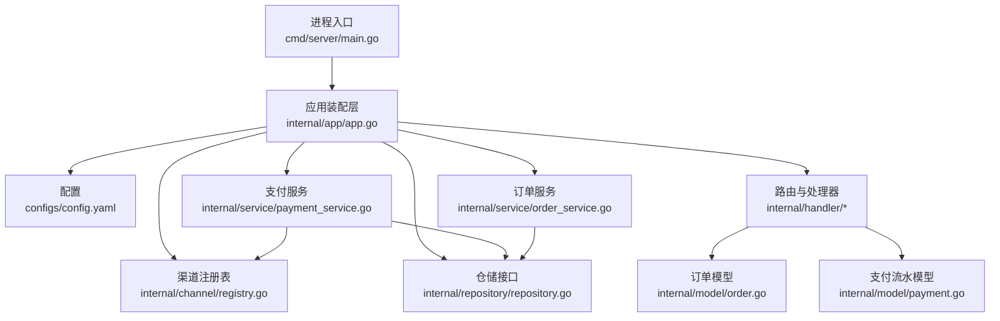
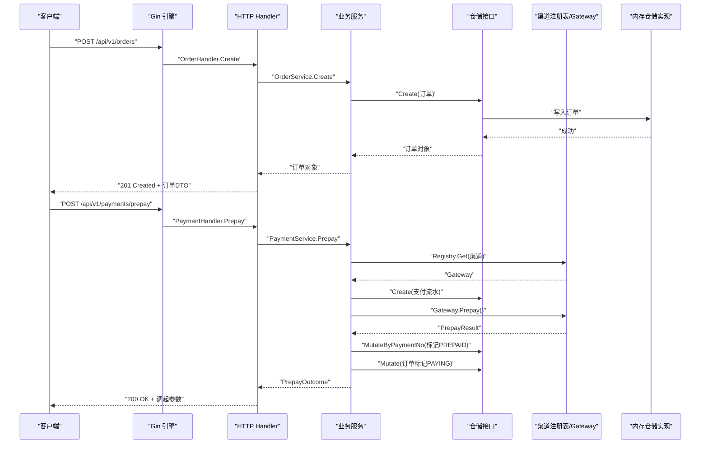
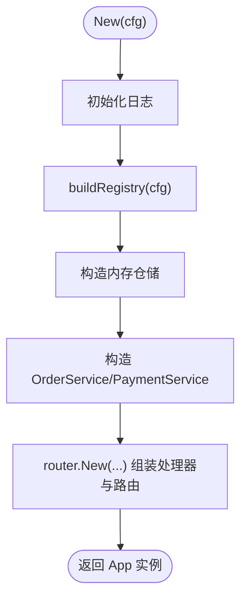
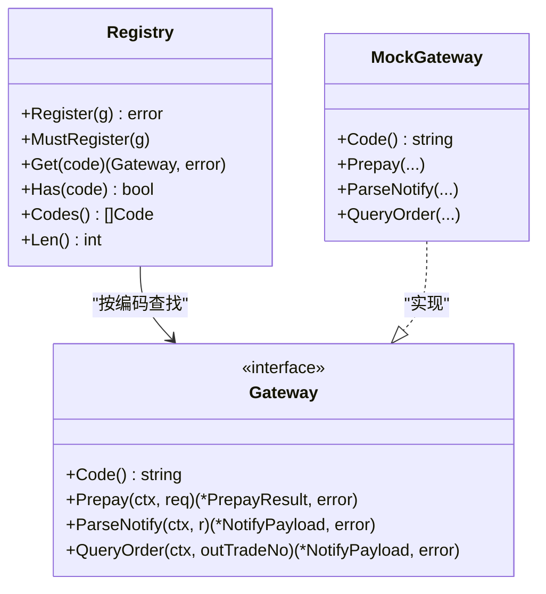
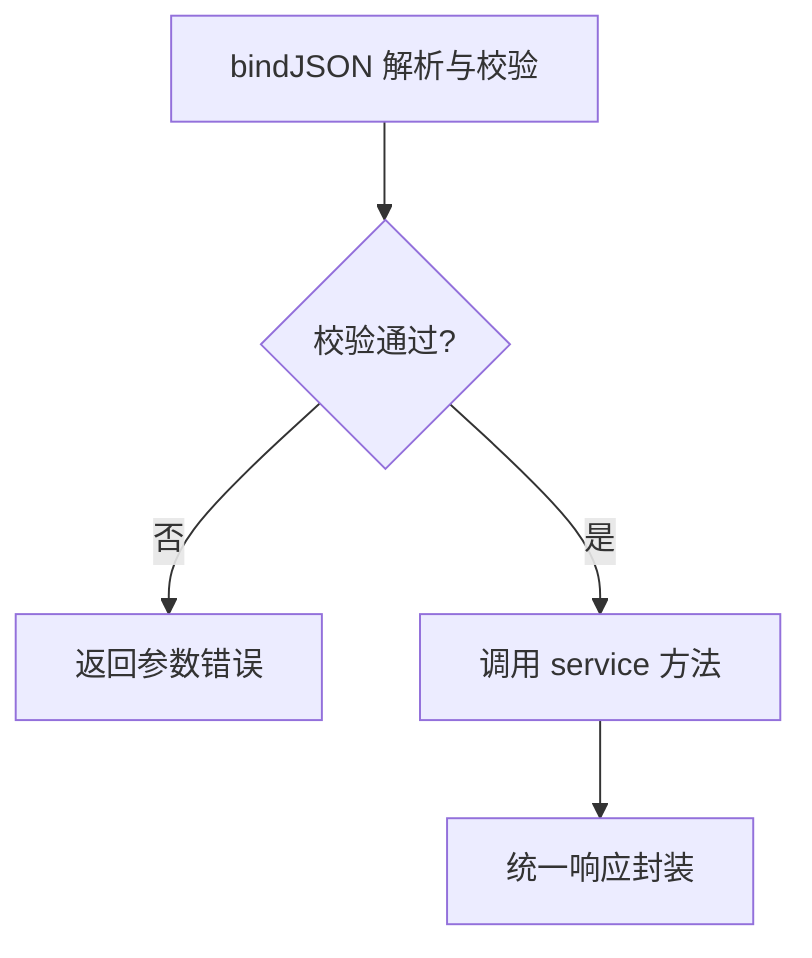
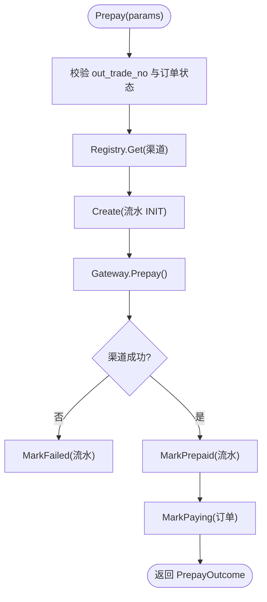
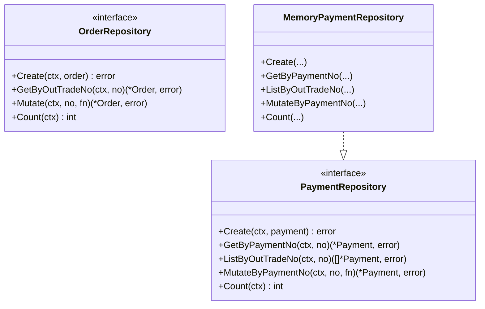
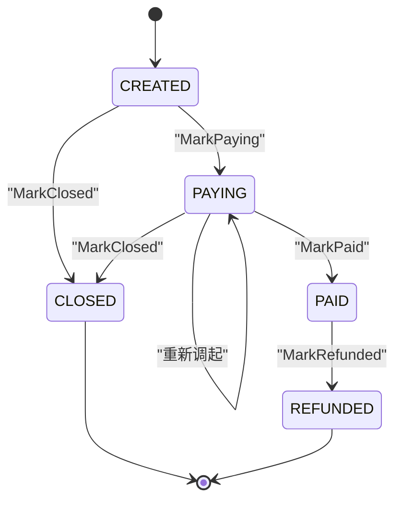
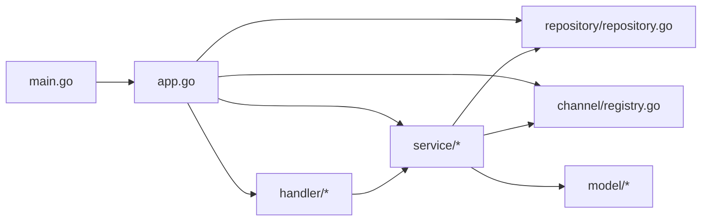

# 架构设计

<cite>
**本文引用的文件**   
- [cmd/server/main.go](file://cmd/server/main.go)
- [internal/app/app.go](file://internal/app/app.go)
- [configs/config.yaml](file://configs/config.yaml)
- [internal/channel/registry.go](file://internal/channel/registry.go)
- [internal/handler/handler.go](file://internal/handler/handler.go)
- [internal/handler/order_handler.go](file://internal/handler/order_handler.go)
- [internal/handler/payment_handler.go](file://internal/handler/payment_handler.go)
- [internal/handler/callback_handler.go](file://internal/handler/callback_handler.go)
- [internal/service/order_service.go](file://internal/service/order_service.go)
- [internal/service/payment_service.go](file://internal/service/payment_service.go)
- [internal/repository/repository.go](file://internal/repository/repository.go)
- [internal/repository/memory_payment.go](file://internal/repository/memory_payment.go)
- [internal/model/order.go](file://internal/model/order.go)
- [internal/model/payment.go](file://internal/model/payment.go)
</cite>

## 目录
1. [引言](#引言)
2. [项目结构](#项目结构)
3. [核心组件](#核心组件)
4. [架构总览](#架构总览)
5. [详细组件分析](#详细组件分析)
6. [依赖关系分析](#依赖关系分析)
7. [性能与可靠性考虑](#性能与可靠性考虑)
8. [故障排查指南](#故障排查指南)
9. [结论](#结论)

## 引言
本支付服务采用清晰的分层架构：HTTP 接入层、业务服务层、仓储接口层与领域模型层，并通过渠道抽象层作为唯一接缝对接不同支付服务商。应用装配层负责按配置构造仓储、渠道注册表、服务与处理器，并组装为 Gin 引擎；进程入口只负责生命周期管理、优雅关闭与信号处理。该设计强调可测试性、可扩展性与职责清晰：业务逻辑不感知 HTTP 与具体渠道实现，存储实现可通过接口替换，新增渠道只需扩展注册表。

## 项目结构
仓库采用 Go 标准模块布局，核心代码集中在 internal 下，按分层组织：
- cmd/server：进程入口，负责启动、配置加载、优雅关闭。
- internal/app：应用装配层，串联配置、日志、渠道、仓储、服务、路由。
- internal/channel：渠道抽象与注册表，Gateway 接口统一不同支付服务商差异。
- internal/handler：HTTP Handler，负责参数绑定、校验、响应封装。
- internal/service：业务服务，编排订单与支付流程。
- internal/repository：仓储接口与内存实现。
- internal/model：领域模型与状态机。
- configs：配置文件模板。

**图表来源** 
- [cmd/server/main.go:31-124](file://cmd/server/main.go#L31-L124)
- [internal/app/app.go:39-106](file://internal/app/app.go#L39-L106)
- [configs/config.yaml:9-61](file://configs/config.yaml#L9-L61)
- [internal/channel/registry.go:11-24](file://internal/channel/registry.go#L11-L24)
- [internal/repository/repository.go:27-64](file://internal/repository/repository.go#L27-L64)
- [internal/service/order_service.go:21-51](file://internal/service/order_service.go#L21-L51)
- [internal/service/payment_service.go:34-73](file://internal/service/payment_service.go#L34-L73)
- [internal/model/order.go:20-50](file://internal/model/order.go#L20-L50)
- [internal/model/payment.go:10-33](file://internal/model/payment.go#L10-L33)

**章节来源**
- [cmd/server/main.go:1-124](file://cmd/server/main.go#L1-L124)
- [internal/app/app.go:1-200](file://internal/app/app.go#L1-L200)
- [configs/config.yaml:1-61](file://configs/config.yaml#L1-L61)

## 核心组件
- 进程入口：解析命令行参数、加载配置、初始化应用、启动 HTTP 服务、监听退出信号并优雅关闭。
- 应用装配层：按配置构建日志、渠道注册表、仓储（当前为内存）、服务、处理器与路由；暴露 Engine、Logger、Config、Registry。
- 渠道抽象层：定义 Gateway 接口与 Registry 注册表，支持按编码查找渠道实现；Mock 渠道在非 release 模式注册。
- HTTP 接入层：Handler 负责请求解析、参数校验、DTO 转换与统一响应；回调 Handler 遵循渠道应答规范。
- 业务服务层：OrderService 负责创建订单与查询；PaymentService 负责发起支付、处理回调、查询状态与主动查单兜底。
- 仓储接口层：OrderRepository 与 PaymentRepository 定义原子 Mutate 语义与副本返回策略。
- 领域模型层：Order 与 Payment 定义状态机与合法流转，禁止外部直接赋值状态字段。

**章节来源**
- [cmd/server/main.go:31-124](file://cmd/server/main.go#L31-L124)
- [internal/app/app.go:39-106](file://internal/app/app.go#L39-L106)
- [internal/channel/registry.go:11-107](file://internal/channel/registry.go#L11-L107)
- [internal/handler/handler.go:1-156](file://internal/handler/handler.go#L1-L156)
- [internal/service/order_service.go:21-125](file://internal/service/order_service.go#L21-L125)
- [internal/service/payment_service.go:34-583](file://internal/service/payment_service.go#L34-L583)
- [internal/repository/repository.go:1-90](file://internal/repository/repository.go#L1-L90)
- [internal/model/order.go:1-184](file://internal/model/order.go#L1-L184)
- [internal/model/payment.go:1-160](file://internal/model/payment.go#L1-L160)

## 架构总览
下图展示从 HTTP 请求进入，到业务服务编排，再到仓储落库的完整路径，以及渠道抽象如何屏蔽不同支付服务商的差异。

**图表来源**
- [internal/handler/order_handler.go:23-60](file://internal/handler/order_handler.go#L23-L60)
- [internal/service/order_service.go:67-110](file://internal/service/order_service.go#L67-L110)
- [internal/handler/payment_handler.go:26-51](file://internal/handler/payment_handler.go#L26-L51)
- [internal/service/payment_service.go:99-226](file://internal/service/payment_service.go#L99-L226)
- [internal/repository/repository.go:27-64](file://internal/repository/repository.go#L27-L64)
- [internal/repository/memory_payment.go:34-121](file://internal/repository/memory_payment.go#L34-L121)
- [internal/channel/registry.go:63-74](file://internal/channel/registry.go#L63-L74)

## 详细组件分析

### 应用装配层（app）
- 职责：按配置构建日志、渠道注册表、仓储、服务、处理器与路由；暴露 Engine、Logger、Config、Registry；Close 释放资源。
- 关键行为：
  - 构建日志并设为全局基础 logger。
  - buildRegistry 根据配置注册 mock 或真实渠道，校验默认渠道可用性。
  - 构造 OrderService 与 PaymentService，注入仓储与注册表。
  - 通过 router.New 组装处理器与路由，release 模式禁用 mock 调试路由。
  - 提供 Engine() 给 http.Server 使用。

**图表来源**
- [internal/app/app.go:39-106](file://internal/app/app.go#L39-L106)
- [internal/app/app.go:108-152](file://internal/app/app.go#L108-L152)

**章节来源**
- [internal/app/app.go:1-200](file://internal/app/app.go#L1-L200)

### 渠道抽象层（channel）
- 设计理念：渠道抽象层是系统对外部支付服务商的唯一接缝。所有业务逻辑仅依赖 Gateway 接口与 Code 类型，不感知具体 SDK。
- Gateway 接口：统一 Prepay、ParseNotify、QueryOrder 等能力，屏蔽微信支付等差异。
- Registry：并发安全的渠道注册表，支持 Register、Get、Has、Codes、Len；重复注册报错，未注册返回错误码。
- 安全与健壮性：release 模式不注册 mock；若配置启用但未实现渠道则直接失败，避免“配置可用但实际不可用”的隐患。

**图表来源**
- [internal/channel/registry.go:11-107](file://internal/channel/registry.go#L11-L107)

**章节来源**
- [internal/channel/registry.go:1-107](file://internal/channel/registry.go#L1-L107)
- [internal/app/app.go:108-152](file://internal/app/app.go#L108-L152)

### HTTP Handler 层
- 职责边界：仅做参数绑定、校验、DTO 转换与统一响应；业务规则下沉至 service。
- 通用工具：bindJSON 区分空体、语法错误与校验失败；pathParam 校验路径参数；amountParseError 将金额解析错误映射为面向客户端的错误码。
- 主要处理器：
  - OrderHandler：创建订单、查询订单。
  - PaymentHandler：发起支付、查询支付状态（支持 sync=true 强制同步）。
  - CallbackHandler：渠道异步回调入口，遵循渠道应答规范（SUCCESS/FAIL），对金额不一致与验签失败进行告警。

**图表来源**
- [internal/handler/handler.go:29-55](file://internal/handler/handler.go#L29-L55)
- [internal/handler/order_handler.go:23-60](file://internal/handler/order_handler.go#L23-L60)
- [internal/handler/payment_handler.go:26-85](file://internal/handler/payment_handler.go#L26-L85)
- [internal/handler/callback_handler.go:44-86](file://internal/handler/callback_handler.go#L44-L86)

**章节来源**
- [internal/handler/handler.go:1-156](file://internal/handler/handler.go#L1-L156)
- [internal/handler/order_handler.go:1-79](file://internal/handler/order_handler.go#L1-L79)
- [internal/handler/payment_handler.go:1-119](file://internal/handler/payment_handler.go#L1-L119)
- [internal/handler/callback_handler.go:1-87](file://internal/handler/callback_handler.go#L1-L87)

### 业务服务层（service）
- OrderService：
  - Create：校验金额、确定渠道（默认值）、生成商户订单号、创建订单并落库。
  - Get：按商户订单号查询订单。
- PaymentService：
  - Prepay：校验订单可支付、创建流水(INIT)、调用渠道下单、流水置 PREPAID、订单置 PAYING；失败时流水置 FAILED 留痕。
  - HandleNotify：解析并处理渠道回调，复用 HandlePayload 保证一致。
  - HandlePayload：幂等快速返回、金额校验、推进订单状态、更新流水状态。
  - QueryStatus：本地查询，不调渠道。
  - SyncFromChannel：主动查单兜底，复用 HandlePayload。

**图表来源**
- [internal/service/payment_service.go:99-226](file://internal/service/payment_service.go#L99-L226)

**章节来源**
- [internal/service/order_service.go:21-125](file://internal/service/order_service.go#L21-L125)
- [internal/service/payment_service.go:34-583](file://internal/service/payment_service.go#L34-L583)

### 仓储接口层（repository）
- 设计要点：
  - 提供 Mutate/MutateByPaymentNo 原子修改语义，避免「读取-判断-写回」竞态导致幂等失效。
  - 对外一律返回副本，防止绕过领域模型状态机直接改字段。
- 内存实现：MemoryPaymentRepository 维护 payment_no 与 out_trade_no 索引，并发安全，排序稳定。

**图表来源**
- [internal/repository/repository.go:27-64](file://internal/repository/repository.go#L27-L64)
- [internal/repository/memory_payment.go:13-121](file://internal/repository/memory_payment.go#L13-L121)

**章节来源**
- [internal/repository/repository.go:1-90](file://internal/repository/repository.go#L1-L90)
- [internal/repository/memory_payment.go:1-121](file://internal/repository/memory_payment.go#L1-L121)

### 领域模型（model）
- Order：定义 CREATED → PAYING → PAID/CLOSED → REFUNDED 的状态机，提供 CanPay、MarkPaying、MarkPaid、MarkClosed、MarkRefunded 等方法，禁止外部直接赋值 Status。
- Payment：定义 INIT → PREPAID → SUCCESS/FAILED/CLOSED 的状态机，保留每次支付尝试的流水，便于对账与排障。

**图表来源**
- [internal/model/order.go:20-50](file://internal/model/order.go#L20-L50)
- [internal/model/order.go:122-170](file://internal/model/order.go#L122-L170)

**章节来源**
- [internal/model/order.go:1-184](file://internal/model/order.go#L1-L184)
- [internal/model/payment.go:1-160](file://internal/model/payment.go#L1-L160)

## 依赖关系分析
- 分层依赖方向：handler → service → repository 接口 + channel 抽象 + model；app 装配层聚合各层；main 仅依赖 app 与 config。
- 耦合与内聚：
  - handler 与 service 解耦于 HTTP 细节，service 不感知 gin。
  - service 通过 repository 接口与 channel.Registry 解耦具体存储与渠道实现。
  - model 独立承载领域语义与状态机。
- 外部依赖：Gin 用于路由与中间件；zap 用于结构化日志；validator 用于参数校验。

**图表来源**
- [cmd/server/main.go:31-124](file://cmd/server/main.go#L31-L124)
- [internal/app/app.go:39-106](file://internal/app/app.go#L39-L106)
- [internal/handler/order_handler.go:1-79](file://internal/handler/order_handler.go#L1-L79)
- [internal/handler/payment_handler.go:1-119](file://internal/handler/payment_handler.go#L1-L119)
- [internal/service/order_service.go:1-125](file://internal/service/order_service.go#L1-L125)
- [internal/service/payment_service.go:1-583](file://internal/service/payment_service.go#L1-L583)
- [internal/repository/repository.go:1-90](file://internal/repository/repository.go#L1-L90)
- [internal/channel/registry.go:1-107](file://internal/channel/registry.go#L1-L107)
- [internal/model/order.go:1-184](file://internal/model/order.go#L1-L184)
- [internal/model/payment.go:1-160](file://internal/model/payment.go#L1-L160)

**章节来源**
- [cmd/server/main.go:1-124](file://cmd/server/main.go#L1-L124)
- [internal/app/app.go:1-200](file://internal/app/app.go#L1-L200)

## 性能与可靠性考虑
- 回调幂等与重试：
  - 已支付订单在 HandlePayload 中快速返回成功，避免渠道无限重试。
  - 并发回调通过 Mutate 原子操作与二次判重避免重复推进。
- 金额一致性：
  - 回调金额必须与订单金额一致，否则拒绝置为已支付，防止串单与篡改。
- 掉单兜底：
  - SyncFromChannel 主动查单并复用 HandlePayload，确保回调与查单结论一致。
- 存储层原子性：
  - Mutate/MutateByPaymentNo 在锁/事务中执行，避免竞态导致幂等失效。
- 超时与优雅关闭：
  - main 设置 ReadHeaderTimeout 抵御慢速攻击；ShutdownTimeout 保障存量请求完成，避免掉单。

[本节为通用指导，无需特定文件引用]

## 故障排查指南
- 渠道未注册：
  - 现象：创建订单或发起支付时报渠道未注册。
  - 排查：检查 buildRegistry 是否注册了默认渠道；release 模式下 mock 被禁用。
- 金额不一致：
  - 现象：回调处理失败且需人工介入。
  - 排查：核对订单金额与回调金额分单位是否一致。
- 验签失败：
  - 现象：回调处理失败，属于安全事件。
  - 排查：确认请求头签名字段与证书/公钥配置正确。
- 订单号重复：
  - 现象：创建订单报内部错误。
  - 排查：检查随机源与时钟异常；仓储层 duplicateKeyError 可用于区分冲突。
- 回调反复重试：
  - 现象：日志中出现大量重复回调。
  - 排查：确认 HandleNotify 成功返回渠道期望的 SUCCESS；幂等命中也返回 SUCCESS。

**章节来源**
- [internal/app/app.go:108-152](file://internal/app/app.go#L108-L152)
- [internal/service/payment_service.go:258-379](file://internal/service/payment_service.go#L258-L379)
- [internal/handler/callback_handler.go:44-86](file://internal/handler/callback_handler.go#L44-L86)
- [internal/repository/repository.go:66-90](file://internal/repository/repository.go#L66-L90)

## 结论
本支付服务通过清晰的层次划分与明确的职责边界，实现了高可测试性、可扩展性与强可靠性：
- 可测试性：service 层不依赖 HTTP 与具体渠道，可纯单元测试覆盖复杂状态机与幂等逻辑。
- 可扩展性：新增渠道仅需实现 Gateway 并在 registry 注册；替换存储只需实现 repository 接口。
- 职责清晰：handler 只做接入适配，service 编排业务，repository 抽象持久化，model 承载领域语义。
- 可靠性：回调幂等、金额校验、掉单兜底、原子 Mutate、优雅关闭共同保障资金安全与服务稳定。

[本节为总结性内容，无需特定文件引用]