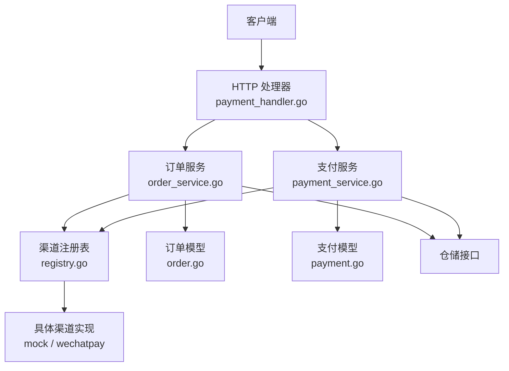
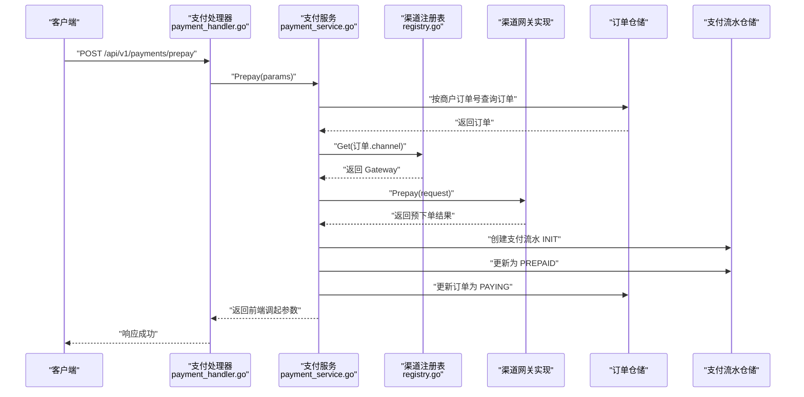
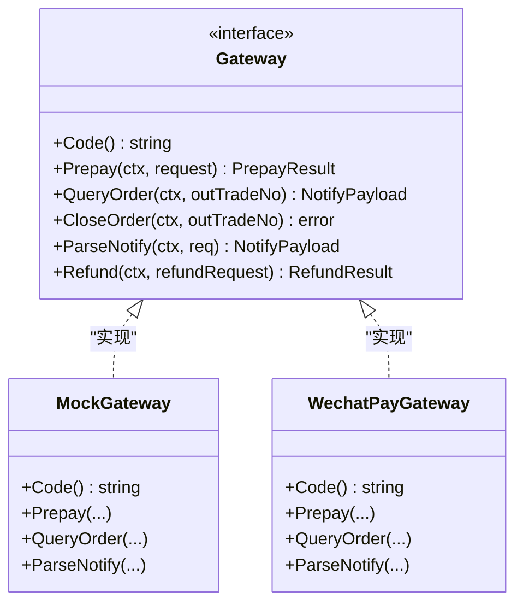
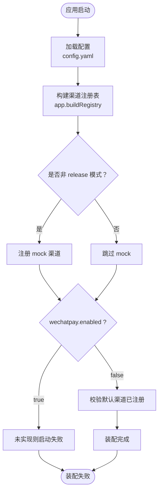
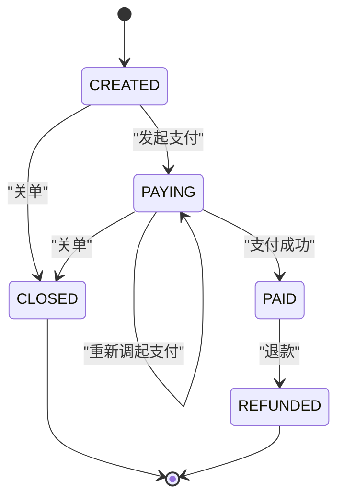
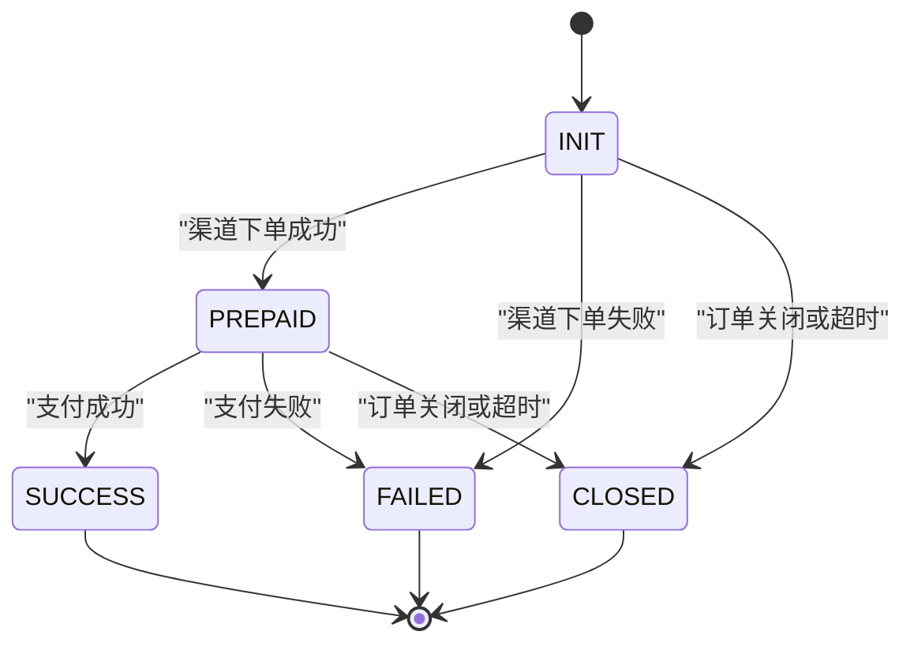
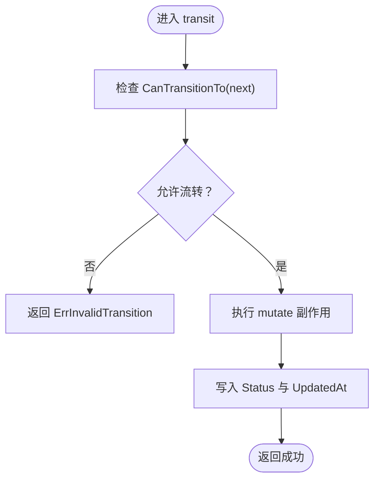
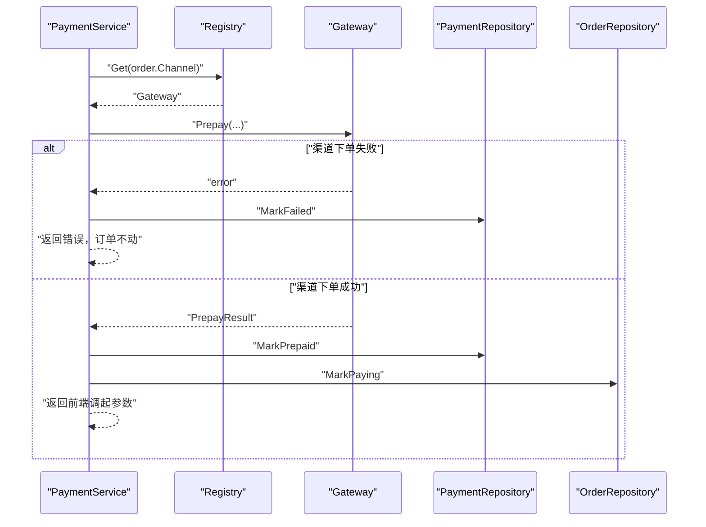
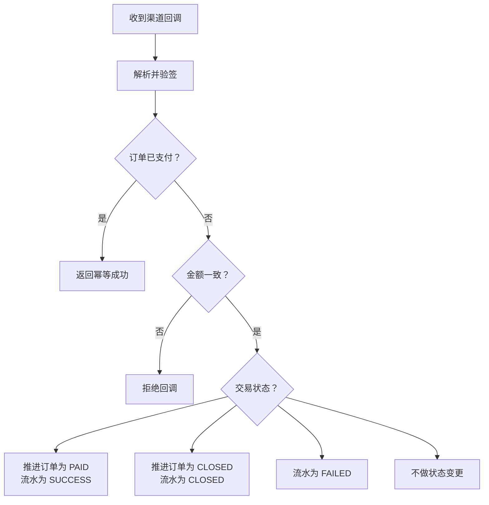
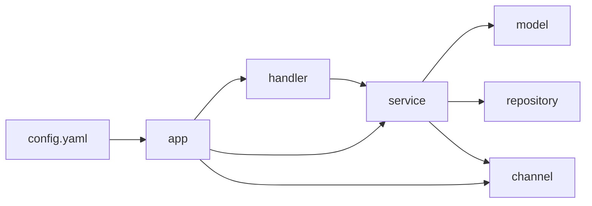

# 核心设计模式

<cite>
**本文引用的文件**   
- [internal/channel/registry.go](file://internal/channel/registry.go)
- [internal/app/app.go](file://internal/app/app.go)
- [configs/config.yaml](file://configs/config.yaml)
- [internal/model/order.go](file://internal/model/order.go)
- [internal/model/payment.go](file://internal/model/payment.go)
- [internal/service/order_service.go](file://internal/service/order_service.go)
- [internal/service/payment_service.go](file://internal/service/payment_service.go)
- [internal/handler/payment_handler.go](file://internal/handler/payment_handler.go)
- [README.md](file://README.md)
</cite>

## 目录
1. [引言](#引言)
2. [项目结构](#项目结构)
3. [核心组件](#核心组件)
4. [架构总览](#架构总览)
5. [详细组件分析](#详细组件分析)
6. [依赖关系分析](#依赖关系分析)
7. [性能与并发特性](#性能与并发特性)
8. [故障排查指南](#故障排查指南)
9. [结论](#结论)
10. [附录：扩展新渠道与新状态的最佳实践](#附录扩展新渠道与新状态的最佳实践)

## 引言
本文围绕支付服务中的三个核心设计模式展开：**策略模式**、**工厂模式**和**状态机模式**。重点解释：
- 如何通过 `Gateway` 接口统一不同支付渠道的调用方式；
- 如何通过 `Registry` 实现渠道的动态注册与获取；
- 如何在装配层通过配置驱动渠道选择，体现工厂模式的职责；
- 如何通过 `OrderStatus` 与 `PaymentStatus` 的状态机保证订单与支付流水的状态迁移合法、可审计、幂等。

这些模式共同解决了“多渠道接入”“配置驱动”“资金安全”“回调幂等”等支付系统常见问题。

## 项目结构
本项目采用分层组织：
- `cmd/server`：进程入口；
- `configs`：配置模板；
- `internal/app`：装配层，负责按配置构造仓储、渠道、服务、处理器并启动 HTTP；
- `internal/channel`：渠道抽象层，定义 `Gateway` 接口与 `Registry`；
- `internal/model`：领域模型与状态机；
- `internal/service`：业务编排；
- `internal/handler`：HTTP 接入层；
- `internal/repository`：仓储接口与内存实现；
- `internal/pkg`：通用工具；
- `internal/router`：路由表。

**图表来源**
- [internal/handler/payment_handler.go:32-51](file://internal/handler/payment_handler.go#L32-L51)
- [internal/service/order_service.go:21-51](file://internal/service/order_service.go#L21-L51)
- [internal/service/payment_service.go:34-73](file://internal/service/payment_service.go#L34-L73)
- [internal/channel/registry.go:21-29](file://internal/channel/registry.go#L21-L29)
- [internal/model/order.go:73-102](file://internal/model/order.go#L73-L102)
- [internal/model/payment.go:54-89](file://internal/model/payment.go#L54-L89)

**章节来源**
- [README.md:38-60](file://README.md#L38-L60)

## 核心组件
- **渠道抽象与注册中心**：`channel.Gateway` 是策略接口，`channel.Registry` 是运行期渠道查找容器。
- **装配与配置驱动**：`app.buildRegistry` 根据 `config.yaml` 决定是否注册 mock 或微信支付渠道，并校验默认渠道可用。
- **领域状态机**：`model.Order` 与 `model.Payment` 分别维护订单与支付流水的状态转换规则，所有变更必须通过 `Mark*` 方法进入私有 `transit` 校验。
- **业务编排**：`OrderService` 负责创建订单与校验渠道；`PaymentService` 负责发起支付、处理回调、查询状态与主动查单兜底。

**章节来源**
- [internal/channel/registry.go:11-24](file://internal/channel/registry.go#L11-L24)
- [internal/app/app.go:108-151](file://internal/app/app.go#L108-L151)
- [internal/model/order.go:20-50](file://internal/model/order.go#L20-L50)
- [internal/model/payment.go:10-33](file://internal/model/payment.go#L10-L33)
- [internal/service/order_service.go:21-51](file://internal/service/order_service.go#L21-L51)
- [internal/service/payment_service.go:34-73](file://internal/service/payment_service.go#L34-L73)

## 架构总览
下图展示一次“发起支付”的关键流程：HTTP 请求进入处理器，处理器调用支付服务；支付服务从注册表按订单中记录的渠道编码取出网关实现，调用其预下单接口，再推进订单与流水状态。

**图表来源**
- [internal/handler/payment_handler.go:32-51](file://internal/handler/payment_handler.go#L32-L51)
- [internal/service/payment_service.go:108-226](file://internal/service/payment_service.go#L108-L226)
- [internal/channel/registry.go:63-74](file://internal/channel/registry.go#L63-L74)

## 详细组件分析

### 策略模式：Gateway 接口统一支付渠道
`Gateway` 是策略模式的核心抽象。它把“如何向某个支付渠道发起支付、查询订单、解析回调、退款”等差异逻辑封装成统一方法。业务层只依赖接口，不关心具体是微信、支付宝还是其他渠道。

关键要点：
- 渠道差异被隔离在 `Gateway` 的具体实现中；
- 业务层通过 `channel.Code` 选择实现；
- 新增渠道只需实现接口，无需修改业务编排代码。

**图表来源**
- [internal/channel/wechatpay/doc.go:9-14](file://internal/channel/wechatpay/doc.go#L9-L14)

**章节来源**
- [internal/channel/wechatpay/doc.go:1-14](file://internal/channel/wechatpay/doc.go#L1-L14)

### 工厂模式：Registry 与装配层的渠道实例化
虽然 `Registry` 本身不是传统意义上的工厂类，但它承担了“按编码动态创建/获取渠道实例”的职责，配合装配层完成“配置驱动”的工厂行为：

- `Registry.Register` 将渠道实现以 `Code -> Gateway` 的方式注册；
- `Registry.Get` 按编码取回对应实现；
- `app.buildRegistry` 读取 `config.yaml`，决定注册哪些渠道，并把默认渠道注入到 `OrderService`；
- `OrderService.Create` 在创建订单时校验渠道是否已注册，确保订单落库时的渠道是稳定、可解释的。

**图表来源**
- [internal/app/app.go:108-151](file://internal/app/app.go#L108-L151)
- [configs/config.yaml:30-45](file://configs/config.yaml#L30-L45)

**章节来源**
- [internal/channel/registry.go:31-61](file://internal/channel/registry.go#L31-L61)
- [internal/app/app.go:108-151](file://internal/app/app.go#L108-L151)
- [internal/service/order_service.go:72-110](file://internal/service/order_service.go#L72-L110)
- [configs/config.yaml:30-45](file://configs/config.yaml#L30-L45)

### 状态机模式：OrderStatus 与 PaymentStatus
状态机模式将“状态集合”和“合法迁移规则”集中管理，避免业务代码中出现分散的字符串比较与 if-else。

#### 订单状态机
订单状态包括：
- `CREATED`：订单已创建，尚未调起支付；
- `PAYING`：已调起支付，等待用户付款；
- `PAID`：支付成功；
- `CLOSED`：订单关闭；
- `REFUNDED`：已退款。

合法迁移规则由 `orderTransitions` 显式声明，非法迁移通过 `ErrInvalidTransition` 表达。

**图表来源**
- [internal/model/order.go:20-50](file://internal/model/order.go#L20-L50)

#### 支付流水状态机
支付流水状态包括：
- `INIT`：流水已创建；
- `PREPAID`：渠道下单成功；
- `SUCCESS`：支付成功；
- `FAILED`：支付失败；
- `CLOSED`：流水关闭。

**图表来源**
- [internal/model/payment.go:10-33](file://internal/model/payment.go#L10-L33)

#### 状态变更的唯一入口
无论是订单还是支付流水，所有状态变更都通过 `transit` 方法执行：
1. 先判断当前状态是否允许流转到目标状态；
2. 通过后执行副作用（如回填交易号、记录时间）；
3. 最后写入新状态与更新时间。

**图表来源**
- [internal/model/order.go:155-170](file://internal/model/order.go#L155-L170)
- [internal/model/payment.go:139-150](file://internal/model/payment.go#L139-L150)

**章节来源**
- [internal/model/order.go:20-50](file://internal/model/order.go#L20-L50)
- [internal/model/order.go:122-170](file://internal/model/order.go#L122-L170)
- [internal/model/payment.go:10-33](file://internal/model/payment.go#L10-L33)
- [internal/model/payment.go:106-150](file://internal/model/payment.go#L106-L150)

### 支付发起流程：策略模式与状态机的协作
`PaymentService.Prepay` 展示了策略模式与状态机如何协作：
- 先从订单中读取固定渠道编码；
- 通过 `Registry.Get` 获取 `Gateway`；
- 调用 `gateway.Prepay`；
- 成功后将支付流水推进到 `PREPAID`，订单推进到 `PAYING`；
- 若渠道下单失败，则将流水标记为 `FAILED`，订单状态不变，允许用户重试。

**图表来源**
- [internal/service/payment_service.go:108-226](file://internal/service/payment_service.go#L108-L226)

**章节来源**
- [internal/service/payment_service.go:108-226](file://internal/service/payment_service.go#L108-L226)

### 回调与查单：幂等与一致性保障
回调处理路径强调：
- 已支付订单直接返回幂等成功；
- 金额不一致坚决拒绝；
- 并发回调通过锁内二次检查防止重复推进；
- 非成功状态区分“关闭”“失败”“待确认”，只对终态做状态变更；
- 主动查单复用回调处理逻辑，避免两条路径产生分歧。

**图表来源**
- [internal/service/payment_service.go:282-379](file://internal/service/payment_service.go#L282-L379)
- [internal/service/payment_service.go:381-415](file://internal/service/payment_service.go#L381-L415)

**章节来源**
- [internal/service/payment_service.go:282-379](file://internal/service/payment_service.go#L282-L379)
- [internal/service/payment_service.go:381-415](file://internal/service/payment_service.go#L381-L415)
- [internal/service/payment_service.go:548-582](file://internal/service/payment_service.go#L548-L582)

## 依赖关系分析
- `handler` 依赖 `service`；
- `service` 依赖 `model`、`repository`、`channel`；
- `channel` 仅依赖基础类型与错误码，不感知 HTTP 与存储；
- `model` 不依赖 service 与 handler，保持领域纯净；
- `app` 是唯一装配点，串联配置、日志、渠道、仓储、服务、处理器与路由。

**图表来源**
- [internal/app/app.go:14-29](file://internal/app/app.go#L14-L29)
- [internal/service/order_service.go:9-19](file://internal/service/order_service.go#L9-L19)
- [internal/service/payment_service.go:3-16](file://internal/service/payment_service.go#L3-L16)

**章节来源**
- [internal/app/app.go:1-12](file://internal/app/app.go#L1-L12)
- [internal/service/order_service.go:1-7](file://internal/service/order_service.go#L1-L7)
- [internal/service/payment_service.go:1-16](file://internal/service/payment_service.go#L1-L16)

## 性能与并发特性
- `Registry` 使用 `sync.RWMutex`，读多写少场景下开销可忽略，同时保留未来热加载能力；
- 回调处理采用“锁外快速判断 + 锁内二次检查”的两阶段幂等策略；
- 查询支付状态默认只读本地数据，避免高频轮询触发渠道限流；
- 主动查单仅在需要强制对齐时使用，或由定时任务批量执行。

**章节来源**
- [internal/channel/registry.go:17-20](file://internal/channel/registry.go#L17-L20)
- [internal/service/payment_service.go:301-313](file://internal/service/payment_service.go#L301-L313)
- [internal/service/payment_service.go:528-531](file://internal/service/payment_service.go#L528-L531)
- [internal/service/payment_service.go:548-553](file://internal/service/payment_service.go#L548-L553)

## 故障排查指南
常见异常与定位建议：
- “渠道未注册”：检查 `config.yaml` 中 `channels.wechatpay.enabled` 与实际实现是否匹配，以及 `payment.default_channel` 是否在 `Registry` 中；
- “非法的订单状态流转”：检查业务代码是否绕过 `Mark*` 方法直接赋值 `Status`；
- “订单已支付”：说明回调或查单已经成功推进，后续重复请求应走幂等分支；
- “金额不一致”：属于资金安全红线，需核对订单金额、回调金额与前端传入金额；
- “release 模式下没有可用的支付渠道”：骨架版本未实现微信支付且 mock 在生产模式禁用，需先完成接入。

**章节来源**
- [internal/channel/registry.go:63-74](file://internal/channel/registry.go#L63-L74)
- [internal/model/order.go:36-60](file://internal/model/order.go#L36-L60)
- [internal/service/payment_service.go:228-244](file://internal/service/payment_service.go#L228-L244)
- [internal/service/payment_service.go:320-333](file://internal/service/payment_service.go#L320-L333)
- [internal/app/app.go:134-151](file://internal/app/app.go#L134-L151)

## 结论
本项目的核心设计模式围绕“解耦渠道差异”“约束状态迁移”“配置驱动装配”展开：
- 策略模式让新增支付渠道不影响业务层；
- 工厂式装配让渠道启用与默认值完全由配置控制；
- 状态机模式让订单与支付流水的迁移规则集中、可测试、可审计；
- 幂等与兜底机制让回调与查单保持一致，降低掉单风险。

这些模式共同构成一个可扩展、可验证、可运维的支付服务骨架。

## 附录：扩展新渠道与新状态的最佳实践

### 新增支付渠道
步骤建议：
1. 在 `internal/channel` 下新增渠道包，实现 `Gateway` 接口；
2. 在 `internal/app/app.go` 的 `buildRegistry` 中按配置注册该渠道；
3. 在 `configs/config.yaml` 中增加渠道开关与必要配置项；
4. 不要修改 `service` 与 `handler` 的业务逻辑；
5. 通过 mock 渠道跑通链路后再切换到真实渠道。

**章节来源**
- [internal/channel/wechatpay/doc.go:9-14](file://internal/channel/wechatpay/doc.go#L9-L14)
- [internal/app/app.go:108-151](file://internal/app/app.go#L108-L151)
- [configs/config.yaml:42-61](file://configs/config.yaml#L42-L61)

### 新增订单或支付状态
步骤建议：
1. 在 `model` 中新增状态常量；
2. 更新 `orderTransitions` 或 `paymentTransitions`，明确合法后继；
3. 如需新增业务语义，补充对应的 `IsXxx` 方法；
4. 在 `service` 中新增必要的 `MarkXxx` 方法，并通过 `transit` 统一校验；
5. 补充单元测试穷举所有合法与非法迁移路径；
6. 更新文档与监控指标，确保新增状态可观测。

**章节来源**
- [internal/model/order.go:20-50](file://internal/model/order.go#L20-L50)
- [internal/model/payment.go:10-33](file://internal/model/payment.go#L10-L33)
- [internal/model/order.go:122-170](file://internal/model/order.go#L122-L170)
- [internal/model/payment.go:106-150](file://internal/model/payment.go#L106-L150)