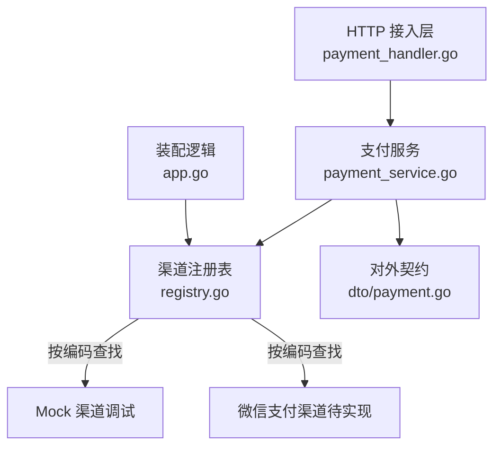
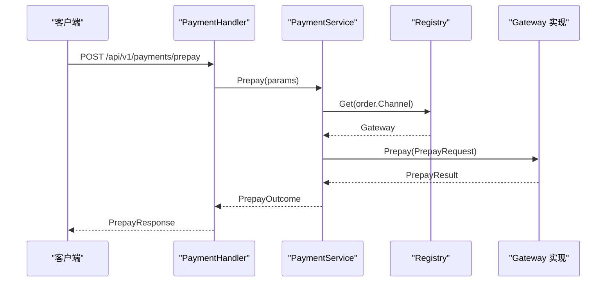
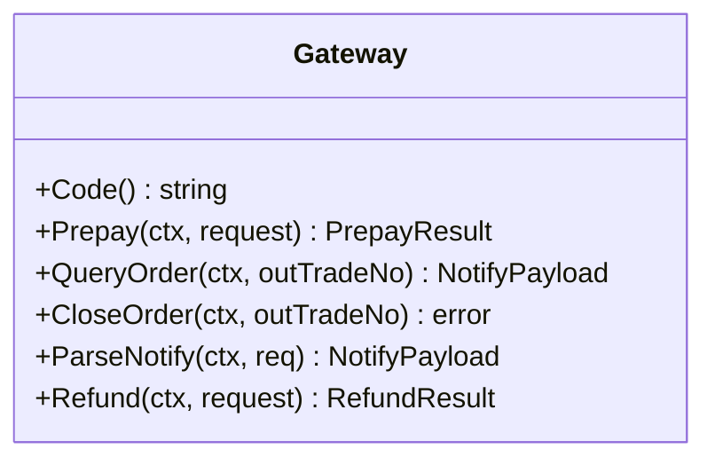
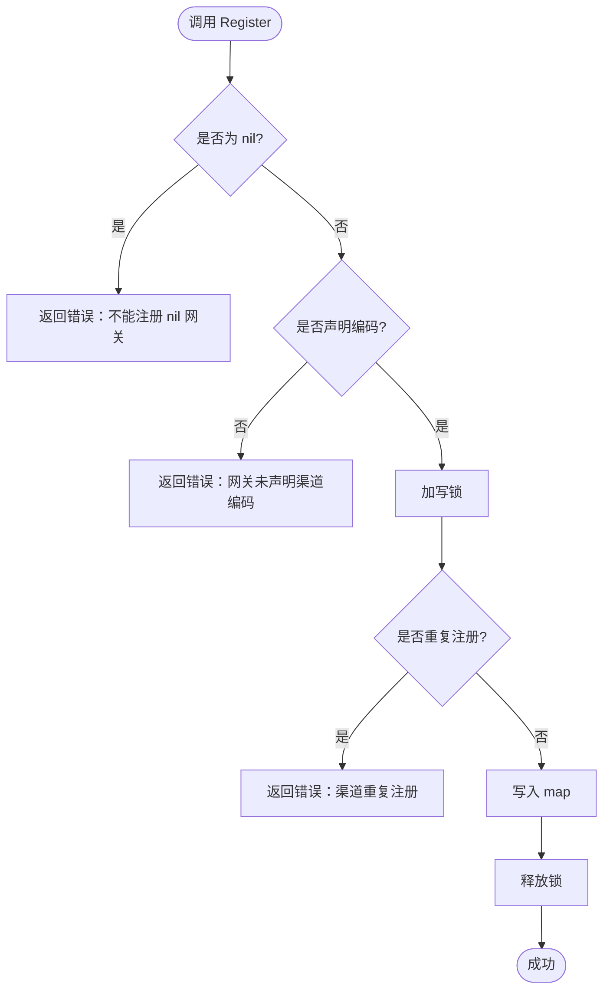
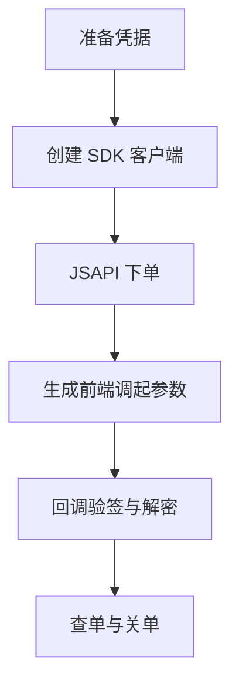
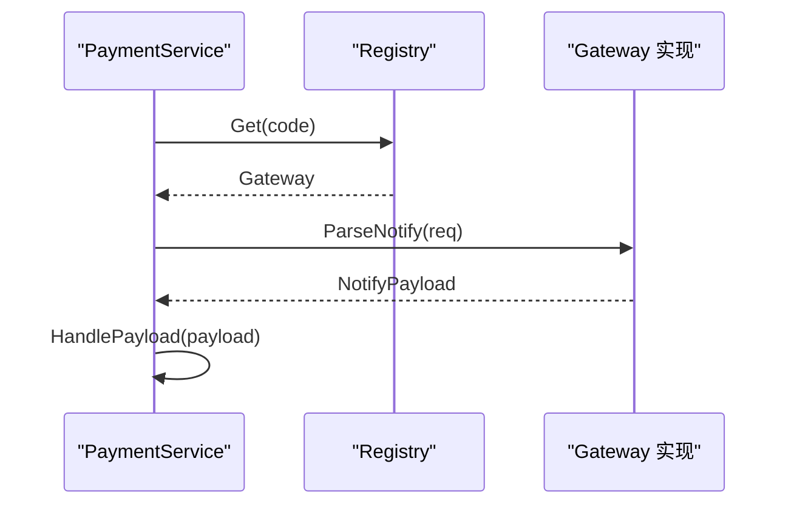
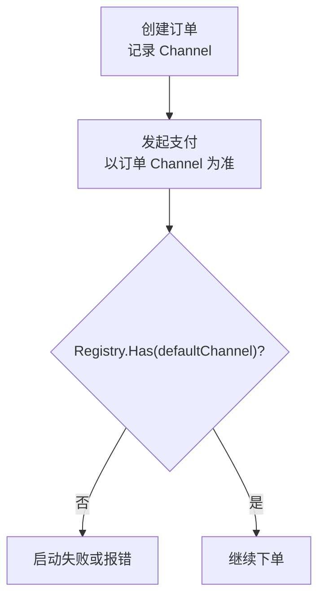
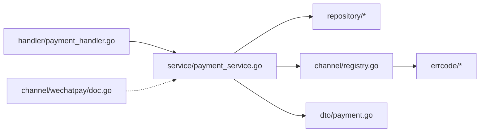

# 渠道抽象模式

<cite>
**本文引用的文件**   
- [internal/channel/registry.go](file://internal/channel/registry.go)
- [internal/channel/wechatpay/doc.go](file://internal/channel/wechatpay/doc.go)
- [internal/service/payment_service.go](file://internal/service/payment_service.go)
- [internal/dto/payment.go](file://internal/dto/payment.go)
- [internal/handler/payment_handler.go](file://internal/handler/payment_handler.go)
- [internal/app/app.go](file://internal/app/app.go)
- [README.md](file://README.md)
</cite>

## 目录
1. [引言](#引言)
2. [项目结构](#项目结构)
3. [核心组件](#核心组件)
4. [架构总览](#架构总览)
5. [详细组件分析](#详细组件分析)
6. [依赖关系分析](#依赖关系分析)
7. [性能与并发特性](#性能与并发特性)
8. [故障排查指南](#故障排查指南)
9. [结论](#结论)
10. [附录：扩展新支付渠道的开发指南](#附录扩展新支付渠道的开发指南)

## 引言
本文件聚焦“渠道抽象模式”，解释如何通过统一的 Gateway 接口屏蔽不同支付服务商的差异，并以 Registry 作为运行期渠道注册中心，实现渠道发现、注册与错误处理。文档同时说明 Mock 渠道的调试用途、微信支付接入要点，以及如何在业务层通过接口抽象完成渠道切换与扩展。

## 项目结构
围绕渠道抽象的关键代码分布在以下位置：
- internal/channel：渠道抽象与注册表
- internal/service：支付服务，统一调用渠道
- internal/handler：HTTP 接入层，将请求转为 service 调用
- internal/dto：对外契约，包含发起支付请求与响应
- internal/app：装配逻辑，校验默认渠道是否可用
- internal/channel/wechatpay：微信支付占位包与接入指引

**图示来源**
- [internal/handler/payment_handler.go:32-51](file://internal/handler/payment_handler.go#L32-L51)
- [internal/service/payment_service.go:108-163](file://internal/service/payment_service.go#L108-L163)
- [internal/channel/registry.go:21-51](file://internal/channel/registry.go#L21-L51)
- [internal/dto/payment.go:9-42](file://internal/dto/payment.go#L9-L42)
- [internal/app/app.go:134-152](file://internal/app/app.go#L134-L152)

**章节来源**
- [README.md:39-60](file://README.md#L39-L60)

## 核心组件
- Gateway 接口：定义所有支付渠道的统一能力，包括下单、查单、关单、回调解析与退款。
- Registry：并发安全的渠道注册表，提供 Register、Get、Has、Codes、Len 等方法，屏蔽具体渠道实现。
- PaymentService：业务编排层，基于 Registry 获取具体渠道并执行下单、回调处理、状态查询与掉单兜底。
- DTO：对外请求与响应结构，封装 channel 类型，使 HTTP 层与领域模型解耦。

**章节来源**
- [internal/channel/registry.go:11-24](file://internal/channel/registry.go#L11-L24)
- [internal/service/payment_service.go:34-46](file://internal/service/payment_service.go#L34-L46)
- [internal/dto/payment.go:9-42](file://internal/dto/payment.go#L9-L42)

## 架构总览
下图展示从 HTTP 请求到渠道调用的完整流程，体现“统一接口 + 注册表”的抽象方式如何屏蔽底层差异。

**图示来源**
- [internal/handler/payment_handler.go:32-51](file://internal/handler/payment_handler.go#L32-L51)
- [internal/service/payment_service.go:108-163](file://internal/service/payment_service.go#L108-L163)
- [internal/channel/registry.go:63-74](file://internal/channel/registry.go#L63-L74)

## 详细组件分析

### Gateway 接口与渠道抽象
Gateway 是渠道抽象的核心，它把不同支付服务商的差异收敛为统一方法集。业务层只依赖该接口，不感知具体 SDK 或厂商细节。

- Code：渠道编码，用于在注册表中定位实现。
- Prepay：发起支付，返回前端调起参数等结果。
- QueryOrder：主动查单，返回交易状态载荷。
- CloseOrder：关闭订单。
- ParseNotify：解析渠道异步回调，必须接收原始 http.Request，以便验签读取必要请求头。
- Refund：退款（当前骨架中 mock 未实现）。

**图示来源**
- [README.md:162-177](file://README.md#L162-L177)

**章节来源**
- [README.md:162-177](file://README.md#L162-L177)

### 渠道注册表（Registry）设计与实现
Registry 以 map[Code]Gateway 存储已注册的渠道，使用 RWMutex 保证读多写少场景下的并发安全。其设计要点如下：

- 注册流程
  - Register：校验非 nil、非空编码；重复注册直接返回错误，避免覆盖导致运行期行为不确定。
  - MustRegister：启动期强校验，失败 panic，确保进程带着残缺渠道集合不可用。
- 发现机制
  - Get：按编码取 Gateway，不存在时返回“渠道未注册”错误。
  - Has：判断是否已注册。
  - Codes：返回排序后的编码列表，便于日志与健康检查稳定输出。
  - Len：返回已注册数量。
- 错误处理策略
  - 重复注册、nil 网关、未声明编码均返回明确错误。
  - 未注册渠道查询返回统一业务错误码，便于上层区分配置错误与运行时异常。

**图示来源**
- [internal/channel/registry.go:35-51](file://internal/channel/registry.go#L35-L51)

**章节来源**
- [internal/channel/registry.go:11-24](file://internal/channel/registry.go#L11-L24)
- [internal/channel/registry.go:31-61](file://internal/channel/registry.go#L31-L61)
- [internal/channel/registry.go:63-106](file://internal/channel/registry.go#L63-L106)

### Mock 渠道的实现原理与调试用途
Mock 渠道用于在没有真实商户号的情况下端到端验证状态机、回调幂等与金额校验逻辑。它在开发阶段充当“可预测的渠道实现”，帮助快速跑通下单 → 回调 → 查单全流程。

- 调试价值
  - 无需网络与第三方依赖即可验证业务链路。
  - 可模拟成功、失败、金额不一致等分支，辅助测试边界条件。
- 使用建议
  - 本地联调保持 debug 模式，确保 mock 渠道可用。
  - release 模式下刻意排除 mock，强制上线前实现真实渠道。

**章节来源**
- [internal/dto/payment.go:114-141](file://internal/dto/payment.go#L114-L141)
- [README.md:5-11](file://README.md#L5-L11)

### 微信支付渠道接入指南
wechatpay 包目前为占位包，仅包含接入文档与安全红线。接入时需新增 gateway.go 实现 Gateway 接口的六个方法，并在装配逻辑中按配置注册。

- 接入步骤
  - 新增 gateway.go，实现 Code、Prepay、QueryOrder、CloseOrder、ParseNotify、Refund。
  - 在 app 装配逻辑中按 channels.wechatpay.enabled 注册。
  - 准备四个必备凭据：商户号、证书序列号（或公钥 ID）、APIv3 密钥、商户私钥。
- 官方 SDK 用法要点
  - 创建客户端（证书模式或公钥模式）。
  - JSAPI 下单与生成前端调起参数。
  - 回调验签与解密必须使用 *http.Request，读取必要请求头。
  - 查单、关单调用对应 API。
- 安全红线
  - 私钥与 APIv3 密钥严禁落库与打印。
  - 证书与密钥存放于 certs/，整体 gitignore。

**图示来源**
- [internal/channel/wechatpay/doc.go:16-86](file://internal/channel/wechatpay/doc.go#L16-L86)
- [internal/channel/wechatpay/doc.go:88-104](file://internal/channel/wechatpay/doc.go#L88-L104)

**章节来源**
- [internal/channel/wechatpay/doc.go:1-14](file://internal/channel/wechatpay/doc.go#L1-L14)
- [internal/channel/wechatpay/doc.go:16-86](file://internal/channel/wechatpay/doc.go#L16-L86)
- [internal/channel/wechatpay/doc.go:88-104](file://internal/channel/wechatpay/doc.go#L88-L104)

### 通过接口抽象屏蔽底层差异
PaymentService 只依赖 channel.Gateway，不依赖任何具体 SDK 类型。这样，service 层与 handler 层无需因更换支付服务商而改动。

- 下单路径
  - 从订单确定渠道编码。
  - 通过 Registry.Get 获取 Gateway。
  - 调用 Gateway.Prepay 并处理结果。
- 回调路径
  - 根据路由中的渠道编码获取 Gateway。
  - 调用 Gateway.ParseNotify 解析回调。
  - 复用 HandlePayload 统一处理状态推进。

**图示来源**
- [internal/service/payment_service.go:263-275](file://internal/service/payment_service.go#L263-L275)
- [internal/channel/registry.go:63-74](file://internal/channel/registry.go#L63-L74)

**章节来源**
- [internal/service/payment_service.go:108-163](file://internal/service/payment_service.go#L108-L163)
- [internal/service/payment_service.go:263-275](file://internal/service/payment_service.go#L263-L275)

### 渠道切换的业务场景与技术实现
- 业务场景
  - 同一订单在不同渠道间跳变会导致对账困难，因此订单创建后应固定渠道。
  - 默认渠道由配置决定，但必须在启动时确认可用。
- 技术实现
  - 订单上记录 Channel，Prepay 时以订单为准，不接受临时改渠道。
  - Registry.Has 校验默认渠道是否已注册；release 模式下若无可用户道则启动失败。
  - DTO 中允许传入 channel 字段，但最终仍回落到订单渠道。

**图示来源**
- [internal/service/payment_service.go:125-131](file://internal/service/payment_service.go#L125-L131)
- [internal/app/app.go:134-152](file://internal/app/app.go#L134-L152)
- [internal/dto/payment.go:9-25](file://internal/dto/payment.go#L9-L25)

**章节来源**
- [internal/service/payment_service.go:125-131](file://internal/service/payment_service.go#L125-L131)
- [internal/app/app.go:134-152](file://internal/app/app.go#L134-L152)
- [internal/dto/payment.go:9-25](file://internal/dto/payment.go#L9-L25)

## 依赖关系分析
- PaymentService 依赖 Repository 与 Registry，不依赖具体渠道实现。
- Handler 依赖 Service 与 DTO，负责参数绑定与响应封装。
- Registry 依赖 errcode 返回统一错误码。
- wechatpay 包仅含文档，尚未引入 SDK 依赖。

**图示来源**
- [internal/handler/payment_handler.go:1-14](file://internal/handler/payment_handler.go#L1-L14)
- [internal/service/payment_service.go:1-16](file://internal/service/payment_service.go#L1-L16)
- [internal/channel/registry.go:1-9](file://internal/channel/registry.go#L1-L9)
- [internal/dto/payment.go:1-7](file://internal/dto/payment.go#L1-L7)
- [internal/channel/wechatpay/doc.go:1-14](file://internal/channel/wechatpay/doc.go#L1-L14)

**章节来源**
- [internal/handler/payment_handler.go:1-14](file://internal/handler/payment_handler.go#L1-L14)
- [internal/service/payment_service.go:1-16](file://internal/service/payment_service.go#L1-L16)
- [internal/channel/registry.go:1-9](file://internal/channel/registry.go#L1-L9)
- [internal/dto/payment.go:1-7](file://internal/dto/payment.go#L1-L7)
- [internal/channel/wechatpay/doc.go:1-14](file://internal/channel/wechatpay/doc.go#L1-L14)

## 性能与并发特性
- Registry 使用 RWMutex，读多写少场景开销可忽略，适合启动一次性注册、运行期频繁查询的模式。
- Codes 返回排序后的编码列表，便于日志与健康检查稳定输出，利于 diff 排查配置漂移。
- PaymentService 在回调处理中使用哨兵错误表达幂等命中，避免无意义错误日志掩盖真正非法流转。

**章节来源**
- [internal/channel/registry.go:11-24](file://internal/channel/registry.go#L11-L24)
- [internal/channel/registry.go:85-97](file://internal/channel/registry.go#L85-L97)
- [internal/service/payment_service.go:23-32](file://internal/service/payment_service.go#L23-L32)

## 故障排查指南
- 渠道未注册
  - 现象：Get 返回“支付渠道未注册”。
  - 原因：装配阶段未注册对应编码的 Gateway。
  - 处理：检查 app 装配逻辑与配置，确认渠道已注册且 default_channel 存在。
- 重复注册
  - 现象：Register 返回“渠道重复注册”。
  - 原因：同一编码被多次注册。
  - 处理：修正配置或装配顺序，确保唯一性。
- Release 模式无可用渠道
  - 现象：启动失败，提示 release 模式下没有可用的支付渠道。
  - 原因：mock 在生产模式被禁用，微信支付尚未实现。
  - 处理：本地联调使用 debug 模式；上线前完成微信支付实现。
- 回调金额不一致
  - 现象：HandlePayload 拒绝置为已支付，返回金额不一致错误。
  - 原因：订单金额与回调金额不符，可能涉及篡改或串单。
  - 处理：人工介入核对订单与渠道账单，必要时拒绝并告警。

**章节来源**
- [internal/channel/registry.go:63-74](file://internal/channel/registry.go#L63-L74)
- [internal/channel/registry.go:35-51](file://internal/channel/registry.go#L35-L51)
- [internal/app/app.go:134-152](file://internal/app/app.go#L134-L152)
- [internal/service/payment_service.go:320-333](file://internal/service/payment_service.go#L320-L333)

## 结论
通过 Gateway 接口与 Registry 注册表，本项目实现了渠道抽象与运行期发现，屏蔽了不同支付服务商的具体实现差异。PaymentService 作为业务编排层，专注于订单与流水的状态机、幂等与金额校验，而不关心底层渠道细节。Mock 渠道用于端到端调试，微信支付渠道提供了清晰的接入指引与安全红线。未来扩展新渠道只需实现 Gateway 并注册，无需改动 service 与 handler 层。

## 附录：扩展新支付渠道的开发指南
- 目标
  - 新增一个支付渠道实现，并通过 Registry 暴露给业务层。
- 步骤
  - 在 channel 下新建子包（例如 alipay），新增 gateway.go 实现 Gateway 接口的六个方法。
  - 在 app 装配逻辑中按配置注册新渠道编码。
  - 确保 default_channel 指向已注册的渠道，或在业务层支持按订单渠道选择。
- 注意事项
  - 编码唯一：Register 会拒绝重复注册。
  - 回调验签：ParseNotify 必须接收 *http.Request，保留验签所需请求头。
  - 安全：敏感凭据不入配置，使用环境变量或受保护的密钥管理。
  - 测试：先用 Mock 渠道跑通链路，再替换为新渠道进行集成测试。

**章节来源**
- [internal/channel/wechatpay/doc.go:9-14](file://internal/channel/wechatpay/doc.go#L9-L14)
- [internal/channel/registry.go:31-61](file://internal/channel/registry.go#L31-L61)
- [internal/channel/registry.go:63-74](file://internal/channel/registry.go#L63-L74)