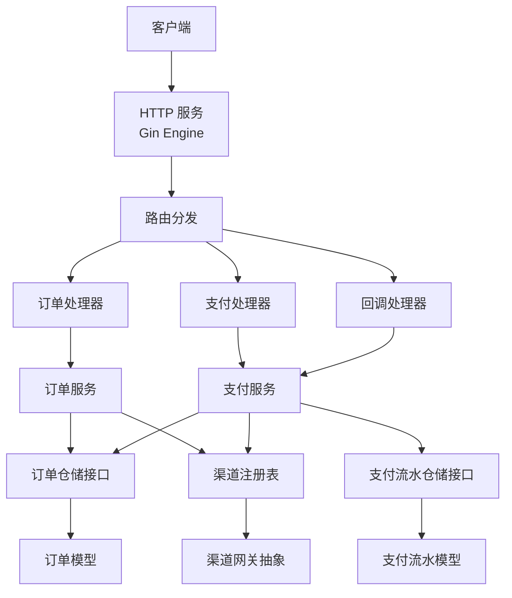
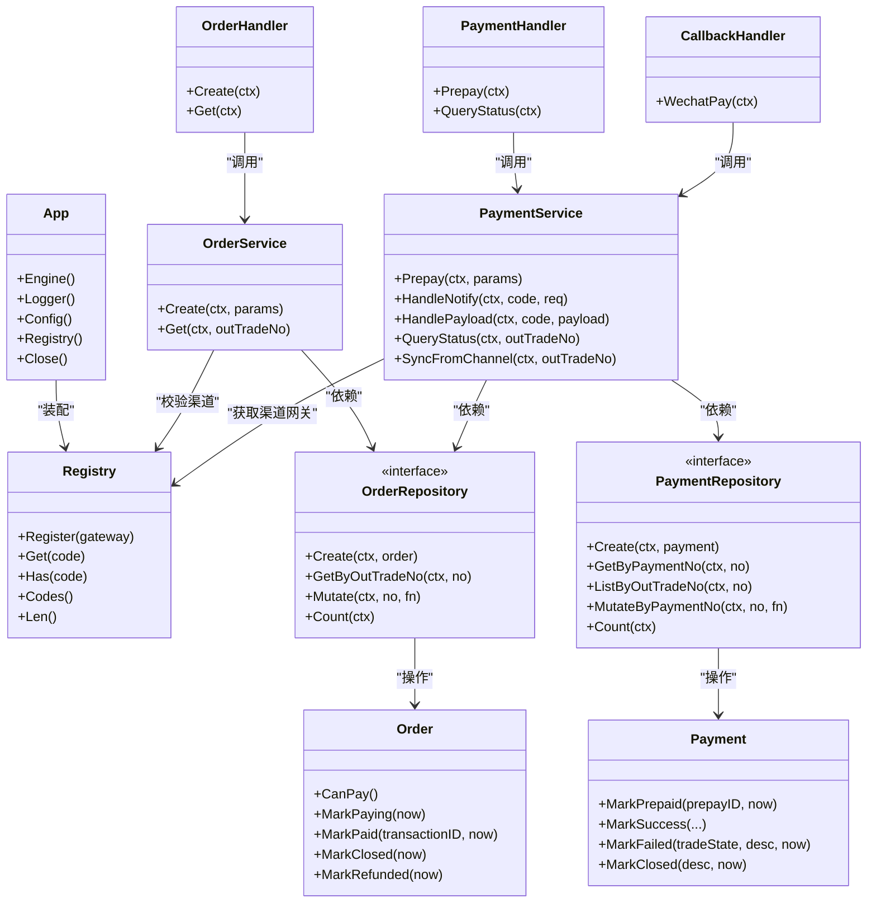
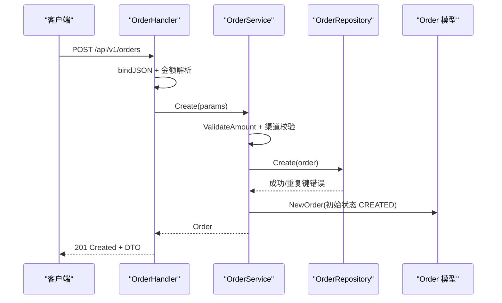
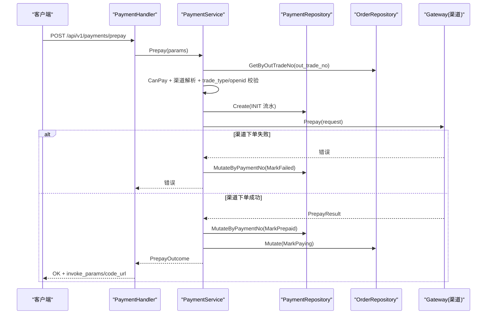
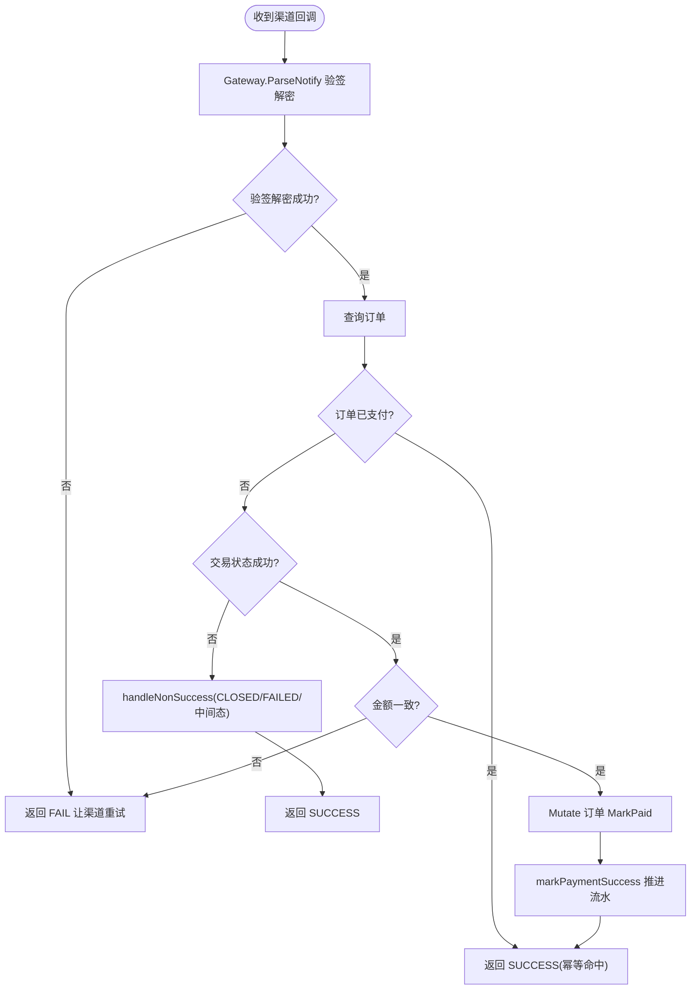
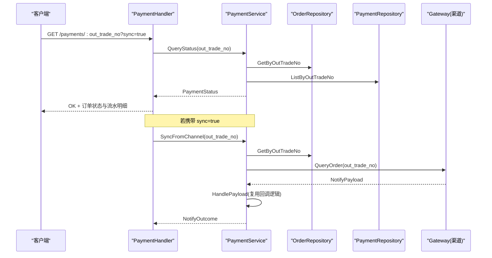
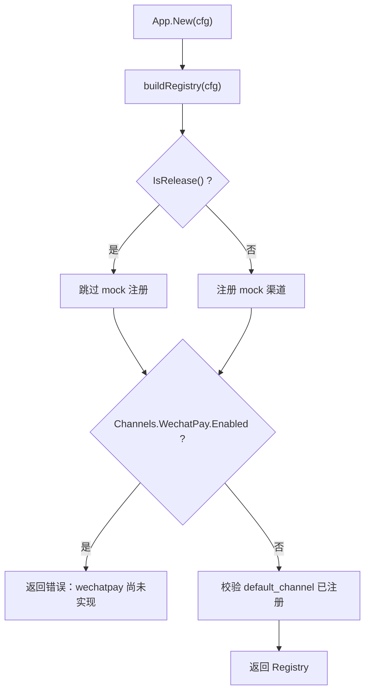
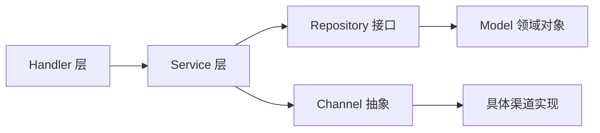

# 组件交互关系

<cite>
**本文引用的文件**   
- [cmd/server/main.go](file://cmd/server/main.go)
- [internal/app/app.go](file://internal/app/app.go)
- [internal/channel/registry.go](file://internal/channel/registry.go)
- [internal/handler/handler.go](file://internal/handler/handler.go)
- [internal/handler/order_handler.go](file://internal/handler/order_handler.go)
- [internal/handler/payment_handler.go](file://internal/handler/payment_handler.go)
- [internal/handler/callback_handler.go](file://internal/handler/callback_handler.go)
- [internal/service/order_service.go](file://internal/service/order_service.go)
- [internal/service/payment_service.go](file://internal/service/payment_service.go)
- [internal/repository/repository.go](file://internal/repository/repository.go)
- [internal/repository/memory_payment.go](file://internal/repository/memory_payment.go)
- [internal/model/order.go](file://internal/model/order.go)
- [internal/model/payment.go](file://internal/model/payment.go)
- [internal/dto/payment.go](file://internal/dto/payment.go)
- [internal/errcode/errcode.go](file://internal/errcode/errcode.go)
- [internal/pkg/money/money.go](file://internal/pkg/money/money.go)
- [internal/pkg/idgen/idgen.go](file://internal/pkg/idgen/idgen.go)
</cite>

## 目录
1. [引言](#引言)
2. [项目结构](#项目结构)
3. [核心组件](#核心组件)
4. [架构总览](#架构总览)
5. [详细组件分析](#详细组件分析)
6. [依赖分析](#依赖分析)
7. [性能考虑](#性能考虑)
8. [故障排查指南](#故障排查指南)
9. [结论](#结论)

## 引言
本文面向支付服务开发者，系统化梳理从客户端请求到最终状态更新的完整数据流，重点说明：
- HTTP 请求如何经 Handler 解析、Service 业务处理、Repository 数据操作；
- 支付渠道回调的反向流程与幂等性保证；
- App 作为装配中心如何协调各组件生命周期；
- Channel Registry 如何管理支付渠道的注册与查找；
- 订单创建、支付发起、回调处理三大关键流程中的组件协作。

## 项目结构
本项目采用分层与按职责组织相结合的结构：
- cmd/server：进程入口，负责启动参数、配置加载、HTTP 服务与优雅关闭；
- internal/app：应用装配中心，串联配置、日志、渠道注册、仓储、服务、Handler 与路由；
- internal/handler：HTTP 接入层，负责参数绑定、校验、DTO 转换与统一响应；
- internal/service：业务逻辑层，封装订单与支付的核心规则；
- internal/repository：存储接口与内存实现，提供原子 Mutate 能力；
- internal/model：领域模型与状态机，集中定义订单与流水的状态流转；
- internal/channel：渠道抽象与注册表，屏蔽具体渠道差异；
- internal/dto：对外请求与响应结构；
- internal/errcode：统一错误码与 HTTP 状态映射；
- internal/pkg：金额、ID 生成、日志等通用工具。

**图表来源**
- [internal/app/app.go:85-95](file://internal/app/app.go#L85-L95)
- [internal/handler/order_handler.go:23-60](file://internal/handler/order_handler.go#L23-L60)
- [internal/handler/payment_handler.go:26-51](file://internal/handler/payment_handler.go#L26-L51)
- [internal/handler/callback_handler.go:44-86](file://internal/handler/callback_handler.go#L44-L86)
- [internal/service/order_service.go:67-110](file://internal/service/order_service.go#L67-L110)
- [internal/service/payment_service.go:99-226](file://internal/service/payment_service.go#L99-L226)
- [internal/repository/repository.go:27-64](file://internal/repository/repository.go#L27-L64)
- [internal/model/order.go:73-125](file://internal/model/order.go#L73-L125)
- [internal/model/payment.go:54-104](file://internal/model/payment.go#L54-L104)

**章节来源**
- [cmd/server/main.go:31-124](file://cmd/server/main.go#L31-L124)
- [internal/app/app.go:39-106](file://internal/app/app.go#L39-L106)

## 核心组件
- 进程入口与生命周期：main 负责解析配置、初始化 App、启动 HTTP 服务、监听退出信号并优雅关闭，确保支付回调不被硬切断。
- 应用装配中心 App：唯一组装点，按配置构建日志、渠道注册表、仓储、服务、Handler 与路由，并在 release 模式下禁用 mock 调试路由。
- 渠道注册表 Registry：并发安全的渠道注册与查找，重复注册直接报错，未注册返回明确错误码，支持列出已注册渠道编码。
- HTTP 接入层 Handler：统一 JSON 绑定与校验、路径参数校验、金额解析错误分类、统一响应封装；回调处理器遵循渠道应答规范。
- 业务服务 Service：OrderService 负责订单创建与查询；PaymentService 负责发起支付、处理回调、查询状态与主动查单兜底。
- 存储层 Repository：定义 OrderRepository 与 PaymentRepository 接口，提供 Mutate/MutateByPaymentNo 原子更新能力，内存实现使用互斥锁与副本语义。
- 领域模型 Model：Order 与 Payment 各自维护状态机，禁止外部直接赋值 Status，所有变更通过 Mark* 方法完成。
- 工具与契约：errcode 统一错误码与 HTTP 状态映射；money 严格元分转换；idgen 生成合规的业务 ID。

**章节来源**
- [internal/app/app.go:39-106](file://internal/app/app.go#L39-L106)
- [internal/channel/registry.go:11-106](file://internal/channel/registry.go#L11-L106)
- [internal/handler/handler.go:29-155](file://internal/handler/handler.go#L29-L155)
- [internal/handler/callback_handler.go:14-86](file://internal/handler/callback_handler.go#L14-L86)
- [internal/service/order_service.go:21-125](file://internal/service/order_service.go#L21-L125)
- [internal/service/payment_service.go:34-583](file://internal/service/payment_service.go#L34-L583)
- [internal/repository/repository.go:1-90](file://internal/repository/repository.go#L1-L90)
- [internal/model/order.go:20-184](file://internal/model/order.go#L20-L184)
- [internal/model/payment.go:10-160](file://internal/model/payment.go#L10-L160)
- [internal/errcode/errcode.go:1-158](file://internal/errcode/errcode.go#L1-L158)
- [internal/pkg/money/money.go:1-152](file://internal/pkg/money/money.go#L1-L152)
- [internal/pkg/idgen/idgen.go:1-121](file://internal/pkg/idgen/idgen.go#L1-L121)

## 架构总览
下图展示系统运行时主要组件及其交互关系，包括 HTTP 接入、业务服务、存储接口、渠道抽象与领域模型。

**图表来源**
- [internal/app/app.go:31-106](file://internal/app/app.go#L31-L106)
- [internal/channel/registry.go:21-106](file://internal/channel/registry.go#L21-L106)
- [internal/handler/order_handler.go:13-79](file://internal/handler/order_handler.go#L13-L79)
- [internal/handler/payment_handler.go:16-119](file://internal/handler/payment_handler.go#L16-L119)
- [internal/handler/callback_handler.go:34-86](file://internal/handler/callback_handler.go#L34-L86)
- [internal/service/order_service.go:21-125](file://internal/service/order_service.go#L21-L125)
- [internal/service/payment_service.go:34-583](file://internal/service/payment_service.go#L34-L583)
- [internal/repository/repository.go:27-64](file://internal/repository/repository.go#L27-L64)
- [internal/model/order.go:73-184](file://internal/model/order.go#L73-L184)
- [internal/model/payment.go:54-160](file://internal/model/payment.go#L54-L160)

## 详细组件分析

### 订单创建流程：OrderHandler → OrderService → OrderRepository
- 入参解析与校验：Handler 使用统一 JSON 绑定与 validator 校验，区分空体、语法错误与字段校验失败，金额在接入层转换为「分」，避免业务层感知 HTTP。
- 业务规则：OrderService.Create 校验金额、确定渠道（默认渠道或请求指定）、检查渠道是否注册、生成商户订单号、构造 Order 并落库。
- 幂等与异常：仓储 Create 若主键冲突会返回专用错误类型，Service 记录告警并返回内部错误；Model 状态机确保初始状态为 CREATED。

**图表来源**
- [internal/handler/order_handler.go:23-60](file://internal/handler/order_handler.go#L23-L60)
- [internal/service/order_service.go:67-110](file://internal/service/order_service.go#L67-L110)
- [internal/model/order.go:104-125](file://internal/model/order.go#L104-L125)
- [internal/repository/repository.go:27-44](file://internal/repository/repository.go#L27-L44)

**章节来源**
- [internal/handler/handler.go:29-155](file://internal/handler/handler.go#L29-L155)
- [internal/handler/order_handler.go:23-60](file://internal/handler/order_handler.go#L23-L60)
- [internal/service/order_service.go:67-110](file://internal/service/order_service.go#L67-L110)
- [internal/model/order.go:104-125](file://internal/model/order.go#L104-L125)
- [internal/repository/repository.go:27-44](file://internal/repository/repository.go#L27-L44)

### 支付发起流程：PaymentHandler → PaymentService → Channel Registry → Gateway
- 前置校验：Handler 解析 PrepayRequest，Service 校验订单可支付、以订单上记录的渠道为准、trade_type 与 openid 校验。
- 流水创建与渠道下单：Service 生成 payment_no，创建 INIT 流水，调用 gateway.Prepay；失败时标记流水 FAILED，成功则推进流水 PREPAID 与订单 PAYING。
- 并发保护：若渠道下单期间回调已将订单置为 PAID，Service 拒绝回退至 PAYING，并返回明确错误。

**图表来源**
- [internal/handler/payment_handler.go:26-51](file://internal/handler/payment_handler.go#L26-L51)
- [internal/service/payment_service.go:99-226](file://internal/service/payment_service.go#L99-L226)
- [internal/repository/memory_payment.go:92-113](file://internal/repository/memory_payment.go#L92-L113)

**章节来源**
- [internal/handler/payment_handler.go:26-51](file://internal/handler/payment_handler.go#L26-L51)
- [internal/service/payment_service.go:99-226](file://internal/service/payment_service.go#L99-L226)
- [internal/repository/memory_payment.go:92-113](file://internal/repository/memory_payment.go#L92-L113)

### 回调处理流程：CallbackHandler → PaymentService.HandleNotify → HandlePayload
- 渠道应答规范：回调处理器必须返回渠道约定的 SUCCESS/FAIL 格式，不能走统一响应体，否则渠道会持续重试。
- 验签与解密：Service 委托 Gateway.ParseNotify 完成，验签失败原样返回错误，便于上层区分安全事件。
- 幂等与金额校验：若订单已支付立即幂等返回；非成功状态分别处理 CLOSED/PAY_ERROR/中间态；成功回调先校验金额再推进订单与流水。
- 并发保护：在 Mutate 内再次判断 IsPaid，防止并发回调重复推进；流水推进失败仅记日志，不阻断回调应答。

**图表来源**
- [internal/handler/callback_handler.go:44-86](file://internal/handler/callback_handler.go#L44-L86)
- [internal/service/payment_service.go:258-379](file://internal/service/payment_service.go#L258-L379)
- [internal/service/payment_service.go:381-453](file://internal/service/payment_service.go#L381-L453)

**章节来源**
- [internal/handler/callback_handler.go:44-86](file://internal/handler/callback_handler.go#L44-L86)
- [internal/service/payment_service.go:258-379](file://internal/service/payment_service.go#L258-L379)
- [internal/service/payment_service.go:381-453](file://internal/service/payment_service.go#L381-L453)

### 查询与同步：PaymentHandler.QueryStatus 与 SyncFromChannel
- QueryStatus：默认只读本地数据，避免高频轮询触发渠道限流；可选 sync=true 强制与渠道对齐。
- SyncFromChannel：对 PAYING 且长时间未终结的订单进行兜底同步，复用 HandlePayload 保证与回调一致的结论。

**图表来源**
- [internal/handler/payment_handler.go:53-85](file://internal/handler/payment_handler.go#L53-L85)
- [internal/service/payment_service.go:528-582](file://internal/service/payment_service.go#L528-L582)

**章节来源**
- [internal/handler/payment_handler.go:53-85](file://internal/handler/payment_handler.go#L53-L85)
- [internal/service/payment_service.go:528-582](file://internal/service/payment_service.go#L528-L582)

### App 装配与 Channel Registry 管理
- App.New：按配置构建日志、渠道注册表、内存仓储、OrderService 与 PaymentService，并注入到 Handler 与路由中；release 模式禁用 mock 路由。
- buildRegistry：根据配置启用 mock/wechatpay 渠道；默认渠道必须可用，否则启动失败；生产环境未实现微信支付时会给出明确提示。
- Registry：并发安全的注册与查找，重复注册直接报错，未注册返回 ErrChannelNotRegistered；Codes 排序输出稳定，便于健康检查与日志 diff。

**图表来源**
- [internal/app/app.go:108-152](file://internal/app/app.go#L108-L152)
- [internal/channel/registry.go:31-106](file://internal/channel/registry.go#L31-L106)

**章节来源**
- [internal/app/app.go:39-152](file://internal/app/app.go#L39-L152)
- [internal/channel/registry.go:11-106](file://internal/channel/registry.go#L11-L106)

## 依赖分析
- 耦合与内聚：
  - Handler 仅依赖 Service 与 DTO，不感知存储与渠道细节；
  - Service 依赖 Repository 接口与 Channel 抽象，不感知 HTTP 与具体 SDK；
  - Repository 仅依赖 Model 接口与 errcode，隔离存储实现；
  - Model 自包含状态机，禁止外部直接修改状态。
- 外部依赖与集成点：
  - Gin 作为 HTTP 框架；
  - zap 作为日志；
  - 渠道网关通过 Registry 动态获取，当前骨架含 mock 与待实现的 wechatpay。

**图表来源**
- [internal/handler/handler.go:1-24](file://internal/handler/handler.go#L1-L24)
- [internal/service/order_service.go:1-19](file://internal/service/order_service.go#L1-L19)
- [internal/service/payment_service.go:1-16](file://internal/service/payment_service.go#L1-L16)
- [internal/repository/repository.go:1-19](file://internal/repository/repository.go#L1-L19)
- [internal/model/order.go:1-7](file://internal/model/order.go#L1-L7)

**章节来源**
- [internal/handler/handler.go:1-24](file://internal/handler/handler.go#L1-L24)
- [internal/service/order_service.go:1-19](file://internal/service/order_service.go#L1-L19)
- [internal/service/payment_service.go:1-16](file://internal/service/payment_service.go#L1-L16)
- [internal/repository/repository.go:1-19](file://internal/repository/repository.go#L1-L19)
- [internal/model/order.go:1-7](file://internal/model/order.go#L1-L7)

## 性能考虑
- 查询接口默认只读本地数据，避免频繁调用渠道触发限流；仅在必要时通过 sync 参数主动查单。
- 回调处理优先快速幂等返回，减少不必要的数据库写放大。
- 流水列表按创建时间稳定排序，避免不确定顺序导致的业务误判。
- 金额计算全程使用整数与 big.Int，避免浮点精度损失与溢出风险。

[本节为通用指导，不直接分析具体文件]

## 故障排查指南
- 回调反复重试：确认回调处理器返回的是渠道约定的 SUCCESS/FAIL 格式，而非统一响应体；验签失败需原样返回错误以便上层告警。
- 金额不一致：HandlePayload 在推进状态前进行金额校验，不一致直接拒绝并返回错误码，需人工核对订单与回调报文。
- 订单状态无法推进：检查 Model 状态机允许的流转；确认 Mutate 回调内无 IO 阻塞导致事务放大抖动。
- 渠道未注册：Registry.Get 返回 ErrChannelNotRegistered，检查 app.buildRegistry 是否正确注册默认渠道。
- 流水找不到：pickPayment 按 transaction_id 精确匹配 > 最新未终结流水 > 最后一条流水；若无匹配将返回 ErrPaymentNotFound。

**章节来源**
- [internal/handler/callback_handler.go:14-86](file://internal/handler/callback_handler.go#L14-L86)
- [internal/service/payment_service.go:320-379](file://internal/service/payment_service.go#L320-L379)
- [internal/model/order.go:155-170](file://internal/model/order.go#L155-L170)
- [internal/channel/registry.go:63-74](file://internal/channel/registry.go#L63-L74)
- [internal/service/payment_service.go:455-486](file://internal/service/payment_service.go#L455-L486)

## 结论
本支付服务通过清晰的层次划分与严格的领域模型约束，实现了从 HTTP 接入到渠道回调的完整闭环：
- App 作为装配中心统一管理依赖与生命周期；
- Registry 提供运行期渠道管理能力；
- Handler 专注协议与契约，Service 承载业务规则，Repository 保障数据一致性；
- 订单创建、支付发起、回调处理三大流程均具备明确的幂等与并发保护机制；
- 查询与同步双通道确保掉单兜底能力。

这套设计既便于扩展新渠道与替换存储实现，也便于测试覆盖与问题定位，是支付类系统的稳健基础。