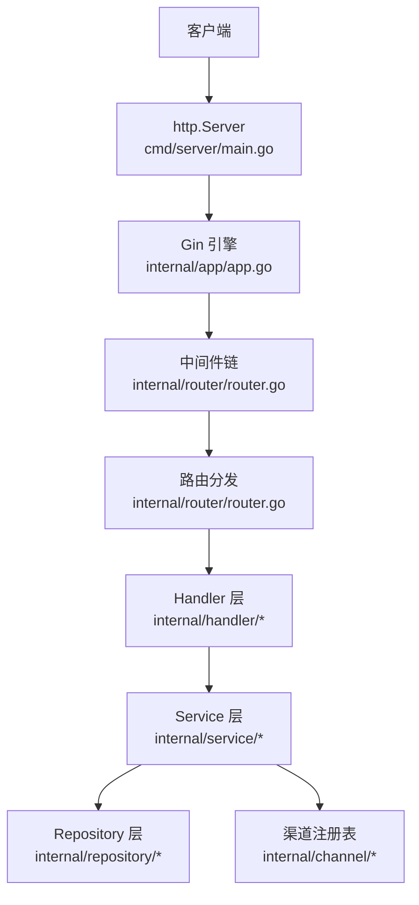
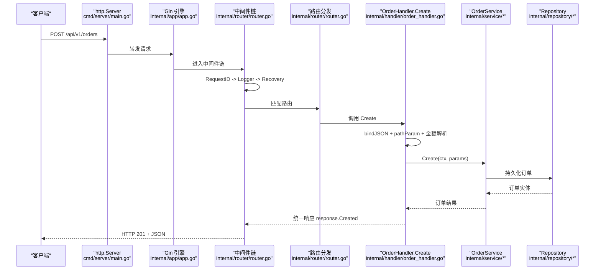
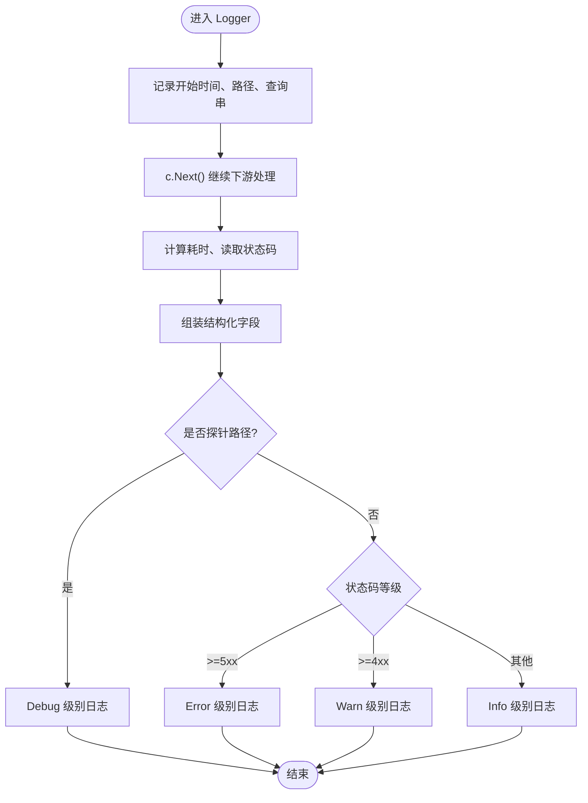
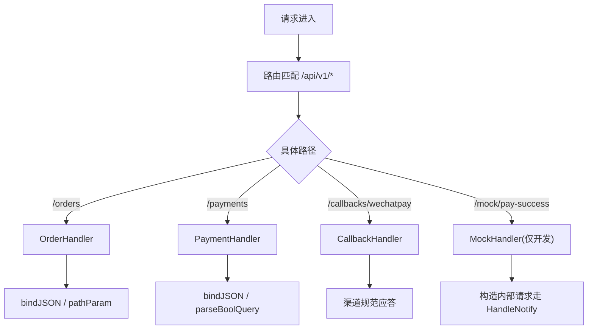
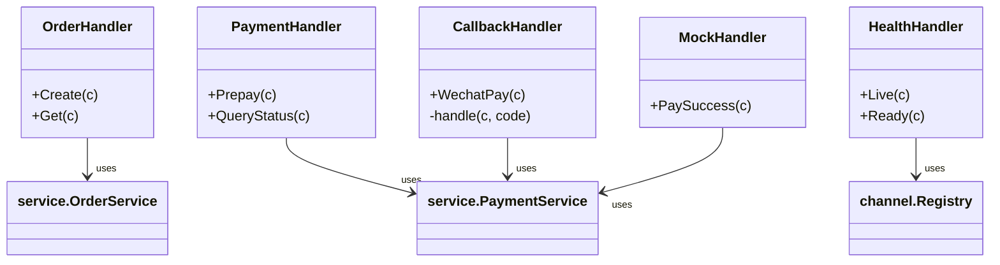
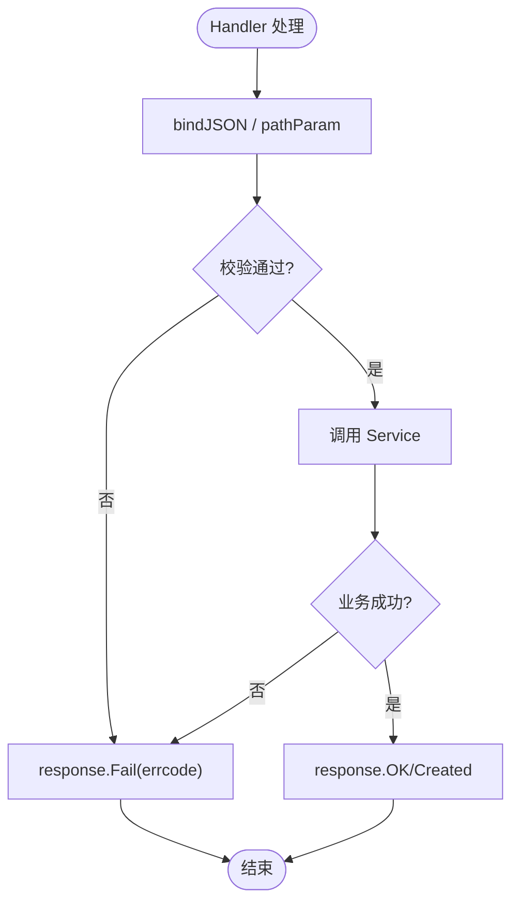
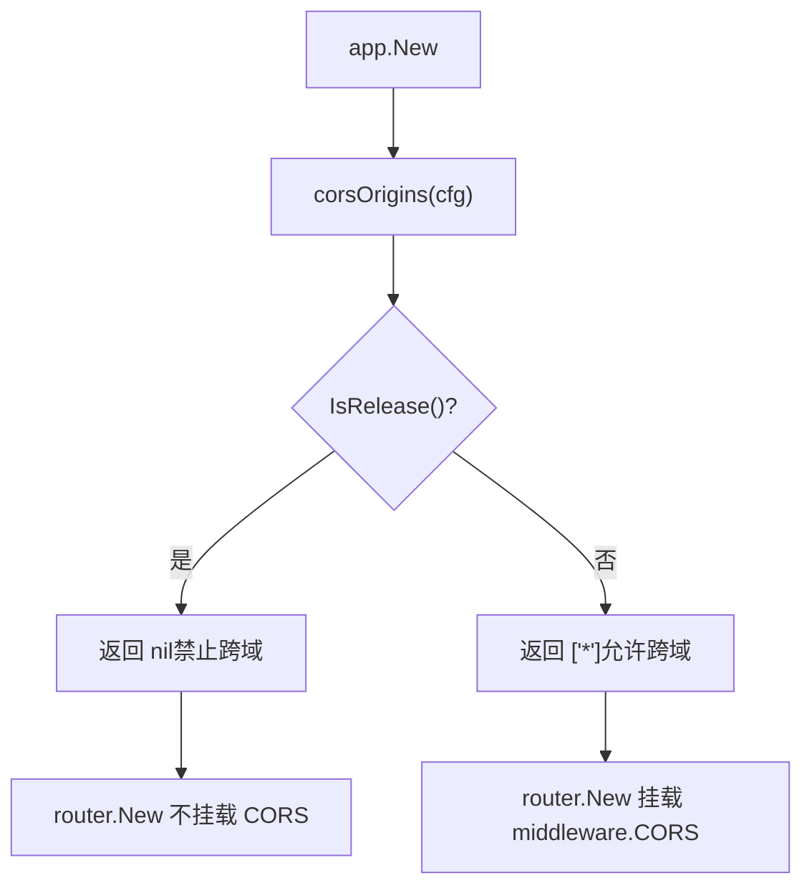
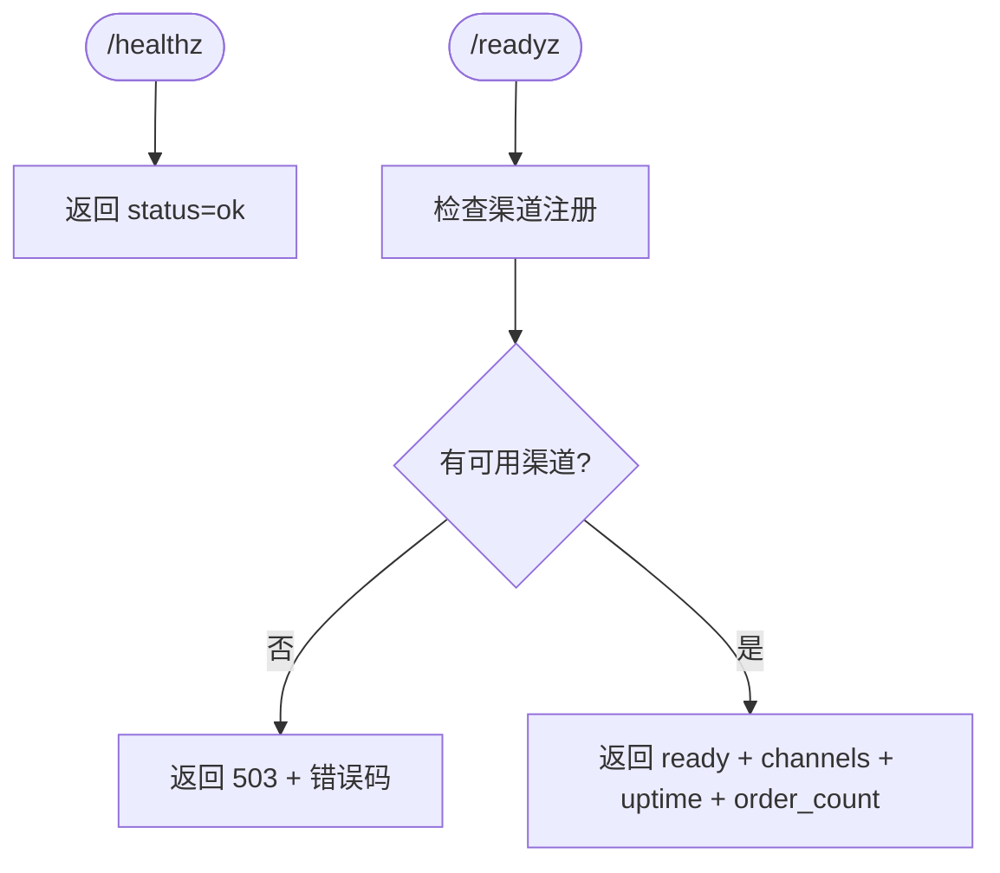
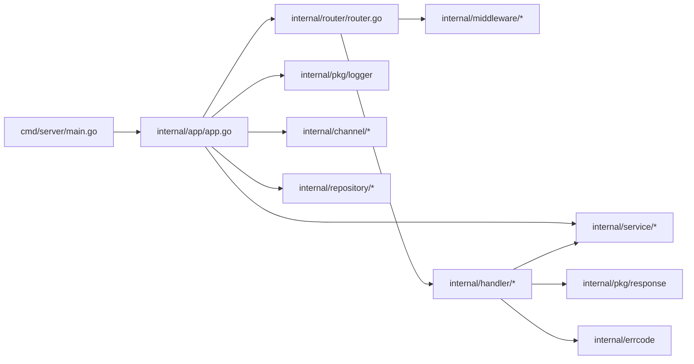

# 请求生命周期

<cite>
**本文引用的文件**   
- [cmd/server/main.go](file://cmd/server/main.go)
- [internal/app/app.go](file://internal/app/app.go)
- [internal/router/router.go](file://internal/router/router.go)
- [internal/middleware/logger.go](file://internal/middleware/logger.go)
- [internal/handler/handler.go](file://internal/handler/handler.go)
- [internal/handler/order_handler.go](file://internal/handler/order_handler.go)
- [internal/handler/payment_handler.go](file://internal/handler/payment_handler.go)
- [internal/handler/callback_handler.go](file://internal/handler/callback_handler.go)
- [internal/handler/health.go](file://internal/handler/health.go)
- [internal/handler/mock_trigger.go](file://internal/handler/mock_trigger.go)
</cite>

## 目录
1. [引言](#引言)
2. [项目结构](#项目结构)
3. [核心组件](#核心组件)
4. [架构总览](#架构总览)
5. [详细组件分析](#详细组件分析)
6. [依赖关系分析](#依赖关系分析)
7. [性能与可观测性](#性能与可观测性)
8. [故障排查指南](#故障排查指南)
9. [结论](#结论)

## 引言
本文面向支付服务的 HTTP 请求生命周期，说明从请求进入 Gin 引擎到返回响应的完整处理流程。重点覆盖：
- 中间件链执行顺序与日志中间件的拦截逻辑
- 路由注册机制与 URL 参数绑定
- Handler 层的参数校验、业务调用与响应格式化
- 错误处理机制与统一响应格式
- CORS 与安全头横切关注点
- 请求时序图、调试技巧与性能注意事项

## 项目结构
本项目采用分层组织：
- cmd/server：进程入口，负责配置加载、应用装配、HTTP Server 启动与优雅关闭
- internal/app：依赖装配与应用生命周期
- internal/router：Gin 引擎初始化、中间件挂载与路由注册
- internal/middleware：访问日志、请求 ID、恢复等横切能力
- internal/handler：HTTP 接入层，负责参数解析、校验、DTO 转换与响应封装
- internal/service：业务服务层
- internal/repository：数据持久化接口与实现
- internal/channel：渠道抽象与注册表
- internal/pkg/response：统一响应体封装
- internal/errcode：错误码定义与 HTTP 状态映射

**图表来源**
- [cmd/server/main.go:61-87](file://cmd/server/main.go#L61-L87)
- [internal/app/app.go:85-95](file://internal/app/app.go#L85-L95)
- [internal/router/router.go:50-84](file://internal/router/router.go#L50-L84)

**章节来源**
- [cmd/server/main.go:31-124](file://cmd/server/main.go#L31-L124)
- [internal/app/app.go:39-106](file://internal/app/app.go#L39-L106)
- [internal/router/router.go:1-84](file://internal/router/router.go#L1-L84)

## 核心组件
- 进程入口：负责解析命令行参数、加载配置、构造 App、启动 http.Server、监听退出信号并优雅关闭
- 应用装配：创建日志、渠道注册表、仓储、服务、Handler，并构建 Gin 引擎
- 路由与中间件：集中注册 API 前缀、健康检查、业务路由、Mock 路由；挂载 RequestID、Logger、Recovery、CORS
- Handler 层：JSON 绑定与校验、路径参数校验、金额解析、业务调用、统一响应封装
- 回调处理：按渠道规范应答，区分资金安全类错误与其他错误
- 健康检查：Live 仅判断进程存活，Ready 判断渠道可用性与统计信息

**章节来源**
- [cmd/server/main.go:31-124](file://cmd/server/main.go#L31-L124)
- [internal/app/app.go:39-106](file://internal/app/app.go#L39-L106)
- [internal/router/router.go:50-121](file://internal/router/router.go#L50-L121)
- [internal/handler/handler.go:29-156](file://internal/handler/handler.go#L29-L156)
- [internal/handler/callback_handler.go:44-86](file://internal/handler/callback_handler.go#L44-L86)
- [internal/handler/health.go:36-78](file://internal/handler/health.go#L36-L78)

## 架构总览
下图展示一次典型订单创建请求的端到端流程：从 http.Server 接收请求，经过 Gin 中间件链，路由匹配到 OrderHandler.Create，完成参数校验、业务调用与响应封装。

**图表来源**
- [cmd/server/main.go:61-87](file://cmd/server/main.go#L61-L87)
- [internal/app/app.go:85-95](file://internal/app/app.go#L85-L95)
- [internal/router/router.go:50-84](file://internal/router/router.go#L50-L84)
- [internal/handler/order_handler.go:23-60](file://internal/handler/order_handler.go#L23-L60)

## 详细组件分析

### 中间件链与日志中间件
- 中间件顺序：RequestID → Logger → Recovery。该顺序保证：
  - RequestID 最先注入，后续所有日志可关联同一请求
  - Logger 在 Recovery 之前，能记录 panic 请求的状态码与耗时
  - Recovery 在最内层，捕获范围覆盖全部后续处理
- 日志中间件特性：
  - 结构化字段：状态码、方法、路径、耗时、客户端 IP、UA、查询串、路由模板、错误列表
  - 探针路径降级为 Debug 级别，避免淹没真实业务日志
  - 不记录请求体与响应体，遵循最小化原则，防止敏感信息与体积膨胀
  - 使用 c.FullPath() 记录路由模板而非真实 URL，避免把业务标识写入日志导致聚合失效

**图表来源**
- [internal/middleware/logger.go:34-76](file://internal/middleware/logger.go#L34-L76)

**章节来源**
- [internal/router/router.go:54-73](file://internal/router/router.go#L54-L73)
- [internal/middleware/logger.go:13-89](file://internal/middleware/logger.go#L13-L89)

### 路由注册与 URL 参数绑定
- 路由前缀：/api/v1，便于版本演进与兼容
- 健康检查：/healthz、/readyz 独立于 API 前缀
- 业务路由：
  - /api/v1/orders：POST 创建订单、GET 查询订单
  - /api/v1/payments：POST 发起预支付、GET 查询支付状态
  - /api/v1/callbacks/wechatpay：微信支付回调
  - /api/v1/mock/pay-success：仅在非 release 模式启用
- URL 参数绑定：
  - 路径参数通过 pathParam 工具函数获取并校验非空
  - 查询参数通过 c.Query 解析，布尔值支持多种字符串形式
  - JSON 请求体通过 bindJSON 解析并进行结构化校验

**图表来源**
- [internal/router/router.go:91-121](file://internal/router/router.go#L91-L121)
- [internal/handler/handler.go:131-156](file://internal/handler/handler.go#L131-L156)
- [internal/handler/payment_handler.go:110-118](file://internal/handler/payment_handler.go#L110-L118)

**章节来源**
- [internal/router/router.go:15-121](file://internal/router/router.go#L15-L121)
- [internal/handler/handler.go:131-156](file://internal/handler/handler.go#L131-L156)

### Handler 层处理流程
- 参数校验：
  - JSON 解析失败或为空：返回 ErrBadRequest
  - 字段类型不匹配：返回 ErrBadRequest
  - 校验规则不通过：返回 ErrInvalidParam，附带可读中文提示
  - 路径参数为空：返回 ErrInvalidParam
  - 金额解析失败：返回 ErrOrderAmountInvalid，区分精度、格式、范围
- 业务调用：
  - OrderHandler.Create：将 DTO 转换为 Service 入参，调用 OrderService.Create
  - PaymentHandler.Prepay：调用 PaymentService.Prepay，返回前端调起支付所需参数
  - PaymentHandler.QueryStatus：默认只读本地数据，可选 sync=true 强制同步渠道状态
- 响应封装：
  - 成功：response.OK 或 response.Created
  - 失败：response.Fail，携带 errcode 与消息
  - 回调：不走统一响应体，按渠道规范返回 SUCCESS/FAIL

**图表来源**
- [internal/handler/order_handler.go:13-79](file://internal/handler/order_handler.go#L13-L79)
- [internal/handler/payment_handler.go:16-119](file://internal/handler/payment_handler.go#L16-L119)
- [internal/handler/callback_handler.go:34-86](file://internal/handler/callback_handler.go#L34-L86)
- [internal/handler/health.go:24-78](file://internal/handler/health.go#L24-L78)
- [internal/handler/mock_trigger.go:29-118](file://internal/handler/mock_trigger.go#L29-L118)

**章节来源**
- [internal/handler/handler.go:29-156](file://internal/handler/handler.go#L29-L156)
- [internal/handler/order_handler.go:23-79](file://internal/handler/order_handler.go#L23-L79)
- [internal/handler/payment_handler.go:26-119](file://internal/handler/payment_handler.go#L26-L119)
- [internal/handler/callback_handler.go:44-86](file://internal/handler/callback_handler.go#L44-L86)

### 错误处理与统一响应
- 错误分类：
  - 参数错误：ErrBadRequest、ErrInvalidParam
  - 金额错误：ErrOrderAmountInvalid（精度、格式、范围）
  - 渠道相关：ErrChannelNotRegistered、ErrChannelVerifyFailed
  - 金额不一致：ErrAmountMismatch（资金安全事件）
  - 内部错误：ErrInternal
- 统一响应：
  - 成功：response.OK / response.Created
  - 失败：response.Fail，携带错误码与消息
- 回调特殊处理：
  - 回调必须按渠道规范返回 {"code":"SUCCESS"/"FAIL","message":"..."}
  - 金额不一致与验签失败需告警人工介入
  - 幂等命中也返回 SUCCESS，避免渠道重复重试

**图表来源**
- [internal/handler/handler.go:37-55](file://internal/handler/handler.go#L37-L55)
- [internal/handler/order_handler.go:26-60](file://internal/handler/order_handler.go#L26-L60)
- [internal/handler/payment_handler.go:32-51](file://internal/handler/payment_handler.go#L32-L51)
- [internal/handler/callback_handler.go:55-86](file://internal/handler/callback_handler.go#L55-L86)

**章节来源**
- [internal/handler/handler.go:29-156](file://internal/handler/handler.go#L29-L156)
- [internal/handler/callback_handler.go:14-26](file://internal/handler/callback_handler.go#L14-L26)

### CORS 与安全头
- CORS：
  - 由 app.corsOrigins 控制：release 模式默认不开启跨域，debug 模式允许 "*"
  - router.New 中根据 CORSOrigins 决定是否挂载 middleware.CORS
- 安全头：
  - 代码未显式设置通用安全头（如 X-Content-Type-Options、X-Frame-Options），建议在生产环境通过中间件补充
  - 回调接口严格遵循渠道规范，避免被第三方平台判定为失败而重试

**图表来源**
- [internal/app/app.go:154-164](file://internal/app/app.go#L154-L164)
- [internal/router/router.go:71-73](file://internal/router/router.go#L71-L73)

**章节来源**
- [internal/app/app.go:154-164](file://internal/app/app.go#L154-L164)
- [internal/router/router.go:71-73](file://internal/router/router.go#L71-L73)

### 健康检查与探针
- Live：仅返回进程存活，不检查依赖，避免外部抖动引发级联重启
- Ready：检查渠道注册情况，若无可用渠道则返回 503，并附带渠道列表、运行时长与订单计数
- 探针路径在日志中间件中降级为 Debug，避免污染业务日志

**图表来源**
- [internal/handler/health.go:36-78](file://internal/handler/health.go#L36-L78)
- [internal/middleware/logger.go:17-20](file://internal/middleware/logger.go#L17-L20)

**章节来源**
- [internal/handler/health.go:36-78](file://internal/handler/health.go#L36-L78)
- [internal/middleware/logger.go:17-20](file://internal/middleware/logger.go#L17-L20)

## 依赖关系分析
- 进程入口依赖 app 装配与 config 配置
- app 依赖 logger、channel registry、repository、service、handler、router
- router 依赖 handler 与 middleware
- handler 依赖 service、dto、errcode、pkg/response、pkg/money
- callback 与 mock 属于特殊场景：回调按渠道规范应答，mock 用于开发联调

**图表来源**
- [cmd/server/main.go:21-23](file://cmd/server/main.go#L21-L23)
- [internal/app/app.go:14-29](file://internal/app/app.go#L14-L29)
- [internal/router/router.go:8-13](file://internal/router/router.go#L8-L13)
- [internal/handler/handler.go:12-24](file://internal/handler/handler.go#L12-L24)

**章节来源**
- [cmd/server/main.go:21-23](file://cmd/server/main.go#L21-L23)
- [internal/app/app.go:14-29](file://internal/app/app.go#L14-L29)
- [internal/router/router.go:8-13](file://internal/router/router.go#L8-L13)
- [internal/handler/handler.go:12-24](file://internal/handler/handler.go#L12-L24)

## 性能与可观测性
- 性能要点：
  - ReadHeaderTimeout 单独收紧，抵御慢速攻击
  - 日志中间件不记录请求体与响应体，降低 IO 压力
  - QueryStatus 默认只读本地数据，避免频繁触发渠道限流；sync=true 用于对齐
  - 健康检查 Live 不检查依赖，避免级联重启
- 可观测性：
  - 结构化日志字段包含 method、path、route、latency、client_ip、user_agent、query、errors
  - 探针路径降级为 Debug，避免日志噪声
  - 回调失败时区分资金安全类错误与普通错误，便于告警策略精细化

**章节来源**
- [cmd/server/main.go:25-29](file://cmd/server/main.go#L25-L29)
- [internal/middleware/logger.go:31-33](file://internal/middleware/logger.go#L31-L33)
- [internal/handler/payment_handler.go:53-85](file://internal/handler/payment_handler.go#L53-L85)
- [internal/handler/health.go:36-47](file://internal/handler/health.go#L36-L47)

## 故障排查指南
- 常见问题定位：
  - 400/422：检查 bindJSON 与 pathParam 的错误分类，确认客户端序列化与字段类型
  - 金额错误：查看 amountParseError 的分类，确认金额格式与精度
  - 回调重复：确认回调应答是否符合渠道规范，避免返回统一响应体
  - 渠道不可用：检查 Ready 探针返回的渠道列表与错误码
- 调试技巧：
  - 使用 /api/v1/mock/pay-success 模拟支付成功回调，验证 HandleNotify 链路
  - 观察日志中的 route 字段，确保聚合键稳定
  - 在 debug 模式下开启 CORS，便于前端联调

**章节来源**
- [internal/handler/handler.go:37-55](file://internal/handler/handler.go#L37-L55)
- [internal/handler/handler.go:140-156](file://internal/handler/handler.go#L140-L156)
- [internal/handler/callback_handler.go:55-86](file://internal/handler/callback_handler.go#L55-L86)
- [internal/handler/mock_trigger.go:43-118](file://internal/handler/mock_trigger.go#L43-L118)

## 结论
本项目的 HTTP 请求生命周期以 Gin 为核心，通过清晰的中间件链、集中的路由注册与严格的 Handler 层校验，实现了可观测、可扩展且安全的支付服务接入。日志中间件提供结构化字段与探针降级，错误处理区分参数、业务与资金安全类问题，回调接口严格遵循渠道规范。建议在 production 环境中补充安全头中间件，并结合监控指标对延迟、错误率与渠道可用性进行持续观测。