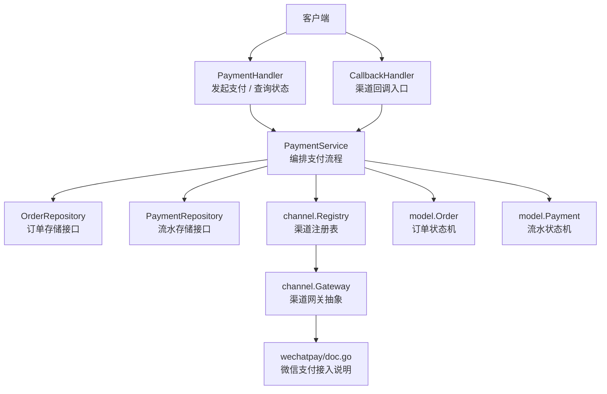
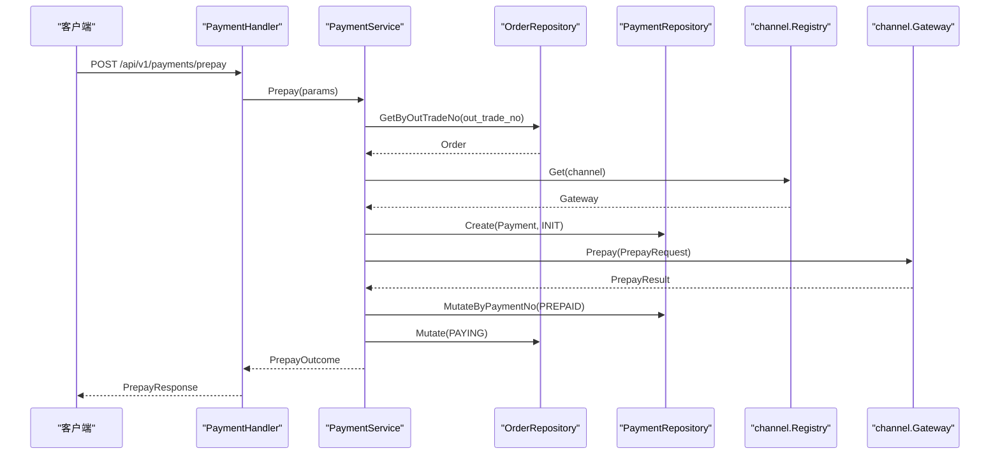
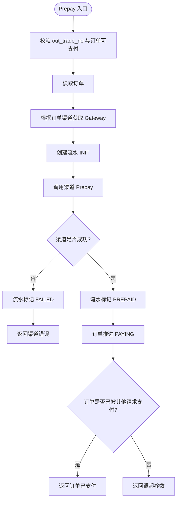
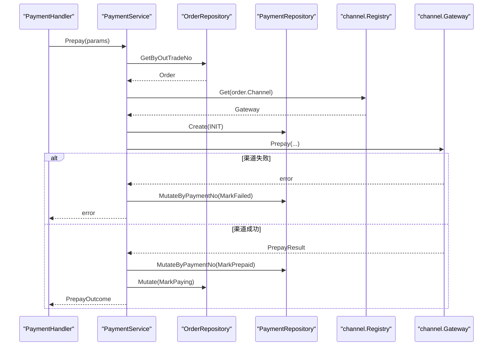
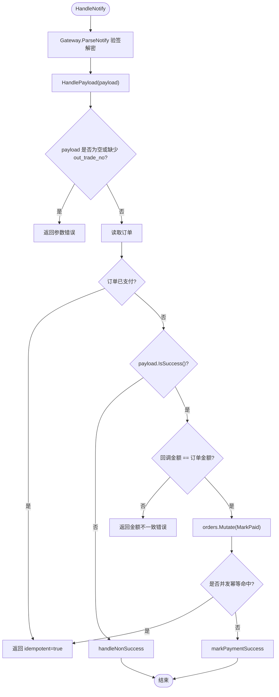
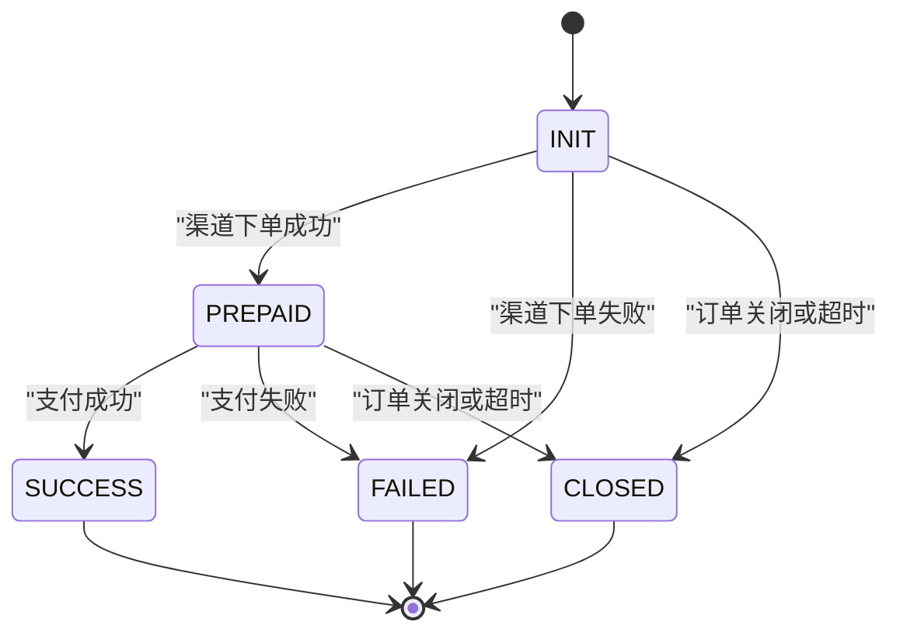
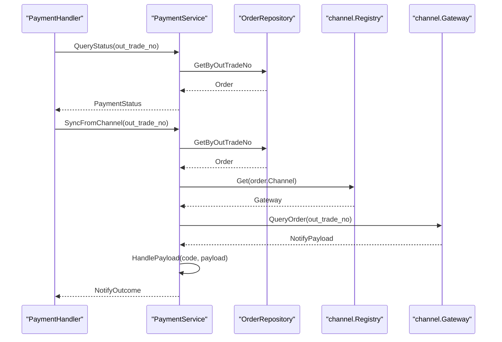
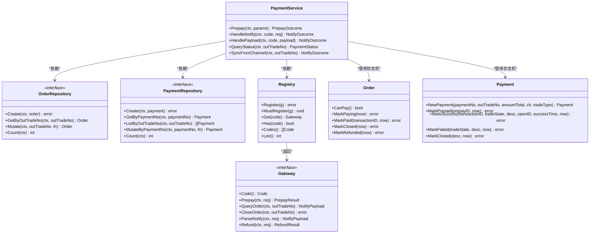

# 支付服务

<cite>
**本文引用的文件**   
- [payment_service.go](file://internal/service/payment_service.go)
- [payment_handler.go](file://internal/handler/payment_handler.go)
- [callback_handler.go](file://internal/handler/callback_handler.go)
- [order_handler.go](file://internal/handler/order_handler.go)
- [payment.go](file://internal/model/payment.go)
- [order.go](file://internal/model/order.go)
- [repository.go](file://internal/repository/repository.go)
- [memory_payment.go](file://internal/repository/memory_payment.go)
- [registry.go](file://internal/channel/registry.go)
- [doc.go](file://internal/channel/wechatpay/doc.go)
- [payment.go](file://internal/dto/payment.go)
- [errcode.go](file://internal/errcode/errcode.go)
- [README.md](file://README.md)
</cite>

## 目录
1. [引言](#引言)
2. [项目结构](#项目结构)
3. [核心组件](#核心组件)
4. [架构总览](#架构总览)
5. [详细组件分析](#详细组件分析)
6. [依赖关系分析](#依赖关系分析)
7. [性能与可靠性](#性能与可靠性)
8. [故障排查指南](#故障排查指南)
9. [结论](#结论)

## 引言
本文件面向支付服务的开发者与维护者，聚焦 PaymentService 的职责边界、支付发起流程、回调幂等机制、支付流水状态机以及查询与兜底查单能力。文档以代码仓库中的实际实现为依据，不虚构未实现的逻辑；对于尚未落地的微信支付真实对接，仅引用占位文档说明接入位置与安全要求。

## 项目结构
支付服务采用经典分层：HTTP Handler 负责请求解析与响应封装，Service 层编排业务，Model 层定义领域模型与状态机，Repository 层抽象存储，Channel 层抽象支付渠道。当前骨架使用内存仓储与 Mock 渠道跑通全链路，并预留微信支付接入点。

**图表来源**
- [payment_handler.go:26-85](file://internal/handler/payment_handler.go#L26-L85)
- [callback_handler.go:44-86](file://internal/handler/callback_handler.go#L44-L86)
- [payment_service.go:34-73](file://internal/service/payment_service.go#L34-L73)
- [registry.go:11-74](file://internal/channel/registry.go#L11-L74)
- [doc.go:1-105](file://internal/channel/wechatpay/doc.go#L1-L105)
- [order.go:20-50](file://internal/model/order.go#L20-L50)
- [payment.go:10-33](file://internal/model/payment.go#L10-L33)

**章节来源**
- [README.md:38-62](file://README.md#L38-L62)

## 核心组件
- PaymentService：支付业务编排中心，负责发起支付、处理渠道回调、查询状态、主动查单兜底。
- PaymentHandler：对外暴露发起支付与查询支付状态的 HTTP 接口。
- CallbackHandler：统一接收渠道异步回调，交由 PaymentService 处理。
- Model.Order / Model.Payment：订单与支付流水的领域模型及状态机。
- Repository.OrderRepository / PaymentRepository：订单与流水的存储接口，提供原子 Mutate 能力。
- channel.Registry / channel.Gateway：渠道注册与网关抽象，屏蔽具体渠道差异。
- DTO：对外请求与响应结构，与领域模型解耦。
- errcode：统一业务错误码与 HTTP 状态映射。

**章节来源**
- [payment_service.go:34-73](file://internal/service/payment_service.go#L34-L73)
- [payment_handler.go:16-51](file://internal/handler/payment_handler.go#L16-L51)
- [callback_handler.go:34-86](file://internal/handler/callback_handler.go#L34-L86)
- [order.go:73-102](file://internal/model/order.go#L73-L102)
- [payment.go:54-89](file://internal/model/payment.go#L54-L89)
- [repository.go:27-64](file://internal/repository/repository.go#L27-L64)
- [registry.go:11-74](file://internal/channel/registry.go#L11-L74)
- [payment.go](file://internal/dto/payment.go)
- [errcode.go:1-158](file://internal/errcode/errcode.go#L1-L158)

## 架构总览
PaymentService 是支付流程的编排者：它从 Handler 层接收请求，通过 Repository 层读写订单与流水，通过 Channel 层调用具体支付渠道，并通过 Model 层的状态机保证状态流转合法。

**图表来源**
- [payment_handler.go:32-51](file://internal/handler/payment_handler.go#L32-L51)
- [payment_service.go:108-226](file://internal/service/payment_service.go#L108-L226)
- [registry.go:63-74](file://internal/channel/registry.go#L63-L74)

## 详细组件分析

### PaymentService：支付编排与服务能力
PaymentService 承担以下职责：
- 发起支付：校验参数、读取订单、选择渠道、创建流水、调用渠道下单、更新流水为 PREPAID、推进订单到 PAYING。
- 处理回调：验签解密后进入统一处理路径，进行金额校验、并发幂等保护、订单与流水状态推进。
- 查询状态：只读本地数据，避免频繁调用渠道触发限流。
- 主动查单兜底：当回调丢失时，按渠道返回的交易状态复用 HandlePayload 逻辑，确保一致性。

关键设计要点：
- 预支付失败时，流水标记 FAILED，订单状态不动，允许用户重新发起。
- 渠道成功但本地订单状态推进失败时，仍返回调起参数，由回调与查单兜底，避免拒收资金。
- 回调中金额不一致直接拒绝，防止篡改或串单。
- 非终态通知（如 NOTPAY、USERPAYING）不做状态变更，避免误判。

**图表来源**
- [payment_service.go:108-226](file://internal/service/payment_service.go#L108-L226)

**章节来源**
- [payment_service.go:108-226](file://internal/service/payment_service.go#L108-L226)
- [payment_service.go:228-244](file://internal/service/payment_service.go#L228-L244)

### 发起支付的完整流程
发起支付的关键步骤如下：
1. 参数验证：out_trade_no 必填；JSAPI 交易必须提供 openid，否则提前拦截。
2. 订单校验：只有 CREATED 或 PAYING 的订单可支付；已支付、已关闭、已退款不可再次支付。
3. 渠道选择：以订单上记录的渠道为准，不允许同一订单在不同渠道间跳变。
4. 流水创建：生成 payment_no，写入流水记录，初始状态 INIT。
5. 渠道下单：构造 PrepayRequest，包含商户订单号、描述、金额、币种、附加信息、回调地址、交易类型、openid、客户端 IP。
6. 结果处理：
   - 渠道失败：流水标记 FAILED，记录日志，返回渠道错误。
   - 渠道成功：流水标记 PREPAID，尝试推进订单到 PAYING；若并发导致订单已支付，返回“订单已支付”；若本地推进失败，仍返回调起参数，让回调与查单兜底。

**图表来源**
- [payment_handler.go:32-51](file://internal/handler/payment_handler.go#L32-L51)
- [payment_service.go:108-226](file://internal/service/payment_service.go#L108-L226)

**章节来源**
- [payment_service.go:108-226](file://internal/service/payment_service.go#L108-L226)
- [payment_handler.go:32-51](file://internal/handler/payment_handler.go#L32-L51)

### 回调处理与幂等性保证
回调处理分为两条路径：
- HandleNotify：接收原始 http.Request，交由渠道 Gateway 完成验签与解密，再进入 HandlePayload。
- HandlePayload：统一处理交易状态，支持重复回调与重试场景下的幂等。

幂等性保证机制：
- 快速判断：若订单已是 PAID，直接返回 idempotent=true，让渠道停止重试。
- 并发保护：在 orders.Mutate 内部再次检查 IsPaid，命中则返回哨兵错误，表示被其他请求抢先处理。
- 金额校验：在推进状态前比较回调金额与订单金额，不一致直接拒绝，防止篡改或串单。
- 非终态通知：NOTPAY、USERPAYING、REFUND 等不做状态变更，避免误判。
- 流水匹配：优先按 transaction_id 精确匹配，其次取最新未终结流水，最后回退到最后一条流水。

**图表来源**
- [callback_handler.go:44-86](file://internal/handler/callback_handler.go#L44-L86)
- [payment_service.go:258-379](file://internal/service/payment_service.go#L258-L379)
- [payment_service.go:381-453](file://internal/service/payment_service.go#L381-L453)
- [payment_service.go:455-486](file://internal/service/payment_service.go#L455-L486)

**章节来源**
- [callback_handler.go:44-86](file://internal/handler/callback_handler.go#L44-L86)
- [payment_service.go:258-379](file://internal/service/payment_service.go#L258-L379)
- [payment_service.go:381-453](file://internal/service/payment_service.go#L381-L453)
- [payment_service.go:455-486](file://internal/service/payment_service.go#L455-L486)

### 支付流水状态机
支付流水的状态流转规则如下：
- INIT → PREPAID：渠道下单成功，拿到 prepay_id。
- INIT → FAILED：渠道下单失败。
- INIT → CLOSED：订单关闭或超时。
- PREPAID → SUCCESS：支付成功。
- PREPAID → FAILED：支付失败。
- PREPAID → CLOSED：订单关闭或超时。
- SUCCESS、FAILED、CLOSED 为终态，不再流转。

**图表来源**
- [payment.go:10-33](file://internal/model/payment.go#L10-L33)
- [payment.go:106-137](file://internal/model/payment.go#L106-L137)

**章节来源**
- [payment.go:10-33](file://internal/model/payment.go#L10-L33)
- [payment.go:106-137](file://internal/model/payment.go#L106-L137)

### 查询与主动查单兜底
- QueryStatus：只读本地数据，返回订单与全部流水，供前端轮询。不调用渠道接口，避免限流。
- SyncFromChannel：主动向渠道查单并同步本地状态，是掉单兜底的核心手段。若渠道侧查不到交易，视为正常情况（用户未支付），返回 NOTPAY。

**图表来源**
- [payment_handler.go:60-85](file://internal/handler/payment_handler.go#L60-L85)
- [payment_service.go:532-582](file://internal/service/payment_service.go#L532-L582)

**章节来源**
- [payment_handler.go:60-85](file://internal/handler/payment_handler.go#L60-L85)
- [payment_service.go:532-582](file://internal/service/payment_service.go#L532-L582)

### 关键场景的代码示例路径
- 发起支付：[payment_handler.go:32-51](file://internal/handler/payment_handler.go#L32-L51)，[payment_service.go:108-226](file://internal/service/payment_service.go#L108-L226)
- 状态查询：[payment_handler.go:60-85](file://internal/handler/payment_handler.go#L60-L85)，[payment_service.go:532-546](file://internal/service/payment_service.go#L532-L546)
- 回调处理：[callback_handler.go:44-86](file://internal/handler/callback_handler.go#L44-L86)，[payment_service.go:258-379](file://internal/service/payment_service.go#L258-L379)
- 主动查单兜底：[payment_service.go:548-582](file://internal/service/payment_service.go#L548-L582)
- 流水状态机：[payment.go:10-33](file://internal/model/payment.go#L10-L33)，[payment.go:106-137](file://internal/model/payment.go#L106-L137)

## 依赖关系分析
PaymentService 依赖以下组件：
- OrderRepository：订单读写与原子 Mutate。
- PaymentRepository：流水读写与原子 MutateByPaymentNo。
- channel.Registry：按编码获取 Gateway。
- channel.Gateway：渠道无关的下单、查单、关单、回调解析、退款接口。
- model.Order / model.Payment：领域状态机。

**图表来源**
- [payment_service.go:34-73](file://internal/service/payment_service.go#L34-L73)
- [repository.go:27-64](file://internal/repository/repository.go#L27-L64)
- [registry.go:11-74](file://internal/channel/registry.go#L11-L74)
- [order.go:122-153](file://internal/model/order.go#L122-L153)
- [payment.go:91-137](file://internal/model/payment.go#L91-L137)

**章节来源**
- [payment_service.go:34-73](file://internal/service/payment_service.go#L34-L73)
- [repository.go:27-64](file://internal/repository/repository.go#L27-L64)
- [registry.go:11-74](file://internal/channel/registry.go#L11-L74)
- [order.go:122-153](file://internal/model/order.go#L122-L153)
- [payment.go:91-137](file://internal/model/payment.go#L91-L137)

## 性能与可靠性
- 查询接口默认只读本地数据，避免频繁调用渠道触发限流；需要强制对齐时使用 sync=true 触发主动查单。
- 内存仓储使用互斥锁与副本替换策略，保证并发安全；数据库实现应使用 SELECT ... FOR UPDATE 事务保证原子性。
- 回调重试策略由渠道决定，服务层通过幂等与金额校验保证一致性；非终态通知不做状态变更，避免误判。
- 错误分类清晰：金额不一致与验签失败属于资金/安全事件，需告警人工介入；其余错误记 warn，避免刷屏掩盖真正告警。

**章节来源**
- [payment_handler.go:60-85](file://internal/handler/payment_handler.go#L60-L85)
- [repository.go:1-19](file://internal/repository/repository.go#L1-L19)
- [callback_handler.go:55-86](file://internal/handler/callback_handler.go#L55-L86)

## 故障排查指南
常见问题与定位建议：
- 重复回调导致订单重复支付：检查 HandlePayload 的幂等分支与并发保护；确认 orders.Mutate 内部再次检查 IsPaid。
- 回调金额不一致：检查 payload.AmountTotal 与 order.AmountTotal；该错误属于严重异常，需人工介入。
- 渠道下单失败但订单未推进：确认流水是否标记 FAILED；若本地订单推进失败，仍返回调起参数，由回调与查单兜底。
- 查询状态无流水：检查 pickPayment 的匹配优先级；若无 transaction_id，会取最新未终结流水或最后一条流水。
- 主动查单失败：若渠道返回“订单不存在”，视为正常情况；其他错误需记录日志并告警。

**章节来源**
- [payment_service.go:282-379](file://internal/service/payment_service.go#L282-L379)
- [payment_service.go:381-453](file://internal/service/payment_service.go#L381-L453)
- [payment_service.go:455-486](file://internal/service/payment_service.go#L455-L486)
- [payment_service.go:548-582](file://internal/service/payment_service.go#L548-L582)

## 结论
PaymentService 作为支付服务的编排核心，通过清晰的职责划分、严格的状态机约束、完善的幂等与金额校验机制，以及查询与主动查单兜底能力，确保了支付流程的正确性与可靠性。当前骨架以内存仓储与 Mock 渠道跑通全链路，并为微信支付接入预留了明确接缝与安全要求。生产环境应结合调度器实现定时兜底任务，并逐步替换为持久化存储与真实渠道实现。