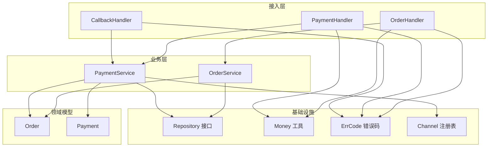
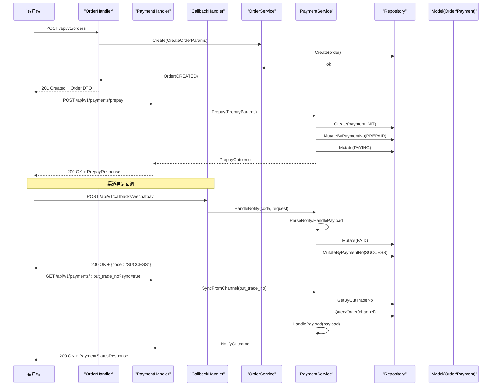
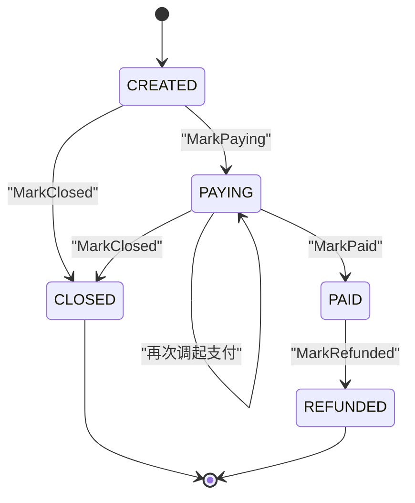
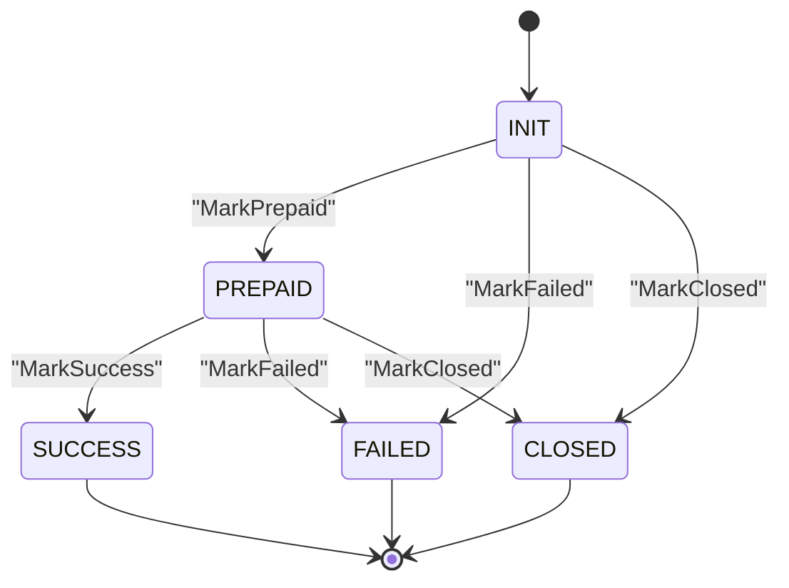
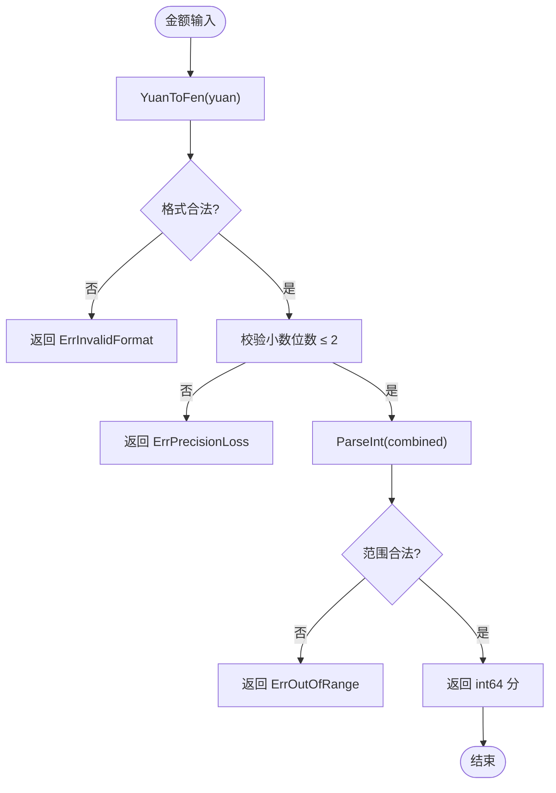
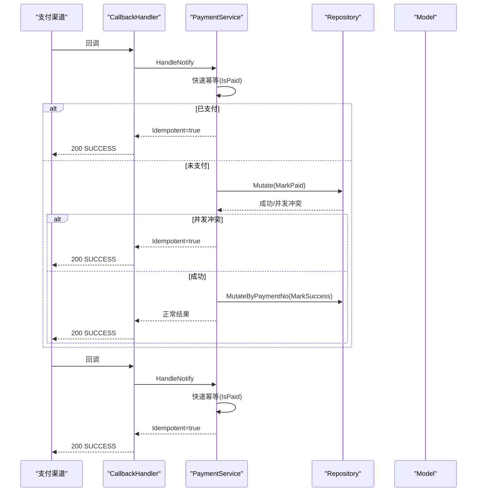
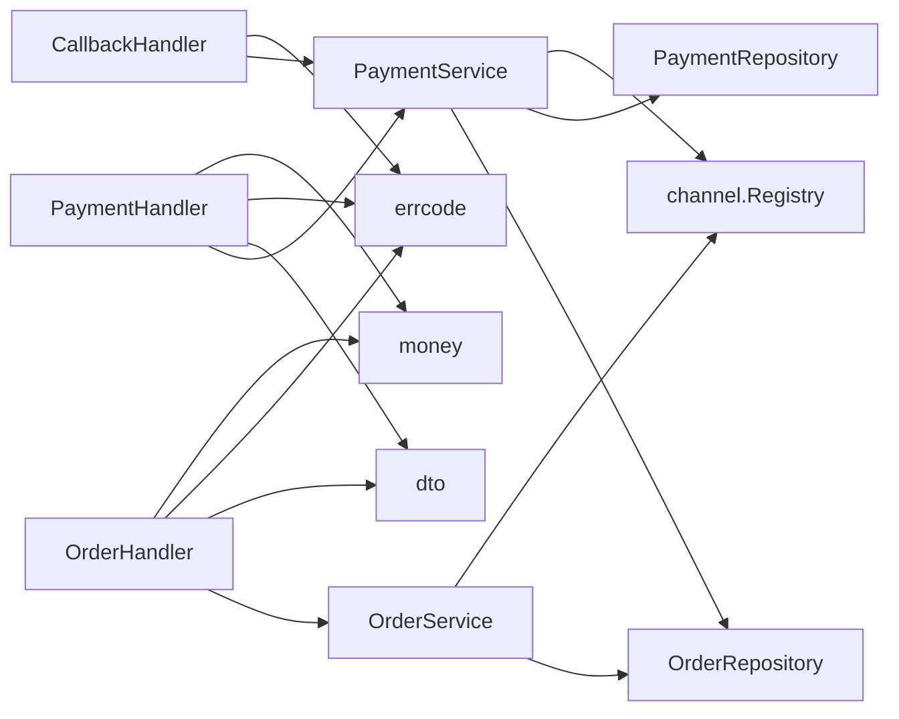

# 核心模块

<cite>
**本文引用的文件**   
- [internal/service/order_service.go](file://internal/service/order_service.go)
- [internal/service/payment_service.go](file://internal/service/payment_service.go)
- [internal/model/order.go](file://internal/model/order.go)
- [internal/model/payment.go](file://internal/model/payment.go)
- [internal/pkg/money/money.go](file://internal/pkg/money/money.go)
- [internal/handler/callback_handler.go](file://internal/handler/callback_handler.go)
- [internal/handler/order_handler.go](file://internal/handler/order_handler.go)
- [internal/handler/payment_handler.go](file://internal/handler/payment_handler.go)
- [internal/dto/payment.go](file://internal/dto/payment.go)
- [internal/errcode/errcode.go](file://internal/errcode/errcode.go)
- [internal/repository/repository.go](file://internal/repository/repository.go)
</cite>

## 目录
1. [引言](#引言)
2. [项目结构](#项目结构)
3. [核心组件](#核心组件)
4. [架构总览](#架构总览)
5. [详细组件分析](#详细组件分析)
6. [依赖关系分析](#依赖关系分析)
7. [性能与一致性考量](#性能与一致性考量)
8. [故障排查指南](#故障排查指南)
9. [结论](#结论)

## 引言
本文聚焦支付系统的核心业务模块，围绕订单与支付两条主线展开：
- OrderService 负责「创建订单」和「按商户订单号查询订单」，不直接发起渠道支付。
- PaymentService 负责「发起支付、处理渠道回调、查询状态、主动查单兜底」。
- 领域模型 Order 与 Payment 分别维护订单与流水的状态机，所有金额以 int64 表示「分」，对外响应同时提供 amount（元字符串）与 amount_fen（分整数），保证精度与可追溯性。
- 幂等性通过仓储层的原子 Mutate 接口、领域状态机校验、以及回调快速幂等分支共同实现，确保并发回调与重试场景下的状态一致。

## 项目结构
本项目的核心代码集中在 internal 目录下，采用分层设计：
- handler：HTTP 接入层，负责参数绑定、错误归一化、调用 service。
- service：业务逻辑层，OrderService 与 PaymentService 的核心实现。
- model：领域模型与状态机，定义 Order 与 Payment 的状态流转规则。
- pkg：通用工具，如 money 金额处理、logger、idgen、response。
- repository：存储接口与内存实现，提供原子 Mutate 能力。
- channel：渠道抽象与注册表，屏蔽具体支付渠道差异。
- dto：对外请求与响应结构体。
- errcode：统一错误码与 HTTP 状态映射。

**图表来源**
- [internal/handler/order_handler.go:23-60](file://internal/handler/order_handler.go#L23-L60)
- [internal/handler/payment_handler.go:26-85](file://internal/handler/payment_handler.go#L26-L85)
- [internal/handler/callback_handler.go:44-86](file://internal/handler/callback_handler.go#L44-L86)
- [internal/service/order_service.go:21-124](file://internal/service/order_service.go#L21-L124)
- [internal/service/payment_service.go:34-226](file://internal/service/payment_service.go#L34-L226)
- [internal/model/order.go:73-183](file://internal/model/order.go#L73-L183)
- [internal/model/payment.go:54-159](file://internal/model/payment.go#L54-L159)
- [internal/repository/repository.go:27-64](file://internal/repository/repository.go#L27-L64)
- [internal/pkg/money/money.go:39-151](file://internal/pkg/money/money.go#L39-L151)
- [internal/errcode/errcode.go:78-134](file://internal/errcode/errcode.go#L78-L134)
- [internal/channel/registry.go](file://internal/channel/registry.go)

**章节来源**
- [internal/handler/order_handler.go:23-79](file://internal/handler/order_handler.go#L23-L79)
- [internal/handler/payment_handler.go:26-119](file://internal/handler/payment_handler.go#L26-L119)
- [internal/handler/callback_handler.go:44-87](file://internal/handler/callback_handler.go#L44-L87)
- [internal/service/order_service.go:21-124](file://internal/service/order_service.go#L21-L124)
- [internal/service/payment_service.go:34-583](file://internal/service/payment_service.go#L34-L583)
- [internal/model/order.go:73-183](file://internal/model/order.go#L73-L183)
- [internal/model/payment.go:54-159](file://internal/model/payment.go#L54-L159)
- [internal/repository/repository.go:27-90](file://internal/repository/repository.go#L27-L90)
- [internal/pkg/money/money.go:39-151](file://internal/pkg/money/money.go#L39-L151)
- [internal/errcode/errcode.go:78-158](file://internal/errcode/errcode.go#L78-L158)

## 核心组件
- OrderService：创建订单并落库，初始状态为 CREATED；支持按 out_trade_no 查询订单。创建时校验金额、确定渠道、生成商户订单号，并记录日志。
- PaymentService：发起支付（Prepay）、处理渠道回调（HandleNotify/HandlePayload）、查询状态（QueryStatus）、主动查单同步（SyncFromChannel）。内部使用领域状态机与仓储原子更新保证幂等与一致性。
- Order 领域模型：维护订单状态机（CREATED → PAYING → PAID/CLOSED/REFUNDED），禁止外部直接赋值 Status，所有变更必须通过 Mark* 方法。
- Payment 领域模型：维护流水状态机（INIT → PREPAID → SUCCESS/FAILED/CLOSED），保留全部流水以便对账与排障。
- Money 工具：全程使用 int64 表示「分」，提供 YuanToFen、FenToYuan、ValidateAmount、Mul 等方法，避免浮点精度问题。
- Repository 接口：提供原子 Mutate/MutateByPaymentNo，用于在锁或事务中执行「读取-判断-写回」，是幂等的底层保障。
- ErrCode：统一错误码与 HTTP 状态映射，区分订单、支付、渠道三类错误，便于上层分类告警与客户端处理。

**章节来源**
- [internal/service/order_service.go:21-124](file://internal/service/order_service.go#L21-L124)
- [internal/service/payment_service.go:34-583](file://internal/service/payment_service.go#L34-L583)
- [internal/model/order.go:20-183](file://internal/model/order.go#L20-L183)
- [internal/model/payment.go:10-159](file://internal/model/payment.go#L10-L159)
- [internal/pkg/money/money.go:39-151](file://internal/pkg/money/money.go#L39-L151)
- [internal/repository/repository.go:27-90](file://internal/repository/repository.go#L27-L90)
- [internal/errcode/errcode.go:78-158](file://internal/errcode/errcode.go#L78-L158)

## 架构总览
下图展示从 HTTP 接入到业务服务、领域模型与存储的完整调用链，突出 OrderService 与 PaymentService 的职责边界与交互点。

**图表来源**
- [internal/handler/order_handler.go:23-60](file://internal/handler/order_handler.go#L23-L60)
- [internal/handler/payment_handler.go:26-85](file://internal/handler/payment_handler.go#L26-L85)
- [internal/handler/callback_handler.go:44-86](file://internal/handler/callback_handler.go#L44-L86)
- [internal/service/order_service.go:67-124](file://internal/service/order_service.go#L67-L124)
- [internal/service/payment_service.go:108-226](file://internal/service/payment_service.go#L108-L226)
- [internal/service/payment_service.go:258-379](file://internal/service/payment_service.go#L258-L379)
- [internal/service/payment_service.go:548-582](file://internal/service/payment_service.go#L548-L582)
- [internal/repository/repository.go:27-64](file://internal/repository/repository.go#L27-L64)

## 详细组件分析

### OrderService 职责与边界
- 创建订单：
  - 校验金额合法性（ValidateAmount），拒绝负数、零值、超上限。
  - 确定支付渠道：若未指定则使用默认渠道；渠道必须在创建时确定并落库，避免后续跳变导致对账困难。
  - 生成商户订单号（out_trade_no），构造 Order 并写入仓储；重复主键属于严重异常需告警。
  - 返回 CREATED 状态的订单。
- 查询订单：
  - 按 out_trade_no 获取订单，透传仓储层错误码，避免被统一包装成内部错误。

关键约束：
- Service 层不感知 HTTP，也不直接调用渠道 SDK，仅依赖 repository 接口与 channel 抽象。
- 金额在 handler 层完成元转分，service 只接受「分」，保持业务语义清晰。

**章节来源**
- [internal/service/order_service.go:53-124](file://internal/service/order_service.go#L53-L124)
- [internal/handler/order_handler.go:23-60](file://internal/handler/order_handler.go#L23-L60)
- [internal/pkg/money/money.go:124-136](file://internal/pkg/money/money.go#L124-L136)

### PaymentService 职责与边界
- 发起支付（Prepay）：
  - 校验 out_trade_no，加载订单并检查是否可支付（CanPay）。
  - 使用订单上记录的渠道，不接受临时改渠道。
  - 校验 JSAPI 交易必须提供 openid。
  - 创建支付流水（INIT），调用渠道下单；失败则标记流水 FAILED，订单不动。
  - 成功则标记流水 PREPAID，订单推进至 PAYING；若订单推进失败，仍返回调起参数由回调兜底。
- 处理回调（HandleNotify/HandlePayload）：
  - 验签解密后进入统一处理路径，先做幂等快速返回（已支付订单原样成功）。
  - 非成功状态走 handleNonSuccess：CLOSED 关闭订单与流水；PAY_ERROR 仅终结流水；其他状态不做变更。
  - 成功回调严格校验金额（payload.AmountTotal == order.AmountTotal），不一致则拒绝并告警。
  - 原子推进订单至 PAID，再推进对应流水至 SUCCESS；流水推进失败只记日志，不阻断回调应答。
- 查询与兜底：
  - QueryStatus 只读本地数据，适合高频轮询。
  - SyncFromChannel 主动查单并复用 HandlePayload，保证回调与查单结论一致，是掉单兜底的关键。

关键约束：
- 回调与查单共用 HandlePayload，避免两套逻辑产生状态分歧。
- 使用仓储 Mutate 保证并发回调下的原子更新，结合领域状态机防止非法流转。

**章节来源**
- [internal/service/payment_service.go:99-226](file://internal/service/payment_service.go#L99-L226)
- [internal/service/payment_service.go:258-379](file://internal/service/payment_service.go#L258-L379)
- [internal/service/payment_service.go:381-453](file://internal/service/payment_service.go#L381-L453)
- [internal/service/payment_service.go:455-520](file://internal/service/payment_service.go#L455-L520)
- [internal/service/payment_service.go:528-582](file://internal/service/payment_service.go#L528-L582)

### 领域模型与状态机

#### Order 实体状态机
- 状态集合：CREATED、PAYING、PAID、CLOSED、REFUNDED。
- 合法流转：
  - CREATED → PAYING | CLOSED
  - PAYING → PAYING | PAID | CLOSED
  - PAID → REFUNDED
  - CLOSED、REFUNDED 为终态（REFUNDED 可由 PAID 流向）。
- 所有状态变更必须通过 MarkPaying、MarkPaid、MarkClosed、MarkRefunded，内部 transit 会校验 CanTransitionTo，非法流转抛出 ErrInvalidTransition。

**图表来源**
- [internal/model/order.go:20-50](file://internal/model/order.go#L20-L50)
- [internal/model/order.go:122-170](file://internal/model/order.go#L122-L170)

**章节来源**
- [internal/model/order.go:20-183](file://internal/model/order.go#L20-L183)

#### Payment 流水状态机
- 状态集合：INIT、PREPAID、SUCCESS、FAILED、CLOSED。
- 合法流转：
  - INIT → PREPAID | FAILED | CLOSED
  - PREPAID → SUCCESS | FAILED | CLOSED
  - SUCCESS、FAILED、CLOSED 为终态。
- 所有状态变更必须通过 MarkPrepaid、MarkSuccess、MarkFailed、MarkClosed，内部 transit 同样进行合法性校验。

**图表来源**
- [internal/model/payment.go:10-33](file://internal/model/payment.go#L10-L33)
- [internal/model/payment.go:106-150](file://internal/model/payment.go#L106-L150)

**章节来源**
- [internal/model/payment.go:10-159](file://internal/model/payment.go#L10-L159)

### 金额处理机制
- 全程使用 int64 表示「分」，严禁 float64 参与金额运算，避免二进制浮点精度丢失（例如 19.99 * 100 可能得到 1998.999...）。
- YuanToFen 基于字符串解析与整数运算，小数位超过两位直接报错，不四舍五入；FenToYuan 使用 big.Int 计算，始终输出两位小数字符串。
- ValidateAmount 校验正数、非零、不超过单笔上限（1 亿元），防止溢出与负数传入渠道。
- Mul 提供 fen * n 的安全乘法，检测溢出与超上限。
- 对外响应中同时输出 amount（元字符串）与 amount_fen（分整数），兼顾人类可读性与机器精确性。

**图表来源**
- [internal/pkg/money/money.go:39-106](file://internal/pkg/money/money.go#L39-L106)
- [internal/pkg/money/money.go:108-151](file://internal/pkg/money/money.go#L108-L151)

**章节来源**
- [internal/pkg/money/money.go:39-151](file://internal/pkg/money/money.go#L39-L151)
- [internal/handler/order_handler.go:33-42](file://internal/handler/order_handler.go#L33-L42)
- [internal/handler/payment_handler.go:87-108](file://internal/handler/payment_handler.go#L87-L108)
- [internal/dto/payment.go:79-98](file://internal/dto/payment.go#L79-L98)

### 幂等性保证机制
- 仓储层原子 Mutate：
  - OrderRepository.Mutate 与 PaymentRepository.MutateByPaymentNo 将「读取-判断-写回」封装在锁或事务中，防止并发回调导致重复推进状态。
- 领域状态机校验：
  - Order.Status.CanTransitionTo 与 Payment.Status.CanTransitionTo 阻止非法流转，如 PAID → PAYING。
- 回调快速幂等：
  - HandlePayload 在锁外先检查 order.Status.IsPaid()，命中则直接返回 Idempotent=true，让渠道停止重试。
- 并发保护哨兵错误：
  - errAlreadyPaidConcurrently、errPaymentAlreadyFinal、errOrderAlreadyFinal 用于在 Mutate 回调内表达「已是目标状态」，避免误报非法流转。
- 查单与回调统一路径：
  - SyncFromChannel 复用 HandlePayload，保证主动查单与异步回调对同一笔交易的结论一致，避免掉单与状态分歧。

**图表来源**
- [internal/service/payment_service.go:282-379](file://internal/service/payment_service.go#L282-L379)
- [internal/repository/repository.go:8-19](file://internal/repository/repository.go#L8-L19)
- [internal/model/order.go:52-69](file://internal/model/order.go#L52-L69)
- [internal/model/payment.go:35-50](file://internal/model/payment.go#L35-L50)

**章节来源**
- [internal/service/payment_service.go:282-379](file://internal/service/payment_service.go#L282-L379)
- [internal/repository/repository.go:8-19](file://internal/repository/repository.go#L8-L19)
- [internal/model/order.go:52-69](file://internal/model/order.go#L52-L69)
- [internal/model/payment.go:35-50](file://internal/model/payment.go#L35-L50)

## 依赖关系分析
- OrderService 依赖：
  - repository.OrderRepository：订单持久化与原子更新。
  - channel.Registry：渠道注册与校验。
  - pkg/idgen：商户订单号生成。
  - pkg/money：金额校验。
  - pkg/logger：结构化日志。
- PaymentService 依赖：
  - repository.OrderRepository / PaymentRepository：订单与流水持久化与原子更新。
  - channel.Registry：渠道网关调用（Prepay、ParseNotify、QueryOrder）。
  - pkg/idgen：支付流水号生成。
  - pkg/logger：结构化日志。
- Handler 层依赖：
  - service.OrderService / PaymentService：业务编排。
  - dto：请求/响应结构体转换。
  - pkg/response：统一响应封装。
  - pkg/money：元分转换与格式化。
  - pkg/errcode：错误码归一化与 HTTP 状态映射。

**图表来源**
- [internal/handler/order_handler.go:13-60](file://internal/handler/order_handler.go#L13-L60)
- [internal/handler/payment_handler.go:16-85](file://internal/handler/payment_handler.go#L16-L85)
- [internal/handler/callback_handler.go:34-86](file://internal/handler/callback_handler.go#L34-L86)
- [internal/service/order_service.go:21-124](file://internal/service/order_service.go#L21-L124)
- [internal/service/payment_service.go:34-226](file://internal/service/payment_service.go#L34-L226)
- [internal/repository/repository.go:27-64](file://internal/repository/repository.go#L27-L64)
- [internal/dto/payment.go:9-142](file://internal/dto/payment.go#L9-L142)
- [internal/errcode/errcode.go:78-158](file://internal/errcode/errcode.go#L78-L158)
- [internal/pkg/money/money.go:39-151](file://internal/pkg/money/money.go#L39-L151)

**章节来源**
- [internal/handler/order_handler.go:13-79](file://internal/handler/order_handler.go#L13-L79)
- [internal/handler/payment_handler.go:16-119](file://internal/handler/payment_handler.go#L16-L119)
- [internal/handler/callback_handler.go:34-87](file://internal/handler/callback_handler.go#L34-L87)
- [internal/service/order_service.go:21-124](file://internal/service/order_service.go#L21-L124)
- [internal/service/payment_service.go:34-583](file://internal/service/payment_service.go#L34-L583)
- [internal/repository/repository.go:27-90](file://internal/repository/repository.go#L27-L90)
- [internal/dto/payment.go:9-142](file://internal/dto/payment.go#L9-L142)
- [internal/errcode/errcode.go:78-158](file://internal/errcode/errcode.go#L78-L158)
- [internal/pkg/money/money.go:39-151](file://internal/pkg/money/money.go#L39-L151)

## 性能与一致性考量
- 原子更新优先：
  - 使用 Mutate/MutateByPaymentNo 替代「读取-判断-写回」，避免并发回调导致的竞态条件。
- 快速幂等分支：
  - HandlePayload 先检查 IsPaid()，命中直接返回，减少数据库压力与日志噪音。
- 只读查询优化：
  - QueryStatus 默认只读本地数据，避免频繁调用渠道触发限流；需要强制对齐时使用 sync=true 触发 SyncFromChannel。
- 金额安全计算：
  - 使用 big.Int 与整型运算，避免浮点精度与溢出风险；ValidateAmount 与 Mul 提供边界保护。
- 日志分级：
  - 金额不一致与验签失败作为资金/安全事件，使用 Error 级别并人工介入；其余错误使用 Warn，避免渠道重试刷屏。

[本节为通用指导，不直接分析具体文件]

## 故障排查指南
- 回调重复投递：
  - 现象：日志中出现大量重复回调，但订单已支付。
  - 原因：渠道在未收到成功应答时会按固定间隔重试。
  - 处理：确保 HandleNotify 返回 200 + {code:"SUCCESS"}；幂等分支会原样返回成功，渠道停止重试。
- 金额不一致：
  - 现象：回调金额与订单金额不一致，回调被拒绝。
  - 原因：可能存在篡改金额或串单。
  - 处理：立即告警并人工介入；不要放行，避免资金事故。
- 订单不可支付：
  - 现象：Prepay 返回「订单已支付」「订单已关闭」「订单状态不允许该操作」。
  - 原因：订单处于终态或非法状态。
  - 处理：根据错误码引导前端跳转支付成功页或重新下单。
- 流水推进失败：
  - 现象：订单已支付但流水未推进到 SUCCESS。
  - 原因：markPaymentSuccess 失败只记日志，不阻断回调应答。
  - 处理：检查流水是否存在、是否已被其他回调推进；必要时通过 SyncFromChannel 对齐。

**章节来源**
- [internal/handler/callback_handler.go:55-86](file://internal/handler/callback_handler.go#L55-L86)
- [internal/service/payment_service.go:320-379](file://internal/service/payment_service.go#L320-L379)
- [internal/service/payment_service.go:417-453](file://internal/service/payment_service.go#L417-L453)
- [internal/errcode/errcode.go:98-134](file://internal/errcode/errcode.go#L98-L134)

## 结论
- OrderService 与 PaymentService 职责清晰：前者专注订单生命周期起点，后者覆盖支付全流程与兜底。
- 领域模型通过显式状态机与受控变更方法，杜绝非法流转，保障资金安全。
- 金额处理全程使用 int64「分」与字符串格式化，避免浮点精度问题；对外同时提供 amount 与 amount_fen，兼顾可读性与精确性。
- 幂等性通过仓储原子更新、领域状态机校验、回调快速幂等与统一处理路径共同实现，确保并发回调与重试场景下的状态一致。
- 建议生产环境配合定时任务扫描「PAYING 且超时」的订单批量调用 SyncFromChannel，进一步降低掉单风险。

[本节为总结性内容，不直接分析具体文件]