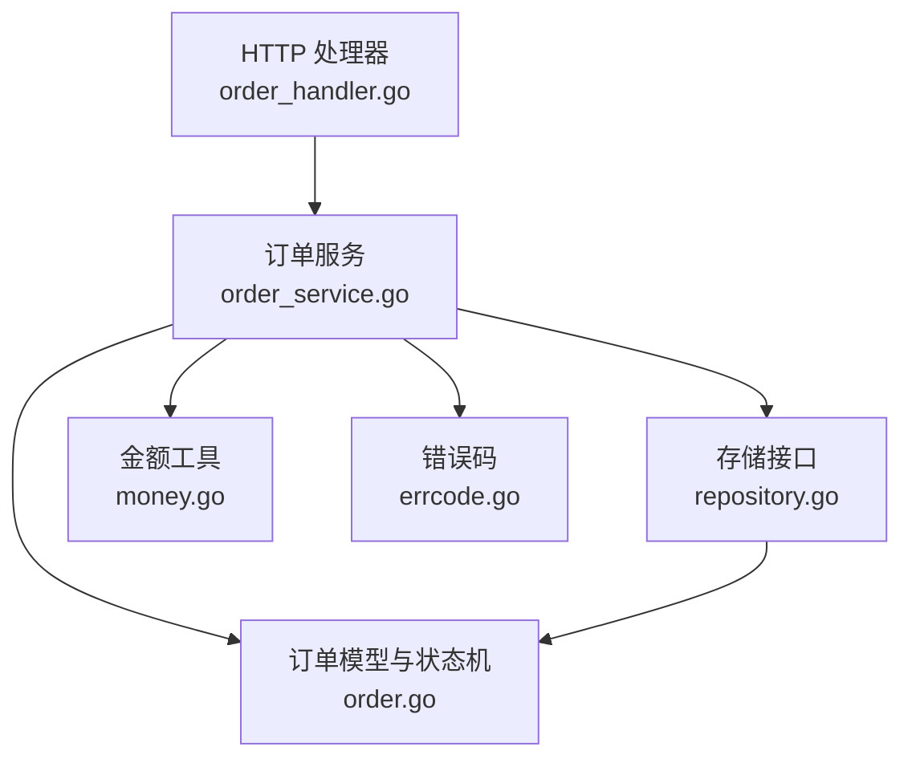
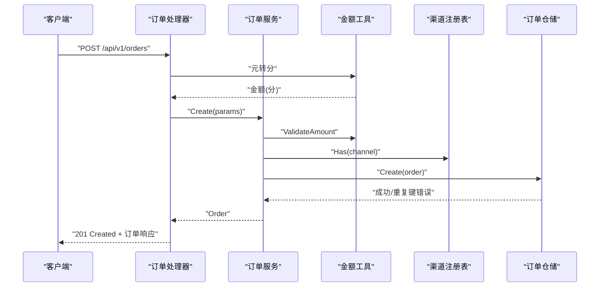
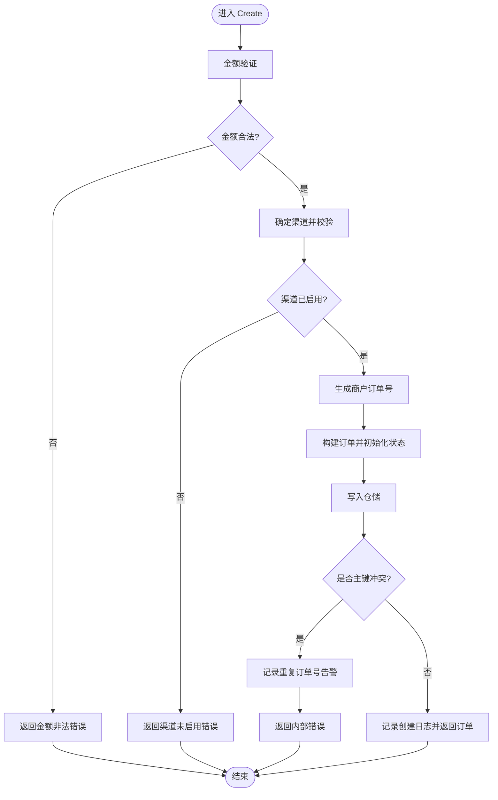
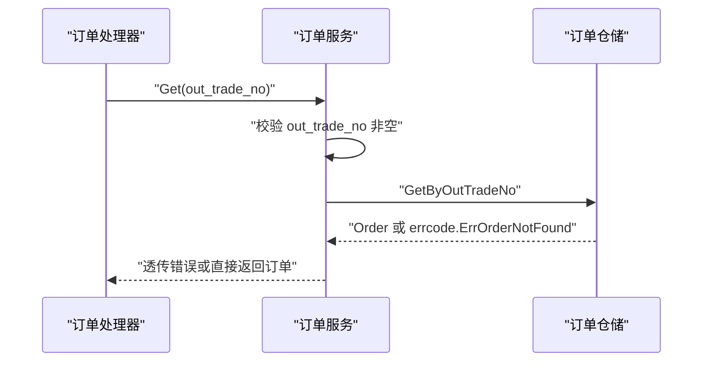
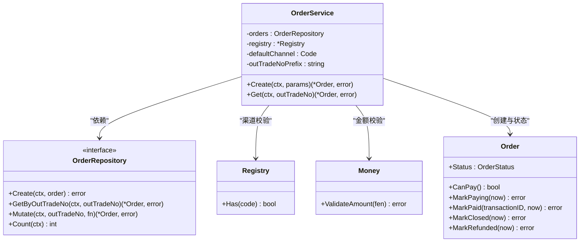

# 订单服务

<cite>
**本文引用的文件**   
- [internal/service/order_service.go](file://internal/service/order_service.go)
- [internal/model/order.go](file://internal/model/order.go)
- [internal/handler/order_handler.go](file://internal/handler/order_handler.go)
- [internal/pkg/money/money.go](file://internal/pkg/money/money.go)
- [internal/errcode/errcode.go](file://internal/errcode/errcode.go)
- [internal/repository/repository.go](file://internal/repository/repository.go)
</cite>

## 目录
1. [引言](#引言)
2. [项目结构](#项目结构)
3. [核心组件](#核心组件)
4. [架构总览](#架构总览)
5. [详细组件分析](#详细组件分析)
6. [依赖关系分析](#依赖关系分析)
7. [性能与一致性考量](#性能与一致性考量)
8. [故障排查指南](#故障排查指南)
9. [结论](#结论)

## 引言
本文面向订单服务的开发者与使用者，重点说明 OrderService 的职责边界、下单流程的设计动机、Create 与 Get 方法的实现要点，以及错误处理与异常透传机制。文档强调：OrderService 负责订单创建、查询等核心业务规则，但不直接处理 HTTP 请求，也不直接调用具体支付渠道；下单与发起支付是两个独立动作，以便在中间插入风控、库存校验、优惠券核销等业务环节。

## 项目结构
订单相关代码分布在 service、model、handler、pkg、errcode、repository 六个层次：
- handler 层负责解析 HTTP 请求、参数校验、金额元分转换，并调用 service。
- service 层封装订单业务逻辑，依赖 model、repository 接口与 channel 抽象。
- model 层定义订单领域模型与状态机，所有状态变更必须通过方法完成。
- repository 层定义存储接口，屏蔽数据库或内存实现差异。
- pkg/money 提供金额工具，确保金额以“分”为单位进行整数运算。
- errcode 统一业务错误码与 HTTP 状态映射。

**图表来源**
- [internal/handler/order_handler.go:23-60](file://internal/handler/order_handler.go#L23-L60)
- [internal/service/order_service.go:21-50](file://internal/service/order_service.go#L21-L50)
- [internal/model/order.go:73-120](file://internal/model/order.go#L73-L120)
- [internal/repository/repository.go:27-44](file://internal/repository/repository.go#L27-L44)
- [internal/pkg/money/money.go:39-106](file://internal/pkg/money/money.go#L39-L106)
- [internal/errcode/errcode.go:136-149](file://internal/errcode/errcode.go#L136-L149)

**章节来源**
- [internal/handler/order_handler.go:1-79](file://internal/handler/order_handler.go#L1-L79)
- [internal/service/order_service.go:1-125](file://internal/service/order_service.go#L1-L125)
- [internal/model/order.go:1-184](file://internal/model/order.go#L1-L184)
- [internal/repository/repository.go:1-90](file://internal/repository/repository.go#L1-L90)
- [internal/pkg/money/money.go:1-152](file://internal/pkg/money/money.go#L1-L152)
- [internal/errcode/errcode.go:1-158](file://internal/errcode/errcode.go#L1-L158)

## 核心组件
- OrderService：订单业务入口，负责金额验证、渠道校验、商户订单号生成、订单初始化与持久化、按单号查询。
- Order 模型与状态机：定义订单字段、合法状态流转与终态语义，禁止外部直接赋值 Status。
- Repository 接口：定义 Create、GetByOutTradeNo、Mutate 等原子操作，保证回调幂等与并发安全。
- Money 工具：以“分”为单位的金额解析、格式化与校验，避免浮点精度问题。
- ErrCode：统一业务错误码、HTTP 状态映射与错误包装，支持 Cause 透传与 Is 比较。

**章节来源**
- [internal/service/order_service.go:21-65](file://internal/service/order_service.go#L21-L65)
- [internal/model/order.go:20-120](file://internal/model/order.go#L20-L120)
- [internal/repository/repository.go:27-44](file://internal/repository/repository.go#L27-L44)
- [internal/pkg/money/money.go:17-37](file://internal/pkg/money/money.go#L17-L37)
- [internal/errcode/errcode.go:20-34](file://internal/errcode/errcode.go#L20-L34)

## 架构总览
OrderService 处于业务层，向上被 handler 调用，向下依赖 repository 接口与 channel 抽象。它不感知 HTTP，也不直接调用具体支付 SDK；支付渠道的注册与选择由 channel.Registry 管理。下单仅创建订单记录并落库，不调用任何渠道接口；发起支付是另一个独立步骤，便于在中间插入风控、库存校验、优惠券核销等流程。

**图表来源**
- [internal/handler/order_handler.go:23-60](file://internal/handler/order_handler.go#L23-L60)
- [internal/service/order_service.go:67-110](file://internal/service/order_service.go#L67-L110)
- [internal/pkg/money/money.go:124-136](file://internal/pkg/money/money.go#L124-L136)
- [internal/repository/repository.go:27-44](file://internal/repository/repository.go#L27-L44)

## 详细组件分析

### OrderService 职责边界
- 职责范围：
  - 接收 handler 传入的 CreateOrderParams，执行金额校验、渠道校验、订单号生成、订单初始化与持久化。
  - 提供 Get 方法按商户订单号查询订单，透传仓储层的错误码。
- 非职责范围：
  - 不解析 HTTP 请求体，不绑定 gin.Context。
  - 不调用具体支付渠道 SDK，只依赖 channel.Code 与 channel.Registry。
  - 不直接处理回调或支付结果，这些由 payment_service 与回调处理器负责。

设计收益：
- 业务规则可被纯单元测试覆盖，无需启动 HTTP 服务。
- 分层清晰，dto、handler、service、repository 解耦，便于替换存储与渠道实现。

**章节来源**
- [internal/service/order_service.go:1-19](file://internal/service/order_service.go#L1-L19)
- [internal/service/order_service.go:21-65](file://internal/service/order_service.go#L21-L65)

### Create 方法实现细节
Create 的核心步骤如下：
1. 金额验证：调用 money.ValidateAmount，拒绝负数、零值与超上限金额。
2. 渠道确定与校验：若未指定渠道则使用默认渠道；通过 registry.Has 校验渠道是否已启用。
3. 商户订单号生成：使用 idgen.OutTradeNo 生成唯一 out_trade_no。
4. 订单初始化：调用 model.NewOrder 创建订单，初始状态为 CREATED，设置币种、时间戳等。
5. 填充扩展字段：OpenID、Attach、ClientIP 来自入参。
6. 持久化：调用 orders.Create 写入仓储；若发生主键冲突，记录告警日志并返回内部错误。
7. 成功返回：记录订单创建日志并返回订单对象。

为什么下单与发起支付是两个独立动作？
- 下单阶段只做订单创建与基础校验，不调用渠道接口。
- 中间可以插入风控、库存校验、优惠券核销等业务流程，避免把复杂编排耦合到单一接口。
- 对账与状态机更清晰：CREATED -> PAYING -> PAID/CLOSED/REFUNDED，每个阶段有明确语义。

**图表来源**
- [internal/service/order_service.go:67-110](file://internal/service/order_service.go#L67-L110)
- [internal/pkg/money/money.go:124-136](file://internal/pkg/money/money.go#L124-L136)
- [internal/repository/repository.go:27-44](file://internal/repository/repository.go#L27-L44)

**章节来源**
- [internal/service/order_service.go:67-110](file://internal/service/order_service.go#L67-L110)
- [internal/model/order.go:104-120](file://internal/model/order.go#L104-L120)
- [internal/pkg/money/money.go:124-136](file://internal/pkg/money/money.go#L124-L136)
- [internal/repository/repository.go:66-89](file://internal/repository/repository.go#L66-L89)

### Get 方法设计与错误透传
Get 的设计考虑：
- 参数校验：out_trade_no 为空时直接返回参数非法错误。
- 查询订单：调用 orders.GetByOutTradeNo。
- 错误透传：仓储层已经返回带错误码的 errcode，这里直接透传，避免被 response.From 归一化为 500 内部错误。这样「订单不存在」能正确映射为 404。

**图表来源**
- [internal/service/order_service.go:112-124](file://internal/service/order_service.go#L112-L124)
- [internal/repository/repository.go:27-44](file://internal/repository/repository.go#L27-L44)
- [internal/errcode/errcode.go:98-110](file://internal/errcode/errcode.go#L98-L110)

**章节来源**
- [internal/service/order_service.go:112-124](file://internal/service/order_service.go#L112-L124)
- [internal/errcode/errcode.go:98-110](file://internal/errcode/errcode.go#L98-L110)

### 使用示例与异常处理
以下示例展示如何在 handler 中调用 OrderService 进行订单操作，并处理各种异常情况（不直接粘贴代码，仅提供路径）：
- 创建订单：
  - 解析请求体并调用 dto.CreateOrderRequest.AmountFen 将元转换为分。
  - 调用 OrderService.Create，传入 CreateOrderParams。
  - 若返回错误，使用 errcode.From 统一包装后返回给客户端。
  - 参考路径：[internal/handler/order_handler.go:23-60](file://internal/handler/order_handler.go#L23-L60)、[internal/service/order_service.go:67-110](file://internal/service/order_service.go#L67-L110)、[internal/errcode/errcode.go:136-149](file://internal/errcode/errcode.go#L136-L149)。
- 查询订单：
  - 从路径参数获取 out_trade_no。
  - 调用 OrderService.Get，透传仓储层错误。
  - 参考路径：[internal/handler/order_handler.go:62-79](file://internal/handler/order_handler.go#L62-L79)、[internal/service/order_service.go:112-124](file://internal/service/order_service.go#L112-L124)。
- 常见异常：
  - 金额非法：errcode.ErrOrderAmountInvalid（400）。
  - 渠道未启用：errcode.ErrChannelNotRegistered（500，但对外文案不暴露内部细节）。
  - 订单不存在：errcode.ErrOrderNotFound（404）。
  - 内部错误：errcode.ErrInternal（500），底层原因仅在日志中可见。
  - 参考路径：[internal/errcode/errcode.go:98-134](file://internal/errcode/errcode.go#L98-L134)。

**章节来源**
- [internal/handler/order_handler.go:23-79](file://internal/handler/order_handler.go#L23-L79)
- [internal/service/order_service.go:67-124](file://internal/service/order_service.go#L67-L124)
- [internal/errcode/errcode.go:98-149](file://internal/errcode/errcode.go#L98-L149)

## 依赖关系分析
OrderService 的依赖关系体现为清晰的单向依赖：
- 依赖 model.Order 与状态机方法。
- 依赖 repository.OrderRepository 接口，屏蔽存储实现。
- 依赖 channel.Registry 进行渠道校验。
- 依赖 pkg/money 进行金额校验。
- 依赖 errcode 进行错误码包装与透传。

**图表来源**
- [internal/service/order_service.go:21-50](file://internal/service/order_service.go#L21-L50)
- [internal/repository/repository.go:27-44](file://internal/repository/repository.go#L27-L44)
- [internal/model/order.go:73-184](file://internal/model/order.go#L73-L184)
- [internal/pkg/money/money.go:124-136](file://internal/pkg/money/money.go#L124-L136)

**章节来源**
- [internal/service/order_service.go:21-50](file://internal/service/order_service.go#L21-L50)
- [internal/repository/repository.go:27-44](file://internal/repository/repository.go#L27-L44)
- [internal/model/order.go:73-184](file://internal/model/order.go#L73-L184)
- [internal/pkg/money/money.go:124-136](file://internal/pkg/money/money.go#L124-L136)

## 性能与一致性考量
- 金额计算全程使用整数与字符串，避免浮点精度损失与溢出风险。
- 订单状态机强制通过 transit 方法变更，防止非法流转导致资金对账事故。
- repository.Mutate 提供原子上下文，保证回调幂等与并发安全；内存实现使用互斥锁，数据库实现对应 SELECT ... FOR UPDATE 事务。
- 对外一律返回 Order 副本，避免绕过状态机直接修改字段污染仓储数据。

**章节来源**
- [internal/pkg/money/money.go:1-152](file://internal/pkg/money/money.go#L1-L152)
- [internal/model/order.go:155-184](file://internal/model/order.go#L155-L184)
- [internal/repository/repository.go:1-19](file://internal/repository/repository.go#L1-L19)

## 故障排查指南
- 金额相关问题：
  - 检查是否使用 money.YuanToFen 或 req.AmountFen 进行元分转换。
  - 确认 ValidateAmount 返回的错误类型是否为 ErrOrderAmountInvalid。
  - 参考路径：[internal/handler/order_handler.go:33-42](file://internal/handler/order_handler.go#L33-L42)、[internal/pkg/money/money.go:39-106](file://internal/pkg/money/money.go#L39-L106)、[internal/errcode/errcode.go:104-105](file://internal/errcode/errcode.go#L104-L105)。
- 渠道相关问题：
  - 确认 channel.Code 是否在 registry 中注册。
  - 若未启用，会返回 ErrChannelNotRegistered。
  - 参考路径：[internal/service/order_service.go:77-85](file://internal/service/order_service.go#L77-L85)、[internal/errcode/errcode.go:124-134](file://internal/errcode/errcode.go#L124-L134)。
- 订单号重复：
  - 若仓库返回主键冲突，OrderService 会记录告警日志并返回内部错误。
  - 检查 idgen.OutTradeNo 的实现与随机源/时钟是否正常。
  - 参考路径：[internal/service/order_service.go:93-102](file://internal/service/order_service.go#L93-L102)、[internal/repository/repository.go:66-89](file://internal/repository/repository.go#L66-L89)。
- 订单查询失败：
  - 若 out_trade_no 为空，返回参数非法。
  - 若仓储层返回 ErrOrderNotFound，应透传而非包装为内部错误。
  - 参考路径：[internal/service/order_service.go:112-124](file://internal/service/order_service.go#L112-L124)、[internal/errcode/errcode.go:98-110](file://internal/errcode/errcode.go#L98-L110)。

**章节来源**
- [internal/handler/order_handler.go:33-42](file://internal/handler/order_handler.go#L33-L42)
- [internal/service/order_service.go:77-102](file://internal/service/order_service.go#L77-L102)
- [internal/service/order_service.go:112-124](file://internal/service/order_service.go#L112-L124)
- [internal/pkg/money/money.go:39-106](file://internal/pkg/money/money.go#L39-L106)
- [internal/errcode/errcode.go:98-134](file://internal/errcode/errcode.go#L98-L134)
- [internal/repository/repository.go:66-89](file://internal/repository/repository.go#L66-L89)

## 结论
OrderService 将订单创建与查询的核心业务逻辑收敛在服务层，保持与 HTTP 和具体支付渠道的解耦。Create 方法严格遵循金额验证、渠道校验、订单号生成与状态初始化的顺序，确保下单阶段的正确性与可观测性。Get 方法通过透传仓储层错误码，保证错误语义不被上层吞没。下单与发起支付的分离设计，为风控、库存校验、优惠券核销等中间环节提供了清晰的编排空间，同时配合严格的订单状态机与原子仓储操作，保障支付系统的可靠性与可维护性。