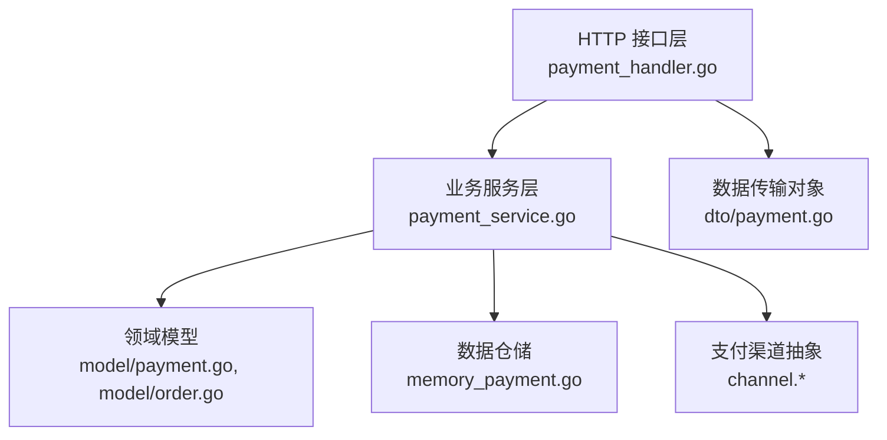
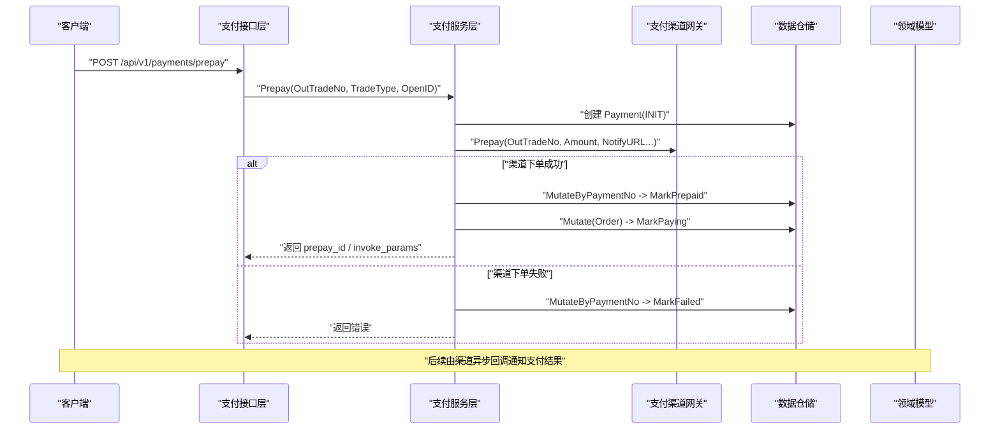
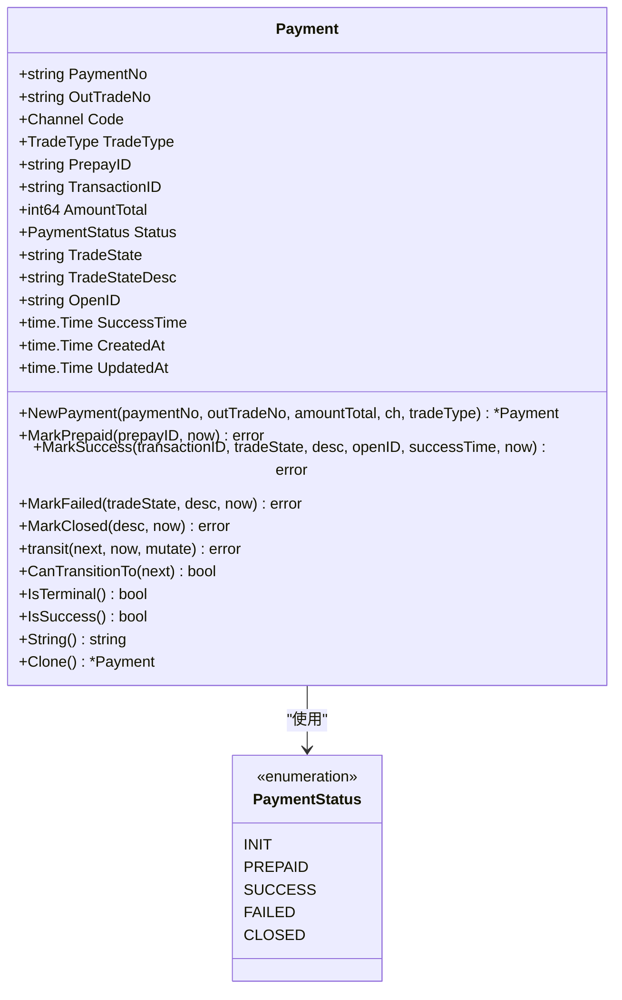
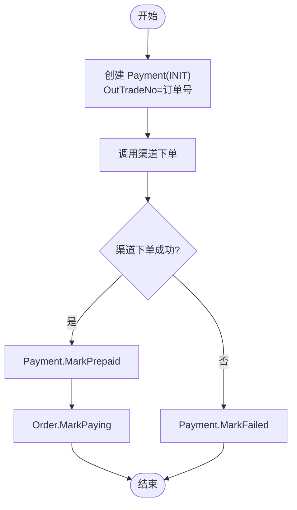
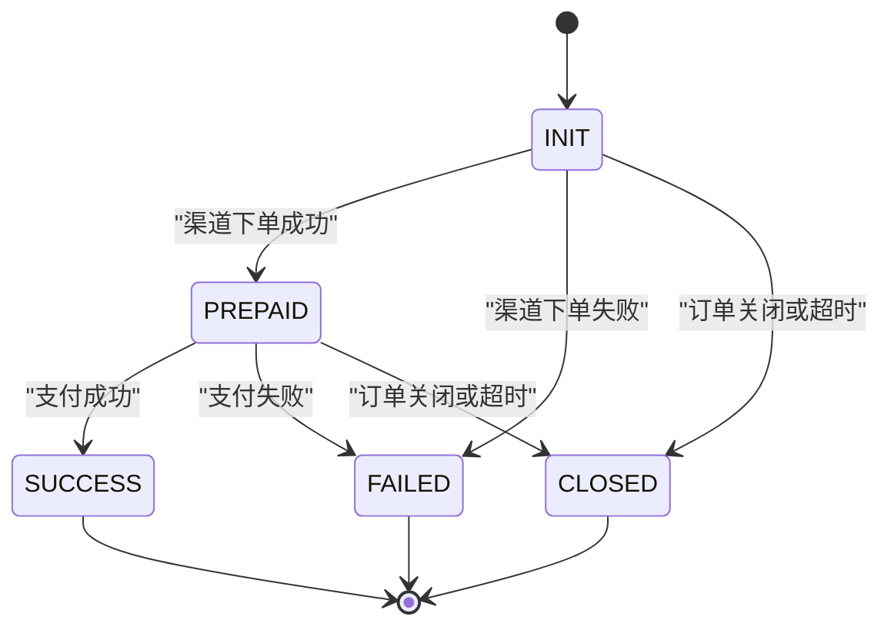
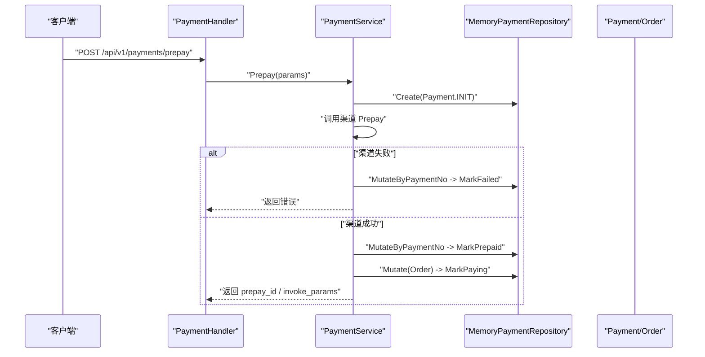
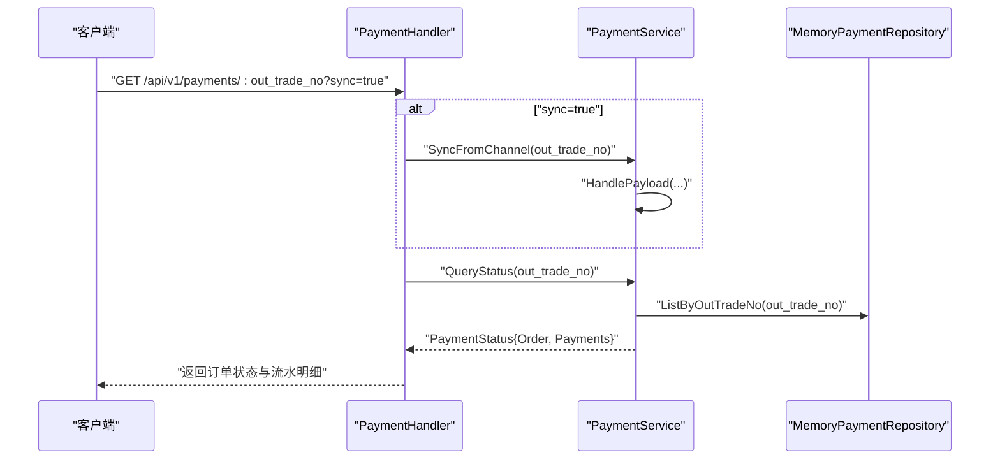
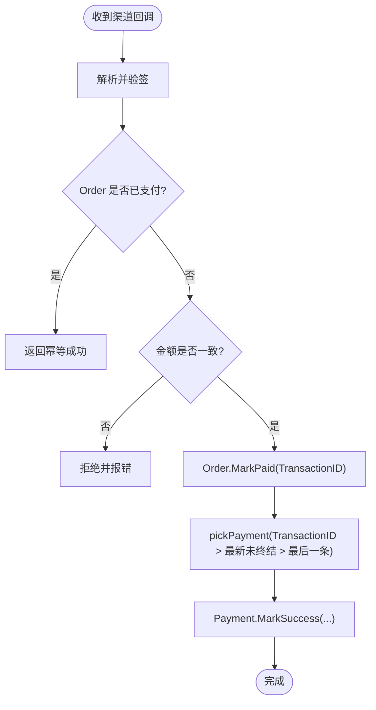
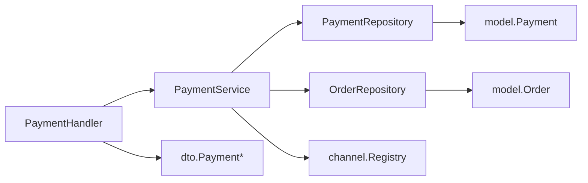

# 支付流水实体 (Payment)

<cite>
**本文引用的文件**   
- [internal/model/payment.go](file://internal/model/payment.go)
- [internal/model/order.go](file://internal/model/order.go)
- [internal/service/payment_service.go](file://internal/service/payment_service.go)
- [internal/handler/payment_handler.go](file://internal/handler/payment_handler.go)
- [internal/dto/payment.go](file://internal/dto/payment.go)
- [internal/repository/memory_payment.go](file://internal/repository/memory_payment.go)
</cite>

## 目录
1. [引言](#引言)
2. [项目结构定位](#项目结构定位)
3. [核心概念与职责](#核心概念与职责)
4. [架构总览](#架构总览)
5. [详细组件分析](#详细组件分析)
6. [依赖关系分析](#依赖关系分析)
7. [性能与可靠性特性](#性能与可靠性特性)
8. [常见问题排查](#常见问题排查)
9. [结论](#结论)

## 引言
本文件围绕 Payment 实体展开，说明其在支付系统中的角色、状态机设计、与 Order 的关联机制、关键字段含义，以及创建、查询、回调处理等典型流程。Payment 是「一次支付尝试」的独立记录，一个订单可能产生多条流水；保留全部流水是对账、排障和幂等控制的基础。

## 项目结构定位
Payment 相关代码分布在领域模型、服务层、接口层、数据传输对象和内存仓储中：
- 领域模型：定义 Payment 实体、状态枚举与状态流转方法。
- 服务层：封装发起支付、处理渠道回调、查询状态、主动查单兜底等业务编排。
- 接口层：暴露 HTTP 接口，负责参数绑定与响应转换。
- DTO：对外请求与响应结构，屏蔽内部模型细节。
- 仓储：提供基于内存的持久化实现，演示并发安全与索引策略。

**图表来源**
- [internal/handler/payment_handler.go:16-50](file://internal/handler/payment_handler.go#L16-L50)
- [internal/service/payment_service.go:34-73](file://internal/service/payment_service.go#L34-L73)
- [internal/model/payment.go:54-89](file://internal/model/payment.go#L54-L89)
- [internal/model/order.go:73-102](file://internal/model/order.go#L73-L102)
- [internal/repository/memory_payment.go:13-22](file://internal/repository/memory_payment.go#L13-L22)
- [internal/dto/payment.go:9-42](file://internal/dto/payment.go#L9-L42)

**章节来源**
- [internal/handler/payment_handler.go:16-50](file://internal/handler/payment_handler.go#L16-L50)
- [internal/service/payment_service.go:34-73](file://internal/service/payment_service.go#L34-L73)
- [internal/model/payment.go:54-89](file://internal/model/payment.go#L54-L89)
- [internal/model/order.go:73-102](file://internal/model/order.go#L73-L102)
- [internal/repository/memory_payment.go:13-22](file://internal/repository/memory_payment.go#L13-L22)
- [internal/dto/payment.go:9-42](file://internal/dto/payment.go#L9-L42)

## 核心概念与职责
- Payment 表示一次支付尝试，包含流水号、所属订单号、支付渠道、交易类型、金额、状态、渠道原始状态及时间戳等。
- Payment 与 Order 是一对多关系：同一 OutTradeNo 可对应多条 Payment；每次失败重试、换支付方式或重复点击都会新增一条流水。
- Payment 的状态机由 INIT → PREPAID → SUCCESS/FAILED/CLOSED 构成，终态不可再变更。
- Payment 通过 OutTradeNo 与 Order 关联；支付成功后，Order 推进到已支付，Payment 推进到 SUCCESS，并回填渠道交易号等字段。
- 关键辅助字段：
  - PrepayID：预支付会话标识，用于前端调起支付。
  - TransactionID：渠道侧交易号，支付成功后回填，用于对账与退款。
  - TradeState / TradeStateDesc：渠道返回的原始交易状态与描述，便于对账与客诉定位。
  - OpenID：实际付款用户标识，JSAPI 场景必填。
  - SuccessTime：支付成功时间，优先使用渠道返回，否则回退为本地时间。

**章节来源**
- [internal/model/payment.go:10-24](file://internal/model/payment.go#L10-L24)
- [internal/model/payment.go:54-89](file://internal/model/payment.go#L54-L89)
- [internal/model/payment.go:91-150](file://internal/model/payment.go#L91-L150)
- [internal/model/order.go:73-102](file://internal/model/order.go#L73-L102)

## 架构总览
Payment 的生命周期贯穿以下阶段：
- 发起支付：校验订单可支付 → 创建 Payment(INIT) → 调用渠道下单 → 若成功则 Payment(PREPAID) 且 Order(PAYING)。
- 渠道回调：验签解密 → 幂等判断 → 金额校验 → 更新 Order(PAID) → 匹配并更新 Payment(SUCCESS)。
- 非成功回调：根据渠道状态关闭订单或标记流水失败，不轻易把未决状态当失败。
- 查询与兜底：轮询只读本地状态；必要时主动查单同步，保证掉单恢复。

**图表来源**
- [internal/handler/payment_handler.go:26-50](file://internal/handler/payment_handler.go#L26-L50)
- [internal/service/payment_service.go:99-226](file://internal/service/payment_service.go#L99-L226)
- [internal/model/payment.go:91-109](file://internal/model/payment.go#L91-L109)
- [internal/model/order.go:122-130](file://internal/model/order.go#L122-L130)

**章节来源**
- [internal/handler/payment_handler.go:26-50](file://internal/handler/payment_handler.go#L26-L50)
- [internal/service/payment_service.go:99-226](file://internal/service/payment_service.go#L99-L226)
- [internal/model/payment.go:91-109](file://internal/model/payment.go#L91-L109)
- [internal/model/order.go:122-130](file://internal/model/order.go#L122-L130)

## 详细组件分析

### Payment 领域模型与状态机
Payment 定义了支付流水的核心字段与状态机方法：
- 状态枚举：INIT、PREPAID、SUCCESS、FAILED、CLOSED。
- 合法后继：INIT 可流转到 PREPAID、FAILED、CLOSED；PREPAID 可流转到 SUCCESS、FAILED、CLOSED；SUCCESS、FAILED、CLOSED 为终态。
- 状态变更入口：MarkPrepaid、MarkSuccess、MarkFailed、MarkClosed，内部统一走 transit 校验，避免非法流转。
- 克隆能力：Clone 防止外部绕过状态机直接修改内存数据。

**图表来源**
- [internal/model/payment.go:10-24](file://internal/model/payment.go#L10-L24)
- [internal/model/payment.go:54-89](file://internal/model/payment.go#L54-L89)
- [internal/model/payment.go:91-150](file://internal/model/payment.go#L91-L150)

**章节来源**
- [internal/model/payment.go:10-24](file://internal/model/payment.go#L10-L24)
- [internal/model/payment.go:54-89](file://internal/model/payment.go#L54-L89)
- [internal/model/payment.go:91-150](file://internal/model/payment.go#L91-L150)

### Payment 与 Order 的关联机制
- 关联键：Payment.OutTradeNo 指向 Order.OutTradeNo。
- 创建顺序：先创建 Payment(INIT)，再调用渠道下单；成功后将 Payment 置为 PREPAID，并将 Order 推进到 PAYING。
- 支付成功同步：渠道回调成功后，Order 推进到 PAID，Payment 推进到 SUCCESS，并回填 TransactionID、TradeState、OpenID、SuccessTime 等。
- 一对多语义：同一订单的多条流水分别记录每次尝试，避免覆盖历史，便于对账与排障。

**图表来源**
- [internal/service/payment_service.go:108-226](file://internal/service/payment_service.go#L108-L226)
- [internal/model/payment.go:106-109](file://internal/model/payment.go#L106-L109)
- [internal/model/order.go:127-130](file://internal/model/order.go#L127-L130)

**章节来源**
- [internal/service/payment_service.go:108-226](file://internal/service/payment_service.go#L108-L226)
- [internal/model/payment.go:106-109](file://internal/model/payment.go#L106-L109)
- [internal/model/order.go:127-130](file://internal/model/order.go#L127-L130)

### 支付状态流转与业务含义
- INIT：流水已创建，尚未调起渠道下单。
- PREPAID：渠道下单成功，拿到预支付标识，等待用户付款。
- SUCCESS：支付成功，终态；同时 Order 应为 PAID。
- FAILED：支付失败，终态；通常不影响 Order 继续允许重新支付。
- CLOSED：流水关闭（订单关单或超时），终态。

**图表来源**
- [internal/model/payment.go:10-24](file://internal/model/payment.go#L10-L24)
- [internal/model/payment.go:26-46](file://internal/model/payment.go#L26-L46)
- [internal/service/payment_service.go:381-415](file://internal/service/payment_service.go#L381-L415)

**章节来源**
- [internal/model/payment.go:10-24](file://internal/model/payment.go#L10-L24)
- [internal/model/payment.go:26-46](file://internal/model/payment.go#L26-L46)
- [internal/service/payment_service.go:381-415](file://internal/service/payment_service.go#L381-L415)

### 关键字段说明
- PrepayID：预支付会话标识，用于前端调起支付；在渠道下单成功后写入。
- TransactionID：渠道侧交易号，支付成功后回填；用于对账、退款与溯源。
- ErrorMessage：以 TradeState / TradeStateDesc 形式记录渠道原始状态与描述，便于对账与客服定位。
- OpenID：JSAPI 场景下实际付款用户标识，回调中回填。
- SuccessTime：支付成功时间，优先使用渠道返回，否则回退为本地时间。
- AmountTotal：本次支付金额（分），必须与订单金额一致，金额不一致时拒绝置为已支付。

**章节来源**
- [internal/model/payment.go:70-89](file://internal/model/payment.go#L70-L89)
- [internal/service/payment_service.go:320-340](file://internal/service/payment_service.go#L320-L340)
- [internal/service/payment_service.go:417-453](file://internal/service/payment_service.go#L417-L453)

### 创建支付流水
典型流程：
- 接口接收 OutTradeNo、TradeType、OpenID。
- 服务层校验订单可支付，生成 PaymentNo，创建 Payment(INIT)。
- 调用渠道下单；若失败，标记 Payment(FAILED)；若成功，标记 Payment(PREPAID) 并推进 Order(PAYING)。
- 返回前端调起支付所需参数。

**图表来源**
- [internal/handler/payment_handler.go:26-50](file://internal/handler/payment_handler.go#L26-L50)
- [internal/service/payment_service.go:108-226](file://internal/service/payment_service.go#L108-L226)
- [internal/repository/memory_payment.go:34-53](file://internal/repository/memory_payment.go#L34-L53)
- [internal/model/payment.go:91-109](file://internal/model/payment.go#L91-L109)
- [internal/model/order.go:127-130](file://internal/model/order.go#L127-L130)

**章节来源**
- [internal/handler/payment_handler.go:26-50](file://internal/handler/payment_handler.go#L26-L50)
- [internal/service/payment_service.go:108-226](file://internal/service/payment_service.go#L108-L226)
- [internal/repository/memory_payment.go:34-53](file://internal/repository/memory_payment.go#L34-L53)
- [internal/model/payment.go:91-109](file://internal/model/payment.go#L91-L109)
- [internal/model/order.go:127-130](file://internal/model/order.go#L127-L130)

### 查询支付状态
- 接口支持 GET /api/v1/payments/:out_trade_no，默认只读本地数据，适合高频轮询。
- 可选 sync=true 强制主动查单，用于回调丢失时的兜底对齐。
- 返回 Order 状态与全部 Payment 明细，前端依据 paid 字段决定是否停止轮询。

**图表来源**
- [internal/handler/payment_handler.go:53-85](file://internal/handler/payment_handler.go#L53-L85)
- [internal/service/payment_service.go:528-582](file://internal/service/payment_service.go#L528-L582)
- [internal/repository/memory_payment.go:66-90](file://internal/repository/memory_payment.go#L66-L90)

**章节来源**
- [internal/handler/payment_handler.go:53-85](file://internal/handler/payment_handler.go#L53-L85)
- [internal/service/payment_service.go:528-582](file://internal/service/payment_service.go#L528-L582)
- [internal/repository/memory_payment.go:66-90](file://internal/repository/memory_payment.go#L66-L90)

### 处理支付成功回调
- 验签解密后进入 HandlePayload，先做幂等判断：若 Order 已是 PAID，直接原样返回成功，让渠道停止重试。
- 金额校验：回调金额必须等于订单金额，不一致则拒绝置为已支付。
- 推进 Order 到 PAID，并回填 TransactionID。
- 匹配对应 Payment：优先按 TransactionID 精确匹配，其次取最新未终结流水，最后取最后一条流水。
- 将 Payment 推进到 SUCCESS，回填 TradeState、TradeStateDesc、OpenID、SuccessTime。

**图表来源**
- [internal/service/payment_service.go:277-379](file://internal/service/payment_service.go#L277-L379)
- [internal/service/payment_service.go:417-486](file://internal/service/payment_service.go#L417-L486)

**章节来源**
- [internal/service/payment_service.go:277-379](file://internal/service/payment_service.go#L277-L379)
- [internal/service/payment_service.go:417-486](file://internal/service/payment_service.go#L417-L486)

### 幂等性保证
- 订单级幂等：HandlePayload 在进入状态变更前检查 Order.Status.IsPaid()，若已支付则直接返回幂等成功。
- 并发保护：Mutate 回调内再次判 IsPaid()，防止并发回调重复推进。
- 流水级幂等：markPaymentSuccess 中若 Payment 已是终态，返回特定错误，上层识别为幂等命中。
- 渠道重试容忍：微信支付在未收到成功应答时会重复投递，系统必须原样返回成功，避免无限重试。

**章节来源**
- [internal/service/payment_service.go:301-313](file://internal/service/payment_service.go#L301-L313)
- [internal/service/payment_service.go:342-365](file://internal/service/payment_service.go#L342-L365)
- [internal/service/payment_service.go:435-453](file://internal/service/payment_service.go#L435-L453)

### 对账作用
- 保留全部流水：每个 Payment 记录一次支付尝试，避免覆盖历史，便于还原当时发生了什么。
- 渠道原始状态：TradeState、TradeStateDesc 原样保留，便于与渠道账单比对。
- 渠道交易号：TransactionID 作为跨系统唯一标识，支撑对账、退款与审计。
- 金额一致性：回调金额与订单金额不一致时拒绝置为已支付，防止串单与篡改。

**章节来源**
- [internal/model/payment.go:54-59](file://internal/model/payment.go#L54-L59)
- [internal/model/payment.go:70-89](file://internal/model/payment.go#L70-L89)
- [internal/service/payment_service.go:320-340](file://internal/service/payment_service.go#L320-L340)

## 依赖关系分析
- PaymentService 依赖 OrderRepository、PaymentRepository 与 channel.Registry。
- PaymentHandler 依赖 PaymentService 进行业务编排。
- MemoryPaymentRepository 提供并发安全的内存实现，维护 payment_no 与 out_trade_no 双索引。
- DTO 负责对外数据结构转换，屏蔽内部模型细节。

**图表来源**
- [internal/handler/payment_handler.go:16-24](file://internal/handler/payment_handler.go#L16-L24)
- [internal/service/payment_service.go:34-73](file://internal/service/payment_service.go#L34-L73)
- [internal/repository/memory_payment.go:13-22](file://internal/repository/memory_payment.go#L13-L22)
- [internal/dto/payment.go:9-42](file://internal/dto/payment.go#L9-L42)

**章节来源**
- [internal/handler/payment_handler.go:16-24](file://internal/handler/payment_handler.go#L16-L24)
- [internal/service/payment_service.go:34-73](file://internal/service/payment_service.go#L34-L73)
- [internal/repository/memory_payment.go:13-22](file://internal/repository/memory_payment.go#L13-L22)
- [internal/dto/payment.go:9-42](file://internal/dto/payment.go#L9-L42)

## 性能与可靠性特性
- 查询接口默认只读本地数据，避免频繁调用渠道触发限流；需要强一致时使用 sync 参数主动查单。
- 内存仓储使用读写锁与双索引，提升按订单查询流水的性能与稳定性。
- 状态机集中管理，所有状态变更通过 Mutate 回调执行，避免脏写与半更新。
- 回调与查单共用处理路径，确保同一笔交易的结论一致，降低掉单风险。

**章节来源**
- [internal/service/payment_service.go:528-582](file://internal/service/payment_service.go#L528-L582)
- [internal/repository/memory_payment.go:13-22](file://internal/repository/memory_payment.go#L13-L22)
- [internal/repository/memory_payment.go:66-90](file://internal/repository/memory_payment.go#L66-L90)
- [internal/service/payment_service.go:277-282](file://internal/service/payment_service.go#L277-L282)

## 常见问题排查
- 订单不可支付：
  - 已支付、已关闭、已退款等状态会返回明确错误码，前端应引导不同行为（跳转成功页或重新下单）。
- 金额不一致：
  - 回调金额与订单金额不一致时拒绝置为已支付，需检查是否串单或被篡改。
- 未找到匹配流水：
  - 若订单已支付但缺少流水记录，属于异常；需检查创建流水逻辑与渠道回调匹配优先级。
- 非终态通知：
  - NOTPAY / USERPAYING / REFUND 等不做状态变更，避免误判失败导致客诉。

**章节来源**
- [internal/service/payment_service.go:228-244](file://internal/service/payment_service.go#L228-L244)
- [internal/service/payment_service.go:320-340](file://internal/service/payment_service.go#L320-L340)
- [internal/service/payment_service.go:417-453](file://internal/service/payment_service.go#L417-L453)
- [internal/service/payment_service.go:381-415](file://internal/service/payment_service.go#L381-L415)

## 结论
Payment 实体是支付系统的核心记录单元，通过严格的状态机与 OutTradeNo 关联机制，保障了一次支付尝试的可追溯性与一致性。结合幂等控制、金额校验与主动查单兜底，系统在真实渠道环境下具备较强的可靠性与可运维性。保留全部流水不仅是对账的基础，也是故障排查与客户服务的有力支撑。