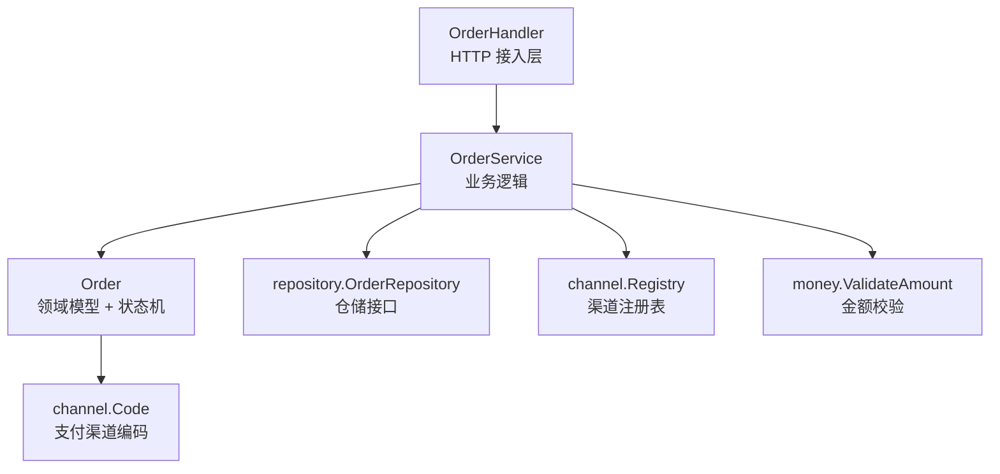
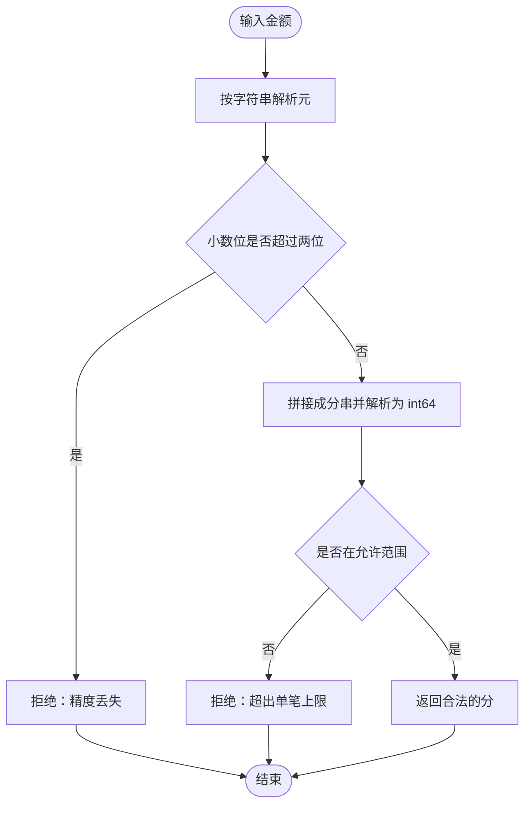
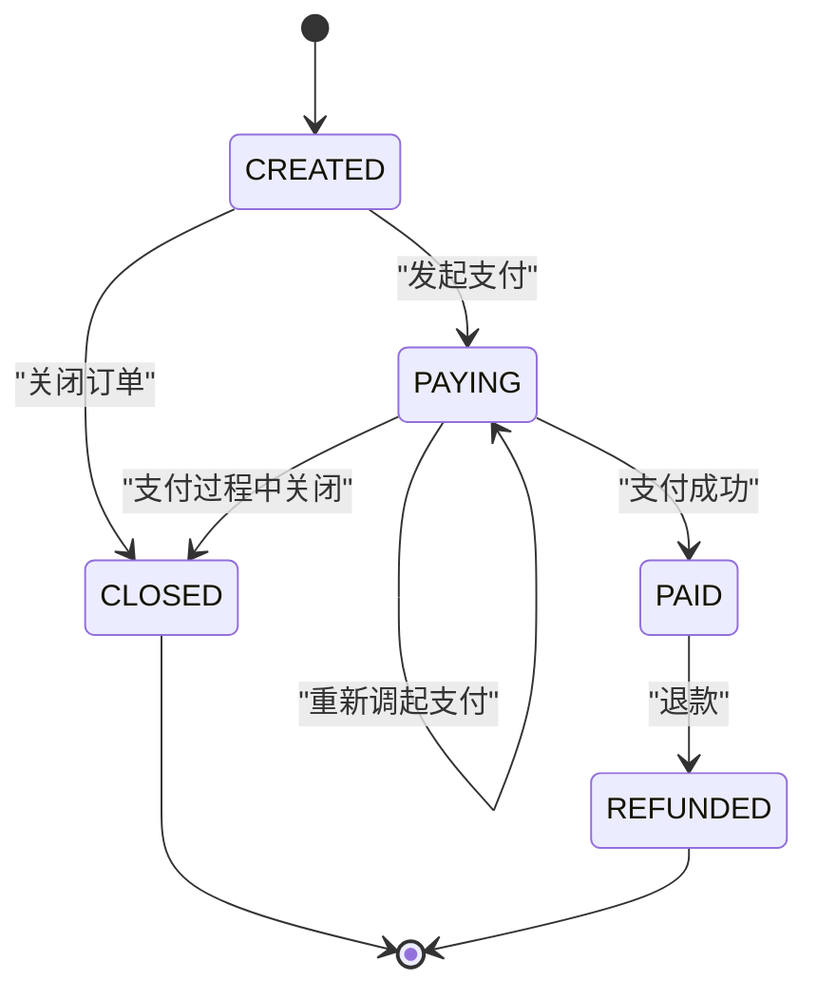
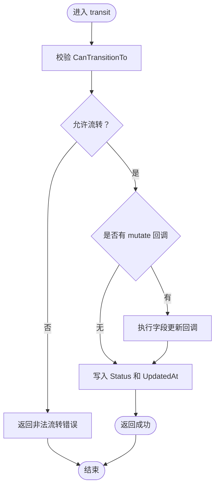
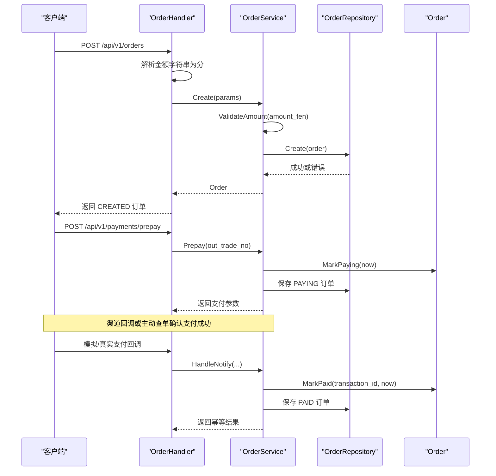
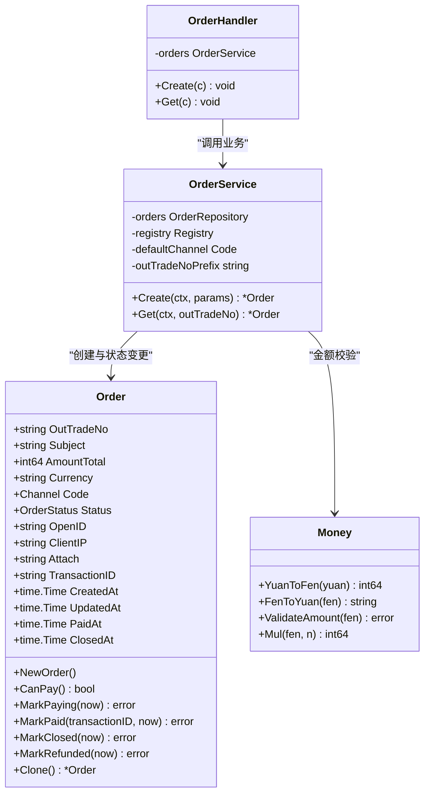

# 订单实体 (Order)

<cite>
**本文引用的文件**   
- [internal/model/order.go](file://internal/model/order.go)
- [internal/service/order_service.go](file://internal/service/order_service.go)
- [internal/handler/order_handler.go](file://internal/handler/order_handler.go)
- [internal/pkg/money/money.go](file://internal/pkg/money/money.go)
- [README.md](file://README.md)
</cite>

## 目录
1. [引言](#引言)
2. [项目结构中的订单位置](#项目结构中的订单位置)
3. [核心字段设计](#核心字段设计)
4. [金额存储规范：为什么必须用 int64 存「分」](#金额存储规范为什么必须用-int64-存分)
5. [订单状态机设计](#订单状态机设计)
6. [状态变更方法职责分离](#状态变更方法职责分离)
7. [业务判断方法 CanPay](#业务判断方法-canpay)
8. [完整业务流程与调用链](#完整业务流程与调用链)
9. [代码示例路径](#代码示例路径)
10. [依赖关系分析](#依赖关系分析)
11. [性能与一致性特征](#性能与一致性特征)
12. [常见问题与排错](#常见问题与排错)
13. [结论](#结论)

## 引言
本文围绕支付服务中的 **Order 领域模型**，系统性说明其字段含义、约束条件、状态机规则、状态变更方法的设计动机，以及从 HTTP 接入层到业务层再到领域层的完整调用路径。文档重点解释以下问题：
- OutTradeNo 为何作为业务主键；
- AmountTotal 为何以 int64 存储「分」；
- Channel 为何必须在创建阶段确定；
- Status 的状态机为何允许 PAYING → PAYING，且 CLOSED、REFUNDED 为终态；
- MarkPaying、MarkPaid、MarkClosed、MarkRefunded 的职责边界；
- transit 如何保证原子性状态更新；
- CanPay 的业务语义；
- 如何正确创建订单、发起支付、处理支付结果和关闭订单。

## 项目结构中的订单位置
Order 是领域模型的核心，位于 `internal/model`；订单的创建、查询等业务流程由 `internal/service.OrderService` 承载；HTTP 接口由 `internal/handler.OrderHandler` 暴露；金额转换与校验集中在 `internal/pkg/money`。

**图表来源**
- [internal/handler/order_handler.go:13-60](file://internal/handler/order_handler.go#L13-L60)
- [internal/service/order_service.go:21-110](file://internal/service/order_service.go#L21-L110)
- [internal/model/order.go:73-120](file://internal/model/order.go#L73-L120)
- [internal/pkg/money/money.go:124-136](file://internal/pkg/money/money.go#L124-L136)

**章节来源**
- [README.md:38-62](file://README.md#L38-L62)
- [internal/handler/order_handler.go:13-60](file://internal/handler/order_handler.go#L13-L60)
- [internal/service/order_service.go:21-110](file://internal/service/order_service.go#L21-L110)
- [internal/model/order.go:73-120](file://internal/model/order.go#L73-L120)

## 核心字段设计
Order 是支付订单的领域对象，关键字段如下：

| 字段 | 类型 | 含义 | 约束与行为 |
|---|---|---|---|
| OutTradeNo | string | 商户订单号，业务主键 | 由服务生成，唯一标识一笔订单；重复意味着随机源或时钟异常，需要告警 |
| Subject | string | 商品标题 | 会作为描述传给支付渠道 |
| AmountTotal | int64 | 订单总金额 | 单位为「分」；禁止在业务中转为 float64 参与运算 |
| Currency | string | 币种 | 默认 CNY；微信支付境内商户固定使用 |
| Channel | channel.Code | 支付渠道编码 | 创建时确定并落库，避免同一订单在不同请求下走到不同渠道 |
| Status | OrderStatus | 订单状态 | 只能通过 Mark* 方法变更，不允许外部直接赋值 |
| OpenID | string | 支付者 openid | JSAPI 交易必填 |
| ClientIP | string | 下单客户端 IP | 用于风控与渠道侧要求，服务端取值，不接受客户端传入 |
| Attach | string | 附加数据 | 渠道回调时原样返回，可用于携带业务上下文 |
| TransactionID | string | 渠道侧交易号 | 支付成功后回填，用于对账与退款 |
| CreatedAt / UpdatedAt / PaidAt / ClosedAt | time.Time | 时间戳 | 创建、更新时间自动维护；支付成功与关闭分别记录对应时间 |

OutTradeNo 是业务主键，不是数据库自增 ID。它贯穿下单、发起支付、渠道回调、查单、退款等全链路，因此必须稳定、可追踪、可幂等。

Channel 在创建订单时就确定，而不是发起支付时才解析。原因是：如果同一订单在不同请求中解析出不同渠道，会导致对账无法解释、渠道侧状态不一致。

Status 是受控字段，所有状态变更都必须通过 model 提供的 Mark* 方法完成，从而把非法流转拦截在领域层。

**章节来源**
- [internal/model/order.go:20-34](file://internal/model/order.go#L20-L34)
- [internal/model/order.go:73-102](file://internal/model/order.go#L73-L102)
- [internal/service/order_service.go:77-88](file://internal/service/order_service.go#L77-L88)

## 金额存储规范：为什么必须用 int64 存「分」
项目中所有金额一律使用 int64 表示「分」。原因包括：
- float64 无法精确表示大多数十进制小数，例如 19.99 乘以 100 可能得到 1998.9999999999998，截断后少收 1 分钱；
- 支付场景下任何静默的金额修正都是资金事故源头；
- 元分转换全程基于字符串与整数运算，不经过浮点类型；
- 提供 MaxAmountFen 上限，防止 int64 溢出后金额变成负数；
- ValidateAmount 强制金额为正数、非零且不超过单笔上限；
- Mul 使用 big.Int 计算 fen * n，避免极端值下静默溢出。

对外 API 通常接受「元」字符串，由 handler 层转换为「分」后再交给 service；service 只接收已经转换好的 int64 分。这样既方便前端展示，又保证内部计算精度。

**图表来源**
- [internal/pkg/money/money.go:39-106](file://internal/pkg/money/money.go#L39-L106)
- [internal/pkg/money/money.go:124-136](file://internal/pkg/money/money.go#L124-L136)

**章节来源**
- [internal/pkg/money/money.go:1-7](file://internal/pkg/money/money.go#L1-L7)
- [internal/pkg/money/money.go:20-37](file://internal/pkg/money/money.go#L20-L37)
- [internal/pkg/money/money.go:39-106](file://internal/pkg/money/money.go#L39-L106)
- [internal/pkg/money/money.go:124-151](file://internal/pkg/money/money.go#L124-L151)
- [internal/handler/order_handler.go:33-42](file://internal/handler/order_handler.go#L33-L42)

## 订单状态机设计
Order 的状态机定义在 model 包中，核心状态如下：

| 状态 | 含义 | 是否终态 | 允许的后继状态 |
|---|---|---:|---|
| CREATED | 订单已创建，尚未调起任何支付 | 否 | PAYING、CLOSED |
| PAYING | 已调起支付，等待用户完成付款 | 否 | PAYING、PAID、CLOSED |
| PAID | 支付成功 | 是（但可流向 REFUNDED） | REFUNDED |
| CLOSED | 订单已关闭（超时未支付或主动关单） | 是 | 无 |
| REFUNDED | 已退款 | 是 | 无 |

关键设计决策：
- CREATED → PAYING：正常发起支付；
- CREATED → CLOSED：下单后未支付且被主动关闭或超时关闭；
- PAYING → PAYING：允许用户重新调起支付，属于正常路径；
- PAYING → PAID：支付成功；
- PAYING → CLOSED：支付过程中被关闭；
- PAID → REFUNDED：先支付成功，再发生退款；
- CLOSED 和 REFUNDED 没有后继状态，是终态；
- PAID 虽然本身是终态之一，但允许继续流向 REFUNDED，因为退款发生在支付成功之后。

CanTransitionTo 通过显式列举合法后继来判断流转是否允许；IsTerminal 根据后继列表是否为空判断终态。

**图表来源**
- [internal/model/order.go:20-50](file://internal/model/order.go#L20-L50)
- [internal/model/order.go:52-65](file://internal/model/order.go#L52-L65)

**章节来源**
- [internal/model/order.go:20-50](file://internal/model/order.go#L20-L50)
- [internal/model/order.go:52-65](file://internal/model/order.go#L52-L65)
- [README.md:181-191](file://README.md#L181-L191)

## 状态变更方法职责分离
Order 提供一组 Mark* 方法，每个方法只负责一种业务语义：

| 方法 | 职责 | 典型触发时机 |
|---|---|---|
| MarkPaying(now) | 标记为支付中 | 成功调起渠道下单后 |
| MarkPaid(transactionID, now) | 标记为已支付 | 渠道回调或主动查单确认支付成功 |
| MarkClosed(now) | 标记为已关闭 | 超时未支付或主动关单 |
| MarkRefunded(now) | 标记为已退款 | 退款成功 |

这些方法都委托给 transit 完成统一校验与更新。transit 的行为是：
1. 先检查当前状态是否可以流转到目标状态；
2. 如果允许，执行 mutate 回调（例如设置 PaidAt、TransactionID、ClosedAt）；
3. 最后写入 Status 和 UpdatedAt；
4. 如果非法流转，直接返回错误，不修改任何字段。

这种设计保证了「非法流转不产生任何副作用」，避免先改字段再校验导致半更新的脏状态。

**图表来源**
- [internal/model/order.go:127-170](file://internal/model/order.go#L127-L170)

**章节来源**
- [internal/model/order.go:122-170](file://internal/model/order.go#L122-L170)

## 业务判断方法 CanPay
CanPay 判断订单是否允许发起支付。其逻辑是：只有 CREATED 或 PAYING 状态的订单可以发起支付。

业务含义：
- CREATED：订单刚创建，尚未调起支付，当然可以发起；
- PAYING：用户第一次没付，重新调起支付属于正常路径，因此允许再次发起；
- PAID：已经支付成功，不应重复支付；
- CLOSED：订单已关闭，不能继续支付；
- REFUNDED：已退款，也不应再发起支付。

CanPay 是业务层做前置判断的依据，但最终状态变更仍必须由 MarkPaying 等 Mark* 方法完成，以确保状态机不被绕过。

**章节来源**
- [internal/model/order.go:122-125](file://internal/model/order.go#L122-L125)
- [internal/model/order.go:43-47](file://internal/model/order.go#L43-L47)

## 完整业务流程与调用链
下面给出一个典型流程：创建订单 → 发起支付 → 处理支付结果 → 查询订单。

**图表来源**
- [internal/handler/order_handler.go:23-60](file://internal/handler/order_handler.go#L23-L60)
- [internal/service/order_service.go:67-110](file://internal/service/order_service.go#L67-L110)
- [internal/model/order.go:104-143](file://internal/model/order.go#L104-L143)

**章节来源**
- [internal/handler/order_handler.go:23-60](file://internal/handler/order_handler.go#L23-L60)
- [internal/service/order_service.go:67-110](file://internal/service/order_service.go#L67-L110)
- [README.md:85-116](file://README.md#L85-L116)

## 代码示例路径
由于文档不直接粘贴代码，以下给出正确实现各步骤时应参考的文件路径与行号：

| 操作 | 推荐参考位置 | 说明 |
|---|---|---|
| 创建订单 | [internal/handler/order_handler.go:23-60](file://internal/handler/order_handler.go#L23-L60) | handler 解析 DTO、将元转分、调用 service.Create |
| 创建订单业务逻辑 | [internal/service/order_service.go:67-110](file://internal/service/order_service.go#L67-L110) | 校验金额、确定渠道、生成 out_trade_no、落库 |
| 构造 Order 初始值 | [internal/model/order.go:104-120](file://internal/model/order.go#L104-L120) | NewOrder 保证 Currency、Status、时间戳初值正确 |
| 发起支付前判断 | [internal/model/order.go:122-125](file://internal/model/order.go#L122-L125) | CanPay 判断是否允许发起支付 |
| 标记支付中 | [internal/model/order.go:127-130](file://internal/model/order.go#L127-L130) | MarkPaying 调用 transit 更新为 PAYING |
| 标记支付成功 | [internal/model/order.go:132-143](file://internal/model/order.go#L132-L143) | MarkPaid 回填 PaidAt 与 TransactionID |
| 关闭订单 | [internal/model/order.go:145-148](file://internal/model/order.go#L145-L148) | MarkClosed 设置 ClosedAt 并关闭订单 |
| 退款 | [internal/model/order.go:150-153](file://internal/model/order.go#L150-L153) | MarkRefunded 仅允许从 PAID 流转 |
| 金额校验 | [internal/pkg/money/money.go:124-136](file://internal/pkg/money/money.go#L124-L136) | ValidateAmount 确保分值为正数且不超过上限 |
| 元转分 | [internal/pkg/money/money.go:39-106](file://internal/pkg/money/money.go#L39-L106) | YuanToFen 基于字符串与整数运算 |

**章节来源**
- [internal/handler/order_handler.go:23-60](file://internal/handler/order_handler.go#L23-L60)
- [internal/service/order_service.go:67-110](file://internal/service/order_service.go#L67-L110)
- [internal/model/order.go:104-153](file://internal/model/order.go#L104-L153)
- [internal/pkg/money/money.go:39-106](file://internal/pkg/money/money.go#L39-L106)
- [internal/pkg/money/money.go:124-136](file://internal/pkg/money/money.go#L124-L136)

## 依赖关系分析
Order 本身依赖 channel.Code 作为渠道编码，并通过 transit 与 CanTransitionTo 形成封闭的状态机。OrderService 依赖 repository.OrderRepository、channel.Registry、pkg/idgen、pkg/logger、pkg/money。OrderHandler 依赖 service.OrderService、dto、channel.Code、response。

**图表来源**
- [internal/model/order.go:73-184](file://internal/model/order.go#L73-L184)
- [internal/service/order_service.go:21-125](file://internal/service/order_service.go#L21-L125)
- [internal/handler/order_handler.go:13-79](file://internal/handler/order_handler.go#L13-L79)
- [internal/pkg/money/money.go:39-151](file://internal/pkg/money/money.go#L39-L151)

**章节来源**
- [internal/model/order.go:73-184](file://internal/model/order.go#L73-L184)
- [internal/service/order_service.go:21-125](file://internal/service/order_service.go#L21-L125)
- [internal/handler/order_handler.go:13-79](file://internal/handler/order_handler.go#L13-L79)
- [internal/pkg/money/money.go:39-151](file://internal/pkg/money/money.go#L39-L151)

## 性能与一致性特征
- 状态机校验在内存中进行，复杂度低；orderTransitions 是静态 map，CanTransitionTo 遍历允许后继列表，整体开销很小；
- transit 先校验再写，保证原子性，避免并发或失败路径留下脏状态；
- Clone 返回副本，防止调用方绕过状态机直接修改内存仓储中的数据；
- 金额校验使用字符串解析与 big.Int，避免浮点误差，但会带来少量 CPU 开销；这是支付系统可接受的代价；
- 订单号重复属于严重问题，service 层会记录日志告警；
- 当前仓库使用内存仓储，进程重启后数据丢失；生产环境需替换为数据库实现，并保持 service 与 handler 不变。

**章节来源**
- [internal/model/order.go:39-65](file://internal/model/order.go#L39-L65)
- [internal/model/order.go:155-170](file://internal/model/order.go#L155-L170)
- [internal/model/order.go:172-184](file://internal/model/order.go#L172-L184)
- [internal/service/order_service.go:93-108](file://internal/service/order_service.go#L93-L108)
- [README.md:203-213](file://README.md#L203-L213)

## 常见问题与排错
| 现象 | 可能原因 | 排查建议 |
|---|---|---|
| 创建订单时报金额非法 | 传入金额格式不正确、小数位超过两位、为零或负数、超过单笔上限 | 检查 handler 层 AmountFen 转换与 money.ValidateAmount 错误码 |
| 发起支付时报状态不允许 | 订单已是 PAID、CLOSED 或 REFUNDED | 检查 CanPay 与 orderTransitions 配置 |
| 支付回调重复到达但订单未重复推进 | 幂等处理生效 | 确认 MarkPaid 只允许从 PAYING 或相关允许状态流转 |
| 退款失败 | 订单不是 PAID | 确认只能从 PAID 流向 REFUNDED |
| 订单号重复 | 随机源或时钟异常 | 查看 service 层重复订单号日志 |
| 金额显示与计算不一致 | 误用 float64 或自行截断小数 | 使用 FenToYuan 输出字符串，内部只用 int64 分 |

**章节来源**
- [internal/handler/order_handler.go:33-42](file://internal/handler/order_handler.go#L33-L42)
- [internal/service/order_service.go:72-110](file://internal/service/order_service.go#L72-L110)
- [internal/model/order.go:122-153](file://internal/model/order.go#L122-L153)
- [internal/pkg/money/money.go:26-37](file://internal/pkg/money/money.go#L26-L37)
- [internal/pkg/money/money.go:108-122](file://internal/pkg/money/money.go#L108-L122)

## 结论
Order 实体的设计围绕三个核心原则展开：
1. **业务主键清晰**：OutTradeNo 作为商户订单号贯穿全链路，便于幂等、对账与追踪；
2. **金额绝对精确**：AmountTotal 以 int64 存储「分」，所有元分转换走 money 包，杜绝 float64 精度风险；
3. **状态机不可绕过**：Status 只能通过 Mark* 方法变更，transit 保证非法流转不会留下脏状态。

在实际使用中，应始终遵循：
- 创建订单时使用 NewOrder，让领域模型保证初始值正确；
- 发起支付前先调用 CanPay；
- 所有状态变更都通过 MarkPaying、MarkPaid、MarkClosed、MarkRefunded；
- 金额只在 handler 层从「元」字符串转换为「分」，service 与 model 只处理 int64 分；
- 退款只能在 PAID 状态下进行，CLOSED 与 REFUNDED 是终态。