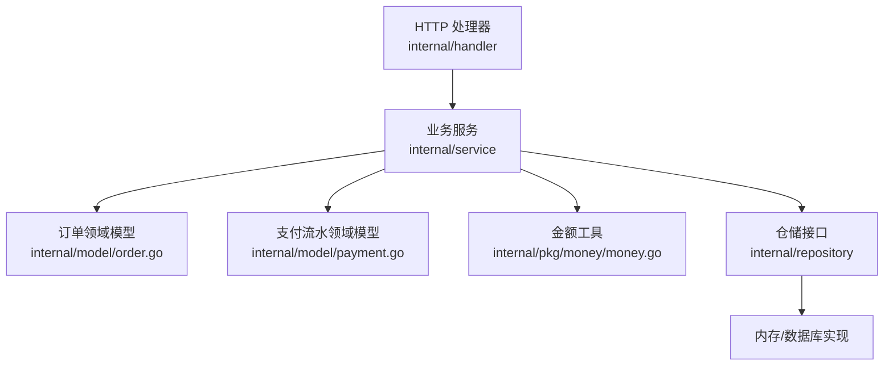
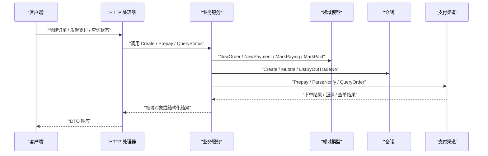
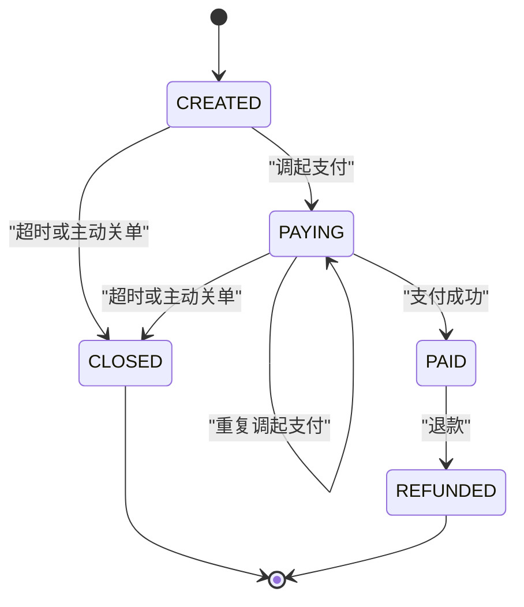
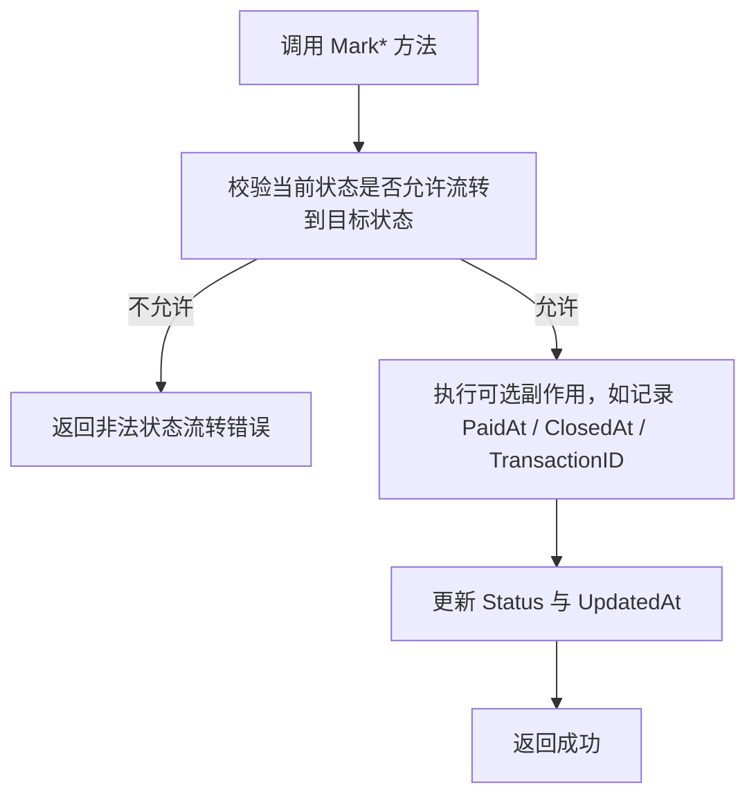
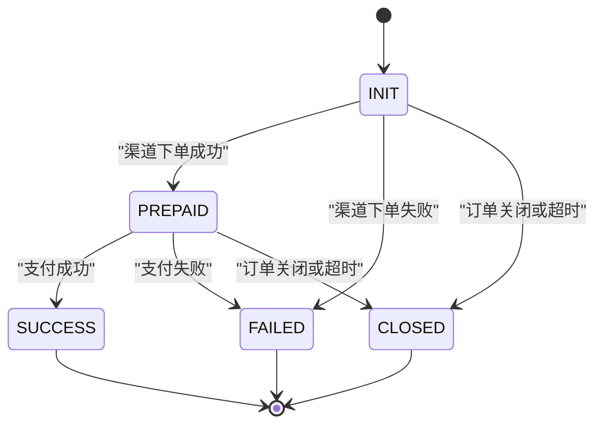
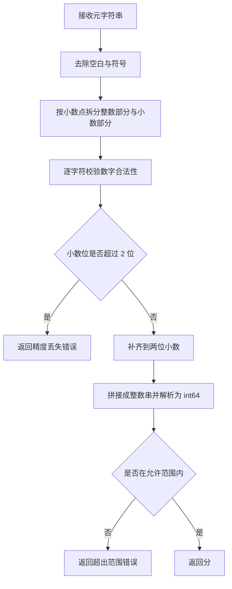
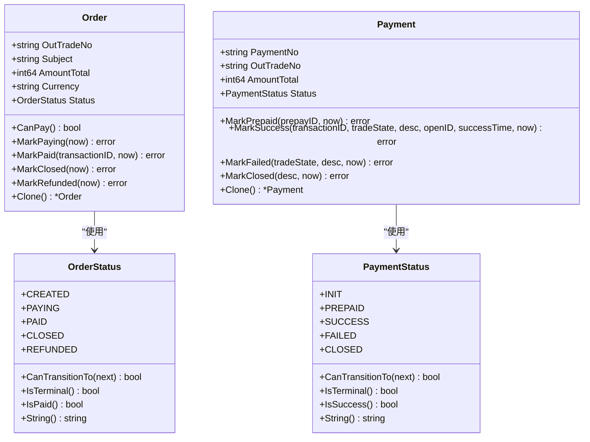
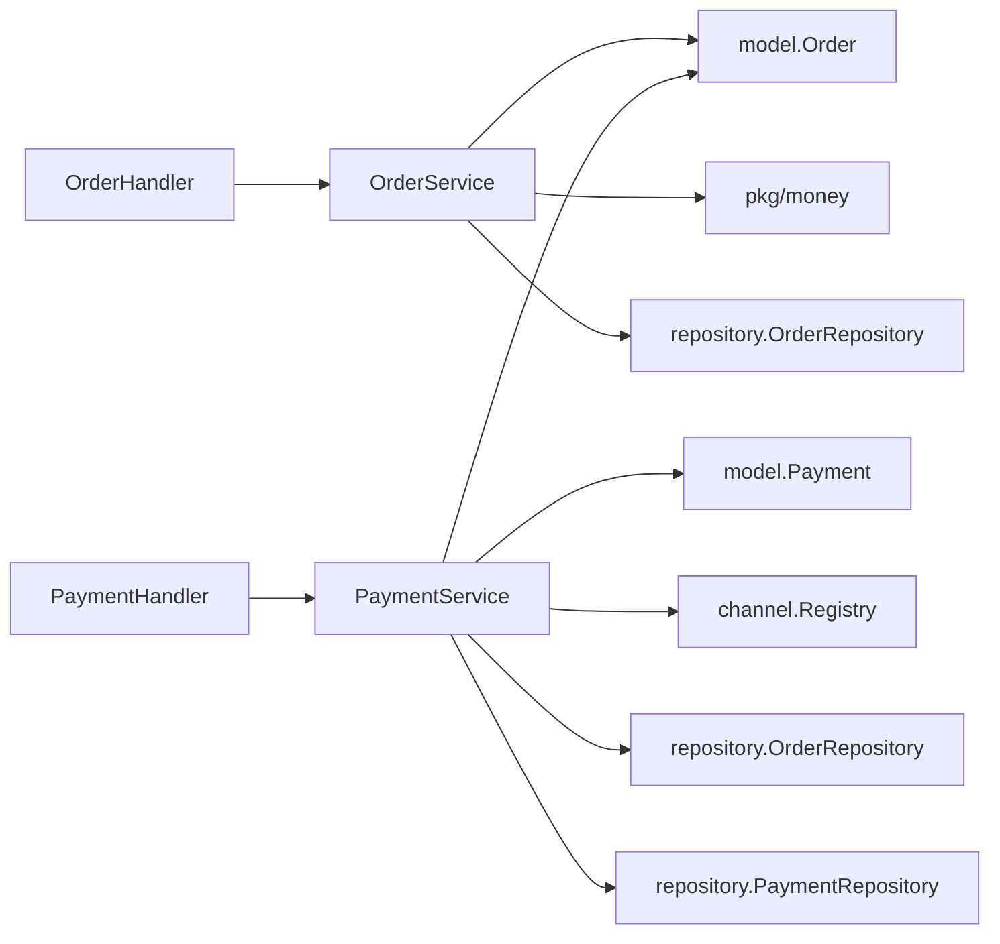

# 领域模型

<cite>
**本文引用的文件**   
- [internal/model/order.go](file://internal/model/order.go)
- [internal/model/payment.go](file://internal/model/payment.go)
- [internal/pkg/money/money.go](file://internal/pkg/money/money.go)
- [internal/service/order_service.go](file://internal/service/order_service.go)
- [internal/service/payment_service.go](file://internal/service/payment_service.go)
- [internal/handler/order_handler.go](file://internal/handler/order_handler.go)
- [internal/handler/payment_handler.go](file://internal/handler/payment_handler.go)
- [internal/dto/payment.go](file://internal/dto/payment.go)
</cite>

## 目录
1. [引言](#引言)
2. [项目结构中的领域层定位](#项目结构中的领域层定位)
3. [核心领域实体](#核心领域实体)
4. [架构总览](#架构总览)
5. [订单 Order 详细设计](#订单-order-详细设计)
6. [支付流水 Payment 详细设计](#支付流水-payment-详细设计)
7. [金额处理机制](#金额处理机制)
8. [领域模型如何封装业务规则](#领域模型如何封装业务规则)
9. [依赖关系分析](#依赖关系分析)
10. [性能与一致性特征](#性能与一致性特征)
11. [常见问题排查](#常见问题排查)
12. [结论](#结论)

## 引言
本文围绕支付系统的领域模型展开，重点解释以下目标：
- Order 实体的字段含义、状态机设计与业务规则。
- Payment 实体的作用、状态流转以及与 Order 的关联关系。
- 金额为什么全程使用 int64 存储「分」，以及元分转换的精度保证。
- 对外响应中 amount 和 amount_fen 双重输出的原因。
- 领域模型如何避免贫血模型问题，把状态变更、金额校验、幂等与对账语义收敛到实体与服务中。

## 项目结构中的领域层定位
本项目的领域模型位于 `internal/model`，由 `internal/service` 调用，并由 `internal/handler` 通过 DTO 转换为 HTTP 请求与响应。`internal/pkg/money` 提供金额工具，是领域模型的数值基础。

**图表来源**
- [internal/handler/order_handler.go:26-60](file://internal/handler/order_handler.go#L26-L60)
- [internal/handler/payment_handler.go:32-50](file://internal/handler/payment_handler.go#L32-L50)
- [internal/service/order_service.go:72-110](file://internal/service/order_service.go#L72-L110)
- [internal/service/payment_service.go:108-225](file://internal/service/payment_service.go#L108-L225)
- [internal/model/order.go:73-120](file://internal/model/order.go#L73-L120)
- [internal/model/payment.go:54-104](file://internal/model/payment.go#L54-L104)
- [internal/pkg/money/money.go:39-106](file://internal/pkg/money/money.go#L39-L106)

**章节来源**
- [internal/model/order.go:1-7](file://internal/model/order.go#L1-L7)
- [internal/service/order_service.go:1-19](file://internal/service/order_service.go#L1-L19)

## 核心领域实体
本项目有两个核心领域实体：
- Order：代表一笔商户订单，承载订单号、商品标题、总金额、币种、支付渠道、订单状态、支付者标识、客户端 IP、附加数据、渠道交易号与时间戳。
- Payment：代表一次支付尝试，承载流水号、所属订单号、支付渠道、交易类型、预支付会话标识、渠道交易号、本次支付金额、流水状态、渠道原始状态、付款人标识与时间戳。

两者都通过显式方法修改状态，而不是让外部直接赋值 Status 字段；同时提供 Clone 方法，防止仓储返回的内部指针被绕过状态机修改。

**章节来源**
- [internal/model/order.go:20-34](file://internal/model/order.go#L20-L34)
- [internal/model/order.go:73-102](file://internal/model/order.go#L73-L102)
- [internal/model/payment.go:10-24](file://internal/model/payment.go#L10-L24)
- [internal/model/payment.go:54-89](file://internal/model/payment.go#L54-L89)

## 架构总览
领域模型处于分层架构的核心位置：
- Handler 负责解析 HTTP 请求、参数校验、元分转换与响应组装。
- Service 负责编排 Order 与 Payment 的状态机、调用渠道网关、处理回调与查单、维护幂等与对账语义。
- Model 负责定义合法状态、状态流转、金额语义与实体行为。
- Repository 抽象持久化，当前骨架包含内存实现，便于测试。
- Channel 抽象支付渠道，支持 mock 与微信支付等具体实现。

**图表来源**
- [internal/handler/order_handler.go:26-60](file://internal/handler/order_handler.go#L26-L60)
- [internal/handler/payment_handler.go:32-50](file://internal/handler/payment_handler.go#L32-L50)
- [internal/service/order_service.go:72-110](file://internal/service/order_service.go#L72-L110)
- [internal/service/payment_service.go:108-225](file://internal/service/payment_service.go#L108-L225)
- [internal/model/order.go:108-170](file://internal/model/order.go#L108-L170)
- [internal/model/payment.go:92-150](file://internal/model/payment.go#L92-L150)

## 订单 Order 详细设计

### 字段含义
- OutTradeNo：商户订单号，作为业务主键。
- Subject：商品标题，会传给支付渠道作为描述。
- AmountTotal：订单总金额，单位为「分」。
- Currency：币种，默认 CNY。
- Channel：支付渠道编码。
- Status：订单状态，只能通过 Mark* 方法变更。
- OpenID：JSAPI 场景下的支付者标识。
- ClientIP：客户端 IP，用于风控与渠道侧要求。
- Attach：附加数据，渠道回调时原样返回。
- TransactionID：渠道侧交易号，支付成功后回填。
- CreatedAt / UpdatedAt / PaidAt / ClosedAt：关键时间戳。

这些字段不是纯数据容器，而是配合状态机方法共同表达订单语义。例如 AmountTotal 必须为正数且不超过单笔上限，Currency 默认 CNY，Status 不能由外部直接赋值。

**章节来源**
- [internal/model/order.go:73-102](file://internal/model/order.go#L73-L102)
- [internal/model/order.go:108-120](file://internal/model/order.go#L108-L120)

### 状态机设计
Order 的状态包括：
- CREATED：订单已创建，尚未调起任何支付。
- PAYING：已调起支付，等待用户完成付款。
- PAID：支付成功，终态之一，仍可流向 REFUNDED。
- CLOSED：订单已关闭，终态。
- REFUNDED：已退款，终态。

合法流转如下：
- CREATED → PAYING 或 CLOSED。
- PAYING → PAYING、PAID 或 CLOSED。
- PAID → REFUNDED。
- CLOSED 与 REFUNDED 为终态。

**图表来源**
- [internal/model/order.go:20-34](file://internal/model/order.go#L20-L34)
- [internal/model/order.go:43-50](file://internal/model/order.go#L43-L50)

### 业务规则封装
Order 的业务规则集中在以下几处：
- CanPay：只有 CREATED 或 PAYING 允许发起支付。
- MarkPaying：推进到 PAYING，并更新时间戳。
- MarkPaid：推进到 PAID，记录渠道交易号与支付时间。
- MarkClosed：推进到 CLOSED，记录关闭时间。
- MarkRefunded：只允许从 PAID 进入 REFUNDED。
- transit：所有状态变更的唯一入口，先校验再修改，避免脏状态。

**图表来源**
- [internal/model/order.go:122-170](file://internal/model/order.go#L122-L170)

**章节来源**
- [internal/model/order.go:52-71](file://internal/model/order.go#L52-L71)
- [internal/model/order.go:122-170](file://internal/model/order.go#L122-L170)

## 支付流水 Payment 详细设计

### 支付流水的作用
Payment 表示一次支付尝试。一个 Order 可能对应多条 Payment，因为用户可能取消、网络失败、重复点击或换支付方式。保留全部流水而不是覆盖更新，是对账与故障排查的前提。当出现“用户说付了钱但订单没变已支付”的问题时，可以通过流水还原当时发生了什么。

**章节来源**
- [internal/model/payment.go:54-59](file://internal/model/payment.go#L54-L59)

### 状态流转
Payment 的状态包括：
- INIT：流水已创建，尚未调起渠道下单。
- PREPAID：渠道下单成功，已拿到 prepay_id，等待用户付款。
- SUCCESS：支付成功，终态。
- FAILED：支付失败，终态。
- CLOSED：流水已关闭，终态。

合法流转如下：
- INIT → PREPAID、FAILED 或 CLOSED。
- PREPAID → SUCCESS、FAILED 或 CLOSED。
- SUCCESS、FAILED、CLOSED 为终态。

**图表来源**
- [internal/model/payment.go:10-24](file://internal/model/payment.go#L10-L24)
- [internal/model/payment.go:27-33](file://internal/model/payment.go#L27-L33)

### 与 Order 的关联关系
- Payment.OutTradeNo 指向 Order.OutTradeNo。
- Payment.AmountTotal 必须与 Order.AmountTotal 一致，这是回调金额校验的基础。
- Payment.Status 独立于 Order.Status：Order 可能已 PAID，而某条历史流水仍可能是 FAILED 或 CLOSED。
- Payment 的 SuccessTime、TransactionID、TradeState、TradeStateDesc、OpenID 来自渠道回调或查单结果，用于对账与排障。

**章节来源**
- [internal/model/payment.go:60-89](file://internal/model/payment.go#L60-L89)
- [internal/service/payment_service.go:320-333](file://internal/service/payment_service.go#L320-L333)

### 状态变更方法
- NewPayment：创建流水，初始状态为 INIT。
- MarkPrepaid：标记渠道下单成功，保存 prepay_id。
- MarkSuccess：标记支付成功，保存 transaction_id、trade_state、trade_state_desc、open_id 与 success_time。
- MarkFailed：标记支付失败，保存渠道原始状态与描述。
- MarkClosed：标记流水关闭。
- transit：统一校验与更新，复用 ErrInvalidTransition。

**章节来源**
- [internal/model/payment.go:91-150](file://internal/model/payment.go#L91-L150)

## 金额处理机制

### 为什么全程使用 int64 存储「分」
项目明确禁止在金额运算中使用 float64。原因是二进制浮点无法精确表示大多数十进制小数，例如 19.99 * 100 在 float64 下可能得到 1998.9999999999998，截断后少收 1 分钱。因此：
- Order.AmountTotal 是 int64，单位是分。
- Payment.AmountTotal 也是 int64，单位是分。
- 所有金额输入输出都通过 money 包进行字符串与整数运算，不经过浮点。

**章节来源**
- [internal/model/order.go:73-82](file://internal/model/order.go#L73-L82)
- [internal/model/payment.go:70-75](file://internal/model/payment.go#L70-L75)
- [internal/pkg/money/money.go:1-7](file://internal/pkg/money/money.go#L1-L7)

### 元分转换的精度保证
money 包提供：
- YuanToFen：将「元」字符串转换为「分」，严格校验格式、小数位数、符号、范围，拒绝静默四舍五入。
- FenToYuan：将「分」格式化为「元」字符串，始终保留两位小数，内部使用 big.Int 避免边界溢出。
- ValidateAmount：校验金额为正数且不超过单笔上限。
- Mul：计算 fen * n，防止极端值下静默溢出。

**图表来源**
- [internal/pkg/money/money.go:39-106](file://internal/pkg/money/money.go#L39-L106)

### 对外响应中 amount 和 amount_fen 的双重输出
对外响应同时包含：
- amount：人类可读的「元」字符串，适合前端展示。
- amount_fen：int64 形式的「分」，适合后端比较、排序、对账与二次计算。

这种设计既照顾用户体验，又避免前端再次做元分转换引入精度风险。

**章节来源**
- [internal/dto/payment.go:60-98](file://internal/dto/payment.go#L60-L98)
- [internal/dto/payment.go:100-112](file://internal/dto/payment.go#L100-L112)
- [internal/handler/payment_handler.go:87-108](file://internal/handler/payment_handler.go#L87-L108)

## 领域模型如何封装业务规则

### 避免贫血模型
贫血模型通常只有字段与 getter/setter，业务逻辑散落在 service 或 handler 中。本项目通过以下方式避免：
- Order 与 Payment 都有明确的 Status 类型与状态常量。
- 所有状态变更必须通过 Mark* 方法，transit 统一校验。
- CanPay、IsTerminal、IsPaid、IsSuccess 等方法把状态判断收敛到领域对象。
- NewOrder 与 NewPayment 统一初始化默认值，避免外部拼字面量导致 Currency、Status、时间戳不一致。
- Clone 方法防止仓储返回的内部指针被绕过状态机修改。

**图表来源**
- [internal/model/order.go:20-34](file://internal/model/order.go#L20-L34)
- [internal/model/order.go:73-183](file://internal/model/order.go#L73-L183)
- [internal/model/payment.go:10-24](file://internal/model/payment.go#L10-L24)
- [internal/model/payment.go:54-159](file://internal/model/payment.go#L54-L159)

### 业务规则的具体体现
- 金额校验：service 层调用 money.ValidateAmount，handler 层调用 req.AmountFen，确保传入 service 的金额已经是合法的分。
- 渠道选择：创建订单时必须确定渠道，发起支付时使用订单上记录的渠道，不允许临时跳变。
- JSAPI 必填 OpenID：service 层在 trade_type 为 JSAPI 时强制校验 openid。
- 回调金额校验：HandlePayload 在推进 PAID 之前比较 payload.AmountTotal 与 order.AmountTotal，不一致则拒绝。
- 幂等处理：已支付的订单重复回调直接返回成功，避免渠道无限重试。
- 非成功回调分类：CLOSED 关闭订单与流水，FAILED 只终结流水，NOTPAY / USERPAYING 等不做变更。

**章节来源**
- [internal/service/order_service.go:72-110](file://internal/service/order_service.go#L72-L110)
- [internal/service/payment_service.go:108-225](file://internal/service/payment_service.go#L108-L225)
- [internal/service/payment_service.go:282-379](file://internal/service/payment_service.go#L282-L379)
- [internal/service/payment_service.go:382-415](file://internal/service/payment_service.go#L382-L415)

## 依赖关系分析

**图表来源**
- [internal/handler/order_handler.go:13-21](file://internal/handler/order_handler.go#L13-L21)
- [internal/handler/payment_handler.go:16-24](file://internal/handler/payment_handler.go#L16-L24)
- [internal/service/order_service.go:21-50](file://internal/service/order_service.go#L21-L50)
- [internal/service/payment_service.go:34-73](file://internal/service/payment_service.go#L34-L73)

**章节来源**
- [internal/handler/order_handler.go:1-79](file://internal/handler/order_handler.go#L1-L79)
- [internal/handler/payment_handler.go:1-119](file://internal/handler/payment_handler.go#L1-L119)
- [internal/service/order_service.go:1-125](file://internal/service/order_service.go#L1-L125)
- [internal/service/payment_service.go:1-73](file://internal/service/payment_service.go#L1-L73)

## 性能与一致性特征

### 性能特征
- 查询支付状态默认只读本地数据，不调用渠道接口，避免高频轮询触发限流。
- 主动查单 SyncFromChannel 需要 sync=true 才触发，生产环境应由定时任务批量执行。
- 金额转换使用字符串与 big.Int，避免浮点误差，但会带来少量 CPU 开销；考虑到支付金额较小且调用频率有限，这是可接受的精度优先方案。

**章节来源**
- [internal/handler/payment_handler.go:53-85](file://internal/handler/payment_handler.go#L53-L85)
- [internal/service/payment_service.go:528-582](file://internal/service/payment_service.go#L528-L582)
- [internal/pkg/money/money.go:108-151](file://internal/pkg/money/money.go#L108-L151)

### 一致性特征
- 状态机在 transit 中先校验再修改，避免并发或异常导致的半更新。
- HandlePayload 在锁外快速判断 IsPaid，进入 Mutate 后再判一次，防止并发回调竞态。
- pickPayment 按渠道交易号精确匹配、最新未终结流水、最后一条流水优先级推断，减少掉单概率。
- markPaymentSuccess 中流水推进失败只记日志，不阻断回调应答，因为订单已支付的事实不可回退。

**章节来源**
- [internal/model/order.go:155-170](file://internal/model/order.go#L155-L170)
- [internal/service/payment_service.go:301-365](file://internal/service/payment_service.go#L301-L365)
- [internal/service/payment_service.go:417-453](file://internal/service/payment_service.go#L417-L453)
- [internal/service/payment_service.go:455-486](file://internal/service/payment_service.go#L455-L486)

## 常见问题排查

### 订单状态非法
现象：调用 Mark* 时报非法状态流转。
可能原因：
- 外部直接赋值 Status。
- 业务逻辑试图从 PAID 回退到 PAYING。
- 重复关单或重复退款。

排查建议：
- 检查是否通过 MarkPaying / MarkPaid / MarkClosed / MarkRefunded 修改状态。
- 检查 CanPay 与 unpayableError 分支。
- 检查订单当前状态与目标状态的合法映射。

**章节来源**
- [internal/model/order.go:36-65](file://internal/model/order.go#L36-L65)
- [internal/model/order.go:155-170](file://internal/model/order.go#L155-L170)
- [internal/service/payment_service.go:228-244](file://internal/service/payment_service.go#L228-L244)

### 金额不一致
现象：回调报金额与订单金额不一致。
可能原因：
- 前端篡改金额。
- 串单，A 订单回调投给 B 订单。
- 元分转换出错。

排查建议：
- 确认 handler 层 AmountFen 转换正确。
- 确认 service 层 ValidateAmount 通过。
- 确认 HandlePayload 中 payload.AmountTotal 与 order.AmountTotal 比较逻辑。

**章节来源**
- [internal/handler/order_handler.go:33-42](file://internal/handler/order_handler.go#L33-L42)
- [internal/service/order_service.go:72-75](file://internal/service/order_service.go#L72-L75)
- [internal/service/payment_service.go:320-333](file://internal/service/payment_service.go#L320-L333)

### 重复回调与幂等
现象：同一笔交易多次回调，但订单不再重复推进。
机制：
- 已支付订单直接返回 Idempotent=true。
- 并发回调在 Mutate 内再次判断 IsPaid。
- markPaymentSuccess 中若流水已是终态，返回已有流水而不报错。

**章节来源**
- [internal/service/payment_service.go:301-313](file://internal/service/payment_service.go#L301-L313)
- [internal/service/payment_service.go:342-365](file://internal/service/payment_service.go#L342-L365)
- [internal/service/payment_service.go:417-453](file://internal/service/payment_service.go#L417-L453)

### 流水找不到
现象：订单已支付但缺少支付流水。
机制：
- pickPayment 找不到匹配流水时返回错误。
- markPaymentSuccess 找不到流水时只记警告日志，不阻断订单已支付事实。

**章节来源**
- [internal/service/payment_service.go:455-486](file://internal/service/payment_service.go#L455-L486)
- [internal/service/payment_service.go:422-453](file://internal/service/payment_service.go#L422-L453)

## 结论
本项目的领域模型以 Order 与 Payment 为核心，通过显式状态、状态机方法与金额工具，把支付系统的关键业务规则收敛到领域层：
- Order 负责订单生命周期与终态约束。
- Payment 负责支付尝试的可追溯性与对账能力。
- money 包保证金额计算全程无浮点误差。
- service 层编排状态机、渠道交互、幂等与兜底逻辑。
- handler 与 dto 负责边界适配，同时暴露 amount 与 amount_fen 兼顾展示与计算。

这种设计避免了贫血模型常见的“状态随意改、金额乱算、回调难排查”问题，使资金相关逻辑具备编译期与运行期的双重保护，也为单元测试、回归测试与生产排障提供了清晰锚点。