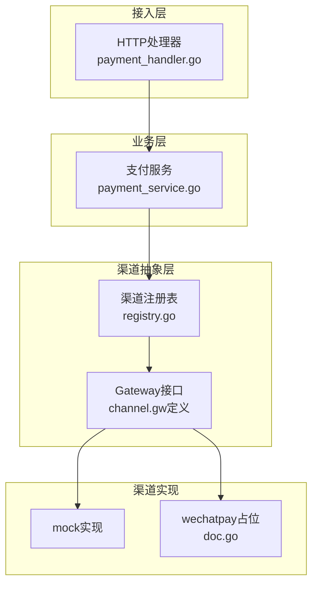
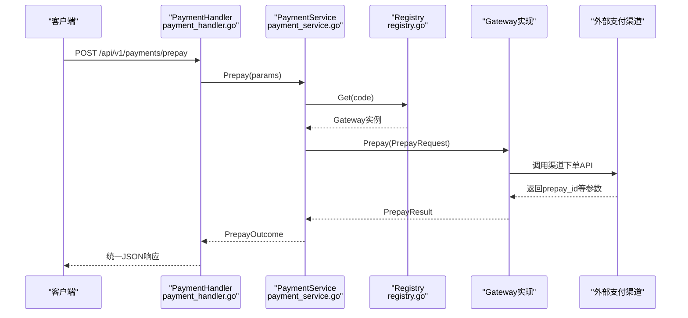
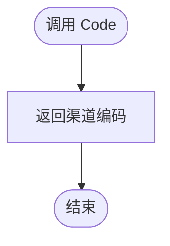
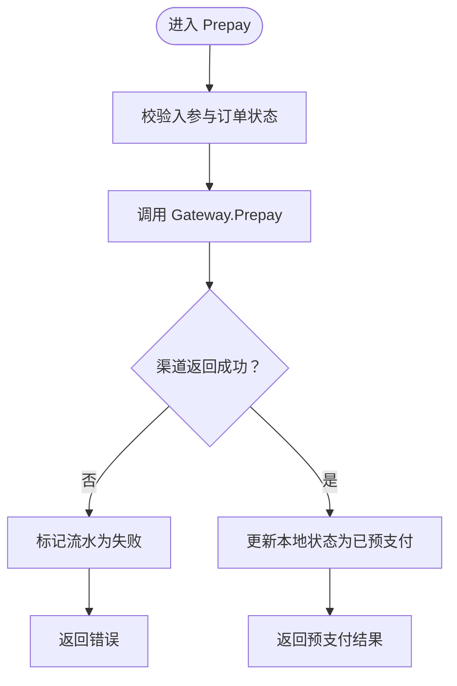
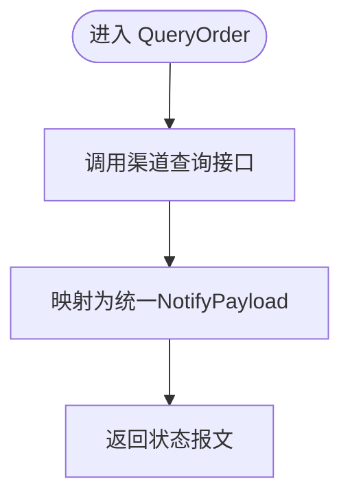
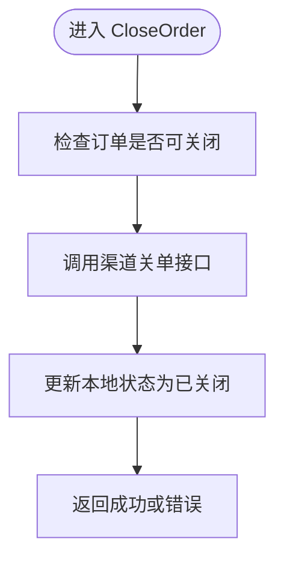
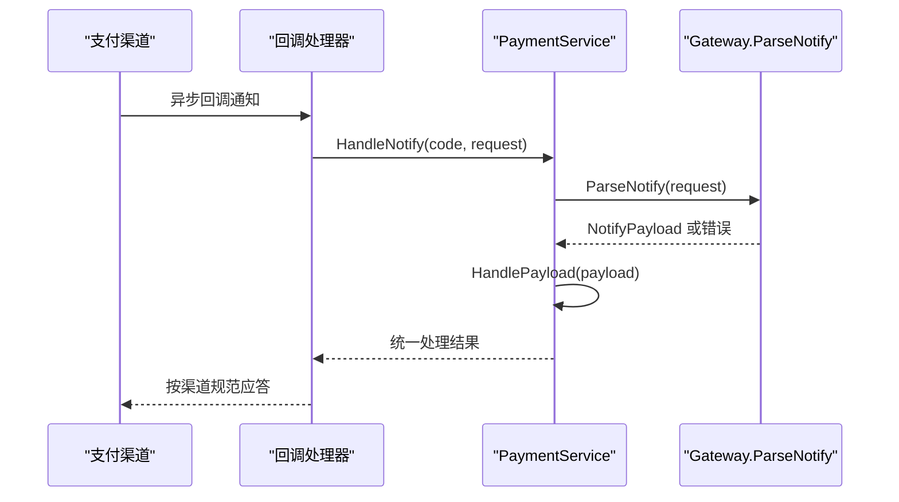
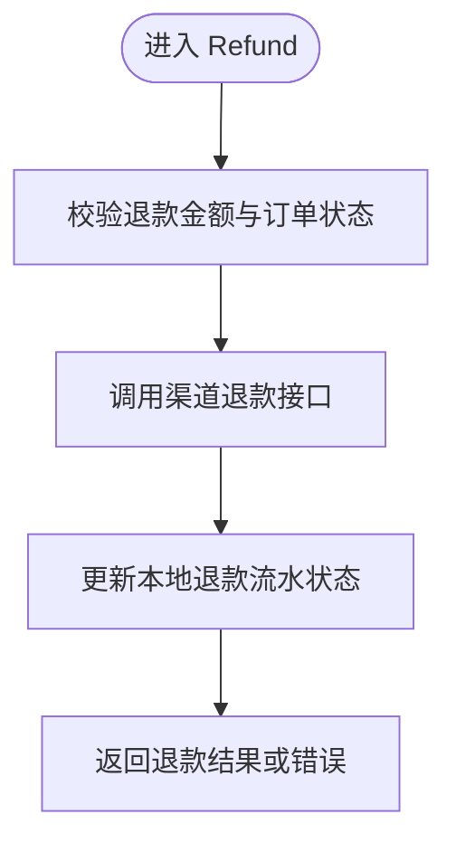
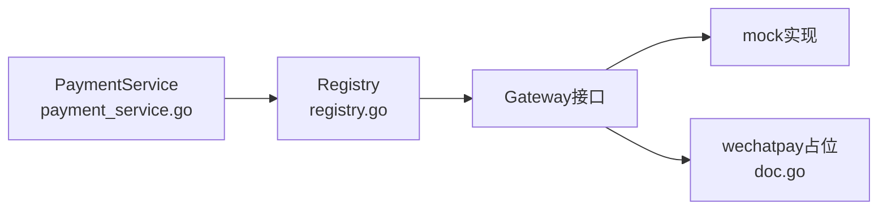

# Gateway接口设计

<cite>
**本文引用的文件**   
- [README.md](file://README.md)
- [registry.go](file://internal/channel/registry.go)
- [doc.go](file://internal/channel/wechatpay/doc.go)
- [payment_service.go](file://internal/service/payment_service.go)
- [payment_handler.go](file://internal/handler/payment_handler.go)
- [payment.go](file://internal/dto/payment.go)
</cite>

## 目录
1. [引言](#引言)
2. [项目结构](#项目结构)
3. [核心组件](#核心组件)
4. [架构总览](#架构总览)
5. [详细组件分析](#详细组件分析)
6. [依赖关系分析](#依赖关系分析)
7. [性能与一致性考虑](#性能与一致性考虑)
8. [故障排查指南](#故障排查指南)
9. [结论](#结论)

## 引言
本文件聚焦于支付服务中的渠道抽象层——`channel.Gateway` 接口，系统说明其六个核心方法的职责、参数约定、错误处理语义与业务约束。该接口是本项目实现多渠道统一接入的关键接缝：业务层只依赖 `Gateway`，不感知具体渠道 SDK；新增渠道只需实现这六个方法并在注册表中登记，即可被现有调用链自动使用。

## 项目结构
围绕 Gateway 的相关代码分布在以下位置：
- 渠道抽象与注册：`internal/channel/registry.go`
- 微信支付接入文档（占位包）：`internal/channel/wechatpay/doc.go`
- 业务编排与渠道调用：`internal/service/payment_service.go`
- HTTP 接入层：`internal/handler/payment_handler.go`
- 对外 DTO 与响应转换：`internal/dto/payment.go`
- 全局设计与错误码说明：`README.md`

**图表来源**
- [registry.go:11-24](file://internal/channel/registry.go#L11-L24)
- [doc.go:1-14](file://internal/channel/wechatpay/doc.go#L1-L14)
- [payment_service.go:108-177](file://internal/service/payment_service.go#L108-L177)
- [payment_handler.go:32-51](file://internal/handler/payment_handler.go#L32-L51)

**章节来源**
- [README.md:38-62](file://README.md#L38-L62)
- [registry.go:11-24](file://internal/channel/registry.go#L11-L24)
- [doc.go:1-14](file://internal/channel/wechatpay/doc.go#L1-L14)

## 核心组件
Gateway 接口定义了支付渠道的统一契约，包含以下六个方法：
- Code()：返回渠道编码，用于注册表索引与路由分发。
- Prepay(ctx, PrepayRequest)：发起预支付，返回前端调起参数或下单失败原因。
- QueryOrder(ctx, outTradeNo)：按商户订单号查询交易状态，返回统一的状态报文。
- CloseOrder(ctx, outTradeNo)：关闭未支付的订单。
- ParseNotify(ctx, *http.Request)：解析并验签渠道异步回调，返回统一状态报文。
- Refund(ctx, RefundRequest)：发起退款，返回退款结果或错误。

这些方法共同保证：
- 输入输出类型在渠道间一致，避免业务层为不同渠道写分支。
- 错误以 error 形式上抛，由 service/handler 统一映射为业务错误码与 HTTP 状态。
- 回调与查单共用同一状态模型，确保“主动查单”和“被动回调”对同一笔交易的结论一致。

**章节来源**
- [README.md:162-179](file://README.md#L162-L179)
- [doc.go:9-14](file://internal/channel/wechatpay/doc.go#L9-L14)

## 架构总览
下图展示一次典型预支付流程中，Gateway 如何被 service 层调用，以及注册表如何完成渠道选择。

**图表来源**
- [payment_handler.go:32-51](file://internal/handler/payment_handler.go#L32-L51)
- [payment_service.go:108-177](file://internal/service/payment_service.go#L108-L177)
- [registry.go:63-74](file://internal/channel/registry.go#L63-L74)

## 详细组件分析

### 方法一：Code()
- 职责：声明渠道的唯一编码，供注册表索引与运行时选择。
- 输入：无。
- 输出：字符串形式的渠道编码。
- 错误处理：若返回空编码，注册表会拒绝注册并报错。
- 业务语义：编码是渠道的“身份证”，必须稳定且唯一。

**图表来源**
- [registry.go:35-51](file://internal/channel/registry.go#L35-L51)

**章节来源**
- [registry.go:35-51](file://internal/channel/registry.go#L35-L51)

### 方法二：Prepay(ctx, PrepayRequest) → (*PrepayResult, error)
- 职责：将订单信息转换为渠道下单请求，并返回前端调起支付所需的参数。
- 输入：
  - ctx：上下文，携带日志、超时等信息。
  - PrepayRequest：包含商户订单号、商品描述、金额（分）、币种、附加信息、回调地址、交易类型、支付者标识、客户端IP等。
- 输出：
  - PrepayResult：包含 prepay_id、code_url、invoke_params 等渠道相关字段。
  - error：渠道不可用、参数非法、签名失败、网络异常等。
- 业务语义：
  - 成功时，service 会将支付流水推进到 PREPAID，订单推进到 PAYING。
  - 失败时，service 会将流水标记为 FAILED，订单保持可重试状态。
- 错误处理约定：
  - 渠道侧错误应原样上抛，service 层负责记录日志与落库状态。
  - 不应把渠道错误降级为内部错误，以免丢失安全告警信号。

**图表来源**
- [payment_service.go:108-177](file://internal/service/payment_service.go#L108-L177)

**章节来源**
- [payment_service.go:108-177](file://internal/service/payment_service.go#L108-L177)
- [payment_handler.go:32-51](file://internal/handler/payment_handler.go#L32-L51)
- [payment.go:44-58](file://internal/dto/payment.go#L44-L58)

### 方法三：QueryOrder(ctx, outTradeNo) → (*NotifyPayload, error)
- 职责：根据商户订单号向渠道查询当前交易状态。
- 输入：
  - ctx：上下文。
  - outTradeNo：商户订单号。
- 输出：
  - NotifyPayload：统一交易状态报文，包含订单号、交易状态、金额、时间等。
  - error：渠道不可用、订单不存在、网络异常等。
- 业务语义：
  - 与 ParseNotify 返回相同结构，使主动查单可直接复用回调处理路径，避免“回调一条路、查单另一条路”导致结论不一致。
  - 常用于掉单兜底、定时同步、用户手动触发对齐。

**图表来源**
- [README.md:179-179](file://README.md#L179-L179)
- [payment_service.go:571-571](file://internal/service/payment_service.go#L571-L571)

**章节来源**
- [README.md:179-179](file://README.md#L179-L179)
- [payment_service.go:571-571](file://internal/service/payment_service.go#L571-L571)

### 方法四：CloseOrder(ctx, outTradeNo) → error
- 职责：关闭尚未支付的订单，防止长期占用库存或资源。
- 输入：
  - ctx：上下文。
  - outTradeNo：商户订单号。
- 输出：error：渠道不支持、订单不存在、订单已支付或已关闭等。
- 业务语义：
  - 通常由定时任务或业务超时逻辑触发。
  - 成功后，service 层应将订单与支付流水推进到 CLOSED 相关状态。

**章节来源**
- [README.md:169-176](file://README.md#L169-L176)

### 方法五：ParseNotify(ctx, *http.Request) → (*NotifyPayload, error)
- 职责：解析并验签渠道异步回调通知，构造统一的 NotifyPayload。
- 输入：
  - ctx：上下文。
  - *http.Request：完整请求对象，因为真实渠道验签需要读取特定请求头与原始 body。
- 输出：
  - NotifyPayload：统一交易状态报文。
  - error：验签失败、解密失败、报文格式错误、缺少必要字段等。
- 业务语义：
  - 这是安全边界：验签与解密必须在 Gateway 实现内完成，不能跳过。
  - 解析后的 payload 交由 service 层的 HandlePayload 统一处理，保证幂等与状态机正确流转。

**图表来源**
- [payment_service.go:258-275](file://internal/service/payment_service.go#L258-L275)
- [doc.go:63-74](file://internal/channel/wechatpay/doc.go#L63-L74)

**章节来源**
- [payment_service.go:258-275](file://internal/service/payment_service.go#L258-L275)
- [doc.go:63-74](file://internal/channel/wechatpay/doc.go#L63-L74)
- [README.md:240-246](file://README.md#L240-L246)

### 方法六：Refund(ctx, RefundRequest) → (*RefundResult, error)
- 职责：发起退款，返回退款结果或错误。
- 输入：
  - ctx：上下文。
  - RefundRequest：包含原订单号、退款金额、退款原因等。
- 输出：
  - RefundResult：退款单号、退款状态、渠道退款流水等。
  - error：渠道不支持、权限不足、金额超限、重复退款等。
- 业务语义：
  - 当前 mock 实现返回“功能未实现”的错误码，HTTP 层暂未暴露退款接口。
  - 接入真实渠道后，需遵循渠道退款 API 的安全要求与幂等策略。

**章节来源**
- [README.md:286-292](file://README.md#L286-L292)
- [README.md:136-158](file://README.md#L136-L158)

## 依赖关系分析
Gateway 通过 Registry 进行运行时查找，service 层仅依赖接口而非具体实现。这种设计降低了耦合度，便于扩展新渠道。

**图表来源**
- [registry.go:11-24](file://internal/channel/registry.go#L11-L24)
- [doc.go:1-14](file://internal/channel/wechatpay/doc.go#L1-L14)
- [payment_service.go:108-177](file://internal/service/payment_service.go#L108-L177)

**章节来源**
- [registry.go:11-24](file://internal/channel/registry.go#L11-L24)
- [doc.go:1-14](file://internal/channel/wechatpay/doc.go#L1-L14)
- [payment_service.go:108-177](file://internal/service/payment_service.go#L108-L177)

## 性能与一致性考虑
- 回调与查单共用 NotifyPayload：避免两套逻辑导致状态不一致，降低掉单风险。
- 金额单位统一为“分”：内部存储与计算使用 int64，避免浮点精度问题。
- 内存仓储并发安全：读多写少场景下使用读写锁与快照返回，保证并发安全与调用方隔离。
- request_id 贯穿链路：便于全链路日志追踪与问题定位。

**章节来源**
- [README.md:193-213](file://README.md#L193-L213)

## 故障排查指南
- 验签或解密失败：属于安全类错误，应由 Gateway 实现直接返回错误，service 层不得降级为内部错误。
- 回调金额与订单金额不一致：属于资金防线报警，需人工介入核对。
- 渠道未注册：检查启动期配置与 Registry 注册逻辑。
- 渠道功能未实现：mock 退款默认返回未实现错误，接入真实渠道后需补齐实现。

**章节来源**
- [README.md:136-158](file://README.md#L136-L158)
- [README.md:240-246](file://README.md#L240-L246)

## 结论
Gateway 接口通过六个方法统一了多渠道接入契约，使业务层无需关心具体渠道差异。配合 Registry 的运行时注册机制、service 层的统一状态处理与 DTO 的对外契约，项目实现了高内聚、低耦合的支付架构。实现者在接入新渠道时，只需严格遵循接口方法与错误语义，并确保回调验签、金额精度与幂等性，即可无缝融入现有链路。