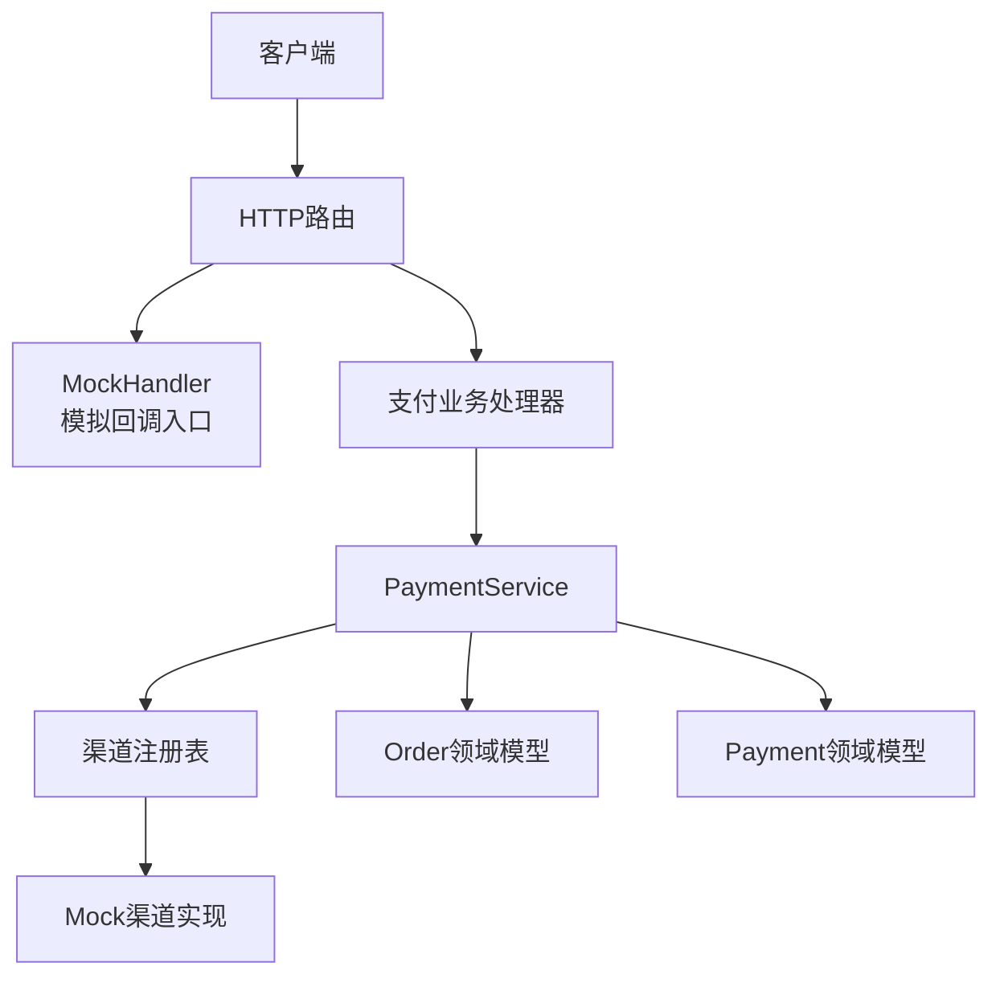
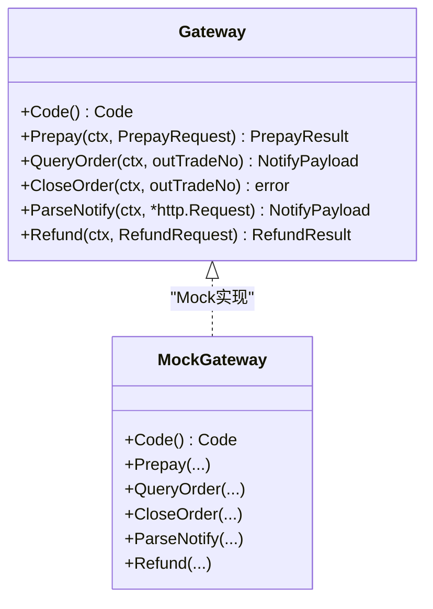
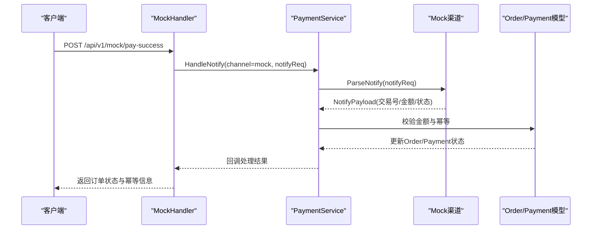
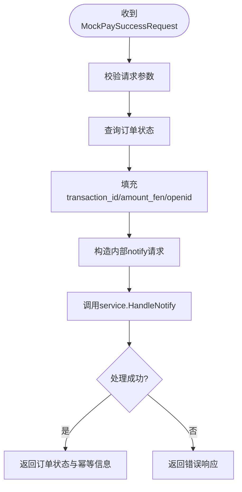
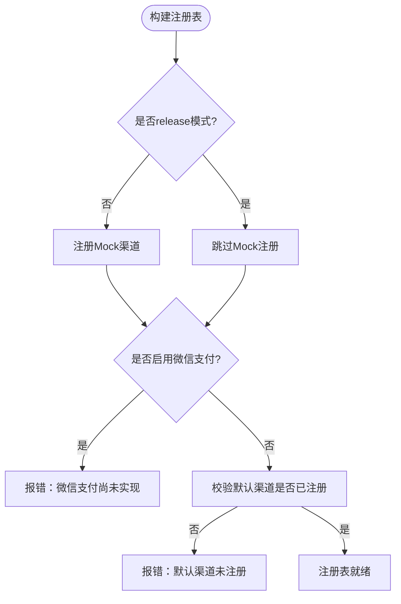
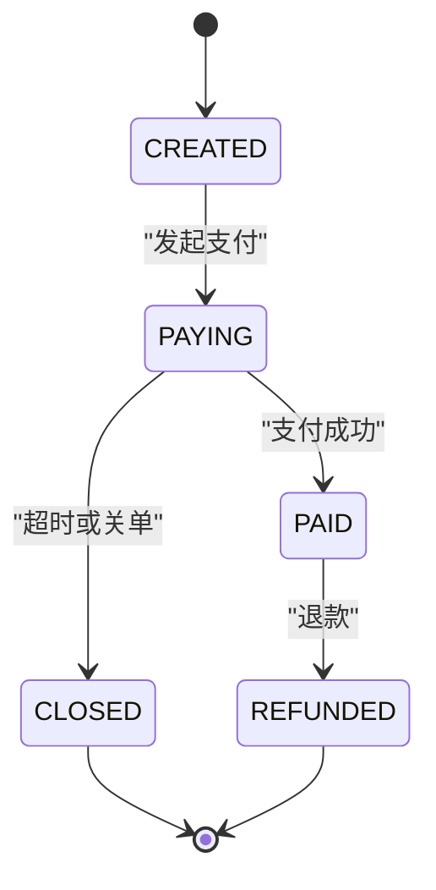
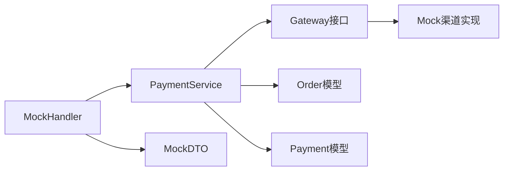
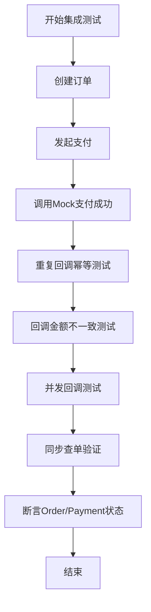

# Mock渠道实现

<cite>
**本文引用的文件**   
- [README.md](file://README.md)
- [internal/channel/registry.go](file://internal/channel/registry.go)
- [internal/app/app.go](file://internal/app/app.go)
- [internal/handler/mock_trigger.go](file://internal/handler/mock_trigger.go)
- [internal/dto/payment.go](file://internal/dto/payment.go)
- [internal/model/order.go](file://internal/model/order.go)
- [internal/model/payment.go](file://internal/model/payment.go)
- [internal/service/payment_service.go](file://internal/service/payment_service.go)
</cite>

## 目录
1. [引言](#引言)
2. [项目结构与Mock定位](#项目结构与mock定位)
3. [核心组件与接口契约](#核心组件与接口契约)
4. [架构总览](#架构总览)
5. [详细组件分析](#详细组件分析)
6. [依赖关系分析](#依赖关系分析)
7. [性能与并发特性](#性能与并发特性)
8. [测试最佳实践](#测试最佳实践)
9. [生产禁用与安全策略](#生产禁用与安全策略)
10. [故障排查指南](#故障排查指南)
11. [结论](#结论)

## 引言
本文件面向Mock支付渠道的实现与使用，目标是帮助开发者理解：
- Mock渠道为何存在、在开发测试中扮演什么角色；
- Mock如何遵循Gateway接口契约，模拟支付成功、失败、超时等场景；
- Mock的状态管理机制与真实支付流程时序的对应关系；
- 如何通过配置控制不同测试场景；
- 单元测试与集成测试的最佳实践；
- 生产环境禁用Mock的安全红线。

当前仓库以内存仓储和Mock渠道跑通「下单 → 发起支付 → 回调 → 查单」全流程，并明确说明：当前版本只能以Mock渠道运行，release模式下会刻意不注册Mock，从而避免生产暴露调试能力。

**章节来源**
- [README.md:5-11](file://README.md#L5-L11)

## 项目结构与Mock定位
Mock相关代码分布在以下位置：
- 渠道抽象层：`internal/channel`，定义Gateway接口与注册表；
- Mock渠道实现：位于`internal/channel/mock`（当前为骨架占位，由装配层按配置注册）；
- Mock调试入口：`internal/handler/mock_trigger.go`，提供`POST /api/v1/mock/pay-success`；
- DTO模型：`internal/dto/payment.go`，定义Mock请求与响应结构；
- 领域模型：`internal/model/order.go`、`internal/model/payment.go`，固化订单与流水状态机；
- 服务层：`internal/service/payment_service.go`，串联渠道调用与状态更新；
- 装配层：`internal/app/app.go`，负责按模式注册Mock渠道与路由。

**图表来源**
- [internal/handler/mock_trigger.go:29-51](file://internal/handler/mock_trigger.go#L29-L51)
- [internal/app/app.go:108-121](file://internal/app/app.go#L108-L121)
- [internal/channel/registry.go:11-24](file://internal/channel/registry.go#L11-L24)
- [internal/model/order.go:20-34](file://internal/model/order.go#L20-L34)
- [internal/model/payment.go:10-24](file://internal/model/payment.go#L10-L24)

**章节来源**
- [README.md:38-59](file://README.md#L38-L59)
- [internal/app/app.go:108-121](file://internal/app/app.go#L108-L121)

## 核心组件与接口契约
Gateway接口是渠道抽象层的唯一接缝，Mock渠道需要实现该接口的6个方法：
- `Code()`：返回渠道编码；
- `Prepay(ctx, PrepayRequest)`：发起预支付；
- `QueryOrder(ctx, outTradeNo)`：主动查询订单状态；
- `CloseOrder(ctx, outTradeNo)`：关闭订单；
- `ParseNotify(ctx, *http.Request)`：解析渠道回调报文；
- `Refund(ctx, RefundRequest)`：发起退款。

Mock渠道的设计目标不是替代真实渠道，而是让service层、handler层、状态机、金额校验、幂等逻辑能在没有外部依赖的情况下被端到端验证。

**图表来源**
- [README.md:168-176](file://README.md#L168-L176)

**章节来源**
- [README.md:162-179](file://README.md#L162-L179)

## 架构总览
Mock渠道参与的关键流程包括：
- 启动期：根据server.mode决定是否注册Mock渠道；
- 下单期：service调用Gateway.Prepay，将payment标记为PREPAID；
- 回调期：MockHandler构造同构回调请求，走service.HandleNotify，最终驱动Order与Payment状态机；
- 查询期：QueryOrder与ParseNotify共用NotifyPayload语义，保证主动查单与回调路径一致。

**图表来源**
- [internal/handler/mock_trigger.go:43-117](file://internal/handler/mock_trigger.go#L43-L117)
- [internal/service/payment_service.go:153-186](file://internal/service/payment_service.go#L153-L186)
- [internal/model/order.go:122-170](file://internal/model/order.go#L122-L170)
- [internal/model/payment.go:106-150](file://internal/model/payment.go#L106-L150)

**章节来源**
- [internal/handler/mock_trigger.go:29-51](file://internal/handler/mock_trigger.go#L29-L51)
- [internal/service/payment_service.go:153-186](file://internal/service/payment_service.go#L153-L186)

## 详细组件分析

### MockHandler：模拟回调入口
MockHandler提供调试接口，用于在不依赖真实渠道的情况下触发支付成功回调。其关键行为包括：
- 接收MockPaySuccessRequest；
- 查询订单状态，获取订单金额、OpenID等上下文；
- 构造与真实回调同构的HTTP请求；
- 通过service.HandleNotify进入统一回调处理路径；
- 返回订单状态、是否已支付、交易号与幂等标志。

**图表来源**
- [internal/handler/mock_trigger.go:43-117](file://internal/handler/mock_trigger.go#L43-L117)
- [internal/dto/payment.go:114-141](file://internal/dto/payment.go#L114-L141)

**章节来源**
- [internal/handler/mock_trigger.go:29-117](file://internal/handler/mock_trigger.go#L29-L117)
- [internal/dto/payment.go:114-141](file://internal/dto/payment.go#L114-L141)

### 渠道注册表与Mock注册策略
Registry是并发安全的渠道注册中心，Mock渠道仅在非release模式下注册。这样做的原因：
- 防止生产环境暴露Mock调试能力；
- 避免调用方用channel=mock创建订单却无真实资金流入；
- release模式下若未实现真实渠道，则直接启动失败，避免“配置可用但实际不可用”的误判。

**图表来源**
- [internal/app/app.go:108-152](file://internal/app/app.go#L108-L152)
- [internal/channel/registry.go:31-52](file://internal/channel/registry.go#L31-L52)

**章节来源**
- [internal/app/app.go:108-152](file://internal/app/app.go#L108-L152)
- [internal/channel/registry.go:11-52](file://internal/channel/registry.go#L11-L52)

### 领域模型与状态机
Mock渠道的状态管理必须与领域模型保持一致：
- Order状态：CREATED → PAYING → PAID/CLOSED/REFUNDED；
- Payment状态：INIT → PREPAID → SUCCESS/FAILED/CLOSED；
- 所有状态变更通过Mark*方法进入transit校验，非法流转直接报错；
- Mock回调成功后，Order标记为PAID，Payment标记为SUCCESS，并回填交易号、交易状态、描述、OpenID与成功时间。

**图表来源**
- [internal/model/order.go:20-50](file://internal/model/order.go#L20-L50)
- [internal/model/order.go:122-170](file://internal/model/order.go#L122-L170)

**章节来源**
- [internal/model/order.go:20-50](file://internal/model/order.go#L20-L50)
- [internal/model/order.go:122-170](file://internal/model/order.go#L122-L170)
- [internal/model/payment.go:10-33](file://internal/model/payment.go#L10-L33)
- [internal/model/payment.go:106-150](file://internal/model/payment.go#L106-L150)

### Mock渠道对Gateway六方法的实现要点
虽然Mock具体实现位于`internal/channel/mock`，但从现有代码可明确其行为约束与对接点：
- Code：返回Mock渠道编码，供注册表与服务层识别；
- Prepay：应返回预支付结果，使service能标记Payment为PREPAID；
- QueryOrder：返回NotifyPayload，与ParseNotify语义一致；
- CloseOrder：支持订单关闭；
- ParseNotify：解析MockHandler构造的回调报文，输出交易号、金额、状态、OpenID等；
- Refund：当前骨架阶段返回未实现错误，HTTP层未暴露。

这些方法共同保证Mock渠道能完整参与下单、回调、查单、关单、退款等生命周期，即使不连接真实支付网关。

**章节来源**
- [README.md:168-176](file://README.md#L168-L176)
- [internal/handler/mock_trigger.go:80-104](file://internal/handler/mock_trigger.go#L80-L104)

## 依赖关系分析
Mock相关依赖链如下：
- handler层依赖service层；
- service层依赖channel.Gateway接口；
- channel层通过Registry管理Mock实现；
- model层提供Order与Payment状态机；
- dto层提供Mock请求与响应结构。

**图表来源**
- [internal/handler/mock_trigger.go:29-51](file://internal/handler/mock_trigger.go#L29-L51)
- [internal/service/payment_service.go:153-186](file://internal/service/payment_service.go#L153-L186)
- [internal/dto/payment.go:114-141](file://internal/dto/payment.go#L114-L141)

**章节来源**
- [internal/handler/mock_trigger.go:29-51](file://internal/handler/mock_trigger.go#L29-L51)
- [internal/service/payment_service.go:153-186](file://internal/service/payment_service.go#L153-L186)
- [internal/dto/payment.go:114-141](file://internal/dto/payment.go#L114-L141)

## 性能与并发特性
- 渠道注册表使用RWMutex保护map，读多写少场景开销低；
- 内存仓储采用draft-copy-then-swap策略，对外返回副本，避免外部修改污染内部数据；
- Mock回调通过service.HandleNotify处理，复用幂等与金额校验逻辑；
- 日志贯穿request_id，便于一次请求链路追踪。

这些设计使Mock不仅适合功能验证，也适合并发与幂等测试。

**章节来源**
- [internal/channel/registry.go:11-24](file://internal/channel/registry.go#L11-L24)
- [README.md:207-213](file://README.md#L207-L213)

## 测试最佳实践

### 单元测试建议
- 针对Gateway接口编写Mock实现时，应覆盖：
  - Prepay成功与失败；
  - QueryOrder返回不同trade_state；
  - ParseNotify解析异常与字段缺失；
  - Refund未实现或失败；
- 针对Order与Payment状态机，应穷举合法与非法流转；
- 针对金额校验，应覆盖分元转换、精度限制、回调金额与订单金额不一致。

### 集成测试建议
- 使用`POST /api/v1/mock/pay-success`进行端到端验证：
  - 正常成功回调；
  - 重复回调幂等；
  - 回调金额与订单金额不一致；
  - 并发回调竞争；
- 结合`GET /api/v1/payments/:out_trade_no?sync=true`验证主动查单路径；
- 在debug模式下验证Mock路由可用，在release模式下验证Mock路由不存在。

**图表来源**
- [internal/handler/mock_trigger.go:43-117](file://internal/handler/mock_trigger.go#L43-L117)
- [internal/dto/payment.go:114-141](file://internal/dto/payment.go#L114-L141)

**章节来源**
- [README.md:118-134](file://README.md#L118-L134)
- [internal/handler/mock_trigger.go:43-117](file://internal/handler/mock_trigger.go#L43-L117)

## 生产禁用与安全策略
Mock渠道在生产环境必须禁用，原因包括：
- Mock回调能把任意订单改成已支付，暴露即等于资金漏洞；
- 调用方可用channel=mock创建订单，导致报表统计失真；
- release模式刻意不注册Mock，且默认渠道必须真实可用；
- 回调验签必须由真实渠道实现完成，Mock跳过验签仅用于开发测试。

安全红线：
- certs目录三层排除，密钥不得进入git或镜像；
- mock路由不在release注册；
- 回调必须验签；
- 报文优先于内部记录；
- 日志不打印密钥、证书内容与完整回调报文。

**章节来源**
- [README.md:240-246](file://README.md#L240-L246)
- [internal/app/app.go:112-121](file://internal/app/app.go#L112-L121)
- [internal/handler/mock_trigger.go:29-34](file://internal/handler/mock_trigger.go#L29-L34)

## 故障排查指南
常见问题与定位思路：
- 启动时报错“release模式下没有可用的支付渠道”：说明release未注册Mock且微信支付未实现，需切换debug或使用真实渠道；
- “渠道未注册”：检查default_channel是否在Registry中；
- 回调金额不一致：确认MockPaySuccessRequest中amount_fen是否与订单金额一致；
- 幂等命中：重复回调应返回idempotent=true，不应重复推进订单状态；
- 状态非法流转：检查Order/Payment状态机调用是否正确。

**章节来源**
- [internal/app/app.go:134-149](file://internal/app/app.go#L134-L149)
- [internal/model/order.go:155-170](file://internal/model/order.go#L155-L170)
- [internal/model/payment.go:139-150](file://internal/model/payment.go#L139-L150)

## 结论
Mock渠道的核心价值在于：
- 为开发与测试提供可预测的支付行为模拟；
- 让service层、handler层、领域状态机、金额校验与幂等逻辑在无外部依赖下闭环验证；
- 通过Gateway接口契约，确保Mock与未来真实渠道具备一致的接入方式；
- 通过release禁用与严格安全约束，避免Mock成为生产风险面。

在实现Mock渠道时，应始终围绕Gateway六方法、领域状态机、金额与幂等校验、以及生产禁用策略展开，确保Mock既能跑通链路，又不会引入安全隐患。