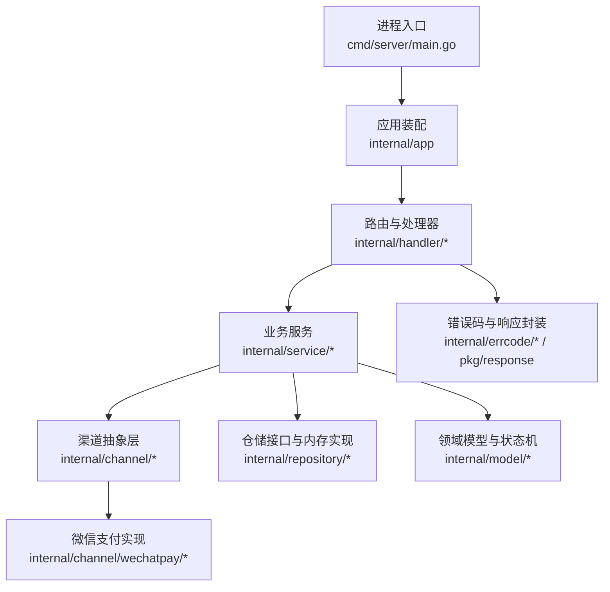
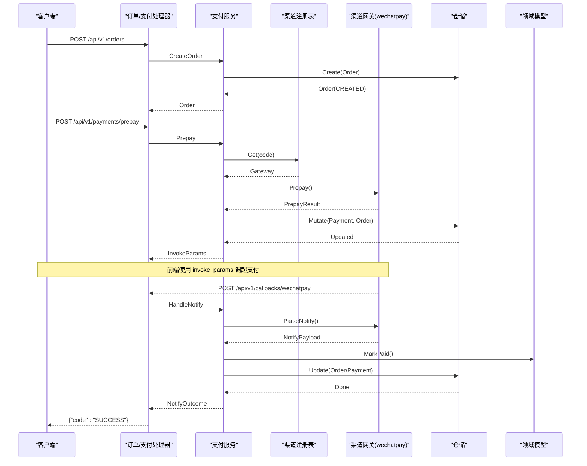
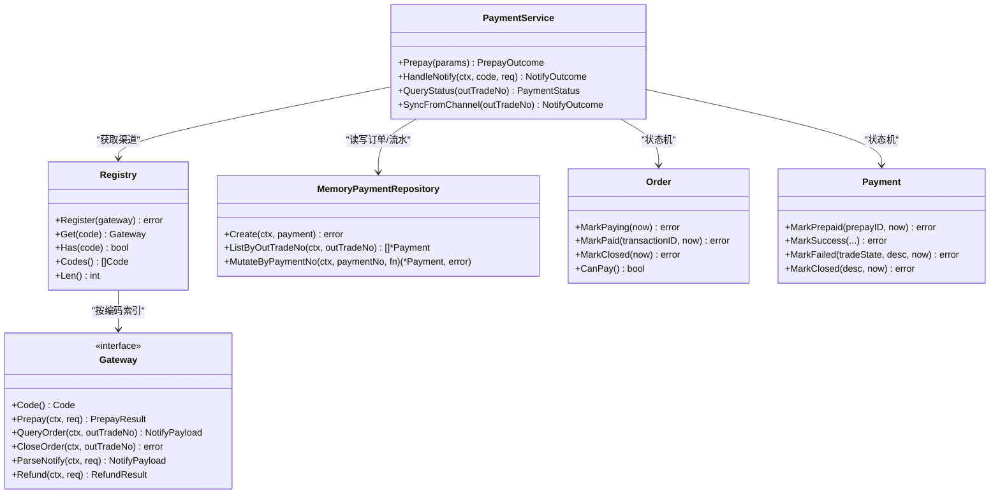

# 微信支付接入指南

<cite>
**本文引用的文件**   
- [README.md](file://README.md)
- [config.yaml](file://configs/config.yaml)
- [config.go](file://internal/config/config.go)
- [doc.go](file://internal/channel/wechatpay/doc.go)
- [payment_handler.go](file://internal/handler/payment_handler.go)
- [callback_handler.go](file://internal/handler/callback_handler.go)
- [payment_service.go](file://internal/service/payment_service.go)
- [order_handler.go](file://internal/handler/order_handler.go)
- [order_service.go](file://internal/service/order_service.go)
- [payment.go](file://internal/model/payment.go)
- [order.go](file://internal/model/order.go)
- [registry.go](file://internal/channel/registry.go)
- [memory_payment.go](file://internal/repository/memory_payment.go)
- [errcode.go](file://internal/errcode/errcode.go)
- [main.go](file://cmd/server/main.go)
</cite>

## 目录
1. [引言](#引言)
2. [项目结构](#项目结构)
3. [核心组件](#核心组件)
4. [架构总览](#架构总览)
5. [详细组件分析](#详细组件分析)
6. [依赖关系分析](#依赖关系分析)
7. [性能与一致性](#性能与一致性)
8. [配置与安全](#配置与安全)
9. [回调验签与幂等](#回调验签与幂等)
10. [常见错误码与排障](#常见错误码与排障)
11. [生产监控与上线清单](#生产监控与上线清单)
12. [结论](#结论)

## 引言
本指南面向需要在现有支付服务骨架上接入微信支付的团队。仓库已提供分层架构、领域状态机、渠道抽象层与内存仓储，但微信支付真实实现仍为占位包。本文重点说明：
- 微信支付证书模式与公钥模式的差异、适用场景与安全特性
- APIv3 密钥管理、证书下载与验签流程
- 下单、支付结果通知、订单查询、退款等接口的调用方式
- 回调验签与幂等处理机制
- 完整配置示例与敏感信息管理
- 常见错误码处理方案与调试技巧
- 生产环境监控告警与数据一致性保障
- 从开发到上线的部署清单与检查项

## 项目结构
本项目采用 Go + Gin 的分层架构，入口在进程启动层，HTTP 接入层负责解析请求并调用业务服务，业务服务通过渠道抽象层对接具体支付通道（当前默认 mock，微信支付待实现）。

图示来源
- [main.go:31-124](file://cmd/server/main.go#L31-L124)
- [README.md:38-62](file://README.md#L38-L62)

章节来源
- [README.md:38-62](file://README.md#L38-L62)
- [main.go:31-124](file://cmd/server/main.go#L31-L124)

## 核心组件
- 进程与配置加载：负责参数解析、配置校验、HTTP 服务启动与优雅关闭。
- HTTP 接入层：订单创建、发起支付、支付状态查询、渠道回调入口。
- 业务服务层：订单创建、发起支付、回调处理、主动查单兜底。
- 渠道抽象层：统一 Gateway 接口，屏蔽不同支付通道差异；当前默认 mock，微信支付为占位包。
- 领域模型与状态机：订单与支付流水的状态定义与合法流转规则。
- 仓储层：内存实现，支持并发安全与快照返回。
- 错误码体系：统一业务错误码与 HTTP 状态映射。

章节来源
- [README.md:162-214](file://README.md#L162-L214)
- [payment_service.go:34-73](file://internal/service/payment_service.go#L34-L73)
- [registry.go:11-24](file://internal/channel/registry.go#L11-L24)
- [order.go:20-50](file://internal/model/order.go#L20-L50)
- [payment.go:10-33](file://internal/model/payment.go#L10-L33)
- [errcode.go:1-18](file://internal/errcode/errcode.go#L1-L18)

## 架构总览
下图展示一次 JSAPI 下单到回调落库的关键路径，以及后续查询与同步能力。

图示来源
- [order_handler.go:23-60](file://internal/handler/order_handler.go#L23-L60)
- [payment_handler.go:26-51](file://internal/handler/payment_handler.go#L26-L51)
- [payment_service.go:108-226](file://internal/service/payment_service.go#L108-L226)
- [callback_handler.go:44-86](file://internal/handler/callback_handler.go#L44-L86)
- [registry.go:63-74](file://internal/channel/registry.go#L63-L74)

## 详细组件分析

### 微信支付认证模式：证书模式 vs 公钥模式
- 证书模式
  - 适用：2024 年之前的老商户号，或平台要求使用平台证书的场景。
  - 特点：需要定期下载并轮换平台证书；SDK 自动处理证书更新。
  - 验签：回调验签使用平台证书中的公钥。
- 公钥模式
  - 适用：2024 年后新申请商户号的默认方式，无法获取平台证书时使用。
  - 特点：使用固定不变的微信支付公钥进行验签，无需证书轮换。
  - 验签：回调验签使用微信支付公钥。

两种模式的区别在于回调验签使用的公钥来源不同：证书模式需维护平台证书集合，公钥模式使用固定公钥。配置结构中同时预留两套字段，接入时按商户实际情况二选一。

章节来源
- [doc.go:16-36](file://internal/channel/wechatpay/doc.go#L16-L36)
- [config.go:86-111](file://internal/config/config.go#L86-L111)

### APIv3 密钥管理与证书下载
- APIv3 密钥
  - 长度固定为 32 位，用于解密回调报文。
  - 唯一来源是环境变量 WECHATPAY_API_V3_KEY，不在 yaml 中暴露字段，避免误提交。
- 证书与私钥
  - 证书模式需要商户 API 证书序列号与 apiclient_key.pem 私钥路径。
  - 公钥模式需要微信支付公钥 ID 与公钥文件路径。
  - certs/ 目录被多层排除（gitignore、dockerignore、Dockerfile），仅通过只读挂载注入。
- 配置校验
  - 启用微信支付时必须配齐 AppID、MchID、APIv3 密钥与一套验签凭据（证书模式或公钥模式）。
  - 生产模式下校验回调地址必须为 HTTPS，且证书文件可读。

章节来源
- [config.go:25-37](file://internal/config/config.go#L25-L37)
- [config.go:146-154](file://internal/config/config.go#L146-L154)
- [config.go:270-321](file://internal/config/config.go#L270-L321)
- [README.md:240-246](file://README.md#L240-L246)
- [config.yaml:42-61](file://configs/config.yaml#L42-L61)

### 核心 API 调用方式

#### 下单与发起支付
- 创建订单
  - 接口：POST /api/v1/orders
  - 职责：生成商户订单号、校验金额、确定渠道、持久化订单（CREATED）。
- 发起支付
  - 接口：POST /api/v1/payments/prepay
  - 职责：校验订单可支付、创建支付流水（INIT）、调用渠道 Prepay、流水置 PREPAID、订单置 PAYING，返回前端调起参数。

章节来源
- [order_handler.go:23-60](file://internal/handler/order_handler.go#L23-L60)
- [order_service.go:67-110](file://internal/service/order_service.go#L67-L110)
- [payment_handler.go:26-51](file://internal/handler/payment_handler.go#L26-L51)
- [payment_service.go:108-226](file://internal/service/payment_service.go#L108-L226)

#### 支付结果通知
- 回调入口
  - 接口：POST /api/v1/callbacks/wechatpay
  - 职责：接收渠道异步通知，交由渠道网关 ParseNotify 完成验签与解密，再进入统一处理逻辑。
- 处理逻辑
  - 快速幂等：若订单已支付直接返回 SUCCESS。
  - 金额校验：回调金额必须等于订单金额，否则拒绝并告警。
  - 状态推进：订单 MarkPaid，支付流水 MarkSuccess。
  - 非成功状态：根据 TradeState 决定关单或失败流水，NOTPAY/USERPAYING 等不做变更。

章节来源
- [callback_handler.go:44-86](file://internal/handler/callback_handler.go#L44-L86)
- [payment_service.go:258-379](file://internal/service/payment_service.go#L258-L379)
- [payment_service.go:381-415](file://internal/service/payment_service.go#L381-L415)

#### 订单查询与主动查单
- 查询支付状态
  - 接口：GET /api/v1/payments/:out_trade_no
  - 行为：默认只读本地数据；可选 sync=true 强制向渠道查单后返回。
- 主动查单兜底
  - 方法：SyncFromChannel
  - 用途：定时任务扫描 PAYING 超时订单，批量对齐渠道状态，防止掉单。

章节来源
- [payment_handler.go:53-85](file://internal/handler/payment_handler.go#L53-L85)
- [payment_service.go:528-582](file://internal/service/payment_service.go#L528-L582)

#### 退款
- 接口现状
  - Gateway.Refund 已定义，mock 返回“未实现”；HTTP 层未暴露退款接口。
- 接入建议
  - 实现 wechatpay 的 Refund 方法，并在 app 装配中注册；如需对外暴露，新增 handler 与路由。

章节来源
- [README.md:291-292](file://README.md#L291-L292)
- [doc.go:11-14](file://internal/channel/wechatpay/doc.go#L11-L14)

### 回调验签与解密流程
- 验签关键点
  - 必须原样使用 *http.Request，因为 SDK 需要读取 Wechatpay-Signature、Wechatpay-Timestamp、Wechatpay-Nonce、Wechatpay-Serial 四个请求头。
  - 证书模式使用平台证书验签；公钥模式使用微信支付公钥验签。
- 解密与业务处理
  - 验签通过后，SDK 返回交易对象；业务层复用 HandlePayload 统一处理，保证回调与查单结论一致。

章节来源
- [doc.go:63-74](file://internal/channel/wechatpay/doc.go#L63-L74)
- [payment_service.go:258-275](file://internal/service/payment_service.go#L258-L275)

### 幂等性处理机制
- 快速判断：订单已支付直接返回 idempotent=true。
- 锁内再判：orders.Mutate 回调内再次检查是否已支付，命中则返回哨兵错误 errAlreadyPaidConcurrently。
- 幂等应答：即使命中幂等也返回 SUCCESS，避免渠道持续重试。
- 并发安全：内存仓储使用 RWMutex + draft-copy-then-swap，确保并发写安全。

章节来源
- [README.md:193-201](file://README.md#L193-L201)
- [payment_service.go:301-365](file://internal/service/payment_service.go#L301-L365)
- [memory_payment.go:92-113](file://internal/repository/memory_payment.go#L92-L113)

### 领域模型与状态机
- 订单状态
  - CREATED → PAYING → PAID（终态之一）
  - PAYING → CLOSED（终态）
  - PAID → REFUNDED（终态）
- 支付流水状态
  - INIT → PREPAID → SUCCESS（终态）
  - PREPAID → FAILED/CLOSED（终态）
- 约束
  - 所有状态变更通过 Mark* 方法，非法流转直接报错。
  - 金额全程以 int64 存「分」，禁止 float64 运算。

章节来源
- [order.go:20-50](file://internal/model/order.go#L20-L50)
- [order.go:122-170](file://internal/model/order.go#L122-L170)
- [payment.go:10-33](file://internal/model/payment.go#L10-L33)
- [payment.go:106-150](file://internal/model/payment.go#L106-L150)

## 依赖关系分析
渠道抽象层是系统扩展点，service 层不感知具体 SDK，仅依赖 Gateway 接口；registry 提供并发安全的渠道查找。

图示来源
- [payment_service.go:34-73](file://internal/service/payment_service.go#L34-L73)
- [registry.go:11-24](file://internal/channel/registry.go#L11-L24)
- [memory_payment.go:13-22](file://internal/repository/memory_payment.go#L13-L22)
- [order.go:73-102](file://internal/model/order.go#L73-L102)
- [payment.go:54-89](file://internal/model/payment.go#L54-L89)

章节来源
- [registry.go:11-24](file://internal/channel/registry.go#L11-L24)
- [payment_service.go:34-73](file://internal/service/payment_service.go#L34-L73)

## 性能与一致性
- 轮询优化：查询支付状态默认只读本地数据，避免频繁调用渠道触发限流；sync=true 用于异常对齐。
- 回调幂等：快速判断 + 锁内再判，确保并发重复回调不会重复推进状态。
- 金额精度：全程使用 int64「分」，避免浮点误差导致资金事故。
- 内存仓储并发安全：RWMutex + draft-copy-then-swap，对外返回副本，避免外部修改污染内部数据。
- 优雅关闭：HTTP 服务收到 SIGTERM 后等待存量请求完成，防止回调中断造成掉单。

章节来源
- [payment_handler.go:53-85](file://internal/handler/payment_handler.go#L53-L85)
- [payment_service.go:301-365](file://internal/service/payment_service.go#L301-L365)
- [README.md:203-214](file://README.md#L203-L214)
- [memory_payment.go:92-113](file://internal/repository/memory_payment.go#L92-L113)
- [main.go:98-117](file://cmd/server/main.go#L98-L117)

## 配置与安全
- 配置优先级：环境变量 > yaml > 默认值。
- 关键配置项
  - server.mode：debug/release/test，release 下不注册 mock 路由。
  - payment.default_channel：默认渠道，接入后改为 wechatpay。
  - payment.notify_base_url：回调域名前缀，release 下必须 https。
  - channels.wechatpay.*：AppID、MchID、证书/公钥凭据、notify_path。
  - WECHATPAY_API_V3_KEY：唯一只能来自环境变量的 APIv3 密钥。
- 安全红线
  - certs/ 三层排除，证书通过只读挂载注入。
  - mock 路由不在 release 注册。
  - 回调必须验签，日志不打印密钥与完整回调报文。

章节来源
- [config.go:113-154](file://internal/config/config.go#L113-L154)
- [config.go:178-207](file://internal/config/config.go#L178-L207)
- [config.go:226-268](file://internal/config/config.go#L226-L268)
- [config.yaml:1-61](file://configs/config.yaml#L1-L61)
- [README.md:240-246](file://README.md#L240-L246)

## 回调验签与幂等
- 验签流程
  - 使用 SDK 的 RSANotifyHandler，传入 APIv3 密钥与验签器（证书模式用 CertificateVisitor，公钥模式用 PublicKeyVerifier）。
  - 必须原样传递 *http.Request，以便读取签名相关请求头。
- 幂等处理
  - 订单已支付直接返回 idempotent=true。
  - 并发回调在 orders.Mutate 内再次检查，命中则返回哨兵错误并返回 SUCCESS。
  - 金额不一致属于资金事件，必须告警人工介入。

章节来源
- [doc.go:63-74](file://internal/channel/wechatpay/doc.go#L63-L74)
- [callback_handler.go:55-86](file://internal/handler/callback_handler.go#L55-L86)
- [payment_service.go:301-365](file://internal/service/payment_service.go#L301-L365)

## 常见错误码与排障
- 通用错误
  - 10001：请求参数不合法
  - 10002：请求无法解析
  - 10003：资源不存在
  - 10004：服务内部错误
  - 10005：当前环境不支持该操作
  - 10006：请求方法不被允许
- 订单相关
  - 20001：订单不存在
  - 20002：订单状态不允许该操作
  - 20003：订单金额不合法
  - 20004：订单已关闭
  - 20005：订单已支付
- 支付相关
  - 30001：支付记录不存在
  - 30002：支付金额与订单金额不一致（需人工介入）
  - 30003：缺少支付者 openid
  - 30004：支付渠道未启用
- 渠道相关
  - 40001：支付渠道未注册
  - 40002：支付渠道调用失败
  - 40003：支付回调验签或解密失败
  - 40004：支付渠道功能未实现

排障要点
- 金额不一致：核对订单金额与回调金额，确认前端未篡改。
- 验签失败：检查 APIv3 密钥、证书/公钥配置、请求头是否完整。
- 渠道未注册：确认 app 装配中已注册对应渠道实现。
- 回调未达：检查 notify_base_url 是否为公网 HTTPS，防火墙与域名备案情况。

章节来源
- [errcode.go:78-134](file://internal/errcode/errcode.go#L78-L134)
- [README.md:136-160](file://README.md#L136-L160)

## 生产监控与上线清单
- 监控告警
  - 回调金额不一致、验签失败：立即告警人工介入。
  - 渠道调用失败：监控网络、超时、限流。
  - 订单长时间 PAYING：定时任务扫描并主动查单。
- 数据一致性
  - 回调与查单共用 HandlePayload，保证结论一致。
  - 流水与订单状态通过状态机约束，非法流转直接报错。
- 上线检查项
  - 完成商户资质、AppID 绑定、JSAPI 产品开通、支付授权目录、API 证书、验签模式确认、APIv3 密钥、公网 HTTPS 回调域名、openid 获取链路。
  - 代码改动仅限三处：实现 gateway.go、在 app 装配中注册、go get 官方 SDK 并切换 default_channel。
  - 证书与密钥通过环境变量与只读挂载注入，certs/ 不进入镜像层。
  - release 模式下 mock 路由不注册，回调地址必须为 HTTPS。

章节来源
- [README.md:274-284](file://README.md#L274-L284)
- [README.md:240-246](file://README.md#L240-L246)
- [config.go:260-268](file://internal/config/config.go#L260-L268)

## 结论
本项目已具备完善的分层架构、领域状态机与渠道抽象层，为接入微信支付提供了清晰的扩展点。接入时应严格遵循证书模式与公钥模式的安全要求，确保 APIv3 密钥与证书文件的机密性与完整性；回调验签与金额校验是不可妥协的安全边界；幂等与主动查单是掉单兜底的核心手段。生产环境应强化监控告警与数据一致性保障，并按清单逐项完成上线准备。