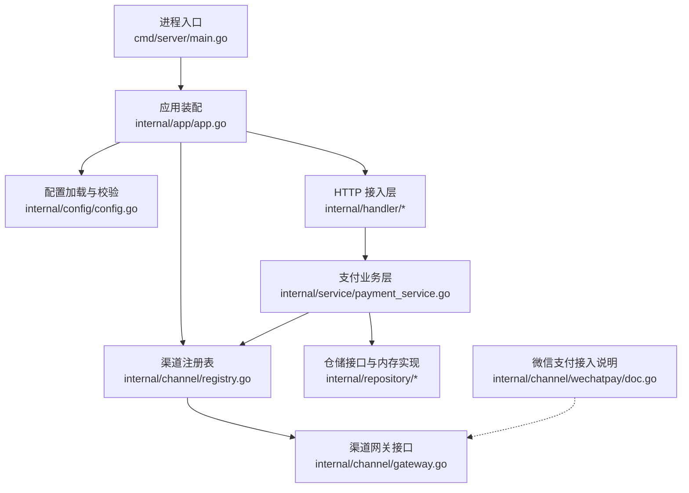
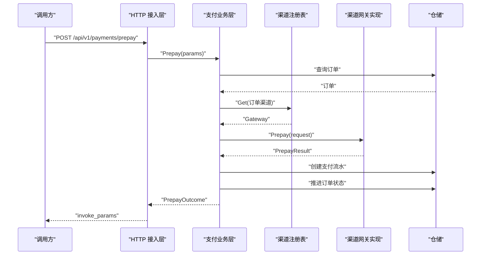
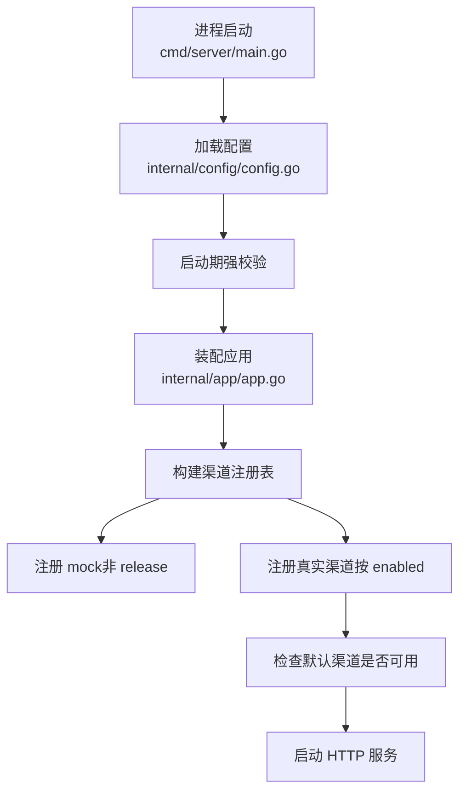
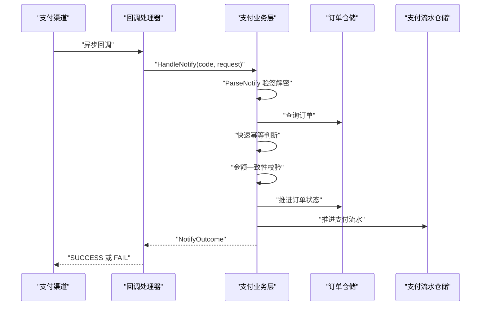
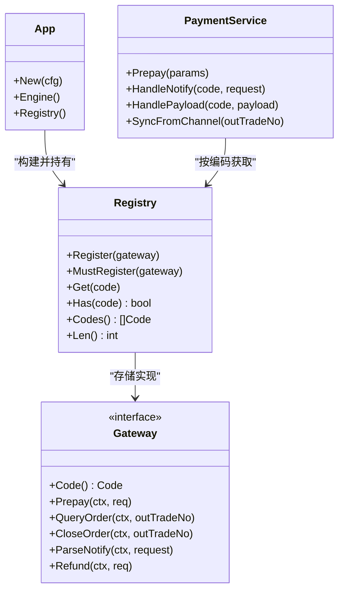

# 渠道扩展指南

<cite>
**本文引用的文件**   
- [README.md](file://README.md)
- [gateway.go](file://internal/channel/gateway.go)
- [registry.go](file://internal/channel/registry.go)
- [app.go](file://internal/app/app.go)
- [config.go](file://internal/config/config.go)
- [config.yaml](file://configs/config.yaml)
- [main.go](file://cmd/server/main.go)
- [callback_handler.go](file://internal/handler/callback_handler.go)
- [payment_service.go](file://internal/service/payment_service.go)
- [doc.go](file://internal/channel/wechatpay/doc.go)
</cite>

## 目录
1. [引言](#引言)
2. [项目结构](#项目结构)
3. [核心组件](#核心组件)
4. [架构总览](#架构总览)
5. [详细实现步骤](#详细实现步骤)
6. [依赖与装配关系](#依赖与装配关系)
7. [性能与可靠性要求](#性能与可靠性要求)
8. [测试策略](#测试策略)
9. [发布前安全检查清单](#发布前安全检查清单)
10. [故障排查指南](#故障排查指南)
11. [结论](#结论)

## 引言
本指南面向需要新增支付渠道的开发者，目标是给出「从接口定义到注册上线」的完整标准流程。本项目通过 `channel.Gateway` 抽象层把渠道差异收敛在统一接口之后：业务层只关心订单、流水和状态机，不感知具体 SDK；新增渠道只需实现接口并在注册表中登记，服务启动时按配置决定是否启用。

当前仓库默认使用 `mock` 渠道跑通下单、发起支付、模拟回调、查单全流程；微信支付渠道仅保留接入说明文档，尚未提供真实实现。因此生产模式（`release`）下若未实现并注册真实渠道，服务会直接启动失败，避免“带病运行”。

**章节来源**
- [README.md:1-11](file://README.md#L1-L11)
- [README.md:274-284](file://README.md#L274-L284)

## 项目结构
新增渠道涉及的核心位置如下：

**图表来源**
- [main.go:31-56](file://cmd/server/main.go#L31-L56)
- [app.go:45-105](file://internal/app/app.go#L45-L105)
- [config.go:118-154](file://internal/config/config.go#L118-L154)
- [registry.go:11-29](file://internal/channel/registry.go#L11-L29)
- [gateway.go:189-218](file://internal/channel/gateway.go#L189-L218)
- [payment_service.go:34-73](file://internal/service/payment_service.go#L34-L73)
- [doc.go:1-14](file://internal/channel/wechatpay/doc.go#L1-L14)

**章节来源**
- [README.md:38-62](file://README.md#L38-L62)
- [main.go:1-23](file://cmd/server/main.go#L1-L23)
- [app.go:1-12](file://internal/app/app.go#L1-L12)

## 核心组件
新增渠道必须围绕以下三个核心概念展开：

| 概念 | 作用 | 关键约束 |
|---|---|---|
| `channel.Code` | 渠道编码，用于注册表索引和日志输出 | 新增渠道需声明常量，并通过 `Valid()` 白名单校验 |
| `channel.Gateway` | 渠道抽象接口，屏蔽微信、支付宝等差异 | 所有方法必须尊重上下文取消与超时 |
| `channel.Registry` | 运行时渠道注册表，按编码查找实现 | 重复注册报错，缺失返回“未注册”错误 |

Gateway 接口定义了六个必需方法：

| 方法 | 输入 | 输出 | 语义 |
|---|---|---|---|
| `Code()` | 无 | `channel.Code` | 返回渠道编码 |
| `Prepay(ctx, PrepayRequest)` | 统一下单请求 | `PrepayResult` + error | 向渠道发起支付，返回前端调起参数 |
| `QueryOrder(ctx, outTradeNo)` | 商户订单号 | `NotifyPayload` + error | 主动查单，返回交易当前状态 |
| `CloseOrder(ctx, outTradeNo)` | 商户订单号 | error | 关闭渠道侧订单 |
| `ParseNotify(ctx, *http.Request)` | 原始回调请求 | `NotifyPayload` + error | 验签、解密、解析为统一通知结构 |
| `Refund(ctx, RefundRequest)` | 退款请求 | `RefundResult` + error | 申请退款 |

**章节来源**
- [gateway.go:20-28](file://internal/channel/gateway.go#L20-L28)
- [gateway.go:189-218](file://internal/channel/gateway.go#L189-L218)
- [registry.go:11-29](file://internal/channel/registry.go#L11-L29)

## 架构总览
下图展示新增渠道后，一次典型支付的生命周期：

**图表来源**
- [payment_handler.go:26-51](file://internal/handler/payment_handler.go#L26-L51)
- [payment_service.go:99-225](file://internal/service/payment_service.go#L99-L225)
- [registry.go:63-74](file://internal/channel/registry.go#L63-L74)
- [gateway.go:194-199](file://internal/channel/gateway.go#L194-L199)

**章节来源**
- [README.md:64-83](file://README.md#L64-L83)
- [payment_service.go:99-225](file://internal/service/payment_service.go#L99-L225)

## 详细实现步骤

### 第一步：定义渠道编码
新增渠道首先要在 `channel` 包中声明编码常量，并把新编码加入 `Code.Valid()` 白名单。这样既能保证日志可读，又能防止非法编码进入系统。

建议做法：
- 新增一个稳定的小写英文编码，例如 `newpay`。
- 在 `Code` 常量区添加该值。
- 在 `Valid()` 中增加对应分支。
- 保持与服务端配置中的默认渠道或业务侧传入渠道一致。

如果新增的是微信支付实现，则可直接复用现有 `CodeWechatPay`；如果是全新第三方渠道，则需要新增编码。

**章节来源**
- [gateway.go:20-38](file://internal/channel/gateway.go#L20-L38)

### 第二步：实现 Gateway 接口
新建渠道实现包，例如 `internal/channel/newpay`，实现 `Gateway` 接口的全部六个方法。每个方法的职责如下：

| 方法 | 实现要点 |
|---|---|
| `Code()` | 返回新增的渠道编码 |
| `Prepay()` | 构造渠道下单请求，设置金额单位为“分”，设置回调地址，返回前端调起参数 |
| `QueryOrder()` | 根据商户订单号查询渠道交易状态，映射为统一的 `NotifyPayload` |
| `CloseOrder()` | 调用渠道关单接口，失败返回错误 |
| `ParseNotify()` | **必须完成验签与解密**，再解析出 `NotifyPayload` |
| `Refund()` | 调用渠道退款接口，返回退款结果 |

重要约束：
- 所有 HTTP 调用必须绑定上下文，支持取消与超时。
- 金额一律以“分”为单位，禁止使用浮点数。
- `ParseNotify()` 不能跳过验签；验签失败应返回错误，不能把不可信报文交给业务层。
- `QueryOrder()` 与 `ParseNotify()` 返回同一结构，确保主动查单与回调处理逻辑一致。

**章节来源**
- [gateway.go:80-102](file://internal/channel/gateway.go#L80-L102)
- [gateway.go:131-153](file://internal/channel/gateway.go#L131-L153)
- [gateway.go:189-218](file://internal/channel/gateway.go#L189-L218)
- [doc.go:9-14](file://internal/channel/wechatpay/doc.go#L9-L14)

### 第三步：处理业务逻辑与错误返回
渠道实现不应自行决定订单状态机流转，而应把渠道侧的状态映射为 `NotifyPayload.TradeState`，由 `service.PaymentService.HandlePayload` 统一处理。

你需要重点理解以下规则：

| 场景 | 行为 |
|---|---|
| 回调已支付且本地已支付 | 视为幂等命中，返回成功 |
| 回调金额与订单金额不一致 | 拒绝置为已支付，返回金额不一致错误 |
| 非成功状态 | 根据状态关闭订单、标记支付失败或保持待决 |
| 主动查单 | 复用回调处理路径，避免两套逻辑不一致 |

金额一致性校验是资金安全红线：一旦允许不一致金额进入已支付分支，就可能发生串单、篡改金额或掉单对账问题。

**章节来源**
- [payment_service.go:258-379](file://internal/service/payment_service.go#L258-L379)
- [payment_service.go:381-415](file://internal/service/payment_service.go#L381-L415)
- [payment_service.go:548-582](file://internal/service/payment_service.go#L548-L582)

### 第四步：将新渠道注册到 Registry
注册发生在应用装配阶段，由 `internal/app/app.go` 中的 `buildRegistry` 负责。

如果你新增的是微信支付实现，需要在 `buildRegistry` 中：
- 判断 `cfg.Channels.WechatPay.Enabled`。
- 实例化你的 `wechatpay.Gateway`。
- 调用 `registry.Register` 或 `registry.MustRegister`。
- 同时确保 `payment.default_channel` 指向该渠道。

如果你新增的是其他渠道，也需要在 `buildRegistry` 中按配置条件注册，并保证默认渠道可用。

注意：
- 重复注册同一编码会报错，而不是静默覆盖。
- 启动期推荐使用 `MustRegister`，让配置错误直接导致进程启动失败。
- release 模式下 mock 渠道不会被注册，因此必须有真实渠道可用。

**章节来源**
- [app.go:108-152](file://internal/app/app.go#L108-L152)
- [registry.go:31-61](file://internal/channel/registry.go#L31-L61)

### 第五步：修改配置文件与服务启动流程
配置文件位于 `configs/config.yaml`，环境变量映射集中在 `internal/config/config.go` 的 `bindEnvs`。

新增渠道通常需要调整：
- `payment.default_channel`：改为新渠道编码。
- `channels.<your_channel>.enabled`：设为 `true`。
- 渠道专属配置项：如商户号、证书路径、公钥 ID、回调路径等。
- 敏感密钥：如微信支付 APIv3 密钥，只能从环境变量注入，不得写入 yaml。

服务启动流程如下：

**图表来源**
- [main.go:31-56](file://cmd/server/main.go#L31-L56)
- [config.go:118-154](file://internal/config/config.go#L118-L154)
- [config.go:226-268](file://internal/config/config.go#L226-L268)
- [app.go:108-152](file://internal/app/app.go#L108-L152)

**章节来源**
- [config.yaml:9-60](file://configs/config.yaml#L9-L60)
- [config.go:178-207](file://internal/config/config.go#L178-L207)
- [config.go:226-268](file://internal/config/config.go#L226-L268)
- [main.go:31-56](file://cmd/server/main.go#L31-L56)

### 第六步：结构化配置与环境变量映射
配置采用“环境变量 > yaml > 默认值”的优先级。新增渠道的配置结构应遵循现有模式：

| 层级 | 示例字段 | 说明 |
|---|---|---|
| `channels` | `newpay.enabled` | 是否启用该渠道 |
| `channels.newpay` | `merchant_id`、`api_key_path` 等 | 渠道凭据与连接参数 |
| `payment` | `default_channel` | 默认渠道编码 |
| `payment` | `notify_base_url` | 回调域名前缀 |
| `channels.newpay` | `notify_path` | 回调相对路径 |

敏感字段（如 APIv3 密钥）应像微信支付一样，不在 yaml 中暴露，只从环境变量读取。这样可以降低误提交风险，也便于审计。

**章节来源**
- [config.go:39-111](file://internal/config/config.go#L39-L111)
- [config.go:178-207](file://internal/config/config.go#L178-L207)
- [config.yaml:42-60](file://configs/config.yaml#L42-L60)

### 第七步：回调处理的幂等性与金额一致性
回调处理链路如下：

关键点：
- 回调可能并发到达，必须在锁外做快速判断，并在状态推进前再次判断。
- 幂等命中仍应答成功，否则渠道会持续重试。
- 金额不一致必须拒绝，不能为了“让渠道停止重试”而放行。
- 验签失败属于安全事件，应触发告警，不能降级为普通内部错误。

**图表来源**
- [callback_handler.go:44-86](file://internal/handler/callback_handler.go#L44-L86)
- [payment_service.go:258-379](file://internal/service/payment_service.go#L258-L379)

**章节来源**
- [README.md:193-201](file://README.md#L193-L201)
- [callback_handler.go:14-26](file://internal/handler/callback_handler.go#L14-L26)
- [callback_handler.go:55-86](file://internal/handler/callback_handler.go#L55-L86)
- [payment_service.go:277-379](file://internal/service/payment_service.go#L277-L379)

### 第八步：代码模板与示例实现参考
由于仓库中微信支付尚未实现，无法直接复制真实代码。你可以按以下模板组织实现：

| 文件 | 内容 |
|---|---|
| `internal/channel/<your_channel>/gateway.go` | 实现 `Gateway` 接口 |
| `internal/channel/<your_channel>/client.go` | 封装渠道 SDK 或 HTTP 客户端 |
| `internal/channel/<your_channel>/signer.go` | 签名、验签、解密逻辑 |
| `internal/channel/<your_channel>/mapper.go` | 渠道状态到统一状态的映射 |
| `internal/app/app.go` | 按配置注册新渠道 |
| `configs/config.yaml` | 新增渠道配置项 |
| `internal/config/config.go` | 新增环境变量映射与校验 |

示例实现可参考微信支付占位文档中的接入说明，以及 mock 渠道的行为边界：mock 能跑通链路，但不应被当作生产安全实现。

**章节来源**
- [doc.go:1-33](file://internal/channel/wechatpay/doc.go#L1-L33)
- [README.md:274-284](file://README.md#L274-L284)

## 依赖与装配关系
新增渠道后，依赖关系应保持单向：

**图表来源**
- [registry.go:21-106](file://internal/channel/registry.go#L21-L106)
- [gateway.go:189-218](file://internal/channel/gateway.go#L189-L218)
- [payment_service.go:34-73](file://internal/service/payment_service.go#L34-L73)
- [app.go:31-37](file://internal/app/app.go#L31-L37)

**章节来源**
- [registry.go:11-29](file://internal/channel/registry.go#L11-L29)
- [app.go:108-152](file://internal/app/app.go#L108-L152)
- [payment_service.go:108-131](file://internal/service/payment_service.go#L108-L131)

## 性能与可靠性要求

### 性能特性
- 注册表读多写少，使用读写锁保护，适合启动一次性注册、运行期频繁查找的场景。
- 渠道 HTTP 调用必须设置超时，避免网络抖动耗尽 goroutine 与连接池。
- 主动查单应作为兜底机制，不应替代回调；高频轮询应优先读本地状态。
- 金额计算使用“分”整数，避免浮点精度问题。

### 可靠性特性
- 回调幂等：已支付订单重复回调必须原样返回成功。
- 金额一致性：回调金额与订单金额不一致时必须拒绝。
- 状态机：订单与支付流水的状态流转由领域模型控制，业务层不直接拼接状态字符串。
- 优雅关闭：服务收到退出信号后等待存量请求完成，避免中断正在处理的回调。

**章节来源**
- [registry.go:11-29](file://internal/channel/registry.go#L11-L29)
- [gateway.go:189-193](file://internal/channel/gateway.go#L189-L193)
- [payment_service.go:301-333](file://internal/service/payment_service.go#L301-L333)
- [main.go:98-117](file://cmd/server/main.go#L98-L117)

## 测试策略

### 单元测试
- 验证 `Gateway.Code()` 返回稳定编码。
- 验证 `Prepay` 的请求构造是否正确，尤其是金额单位、回调地址、交易类型。
- 验证 `ParseNotify` 对合法报文的解析结果。
- 验证验签失败、解密失败、空报文、非法金额等异常分支。
- 验证 `QueryOrder` 返回的 `NotifyPayload` 与渠道状态映射正确。

### 集成测试
- 使用 mock 渠道或本地可复现的渠道沙箱。
- 覆盖完整链路：下单 → 发起支付 → 回调成功 → 查单。
- 覆盖失败链路：渠道下单失败、回调失败、金额不一致、验签失败。
- 验证 release 模式下 mock 路由不注册。

### 端到端测试
- 模拟真实渠道回调，包括多次重试。
- 并发回调场景下验证幂等性：只有第一次真正推进状态。
- 验证金额不一致时订单不会变成已支付。
- 验证主动查单能同步本地状态。
- 验证服务优雅关闭期间不丢失回调。

**章节来源**
- [README.md:118-134](file://README.md#L118-L134)
- [README.md:286-294](file://README.md#L286-L294)
- [payment_service.go:301-379](file://internal/service/payment_service.go#L301-L379)

## 发布前安全检查清单

| 检查项 | 要求 |
|---|---|
| 渠道编码 | 已在 `Code` 常量与 `Valid()` 中声明 |
| Gateway 实现 | 六个方法全部实现，无遗漏 |
| 验签与解密 | `ParseNotify` 必须完成，失败返回错误 |
| 金额单位 | 全程使用“分”，不使用浮点数 |
| 金额一致性 | 回调金额与订单金额不一致时拒绝 |
| 回调幂等 | 已支付订单重复回调返回成功 |
| 配置校验 | 启动期校验失败应阻止服务启动 |
| 敏感信息 | 密钥只从环境变量注入，不写入 yaml |
| 证书文件 | 生产环境校验文件存在且可读 |
| 回调地址 | release 模式下必须是 HTTPS |
| mock 路由 | release 模式不注册调试路由 |
| 默认渠道 | 已注册且可用 |
| 日志安全 | 不打印密钥、证书内容与完整回调报文 |

**章节来源**
- [README.md:240-246](file://README.md#L240-L246)
- [config.go:226-320](file://internal/config/config.go#L226-L320)
- [app.go:112-132](file://internal/app/app.go#L112-L132)

## 故障排查指南

| 现象 | 可能原因 | 排查方向 |
|---|---|---|
| release 模式启动失败 | 没有可用渠道 | 检查是否实现并注册真实渠道，确认 `payment.default_channel` |
| 渠道未注册 | 未在 `buildRegistry` 中注册 | 查看注册日志与 `registry.Codes()` |
| 回调一直重试 | 验签失败或返回了非 SUCCESS | 检查 `ParseNotify` 与回调响应格式 |
| 订单已支付但缺少流水 | 先推进订单后推进流水失败 | 检查流水更新逻辑与日志 |
| 金额不一致告警 | 回调金额与订单金额不同 | 核对前端金额、优惠券、串单、篡改 |
| 并发回调重复推进 | 缺少锁内二次判断 | 检查状态推进前的幂等判断 |
| 主动查单与回调结果不一致 | 两套处理逻辑不同 | 确保共用 `HandlePayload` |
| 配置生效不符合预期 | 环境变量覆盖或映射错误 | 检查 `bindEnvs` 与启动日志 |

常见错误码含义：
- `40001`：支付渠道未注册。
- `40002`：支付渠道调用失败。
- `40003`：支付回调验签或解密失败。
- `30002`：回调金额与订单金额不一致。

**章节来源**
- [README.md:136-158](file://README.md#L136-L158)
- [registry.go:63-74](file://internal/channel/registry.go#L63-L74)
- [callback_handler.go:55-86](file://internal/handler/callback_handler.go#L55-L86)
- [payment_service.go:320-333](file://internal/service/payment_service.go#L320-L333)

## 结论
新增支付渠道的标准路径可以概括为：**定义编码 → 实现 Gateway → 映射状态 → 注册到 Registry → 配置环境变量 → 启动校验 → 回调幂等与金额校验 → 测试覆盖 → 发布安全检查**。

这套设计的核心价值在于：业务层与渠道实现解耦，新增渠道不影响既有代码；启动期强校验避免“带病上线”；回调与查单共用处理路径，降低状态不一致风险；金额与验签两条防线共同守护资金安全。

对于微信支付，仓库已预留明确接入位置与安全红线；对于其他渠道，应遵循相同模式，把差异收敛在 `channel` 层，让服务具备可扩展、可测试、可审计的能力。