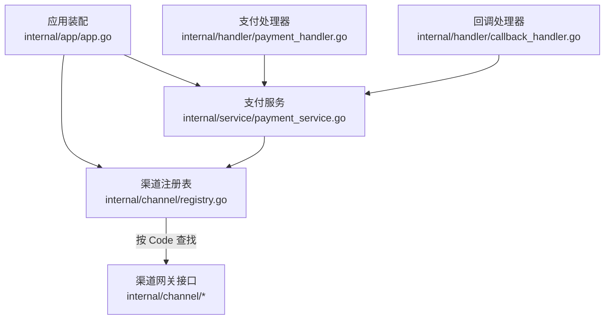
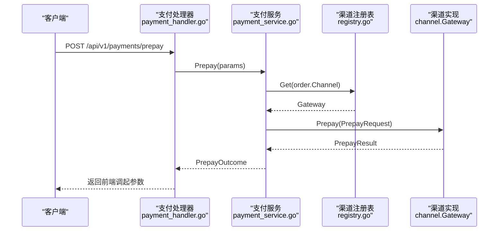
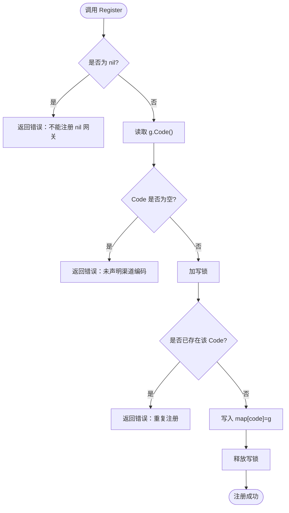
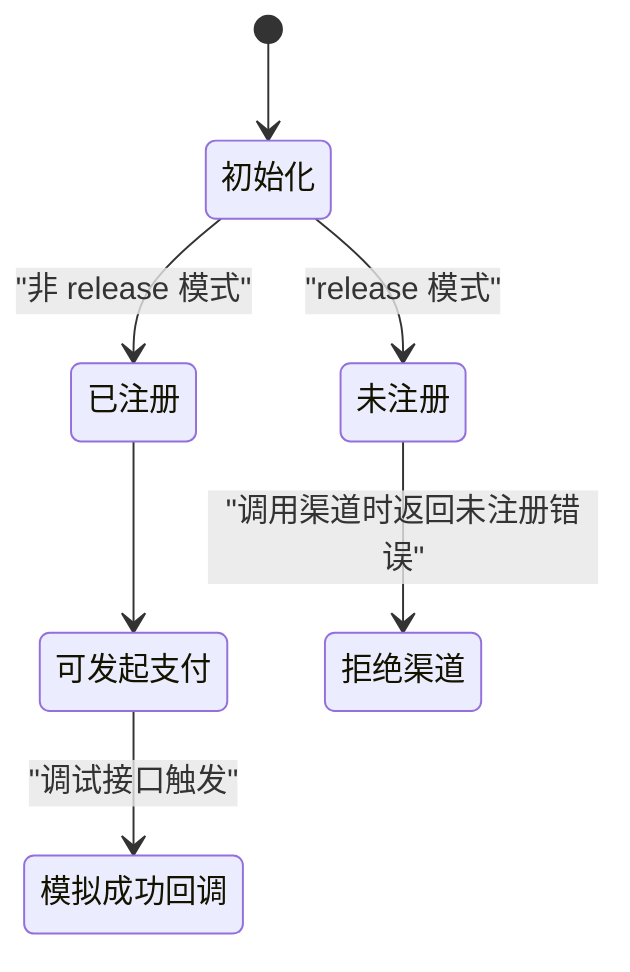
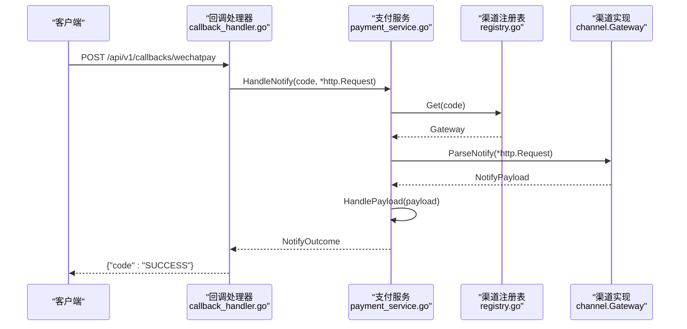
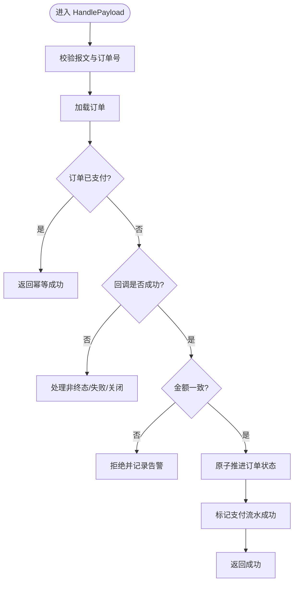
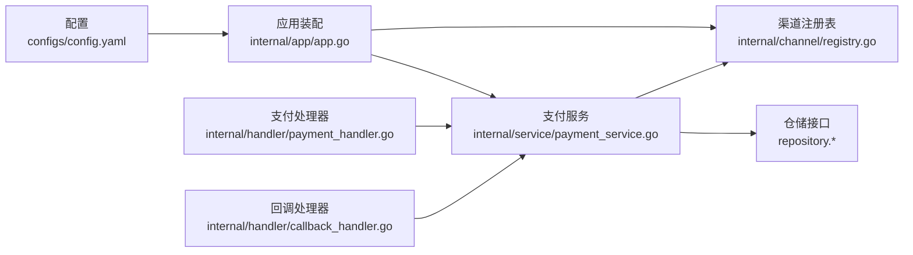

# 渠道抽象层

<cite>
**本文引用的文件**   
- [internal/channel/registry.go](file://internal/channel/registry.go)
- [internal/app/app.go](file://internal/app/app.go)
- [internal/service/payment_service.go](file://internal/service/payment_service.go)
- [internal/handler/payment_handler.go](file://internal/handler/payment_handler.go)
- [internal/handler/callback_handler.go](file://internal/handler/callback_handler.go)
- [internal/dto/payment.go](file://internal/dto/payment.go)
- [internal/channel/wechatpay/doc.go](file://internal/channel/wechatpay/doc.go)
- [configs/config.yaml](file://configs/config.yaml)
- [README.md](file://README.md)
</cite>

## 目录
1. [引言](#引言)
2. [项目结构](#项目结构)
3. [核心组件](#核心组件)
4. [架构总览](#架构总览)
5. [详细组件分析](#详细组件分析)
6. [依赖关系分析](#依赖关系分析)
7. [性能与可靠性](#性能与可靠性)
8. [故障排查指南](#故障排查指南)
9. [结论](#结论)
10. [附录：微信支付接入与安全要点](#附录微信支付接入与安全要点)

## 引言
本文件聚焦项目的核心设计亮点——渠道抽象层。它通过统一的 Gateway 接口屏蔽不同支付渠道的差异，配合并发安全的渠道注册表，让服务在运行期按配置选择具体实现；同时为微信支付等真实渠道预留了清晰的扩展点，并提供 Mock 渠道用于开发与测试。文档将系统说明 Gateway 的六个方法职责、注册表工作原理、Mock 行为、微信支付接入流程与安全红线，并给出新增渠道的标准步骤和最佳实践。

## 项目结构
渠道抽象层位于 internal/channel，包含：
- 渠道接口与类型定义（Gateway、Code、TradeType、PrepayRequest、PrepayResult、NotifyPayload、InvokeParams 等）
- 并发安全的渠道注册表 Registry
- 占位的微信支付包 wechatpay/doc.go，提供接入指引与安全要求
- mock 子包（骨架阶段默认启用，用于端到端联调）

应用装配入口 internal/app/app.go 负责根据配置构建 Registry，并在非 release 模式下注册 mock 渠道；当配置声明启用微信支付但未实现时，启动会直接失败，避免“配置可用但实际不可用”的危险状态。

**图示来源**
- [internal/app/app.go:45-106](file://internal/app/app.go#L45-L106)
- [internal/channel/registry.go:11-24](file://internal/channel/registry.go#L11-L24)
- [internal/service/payment_service.go:34-46](file://internal/service/payment_service.go#L34-L46)
- [internal/handler/payment_handler.go:16-24](file://internal/handler/payment_handler.go#L16-L24)
- [internal/handler/callback_handler.go:34-42](file://internal/handler/callback_handler.go#L34-L42)

**章节来源**
- [internal/app/app.go:45-106](file://internal/app/app.go#L45-L106)
- [configs/config.yaml:30-61](file://configs/config.yaml#L30-L61)

## 核心组件
- Gateway 接口：统一抽象所有支付渠道的能力，包括获取渠道编码、发起支付、查询订单、关闭订单、解析通知、退款。
- Registry 注册表：并发安全地维护 Code 到 Gateway 的映射，支持注册、查询、枚举已注册渠道。
- PaymentService：业务编排层，封装下单、回调处理、查单兜底、金额校验与幂等控制。
- Handler 层：HTTP 入口，负责参数绑定、响应转换与渠道应答格式适配。
- DTO 层：对外请求与响应的数据模型，屏蔽内部领域对象。

**章节来源**
- [README.md:162-179](file://README.md#L162-L179)
- [internal/channel/registry.go:11-24](file://internal/channel/registry.go#L11-L24)
- [internal/service/payment_service.go:34-46](file://internal/service/payment_service.go#L34-L46)
- [internal/handler/payment_handler.go:16-24](file://internal/handler/payment_handler.go#L16-L24)
- [internal/dto/payment.go:10-42](file://internal/dto/payment.go#L10-L42)

## 架构总览
渠道抽象层是服务中唯一的“渠道接缝”。service 层只依赖 channel.Gateway 接口，不感知任何 SDK 或渠道细节；handler 层仅做协议适配与响应转换；Registry 把“哪些渠道可用”变成运行期数据，由 app 装配阶段按配置决定。

**图示来源**
- [internal/handler/payment_handler.go:32-50](file://internal/handler/payment_handler.go#L32-L50)
- [internal/service/payment_service.go:108-163](file://internal/service/payment_service.go#L108-L163)
- [internal/channel/registry.go:63-74](file://internal/channel/registry.go#L63-L74)

## 详细组件分析

### Gateway 接口与六个方法职责
Gateway 是渠道抽象的核心，六个方法分别承担以下职责与参数约定：
- Code(): 返回渠道编码，作为 Registry 的索引键。必须唯一且稳定，不能为空。
- Prepay(ctx, PrepayRequest): 向渠道发起下单，返回 PrepayResult，其中包含前端调起支付所需的参数（如 prepay_id、invoke_params、code_url 等）。
- QueryOrder(ctx, outTradeNo): 主动查询订单状态，返回 NotifyPayload，语义与回调一致，便于复用同一处理路径。
- CloseOrder(ctx, outTradeNo): 关闭订单，通常用于超时未支付场景。
- ParseNotify(ctx, *http.Request): 解析并验签渠道异步通知，返回 NotifyPayload。必须接收原始 http.Request，以便读取签名相关请求头。
- Refund(ctx, RefundRequest): 发起退款，返回 RefundResult。

这些方法的输入输出被 service 层直接使用，从而屏蔽渠道差异。QueryOrder 与 ParseNotify 共用 NotifyPayload，确保“回调与查单”对同一笔交易的处理结论一致。

**章节来源**
- [README.md:162-179](file://README.md#L162-L179)
- [internal/service/payment_service.go:153-163](file://internal/service/payment_service.go#L153-L163)
- [internal/service/payment_service.go:263-274](file://internal/service/payment_service.go#L263-L274)
- [internal/service/payment_service.go:571-581](file://internal/service/payment_service.go#L571-L581)

### 渠道注册表 Registry 的工作原理
Registry 使用 RWMutex 保护 map[Code]Gateway，保证并发安全：
- Register(g): 校验 g 不为 nil、g.Code() 不为空；若重复注册同一 code，直接返回错误，防止覆盖导致的不确定状态。
- MustRegister(g): 启动期强约束，失败则 panic，避免带着残缺渠道集合对外服务。
- Get(code): 按编码取 Gateway，不存在返回 ErrChannelNotRegistered。
- Has(code)/Codes()/Len(): 查询是否注册、列出所有编码（排序以保证日志与健康检查输出稳定）、统计数量。

**图示来源**
- [internal/channel/registry.go:31-52](file://internal/channel/registry.go#L31-L52)

**章节来源**
- [internal/channel/registry.go:11-24](file://internal/channel/registry.go#L11-L24)
- [internal/channel/registry.go:31-52](file://internal/channel/registry.go#L31-L52)
- [internal/channel/registry.go:63-98](file://internal/channel/registry.go#L63-L98)

### Mock 渠道的实现与作用
Mock 渠道用于开发与测试，使整条链路可端到端跑通。它在非 release 模式下被自动注册，允许创建订单、发起支付、模拟支付成功回调等。生产环境禁用 mock，以避免“假订单”混入报表与资金流。

**图示来源**
- [internal/app/app.go:108-121](file://internal/app/app.go#L108-L121)

**章节来源**
- [internal/app/app.go:108-121](file://internal/app/app.go#L108-L121)
- [README.md:74-75](file://README.md#L74-L75)

### 支付下单与回调主流程
- 下单：PaymentHandler 接收请求，调用 PaymentService.Prepay；service 校验订单可支付、生成支付流水、从 Registry 获取对应 Gateway 并调用 Prepay；成功后推进流水与订单状态。
- 回调：CallbackHandler 接收渠道通知，调用 PaymentService.HandleNotify；service 先通过 Gateway.ParseNotify 完成验签与解密，再进入 HandlePayload 进行幂等判断、金额校验与状态推进。
- 查单兜底：PaymentHandler.QueryStatus 支持 sync=true 强制同步；service 通过 Gateway.QueryOrder 拉取渠道状态，复用 HandlePayload 保证一致性。

**图示来源**
- [internal/handler/callback_handler.go:44-86](file://internal/handler/callback_handler.go#L44-L86)
- [internal/service/payment_service.go:263-274](file://internal/service/payment_service.go#L263-L274)
- [internal/channel/registry.go:63-74](file://internal/channel/registry.go#L63-L74)

**章节来源**
- [internal/handler/payment_handler.go:32-85](file://internal/handler/payment_handler.go#L32-L85)
- [internal/service/payment_service.go:108-226](file://internal/service/payment_service.go#L108-L226)
- [internal/service/payment_service.go:263-379](file://internal/service/payment_service.go#L263-L379)
- [internal/service/payment_service.go:548-581](file://internal/service/payment_service.go#L548-L581)

### 回调幂等与金额一致性
- 幂等：微信会按固定间隔重试通知，同一笔交易可能多次到达。HandlePayload 在锁外快速判断已支付订单，并在 Mutate 回调内再次判断，命中则返回 idempotent=true，让渠道停止重试。
- 金额一致性：在推进订单状态前严格比较回调金额与订单金额，不一致立即拒绝，防止篡改金额或串单导致的资金事故。

**图示来源**
- [internal/service/payment_service.go:282-379](file://internal/service/payment_service.go#L282-L379)

**章节来源**
- [internal/service/payment_service.go:301-333](file://internal/service/payment_service.go#L301-L333)
- [internal/service/payment_service.go:342-379](file://internal/service/payment_service.go#L342-L379)

## 依赖关系分析
- app 装配层依赖 config、logger、repository、service、handler、router 与 channel.mock。
- service 层依赖 repository、channel.Registry 与 errcode。
- handler 层依赖 service、dto、pkg/response 与 pkg/logger。
- channel 层独立于上层业务，仅暴露 Gateway 接口与 Registry。

**图示来源**
- [internal/app/app.go:45-106](file://internal/app/app.go#L45-L106)
- [internal/service/payment_service.go:34-46](file://internal/service/payment_service.go#L34-L46)
- [internal/handler/payment_handler.go:16-24](file://internal/handler/payment_handler.go#L16-L24)
- [internal/handler/callback_handler.go:34-42](file://internal/handler/callback_handler.go#L34-L42)

**章节来源**
- [internal/app/app.go:45-106](file://internal/app/app.go#L45-L106)
- [internal/service/payment_service.go:34-46](file://internal/service/payment_service.go#L34-L46)

## 性能与可靠性
- 注册表读多写少，使用 RWMutex，开销可忽略；Codes() 排序保证输出稳定，便于 diff 排查配置漂移。
- 查询支付状态默认只读本地数据，避免高频轮询触发渠道限流；sync=true 才主动查单，适合定时任务批量对齐。
- 回调处理采用“锁外快速判断 + 锁内二次判断”的幂等策略，减少数据库竞争与重复处理。
- 金额全程以分（int64）表示，避免浮点精度问题；对外同时返回元字符串与分整数，兼顾展示与计算。

**章节来源**
- [internal/channel/registry.go:85-98](file://internal/channel/registry.go#L85-L98)
- [internal/service/payment_service.go:528-546](file://internal/service/payment_service.go#L528-L546)
- [internal/service/payment_service.go:301-333](file://internal/service/payment_service.go#L301-L333)
- [README.md:203-205](file://README.md#L203-L205)

## 故障排查指南
- 渠道未注册：Get(code) 返回 ErrChannelNotRegistered，常见于配置启用了某渠道但未实现或未注册。
- 重复注册：Register 检测到相同 code 直接报错，需检查装配逻辑是否重复注册。
- 回调验签失败：ParseNotify 原样返回错误，上层不得降级为内部错误，否则会丢失安全告警信号。
- 金额不一致：HandlePayload 明确拒绝并记录告警，需人工介入核对订单与回调金额。
- 回调应答格式：必须返回渠道规范 {"code":"SUCCESS"/"FAIL"}，否则渠道会持续重试。

**章节来源**
- [internal/channel/registry.go:63-74](file://internal/channel/registry.go#L63-L74)
- [internal/channel/registry.go:31-52](file://internal/channel/registry.go#L31-L52)
- [internal/service/payment_service.go:268-274](file://internal/service/payment_service.go#L268-L274)
- [internal/service/payment_service.go:320-333](file://internal/service/payment_service.go#L320-L333)
- [internal/handler/callback_handler.go:14-26](file://internal/handler/callback_handler.go#L14-L26)

## 结论
渠道抽象层通过 Gateway 接口与 Registry 注册表，将渠道差异收敛在最小边界，使 service 层专注于业务编排与资金安全。Mock 渠道保障开发体验，微信支付占位包提供清晰接入指引。幂等与金额一致性是回调处理的两大安全支柱；查单与回调共用处理路径，确保掉单兜底的可靠性。新增渠道只需实现 Gateway 并注册到 Registry，无需改动上层业务。

## 附录：微信支付接入与安全要点

### 证书模式与公钥模式的差异
- 证书模式：适用于老商户号，需要定期下载并轮换平台证书；SDK 的 AutoAuthCipher 会自动处理证书管理。
- 公钥模式：新申请商户号的默认方式，使用固定不变的微信支付公钥，简化密钥管理。
- 两种模式的区别在于回调验签使用的公钥来源不同，配置结构已预留两套字段，接入时二选一。

**章节来源**
- [internal/channel/wechatpay/doc.go:16-36](file://internal/channel/wechatpay/doc.go#L16-L36)

### 验签流程与 APIv3 密钥管理
- 回调验签与解密是安全边界，必须使用官方 SDK 提供的验签能力，不得自行拼字符串算签名。
- ParseNotify 必须接收原始 *http.Request，以便读取 Wechatpay-Signature/Timestamp/Nonce/Serial 等请求头。
- APIv3 密钥用于回调报文的 AES-256-GCM 解密，严禁写入配置文件，只能通过环境变量注入。
- 私钥文件 apiclient_key.pem 只能下载一次，必须放在 certs/ 下并被 gitignore 排除。

**章节来源**
- [internal/channel/wechatpay/doc.go:63-74](file://internal/channel/wechatpay/doc.go#L63-L74)
- [internal/channel/wechatpay/doc.go:88-104](file://internal/channel/wechatpay/doc.go#L88-L104)
- [configs/config.yaml:54-61](file://configs/config.yaml#L54-L61)

### 新增支付渠道的标准流程
1. 实现 Gateway 接口的六个方法：Code、Prepay、QueryOrder、CloseOrder、ParseNotify、Refund。
2. 在 internal/app/app.go 的装配逻辑中按 channels.<channel>.enabled 注册实现。
3. 更新 configs/config.yaml，启用对应渠道并填写必要凭据（不含敏感项）。
4. 保持 service 层与 handler 层不变——这是渠道抽象层存在的意义。

**章节来源**
- [internal/channel/wechatpay/doc.go:9-14](file://internal/channel/wechatpay/doc.go#L9-L14)
- [internal/app/app.go:123-132](file://internal/app/app.go#L123-L132)
- [configs/config.yaml:42-61](file://configs/config.yaml#L42-L61)

### 渠道扩展的最佳实践与安全红线
- 最佳实践
  - 所有渠道通过 Registry 注册，禁止硬编码分支。
  - QueryOrder 与 ParseNotify 返回一致的 NotifyPayload，复用同一处理路径。
  - 金额全程使用分（int64），对外同时返回元字符串与分整数。
  - 回调处理坚持“锁外快速判断 + 锁内二次判断”的幂等模式。
- 安全红线
  - 回调验签与解密不可省略，不得降级为内部错误。
  - 金额不一致必须拒绝并触发告警，不允许静默放行。
  - 私钥与 APIv3 密钥不得落盘到仓库或配置文件，仅通过环境变量注入。
  - 日志严禁打印密钥、证书内容与完整回调报文。

**章节来源**
- [README.md:193-205](file://README.md#L193-L205)
- [internal/channel/wechatpay/doc.go:97-104](file://internal/channel/wechatpay/doc.go#L97-L104)
- [internal/service/payment_service.go:320-333](file://internal/service/payment_service.go#L320-L333)
- [internal/handler/callback_handler.go:62-75](file://internal/handler/callback_handler.go#L62-L75)